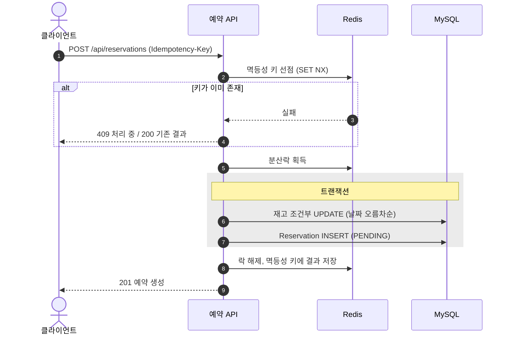
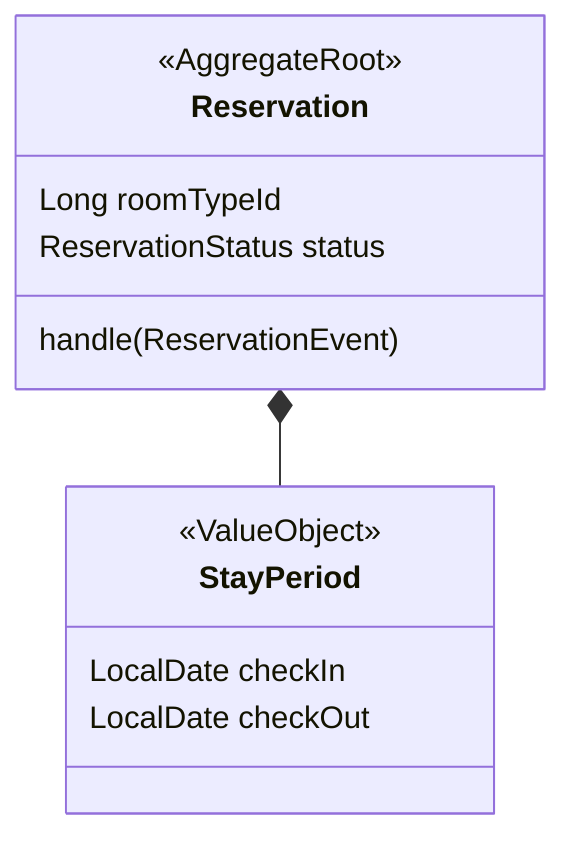
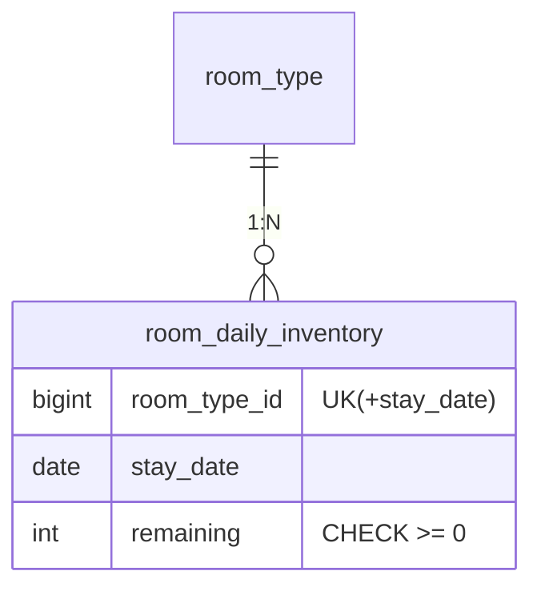
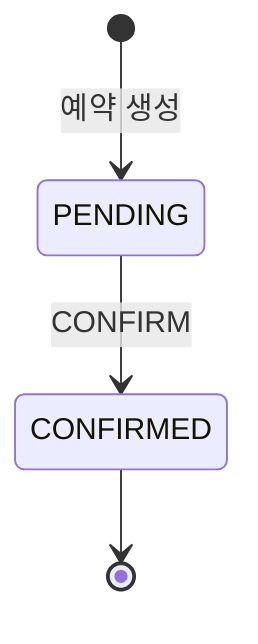

# 다이어그램 표기 규칙

문서에서 시퀀스·도메인 모델·DB 설계·상태머신을 다룰 때는 글만 쓰지 않고 **Mermaid 표준 다이어그램**을 함께 넣는다. 2026-08-14 시안 비교(A 표준형 / B 그룹·색상형 / C 커스텀 HTML / D 최소+표)에서 관리자가 A를 선정했다 (ADR-0005).

## 목적별 다이어그램 종류

| 내용 | Mermaid 종류 | 필수 여부 |
|---|---|---|
| 유스케이스 시퀀스 (API 호출 순서 포함) | `sequenceDiagram` | 스펙의 핵심 유스케이스마다 필수 |
| 도메인 모델 | `classDiagram` | 스펙의 도메인 모델링 절에 필수 |
| DB 설계 (ERD) | `erDiagram` | 스펙의 DB 설계 절에 필수 |
| 상태머신 | `stateDiagram-v2` | 상태가 있는 애그리거트마다 필수 |
| 그 외 흐름·구조 | `flowchart` | 필요할 때만 |

## 작성 규칙

- **장식 없이 표준형으로 그린다.** classDef 색상, subgraph 꾸미기는 쓰지 않는다. (시안 B를 기각한 이유: 관리자 가독성 기준)
- **커스텀 HTML 블록은 쓰지 않는다.** GitHub과 Bear에서 렌더링되지 않는다.
- 다이어그램은 뼈대를 보여주고, **세부(전체 컬럼, 실패 조건, 예외)는 표가 담당한다.** 그림에 모든 정보를 욱여넣지 않는다.
- 시퀀스에는 `autonumber`를 켜고, 실패 분기는 `alt` 블록으로 표기한다. 트랜잭션 구간은 `rect`로 감싼다.
- classDiagram에서 애그리거트 루트는 `<<AggregateRoot>>`, VO는 `<<ValueObject>>` 스테레오타입을 붙인다. 애그리거트 간 관계는 객체 참조가 아니라 "ID로만 참조"임을 주석으로 명시한다.
- erDiagram의 컬럼 주석에 UK·CHECK 같은 제약을 표기하고, 상세 제약·인덱스 근거는 밑의 표로 쓴다.
- **다이어그램과 표·본문이 어긋나면 안 된다.** 전이 표를 고치면 stateDiagram도 같이 고친다. 리뷰어는 이 일치를 검사한다.
- **다이어그램의 설명은 문단이 아니라 다이어그램 안의 코멘트 또는 표로 쓴다.** erDiagram은 컬럼 주석 자리(`int remaining "잔여 수량 CHECK>=0"`)에 한국어 설명을 직접 넣고, 관계선 라벨도 한국어로 쓴다. classDiagram처럼 내부 코멘트가 마땅치 않으면 바로 아래에 표(구성 요소 | 무엇인가 | 왜 이렇게 두나)로 정리한다. 줄글 해설 문단은 쓰지 않는다. 코드 식별자는 영어 그대로 두되 표에 한국어 이름을 병기한다.

## 표준 예시

### 시퀀스

### 도메인 모델

### ERD

### 상태머신

## 렌더링 확인

Mermaid는 GitHub 웹과 Claude 세션 패널에서 그려진다. Bear에서는 코드 블록으로 보인다. 관리자 검토용으로 보낼 때는 세션 패널(SendUserFile) 또는 GitHub 링크를 함께 준다.
