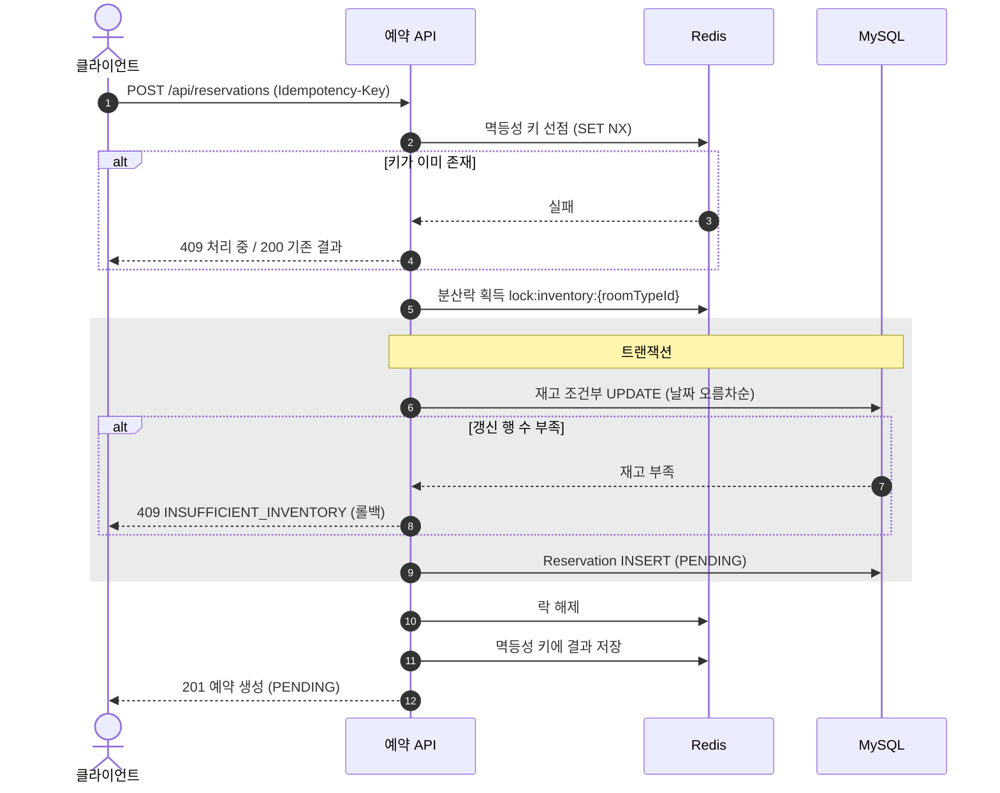
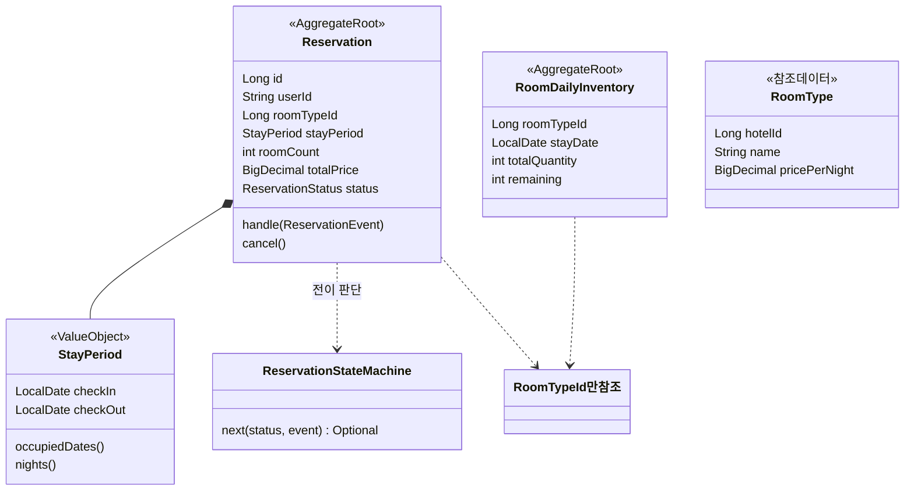
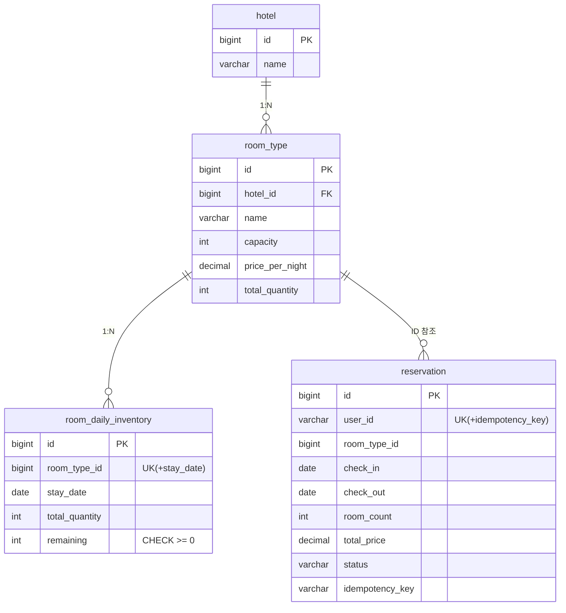
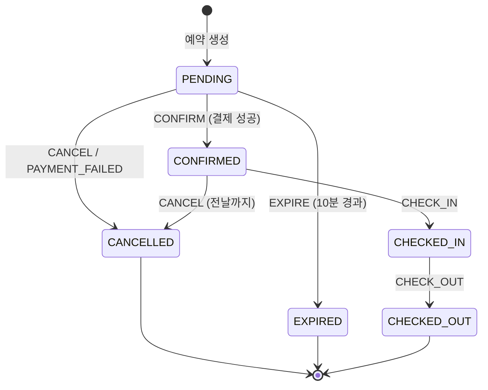
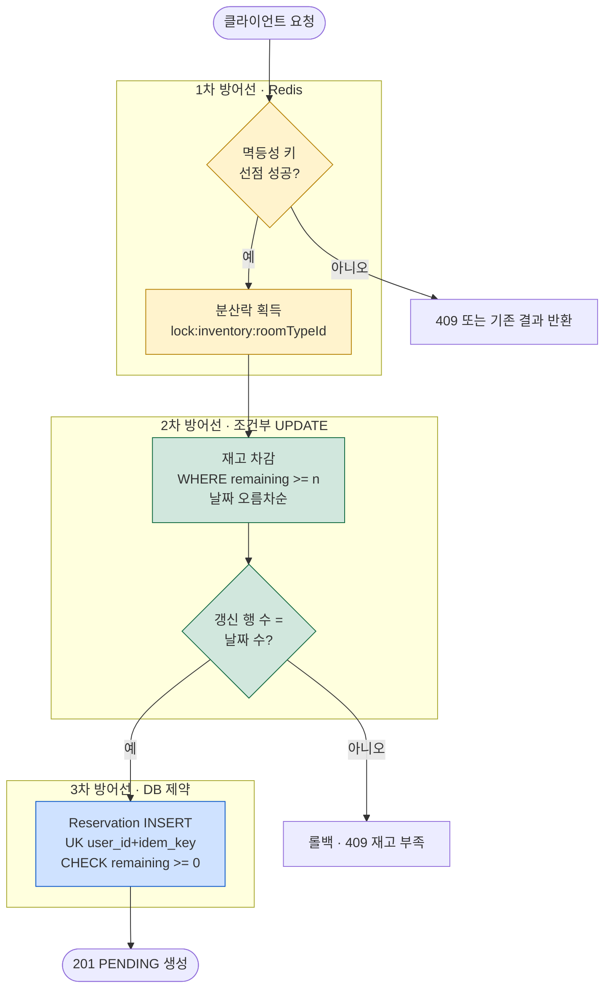
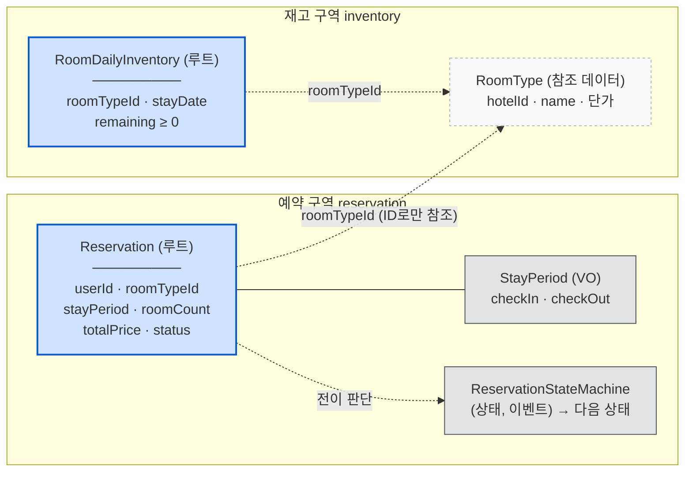
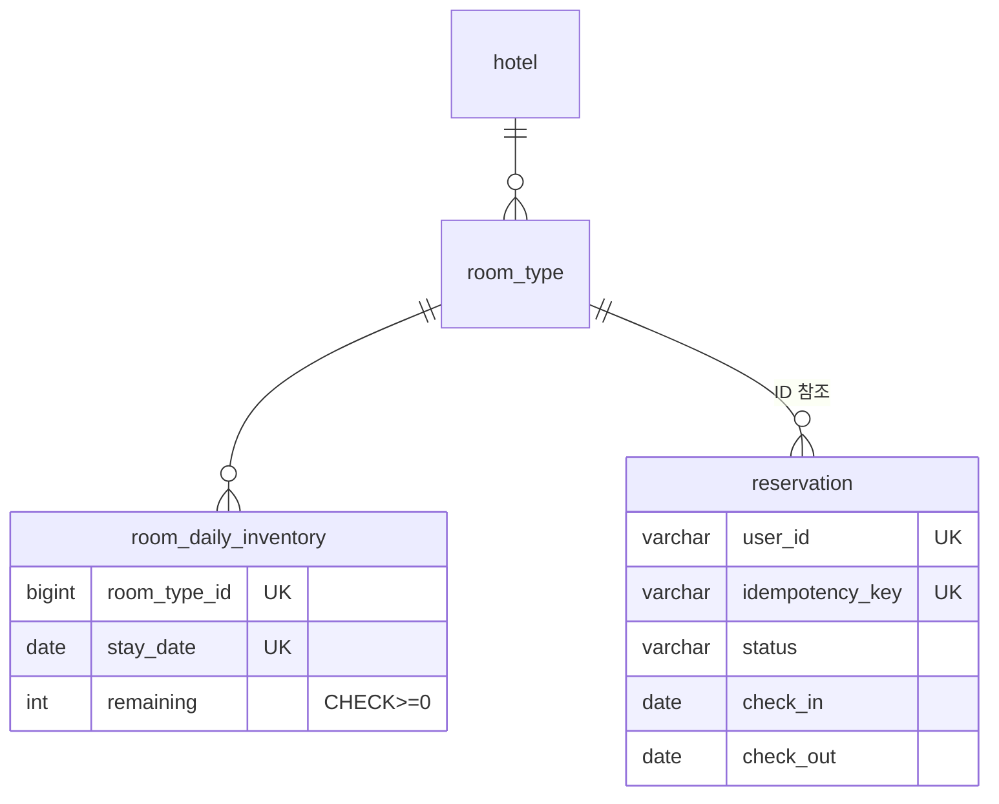
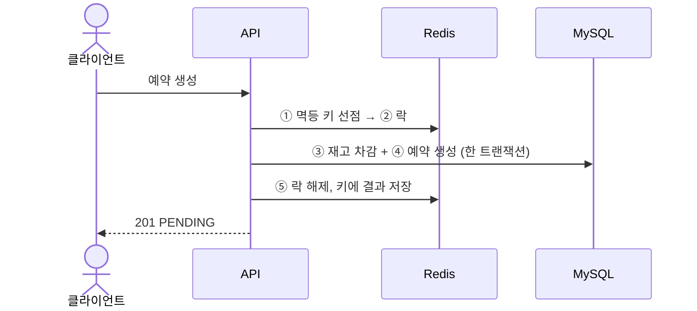
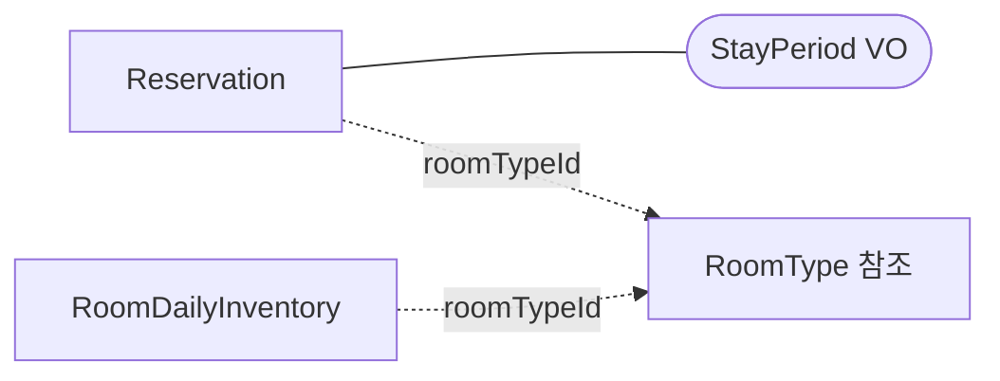
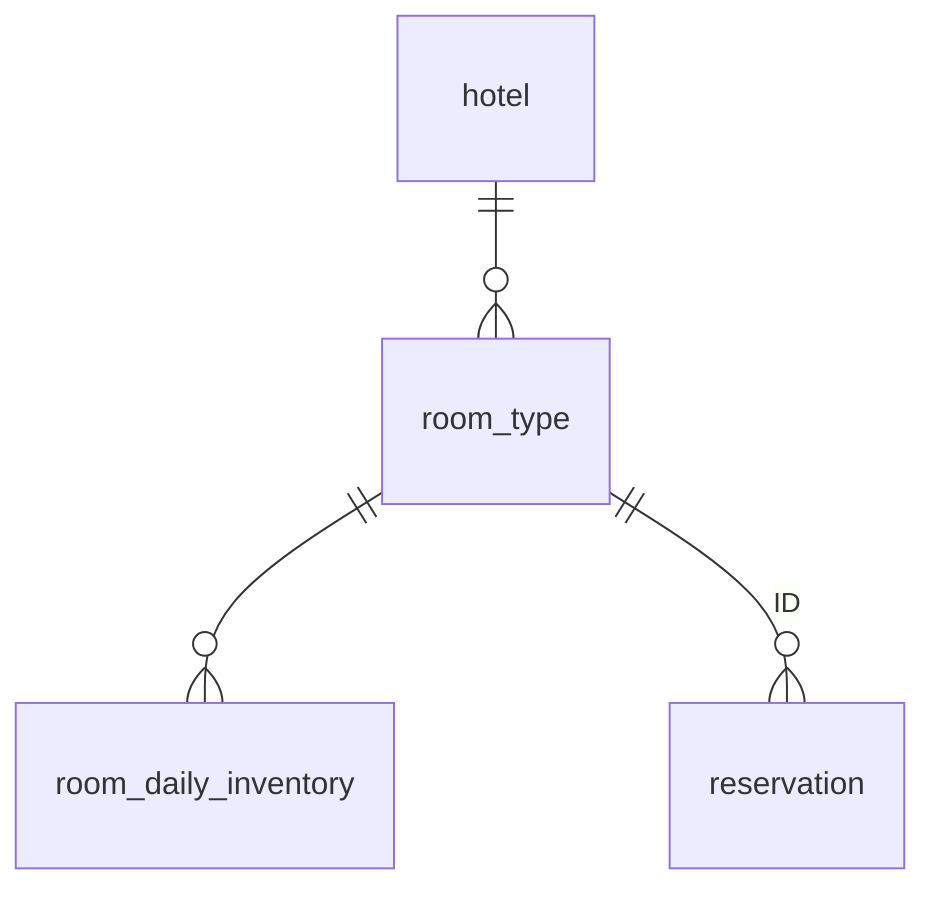

# 다이어그램 표기 시안

문서 작성 규칙 선정용 비교 문서다. 같은 내용(F01 예약 생성 시퀀스, 도메인 모델, ERD, 상태머신)을 네 방식으로 그렸다. 하나를 고르면 그 방식이 하네스 규칙이 된다.

**렌더링 호환성 (중요)**

| 시안 | GitHub 웹 | Claude 세션 패널 | Bear |
|---|---|---|---|
| A. Mermaid 표준형 | 그려짐 | 그려짐 | 코드로만 보임 |
| B. Mermaid 그룹·색상형 | 그려짐 | 그려짐 | 코드로만 보임 |
| C. 커스텀 HTML 카드형 | **안 그려짐** (HTML 제거됨) | 그려짐 | 안 그려짐 |
| D. Mermaid + 상세 표 병기 | 그려짐 | 그려짐 | 표만 보임 |

---

# 시안 A. Mermaid 표준형

각 목적에 맞는 mermaid 기본 다이어그램을 장식 없이 쓴다.

## A-1. 시퀀스 (UC-2 예약 생성)

## A-2. 도메인 모델

## A-3. ERD

## A-4. 상태머신

---

# 시안 B. Mermaid 그룹·색상형

방어 계층·구역(컨텍스트) 같은 구조를 subgraph와 색으로 강조한다.

## B-1. 흐름도 (UC-2, 방어선 강조)

## B-2. 도메인 모델 (구역 강조)

## B-3. ERD (핵심 컬럼만 + 제약은 표로)

| 제약 | 대상 | 역할 |
|---|---|---|
| UNIQUE | (room_type_id, stay_date) | 재고 행 유일성 |
| CHECK remaining >= 0 | room_daily_inventory | 초과 판매 최후 방어선 |
| UNIQUE | (user_id, idempotency_key) | 중복 예약 최후 방어선 |

---

# 시안 C. 커스텀 HTML 카드형

색·배치 자유도가 가장 높다. 단 **GitHub와 Bear에서는 안 보인다.**

## C-1. 시퀀스 (단계 카드)

  

    
클라이언트

    
예약 API

    
Redis

    
MySQL

  

  

    <b>1. 멱등성 키 선점</b> API → Redis 
    <code>SET idem:{user}:{key} NX</code> 실패 시: 처리 중이면 <b style="color:#dc3545;">409</b>, 완료면 기존 결과 반환
  

  

    <b>2. 분산락 획득</b> API → Redis · <code>lock:inventory:{roomTypeId}</code> · 1차 방어선
  

  

    <b style="color:#146c43;">트랜잭션</b>
    

      <b>3. 재고 차감</b> · 날짜 오름차순 조건부 UPDATE (<code>WHERE remaining ≥ n</code>) · 2차 방어선 
      갱신 행 부족 → <b style="color:#dc3545;">전체 롤백, 409 재고 부족</b>
    

    

      <b>4. Reservation INSERT</b> (PENDING) · UNIQUE 멱등 키 = 3차 방어선
    

  

  

    <b>5. 락 해제 → 멱등성 키에 결과 저장</b>
  

  

    <b>6. 응답</b> · <b style="color:#146c43;">201</b> 예약 생성 (PENDING, 결제 기한 10분)
  

## C-2. 도메인 모델 (애그리거트 카드)

  

    
<b>Reservation</b> · 애그리거트 루트

    

      
불변식: 상태는 전이 표 경로로만 변경

      

      userId · roomTypeId · roomCount · totalPrice · status
      

        <b>StayPeriod</b> (VO) checkIn · checkOut
      

      

        <b>ReservationStateMachine</b> (상태,이벤트)→다음
      

    

  

  

    
<b>RoomDailyInventory</b> · 애그리거트 루트

    

      
불변식: remaining ≥ 0

      

      roomTypeId · stayDate · totalQuantity · remaining
    

  

  

    <b>Hotel · RoomType</b> — 시드 참조 데이터. 두 애그리거트 모두 roomTypeId(ID)로만 참조. 객체 참조 금지.
  

## C-3. ERD (테이블 카드)

  

    
<b>room_daily_inventory</b>

    

      PK id 
      UK room_type_id, stay_date 
      total_quantity 
      remaining CHECK ≥ 0
    

  

  

    
<b>reservation</b>

    

      PK id 
      UK user_id, idempotency_key 
      room_type_id · check_in · check_out 
      room_count · total_price · status 
      IX (status, created_at)
    

  

  

    
<b>room_type</b> (시드)

    

      PK id 
      FK hotel_id 
      name · capacity · price_per_night
    

  

---

# 시안 D. Mermaid 최소 + 상세 표 병기

다이어그램은 구조·흐름의 뼈대만 보여주고, 세부(컬럼, 조건, 예외)는 바로 밑 표가 담당한다. 그림이 작아서 안 깨지고, 세부는 검색 가능한 텍스트로 남는다.

## D-1. 시퀀스

| 단계 | 실패 조건 | 응답 | 부작용 |
|---|---|---|---|
| ① 멱등 키 | 키 존재(처리 중) | 409 REQUEST_IN_PROGRESS | 없음 |
| ① 멱등 키 | 키 존재(완료) | 200 기존 결과 | 없음 |
| ② 락 | 대기 초과 | 503 LOCK_ACQUISITION_FAILED | 없음 |
| ③ 재고 | 갱신 행 < 날짜 수 | 409 INSUFFICIENT_INVENTORY | 롤백 |
| ④ INSERT | 멱등 키 UNIQUE 충돌 | 200 기존 예약 조회 반환 | 롤백 |

## D-2. 도메인 모델

| 애그리거트 | 불변식 | 구성 요소 |
|---|---|---|
| Reservation | 전이 표 밖 상태 변경 금지 | StayPeriod(VO), status, ReservationStateMachine |
| RoomDailyInventory | remaining ≥ 0 | (roomTypeId, stayDate) 단위 수량 |

## D-3. ERD

| 테이블 | 주요 컬럼 | 제약·인덱스 |
|---|---|---|
| room_daily_inventory | room_type_id, stay_date, remaining | UK(type,date), CHECK remaining≥0 |
| reservation | user_id, idempotency_key, status, 기간 | UK(user,idem_key), IX(status,created_at) |
| room_type / hotel | 시드 데이터 | FK hotel_id |
