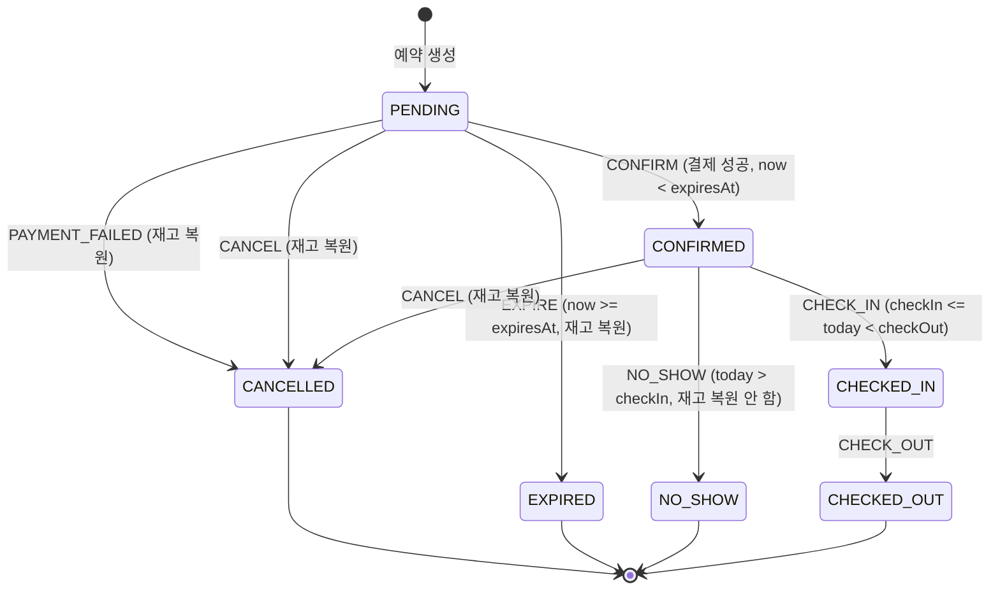

# F04 부하테스트 시나리오 설계

- 상태: 승인 대기 (D1·D3~D7 PM 승인 완료, D2 해결. 관리자 최종 확인 대기)
- 작성일: 2026-08-15
- 개정: 2026-08-15 — F01 API 계약 확정본 반영, S1-C·S4-B 신설
- 승인일:
- 근거 문서: `docs/spec/00-problem-and-scope.md`, `docs/briefings/F04.md`, `.claude/skills/load-test/SKILL.md`, `docs/architecture/coding-rules.md`, PM 전달 F01 계약 확정본(2026-08-15)

## 1. 이 문서가 정하는 것

**무엇을 어떤 부하로 때리고, 무엇을 참으로 판정할 것인가**를 확정한다. 판정 기준은 API 형태와 무관하게 성립해야 하므로, 계약이 뒤집혀도 이 문서의 뼈대는 그대로 남는다 (바뀌는 것은 `load-test/config.js` 한 파일이다).

시나리오마다 아래 넷을 숫자로 못박는다.

1. **부하 모델** — 얼마나 많은 요청을 어떤 곡선으로 꽂는가
2. **불변식** — 부하가 끝난 뒤 반드시 참이어야 하는 명제
3. **불변식 검증 쿼리** — 그 명제를 DB에서 직접 확인하는 SQL
4. **임계값** — 지연·에러율의 합격선

**불변식과 임계값은 급이 다르다.** 불변식은 하드 게이트다. 하나라도 깨지면 그 시나리오는 실패이고 리포트에 실패로 쓴다. 임계값은 참고선이다. 로컬 머신에서 잰 수치라 못 넘겼다고 설계가 틀린 것은 아니며, 못 넘긴 이유를 병목 분석으로 설명하면 된다.

## 2. 증명 대상과 시나리오 매핑

브리핑의 명제 (가)~(라)에 시나리오를 건다. **어느 명제에도 걸리지 않는 시나리오는 만들지 않는다.**

| 시나리오 | 증명하는 명제 | 등급 | 의존 |
|---|---|---|---|
| S1 재고 경합 (순간 집중) | (가) 초과 판매 0 | 필수 | F01 |
| S1-C 재고 경합 (부분 소진, `roomCount` 혼합) | (가) 초과 판매 0 | 필수 | F01 |
| S2 재고 경합 (지속 부하) | (가) 초과 판매 0 | 필수 | F01 |
| S3 멱등성 폭주 | (나) 중복 예약 0 | 필수 | F01 |
| S4 상태 전이 경합 (취소×확정) | (다) 금지 전이 0 | 필수 | F01 |
| S4-B 상태 전이 경합 (만료×확정) | (다) 금지 전이 0 | 필수 | F01 |
| S5 락 유무 대조 | (라) 상대 비교 + (가) | 필수 | F01 + `pms.lock.enabled` |
| S6 혼합 지속 부하 (재고 누수 검출) | (가)(다) 종합 | 필수 | F01 |
| S7 프로모션 스파이크 | (가) 스파이크 형태 | 조건부 | F02 |
| S8 조회 폭주 속 예약 · 캐시 유무 대조 | (라) 상대 비교 | 조건부 | F03 캐시 |
| L5 캐시 스탬피드 관찰 | — (관찰 전용) | 조건부 | F03 캐시 |

**S1~S6은 F01 하나만 병합되면 전부 돌아간다.** 00 문서 D4의 절단 순서(F03 캐시 → UC-6 → F02)가 발동해도 명제 (가)(나)(다)와 (라)의 락 대조는 그대로 증명된다.

일정이 극단적으로 밀릴 때의 내부 절단 순서: **S8 → S7 → S6 → S1-C → S2.** S1·S3·S4·S4-B·S5는 자르지 않는다. 이들이 네 명제의 최소 집합이다.

## 3. 공통 규약

### 3-1. 응답 코드를 어떻게 셀 것인가

부하테스트에서 가장 쉽게 틀리는 지점이다. **거절은 에러가 아니다.**

| 응답 | 의미 | 성능 지표에서 | 불변식 판정에서 |
|---|---|---|---|
| 201 | 예약 생성 성공 | 성공 | 성공 건수로 센다. **이 수가 재고와 맞아야 한다** |
| 200 (생성 API) | **멱등 재요청.** 저장된 결과를 그대로 반환 | 성공 | 새 예약이 아니다. 별도로 센다 |
| 200 (확정 API, 본문 `status: CANCELLED`) | **결제 거절.** 실패가 아니라 정상 처리 결과다 | 실패로 세지 않는다 | 정상. 재고 복원 대상이다 |
| 200 (전이 API, 상태 불변) | 멱등 전이 (이미 그 상태) | 성공 | 새 전이가 아니다. 별도로 센다 |
| 400 `INVALID_REQUEST` | 요청 자체가 틀림 (예: `guestCount` > 정원) | **실패로 센다** | **시나리오 설계 오류의 신호다.** §3-6 참조 |
| 409 `INSUFFICIENT_INVENTORY` | 재고 소진. **설계대로 동작한 것** | 실패로 세지 않는다 | 정상. (가)의 증거다 |
| 409 `DUPLICATE_REQUEST` / `REQUEST_IN_PROGRESS` | 멱등성 방어 작동 | 실패로 세지 않는다 | 정상. (나)의 증거다 |
| 409 `INVALID_STATE_TRANSITION` | 전이 표 밖 요청 거부 | 실패로 세지 않는다 | 정상. (다)의 증거다 |
| 503 `LOCK_ACQUISITION_FAILED` | 락 대기 상한 초과 | **실패로 센다** (별도 지표) | 불변식 위반은 아니다 |
| 5xx (503 락 실패 제외) | 진짜 장애 | 실패 | **한 건이라도 나오면 조사 대상** |

**결제 거절이 200이라는 점을 놓치면 안 된다.** `POST /api/reservations/{code}/confirm`은 결제가 거절돼도 HTTP 200을 주고 본문의 `status`가 `CANCELLED`가 된다. **HTTP 코드만 보고 성공을 세면 확정 성공률이 실제보다 부풀려진다.** 확정 계열 요청은 반드시 본문의 `status`까지 읽어 분류한다.

503 락 실패를 실패로 세는 이유: 사용자 입장에서는 재고가 있는데도 예약을 못 한 것이다. 정확성은 지켜졌지만 가용성은 깎였다. 이건 **락 설계의 비용**이고, S5 대조에서 정확히 이 값을 락 없는 쪽과 비교한다.

k6 구현: `http.setResponseCallback(http.expectedStatuses(200, 201, 409))`로 `http_req_failed`가 409를 실패로 세지 않게 하고, 400·503·5xx는 커스텀 카운터로 따로 센다.

### 3-2. 공통 커스텀 지표

모든 스크립트가 같은 이름으로 센다. 리포트에서 시나리오 간 비교가 가능해야 한다.

| 지표 | 세는 것 |
|---|---|
| `rsv_created` | 201 (신규 예약) |
| `rsv_replayed` | 200 + 생성 API (멱등 재요청 응답) |
| `transition_ok` | 200 + 전이 API + 상태가 실제로 바뀜 |
| `transition_idem` | 200 + 전이 API + 상태 불변 (멱등 전이 7칸) |
| `payment_declined` | 200 + 확정 API + 본문 `status: CANCELLED` (결제 거절) |
| `rej_inventory` | 409 INSUFFICIENT_INVENTORY |
| `rej_duplicate` | 409 DUPLICATE_REQUEST + REQUEST_IN_PROGRESS |
| `rej_transition` | 409 INVALID_STATE_TRANSITION |
| `bad_request` | 400 (시나리오 설계 오류 신호) |
| `lock_failed` | 503 LOCK_ACQUISITION_FAILED |
| `server_error` | 위에 해당하지 않는 5xx·연결 실패 |

**모든 시나리오의 1차 검산식:** 위 지표의 합 = 총 요청 수. 이게 안 맞으면 스크립트가 응답을 놓친 것이므로 결과 해석 전에 스크립트를 고친다.

**`bad_request`는 모든 시나리오에서 0이어야 한다.** 0이 아니면 앱 버그가 아니라 **내 시나리오가 잘못된 요청을 보내고 있다는 뜻**이다 (§3-6).

### 3-3. 데이터 격리

시나리오끼리 간섭하면 불변식 검증이 무의미해진다. **시나리오마다 다른 숙박 날짜를 쓴다.**

**그리고 객실타입도 시나리오마다 고른다.** F01 시드의 초기 `remaining`이 전부 `total_quantity`와 같으므로, 재고를 임의로 줄이는 대신 **필요한 재고 수를 가진 객실타입을 고른다.** 이렇게 해야 `reset.sh`가 만드는 상태가 완전 재시드(`docker compose down -v`) 결과와 정확히 같아지고, 보존식(`잔여 + 점유 = total_quantity`)이 그대로 성립한다. 재고를 손으로 바꾸면 보존식의 기준값이 무너진다.

| 시나리오 | 객실타입 | 재고 | 전용 날짜 |
|---|---|---|---|
| S1 | 3 스위트 | 10 | 2026-09-01 |
| S1-C | 5 오션뷰 스위트 | 20 | 2026-09-02 |
| S2 | 1 스탠다드 | 100 | 2026-09-03 |
| S3 | 1 스탠다드 | 100 | 2026-09-04 |
| S4 | 1 스탠다드 | 100 × 3일 | 2026-09-05 ~ 09-07 |
| S4-B | 1 스탠다드 | 100 × 4일 | 2026-09-08 ~ 09-11 |
| S5 | 1 스탠다드 | 100 | 2026-09-12 (락 ON) / 2026-09-13 (락 OFF) |
| **S7 (F02 특가)** | 1 스탠다드 | 특가 20 | **2026-09-14 ~ 09-16 (F02 점유)** |
| S6 | 전 타입 | 자연 재고 | 2026-09-21 ~ 2026-09-30 |
| S8 | 전 타입 | 자연 재고 | 2026-10-01 ~ 2026-10-10 |
| 체크인·노쇼 보조 | 1 스탠다드 | 100 | 2026-08-14 ~ 08-17 (오늘 근처여야 조건이 성립) |
| 재고 행 없음 확인 | — | — | 2026-10-30 이후 |

**S1이 스위트(10실)를 쓰는 이유:** 시드에서 재고가 가장 적은 타입이라 요청 200건으로 경합 배율 20배가 정확히 나온다. 재고가 넉넉한 타입을 쓰면 경합이 안 일어나 아무것도 증명하지 못한다.

**S4·S4-B가 날짜를 여러 개 쓰는 이유:** 300~400건의 PENDING 예약이 필요한데 한 타입의 하루 재고는 최대 100이다. 재고는 `(객실타입, 날짜)` 단위이므로 날짜를 늘려 확보한다. 이 두 시나리오는 재고 경합이 목적이 아니라 상태 전이 경합이 목적이라, 날짜를 흩어도 증명에 영향이 없다.

**9월 14~16일은 F02 특가가 점유했다.** 같은 `(객실타입, 날짜)`는 같은 재고 행이므로 일반 경합 시나리오에 이 날짜를 쓰면 서로의 결과를 오염시킨다. S5를 09-12·09-13으로 옮긴 이유다.

F01 시드 재고 범위는 **2026-08-01 ~ 2026-10-29 고정 날짜**다. `CURDATE()` 기반이 아니라서 몇 번을 재시드해도 정확히 같은 상태가 나온다. 위 날짜가 전부 이 범위 안에 있다.

### 3-4. 실행 전 초기화

**이전 실행의 잔여 데이터가 섞이면 불변식 검증이 전부 무의미하다.** 매 실행 전에 `load-test/reset.sh`를 돌린다.

```
0. 접속 대상이 localhost가 아니면 즉시 중단한다 (안전장치)
1. 해당 시나리오 날짜 대역의 예약 행 삭제
2. 해당 날짜 대역의 재고를 시나리오가 요구하는 초기값으로 UPDATE
3. Redis FLUSHDB (멱등성 키·분산락·캐시 전부 비움)
4. 초기 상태 검증 쿼리 실행 — 예약 0건, 재고 = 설정값. 여기서 안 맞으면 실행하지 않는다
```

3번을 빼먹으면 S3(멱등성)이 이전 실행의 키에 걸려 전부 409를 받는다. 반드시 넣는다.

**초기화가 건드리는 테이블 (PM 승인 D5 조건 4에 따른 명시)**

| 테이블 | 동작 | 소유 feature |
|---|---|---|
| `reservation` | 시나리오 날짜 대역 행 DELETE | F01 |
| `room_daily_inventory` | 시나리오 날짜 대역 `remaining` UPDATE | F01 |
| (예약 상태 이력 테이블, 존재 시) | 시나리오 날짜 대역 행 DELETE | F01 — 존재 여부 미확인 (§8 Q4) |
| (프로모션 재고 테이블) | S7 실행 시에만 초기값 UPDATE | F02 — 이름 미확정 (§8 Q7) |
| Redis 전체 | FLUSHDB | 공용 |

**마이그레이션 파일과 스키마는 절대 건드리지 않는다.** DDL을 실행하지 않으며 오직 DML만 한다. 위 목록에 없는 테이블을 초기화해야 할 상황이 생기면 스크립트를 고치기 전에 PM에게 보고한다. **F01이 테이블·컬럼을 바꾸면 이 표가 따라가야 하는 지점이므로, 표를 안 고치고 스크립트만 고치는 일이 없게 한다.**

### 3-5. 측정 노이즈 대응

로컬 한 대에서 앱·DB·k6가 함께 도는 환경이라 실행마다 값이 흔들린다.

- 모든 성능 측정 시나리오는 **워밍업 30초**(임계값·집계 제외) 후 본 부하를 건다. JIT 컴파일과 커넥션 풀 예열이 끝나야 한다
- **대조 시나리오(S5, S8)는 3회씩 돌려 중앙값을 채택한다.** 두 조건을 번갈아 실행해(ON→OFF→ON→OFF→ON→OFF) 시간대 편향을 줄인다
- 불변식 검증은 매 실행마다 한다. 3회 중 1회라도 깨지면 실패다

### 3-6. 400을 만들지 않는다 — 요청은 항상 유효해야 한다

인원 초과(`guestCount` > 정원 × `roomCount`)는 400이다. **부하테스트가 400을 받으면 그건 앱을 시험한 게 아니라 내가 잘못된 요청을 보낸 것이다.** 경합 지점에 도달하기도 전에 검증 단계에서 튕기므로, 그만큼 실제 경합 요청 수가 줄어 "성공 정확히 N건"의 분모가 조용히 망가진다.

방지 규약:

- 모든 시나리오는 `guestCount = 2 × roomCount`처럼 **정원 안쪽으로 안전하게** 잡는다. 정원을 꽉 채워 보내지 않는다
- 객실타입별 정원은 F01 시드값에서 읽어 `config.js`에 넣는다. 추측해서 넣지 않는다
- `checkOut > checkIn`을 스크립트가 보장한다. 날짜 계산은 `config.js`의 헬퍼 하나만 쓴다
- **`bad_request > 0`이면 그 실행 결과는 폐기한다.** 임계값 미달이 아니라 무효 실행으로 처리하고, 요청을 고쳐 다시 돌린다

### 3-7. 사용자 식별자 — 조용히 시나리오를 무효화하는 함정 둘

사용자 테이블이 없다. `X-User-Id`는 비어있지 않으면 아무 값이나 받고 검증도 조회도 하지 않는다. **검증이 없다는 것이 편한 게 아니라, 틀려도 아무도 안 알려준다는 뜻이다.** 두 가지를 스크립트가 직접 지켜야 한다.

**함정 1. 한 예약의 전이 요청은 그 예약을 만든 사용자로 보내야 한다.**

취소는 소유자를 검증하고, 남의 예약이면 403이 아니라 **404**를 준다. 확인번호의 존재 자체를 숨기려는 설계다. VU 번호를 그대로 사용자 ID로 쓰면 취소·확정이 **전부 404로 떨어진다.** 그런데 404는 "예약이 없다"로 읽혀서, 시나리오가 왜 실패하는지 찾는 데 한참 걸린다.

→ 대응: `setup()`이 `(확인번호, 소유자)` 쌍을 만들어 넘기고, VU는 그 소유자를 그대로 쓴다. **`not_found`를 하드 게이트 지표로 두어 0이 아니면 무효 실행으로 처리한다.**

**함정 2. 멱등 키는 `(userId, idempotencyKey)` 조합으로 저장된다.**

같은 키 문자열이라도 사용자가 다르면 **서로 다른 요청**으로 취급된다. S3에서 재시도마다 VU가 바뀌면 키가 전혀 충돌하지 않아 요청이 전부 성공한다. 그러면 "중복 예약 0건"이라는 결론이 나오는데, **멱등성이 작동해서가 아니라 애초에 중복 요청을 보내지 않아서**다. 통과했지만 아무것도 증명하지 못한 실행이 된다.

→ 대응: S3는 키마다 전용 사용자를 묶는다. 키 `i`의 50번 재시도는 전부 같은 사용자로 나간다.

**두 함정의 공통점은 실패가 조용하다는 것이다.** 함정 1은 시끄럽게 실패하지만 원인이 엉뚱해 보이고, 함정 2는 아예 초록불로 통과한다. 후자가 훨씬 위험하다.

### 3-8. 실행 환경의 한계 (리포트 필수 기재 사항)

시나리오를 설계하는 단계에서부터 못박아 둔다. **여기서 나올 숫자가 무엇의 근거가 되고 무엇의 근거가 못 되는지**를 미리 정해두지 않으면, 리포트를 쓸 때 절대값을 성능 주장으로 잘못 쓰게 된다.

- 앱, MySQL, Redis, k6가 **전부 같은 노트북 한 대**(Apple M2 8코어 / 16GB)에서 돈다. 부하 생성기가 피시험 대상과 CPU·메모리를 나눠 쓴다
- 그래서 처리량·지연의 **절대값은 이 시스템의 성능 한계가 아니다.** k6가 CPU를 뺏어 앱이 못 낸 성능일 수도 있고 그 반대일 수도 있으며, 이 환경에서는 둘을 분리할 수 없다
- **근거로 쓸 수 있는 것은 상대 비교다.** 같은 머신·같은 부하·같은 시각대에 조건 하나만 바꿔 잰 두 값의 차이(S5 락 유무, S8 캐시 유무)만이 설계 판단의 근거가 된다
- **정확성(불변식) 검증은 환경 한계와 무관하게 유효하다.** "재고 10에 성공 10건"은 머신이 느리든 빠르든 참이거나 거짓이다

리포트는 이 구분을 문장으로 명시한다. **성능 수치는 참고, 불변식 검증은 결론.**

리포트에 기록할 환경 항목: 머신 사양, 앱·DB·k6 동시 구동 사실, HikariCP 최대 커넥션(현재 20), MySQL 격리 수준(REPEATABLE-READ), k6 버전(v0.57.0), 실행 시각, 동시에 돌던 다른 프로세스.

**부하 프로파일에서 기본값과 다르게 설정한 값은 전부 기록한다.** 특히 S4-B의 `pms.reservation.hold-minutes`. 이게 없으면 나중에 누가 기본값 10분으로 재현하려다 아무 경합도 못 만들고 결과를 의심하게 된다.

### 3-9. 전 시나리오 공통 사후 검증

**모든 시나리오 실행 후 `load-test/verify/common.sql`을 먼저 돌린다.** 비용이 거의 없고, 어느 시나리오에서 샜는지도 알려준다.

| # | 검증 | 기대 |
|---|---|---|
| 1 | 예약당 재고 복원 이벤트가 두 번 이상 | 0행 |
| 2 | 종료 상태에 두 번 도달한 예약 | 0행 |
| 3 | **실제로 일어난 `(현재 상태, 이벤트, 다음 상태)` 조합** | **허용 8행의 부분집합** |
| 5 | 재고 음수 또는 총량 초과 행 | 0행 |

**3번이 명제 (다)에 대해 처음 기대했던 것의 절반을 돌려준다.**

거부된 전이는 예외로 트랜잭션이 롤백되므로 이력에 남지 않는다. 그래서 "금지 전이가 **시도됐다가 막혔다**"는 DB로 증명할 수 없다. 그런데 3번은 다른 것을 증명한다 — **표 밖의 전이가 실제로는 한 번도 일어나지 않았다.** 시도의 부재가 아니라 **결과의 부재**이고, 무엇보다 운영 데이터로 하는 증명이라 전수 테스트와 값이 다르다.

| 증명 수단 | 무엇을 보이는가 |
|---|---|
| F01의 전이 표 49칸 전수 테스트 | 코드가 거부하도록 짜여 있다 |
| **공통 검증 3번** | **실제 부하에서 한 건도 새지 않았다** |

리포트에 쓸 문장: **"부하테스트 중 발생한 N건의 상태 전이가 전부 전이 표 안에 있었다."**

**순서 판단은 `occurred_at`이 아니라 `id` 순번으로 한다.** 한 트랜잭션에서 읽은 `now`를 쓰므로 `occurred_at`이 같은 값일 수 있고, 시각으로 정렬하면 순서가 뒤집힌다.

### 3-10. 거짓 통과 점검 — 이 테스트가 통과했는데도 망가져 있을 수 있는 경우

부하테스트에서 가장 위험한 실패 모드는 실패가 아니다. **아무것도 증명하지 못한 초록불**이다. 실패는 눈에 띄지만 이건 안 띄고, 리포트에는 "검증 통과"로 적히며, 그 문장을 읽는 사람은 검증됐다고 믿는다.

그래서 시나리오마다 이 질문을 던져 대응을 붙였다.

| 시나리오 | 통과했는데도 망가져 있을 수 있는 경우 | 대응 |
|---|---|---|
| **S3** | 재시도마다 사용자가 달라 **애초에 중복 요청이 아니었다.** 전부 성공하고 "중복 0건"이 나온다 | 키마다 전용 사용자를 묶는다 (§3-7). `rsv_created == 키 개수`를 하드 게이트로 |
| **S6** | **두 번 깎고 두 번 되돌렸다.** 최종 잔여가 맞아떨어져 보존식을 통과한다 | 이력 줄 수로 복원이 예약당 한 번인지 센다 (I4) |
| **S1** | 요청이 실제로는 겹치지 않고 순차 도달했다. 재고가 10이면 당연히 10건 성공 | VU 200 × 1회로 도달 시점을 겹친다. `rej_inventory ≥ 180`으로 경합량을 확인 |
| **S4** | 두 요청이 안 겹쳐 금지 전이 상황 자체가 안 만들어졌다 | `rej_transition ≥ 1`을 하드 게이트로. 0이면 통과가 아니라 재실행 대상 |
| **S1-C** | 3실 요청이 전부 앞쪽에서 소진돼 경계 판정(`잔여 2에 3실`)이 한 번도 안 걸렸다 | 1·2·3실을 균등 혼합하고, 최종 잔여가 3 이상이면 실패로 본다 |
| **S2·S5** | 앱이 느려 도착률을 못 따라가 실제 부하가 목표보다 작았다 | 달성 RPS가 목표의 80% 미만이면 병목 분석 필수. 도착률 고정 모델을 쓰는 이유 |
| **S5** | **락 스위치가 실제로는 안 꺼졌다.** 두 회차가 같은 조건이라 "차이 없음"이 나온다 | 실행 전 `/actuator/env`로 값을 확인한다 |
| **S4-B** | `hold-minutes`가 길어 만료가 한 건도 안 일어났다 | `CONFIRMED + EXPIRED == 400`을 하드 게이트로. EXPIRED가 0이면 경합이 없었다 |
| **S7** | 특가가 아니라 **일반 재고가 먼저 바닥났다.** 성공 20건이 나와도 특가 제약 때문이 아니다 | 일반 재고 100실짜리를 대상으로 골라 여유를 둔다 |
| **S8** | 검색 조건이 흩어져 캐시 히트율이 0이었다. 캐시 ON/OFF가 사실상 같은 조건 | `cache_hit_rate`를 함께 싣는다. 집중·분산 두 회차를 비교 |
| **L5** | 조건이 흩어져 만료가 흩어졌다. 파도가 안 보인다 | 캐시 키를 하나로 고정한다 |

**공통 함정 하나 더.** 검증 SQL이 컬럼명 오타로 0행을 반환하면 그것도 "불변식 통과"로 읽힌다. `reset.sh`의 초기 상태 검증(예약 0건, 재고 = 설정값, **대상 재고 행 수 > 0**)이 그 1차 방어선이다. 쿼리가 실제로 데이터를 잡고 있는지 매번 확인한다.

## 4. 시나리오

### S1. 재고 경합 — 순간 집중 [필수 / 명제 (가)]

가장 단순하고 가장 중요한 시나리오다. 리포트의 첫 문장이 여기서 나온다.

**노리는 경합:** 같은 `(객실타입, 날짜)` 재고 행 하나에 요청이 한꺼번에 도달한다. 순진한 구현(조회 → 판단 → 저장)이라면 여기서 초과 판매가 난다.

| 항목 | 값 |
|---|---|
| 대상 | 예약 생성 API |
| 초기 재고 | **10실** — 객실타입 3 (스위트), 날짜 2026-09-01, 1박. 시드에서 재고가 가장 적은 타입이라 경합 배율 20배가 정확히 나온다 |
| 부하 모델 | `shared-iterations` — VU 200, iterations 200, maxDuration 60s |
| 총 요청 | 200건 (재고의 20배) |
| 지속 시간 | 수 초 (전량 소진까지) |
| 요청 구성 | 요청마다 서로 다른 `X-User-Id`(`user-1001`~`user-1200`), 서로 다른 `Idempotency-Key`(UUID), 전부 같은 객실타입·같은 날짜·1실 |

```
POST /api/reservations
X-User-Id: user-1{iter}
Idempotency-Key: s1-{uuid}

{ "roomTypeId": <RT_S1>, "checkIn": "2026-09-01", "checkOut": "2026-09-02",
  "roomCount": 1, "guestCount": 2 }
```

VU 200이 각각 1회만 쏘게 해서 **도달 시점을 최대한 겹친다.** 요청 수를 늘리는 것보다 겹치는 게 중요한 시나리오다.

**불변식**

| # | 명제 | 검증 |
|---|---|---|
| I1 | 성공 응답이 **정확히 10건** | k6 `rsv_created == 10` |
| I2 | DB의 활성 예약 행이 **정확히 10건** | Q1 |
| I3 | 재고가 음수인 행이 **0건** | Q2 |
| I4 | 해당 날짜 잔여 재고가 **정확히 0** | Q3 |
| I5 | `초기 재고 = 잔여 + 활성 예약 실수 합` | Q4 |
| I6 | 나머지 190건이 전부 정중히 거절됨 (5xx 0건) | `server_error == 0` |

**I1과 I2가 같아야 한다는 점이 핵심이다.** k6가 201을 10번 받았는데 DB에 11건이 있으면(또는 그 반대면) 응답과 실제가 어긋난 것이고, 이건 초과 판매보다 더 나쁜 버그다.

**검증 쿼리** (테이블·컬럼명은 §6의 잠정 이름. F01 스펙 확정 시 확정한다)

```sql
-- Q1. 활성 예약 행 수 (기대: 10)
SELECT COUNT(*) AS active_reservations
FROM reservation
WHERE room_type_id = :rt AND check_in = '2026-09-01'
  AND status NOT IN ('CANCELLED', 'EXPIRED');

-- Q2. 재고 음수 행 (기대: 0행. 한 행이라도 나오면 즉시 실패)
SELECT * FROM room_daily_inventory WHERE remaining < 0;

-- Q3. 해당 날짜 잔여 (기대: 0)
SELECT remaining FROM room_daily_inventory
WHERE room_type_id = :rt AND stay_date = '2026-09-01';

-- Q4. 보존식: 잔여 + 활성 예약 실수 = 초기 재고 (기대: 10)
SELECT i.remaining + COALESCE(SUM(r.room_count), 0) AS total
FROM room_daily_inventory i
LEFT JOIN reservation r
  ON r.room_type_id = i.room_type_id
 AND i.stay_date >= r.check_in AND i.stay_date < r.check_out
 AND r.status NOT IN ('CANCELLED', 'EXPIRED')
WHERE i.room_type_id = :rt AND i.stay_date = '2026-09-01'
GROUP BY i.remaining;
```

**임계값**

| 지표 | 합격선 |
|---|---|
| `http_req_duration` p95 | < 1,000ms |
| `server_error` | 0 (하드) |
| `lock_failed` 비율 | < 5% |
| `rej_inventory` | ≥ 180 |
| `bad_request` | 0 (하드) |

---

### S1-C. 재고 경합 — 부분 소진 (`roomCount` 혼합) [필수 / 명제 (가)]

F01 계약에 `roomCount`가 있어 **한 요청이 여러 실을 한 번에 잡는다.** 이건 1실 단위 경합보다 확실히 어렵다.

**왜 더 어려운가.** 1실씩 빠지면 잔여가 10→9→8로 한 칸씩 내려가고, 마지막 한 칸에서만 경계 판단이 필요하다. 그런데 3실씩 빠지면 **잔여 2가 남았을 때 3실 요청은 거절되고 2실 요청은 통과해야 한다.** 즉 "잔여 > 0"이 아니라 "잔여 >= 요청량"을 원자적으로 판단해야 하고, 조건부 UPDATE의 `WHERE remaining >= :n` 조건이 실제로 작동하는지가 여기서 갈린다. **잔여 2에 3실 요청이 통과하면 재고는 −1이 된다.**

또 하나. 요청량이 섞이면 **최종 잔여가 0이 아닐 수 있다.** 잔여 2에 3실 요청만 남았다면 2가 남은 채로 끝난다. 그래서 S1처럼 "잔여 == 0"으로 판정할 수 없고, **보존식으로만 판정해야 한다.** 이 점이 이 시나리오의 설계 포인트다.

| 항목 | 값 |
|---|---|
| 초기 재고 | **20실** — 객실타입 5 (오션뷰 스위트, 정원 4), 날짜 2026-09-02, 1박. 정원이 4라 3실 요청까지 인원수 여유가 있다 |
| 부하 모델 | `shared-iterations` — VU 300, iterations 300 |
| 총 요청 | 300건 (요청 실수 합계 = 600실, 재고의 30배) |
| 요청 구성 | `roomCount`를 1·2·3실로 **균등 혼합** (각 100건). `guestCount = 2 × roomCount` (§3-6에 따라 정원 안쪽) |
| 사용자·키 | 요청마다 서로 다름 |

**불변식**

| # | 명제 | 검증 |
|---|---|---|
| I1 | **`remaining < 0`인 행이 0건** — 이 시나리오의 주 표적 | Q2 |
| I2 | `잔여 + 성공한 예약들의 roomCount 합 = 20` (= total_quantity) (보존식) | Q4-C |
| I3 | 최종 잔여가 **0 이상 2 이하** — 남을 수 있지만, 3실 이상 남았다면 통과했어야 할 요청이 부당하게 거절된 것 | Q3 |
| I4 | k6가 센 성공 요청들의 `roomCount` 합 == DB 활성 예약의 `room_count` 합 | k6 × Q1-C |
| I5 | 잔여보다 큰 `roomCount` 요청이 성공한 흔적이 없다 (I1과 I2가 동시에 참이면 성립) | Q2 + Q4-C |
| I6 | `server_error == 0`, `bad_request == 0` | k6 |

I3의 상한 2를 두는 이유: 잔여가 3 이상 남았다면 3실 요청이 들어갈 자리가 있었는데 못 들어간 것이므로, 락 경합이나 조건 판정이 과하게 보수적이라는 신호다. **초과 판매의 반대편 오류**이고 이것도 버그다.

**검증 쿼리**

```sql
-- Q1-C. 활성 예약의 실수 합 (기대: 18~20)
SELECT COUNT(*) AS rows_cnt, COALESCE(SUM(room_count), 0) AS rooms_sum
FROM reservation
WHERE room_type_id = :rt AND check_in = '2026-09-02'
  AND status NOT IN ('CANCELLED', 'EXPIRED');

-- Q4-C. 보존식 (기대: 20)
SELECT i.remaining + COALESCE(SUM(r.room_count), 0) AS total
FROM room_daily_inventory i
LEFT JOIN reservation r
  ON r.room_type_id = i.room_type_id
 AND i.stay_date >= r.check_in AND i.stay_date < r.check_out
 AND r.status NOT IN ('CANCELLED', 'EXPIRED')
WHERE i.room_type_id = :rt AND i.stay_date = '2026-09-02'
GROUP BY i.remaining;
```

**임계값**

| 지표 | 합격선 |
|---|---|
| p95 | < 1,000ms |
| `server_error` | 0 (하드) |
| `bad_request` | 0 (하드) |
| `lock_failed` 비율 | < 5% |

---

### S2. 재고 경합 — 지속 부하 [필수 / 명제 (가)]

S1이 "한순간"을 본다면 S2는 "계속 밀려드는 동안"을 본다. 처리량 측정의 기준선(baseline)이자 S5 대조의 부하 원본이다.

**노리는 경합:** 재고가 소진되는 과정 전체. 소진 직전, 소진 순간, 소진 이후 각 구간에서 동작이 달라지는지 본다.

| 항목 | 값 |
|---|---|
| 초기 재고 | **100실** — 객실타입 1 (스탠다드), 날짜 2026-09-03 |
| 부하 모델 | `constant-arrival-rate` — rate 300/s, timeUnit 1s, duration 20s, preAllocatedVUs 200, maxVUs 400 |
| 총 요청 | 약 6,000건 (재고의 60배) |
| 워밍업 | 별도 워밍업 시나리오 30초 (다른 날짜 대역 사용, 집계 제외) |
| 요청 구성 | 요청마다 서로 다른 사용자·멱등성 키, 전부 같은 객실타입·같은 날짜·1실 |

**도착률 고정(arrival-rate) 모델을 쓰는 이유:** VU 고정 모델은 앱이 느려지면 요청 수도 같이 줄어들어, 느려진 사실이 지표에 안 보인다. 도착률을 고정해야 앱이 못 따라오는 만큼 지연과 큐가 드러난다. **S5 대조에서 두 조건에 같은 부하를 넣었다고 말하려면 이 모델이어야 한다.**

**불변식** — S1의 I1~I6과 동일. 숫자만 10 → 100.

| # | 명제 |
|---|---|
| I1 | `rsv_created == 100` |
| I2 | 활성 예약 행 == 100 |
| I3 | `remaining < 0` 행 0건 |
| I4 | 잔여 == 0 |
| I5 | 보존식 성립 |
| I6 | `server_error == 0` |

**임계값**

| 지표 | 합격선 |
|---|---|
| p95 | < 800ms |
| p99 | < 2,000ms |
| `server_error` | 0 (하드) |
| `lock_failed` 비율 | < 5% |
| 달성 RPS | 목표 300/s의 80% 이상 (< 240/s면 병목 분석 필수) |

---

### S3. 멱등성 폭주 [필수 / 명제 (나)]

**노리는 상황:** 클라이언트 재시도, 네트워크 타임아웃 후 재전송, 사용자 더블클릭. 같은 요청이 여러 번 도착한다.

재고는 넉넉히 둔다. **재고 경합이 섞이면 "예약이 한 건인 이유"가 멱등성 때문인지 재고 부족 때문인지 구분이 안 된다.** 이 시나리오는 멱등성만 격리해서 본다.

두 하위 케이스로 나눈다. 성격이 다르다.

**S3-A. 재시도 폭주 (순차적 재전송)**

| 항목 | 값 |
|---|---|
| 초기 재고 | **100실** — 객실타입 1 (스탠다드), 날짜 2026-09-04. 재고 경합이 섞이면 안 되므로 넉넉한 타입을 쓴다 |
| 멱등성 키 | **20개**를 준비하고, 각 키를 **50번씩** 재전송 |
| 부하 모델 | `shared-iterations` — VU 100, iterations 1,000 |
| 총 요청 | 1,000건 |
| 기대 예약 | **정확히 20건** |
| 키 선택 | `keys[iterationInTest % 20]` — 같은 키가 여러 VU에 흩어져 동시에도 겹친다 |

**S3-B. 더블클릭 (완전 동시 2연타)**

| 항목 | 값 |
|---|---|
| 멱등성 키 | **100개**, 각 키를 **정확히 2개 VU가 동시에** 발사 |
| 부하 모델 | `shared-iterations` — VU 200, iterations 200 |
| 총 요청 | 200건 |
| 기대 예약 | **정확히 100건** |

S3-B가 더 어려운 케이스다. `SET NX`가 아직 안 끝난 상태에서 두 번째가 들어오는 좁은 틈을 노린다.

**F01 계약이 판정을 정밀하게 해준다.** 최초 요청은 **201**, 멱등 재요청은 **200 + 동일 본문**, 처리 중 재요청만 **409 REQUEST_IN_PROGRESS**다. 상태 코드만으로 세 경우가 갈리므로 추측할 여지가 없다.

| 응답 | 기대 건수 (S3-A) | 기대 건수 (S3-B) |
|---|---|---|
| 201 | 20 (키당 정확히 1) | 100 (키당 정확히 1) |
| 200 | 나머지 대부분 | 최대 100 |
| 409 REQUEST_IN_PROGRESS | 0 이상 (동시 도착분) | 0 이상 |
| 그 외 | **0** | **0** |

**키당 201은 반드시 정확히 1건이다.** 어떤 키에서 201이 2번 나왔다면 그 순간 예약이 두 건 생긴 것이고, 뒤에 하나가 지워졌더라도 (나)는 이미 깨진 것이다. **DB 행 수만 세면 이 순간을 놓친다.**

**불변식**

| # | 명제 | 검증 |
|---|---|---|
| I1 | 예약 행 수가 **정확히 키 개수** (A: 20, B: 100) | Q5 |
| I2 | **한 멱등성 키에 예약이 2건 이상인 경우가 0건** | Q6 |
| I3 | 재고 차감량 == 키 개수 (A: 200→180, B: 200→100) | Q7 |
| I4 | **키당 201 응답이 정확히 1건** | k6: 키별 201 카운트 |
| I5 | 같은 키의 모든 2xx 응답의 **`confirmationCode`가 전부 동일** | k6: 키별 code 집합의 크기 == 1 |
| I6 | 같은 키의 200 응답 본문이 최초 201 본문과 **필드 단위로 동일** (`status`, `totalPrice`, `expiresAt` 포함) | k6: 본문 비교 |
| I7 | 응답으로 받은 `confirmationCode`가 전부 DB에 실존하고, 개수가 키 개수와 일치 | Q8 |
| I8 | `server_error == 0`, `bad_request == 0` | k6 |

I5·I6이 중요하다. 재요청에 200을 주면서 **다른 확인번호**를 주면 DB에는 한 건이어도 클라이언트는 두 예약이 있다고 믿는다. 행 수만 세면 이 버그를 놓친다. `totalPrice`까지 비교하는 이유는, 같은 예약을 가리키면서 금액이 달라지는 경우(재계산 버그)를 잡기 위해서다.

**검증 쿼리**

```sql
-- Q5. 예약 행 수 (기대: 키 개수)
SELECT COUNT(*) FROM reservation
WHERE room_type_id = :rt AND check_in = '2026-09-04'
  AND status NOT IN ('CANCELLED', 'EXPIRED');

-- Q6. 멱등성 키 중복 (기대: 0행)
SELECT idempotency_key, COUNT(*) AS cnt
FROM reservation
WHERE check_in = '2026-09-04'
GROUP BY idempotency_key HAVING COUNT(*) > 1;

-- Q7. 재고 차감량 (기대: A는 180, B는 100)
SELECT remaining FROM room_daily_inventory
WHERE room_type_id = :rt AND stay_date = '2026-09-04';

-- Q8. 응답 확인번호가 전부 실존하는가 (k6가 남긴 code 목록과 대조. 기대: 두 집합이 일치)
SELECT confirmation_code FROM reservation
WHERE check_in = '2026-09-04' ORDER BY confirmation_code;
```

**임계값**

| 지표 | 합격선 |
|---|---|
| p95 | < 500ms (재고 경합이 없으므로 S1·S2보다 빨라야 정상) |
| `server_error` | 0 (하드) |
| `bad_request` | 0 (하드) |
| `rsv_created + rsv_replayed + rej_duplicate` | == 총 요청 수 |
| `rsv_created` | == 키 개수 (A: 20, B: 100). 하드 |

---

### S4. 상태 전이 경합 — 취소 × 확정 [필수 / 명제 (다)]

**노리는 경합:** 같은 예약 한 건에 취소와 확정이 같은 순간에 도착한다. 상태머신이 if-else로 흩어져 있으면 여기서 깨진다.

F01 확정 전이 표를 기준으로 한다. 상태 7개, 허용 전이 8개, 멱등 성공 7칸, 나머지 34칸은 전부 409 `INVALID_STATE_TRANSITION`이다.



**여기서 판정을 정밀하게 해야 한다.** PENDING에서 CONFIRM과 CANCEL은 **둘 다 표 안에 있는 전이**다. 그리고 CONFIRMED에서 CANCEL도 표 안에 있다. 그래서 "둘 다 성공했다"가 곧 위반은 아니다.

**그리고 결제 거절이 섞인다.** `confirm` 요청은 결제가 거절되면 HTTP 200을 주면서 본문 `status`가 `CANCELLED`가 된다. **HTTP 코드가 아니라 응답 본문의 `status`로 분류해야 한다.** 판정표는 이걸 반영한다.

| CONFIRM 응답 | CANCEL 응답 | 최종 상태 | 판정 |
|---|---|---|---|
| 200 `CONFIRMED` | 409 | CONFIRMED | **정상.** 확정이 이겼다 |
| 409 | 2xx | CANCELLED | **정상.** 취소가 이겼다 |
| 200 `CONFIRMED` | 2xx | CANCELLED | **정상.** 확정 후 취소, 표를 두 번 탔다 |
| 200 `CANCELLED` (결제 거절) | 409 또는 2xx | CANCELLED | **정상.** 결제 거절로 취소됐다 |
| 200 `CONFIRMED` | 2xx | **CONFIRMED** | **위반.** CANCEL이 성공했는데 CONFIRMED로 끝날 수 없다 |
| 2xx (CANCEL 응답보다 늦게 도착) | 2xx | — | **위반.** CANCELLED는 종료 상태다. CANCEL 성공 이후의 CONFIRM은 409여야 한다 |
| — | — | **PENDING** | **위반.** 둘 중 하나는 반드시 먹혀야 한다 |
| — | — | CHECKED_IN / CHECKED_OUT / NO_SHOW / EXPIRED | **위반.** 이 시나리오는 그 이벤트를 보내지 않았다 |
| — | — | 재고가 상태와 불일치 | **위반.** 아래 I4 |

**"확정이 졌다"와 "결제가 거절됐다"는 상태 코드로 이미 갈린다.** 최종 상태를 역추적할 필요가 없다.

| 무슨 일이 있었나 | 응답 |
|---|---|
| 결제 거절 | **200** + `status: CANCELLED` |
| 취소·만료에 경합으로 졌음 | **409** `INVALID_STATE_TRANSITION` |
| 요청 전에 이미 CANCELLED/EXPIRED였음 | **409** `INVALID_STATE_TRANSITION` (결제를 호출조차 안 한다) |

확정이 경합에서 지면 상태 전이 조건부 UPDATE가 **0건**을 반환하고, 그건 성공이 아니라 실패다. 그리고 전이 표에서 `CANCELLED + CONFIRM`은 거부라 이미 취소된 예약에 확정을 걸어도 409다. **`200 + CANCELLED`가 나오는 경로는 결제 거절 하나뿐이다.**

그리고 **경합 시나리오는 `pms.payment.decline-rate = 0.0`(기본값, 항상 승인)으로 돌린다.** 결제 실패 분기는 `1.0`(항상 거절)으로 별도 회차에서 따로 본다. 0.0과 1.0은 결정적이고 그 사이 값만 확률적인데, **확률적 거절을 경합 시나리오에 섞으면 테스트가 가끔 깨지고 그때 원인이 경합인지 결제인지 구분되지 않는다.** 가장 나쁜 종류의 플레이키다.

**판정을 전이 표로 단순화한다.** 49칸 = 허용 8 + 멱등 성공 7 + 거부 34.

| 상태 | 이벤트 | 멱등 성공(200, 상태 불변) |
|---|---|---|
| CONFIRMED | CONFIRM | ○ |
| CANCELLED | CANCEL | ○ |
| CANCELLED | PAYMENT_FAILED | ○ |
| EXPIRED | EXPIRE | ○ |
| CHECKED_IN | CHECK_IN | ○ |
| CHECKED_OUT | CHECK_OUT | ○ |
| NO_SHOW | NO_SHOW | ○ (F01 D4가 기각되면 사라진다) |

규칙이 한 줄이 된다. **200을 받았다면 허용 8칸이거나 위 7칸 중 하나로 설명돼야 한다. 거부 34칸에서 200이 나오면 금지 전이가 통과한 것이므로 즉시 실패다.** `forbidden_transition_passed` 지표를 하드 게이트로 두었다.

| 항목 | 값 |
|---|---|
| 사전 준비 | PENDING 예약 **300건**을 k6 `setup()`에서 생성. 객실타입 1 (스탠다드) 100실 × 3일(2026-09-05 ~ 09-07). **생성 응답의 `confirmationCode`와 소유자 `userId`를 짝으로 넘긴다** — 소유자를 잃으면 취소가 전부 404다 (§3-7 함정 1) |
| 부하 모델 | `shared-iterations` — VU 600, iterations 600 |
| 요청 구성 | 예약 1건당 VU 2개가 짝을 이뤄 하나는 `POST /{code}/confirm`, 하나는 `POST /{code}/cancel`을 **동시에** 발사 |
| 총 요청 | 600건 (300쌍) |

**불변식**

| # | 명제 | 검증 |
|---|---|---|
| I1 | 최종 상태가 PENDING인 예약이 **0건** | Q9 |
| I2 | 최종 상태가 전부 CONFIRMED 또는 CANCELLED (나머지 5개 상태 0건) | Q9 |
| I3 | CANCEL이 2xx를 받은 예약 중 최종 상태가 CONFIRMED인 것 **0건** | k6 응답 로그 × Q10 대조 |
| I4 | **상태와 재고가 짝이 맞는다.** 날짜별로 잔여 = 100 − (그 날짜의 CONFIRMED 건수) | Q11 |
| I5 | `rej_transition ≥ 1`. 거절이 하나도 없으면 경합이 안 일어난 것이므로 **시나리오 자체를 의심한다** | k6 |
| I6 | 300쌍 각각에서 **2xx를 받은 요청이 최소 1개** (양쪽 다 409면 예약이 PENDING에 갇힌다 — I1과 중복 검증) | k6 |
| I7 | `server_error == 0`, `bad_request == 0` | k6 |

I5를 넣는 이유: 거절이 0건이면 "완벽하다"가 아니라 "두 요청이 실제로는 겹치지 않았다"일 가능성이 크다. **경합이 일어났다는 증거 없이 경합에 안전하다고 쓸 수 없다.** 0건이면 발사 타이밍을 조여 재실행한다.

**검증 쿼리**

```sql
-- Q9. 최종 상태 분포 (기대: CONFIRMED + CANCELLED = 300, 그 외 0)
SELECT status, COUNT(*) FROM reservation
WHERE check_in BETWEEN '2026-09-05' AND '2026-09-07' GROUP BY status;

-- Q10. 예약별 최종 상태 (k6가 남긴 "CANCEL이 2xx였던 확인번호" 목록과 대조)
SELECT confirmation_code, status FROM reservation WHERE check_in BETWEEN '2026-09-05' AND '2026-09-07';

-- Q11. 재고 정합 (기대: remaining = 400 - CONFIRMED 건수)
SELECT i.remaining,
       (SELECT COUNT(*) FROM reservation r
         WHERE r.check_in BETWEEN '2026-09-05' AND '2026-09-07' AND r.status = 'CONFIRMED') AS confirmed
FROM room_daily_inventory i
WHERE i.room_type_id = :rt AND i.stay_date BETWEEN '2026-09-05' AND '2026-09-07';
```

**임계값**

| 지표 | 합격선 |
|---|---|
| p95 | < 800ms |
| `server_error` | 0 (하드) |
| `bad_request` | 0 (하드) |
| `rej_transition` | ≥ 1 (경합 발생의 증거) |

---

### S4-B. 상태 전이 경합 — 만료 × 확정 [필수 / 명제 (다)]

00 문서 UC-5가 "만료-확정 경합"을 명시적 관심사로 들고 있다. F01이 수동 트리거 `POST /api/internal/reservations/expire`를 제공하므로 **스케줄러를 기다리지 않고 정확한 순간에 재현할 수 있다.**

**왜 S4보다 위험한가.** S4의 취소·확정은 둘 다 사용자 요청이라 각자 자기 예약 하나만 건드린다. 반면 만료는 **배치**다. 한 번의 호출이 만료 대상 예약 전부를 훑으며 상태를 바꾸고 재고를 복원한다. 그 배치가 도는 동안 개별 확정 요청이 같은 행을 건드린다. 여기서 깨지면 **한 예약의 재고가 두 번 복원되거나(복원 과다), 확정된 예약이 만료 처리되어 방은 팔렸는데 재고가 돌아온다.**

전이 표상 CONFIRMED에는 EXPIRE 전이가 없다(34칸 중 하나). **확정에 성공한 예약이 만료되면 그 자체로 (다) 위반이다.**

| 항목 | 값 |
|---|---|
| 사전 준비 | 만료 시각이 임박한 PENDING 예약 **400건** 생성. 객실타입 1 (스탠다드) 100실 × 4일(2026-09-08 ~ 09-11). 소유자 짝은 S4와 동일하게 유지한다 |
| **만료 시간 단축** | **`pms.reservation.hold-minutes: 1`** (기본 10분)로 낮춰 실행한다. `pms.reservation.expire-scan-interval`도 함께 줄이면 만료 판정이 자주 돌아 경합 창이 촘촘해진다 |

**DB의 `expires_at`을 직접 당기지 않는다.** 설정으로 되는 일이다. DB로 하면 그 값이 애플리케이션의 판정 기준과 어긋날 위험이 생기고, `reset.sh`의 초기화 대상도 하나 늘어난다. **설정으로 되는 걸 DB로 하지 않는다.**

**이 설정 변경은 부하 프로파일에서만 하고 리포트에 반드시 명시한다.** "S4-B는 보류 시간을 1분으로 낮춰 실행했다"가 없으면, 나중에 누가 기본값 10분으로 재현하려다 아무 경합도 못 만들고 결과를 의심하게 된다.
| 부하 모델 | 두 축을 동시에 발사한다 |
| 축 1 (확정) | `shared-iterations` — VU 400, iterations 400. 예약당 `POST /{code}/confirm` 1회 |
| 축 2 (만료) | 별도 시나리오로 `POST /api/internal/reservations/expire`를 **200ms 간격으로 15회** 반복 호출 |
| 총 요청 | 415건 |

**만료 트리거를 여러 번 호출하는 이유:** 한 번만 부르면 확정 요청과 겹칠 확률이 낮다. 반복해서 불러 배치가 도는 구간을 넓히고, 동시에 **만료 배치 자체의 멱등성**(같은 예약을 두 번 만료시키지 않는가)도 함께 본다.

**불변식**

| # | 명제 | 검증 |
|---|---|---|
| I1 | 예약당 최종 상태는 CONFIRMED 또는 EXPIRED 중 **하나**. PENDING 잔류 0건 | Q12-B |
| I2 | **CONFIRMED로 응답받은 예약이 EXPIRED로 끝난 것 0건** — 이게 주 표적이다 | k6 로그 × Q13-B |
| I3 | `expiredCount`의 **총합이 최종 EXPIRED 건수와 정확히 일치** — 크면 같은 예약을 두 번 셌다는 뜻 | k6 합계 × Q12-B |
| I4 | 재고 보존식: `잔여 + CONFIRMED 건수 = 100` (날짜별) (EXPIRED는 복원되므로 점유하지 않는다) | Q14-B |
| I5 | 잔여가 **500을 넘지 않는다** (복원 과다 검출) | Q14-B |
| I6 | 확정 요청 중 409를 받은 것들은 전부 최종 상태가 EXPIRED (만료가 이겨서 거절된 것) | k6 × Q13-B |
| I7 | `server_error == 0`, `bad_request == 0` | k6 |

**I3과 I5가 이 시나리오의 고유 가치다.** 배치가 같은 예약을 두 번 처리하면 `expiredCount` 합계가 부풀고 재고가 과다 복원된다. 단일 요청 시나리오로는 절대 안 잡히는 버그다.

**검증 쿼리**

```sql
-- Q12-B. 최종 상태 분포 (기대: CONFIRMED + EXPIRED = 400, PENDING 0)
SELECT status, COUNT(*) FROM reservation
WHERE check_in BETWEEN '2026-09-08' AND '2026-09-11' GROUP BY status;

-- Q13-B. 예약별 최종 상태 (k6가 남긴 "confirm이 200 CONFIRMED였던 확인번호" 목록과 대조)
SELECT confirmation_code, status FROM reservation WHERE check_in BETWEEN '2026-09-08' AND '2026-09-11';

-- Q14-B. 재고 보존식 (기대: total = 100, remaining <= 100 (날짜별))
SELECT i.remaining,
       (SELECT COUNT(*) FROM reservation r
         WHERE r.check_in BETWEEN '2026-09-08' AND '2026-09-11' AND r.status = 'CONFIRMED') AS confirmed,
       i.remaining + (SELECT COUNT(*) FROM reservation r
         WHERE r.check_in BETWEEN '2026-09-08' AND '2026-09-11' AND r.status = 'CONFIRMED') AS total
FROM room_daily_inventory i
WHERE i.room_type_id = :rt AND i.stay_date BETWEEN '2026-09-08' AND '2026-09-11';
```

**임계값**

| 지표 | 합격선 |
|---|---|
| p95 (확정 요청) | < 1,000ms |
| `server_error` | 0 (하드) |
| `bad_request` | 0 (하드) |
| CONFIRMED + EXPIRED | == 400 (하드) |

**보조 실험 — NO_SHOW.** F01이 `POST /api/internal/reservations/no-show`도 제공한다. 시간이 남으면 "체크인 × NO-SHOW 동시" 경합을 같은 형태로 하나 더 돌린다. **NO_SHOW는 재고를 복원하지 않는 유일한 종료 전이**라, 여기서 재고가 복원되면 없는 방을 파는 결과가 된다. 다만 CHECK_IN·NO_SHOW 둘 다 날짜 조건(`today`)이 걸려 있어 시드 날짜를 오늘 기준으로 따로 잡아야 하므로, 필수가 아닌 보조로 둔다.

---

### S5. 락 유무 대조 [필수 / 명제 (라) + (가)]

**이 시나리오가 리포트의 서사다.**

`docs/architecture/coding-rules.md`의 다층 방어 절은 이렇게 주장한다.

> 1차: Redis 분산락 — 대부분의 경합을 DB 앞에서 차단
> 2차: DB 조건부 업데이트 — 락이 만료·실패해도 원자성 보장
> 3차: DB 제약 — 위 둘이 뚫려도 잘못된 데이터는 저장 불가
> **1차가 뚫려도 2차가 막는다는 것을 테스트로 증명한다.**

S5는 그 증명이다. **1차 방어선을 끄고 같은 부하를 넣는다.**

| 항목 | 값 |
|---|---|
| 부하 | **S2와 완전히 동일** (재고 100, 300 RPS × 20s ≈ 6,000건) |
| 조건 A | 분산락 ON — 날짜 2026-09-12 |
| 조건 B | 분산락 OFF — 날짜 2026-09-13 |
| 실행 | ON→OFF→ON→OFF→ON→OFF, 각 3회. 매 실행 전 초기화 + 워밍업 30초. **중앙값 채택** |

**두 축으로 판정한다. 이 구분이 이 시나리오의 전부다.**

**축 1 — 정확성 (양쪽 모두 통과해야 한다)**

| # | 명제 |
|---|---|
| I1 | 조건 A: `rsv_created == 100`, 잔여 0, 음수 0건 |
| I2 | **조건 B: `rsv_created == 100`, 잔여 0, 음수 0건** |
| I3 | 양쪽 모두 보존식 성립 |

**I2가 이 프로젝트에서 가장 중요한 한 줄이다.** 락을 껐는데도 정확히 100건이면, 2차 방어선(조건부 UPDATE)이 실제로 작동한다는 뜻이고, Redis가 죽어도 데이터가 안 깨진다는 뜻이다.

**락을 껐을 때 초과 판매가 나오면 그것은 F04의 실패가 아니라 발견이다.** 리포트의 하이라이트로 쓰고 관리자에게 즉시 보고한다. 2차 방어선이 설계 주장대로 작동하지 않는다는 뜻이므로 F01의 수정 사항이 된다.

**축 2 — 비용 (여기서 차이가 나야 정상)**

| 비교 항목 | 무엇을 말해주는가 |
|---|---|
| 달성 RPS | 락이 처리량을 얼마나 깎았나 |
| p50 / p95 / p99 | 락 대기가 지연 분포의 어디에 얹혔나. **p99가 특히 벌어질 것으로 예상한다** |
| `lock_failed` (503) 건수·비율 | 락 대기 상한에 걸려 **정확성 대신 가용성을 내준 비용** |
| `rej_inventory` 응답의 p95 | 거절이 얼마나 빨리 나가나. 락 OFF면 DB까지 갔다 오므로 느릴 것으로 예상 |
| DB 커넥션 사용률 (HikariCP 지표, 최대 20) | 락 OFF에서 경합이 DB로 내려간 만큼 커넥션이 더 오래 잡히나 |
| MySQL 행 락 대기 | 락 OFF에서 InnoDB 행 락 경합이 늘어난 증거 |

**해석의 기대 그림 (검증 대상이지 전제가 아니다):** 락 ON은 경합을 앱 앞단에서 흡수해 DB 부담이 낮은 대신 락 대기·503이 생긴다. 락 OFF는 503이 사라져 요청은 다 처리되지만 경합이 DB로 내려가 지연 꼬리(p99)와 커넥션 점유가 늘어난다. **실측이 이 그림과 다르면 그림이 아니라 실측을 쓴다.**

**전제 조건 — 해결됨**

F01이 **`pms.lock.enabled`** 설정으로 분산락을 끌 수 있게 만든다 (PM 회신, 2026-08-15). 앱 재빌드 없이 토글된다.

실행 방식:

```bash
# 조건 A (락 ON)
SPRING_APPLICATION_JSON='{"pms":{"lock":{"enabled":true}}}' java -jar build/libs/pms.jar
# 조건 B (락 OFF)
SPRING_APPLICATION_JSON='{"pms":{"lock":{"enabled":false}}}' java -jar build/libs/pms.jar
```

**조건을 바꿀 때마다 앱을 재기동한다.** 재기동 후에는 반드시 워밍업 30초를 다시 돌린다. 그리고 **실행 직후 `/actuator/env` 또는 로그로 스위치가 실제로 의도한 값인지 확인한다.** 껐다고 생각했는데 켜져 있으면 두 실행이 같은 조건이 되어, 차이가 없다는 결론이 그대로 리포트에 들어간다. 이 확인을 자동화해 `reset.sh`가 실행 전에 검사하게 한다.

**임계값**

| 지표 | 합격선 |
|---|---|
| 양 조건 정확성 불변식 | 전부 통과 (하드) |
| `server_error` | 양쪽 0 (하드) |
| 3회 실행 간 달성 RPS 편차 | 중앙값 대비 ±20% 이내. 넘으면 측정 노이즈가 커서 비교 근거로 못 쓴다 → 반복 횟수를 5회로 늘린다 |

---

### S6. 혼합 지속 부하 — 재고 누수 검출 [필수 / 명제 (가)(다) 종합]

**노리는 것:** 앞의 시나리오들은 짧고 단일 동작이다. 실제 사고는 **예약·확정·취소가 오래 섞여 돌 때** 재고가 슬금슬금 어긋나는 형태로 온다. 취소는 성공했는데 복원이 안 되거나, 만료가 복원을 두 번 하거나 하는 것들이다. 짧은 테스트로는 안 보인다.

| 항목 | 값 |
|---|---|
| 대상 날짜 | 2026-09-21 ~ 2026-09-30 (10일치, 객실타입 여러 종) |
| 초기 재고 | 객실타입의 자연 재고 (100·50·10·80·20). 임의로 바꾸지 않는다 |
| 부하 모델 | `constant-arrival-rate` — rate 200/s, duration **5분**, preAllocatedVUs 150, maxVUs 300 |
| 총 요청 | 약 60,000건 |
| 요청 구성 비율 | 예약 생성 60% / 확정 20% / 취소 15% / 조회 5% |
| 프로브 | 50회에 1번(2%) **과거 체크아웃 요청**을 섞는다 — 아래 참조 |
| 대상 선택 | 날짜·객실타입을 무작위로 골라 여러 재고 행에 분산. 확정·취소는 이 시나리오가 만든 예약 중에서 고른다 |

**불변식** — 이 시나리오의 핵심은 마지막 하나다.

| # | 명제 | 검증 |
|---|---|---|
| I1 | **모든 (객실타입, 날짜)에 대해 `잔여 + 활성 예약 실수 = total_quantity`** | Q12 — 어긋난 행이 하나라도 나오면 실패 |
| I2 | `remaining < 0` 행 0건 | Q2 |
| I3 | `remaining > total_quantity`인 행 0건 (복원 과다 = 없는 방을 파는 것) | Q13 |
| I4 | **예약당 재고 복원 이벤트가 이력에 정확히 1줄** (2줄이면 이중 복원) | Q15 |
| I5 | 전이 표 밖 상태에 도달한 예약 0건 | Q14 |
| I6 | 종료 상태(CANCELLED/EXPIRED) 예약이 재고를 점유하고 있지 않음 | Q12에 포함 |
| I7 | `server_error == 0`, `bad_request == 0`, `not_found == 0` | k6 |

**I3을 빼먹지 않는다.** 초과 판매만 보고 복원 과다를 안 보면, 취소가 재고를 두 번 되돌리는 버그를 통과시킨다. 이건 반대 방향의 같은 버그이며 실제로는 더 찾기 어렵다.

**과거 체크아웃 프로브 (I8)**

F01의 규칙은 대부분 DB CHECK 제약이 최후 방어선으로 받쳐준다. 애플리케이션이 뚫려도 DB에서 멈춘다. **그런데 `checkOut > today` 하나만 예외다** — MySQL CHECK에 `CURDATE()`를 쓸 수 없어 원리적으로 제약을 걸 수 없고, **애플리케이션 검증 한 겹이 전부다.**

**방어선이 한 겹뿐인 곳은 뚫려보는 값이 있다.** 이미 끝난 투숙(2026-08-02 ~ 08-04, 오늘이 08-15)을 예약하려는 요청을 2%만 섞는다. 재고 행 자체는 존재하는 날짜라, "행이 없어서" 막히는 것과 구분돼 순수하게 날짜 규칙만 시험한다.

| # | 명제 | 검증 |
|---|---|---|
| I8 | 과거 체크아웃 요청이 **전부 400으로 막힌다** | `past_checkout_rejected` = 프로브 수 |
| I9 | **그런 예약이 DB에 한 건도 없다** | `past_checkout_leaked == 0` (하드 게이트) + Q16 |

이 프로브의 400은 **의도된 것**이므로 `bad_request`(하드 게이트, 0이어야 함)에 섞지 않고 따로 센다. §3-6의 "400을 만들지 않는다"는 경합을 재는 요청에 대한 규약이고, 이건 규칙을 시험하는 요청이라 성격이 다르다.

```sql
-- Q16. 과거 체크아웃 예약이 새어들어갔는가 (기대: 0행)
SELECT confirmation_code, check_in, check_out, status
FROM reservation
WHERE check_out <= CURDATE();
```

**I4가 이 시나리오의 고유 가치다 — 보존식이 놓치는 것을 잡는다.**

보존식은 **최종 상태**만 본다. 그래서 **두 번 깎고 두 번 되돌린 경우를 통과시킨다.** 잔여 최종값이 맞아떨어지기 때문이다. 그런데 실제로는 이중 차감과 이중 복원이 일어났고, 타이밍이 조금만 달랐으면 재고가 음수로 내려갔거나 총량을 넘었을 것이다. **통과한 게 아니라 운이 좋았던 것이다.**

이력 줄 수로 세면 이게 잡힌다. 재고 복원을 일으키는 전이는 `CANCEL`·`PAYMENT_FAILED`·`EXPIRE` 셋이고, 한 예약에 이 이벤트가 두 줄이면 재고가 두 번 돌아온 것이다. **최종 상태가 아니라 일어난 사건을 세는 것이라, 운으로 맞아떨어진 경우를 구분해낸다.**

이력 테이블은 **성공한 전이만** 기록한다는 점에 주의한다. 거부된 전이는 예외로 트랜잭션이 롤백되므로 이력도 함께 사라진다. 그래서 이 테이블로 "금지 전이가 막혔다"는 증명할 수 없고, **"복원이 정확히 한 번 일어났다"만 증명할 수 있다.** 전자는 F01의 전이 표 49칸 전수 테스트가 담당한다.

**검증 쿼리**

```sql
-- Q12. 전 구간 보존식 (기대: 0행)
SELECT i.room_type_id, i.stay_date, i.remaining, rt.total_rooms,
       COALESCE(SUM(r.room_count), 0) AS held
FROM room_daily_inventory i
JOIN room_type rt ON rt.id = i.room_type_id
LEFT JOIN reservation r
  ON r.room_type_id = i.room_type_id
 AND i.stay_date >= r.check_in AND i.stay_date < r.check_out
 AND r.status NOT IN ('CANCELLED', 'EXPIRED')
WHERE i.stay_date BETWEEN '2026-09-21' AND '2026-09-30'
GROUP BY i.room_type_id, i.stay_date, i.remaining, rt.total_rooms
HAVING i.remaining + COALESCE(SUM(r.room_count), 0) <> rt.total_rooms;

-- Q13. 복원 과다 (기대: 0행)
SELECT i.* FROM room_daily_inventory i
JOIN room_type rt ON rt.id = i.room_type_id
WHERE i.remaining > rt.total_rooms;

-- Q14. 전이 표 밖 상태 (기대: 0행)
SELECT DISTINCT status FROM reservation
WHERE status NOT IN ('PENDING','CONFIRMED','CANCELLED','EXPIRED',
                     'CHECKED_IN','CHECKED_OUT','NO_SHOW');

-- Q15. 이중 복원 (기대: 0행)
-- 재고 복원을 일으키는 전이는 CANCEL / PAYMENT_FAILED / EXPIRE 셋이다.
-- 한 예약에 이 이벤트가 두 줄이면 재고가 두 번 돌아온 것이다.
SELECT h.reservation_id, COUNT(*) AS restore_events
FROM reservation_status_history h
JOIN reservation r ON r.id = h.reservation_id
WHERE r.check_in BETWEEN '2026-09-21' AND '2026-09-30'
  AND h.event IN ('CANCEL', 'PAYMENT_FAILED', 'EXPIRE')
GROUP BY h.reservation_id
HAVING COUNT(*) > 1;
```

**임계값**

| 지표 | 합격선 |
|---|---|
| p95 | < 1,000ms |
| `server_error` | 0 (하드) |
| 5분 내내 달성 RPS가 유지됨 | 후반부 RPS가 전반부의 80% 미만이면 자원 누수 의심 → 병목 분석 |
| 메모리·커넥션 지표 | 5분간 우상향 추세가 없을 것 (누수 검출) |

---

### S7. 프로모션 스파이크 [조건부 F02 / 명제 (가)]

**F02가 절단되면 이 시나리오는 폐기한다.** (00 문서 D4)

**노리는 것:** 트래픽이 한 점으로 몰리는 순간. S1이 "많이 몰림"이라면 S7은 "0에서 갑자기 최대치"다. 커넥션 풀·스레드 풀이 예열 없이 얻어맞는다.

**대상은 P1 하나다.** F02 특가 시드 확정본 기준.

| 프로모션 | 객실타입 | 투숙일 | 수량 | 판매 창 | 부하 대상 |
|---|---|---|---|---|---|
| **P1** | 1 스탠다드 (100실) | 2026-09-14 | **20** | 이미 열림 | **S7이 때린다** |
| P2 | 1 스탠다드 | 2026-09-15 | 20 | 절대 날짜 | 아님 |
| P3 | 2 디럭스 | 2026-09-16 | 10 | 이미 종료 | 아님 (단건 확인) |

**P2를 오픈런 시나리오로 쓰지 않는 이유.** F02가 판매 창을 벽시계 T+5분이 아니라 절대 날짜로 잡았고, 그 판단이 옳다. **오픈 시각을 실행 시각에 묶으면 시드가 부하테스트 실행 시점에 종속된다.** 다음 날 돌리면 이미 열려 있고, 재시드하면 또 달라진다. 고정 날짜에서 얻은 재현성이 그 한 줄로 무너진다. "닫혀 있다 열리는 순간"은 F02가 통합 테스트에서 Clock을 옮겨 재현한다. **스파이크의 본질은 오픈 순간이 아니라 한 재고 행에 요청이 한꺼번에 몰리는 것**이고, 그건 이미 열린 P1에 램프업으로 충분히 만들어진다.

**대상 객실타입이 스탠다드(100실)인 것이 중요하다.** 20실 특가를 여는데 그날 일반 재고가 20 근처면, 8,000건이 몰릴 때 특가가 소진되기 전에 일반 재고가 먼저 바닥난다. 그러면 재는 것이 "특가 선착순 정확성"이 아니라 "일반 재고 고갈"로 **조용히 바뀐다.** 성공 20건이 나와도 그게 특가 제약 때문인지 재고 때문인지 구분할 수 없다. 100실이면 특가 20을 빼도 80이 남아 측정이 깨끗하다.

**특가 예약은 별도 엔드포인트가 아니다.** 같은 `POST /api/reservations`에 `discounts` 필드를 하나 더 실어 보낸다.

```json
{ "roomTypeId": 1, "checkIn": "2026-09-14", "checkOut": "2026-09-15",
  "roomCount": 1, "guestCount": 2,
  "discounts": [ { "type": "PROMOTION", "reference": "{promotionId}" } ] }
```

일반 예약은 `discounts`를 아예 보내지 않는다(S1~S6·S8은 그대로다). 항목은 0개 또는 1개이며 2개 이상이면 400이다.

**소진되면 400이지 409가 아니다 — fail-closed.** 특가가 매진·만료됐거나 없으면 F01이 **400으로 거절하고 정가로 조용히 넘어가지 않는다.** 돈이 걸린 판단이라 그렇게 설계했다. 조용히 정가로 넘어가면 사용자가 기대한 것보다 더 청구된다.

그래서 S7의 판정이 S1과 다르다.

| 응답 | 기대 | 의미 |
|---|---|---|
| 201 | **정확히 20건** | 특가 확보 |
| **400** | 약 7,980건 | 특가 소진. **이게 정상 거절이다** |
| 409 `INSUFFICIENT_INVENTORY` | **0건** | 나오면 **측정 오염 신호** — 일반 재고가 먼저 바닥났다는 뜻이고, 이 실행은 특가 경합이 아니라 일반 재고 고갈을 잰 것이므로 폐기한다 |
| 201인데 `pricePerNight`가 정가 | **0건 (하드 게이트)** | fail-closed가 뚫렸다. 사용자가 요청하지 않은 금액을 청구한 것이다 |

| 항목 | 값 |
|---|---|
| 대상 | `POST /api/reservations` + `discounts` (P1) |
| 특가 재고 | **20실** (일반 재고 100실 중) |
| 특가 단가 | 75,000 (정가 150,000의 50%) |
| 부하 모델 | `ramping-arrival-rate` — startRate 0, stages: `{target: 500, duration: '3s'}` → `{target: 500, duration: '15s'}` → `{target: 0, duration: '2s'}`, preAllocatedVUs 300, maxVUs 600 |
| 총 요청 | 약 8,000건 (재고의 400배) |
| 요청 구성 | 요청마다 다른 사용자·멱등성 키 |

**워밍업을 하지 않는다.** 예열 없이 얻어맞는 것이 이 시나리오의 관심사다. 그래서 임계값도 다른 시나리오보다 느슨하다.

**불변식**

| # | 명제 |
|---|---|
| I1 | `rsv_created == 20` (정확히) |
| I2 | 특가 재고 잔여 == 0, 음수 0건 |
| I3 | DB 특가 예약 행 == 20 |
| I4 | 나머지 약 8,000건이 전부 400으로 거절 (`server_error == 0`) |
| **I6** | **특가 예약의 `price_per_night`가 전부 75,000.** 정가가 박힌 행 0건 | 
| **I7** | 역방향 — 특가 단가인데 사용권이 없는 예약 0건 (사용권 없이 할인만 받음) |
| **I8** | 사용권 수 == 특가 예약 수 == 20. 세 구역이 한 트랜잭션이므로 어긋나면 원자성이 깨진 것이다 |
| I5 | 일반 재고와의 관계가 지켜짐 — **아래 두 경우 중 확정되는 쪽을 적용한다** |

**금액 불변식(I6·I7)이 새로 생겼다.** `reservation.price_per_night`에 **실제로 청구한 단가**가 들어가기 때문이다. F01이 "정가를 박고 불일치를 문서화하자"는 안을 기각했다 — *"틀린 값을, 되돌릴 수 없게, 일부러 저장하는 것"*이라는 이유다. 덕분에 **"사용권이 발급된 예약은 반드시 특가 단가가 기록돼 있다"**를 데이터로 확인할 수 있다.

**I5는 F02 결정에 따라 판정식이 갈린다. 두 경우를 모두 적어두고 대기한다** (§8 Q7).

| 경우 | 특가와 일반 재고의 관계 | I5 판정식 |
|---|---|---|
| 경우 1: **차감 연동** (특가가 팔리면 일반 재고도 준다) | 특가는 일반 재고에서 떼어낸 할인 가격표일 뿐 | `일반 잔여 = 초기 일반 재고 − 20`, 그리고 `일반 잔여 + 활성 예약 실수 = 총 객실 수` |
| 경우 2: **별도 재고** (특가 재고와 일반 재고가 독립) | 특가 20실은 별도 풀 | `일반 잔여 = 초기 일반 재고` (변화 없음), `특가 잔여 = 0` |

**경우 2라면 새 위험이 생긴다.** 특가 20실과 일반 재고가 독립이면, 둘을 합친 판매량이 실제 객실 수를 넘을 수 있다. 그때는 **"특가 판매 + 일반 판매 ≤ 총 객실 수"라는 상위 불변식**을 따로 검증해야 하고, 이걸 확인하는 시나리오(특가와 일반 예약을 동시에 때리기)를 하나 더 추가해야 한다. 경우 2로 확정되면 S7에 하위 케이스 S7-B를 추가한다.

**임계값**

| 지표 | 합격선 |
|---|---|
| p95 | < 1,500ms (스파이크 특성상 완화) |
| p99 | < 3,000ms |
| `server_error` | 0 (하드) |
| `lock_failed` 비율 | < 20% (완화. 대신 리포트에 "몇 %가 락 대기로 거절됐는가"를 명시적으로 쓴다) |
| 첫 응답까지 시간 | 스파이크 시작 후 앱이 죽지 않고 응답을 계속 낼 것 |

---

### S8. 조회 폭주 속 예약 · 캐시 유무 대조 [조건부 F03 / 명제 (라)]

**F03 캐시가 절단되면 대조 부분은 폐기하고, 조회+예약 혼합 부하만 남긴다.** (00 문서 D4의 첫 번째 절단 대상이다)

**노리는 것:** 검색 트래픽이 예약 트래픽을 압도하는 실제 패턴. 그리고 **캐시가 보여주는 재고와 실제 재고의 차이.**

| 항목 | 값 |
|---|---|
| 대상 날짜 | 2026-10-01 ~ 2026-10-10 |
| 초기 재고 | 객실타입의 자연 재고 |
| 부하 모델 | `constant-arrival-rate` — rate 500/s, duration 60s, preAllocatedVUs 200, maxVUs 500 |
| 요청 구성 | 검색 90% / 예약 생성 10% |
| 조건 A | 캐시 ON |
| 조건 B | 캐시 OFF (DB 직행) |
| 실행 | ON/OFF 각 3회 교차, 중앙값 채택 |

**불변식 (양쪽 공통)**

| # | 명제 |
|---|---|
| I1 | 초과 판매 0. `remaining < 0` 행 0건 |
| I2 | 전 구간 보존식 성립 (Q12) |
| I3 | `server_error == 0` |
| I4 | **검색 결과가 음수 잔여를 노출하지 않음** — 캐시가 계산한 값이 음수로 보이면 실패 |

**캐시 정합성 측정 — 별도 프로브 VU**

메인 부하와 별개로 VU 1개가 500ms 간격으로 특정 객실타입·날짜를 검색한다. 그 사이 부하가 그 재고를 소진시킨다.

| 측정값 | 정의 | 합격선 |
|---|---|---|
| stale window | 재고가 실제로 0이 된 시각(DB 기준) ~ 검색 결과에서 그 객실타입이 사라진 시각의 차이 | **≤ 12초** (F03 캐시 TTL 10초 + 2초) |
| 캐시 히트 응답의 나이 | 응답 시각 − 본문 `searchedAt` | **≤ 10초.** 넘으면 TTL이 안 걸린 것이므로 실패 |
| 캐시 OFF 기준선 | 같은 측정 | ≤ 1초 (프로브 간격 + 여유) |

**캐시 히트율은 별도 계측을 붙이지 않는다.** F03 응답에 `source` 필드가 있어 `CACHE` / `DB` 비율이 그대로 히트율이다.

**정합성 비용을 정직하게 쓴다.** 캐시 ON이 빠른 대신 몇 초간 팔린 방을 팔 것처럼 보여준다면, 그 몇 초가 캐시의 가격이다. 리포트에 처리량 이득과 stale window를 나란히 놓는다.

**검색→예약 409는 합격/불합격 대상이 아니라 관측 대상이다.**

F03이 그 실패를 정상 흐름으로 설계했다. 검색 결과가 조금 낡아서 예약 단계에서 409가 나는 것은 장애가 아니라 의도된 동작이다. 이걸 오류율에 섞으면 **정상 설계가 장애처럼 보이는 리포트**가 나온다. §3-1의 규칙(409는 정상 거절)을 그대로 적용하되, **"검색 후 예약에서 409를 받은 비율"을 별도 관측 지표로 따로 뽑아** 캐시 ON/OFF 대조에 싣는다. 이 비율의 차이가 곧 캐시가 만든 낡음의 실제 사용자 영향이다.

**부하 스크립트의 클라이언트 동작을 실제에 맞춘다.** 409를 받으면 `fresh=true`로 재검색한 뒤 **최대 2회까지 재시도**한다. 진짜 클라이언트가 그렇게 동작한다. 한 번 409 받고 실패로 끝내면 실제보다 나쁜 그림이 나온다. 재시도 후에도 실패한 비율을 따로 세어 "정말로 못 잡은 예약"을 구분한다.

**Redis 다운 중 실패율 0%.** F03이 fail-open으로 설계해 캐시가 죽어도 `200 + source=DB`로 나간다. 여유가 되면 부하 중 Redis를 내려 이걸 확인하는 보조 실험을 붙인다.

**비교 항목 (축 2)**

| 항목 | 무엇을 말해주는가 |
|---|---|
| 검색 p50 / p95 / p99 | 캐시의 직접 효과 |
| 달성 RPS | 500/s를 양쪽 다 감당하는가 |
| **예약 API의 p95** | 검색이 DB를 덜 때리면 예약이 얼마나 편해지는가. **이게 캐시의 진짜 값어치다** |
| DB 커넥션 사용률 (최대 20) | 캐시 OFF에서 검색이 커넥션을 얼마나 잡아먹나 |
| stale window | 정합성 비용 |

**임계값**

| 지표 | 합격선 |
|---|---|
| 캐시 ON 검색 p95 | < 200ms |
| 캐시 OFF 검색 p95 | 기준선으로 기록 (합격선 없음) |
| 정확성 불변식 (초과 판매 0) | 양쪽 전부 통과 (하드). **F03도 이것만을 절대 조건으로 든다** |
| `server_error` | 양쪽 0 (하드) |
| 검색→예약 409 비율 | 합격선 없음. **관측 지표로 기록** |

---

### L5. 캐시 스탬피드 관찰 [조건부 F03 / 관찰 전용]

**합격·불합격이 없는 시나리오다.** F03이 캐시 스탬피드 방어를 넣을지를 "측정 후 판단"으로 미뤘고, 그 판단 근거를 만드는 것이 목적이다.

**스탬피드가 무엇인가.** 인기 검색 조건의 캐시가 TTL로 만료되는 순간, 그 조건을 조회하던 수백 요청이 **동시에** 캐시 미스를 맞고 전부 DB로 몰려간다. 캐시가 있어서 조용하던 DB에 10초마다 한 번씩 파도가 친다. 방어(하나만 DB에 보내고 나머지는 그 결과를 기다림)를 넣을 값어치가 있는지는 **그 파도가 실제로 얼마나 큰지** 재봐야 안다.

| 항목 | 값 |
|---|---|
| 대상 | **좁은 검색 조건 하나.** 모든 요청이 같은 캐시 키를 노려야 한다 |
| 부하 모델 | `constant-arrival-rate` — rate 300/s, duration 60s (TTL 10초이므로 만료가 약 6회 발생) |
| 조건 | 캐시 ON만. OFF는 비교 의미가 없다 (항상 DB로 간다) |

**관찰 항목**

| 항목 | 무엇을 보는가 |
|---|---|
| `source=DB` 응답의 시간 분포 | 10초 주기로 뭉쳐 나오는가. 뭉친다면 그게 스탬피드다 |
| 만료 순간의 동시 DB 조회 수 | 파도 한 번의 크기. 1이면 이미 방어가 있는 것이고, 수백이면 없는 것이다 |
| p99 응답 시간의 주기적 상승 | 만료 시각에 꼬리가 튀는가 |
| HikariCP 활성 커넥션 (최대 20) | 파도가 커넥션 풀을 얼마나 먹는가. 20에 닿으면 다른 요청까지 밀린다 |

**판단 기준 제시.** 만료 순간 DB 조회가 **한 자릿수면 방어가 불필요**하고, **수십~수백이면 방어를 넣을 근거**가 된다. 이 숫자를 리포트에 싣고 F03이 결정하게 한다. F04는 측정만 하고 결론을 대신 내리지 않는다.

**우선순위는 가장 낮다.** S8 계열이므로 F03 캐시가 절단되면 함께 사라진다.

## 5. 실행 계획

00 문서 일정 기준: 8/16 저녁 실행 착수, 8/17 리포트.

| 순서 | 시나리오 | 예상 소요 (초기화·검증 포함) | 조건 |
|---|---|---|---|
| 1 | S1 재고 경합 (순간) | 10분 | F01 병합 |
| 2 | S3 멱등성 (A/B) | 15분 | F01 병합 |
| 3 | S4 상태 전이 경합 (취소×확정) | 15분 | F01 병합 |
| 4 | S4-B 상태 전이 경합 (만료×확정) | 15분 | F01 병합 |
| 5 | S1-C 부분 소진 (`roomCount` 혼합) | 10분 | F01 병합 |
| 6 | S2 재고 경합 (지속) | 15분 | F01 병합 |
| 7 | S5 락 대조 (6회, 재기동 포함) | 50분 | `pms.lock.enabled` |
| 8 | S6 혼합 지속 (5분 × 1회) | 20분 | F01 병합 |
| 9 | S7 프로모션 스파이크 (P1) | 15분 | F02 병합 |
| 10 | S8 캐시 대조 (6회) | 40분 | F03 병합 |
| 11 | L5 스탬피드 관찰 (1회) | 10분 | F03 병합 |

필수 구간(1~8) 합계 약 2시간 30분. 조건부까지 약 3시간 25분.

S1~S4-B를 먼저 돌리는 이유: **가장 짧고 가장 명확한 명제부터 확보한다.** 시간이 부족해지면 뒤가 잘리지 앞이 잘리지 않는다. S5가 7번인 이유는 앱 재기동이 6회 필요해 가장 손이 많이 가기 때문이고, 그럼에도 필수인 이유는 (라)의 절반이 여기 걸려 있기 때문이다.

**실행 중 앱·DB·k6가 같은 머신에서 돈다.** 실행 시각과 동시에 돌던 다른 프로세스를 기록해 리포트에 남긴다.

## 6. API 계약 (F01 확정본, 2026-08-15 PM 전달)

**아래 계약은 F01의 D1·D4·D7·D10 승인을 전제한다. 아직 관리자 승인 전이다.** 특히 **D7(확인번호)이 기각되면 경로가 `{code}` → `{id}` 정수로 바뀐다.** 그래서 경로 패턴과 필드명을 전부 `load-test/config.js` 한 곳에 모아, 뒤집혀도 상수 한 줄 수정으로 끝나게 한다.

### 공통 헤더

| 헤더 | 값 | 적용 |
|---|---|---|
| `X-User-Id` | `user-1001` 형식 | 모든 API |
| `Idempotency-Key` | 클라이언트 생성 문자열 | 생성 API에만 |

### 엔드포인트

| 메서드 | 경로 | 비고 |
|---|---|---|
| POST | `/api/reservations` | 201 최초 / 200 멱등 재요청 |
| GET | `/api/reservations/{code}` | 조회 |
| POST | `/api/reservations/{code}/confirm` | 200 CONFIRMED, **결제 거절 시 200 CANCELLED** |
| POST | `/api/reservations/{code}/cancel` | |
| POST | `/api/reservations/{code}/check-in` | |
| POST | `/api/reservations/{code}/check-out` | |
| POST | `/api/internal/reservations/expire` | `{ "expiredCount": n }` — S4-B가 쓴다 |
| POST | `/api/internal/reservations/no-show` | S4-B 보조 실험이 쓴다 |

**내부 id는 노출되지 않는다.** 모든 경로가 `confirmationCode` 기반이므로, k6는 생성 응답의 `confirmationCode`를 보관해 후속 전이 요청에 쓴다.

### 생성 요청·응답

```
POST /api/reservations
{ "roomTypeId": 3, "checkIn": "2026-09-01", "checkOut": "2026-09-04",
  "roomCount": 1, "guestCount": 2 }
```
```
201 Created
{ "confirmationCode": "K7M2XQ4RN9PH", "status": "PENDING", "roomTypeId": 3,
  "checkIn": "2026-09-01", "checkOut": "2026-09-04", "nights": 3,
  "roomCount": 1, "guestCount": 2, "pricePerNight": 180000,
  "totalPrice": 540000, "expiresAt": "2026-09-01T14:35:00" }
```

### 상태 전이 표 (F01 확정)

상태 7개: `PENDING`, `CONFIRMED`, `CHECKED_IN`, `CHECKED_OUT`, `CANCELLED`, `EXPIRED`, `NO_SHOW`.
허용 전이 8개 + 멱등 성공 7칸 + 금지 34칸 = 49칸.

| 현재 | 이벤트 | 다음 | 조건 | 재고 |
|---|---|---|---|---|
| PENDING | CONFIRM | CONFIRMED | 결제 성공, `now < expiresAt` | - |
| PENDING | PAYMENT_FAILED | CANCELLED | - | 복원 |
| PENDING | CANCEL | CANCELLED | - | 복원 |
| PENDING | EXPIRE | EXPIRED | `now >= expiresAt` | 복원 |
| CONFIRMED | CANCEL | CANCELLED | - | 복원 |
| CONFIRMED | CHECK_IN | CHECKED_IN | `checkIn <= today < checkOut` | - |
| CONFIRMED | NO_SHOW | NO_SHOW | `today > checkIn` | **복원 안 함** |
| CHECKED_IN | CHECK_OUT | CHECKED_OUT | - | - |

**재고 복원 규칙이 판정식의 근거다.** CANCELLED·EXPIRED는 재고를 점유하지 않고, **NO_SHOW는 점유를 유지한다.** 그래서 보존식의 "활성 예약" 집합은 `status NOT IN ('CANCELLED','EXPIRED')`이며 **NO_SHOW는 포함된다.** 이걸 뒤집으면 NO_SHOW 예약만큼 재고가 어긋난 것처럼 오판한다.

### 시드 (F01 확정본)

**재고 날짜 범위: 2026-08-01 ~ 2026-10-29 (90일, 양끝 포함).** `CURDATE()` 기반이 아닌 고정 날짜다. 몇 번을 재시드해도 정확히 같은 상태가 나오므로, 어느 날 갑자기 스크립트가 깨지는 일이 없다. 오늘(2026-08-15)이 범위 안에 들어가 있어 체크인·노쇼 시나리오도 성립한다.

| id | 호텔 | 이름 | 정원 | 총 객실 수 | 정가 |
|---|---|---|---|---|---|
| 1 | 1 서울 그랜드 | 스탠다드 | 2 | 100 | 150,000 |
| 2 | 1 | 디럭스 | 3 | 50 | 250,000 |
| **3** | 1 | **스위트** | **4** | **10** | 600,000 |
| 4 | 2 부산 오션뷰 | 오션뷰 스탠다드 | 2 | 80 | 180,000 |
| 5 | 2 | 오션뷰 스위트 | 4 | 20 | 450,000 |

**초기 `remaining`은 전부 `total_quantity`와 같다. 줄여둔 날짜가 하나도 없다.** 재고 행은 5종 × 90일 = 450행이다.

시드에 예외를 심지 않은 판단이 옳다. **"왜 이 날짜만 다른가"가 문서에 없는 암묵 지식이 되면, 그걸 모르는 사람이 부하 결과를 틀리게 해석한다.** 그래서 F04도 재고를 임의 값으로 UPDATE하지 않고, 필요한 재고 수를 가진 객실타입을 고르는 방식을 쓴다 (§3-3).

**`checkIn >= today` 검증은 없다.** 과거 날짜 예약이 가능하다.

**정원 검증에 주의한다.** `guestCount > 정원 × roomCount`면 400이다. 스탠다드는 정원이 2라 여유가 거의 없다. 인원수는 이 과제의 경합 대상이 아니므로 스크립트는 1실당 1명으로 고정해 400을 원천 차단한다 (§3-6).

### 여전히 미확정인 것

| 항목 | 현재 | 확정 근거 |
|---|---|---|
| 멱등 성공 7칸의 구체 조합 | 미확정 | F01 스펙. S4·S4-B에서 200(상태 불변)을 정상으로 세려면 어느 칸인지 알아야 한다 (§8 Q11) |
| 테이블·컬럼명 (`reservation`, `reservation_status_history`, `room_daily_inventory`, `confirmation_code`, `check_in`, `total_quantity` 등) | **잠정** — API 필드명에서 유추한 스네이크 표기 | F01 V001 마이그레이션 대조 (§8 Q12) |
| 이력 테이블의 이벤트 컬럼명·값 | 잠정 (`event` 컬럼에 `CANCEL`/`PAYMENT_FAILED`/`EXPIRE`) | S6 I4 쿼리에 직결된다 (§8 Q12) |
| 모의 결제 거절률 | 미확정 | F01 스펙 (§8 Q9) |
| `expiresAt` 유효 시간과 단축 가능 여부 | 미확정 | F01 스펙. S4-B 재현에 필수 (§8 Q10) |
| 특가와 일반 재고의 차감 연동 여부 | 미확정 | F02 스펙 (§8 Q7) |

## 7. 결정 검토란

이 문서를 쓰면서 작성자가 내린 결정입니다. 항목 번호로 동의 여부를 알려주세요. 전부 동의해야 승인입니다.

### D1. 409는 실패로 세지 않고, 503(락 실패)은 실패로 센다

- **결정:** 재고 부족·중복 요청·금지 전이로 인한 409는 "설계대로 거절한 것"이므로 에러율에서 뺀다. 반면 락 획득 실패로 인한 503은 에러율에 포함해 별도 지표로 센다.
- **이유:** 409는 시스템이 옳게 동작한 증거다. 이걸 실패로 세면 "정확할수록 에러율이 높은 시스템"이라는 이상한 결론이 나온다. 반대로 503은 재고가 남아 있는데도 예약을 못 해준 것이라, 정확성은 지켰지만 사용자는 손해를 봤다. 이 손해가 **락 설계의 가격**이고, S5에서 락 없는 쪽과 비교할 대상이 바로 이 값이다.
- **트레이드오프:** 에러율 지표가 두 갈래로 나뉘어 리포트를 읽는 사람이 한 숫자로 "얼마나 안정적인가"를 판단할 수 없다. 표를 봐야 한다.
- **대안이었던 것:** 503도 정상 거절로 보고 전부 제외(락의 가용성 비용이 안 보임), 409까지 전부 실패로 셈(재고 소진 시 에러율 95%가 나와 무의미).
- **확인 질문:** 409는 정상, 503은 실패로 세는 이 구분에 동의합니까?
- **검토 결과 (2026-08-15, PM):** 승인. 여기에 하나 추가 — **결제 거절(200 + 본문 `status: CANCELLED`)도 실패가 아니다.** §3-1 표와 §3-2 지표에 반영했다.

### D2. 분산락 on/off 스위치를 F01에 요청한다 (앱 코드 변경 필요)

- **결정:** S5(락 유무 대조)를 실행하려면 앱을 다시 빌드하지 않고 설정값이나 환경 변수로 분산락을 끌 수 있어야 한다. F04는 Java 소스를 소유하지 않으므로 직접 만들지 않고, 관리자를 통해 F01에 요청 사항으로 올린다.
- **이유:** `coding-rules.md`의 다층 방어 절이 "1차가 뚫려도 2차가 막는다는 것을 테스트로 증명한다"고 이미 요구하고 있다. 즉 이 스위치는 F04를 위한 특수 장치가 아니라 F01이 자기 동시성 테스트를 위해서도 필요한 것이다. 두 세션이 같은 것을 원하므로 F01이 만드는 편이 자연스럽다.
- **트레이드오프:** F04가 F01에 의존을 하나 만든다. F01이 안 만들어주면 명제 (라)의 절반이 증명되지 않는다. 또 프로덕션 코드에 "안전장치를 끄는 스위치"가 들어가는 것 자체가 위험 요소다(운영에서 실수로 켜지면 사고).
- **대안이었던 것:** F04가 직접 소스를 고침(소유 규칙 위반이라 기각), 락 OFF 대조를 포기하고 락 ON만 측정(다층 방어 주장이 증명되지 않아 기각), Redis를 통째로 내려서 락을 무력화(앱이 락 실패로 전부 503을 뱉을 가능성이 커서 대조가 안 됨 — 다만 "Redis 장애 시나리오"로는 따로 가치가 있어 보조 실험으로 남겨둘 만하다).
- **확인 질문:** 분산락 비활성화 스위치를 F01 스펙에 넣어달라고 요청해도 괜찮습니까? 그리고 그 스위치는 **테스트 프로파일에서만 켤 수 있도록** 제한하는 편이 좋겠습니까?
- **검토 결과 (2026-08-15, PM):** **해결.** F01이 **`pms.lock.enabled`** 설정으로 분산락을 끌 수 있게 만든다. F01도 자기 다층 방어 증명에 필요하다는 점을 인정했다. S5를 설계 그대로 진행한다. 테스트 프로파일 한정 여부는 F01 스펙에서 다룬다.

### D3. 부하 규모를 300 RPS / 200 VU 수준으로 잡는다

- **결정:** 지속 부하는 300 RPS(S2·S5), 혼합 부하는 200 RPS(S6), 조회 혼합은 500 RPS(S8), 스파이크 순간 최대는 500 RPS(S7)로 상한을 둔다. 순간 집중은 200 VU(S1)다.
- **이유:** 앱·MySQL·Redis·k6가 전부 Apple M2 8코어 한 대에서 돈다. 이보다 크게 올리면 k6가 CPU를 뺏어 측정하는 게 앱 성능인지 k6 성능인지 구분이 안 된다. 그리고 이 프로젝트에서 중요한 건 절대 처리량이 아니라 **재고 10에 요청 200이 몰렸을 때 성공이 정확히 10인가**이므로, 경합 배율(재고 대비 요청 20~400배)만 충분하면 목적은 달성된다.
- **트레이드오프:** "초당 몇 건까지 버티는가"라는 질문에 답하지 못한다. 이 시스템의 성능 한계를 찾는 실험은 못 한다.
- **대안이었던 것:** 한계까지 올리는 실험(같은 머신에서는 신뢰할 수 없는 숫자가 나옴), 별도 머신에서 부하 생성(가용한 머신이 없음).
- **확인 질문:** 성능 한계 탐색은 포기하고, 경합 배율 확보와 상대 비교에 집중하는 이 규모에 동의합니까?
- **검토 결과 (2026-08-15, PM):** 승인. 단 **리포트에 "한 대에서 앱·DB·k6가 동거한 수치"를 반드시 명시할 것.** §3-8에 조항으로 반영했다. 00 리스크 표에도 같은 취지가 이미 있다.

### D4. 시나리오를 필수/조건부로 나누고, 내부 절단 순서를 미리 정한다

- **결정:** S1~S6을 필수(F01만 있으면 실행 가능), S7·S8을 조건부(F02·F03 의존)로 둔다. 시간이 부족하면 S8 → S7 → S6 → S2 순으로 자르고, **S1·S3·S4·S5는 자르지 않는다.**
- **이유:** 00 문서 D4가 "F04 부하테스트는 자르지 않는다"고 했지만, 앞 feature가 잘리면 때릴 대상이 사라지는 형태로 영향을 받는다. 미리 등급을 나눠두면 F02·F03이 잘려도 리포트의 핵심 명제는 그대로 남는다. S1·S3·S4·S5가 남기지 않으면 안 되는 최소 집합인 이유는 이 넷이 각각 명제 (가)(나)(다)(라)에 정확히 하나씩 대응하기 때문이다.
- **트레이드오프:** 최악의 경우 리포트에 스파이크 시나리오와 캐시 대조가 없다. 상대 비교 서사가 "락 유무" 하나로 줄어 (라)가 얇아진다.
- **대안이었던 것:** 전부 필수로 두고 밀리면 그때 판단(급할 때 판단하면 잘못 자른다), F01 의존 시나리오만 설계하고 F02·F03은 나중에 설계(설계 시간이 실행 구간을 잡아먹음).
- **확인 질문:** 이 등급 구분과 내부 절단 순서(S8 → S7 → S6 → S2)에 동의합니까?
- **검토 결과 (2026-08-15, PM):** 승인. 이후 계약 확정으로 S1-C·S4-B가 추가되어 절단 순서를 **S8 → S7 → S6 → S1-C → S2**로, 사수 대상을 **S1·S3·S4·S4-B·S5**로 갱신했다. S4-B를 사수 대상에 넣은 이유는 00 UC-5가 만료×확정 경합을 명시적 관심사로 들고 있고, 배치 멱등성은 다른 시나리오로 대체되지 않기 때문이다.

### D5. 초기화 스크립트가 F01 소유 테이블에 직접 DML을 친다

- **결정:** 매 실행 전 `load-test/reset.sh`가 예약 테이블의 행을 삭제하고 재고 테이블의 `remaining`을 시나리오 요구값으로 UPDATE하며 Redis를 FLUSHDB한다. F01이 소유한 테이블에 F04 스크립트가 직접 쓰는 것이다.
- **이유:** 이전 실행의 잔여 데이터가 남으면 "성공이 정확히 10건인가"라는 판정 자체가 성립하지 않는다. 초기화는 타협 불가다. 그리고 parallel-work의 소유 규칙은 **코드와 스키마**의 소유를 말하는 것이지 테스트 실행 중 데이터 조작을 금지하는 것으로는 읽히지 않는다. 스키마(마이그레이션)는 절대 건드리지 않는다.
- **트레이드오프:** F01이 컬럼명을 바꾸면 F04 스크립트가 조용히 깨진다. 결합이 생긴다. 또 초기화 스크립트를 로컬이 아닌 곳에 잘못 돌리면 데이터가 날아간다.
- **대안이었던 것:** F01에 테스트용 초기화 API를 요청(프로덕션 코드에 데이터 삭제 API를 넣는 게 더 위험하다고 판단), 매 실행마다 DB 컨테이너를 새로 띄우고 마이그레이션 재실행(안전하지만 실행마다 1~2분이 더 들어 8회 이상 도는 대조 시나리오에서 부담).
- **확인 질문:** 부하테스트 스크립트가 로컬 DB에 한해 직접 초기화 DML을 치는 것을 허용합니까? (안전장치로 접속 대상이 localhost가 아니면 스크립트가 거부하도록 만들 생각입니다)
- **검토 결과 (2026-08-15, PM):** 조건부 승인. 도메인 코드 수정이 아니라 테스트 데이터 조작이라 parallel-work의 hard 소유 대상이 아니다. 조건 넷 — (1) 스키마·마이그레이션 불가침, (2) localhost가 아니면 스크립트가 거부, (3) 파일은 `load-test/` 안에만, (4) **초기화 대상 테이블을 스크립트 주석과 문서에 명시.** (4)를 §3-4의 테이블 표로 반영했다.

### D6. 대조 시나리오는 3회 교차 실행 후 중앙값을 쓴다

- **결정:** S5·S8은 조건 A/B를 번갈아 3회씩(총 6회) 돌리고 중앙값을 채택한다. 3회 편차가 중앙값 대비 ±20%를 넘으면 5회로 늘린다.
- **이유:** 앱과 k6가 자원을 나눠 쓰는 환경이라 1회 측정은 그날 그 순간의 잡음이다. 교차로 돌리는 것은 "먼저 돈 쪽이 캐시가 차서 유리했다" 같은 시간 순서 편향을 없애기 위해서다.
- **트레이드오프:** 대조 시나리오 하나에 40분이 든다. 두 개면 80분이고, 8/16 저녁~8/17이라는 일정에서 작지 않은 비용이다.
- **대안이었던 것:** 1회씩만 측정(잡음을 신뢰할 수 없음), 5회 이상(시간이 부족).
- **확인 질문:** 대조 시나리오에 40분씩 쓰는 것에 동의합니까? 일정이 빠듯하면 S8을 1회씩으로 줄이고 S5만 3회로 갈 수도 있습니다.
- **검토 결과 (2026-08-15, PM):** 승인. 일정이 밀리면 S8만 1회로 축소하는 것도 함께 승인받았다. S5는 앱 재기동 6회가 붙어 소요를 50분으로 상향했다(§5).

### D7. 테이블·컬럼명을 잠정으로 쓰고, 스크립트는 상수 파일 한 곳에서 참조한다

- **결정:** 검증 쿼리에 쓴 `reservation`, `room_daily_inventory`, `remaining`, `stay_date` 등은 00 문서와 `diagram-rules.md`에 이미 등장한 이름을 그대로 쓴 **잠정값**이다. F01 스펙과 V001 마이그레이션이 병합되면 대조해 확정한다. 스크립트 쪽 엔드포인트·필드명도 `load-test/config.js` 한 파일에 모아 참조만 한다.
- **이유:** API 계약이 없다고 설계를 멈추면 실행 구간에 설계까지 하게 된다. 판정 기준(무엇이 참인가)은 이름과 무관하게 지금 확정할 수 있고, 이름은 한 파일만 고치면 된다.
- **트레이드오프:** 확정 시점에 이름 대조 작업이 한 번 필요하고, 빠뜨리면 쿼리가 조용히 0행을 반환해 "불변식 통과"로 오독될 수 있다. **그래서 초기화 스크립트에 "초기 상태 검증"(예약 0건, 재고 = 설정값)을 넣어, 쿼리가 실제로 데이터를 잡고 있는지 매번 확인한다.**
- **대안이었던 것:** F01 스펙이 나올 때까지 대기(일정상 불가), F01 세션에 지금 물어보기(스펙 작성 중이라 답이 확정이 아님 — 다만 스펙 승인 직후 대조는 반드시 한다).
- **확인 질문:** 잠정 이름으로 설계를 확정하고, F01 스펙 승인 직후 대조하는 방식에 동의합니까?
- **검토 결과 (2026-08-15, PM):** **해소.** F01 API 계약 확정본이 도착해 §6을 확정본으로 교체했다. 다만 계약 자체가 F01의 D1·D4·D7·D10 승인을 전제하며, **D7(확인번호)이 기각되면 경로가 `{code}` → `{id}` 정수로 바뀐다.** PM도 상수 집약 방식이 정확한 대비책이라고 확인했으므로 `config.js` 단일 지점 참조를 그대로 유지한다. 테이블·컬럼명은 **여전히 잠정**이며 V001 마이그레이션과 대조해 확정한다 (§8 Q12).

## 8. 열린 질문

작성자가 결정하지 못한 것입니다. **F01·F02·F03 스펙이 확정되면 대부분 자동으로 닫힙니다.** 실행 전에 비워야 합니다.

### 닫힌 질문 (2026-08-15 PM 회신)

| # | 질문 | 답 | 반영 |
|---|---|---|---|
| Q1 | 엔드포인트 경로와 요청·응답 형식 | 확정본 도착 | §6 |
| Q2 | 멱등 재요청은 200인가 409인가 | **200 + 동일 본문.** 처리 중 재요청만 409 REQUEST_IN_PROGRESS | S3 판정표 |
| Q3 | 여러 실 동시 예약을 지원하는가 | **지원 (`roomCount`)** | **S1-C 신설** |
| Q5 | 수동 EXPIRE 트리거가 있는가 | **있음** (`POST /api/internal/reservations/expire`). no-show 트리거도 있음 | **S4-B 신설** |
| Q4 | 상태 이력 테이블이 있는가 | **있다. 단 성공한 전이만 기록한다.** 거부된 전이는 예외로 트랜잭션이 롤백되므로 이력도 사라진다. 남기려면 별도 트랜잭션이 필요한데, 경합이 걸린 뜨거운 경로에 트랜잭션을 하나 더 얹는 건 증명하려다 증명 대상을 망가뜨리는 셈이다 | **금지 전이의 DB 직접 증명은 포기.** S4·S4-B는 최종 상태 + 응답 조합의 간접 증명으로 확정. 34칸 거부는 F01의 전이 표 49칸 전수 테스트가 담당한다. **대신 "복원이 정확히 한 번"을 이력 줄 수로 세는 각도를 얻어 S6 I4로 신설** |
| Q6 | F03 캐시 TTL | **10초** (잠정) | S8 stale window 합격선 12초 |
| Q7 (일부) | 특가 대상 객실타입 | **id=1 스탠다드(100실)**. 일반 재고가 특가보다 넉넉해야 측정이 안 바뀐다 | S7 대상 확정 |

### 남은 질문

| # | 질문 | 누구에게 | 왜 필요한가 |
|---|---|---|---|
| Q7 | 특가가 팔리면 **일반 재고도 줄어드는가**? | F02 / 관리자 | 대상 객실타입은 확정됐지만 차감 연동 여부는 미결이다. S7 I5의 판정식이 두 경우로 갈리고, 경우 2(별도 재고)면 "특가 판매 + 일반 판매 ≤ 총 객실 수" 상위 불변식을 볼 S7-B를 신설해야 한다 |
| Q8 | 리포트에 넣을 목표 수치가 따로 있는가? | 관리자 | 지금 임계값은 전부 작성자가 로컬 환경 기준으로 잡은 값이다. **PM 의견은 "절대 수치 목표를 두지 말자"이고 작성자도 같은 생각이다.** 로컬 한 대에서 잰 TPS 절대값은 검토관에게 의미가 없고, 목표는 "불변식 위반 0건"과 "락·캐시 유무의 상대 차이"여야 이 과제가 증명하겠다고 선언한 것과 맞는다 |
**Q9·Q10·Q11·Q12도 닫혔다.** 아래에 답을 기록한다.

| # | 답 | 반영 |
|---|---|---|
| Q9 | `pms.payment.decline-rate` (0.0~1.0). **기본 0.0 = 항상 승인.** 0.0과 1.0은 결정적, 그 사이만 확률적 | 경합 시나리오는 0.0, 결제 분기는 1.0 별도 회차. **비결정성은 명시적으로 켜야 한다** |
| Q10 | `pms.reservation.hold-minutes` (기본 10)로 조절. DB를 건드릴 필요 없다 | S4-B는 1분으로 낮춰 실행. 리포트에 명시 |
| Q11 | 멱등 성공 7칸 확정 | S4 판정을 "200이면 허용 8칸 + 멱등 7칸으로 설명돼야 한다"로 단순화 |
| Q12 | `reservation_status_history(id, reservation_id, from_status, event, to_status, occurred_at)`. 값은 enum 이름 대문자 | §3-9 공통 검증. **순서는 `id`로 판단** |

### 부하 프로파일에서 조절하는 설정 키

| 키 | 기본 | 부하테스트에서 | 쓰는 곳 |
|---|---|---|---|
| `pms.lock.enabled` | true | ON/OFF 두 회차 | S5 |
| `pms.lock.wait-millis` | 200 | 기본 | 503 발생량에 영향 |
| `pms.lock.ttl-seconds` | 3 | 기본 | |
| `pms.reservation.hold-minutes` | 10 | **S4-B만 1** | S4-B |
| `pms.reservation.expire-scan-interval` | 30s | S4-B에서 단축 | S4-B |
| `pms.payment.decline-rate` | 0.0 | **경합 0.0 / 결제 분기 회차 1.0** | S4, 별도 회차 |
| `pms.search.cache.enabled` | true | ON/OFF 두 회차 | S8 |
| `pms.search.cache.ttl-seconds` | 10 (잠정) | 기본 | S8 stale window 기준 |

**기본값과 다르게 둔 값은 전부 리포트에 적는다.** 재현하려는 사람이 같은 조건을 만들 수 없으면 그 수치는 근거가 못 된다.

**모든 질문은 F01·F02·F03 세션에 직접 묻지 않고 PM을 경유해 전달한다** (`docs/architecture/parallel-work.md` 세션 간 소통 규칙).

**남은 미해결은 Q7 하나다.** 관리자 결정 대기 중이며, 답이 "별도 재고"일 때만 S7-B가 필요하므로 판정식만 양쪽 적어두고 대기한다.

**Q4는 닫혔지만 얻은 답이 기대와 달랐다는 점을 기록해 둔다.** 이력 테이블이 생기면 "금지 전이가 시도됐다가 막혔다"를 DB로 증명할 수 있으리라 봤는데, 성공한 전이만 기록하는 설계라 그건 불가능하다. 그 대신 **"복원이 정확히 한 번 일어났다"를 세는 각도**를 얻었고, 이쪽이 부하테스트에는 더 값지다.

**그리고 절반은 돌아왔다.** 이력에 남은 `(현재 상태, 이벤트, 다음 상태)` 조합을 전부 뽑아 허용 8행의 부분집합인지 보면, **표 밖의 전이가 실제로는 한 번도 일어나지 않았다**를 증명할 수 있다 (§3-9 공통 검증 3번). 시도의 부재는 못 보이지만 결과의 부재는 보인다. 전수 테스트가 "코드가 거부하도록 짜여 있다"를 보인다면 이건 "실제 부하에서 한 건도 새지 않았다"를 보인다. **둘은 다른 증명이고, 후자는 운영 데이터로만 나온다.**

## 9. 학습 노트 후보

이 설계를 하면서 나온, 나중에 본문을 쓸 만한 주제다. **`docs/learning/INDEX.md`에는 직접 넣지 않는다.** 제목만 여기 쌓아두고 관리자가 요청하면 본문을 쓴다.

- k6 executor 선택: `shared-iterations` / `constant-arrival-rate` / `ramping-arrival-rate`가 각각 무엇을 측정하기 위한 도구인가
- 부하테스트에서 "도착률 고정"과 "동시 사용자 고정"의 차이 — 왜 대조 실험에는 도착률 고정이어야 하는가
- 정중한 거절(409)과 장애(5xx)를 구분해 세지 않으면 생기는 오독
- 불변식 기반 부하테스트: 처리량이 아니라 보존식(`잔여 + 점유 = 총량`)을 판정 기준으로 삼는 방식
- 재고 누수 검출: 초과 판매(음수)뿐 아니라 복원 과다(총량 초과)도 같이 봐야 하는 이유
- 같은 머신에서 부하 생성기와 피시험 대상을 함께 돌릴 때 측정값이 오염되는 방식과, 그럼에도 상대 비교가 유효한 이유
- 캐시 정합성의 비용을 수치로 재는 법 — stale window 측정
