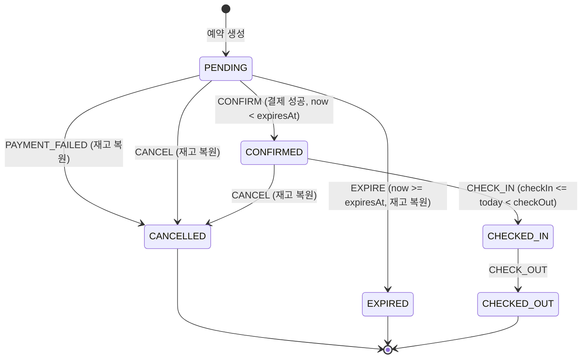

# F04 부하테스트 시나리오 설계

- 상태: 승인 대기 (D1·D3~D7 PM 승인 완료, D2 해결. 관리자 최종 확인 대기)
- 작성일: 2026-08-15
- 개정: 2026-08-15 — F01 API 계약 확정본 반영, S1-C·S4-B 신설
- 승인일:
- 근거 문서: `docs/spec/00-problem-and-scope.md`, `docs/briefings/F04.md`, `.claude/skills/load-test/SKILL.md`, `docs/architecture/coding-rules.md`, PM 전달 F01 계약 확정본(2026-08-15)

## 1. 이 문서가 정하는 것

**무엇을 어떤 부하로 때리고, 무엇을 참으로 판정할 것인가**를 확정한다. 판정 기준은 API 형태와 무관하게 성립해야 하므로, 계약이 뒤집혀도 이 문서의 뼈대는 그대로 남는다 (바뀌는 것은 `load-test/config.js` 한 파일이다).

시나리오마다 아래 넷을 숫자로 못박는다.

1. **부하 모델** — 얼마나 많은 요청을 어떤 곡선으로 꽂는가
2. **불변식** — 부하가 끝난 뒤 반드시 참이어야 하는 명제
3. **불변식 검증 쿼리** — 그 명제를 DB에서 직접 확인하는 SQL
4. **임계값** — 지연·에러율의 합격선

**불변식과 임계값은 급이 다르다.** 불변식은 하드 게이트다. 하나라도 깨지면 그 시나리오는 실패이고 리포트에 실패로 쓴다. 임계값은 참고선이다. 로컬 머신에서 잰 수치라 못 넘겼다고 설계가 틀린 것은 아니며, 못 넘긴 이유를 병목 분석으로 설명하면 된다.

## 2. 증명 대상과 시나리오 매핑

브리핑의 명제 (가)~(라)에 시나리오를 건다. **어느 명제에도 걸리지 않는 시나리오는 만들지 않는다.**

| 시나리오 | 증명하는 명제 | 등급 | 의존 |
|---|---|---|---|
| S1 재고 경합 (순간 집중) | (가) 초과 판매 0 | 필수 | F01 |
| S1-C 재고 경합 (부분 소진, `roomCount` 혼합) | (가) 초과 판매 0 | 필수 | F01 |
| S2 재고 경합 (지속 부하) | (가) 초과 판매 0 | 필수 | F01 |
| S3 멱등성 폭주 | (나) 중복 예약 0 | 필수 | F01 |
| S4 상태 전이 경합 (취소×확정) | (다) 금지 전이 0 | 필수 | F01 |
| S4-B 상태 전이 경합 (만료×확정) | (다) 금지 전이 0 | 필수 | F01 |
| S5 락 유무 대조 | (라) 상대 비교 + (가) | 필수 | F01 + `PMS_LOCK_ENABLED` |
| S6 혼합 지속 부하 (재고 누수 검출) | (가)(다) 종합 | 필수 | F01 |
| ~~S7 프로모션 스파이크~~ | ~~(가) 스파이크 형태~~ | **폐기** | F02 폐기 (ADR-0058, 2026-08-16) |
| ~~S7-C 카운터 게이트 유무 대조~~ | ~~(라) 상대 비교~~ | **폐기** | 〃 (카운터 판정 조건 둘은 기록 유지) |
| ~~S7-D Redis 다운 중 특가 (fail-open)~~ | — | **폐기** | 〃 |
| S8 조회 폭주 속 예약 · 캐시 유무 대조 | (라) 상대 비교 | 조건부 | F03 캐시 |
| L5 캐시 스탬피드 관찰 | — (관찰 전용) | 조건부 | F03 캐시 |

**S1~S6은 F01 하나만 병합되면 전부 돌아간다.** F01은 2026-08-16 병합 완료됐다 — 이제 필수 구간을 막는 것은 시나리오 컨펌 게이트 하나다.

일정이 극단적으로 밀릴 때의 내부 절단 순서: **S8 → S6 → S1-C → S2.** S1·S3·S4·S4-B·S5는 자르지 않는다. 이들이 네 명제의 최소 집합이다. (S7은 절단 순서에서도 빠졌다 — 자를 것도 없이 폐기됐다)

## 3. 공통 규약

### 3-1. 응답 코드를 어떻게 셀 것인가

부하테스트에서 가장 쉽게 틀리는 지점이다. **거절은 에러가 아니다.**

| 응답 | 의미 | 성능 지표에서 | 불변식 판정에서 |
|---|---|---|---|
| 201 | 예약 생성 성공 | 성공 | 성공 건수로 센다. **이 수가 재고와 맞아야 한다** |
| 200 (생성 API) | **멱등 재요청.** 저장된 결과를 그대로 반환 | 성공 | 새 예약이 아니다. 별도로 센다 |
| 200 (확정 API, 본문 `status: CANCELLED`) | **결제 거절.** 실패가 아니라 정상 처리 결과다 | 실패로 세지 않는다 | 정상. 재고 복원 대상이다 |
| 200 (전이 API, 상태 불변) | 멱등 전이 (이미 그 상태) | 성공 | 새 전이가 아니다. 별도로 센다 |
| 400 `INVALID_REQUEST` | 요청 자체가 틀림 (예: `guestCount` > 정원) | **실패로 센다** | **시나리오 설계 오류의 신호다.** §3-6 참조 |
| 409 `INSUFFICIENT_INVENTORY` | 재고 소진. **설계대로 동작한 것** | 실패로 세지 않는다 | 정상. (가)의 증거다 |
| 409 `REQUEST_IN_PROGRESS` | 멱등성 방어 작동 (같은 키가 아직 처리 중) | 실패로 세지 않는다 | 정상. (나)의 증거다. **`DUPLICATE_REQUEST`는 계약에 없다** — 같은 키 재요청은 409가 아니라 200 재반환이다 |
| 409 `INVALID_STATE_TRANSITION` | 전이 표 밖 요청 거부 | 실패로 세지 않는다 | 정상. (다)의 증거다 |
| `LOCK_ACQUISITION_FAILED` (**상태 코드 무관**) | 락 대기 상한 초과 | **실패로 센다** (별도 지표) | 불변식 위반은 아니다 |
| 위 어느 것도 아닌 400·409 코드 | **우리가 모르는 거절** | **하드 게이트** | 분류 불가. 아래 참조 |
| 5xx | 진짜 장애 | 실패 | **한 건이라도 나오면 조사 대상** |

**결제 거절이 200이라는 점을 놓치면 안 된다.** `POST /api/reservations/{code}/confirm`은 결제가 거절돼도 HTTP 200을 주고 본문의 `status`가 `CANCELLED`가 된다. **HTTP 코드만 보고 성공을 세면 확정 성공률이 실제보다 부풀려진다.** 확정 계열 요청은 반드시 본문의 `status`까지 읽어 분류한다.

락 실패를 실패로 세는 이유: 사용자 입장에서는 재고가 있는데도 예약을 못 한 것이다. 정확성은 지켜졌지만 가용성은 깎였다. 이건 **락 설계의 비용**이고, S5 대조에서 정확히 이 값을 락 없는 쪽과 비교한다.

**락 실패만 상태 코드가 아니라 본문 `code`로 판정한다 (2026-08-15 변경).** 병합 직후의 예외→상태 표(`app/common/error_handlers.py`)에 503 자리가 없어서, 락 실패가 400이나 409로 나가면 클라이언트 버그나 재고 소진과 상태 코드만으로는 구분되지 않을 상태였다. 그러면 **락의 가격이 ON·OFF 양쪽 0으로 나오고** "락은 공짜"라는 거짓 결론이 리포트에 실린다. **F01이 같은 구멍을 독립적으로 발견해 `ServiceUnavailableError`(503) 갈래를 신설했다**(main `d9124f5`) — 상태 코드는 이제 계약대로 503이 맞다. **그래도 판정은 계속 `code`로 한다.** 변환 계층이 한 번 삐끗하면 상태 코드는 바뀌고(실제로 바뀔 뻔했다), `code`는 계약의 기계 검증본(`app/common/error_codes.py`)이 지키는 값이기 때문이다. 자세한 것은 §7 D1의 「구현 시 수정」.

**모르는 코드를 아는 코드로 취급하지 않는다.** 위 목록에 없는 거절 코드가 오면 `unknown_rejection`으로 세고 하드 게이트에 건다. 예전 분류기는 이런 응답을 "전이 거절"이나 "중복"으로 흘려보냈고 그 바구니는 에러율에서 빠진다 — **모르는 것을 아는 것으로 분류하는 순간 리포트가 거짓말을 시작한다.**

k6 구현: `http.setResponseCallback(http.expectedStatuses(200, 201, 409))`로 `http_req_failed`가 409를 실패로 세지 않게 하고, 400·5xx는 커스텀 카운터로 따로 센다. **락 실패가 409로 오더라도 `lock_failed` 카운터가 따로 잡으므로 이 설정과 충돌하지 않는다.**

### 3-2. 공통 커스텀 지표

모든 스크립트가 같은 이름으로 센다. 리포트에서 시나리오 간 비교가 가능해야 한다.

| 지표 | 세는 것 |
|---|---|
| `rsv_created` | 201 (신규 예약) |
| `rsv_replayed` | 200 + 생성 API (멱등 재요청 응답) |
| `transition_ok` | 200 + 전이 API + 상태가 실제로 바뀜 |
| `transition_idem` | 200 + 전이 API + 상태 불변 (멱등 전이 6칸) |
| `payment_declined` | 200 + 확정 API + 본문 `status: CANCELLED` (결제 거절) |
| `rej_inventory` | 409 INSUFFICIENT_INVENTORY |
| `rej_duplicate` | 409 REQUEST_IN_PROGRESS |
| `rej_transition` | 409 INVALID_STATE_TRANSITION |
| `bad_request` | 400 (시나리오 설계 오류 신호) |
| `lock_failed` | 본문 `code`가 `LOCK_ACQUISITION_FAILED` (**상태 코드는 안 본다** — 409든 503이든) |
| `unknown_rejection` | 우리가 모르는 거절 코드가 온 400·409. **하드 게이트** |
| `server_error` | 위에 해당하지 않는 5xx·연결 실패 |

**`lock_failed`를 상태 코드로 세지 않는 이유는 §7 D1의 「구현 시 수정」에 있다.** 요약하면, 앱의 예외→상태 표에 503 자리가 없어서 락 실패가 409로 나올 수 있고, 그러면 재고 소진과 구분이 안 돼 **S5의 결론이 통째로 뒤집힌다.**

**`unknown_rejection`이 하드 게이트인 이유는 성능과 무관하다.** 예전 분류기는 모르는 거절 코드를 "전이 거절"이나 "중복"으로 흘려보냈고, 그 바구니는 에러율에서 빠진다. **모르는 것을 아는 것으로 취급하는 순간 리포트가 거짓말을 시작한다.** 새 코드가 생겼으면 그게 무슨 뜻인지 정하고 `config.js`의 `ERROR_CODE`에 넣은 다음 다시 돌린다.

**모든 시나리오의 1차 검산식:** 위 지표의 합 = 총 요청 수. 이게 안 맞으면 스크립트가 응답을 놓친 것이므로 결과 해석 전에 스크립트를 고친다.

**`bad_request`는 모든 시나리오에서 0이어야 한다.** 0이 아니면 앱 버그가 아니라 **내 시나리오가 잘못된 요청을 보내고 있다는 뜻**이다 (§3-6).

### 3-3. 데이터 격리

시나리오끼리 간섭하면 불변식 검증이 무의미해진다. **시나리오마다 다른 숙박 날짜를 쓴다.**

**그리고 객실타입도 시나리오마다 고른다.** F01 시드의 초기 `remaining`이 전부 `total_quantity`와 같으므로, 재고를 임의로 줄이는 대신 **필요한 재고 수를 가진 객실타입을 고른다.** 이렇게 해야 `reset.sh`가 만드는 상태가 완전 재시드(`docker compose down -v`) 결과와 정확히 같아지고, 보존식(`잔여 + 점유 = total_quantity`)이 그대로 성립한다. 재고를 손으로 바꾸면 보존식의 기준값이 무너진다.

| 시나리오 | 객실타입 | 재고 | 전용 날짜 |
|---|---|---|---|
| S1 | 3 스위트 | 10 | 2026-09-01 |
| S1-C | 5 오션뷰 스위트 | 20 | 2026-09-02 |
| S2 | 1 스탠다드 | 100 | 2026-09-03 |
| S3 | 1 스탠다드 | 100 | 2026-09-04 |
| S4 | 1 스탠다드 | 100 × 3일 | 2026-09-05 ~ 09-07 |
| S4-B | 1 스탠다드 | 100 × 4일 | 2026-09-08 ~ 09-11 |
| S5 | 1 스탠다드 | 100 | 2026-09-12 (락 ON) / 2026-09-13 (락 OFF) |
| (빈 대역) | — | — | 2026-09-14 ~ 09-16 — 옛 S7 대역. F02 폐기로 비었지만 날짜 재배치는 안 한다 (`reset.sh` 대역과의 일치가 우선) |
| S6 | 전 타입 | 자연 재고 | 2026-09-21 ~ 2026-09-30 |
| S8 | 전 타입 | 자연 재고 | 2026-10-01 ~ 2026-10-10 |
| 체크인 보조 | 1 스탠다드 | 100 | 2026-08-15 ~ 08-17 (오늘 근처여야 조건이 성립) |
| 재고 행 없음 확인 | — | — | 2026-10-30 이후 |

**S1이 스위트(10실)를 쓰는 이유:** 시드에서 재고가 가장 적은 타입이라 요청 200건으로 경합 배율 20배가 정확히 나온다. 재고가 넉넉한 타입을 쓰면 경합이 안 일어나 아무것도 증명하지 못한다.

**S4·S4-B가 날짜를 여러 개 쓰는 이유:** 300~400건의 PENDING 예약이 필요한데 한 타입의 하루 재고는 최대 100이다. 재고는 `(객실타입, 날짜)` 단위이므로 날짜를 늘려 확보한다. 이 두 시나리오는 재고 경합이 목적이 아니라 상태 전이 경합이 목적이라, 날짜를 흩어도 증명에 영향이 없다.

**9월 14~16일은 F02 특가가 점유했던 대역이다** (S5를 09-12·09-13으로 옮긴 이유). F02 폐기 후에도 이 대역을 다른 시나리오에 재배치하지 않는다 — 날짜를 옮기면 `config.js` PLAN과 `reset.sh` 대역 두 곳을 함께 고쳐야 하고, 한쪽만 고치면 초기화와 부하가 다른 날짜를 보게 된다.

F01 시드 재고 범위는 **2026-08-01 ~ 2026-10-29 고정 날짜**다. `CURDATE()` 기반이 아니라서 몇 번을 재시드해도 정확히 같은 상태가 나온다. 위 날짜가 전부 이 범위 안에 있다.

### 3-4. 실행 전 초기화

**이전 실행의 잔여 데이터가 섞이면 불변식 검증이 전부 무의미하다.** 매 실행 전에 `load-test/reset.sh`를 돌린다.

```
0. 접속 대상이 localhost가 아니면 즉시 중단한다 (안전장치)
1. 해당 시나리오 날짜 대역의 예약 행 삭제
2. 해당 날짜 대역의 재고를 시나리오가 요구하는 초기값으로 UPDATE
3. Redis FLUSHDB (멱등성 키·분산락·캐시 전부 비움)
4. 초기 상태 검증 쿼리 실행 — 예약 0건, 재고 = 설정값. 여기서 안 맞으면 실행하지 않는다
```

3번을 빼먹으면 S3(멱등성)이 이전 실행의 키에 걸려 전부 409를 받는다. 반드시 넣는다.

**초기화가 건드리는 테이블 (PM 승인 D5 조건 4에 따른 명시)**

| 테이블 | 동작 | 소유 feature |
|---|---|---|
| `reservation` | 시나리오 날짜 대역 행 DELETE | F01 |
| `room_daily_inventory` | 시나리오 날짜 대역 `remaining` UPDATE | F01 |
| `reservation_status_history` | 시나리오 날짜 대역 행 DELETE | F01 — 2026-08-16 실물 확인 (마이그레이션 004) |
| Redis 전체 | FLUSHDB | 공용 |

프로모션 재고 테이블 행은 F02 폐기(ADR-0058)로 목록에서 뺐다.

**마이그레이션 파일과 스키마는 절대 건드리지 않는다.** DDL을 실행하지 않으며 오직 DML만 한다. 위 목록에 없는 테이블을 초기화해야 할 상황이 생기면 스크립트를 고치기 전에 PM에게 보고한다. **F01이 테이블·컬럼을 바꾸면 이 표가 따라가야 하는 지점이므로, 표를 안 고치고 스크립트만 고치는 일이 없게 한다.**

### 3-5. 측정 노이즈 대응

로컬 한 대에서 앱·DB·k6가 함께 도는 환경이라 실행마다 값이 흔들린다.

- 모든 성능 측정 시나리오는 **워밍업 30초**(임계값·집계 제외) 후 본 부하를 건다. JIT 컴파일과 커넥션 풀 예열이 끝나야 한다
- **대조 시나리오(S5, S8)는 3회씩 돌려 중앙값을 채택한다.** 두 조건을 번갈아 실행해(ON→OFF→ON→OFF→ON→OFF) 시간대 편향을 줄인다
- 불변식 검증은 매 실행마다 한다. 3회 중 1회라도 깨지면 실패다

### 3-6. 400을 만들지 않는다 — 요청은 항상 유효해야 한다

인원 초과(`guestCount` > 정원 × `roomCount`)는 400이다. **부하테스트가 400을 받으면 그건 앱을 시험한 게 아니라 내가 잘못된 요청을 보낸 것이다.** 경합 지점에 도달하기도 전에 검증 단계에서 튕기므로, 그만큼 실제 경합 요청 수가 줄어 "성공 정확히 N건"의 분모가 조용히 망가진다.

방지 규약:

- 모든 시나리오는 `guestCount = 2 × roomCount`처럼 **정원 안쪽으로 안전하게** 잡는다. 정원을 꽉 채워 보내지 않는다
- 객실타입별 정원은 F01 시드값에서 읽어 `config.js`에 넣는다. 추측해서 넣지 않는다
- `checkOut > checkIn`을 스크립트가 보장한다. 날짜 계산은 `config.js`의 헬퍼 하나만 쓴다
- **`bad_request > 0`이면 그 실행 결과는 폐기한다.** 임계값 미달이 아니라 무효 실행으로 처리하고, 요청을 고쳐 다시 돌린다

### 3-7. 사용자 식별자 — 조용히 시나리오를 무효화하는 함정 둘

사용자 테이블이 없다. `X-User-Id`는 비어있지 않으면 아무 값이나 받고 검증도 조회도 하지 않는다. **검증이 없다는 것이 편한 게 아니라, 틀려도 아무도 안 알려준다는 뜻이다.** 두 가지를 스크립트가 직접 지켜야 한다.

**함정 1. 한 예약의 전이 요청은 그 예약을 만든 사용자로 보내야 한다.**

취소는 소유자를 검증하고, 남의 예약이면 403이 아니라 **404**를 준다. 확인번호의 존재 자체를 숨기려는 설계다. VU 번호를 그대로 사용자 ID로 쓰면 취소·확정이 **전부 404로 떨어진다.** 그런데 404는 "예약이 없다"로 읽혀서, 시나리오가 왜 실패하는지 찾는 데 한참 걸린다.

→ 대응: `setup()`이 `(확인번호, 소유자)` 쌍을 만들어 넘기고, VU는 그 소유자를 그대로 쓴다. **`not_found`를 하드 게이트 지표로 두어 0이 아니면 무효 실행으로 처리한다.**

**함정 2. 멱등 키는 `(userId, idempotencyKey)` 조합으로 저장된다.**

같은 키 문자열이라도 사용자가 다르면 **서로 다른 요청**으로 취급된다. S3에서 재시도마다 VU가 바뀌면 키가 전혀 충돌하지 않아 요청이 전부 성공한다. 그러면 "중복 예약 0건"이라는 결론이 나오는데, **멱등성이 작동해서가 아니라 애초에 중복 요청을 보내지 않아서**다. 통과했지만 아무것도 증명하지 못한 실행이 된다.

→ 대응: S3는 키마다 전용 사용자를 묶는다. 키 `i`의 50번 재시도는 전부 같은 사용자로 나간다.

**두 함정의 공통점은 실패가 조용하다는 것이다.** 함정 1은 시끄럽게 실패하지만 원인이 엉뚱해 보이고, 함정 2는 아예 초록불로 통과한다. 후자가 훨씬 위험하다.

### 3-8. 실행 환경의 한계 (리포트 필수 기재 사항)

시나리오를 설계하는 단계에서부터 못박아 둔다. **여기서 나올 숫자가 무엇의 근거가 되고 무엇의 근거가 못 되는지**를 미리 정해두지 않으면, 리포트를 쓸 때 절대값을 성능 주장으로 잘못 쓰게 된다.

- 앱, MySQL, Redis, k6가 **전부 같은 노트북 한 대**(Apple M2 8코어 / 16GB)에서 돈다. 부하 생성기가 피시험 대상과 CPU·메모리를 나눠 쓴다
- 그래서 처리량·지연의 **절대값은 이 시스템의 성능 한계가 아니다.** k6가 CPU를 뺏어 앱이 못 낸 성능일 수도 있고 그 반대일 수도 있으며, 이 환경에서는 둘을 분리할 수 없다
- **근거로 쓸 수 있는 것은 상대 비교다.** 같은 머신·같은 부하·같은 시각대에 조건 하나만 바꿔 잰 두 값의 차이(S5 락 유무, S8 캐시 유무)만이 설계 판단의 근거가 된다
- **정확성(불변식) 검증은 환경 한계와 무관하게 유효하다.** "재고 10에 성공 10건"은 머신이 느리든 빠르든 참이거나 거짓이다

리포트는 이 구분을 문장으로 명시한다. **성능 수치는 참고, 불변식 검증은 결론.**

리포트에 기록할 환경 항목: 머신 사양, 앱·DB·k6 동시 구동 사실, **uvicorn 워커 수**, **DB 커넥션 풀 크기**, MySQL 격리 수준(REPEATABLE-READ), k6 버전(v0.57.0), 실행 시각, 동시에 돌던 다른 프로세스.

**워커 수는 대조 시나리오에서 특히 중요하다.** 기동 명령이 `uvicorn app.main:app --workers N`이라 N을 안 적으면 나중에 재현이 안 되고, **두 회차의 N이 다르면 그 대조는 락 유무를 잰 게 아니라 워커 수를 잰 것이다.** S5·S8은 두 회차의 N이 같은지를 실행 전에 확인한다.

**동시 처리 한계가 어디서 오는지 미리 적어둔다.** 앱의 요청 핸들러가 `async def`가 아니라 `def`라 FastAPI가 이를 스레드풀에서 돌린다. 그래서 동시에 처리되는 요청 수의 상한은 대략 **워커 수 × 스레드풀 크기**이고, 그 아래에 다시 **DB 커넥션 풀 크기**가 있다. 커넥션 풀이 스레드풀보다 작으면 남는 스레드는 전부 커넥션을 기다리며 서 있게 된다.

> 이게 왜 중요한가. 그 상태에서 잰 지연 시간은 **락 경합이 아니라 커넥션 대기를 잰 것**인데, 겉보기에는 구분이 안 된다. S5에서 "락을 켜니 느려졌다"는 결론을 내리려면 두 회차 모두 이 상한에 걸리지 않았음을 먼저 보여야 한다. 커넥션 풀 설정은 F01 소관이라 **병합 후 실제 값을 읽어 여기 적는다.** 값을 모르는 채로 지연 수치를 해석하지 않는다.

**부하 프로파일에서 기본값과 다르게 설정한 값은 전부 기록한다.** 특히 S4-B의 `PMS_RESERVATION_HOLD_MINUTES`. 이게 없으면 나중에 누가 기본값 10분으로 재현하려다 아무 경합도 못 만들고 결과를 의심하게 된다.

**바꾸지 않았어도 기록하는 값이 셋 있다.** `PMS_LOCK_WAIT_MILLIS`(기본 200), `PMS_LOCK_TTL_SECONDS`(기본 3), `PMS_RESERVATION_EXPIRE_SCAN_SECONDS`(기본 30). 손대지 않지만 결과를 좌우한다 — 첫째는 S5의 락 실패 건수를 사실상 결정하고, 둘째는 `LockNotOwnedError`가 나올지를 정하며(3-11), 셋째는 만료가 언제 일어나는지를 정한다. **"락의 가격은 몇 건이다"라고 쓰면서 대기 시간을 안 적으면 그 문장은 근거가 아니다.**

### 3-9. 전 시나리오 공통 사후 검증

**모든 시나리오 실행 후 `load-test/verify/run.sh <시나리오>`를 돌린다.** 비용이 거의 없고, 어느 시나리오에서 샜는지도 알려준다.

**SQL을 직접 돌리지 않고 `run.sh`를 거치는 이유.** 검증 결과가 "비어 있음"으로 나왔을 때 그게 **통과인지 미검사인지 SQL만으로는 구분되지 않는다.** `run.sh`는 위반을 세기 전에 **검사 대상이 0이 아닌지 먼저 단언하고**, 0이면 종료 코드 1로 중단한다.

| 실행 전 단언 | 어느 시나리오에 거는가 |
|---|---|
| 기대 표기를 벗어난 `event`·`to_status`가 0행인가 | 전부 |
| 이력 행이 1건 이상인가 | 전이가 있는 시나리오만 (S4·S4-B·S6) |
| 복원 이벤트 필터가 1건 이상을 잡는가 | 전이가 있는 시나리오만 (S4·S4-B·S6) |

**단언을 시나리오별로 나눈 이유.** S1처럼 생성만 하는 시나리오는 상태 전이 이력이 비어 있는 게 정상이다. 거기까지 "복원 이벤트 1건 이상"을 요구하면 정당한 실행이 실패하고, **잘못 우는 게이트는 조작자가 꺼버린다.** 그러면 없느니만 못하다.

| # | 검증 | 기대 |
|---|---|---|
| 1 | 예약당 재고 복원 이벤트가 두 번 이상 | 0행 |
| 2 | 종료 상태에 두 번 도달한 예약 | 0행 |
| 3 | **실제로 일어난 `(현재 상태, 이벤트, 다음 상태)` 조합** | **허용 7행의 부분집합** |
| 5 | 재고 음수 또는 총량 초과 행 | 0행 |

**3번이 명제 (다)에 대해 처음 기대했던 것의 절반을 돌려준다.**

거부된 전이는 예외로 트랜잭션이 롤백되므로 이력에 남지 않는다. 그래서 "금지 전이가 **시도됐다가 막혔다**"는 DB로 증명할 수 없다. 그런데 3번은 다른 것을 증명한다 — **표 밖의 전이가 실제로는 한 번도 일어나지 않았다.** 시도의 부재가 아니라 **결과의 부재**이고, 무엇보다 운영 데이터로 하는 증명이라 전수 테스트와 값이 다르다.

| 증명 수단 | 무엇을 보이는가 |
|---|---|
| F01의 전이 표 36칸 전수 테스트 | 코드가 거부하도록 짜여 있다 |
| **공통 검증 3번** | **실제 부하에서 한 건도 새지 않았다** |

리포트에 쓸 문장: **"부하테스트 중 발생한 N건의 상태 전이가 전부 전이 표 안에 있었다."**

**순서 판단은 `occurred_at`이 아니라 `id` 순번으로 한다.** 한 트랜잭션에서 읽은 `now`를 쓰므로 `occurred_at`이 같은 값일 수 있고, 시각으로 정렬하면 순서가 뒤집힌다.

### 3-10. 거짓 통과 점검 — 이 테스트가 통과했는데도 망가져 있을 수 있는 경우

부하테스트에서 가장 위험한 실패 모드는 실패가 아니다. **아무것도 증명하지 못한 초록불**이다. 실패는 눈에 띄지만 이건 안 띄고, 리포트에는 "검증 통과"로 적히며, 그 문장을 읽는 사람은 검증됐다고 믿는다.

그래서 시나리오마다 이 질문을 던져 대응을 붙였다.

| 시나리오 | 통과했는데도 망가져 있을 수 있는 경우 | 대응 |
|---|---|---|
| **S3** | 재시도마다 사용자가 달라 **애초에 중복 요청이 아니었다.** 전부 성공하고 "중복 0건"이 나온다 | 키마다 전용 사용자를 묶는다 (§3-7). `rsv_created == 키 개수`를 하드 게이트로 |
| **S6** | **두 번 깎고 두 번 되돌렸다.** 최종 잔여가 맞아떨어져 보존식을 통과한다 | 이력 줄 수로 복원이 예약당 한 번인지 센다 (I4) |
| **S1** | 요청이 실제로는 겹치지 않고 순차 도달했다. 재고가 10이면 당연히 10건 성공 | VU 200 × 1회로 도달 시점을 겹친다. `rej_inventory ≥ 180`으로 경합량을 확인 |
| **S4** | 두 요청이 안 겹쳐 금지 전이 상황 자체가 안 만들어졌다 | `rej_transition ≥ 1`을 하드 게이트로. 0이면 통과가 아니라 재실행 대상 |
| **S1-C** | 3실 요청이 전부 앞쪽에서 소진돼 경계 판정(`잔여 2에 3실`)이 한 번도 안 걸렸다 | 1·2·3실을 균등 혼합하고, 최종 잔여가 3 이상이면 실패로 본다 |
| **S2·S5** | 앱이 느려 도착률을 못 따라가 실제 부하가 목표보다 작았다 | 달성 RPS가 목표의 80% 미만이면 병목 분석 필수. 도착률 고정 모델을 쓰는 이유 |
| **S5** | **락 스위치가 실제로는 안 꺼졌다.** 두 회차가 같은 조건이라 "차이 없음"이 나온다 | **`reset.sh s5on` / `s5off`가 설정 노출 엔드포인트의 `PMS_LOCK_ENABLED`를 읽어 기대값과 다르면 중단한다 (구현됨).** 읽지 못해도 중단한다 — 확인 못 한 대조는 대조가 아니다 |
| **S5** | **락 실패가 409로 나와 "정당한 거절"로 세어졌다.** 락의 가격이 ON·OFF 양쪽 0으로 나오고 "락은 공짜"라는 결론이 실린다 | **분류를 상태 코드가 아니라 본문 `code`로 한다 (구현됨).** 모르는 거절 코드는 `unknown_rejection` 하드 게이트로 세운다. 아래 3-11 참고 |
| **S4-B** | **보류 시간이 기본 10분이라 만료가 안 일어났다.** 경합이 없었는데 "이중 만료 0건"이 통과한다 | 같은 장치로 `PMS_RESERVATION_HOLD_MINUTES == 1`을 확인한다 (구현됨) |
| **S4-B** | `hold-minutes`가 길어 만료가 한 건도 안 일어났다 | `CONFIRMED + EXPIRED == 400`을 하드 게이트로. EXPIRED가 0이면 경합이 없었다 |
| **S2·S6** | **배경 만료 스캐너가 부하 중에 재고를 돌려줬다.** 성공 건수가 N을 넘는데 이걸 동시성 버그로 오진한다 | 보류 시간(기본 10분)을 시나리오 길이보다 **길게 유지한다.** S2·S6는 5분 이내라 만료가 안 걸린다. 이건 우연이 아니라 지켜야 하는 조건이므로 여기 적어둔다 |
| **S5·S8** | **두 회차의 uvicorn 워커 수가 달랐다.** 잰 것은 락(캐시) 유무가 아니라 워커 수 차이다 | 워커 수를 명령에 명시하고 리포트에 적는다. 3-8 참고 |
| **전 시나리오** | **리포트의 설정 표를 손으로 옮겨 적다 틀렸다.** 실제로 잰 조건과 적힌 조건이 다른데 아무도 모른다 | `reset.sh`가 실행 시점의 설정 응답을 `results/settings-<시나리오>.json`으로 저장한다 (구현됨) |
| **전 시나리오** | **이력의 `event`·`status` 표기가 기대와 다르다** (예: `CANCEL`이 아니라 `cancel`). 값 필터가 0행을 돌려주고 **모든 검증이 통과로 보인다** — 깨진 게 아니라 아무것도 안 본 것인데 초록불이 켜진다 | **`verify/run.sh`가 종료 코드로 막는다 (구현됨).** 위반을 세기 전에 검사 대상이 0이 아닌지 먼저 단언하고, 0이면 중단한다. `common.sql` (0-b)는 실제 표기를 나열해 원인을 그 자리에서 보여준다 |
| ~~S7~~ | ~~특가가 아니라 일반 재고가 먼저 바닥났다~~ (F02 폐기로 소멸) | — |
| **S8** | 검색 조건이 흩어져 캐시 히트율이 0이었다. 캐시 ON/OFF가 사실상 같은 조건 | `cache_hit_rate`를 함께 싣는다. 집중·분산 두 회차를 비교 |
| **L5** | 조건이 흩어져 만료가 흩어졌다. 파도가 안 보인다 | 캐시 키를 하나로 고정한다 |

> **표기 확인(0-b)은 스택 전환이 만든 항목이다 (2026-08-15).** 파이썬에서 Enum을 저장할 때 이름(`CANCEL`)이 아니라 값(`cancel`)이 들어가는 일이 흔하다. 자바에서는 `EnumType.STRING`이 이름을 쓰는 게 관례라 신경 쓸 일이 적었는데, **SQLModel이 어느 쪽으로 저장하는지는 마이그레이션을 봐야 안다.** 표기가 어긋나면 `verify/*.sql`의 값 필터가 조용히 0행을 돌려주므로, 확인을 사람 기억이 아니라 쿼리로 고정했다.
>
> 규칙 문서가 "Enum 이름과 값을 같은 대문자로 둔다"로 이 위험을 막았지만, **규칙이 있다는 것과 지켜졌다는 것은 다르다.** 대조는 그대로 한다.

**공통 함정 하나 더.** 검증 SQL이 컬럼명 오타로 0행을 반환하면 그것도 "불변식 통과"로 읽힌다. `reset.sh`의 초기 상태 검증(예약 0건, 재고 = 설정값, **대상 재고 행 수 > 0**)이 그 1차 방어선이다. 쿼리가 실제로 데이터를 잡고 있는지 매번 확인한다.

### 3-11. 응답에 안 나오는 신호 — 서버 로그에서 봐야 하는 것

**모든 실패가 응답으로 나오지는 않는다.** 아래 둘은 HTTP 응답만 봐서는 알 수 없고, 서버 로그를 같이 봐야 잡힌다. 부하를 넣는 동안 앱 로그를 파일로 받아두고, 각 회차가 끝나면 이 둘을 센다.

**① `LockNotOwnedError` — 락이 트랜잭션보다 먼저 풀렸다**

분산락을 `redis-py`의 `Lock` 위에 얹었다(2026-08-15 결정). 이 라이브러리는 락을 놓을 때 **"지금 이 락이 아직 내 것인가"를 확인하고**, 아니면 `LockNotOwnedError`를 던진다.

이게 나온다는 것은 이런 뜻이다. 내가 락을 잡고 일을 하는 사이 `PMS_LOCK_TTL_SECONDS`(기본 3초)가 지나 락이 자동으로 풀렸고, **그 틈에 다른 요청이 같은 락을 가져갔다.** 즉 한 시점에 임계 구역 안에 둘이 있었다.

> **정상 동작에서는 한 건도 안 나와야 한다.** 나오면 성능 문제가 아니라 **1차 방어선이 그 순간 작동하지 않았다는 증거**다. 락 TTL을 트랜잭션 최장 시간보다 길게 잡아야 한다는 신호이므로, 나오면 파라미터를 조정하고 그 회차는 다시 돌린다.

이 신호가 중요한 이유가 하나 더 있다. **이때도 우리 불변식은 깨지지 않아야 한다.** 2차 방어선(조건부 UPDATE)과 3차(DB 제약)가 남아 있기 때문이다. 그러니 `LockNotOwnedError`가 몇 건 있는데 재고는 멀쩡하다면, 그건 **다층 방어가 실제로 작동한 관측 기록**이라 리포트에 실을 값어치가 있다. 다만 "의도한 상태"는 아니므로 그렇게 쓴다.

**② `INTERNAL_ERROR` 응답의 원인**

앱은 예상 못 한 예외를 500 + `INTERNAL_ERROR` + 추적 번호로만 내보내고 **원인은 응답에 싣지 않는다**(`error_handlers.py`). 우리 쪽 `server_error` 게이트가 0이 아니면 응답만 봐서는 아무것도 알 수 없으므로, 그 추적 번호로 로그를 뒤져야 한다. 게이트가 걸렸는데 로그를 안 남겼으면 회차를 통째로 다시 돌려야 한다.

**받는 방법.** 앱을 띄울 때 표준 출력을 파일로 돌려둔다.

```bash
PMS_LOCK_ENABLED=false uvicorn app.main:app --workers 4 > docs/load-test/results/app-s5off.log 2>&1 &
```

회차가 끝나면 센다.

```bash
grep -c LockNotOwnedError docs/load-test/results/app-s5off.log
grep -c INTERNAL_ERROR    docs/load-test/results/app-s5off.log
```

## 4. 시나리오

### S1. 재고 경합 — 순간 집중 [필수 / 명제 (가)]

가장 단순하고 가장 중요한 시나리오다. 리포트의 첫 문장이 여기서 나온다.

**노리는 경합:** 같은 `(객실타입, 날짜)` 재고 행 하나에 요청이 한꺼번에 도달한다. 순진한 구현(조회 → 판단 → 저장)이라면 여기서 초과 판매가 난다.

| 항목 | 값 |
|---|---|
| 대상 | 예약 생성 API |
| 초기 재고 | **10실** — 객실타입 3 (스위트), 날짜 2026-09-01, 1박. 시드에서 재고가 가장 적은 타입이라 경합 배율 20배가 정확히 나온다 |
| 부하 모델 | `shared-iterations` — VU 200, iterations 200, maxDuration 60s |
| 총 요청 | 200건 (재고의 20배) |
| 지속 시간 | 수 초 (전량 소진까지) |
| 요청 구성 | 요청마다 서로 다른 `X-User-Id`(`user-1001`~`user-1200`), 서로 다른 `Idempotency-Key`(UUID), 전부 같은 객실타입·같은 날짜·1실 |

```
POST /api/reservations
X-User-Id: user-1{iter}
Idempotency-Key: s1-{uuid}

{ "roomTypeId": <RT_S1>, "checkIn": "2026-09-01", "checkOut": "2026-09-02",
  "roomCount": 1, "guestCount": 2 }
```

VU 200이 각각 1회만 쏘게 해서 **도달 시점을 최대한 겹친다.** 요청 수를 늘리는 것보다 겹치는 게 중요한 시나리오다.

**불변식**

| # | 명제 | 검증 |
|---|---|---|
| I1 | 성공 응답이 **정확히 10건** | k6 `rsv_created == 10` |
| I2 | DB의 활성 예약 행이 **정확히 10건** | Q1 |
| I3 | 재고가 음수인 행이 **0건** | Q2 |
| I4 | 해당 날짜 잔여 재고가 **정확히 0** | Q3 |
| I5 | `초기 재고 = 잔여 + 활성 예약 실수 합` | Q4 |
| I6 | 나머지 190건이 전부 정중히 거절됨 (5xx 0건) | `server_error == 0` |

**I1과 I2가 같아야 한다는 점이 핵심이다.** k6가 201을 10번 받았는데 DB에 11건이 있으면(또는 그 반대면) 응답과 실제가 어긋난 것이고, 이건 초과 판매보다 더 나쁜 버그다.

**검증 쿼리** (테이블·컬럼명은 §6의 잠정 이름. F01 스펙 확정 시 확정한다)

```sql
-- Q1. 활성 예약 행 수 (기대: 10)
SELECT COUNT(*) AS active_reservations
FROM reservation
WHERE room_type_id = :rt AND check_in = '2026-09-01'
  AND status NOT IN ('CANCELLED', 'EXPIRED');

-- Q2. 재고 음수 행 (기대: 0행. 한 행이라도 나오면 즉시 실패)
SELECT * FROM room_daily_inventory WHERE remaining < 0;

-- Q3. 해당 날짜 잔여 (기대: 0)
SELECT remaining FROM room_daily_inventory
WHERE room_type_id = :rt AND stay_date = '2026-09-01';

-- Q4. 보존식: 잔여 + 활성 예약 실수 = 초기 재고 (기대: 10)
SELECT i.remaining + COALESCE(SUM(r.room_count), 0) AS total
FROM room_daily_inventory i
LEFT JOIN reservation r
  ON r.room_type_id = i.room_type_id
 AND i.stay_date >= r.check_in AND i.stay_date < r.check_out
 AND r.status NOT IN ('CANCELLED', 'EXPIRED')
WHERE i.room_type_id = :rt AND i.stay_date = '2026-09-01'
GROUP BY i.remaining;
```

**임계값**

| 지표 | 합격선 |
|---|---|
| `http_req_duration` p95 | < 1,000ms |
| `server_error` | 0 (하드) |
| `lock_failed` 비율 | < 5% |
| `rej_inventory` | ≥ 180 |
| `bad_request` | 0 (하드) |

---

### S1-C. 재고 경합 — 부분 소진 (`roomCount` 혼합) [필수 / 명제 (가)]

F01 계약에 `roomCount`가 있어 **한 요청이 여러 실을 한 번에 잡는다.** 이건 1실 단위 경합보다 확실히 어렵다.

**왜 더 어려운가.** 1실씩 빠지면 잔여가 10→9→8로 한 칸씩 내려가고, 마지막 한 칸에서만 경계 판단이 필요하다. 그런데 3실씩 빠지면 **잔여 2가 남았을 때 3실 요청은 거절되고 2실 요청은 통과해야 한다.** 즉 "잔여 > 0"이 아니라 "잔여 >= 요청량"을 원자적으로 판단해야 하고, 조건부 UPDATE의 `WHERE remaining >= :n` 조건이 실제로 작동하는지가 여기서 갈린다. **잔여 2에 3실 요청이 통과하면 재고는 −1이 된다.**

또 하나. 요청량이 섞이면 **최종 잔여가 0이 아닐 수 있다.** 잔여 2에 3실 요청만 남았다면 2가 남은 채로 끝난다. 그래서 S1처럼 "잔여 == 0"으로 판정할 수 없고, **보존식으로만 판정해야 한다.** 이 점이 이 시나리오의 설계 포인트다.

| 항목 | 값 |
|---|---|
| 초기 재고 | **20실** — 객실타입 5 (오션뷰 스위트, 정원 4), 날짜 2026-09-02, 1박. 정원이 4라 3실 요청까지 인원수 여유가 있다 |
| 부하 모델 | `shared-iterations` — VU 300, iterations 300 |
| 총 요청 | 300건 (요청 실수 합계 = 600실, 재고의 30배) |
| 요청 구성 | `roomCount`를 1·2·3실로 **균등 혼합** (각 100건). `guestCount = 2 × roomCount` (§3-6에 따라 정원 안쪽) |
| 사용자·키 | 요청마다 서로 다름 |

**불변식**

| # | 명제 | 검증 |
|---|---|---|
| I1 | **`remaining < 0`인 행이 0건** — 이 시나리오의 주 표적 | Q2 |
| I2 | `잔여 + 성공한 예약들의 roomCount 합 = 20` (= total_quantity) (보존식) | Q4-C |
| I3 | 최종 잔여가 **0 이상 2 이하** — 남을 수 있지만, 3실 이상 남았다면 통과했어야 할 요청이 부당하게 거절된 것 | Q3 |
| I4 | k6가 센 성공 요청들의 `roomCount` 합 == DB 활성 예약의 `room_count` 합 | k6 × Q1-C |
| I5 | 잔여보다 큰 `roomCount` 요청이 성공한 흔적이 없다 (I1과 I2가 동시에 참이면 성립) | Q2 + Q4-C |
| I6 | `server_error == 0`, `bad_request == 0` | k6 |

I3의 상한 2를 두는 이유: 잔여가 3 이상 남았다면 3실 요청이 들어갈 자리가 있었는데 못 들어간 것이므로, 락 경합이나 조건 판정이 과하게 보수적이라는 신호다. **초과 판매의 반대편 오류**이고 이것도 버그다.

**검증 쿼리**

```sql
-- Q1-C. 활성 예약의 실수 합 (기대: 18~20)
SELECT COUNT(*) AS rows_cnt, COALESCE(SUM(room_count), 0) AS rooms_sum
FROM reservation
WHERE room_type_id = :rt AND check_in = '2026-09-02'
  AND status NOT IN ('CANCELLED', 'EXPIRED');

-- Q4-C. 보존식 (기대: 20)
SELECT i.remaining + COALESCE(SUM(r.room_count), 0) AS total
FROM room_daily_inventory i
LEFT JOIN reservation r
  ON r.room_type_id = i.room_type_id
 AND i.stay_date >= r.check_in AND i.stay_date < r.check_out
 AND r.status NOT IN ('CANCELLED', 'EXPIRED')
WHERE i.room_type_id = :rt AND i.stay_date = '2026-09-02'
GROUP BY i.remaining;
```

**임계값**

| 지표 | 합격선 |
|---|---|
| p95 | < 1,000ms |
| `server_error` | 0 (하드) |
| `bad_request` | 0 (하드) |
| `lock_failed` 비율 | < 5% |

---

### S2. 재고 경합 — 지속 부하 [필수 / 명제 (가)]

S1이 "한순간"을 본다면 S2는 "계속 밀려드는 동안"을 본다. 처리량 측정의 기준선(baseline)이자 S5 대조의 부하 원본이다.

**노리는 경합:** 재고가 소진되는 과정 전체. 소진 직전, 소진 순간, 소진 이후 각 구간에서 동작이 달라지는지 본다.

| 항목 | 값 |
|---|---|
| 초기 재고 | **100실** — 객실타입 1 (스탠다드), 날짜 2026-09-03 |
| 부하 모델 | `constant-arrival-rate` — rate 300/s, timeUnit 1s, duration 20s, preAllocatedVUs 200, maxVUs 400 |
| 총 요청 | 약 6,000건 (재고의 60배) |
| 워밍업 | 별도 워밍업 시나리오 30초 (다른 날짜 대역 사용, 집계 제외) |
| 요청 구성 | 요청마다 서로 다른 사용자·멱등성 키, 전부 같은 객실타입·같은 날짜·1실 |

**도착률 고정(arrival-rate) 모델을 쓰는 이유:** VU 고정 모델은 앱이 느려지면 요청 수도 같이 줄어들어, 느려진 사실이 지표에 안 보인다. 도착률을 고정해야 앱이 못 따라오는 만큼 지연과 큐가 드러난다. **S5 대조에서 두 조건에 같은 부하를 넣었다고 말하려면 이 모델이어야 한다.**

**불변식** — S1의 I1~I6과 동일. 숫자만 10 → 100.

| # | 명제 |
|---|---|
| I1 | `rsv_created == 100` |
| I2 | 활성 예약 행 == 100 |
| I3 | `remaining < 0` 행 0건 |
| I4 | 잔여 == 0 |
| I5 | 보존식 성립 |
| I6 | `server_error == 0` |

**임계값**

| 지표 | 합격선 |
|---|---|
| p95 | < 800ms |
| p99 | < 2,000ms |
| `server_error` | 0 (하드) |
| `lock_failed` 비율 | < 5% |
| 달성 RPS | 목표 300/s의 80% 이상 (< 240/s면 병목 분석 필수) |

---

### S3. 멱등성 폭주 [필수 / 명제 (나)]

**노리는 상황:** 클라이언트 재시도, 네트워크 타임아웃 후 재전송, 사용자 더블클릭. 같은 요청이 여러 번 도착한다.

재고는 넉넉히 둔다. **재고 경합이 섞이면 "예약이 한 건인 이유"가 멱등성 때문인지 재고 부족 때문인지 구분이 안 된다.** 이 시나리오는 멱등성만 격리해서 본다.

두 하위 케이스로 나눈다. 성격이 다르다.

**S3-A. 재시도 폭주 (순차적 재전송)**

| 항목 | 값 |
|---|---|
| 초기 재고 | **100실** — 객실타입 1 (스탠다드), 날짜 2026-09-04. 재고 경합이 섞이면 안 되므로 넉넉한 타입을 쓴다 |
| 멱등성 키 | **20개**를 준비하고, 각 키를 **50번씩** 재전송 |
| 부하 모델 | `shared-iterations` — VU 100, iterations 1,000 |
| 총 요청 | 1,000건 |
| 기대 예약 | **정확히 20건** |
| 키 선택 | `keys[iterationInTest % 20]` — 같은 키가 여러 VU에 흩어져 동시에도 겹친다 |

**S3-B. 더블클릭 (완전 동시 2연타)**

| 항목 | 값 |
|---|---|
| 멱등성 키 | **100개**, 각 키를 **정확히 2개 VU가 동시에** 발사 |
| 부하 모델 | `shared-iterations` — VU 200, iterations 200 |
| 총 요청 | 200건 |
| 기대 예약 | **정확히 100건** |

S3-B가 더 어려운 케이스다. `SET NX`가 아직 안 끝난 상태에서 두 번째가 들어오는 좁은 틈을 노린다.

**F01 계약이 판정을 정밀하게 해준다.** 최초 요청은 **201**, 멱등 재요청은 **200 + 동일 본문**, 처리 중 재요청만 **409 REQUEST_IN_PROGRESS**다. 상태 코드만으로 세 경우가 갈리므로 추측할 여지가 없다.

| 응답 | 기대 건수 (S3-A) | 기대 건수 (S3-B) |
|---|---|---|
| 201 | 20 (키당 정확히 1) | 100 (키당 정확히 1) |
| 200 | 나머지 대부분 | 최대 100 |
| 409 REQUEST_IN_PROGRESS | 0 이상 (동시 도착분) | 0 이상 |
| 그 외 | **0** | **0** |

**키당 201은 반드시 정확히 1건이다.** 어떤 키에서 201이 2번 나왔다면 그 순간 예약이 두 건 생긴 것이고, 뒤에 하나가 지워졌더라도 (나)는 이미 깨진 것이다. **DB 행 수만 세면 이 순간을 놓친다.**

**불변식**

| # | 명제 | 검증 |
|---|---|---|
| I1 | 예약 행 수가 **정확히 키 개수** (A: 20, B: 100) | Q5 |
| I2 | **한 멱등성 키에 예약이 2건 이상인 경우가 0건** | Q6 |
| I3 | 재고 차감량 == 키 개수 (A: 200→180, B: 200→100) | Q7 |
| I4 | **키당 201 응답이 정확히 1건** | k6: 키별 201 카운트 |
| I5 | 같은 키의 모든 2xx 응답의 **`confirmationCode`가 전부 동일** | k6: 키별 code 집합의 크기 == 1 |
| I6 | 같은 키의 200 응답 본문이 최초 201 본문과 **필드 단위로 동일** (`status`, `totalPrice`, `expiresAt` 포함) | k6: 본문 비교 |
| I7 | 응답으로 받은 `confirmationCode`가 전부 DB에 실존하고, 개수가 키 개수와 일치 | Q8 |
| I8 | `server_error == 0`, `bad_request == 0` | k6 |

I5·I6이 중요하다. 재요청에 200을 주면서 **다른 확인번호**를 주면 DB에는 한 건이어도 클라이언트는 두 예약이 있다고 믿는다. 행 수만 세면 이 버그를 놓친다. `totalPrice`까지 비교하는 이유는, 같은 예약을 가리키면서 금액이 달라지는 경우(재계산 버그)를 잡기 위해서다.

**검증 쿼리**

```sql
-- Q5. 예약 행 수 (기대: 키 개수)
SELECT COUNT(*) FROM reservation
WHERE room_type_id = :rt AND check_in = '2026-09-04'
  AND status NOT IN ('CANCELLED', 'EXPIRED');

-- Q6. 멱등성 키 중복 (기대: 0행)
SELECT idempotency_key, COUNT(*) AS cnt
FROM reservation
WHERE check_in = '2026-09-04'
GROUP BY idempotency_key HAVING COUNT(*) > 1;

-- Q7. 재고 차감량 (기대: A는 180, B는 100)
SELECT remaining FROM room_daily_inventory
WHERE room_type_id = :rt AND stay_date = '2026-09-04';

-- Q8. 응답 확인번호가 전부 실존하는가 (k6가 남긴 code 목록과 대조. 기대: 두 집합이 일치)
SELECT confirmation_code FROM reservation
WHERE check_in = '2026-09-04' ORDER BY confirmation_code;
```

**임계값**

| 지표 | 합격선 |
|---|---|
| p95 | < 500ms (재고 경합이 없으므로 S1·S2보다 빨라야 정상) |
| `server_error` | 0 (하드) |
| `bad_request` | 0 (하드) |
| `rsv_created + rsv_replayed + rej_duplicate` | == 총 요청 수 |
| `rsv_created` | == 키 개수 (A: 20, B: 100). 하드 |

---

### S4. 상태 전이 경합 — 취소 × 확정 [필수 / 명제 (다)]

**노리는 경합:** 같은 예약 한 건에 취소와 확정이 같은 순간에 도착한다. 상태머신이 if-else로 흩어져 있으면 여기서 깨진다.

F01 확정 전이 표를 기준으로 한다. 상태 6개 × 이벤트 6개 = **36칸**, 허용 전이 7개, 멱등 성공 6칸, 나머지 23칸은 전부 409 `INVALID_STATE_TRANSITION`이다.

> **2026-08-15 변경.** 관리자가 F01의 D4(NO_SHOW)를 **유예**했다. 관리자 표현은 *"노쇼에 대한 기능은 추후 작업으로 남겨두자. 우선은 예약 코어부터 모두 구현"*이다. **기각이 아니라 순서를 뒤로 미룬 것**이며, 필요성 자체는 인정됐다. 표가 49칸에서 36칸으로 줄었고 `NO_SHOW` 상태·이벤트·전용 엔드포인트·노쇼 경합 시나리오가 이번 범위에서 빠졌다. 판정 로직은 `load-test/config.js` 한 곳에 모여 있어 그 파일의 표 정의만 고쳤다.
>
> **"기각"과 "유예"는 검토관에게 전혀 다르게 읽힌다.** "필요 없다고 판단했다"와 "필요하지만 이번엔 안 한다"는 무게가 다르므로, 우리 문서에서도 유예로 쓴다.
>
> **이 유예가 남긴 구멍을 리포트에 반드시 적는다.** `CONFIRMED`에서 **자동으로 빠져나가는 출구가 없다.** 나타나지 않은 손님의 예약은 운영자가 수동 취소해야 한다. 36칸 전수 검증은 그대로 유효하지만, **"모든 예약이 종료 상태에 자동 도달한다"는 주장은 이제 할 수 없다.** F01도 이 구멍을 절단 근거와 함께 제출 문서에 적었으므로, 우리 리포트에서 "상태 전이 완결성"을 말할 때 이 예외를 같이 적지 않으면 두 문서가 어긋난다.
>
> **대신 체크인 상한(`checkIn <= today < checkOut`)의 비중이 커졌다.** 노쇼 스케줄러가 없어지면서 **기간이 지난 예약의 체크인을 막는 유일한 장치**가 됐고, 그 상한을 때리는 유일한 검증이 S6의 과거 체크아웃 프로브다 (§3-10 참조).



**여기서 판정을 정밀하게 해야 한다.** PENDING에서 CONFIRM과 CANCEL은 **둘 다 표 안에 있는 전이**다. 그리고 CONFIRMED에서 CANCEL도 표 안에 있다. 그래서 "둘 다 성공했다"가 곧 위반은 아니다.

**그리고 결제 거절이 섞인다.** `confirm` 요청은 결제가 거절되면 HTTP 200을 주면서 본문 `status`가 `CANCELLED`가 된다. **HTTP 코드가 아니라 응답 본문의 `status`로 분류해야 한다.** 판정표는 이걸 반영한다.

| CONFIRM 응답 | CANCEL 응답 | 최종 상태 | 판정 |
|---|---|---|---|
| 200 `CONFIRMED` | 409 | CONFIRMED | **정상.** 확정이 이겼다 |
| 409 | 2xx | CANCELLED | **정상.** 취소가 이겼다 |
| 200 `CONFIRMED` | 2xx | CANCELLED | **정상.** 확정 후 취소, 표를 두 번 탔다 |
| 200 `CANCELLED` (결제 거절) | 409 또는 2xx | CANCELLED | **정상.** 결제 거절로 취소됐다 |
| 200 `CONFIRMED` | 2xx | **CONFIRMED** | **위반.** CANCEL이 성공했는데 CONFIRMED로 끝날 수 없다 |
| 2xx (CANCEL 응답보다 늦게 도착) | 2xx | — | **위반.** CANCELLED는 종료 상태다. CANCEL 성공 이후의 CONFIRM은 409여야 한다 |
| — | — | **PENDING** | **위반.** 둘 중 하나는 반드시 먹혀야 한다 |
| — | — | CHECKED_IN / CHECKED_OUT / EXPIRED | **위반.** 이 시나리오는 그 이벤트를 보내지 않았다 |
| — | — | 재고가 상태와 불일치 | **위반.** 아래 I4 |

**"확정이 졌다"와 "결제가 거절됐다"는 상태 코드로 이미 갈린다.** 최종 상태를 역추적할 필요가 없다.

| 무슨 일이 있었나 | 응답 |
|---|---|
| 결제 거절 | **200** + `status: CANCELLED` |
| 취소·만료에 경합으로 졌음 | **409** `INVALID_STATE_TRANSITION` |
| 요청 전에 이미 CANCELLED/EXPIRED였음 | **409** `INVALID_STATE_TRANSITION` (결제를 호출조차 안 한다) |

확정이 경합에서 지면 상태 전이 조건부 UPDATE가 **0건**을 반환하고, 그건 성공이 아니라 실패다. 그리고 전이 표에서 `CANCELLED + CONFIRM`은 거부라 이미 취소된 예약에 확정을 걸어도 409다. **`200 + CANCELLED`가 나오는 경로는 결제 거절 하나뿐이다.**

그리고 **경합 시나리오는 `pms.payment.decline-rate = 0.0`(기본값, 항상 승인)으로 돌린다.** 결제 실패 분기는 `1.0`(항상 거절)으로 별도 회차에서 따로 본다. 0.0과 1.0은 결정적이고 그 사이 값만 확률적인데, **확률적 거절을 경합 시나리오에 섞으면 테스트가 가끔 깨지고 그때 원인이 경합인지 결제인지 구분되지 않는다.** 가장 나쁜 종류의 플레이키다.

**판정을 전이 표로 단순화한다.** 36칸 = 허용 7 + 멱등 성공 6 + 거부 23.

| 상태 | 이벤트 | 멱등 성공(200, 상태 불변) |
|---|---|---|
| CONFIRMED | CONFIRM | ○ |
| CANCELLED | CANCEL | ○ |
| CANCELLED | PAYMENT_FAILED | ○ |
| EXPIRED | EXPIRE | ○ |
| CHECKED_IN | CHECK_IN | ○ |
| CHECKED_OUT | CHECK_OUT | ○ |

규칙이 한 줄이 된다. **200을 받았다면 허용 7칸이거나 위 6칸 중 하나로 설명돼야 한다. 거부 23칸에서 200이 나오면 금지 전이가 통과한 것이므로 즉시 실패다.** `forbidden_transition_passed` 지표를 하드 게이트로 두었다.

| 항목 | 값 |
|---|---|
| 사전 준비 | PENDING 예약 **300건**을 k6 `setup()`에서 생성. 객실타입 1 (스탠다드) 100실 × 3일(2026-09-05 ~ 09-07). **생성 응답의 `confirmationCode`와 소유자 `userId`를 짝으로 넘긴다** — 소유자를 잃으면 취소가 전부 404다 (§3-7 함정 1) |
| 부하 모델 | `shared-iterations` — VU 600, iterations 600 |
| 요청 구성 | 예약 1건당 VU 2개가 짝을 이뤄 하나는 `POST /{code}/confirm`, 하나는 `POST /{code}/cancel`을 **동시에** 발사 |
| 총 요청 | 600건 (300쌍) |

**불변식**

| # | 명제 | 검증 |
|---|---|---|
| I1 | 최종 상태가 PENDING인 예약이 **0건** | Q9 |
| I2 | 최종 상태가 전부 CONFIRMED 또는 CANCELLED (나머지 5개 상태 0건) | Q9 |
| I3 | CANCEL이 2xx를 받은 예약 중 최종 상태가 CONFIRMED인 것 **0건** | k6 응답 로그 × Q10 대조 |
| I4 | **상태와 재고가 짝이 맞는다.** 날짜별로 잔여 = 100 − (그 날짜의 CONFIRMED 건수) | Q11 |
| I5 | `rej_transition ≥ 1`. 거절이 하나도 없으면 경합이 안 일어난 것이므로 **시나리오 자체를 의심한다** | k6 |
| I6 | 300쌍 각각에서 **2xx를 받은 요청이 최소 1개** (양쪽 다 409면 예약이 PENDING에 갇힌다 — I1과 중복 검증) | k6 |
| I7 | `server_error == 0`, `bad_request == 0` | k6 |

I5를 넣는 이유: 거절이 0건이면 "완벽하다"가 아니라 "두 요청이 실제로는 겹치지 않았다"일 가능성이 크다. **경합이 일어났다는 증거 없이 경합에 안전하다고 쓸 수 없다.** 0건이면 발사 타이밍을 조여 재실행한다.

**검증 쿼리**

```sql
-- Q9. 최종 상태 분포 (기대: CONFIRMED + CANCELLED = 300, 그 외 0)
SELECT status, COUNT(*) FROM reservation
WHERE check_in BETWEEN '2026-09-05' AND '2026-09-07' GROUP BY status;

-- Q10. 예약별 최종 상태 (k6가 남긴 "CANCEL이 2xx였던 확인번호" 목록과 대조)
SELECT confirmation_code, status FROM reservation WHERE check_in BETWEEN '2026-09-05' AND '2026-09-07';

-- Q11. 재고 정합 (기대: remaining = 400 - CONFIRMED 건수)
SELECT i.remaining,
       (SELECT COUNT(*) FROM reservation r
         WHERE r.check_in BETWEEN '2026-09-05' AND '2026-09-07' AND r.status = 'CONFIRMED') AS confirmed
FROM room_daily_inventory i
WHERE i.room_type_id = :rt AND i.stay_date BETWEEN '2026-09-05' AND '2026-09-07';
```

**임계값**

| 지표 | 합격선 |
|---|---|
| p95 | < 800ms |
| `server_error` | 0 (하드) |
| `bad_request` | 0 (하드) |
| `rej_transition` | ≥ 1 (경합 발생의 증거) |

---

### S4-B. 상태 전이 경합 — 만료 × 확정 [필수 / 명제 (다)]

00 문서 UC-5가 "만료-확정 경합"을 명시적 관심사로 들고 있다. F01이 수동 트리거 `POST /api/internal/reservations/expire`를 제공하므로 **스케줄러를 기다리지 않고 정확한 순간에 재현할 수 있다.**

**왜 S4보다 위험한가.** S4의 취소·확정은 둘 다 사용자 요청이라 각자 자기 예약 하나만 건드린다. 반면 만료는 **배치**다. 한 번의 호출이 만료 대상 예약 전부를 훑으며 상태를 바꾸고 재고를 복원한다. 그 배치가 도는 동안 개별 확정 요청이 같은 행을 건드린다. 여기서 깨지면 **한 예약의 재고가 두 번 복원되거나(복원 과다), 확정된 예약이 만료 처리되어 방은 팔렸는데 재고가 돌아온다.**

전이 표상 CONFIRMED에는 EXPIRE 전이가 없다(거부 23칸 중 하나). **확정에 성공한 예약이 만료되면 그 자체로 (다) 위반이다.**

| 항목 | 값 |
|---|---|
| 사전 준비 | 만료 시각이 임박한 PENDING 예약 **400건** 생성. 객실타입 1 (스탠다드) 100실 × 4일(2026-09-08 ~ 09-11). 소유자 짝은 S4와 동일하게 유지한다 |
| **만료 시간 단축** | **`pms.reservation.hold-minutes: 1`** (기본 10분)로 낮춰 실행한다. `PMS_RESERVATION_EXPIRE_SCAN_INTERVAL`도 함께 줄이면 만료 판정이 자주 돌아 경합 창이 촘촘해진다 |

**DB의 `expires_at`을 직접 당기지 않는다.** 설정으로 되는 일이다. DB로 하면 그 값이 애플리케이션의 판정 기준과 어긋날 위험이 생기고, `reset.sh`의 초기화 대상도 하나 늘어난다. **설정으로 되는 걸 DB로 하지 않는다.**

**이 설정 변경은 부하 프로파일에서만 하고 리포트에 반드시 명시한다.** "S4-B는 보류 시간을 1분으로 낮춰 실행했다"가 없으면, 나중에 누가 기본값 10분으로 재현하려다 아무 경합도 못 만들고 결과를 의심하게 된다.
| 부하 모델 | 두 축을 동시에 발사한다 |
| 축 1 (확정) | `shared-iterations` — VU 400, iterations 400. 예약당 `POST /{code}/confirm` 1회 |
| 축 2 (만료) | 별도 시나리오로 `POST /api/internal/reservations/expire`를 **200ms 간격으로 15회** 반복 호출 |
| 총 요청 | 415건 |

**만료 트리거를 여러 번 호출하는 이유:** 한 번만 부르면 확정 요청과 겹칠 확률이 낮다. 반복해서 불러 배치가 도는 구간을 넓히고, 동시에 **만료 배치 자체의 멱등성**(같은 예약을 두 번 만료시키지 않는가)도 함께 본다.

**불변식**

| # | 명제 | 검증 |
|---|---|---|
| I1 | 예약당 최종 상태는 CONFIRMED 또는 EXPIRED 중 **하나**. PENDING 잔류 0건 | Q12-B |
| I2 | **CONFIRMED로 응답받은 예약이 EXPIRED로 끝난 것 0건** — 이게 주 표적이다 | k6 로그 × Q13-B |
| I3 | `expiredCount`의 **총합이 최종 EXPIRED 건수와 정확히 일치** — 크면 같은 예약을 두 번 셌다는 뜻 | k6 합계 × Q12-B |
| I4 | 재고 보존식: `잔여 + CONFIRMED 건수 = 100` (날짜별) (EXPIRED는 복원되므로 점유하지 않는다) | Q14-B |
| I5 | 잔여가 **500을 넘지 않는다** (복원 과다 검출) | Q14-B |
| I6 | 확정 요청 중 409를 받은 것들은 전부 최종 상태가 EXPIRED (만료가 이겨서 거절된 것) | k6 × Q13-B |
| I7 | `server_error == 0`, `bad_request == 0` | k6 |

**I3과 I5가 이 시나리오의 고유 가치다.** 배치가 같은 예약을 두 번 처리하면 `expiredCount` 합계가 부풀고 재고가 과다 복원된다. 단일 요청 시나리오로는 절대 안 잡히는 버그다.

**검증 쿼리**

```sql
-- Q12-B. 최종 상태 분포 (기대: CONFIRMED + EXPIRED = 400, PENDING 0)
SELECT status, COUNT(*) FROM reservation
WHERE check_in BETWEEN '2026-09-08' AND '2026-09-11' GROUP BY status;

-- Q13-B. 예약별 최종 상태 (k6가 남긴 "confirm이 200 CONFIRMED였던 확인번호" 목록과 대조)
SELECT confirmation_code, status FROM reservation WHERE check_in BETWEEN '2026-09-08' AND '2026-09-11';

-- Q14-B. 재고 보존식 (기대: total = 100, remaining <= 100 (날짜별))
SELECT i.remaining,
       (SELECT COUNT(*) FROM reservation r
         WHERE r.check_in BETWEEN '2026-09-08' AND '2026-09-11' AND r.status = 'CONFIRMED') AS confirmed,
       i.remaining + (SELECT COUNT(*) FROM reservation r
         WHERE r.check_in BETWEEN '2026-09-08' AND '2026-09-11' AND r.status = 'CONFIRMED') AS total
FROM room_daily_inventory i
WHERE i.room_type_id = :rt AND i.stay_date BETWEEN '2026-09-08' AND '2026-09-11';
```

**임계값**

| 지표 | 합격선 |
|---|---|
| p95 (확정 요청) | < 1,000ms |
| `server_error` | 0 (하드) |
| `bad_request` | 0 (하드) |
| CONFIRMED + EXPIRED | == 400 (하드) |

**~~보조 실험 — NO_SHOW~~ (2026-08-15 제외).** D4 유예로 `NO_SHOW` 상태와 `POST /api/internal/reservations/no-show` 엔드포인트가 함께 사라졌다. "체크인 × 노쇼 동시" 경합(C7)은 성립할 대상이 없다.

**대신 없어진 자리를 확인해둔다.** 이 실험이 노렸던 것은 "재고를 복원하지 않는 종료 전이"였는데, 그런 전이가 이제 하나도 없다. 종료 상태 넷 중 CANCELLED·EXPIRED는 복원하고 CHECKED_OUT은 실제 투숙이라 복원 대상이 아니다. **보존식이 오히려 단순해졌다** — 활성 집합이 `status NOT IN ('CANCELLED','EXPIRED')`라는 정의가 예외 없이 성립한다.

---

### S5. 락 유무 대조 [필수 / 명제 (라) + (가)]

**이 시나리오가 리포트의 서사다.**

`docs/architecture/coding-rules.md`의 다층 방어 절은 이렇게 주장한다.

> 1차: Redis 분산락 — 대부분의 경합을 DB 앞에서 차단
> 2차: DB 조건부 업데이트 — 락이 만료·실패해도 원자성 보장
> 3차: DB 제약 — 위 둘이 뚫려도 잘못된 데이터는 저장 불가
> **1차가 뚫려도 2차가 막는다는 것을 테스트로 증명한다.**

S5는 그 증명이다. **1차 방어선을 끄고 같은 부하를 넣는다.**

| 항목 | 값 |
|---|---|
| 부하 | **S2와 완전히 동일** (재고 100, 300 RPS × 20s ≈ 6,000건) |
| 조건 A | 분산락 ON — 날짜 2026-09-12 |
| 조건 B | 분산락 OFF — 날짜 2026-09-13 |
| 실행 | ON→OFF→ON→OFF→ON→OFF, 각 3회. 매 실행 전 초기화 + 워밍업 30초. **중앙값 채택** |

**두 축으로 판정한다. 이 구분이 이 시나리오의 전부다.**

**축 1 — 정확성 (양쪽 모두 통과해야 한다)**

| # | 명제 |
|---|---|
| I1 | 조건 A: `rsv_created == 100`, 잔여 0, 음수 0건 |
| I2 | **조건 B: `rsv_created == 100`, 잔여 0, 음수 0건** |
| I3 | 양쪽 모두 보존식 성립 |

**I2가 이 프로젝트에서 가장 중요한 한 줄이다.** 락을 껐는데도 정확히 100건이면, 2차 방어선(조건부 UPDATE)이 실제로 작동한다는 뜻이고, Redis가 죽어도 데이터가 안 깨진다는 뜻이다.

**락을 껐을 때 초과 판매가 나오면 그것은 F04의 실패가 아니라 발견이다.** 리포트의 하이라이트로 쓰고 관리자에게 즉시 보고한다. 2차 방어선이 설계 주장대로 작동하지 않는다는 뜻이므로 F01의 수정 사항이 된다.

**축 2 — 비용 (여기서 차이가 나야 정상)**

| 비교 항목 | 무엇을 말해주는가 |
|---|---|
| 달성 RPS | 락이 처리량을 얼마나 깎았나 |
| p50 / p95 / p99 | 락 대기가 지연 분포의 어디에 얹혔나. **p99가 특히 벌어질 것으로 예상한다** |
| `lock_failed` (503) 건수·비율 | 락 대기 상한에 걸려 **정확성 대신 가용성을 내준 비용** |
| `rej_inventory` 응답의 p95 | 거절이 얼마나 빨리 나가나. 락 OFF면 DB까지 갔다 오므로 느릴 것으로 예상 |
| DB 커넥션 사용률 (DB 커넥션 풀 지표) | 락 OFF에서 경합이 DB로 내려간 만큼 커넥션이 더 오래 잡히나 |
| MySQL 행 락 대기 | 락 OFF에서 InnoDB 행 락 경합이 늘어난 증거 |

**해석의 기대 그림 (검증 대상이지 전제가 아니다):** 락 ON은 경합을 앱 앞단에서 흡수해 DB 부담이 낮은 대신 락 대기·503이 생긴다. 락 OFF는 503이 사라져 요청은 다 처리되지만 경합이 DB로 내려가 지연 꼬리(p99)와 커넥션 점유가 늘어난다. **실측이 이 그림과 다르면 그림이 아니라 실측을 쓴다.**

**전제 조건 — 해결됨**

F01이 **`PMS_LOCK_ENABLED`** 설정으로 분산락을 끌 수 있게 만든다 (PM 회신, 2026-08-15). 앱 재빌드 없이 토글된다.

**D17 범위 축소가 S5에 영향을 주지 않는다 (2026-08-15 확인).** 관리자가 이 스위치를 "운영 프로파일에 여는 것이 아니라 프로젝트 환경변수·feature flag 수준"으로 축소했다. **아래 실행 방식이 이미 환경변수 주입이므로 설계 변경이 필요 없다.** 부하는 로컬 docker-compose 환경에 걸고, 스위치는 프로세스 기동 시 환경변수로 넣는다. 운영 프로파일을 여는 것을 전제한 절차는 애초에 없었다.

실행 방식 (**2026-08-15 확정**):

```bash
# 조건 A (락 ON)
PMS_LOCK_ENABLED=true  uvicorn app.main:app --workers N \
    > docs/load-test/results/app-s5on.log 2>&1 &
# 조건 B (락 OFF)
PMS_LOCK_ENABLED=false uvicorn app.main:app --workers N \
    > docs/load-test/results/app-s5off.log 2>&1 &
```

> **`N`은 두 회차가 반드시 같아야 하고, 리포트에 적는다.** `--workers`로 프로세스를 여러 개 띄우면 **앱 내부 상태가 프로세스마다 따로 존재한다.** 분산락은 Redis에 있으니 영향이 없지만, 프로세스 로컬 캐시나 카운터가 있다면 측정이 달라진다. 무엇보다 **두 회차의 워커 수가 다르면 그 대조는 락 유무를 잰 게 아니라 워커 수를 잰 것이다.** 실제로 쓴 값을 정하고 그대로 고정한다.
>
> **로그를 파일로 받는 이유는 §3-11이다.** `LockNotOwnedError`는 응답에 안 나오고 로그에만 나온다. 회차가 끝나면 `grep -c LockNotOwnedError`로 센다. **0이 아니면 그 회차는 1차 방어선이 순간적으로 뚫린 상태에서 잰 것**이므로, 락 TTL(기본 3초)을 늘리고 다시 돌린다.

**조건을 바꿀 때마다 앱을 재기동한다.** 재기동 후에는 반드시 워밍업 30초를 다시 돌린다. 그리고 **실행 직후 스위치가 실제로 의도한 값인지 확인한다.** 껐다고 생각했는데 켜져 있으면 두 실행이 같은 조건이 되어, 차이가 없다는 결론이 그대로 리포트에 들어간다.

**이 확인은 자동화돼 있다.** `reset.sh s5on` / `reset.sh s5off`가 설정 노출 엔드포인트에서 락 스위치 값을 읽어 기대값과 다르면 **부하를 넣지 않고 중단한다.** 엔드포인트를 읽지 못하는 경우에도 중단한다 — 확인하지 못한 대조는 대조가 아니기 때문이다.

> **⚠️ 경로 확정 대기 (2026-08-15 스택 전환).** FastAPI에는 actuator가 없다. F01이 대체 엔드포인트(제안: `GET /internal/config`)를 정하면 `reset.sh`의 기본 URL을 바꾼다. 그때까지 `CONFIG_URL` 환경변수로 덮어쓸 수 있게 해뒀다.
>
> **바뀌는 것은 경로 한 줄뿐이다.** 응답 계약, "읽지 못하면 중단" 규칙, 값의 출처 제약, 설정 스냅샷 저장은 전부 그대로다.

아래는 스프링 시절의 결정 기록이다. **경로 선택의 근거가 스택이 바뀌어도 유효하기 때문에 남긴다** — 설정을 통째로 여는 엔드포인트 대신 우리가 실을 값만 싣는 엔드포인트를 쓴다는 원칙이다.

**`/actuator/env`가 아니라 `/actuator/info`를 쓴 이유** (2026-08-15 결정). `env`로 값을 읽으려면 `management.endpoint.env.show-values=ALWAYS`가 필요한데, 그러면 **설정 전체가 마스킹 없이 열려 DB 접속 정보까지 노출된다.** 로컬 전용이라 실질 위험은 없지만 제출 문서에 "이 설정 그대로 실서비스에 올리면 사고"라는 각주가 하나 붙는다. **이 프로젝트는 "약점을 스스로 안다"를 파는데, 안 만들어도 되는 약점을 만들 이유가 없다.** `info`는 이미 열려 있고 마스킹도 없으며 우리가 실을 값만 싣는다.

이 함정을 먼저 찾은 것은 F01이다. PM이 제안한 "`include`에 `env` 추가"만으로는 값이 `******`로 마스킹돼, **엔드포인트는 열렸는데 값은 못 읽는 상태**가 됐을 것이다. 그러면 이 스크립트는 규칙대로 "읽지 못했다 → 중단"으로 판정하고, 원인은 "열었는데 왜 안 되지"로 남았을 것이다.

**응답 계약** — 구조는 그대로 두고 **키 이름만 환경변수 이름으로 바꾼다** (2026-08-15 스택 전환, F04 제안).

```json
{ "loadTest": {
    "PMS_LOCK_ENABLED": false,
    "PMS_LOCK_WAIT_MILLIS": 200,
    "PMS_LOCK_TTL_SECONDS": 3,
    "PMS_RESERVATION_HOLD_MINUTES": 10,
    "PMS_RESERVATION_EXPIRE_SCAN_INTERVAL": "30s",
    "PMS_PAYMENT_DECLINE_RATE": 0.0
} }
```

**왜 JSON 키를 `PMS_LOCK_ENABLED`로 두는가 — 표기 규칙을 어기면서까지.** 이 프로젝트의 API 응답은 `camelCase`이므로 규칙대로면 `lockEnabled`여야 한다. 그런데 여기만 예외로 뒀고, 관리자가 규칙 문서에 그 예외를 명시했다.

이유는 하나다. **사람이 실제로 설정하는 이름은 `PMS_LOCK_ENABLED`다.** 셸에 그렇게 친다. 앱의 `validation_alias`도 그 이름이다. 여기서 JSON 키만 `lockEnabled`로 바꾸면 **같은 값을 가리키는 이름이 두 개가 되고, 그 사이를 사람이 머릿속으로 번역해야 한다.** 리포트 §2의 설정 표를 보고 재현하려는 사람이 거기 적힌 문자열을 셸에 그대로 붙여넣을 수 없게 된다.

**이건 편의가 아니라 재현성 문제다.** 번역 계층이 하나 끼면 어긋날 자리가 하나 생기고, 어긋나도 아무도 모른다 — 이 문서 전체가 막으려는 종류의 실패다. 그래서 바깥 봉투(`loadTest`)는 규칙대로 `camelCase`로 두고 **안쪽 키만 환경변수 이름 그대로** 두는 형태가 됐다.

**규칙은 한 줄이다: JSON 키는 조작자가 셸에 그대로 치는 문자열이어야 한다.** 정확한 철자는 F01이 정한다 — `pydantic-settings`의 중첩 구분자 관례에 따라 달라질 수 있다.

내 파서는 문자열 키를 그대로 읽으므로 **어느 쪽이든 동작한다.** 이건 편의 문제가 아니라 재현성 문제라서 의견을 낸다.

**F01이 이 계약을 테스트로 붙잡았다** (T87 실제로 실리는가, T88 평평한 문자열 키 형식, **T89 락 스위치를 끄고 기동했을 때 응답이 `false`를 말하는 동시에 락 어댑터도 실제로 no-op인가**). 특히 T89가 아래 요구사항을 그대로 검사한다. **가정으로 두지 않고 테스트로 고정했다는 게 중요하다** — 이 응답이 거짓말을 하면 우리 검증 장치 전체가 무의미해지는데, 그건 우리 쪽에서 알아챌 방법이 없다.

**가장 중요한 요구사항은 값의 출처다.** 이 값은 **락 코드가 실제로 쓰는 그 설정 객체에서** 읽어야 한다. 노출용으로 설정을 따로 한 번 더 읽으면 "응답은 `false`라고 하는데 락은 `true`로 도는" 상태가 가능해지고, **그건 이 장치가 막으려던 거짓 통과를 이 장치 자신이 만드는 것**이다. 검증 장치가 검증 대상과 다른 곳을 보면 검증이 아니다.

**Dependency Injector로 가면서 이 제약이 오히려 쉬워졌다.** 컨테이너에서 같은 프로바이더를 락 어댑터와 노출 엔드포인트 양쪽에 주입하면 **구조적으로 어긋날 수 없다.** 스프링에서 "같은 빈을 쓰라"고 부탁해야 했던 것이 여기서는 배선의 기본 모양이 된다.

**설정 스냅샷도 같이 남긴다.** `reset.sh`가 실행 시점의 `info` 응답 전체를 `docs/load-test/results/settings-<시나리오>.json`으로 저장한다. 리포트 §2의 설정 표를 손으로 옮겨 적으면 틀리고, 틀려도 아무도 모른다. **실제로 잰 조건이 파일로 남아야 "같은 조건에서 쟀다"가 증거가 된다.**

**임계값**

| 지표 | 합격선 |
|---|---|
| 양 조건 정확성 불변식 | 전부 통과 (하드) |
| `server_error` | 양쪽 0 (하드) |
| 3회 실행 간 달성 RPS 편차 | 중앙값 대비 ±20% 이내. 넘으면 측정 노이즈가 커서 비교 근거로 못 쓴다 → 반복 횟수를 5회로 늘린다 |

---

### S6. 혼합 지속 부하 — 재고 누수 검출 [필수 / 명제 (가)(다) 종합]

**노리는 것:** 앞의 시나리오들은 짧고 단일 동작이다. 실제 사고는 **예약·확정·취소가 오래 섞여 돌 때** 재고가 슬금슬금 어긋나는 형태로 온다. 취소는 성공했는데 복원이 안 되거나, 만료가 복원을 두 번 하거나 하는 것들이다. 짧은 테스트로는 안 보인다.

| 항목 | 값 |
|---|---|
| 대상 날짜 | 2026-09-21 ~ 2026-09-30 (10일치, 객실타입 여러 종) |
| 초기 재고 | 객실타입의 자연 재고 (100·50·10·80·20). 임의로 바꾸지 않는다 |
| 부하 모델 | `constant-arrival-rate` — rate 200/s, duration **5분**, preAllocatedVUs 150, maxVUs 300 |
| 총 요청 | 약 60,000건 |
| 요청 구성 비율 | 예약 생성 60% / 확정 20% / 취소 15% / 조회 5% |
| 프로브 | 50회에 1번(2%) **과거 체크아웃 요청**을 섞는다 — 아래 참조 |
| 대상 선택 | 날짜·객실타입을 무작위로 골라 여러 재고 행에 분산. 확정·취소는 이 시나리오가 만든 예약 중에서 고른다 |

**불변식** — 이 시나리오의 핵심은 마지막 하나다.

| # | 명제 | 검증 |
|---|---|---|
| I1 | **모든 (객실타입, 날짜)에 대해 `잔여 + 활성 예약 실수 = total_quantity`** | Q12 — 어긋난 행이 하나라도 나오면 실패 |
| I2 | `remaining < 0` 행 0건 | Q2 |
| I3 | `remaining > total_quantity`인 행 0건 (복원 과다 = 없는 방을 파는 것) | Q13 |
| I4 | **예약당 재고 복원 이벤트가 이력에 정확히 1줄** (2줄이면 이중 복원) | Q15 |
| I5 | 전이 표 밖 상태에 도달한 예약 0건 | Q14 |
| I6 | 종료 상태(CANCELLED/EXPIRED) 예약이 재고를 점유하고 있지 않음 | Q12에 포함 |
| I7 | `server_error == 0`, `bad_request == 0`, `not_found == 0` | k6 |

**I3을 빼먹지 않는다.** 초과 판매만 보고 복원 과다를 안 보면, 취소가 재고를 두 번 되돌리는 버그를 통과시킨다. 이건 반대 방향의 같은 버그이며 실제로는 더 찾기 어렵다.

**과거 체크아웃 프로브 (I8)**

F01의 규칙은 대부분 DB CHECK 제약이 최후 방어선으로 받쳐준다. 애플리케이션이 뚫려도 DB에서 멈춘다. **그런데 `checkOut > today` 하나만 예외다** — MySQL CHECK에 `CURDATE()`를 쓸 수 없어 원리적으로 제약을 걸 수 없고, **애플리케이션 검증 한 겹이 전부다.**

**방어선이 한 겹뿐인 곳은 뚫려보는 값이 있다.** 이미 끝난 투숙(2026-08-02 ~ 08-04, 오늘이 08-15)을 예약하려는 요청을 2%만 섞는다. 재고 행 자체는 존재하는 날짜라, "행이 없어서" 막히는 것과 구분돼 순수하게 날짜 규칙만 시험한다.

| # | 명제 | 검증 |
|---|---|---|
| I8 | 과거 체크아웃 요청이 **전부 400으로 막힌다** | `past_checkout_rejected` = 프로브 수 |
| I9 | **그런 예약이 DB에 한 건도 없다** | `past_checkout_leaked == 0` (하드 게이트) + Q16 |

이 프로브의 400은 **의도된 것**이므로 `bad_request`(하드 게이트, 0이어야 함)에 섞지 않고 따로 센다. §3-6의 "400을 만들지 않는다"는 경합을 재는 요청에 대한 규약이고, 이건 규칙을 시험하는 요청이라 성격이 다르다.

```sql
-- Q16. 과거 체크아웃 예약이 새어들어갔는가 (기대: 0행)
SELECT confirmation_code, check_in, check_out, status
FROM reservation
WHERE check_out <= CURDATE();
```

**I4가 이 시나리오의 고유 가치다 — 보존식이 놓치는 것을 잡는다.**

보존식은 **최종 상태**만 본다. 그래서 **두 번 깎고 두 번 되돌린 경우를 통과시킨다.** 잔여 최종값이 맞아떨어지기 때문이다. 그런데 실제로는 이중 차감과 이중 복원이 일어났고, 타이밍이 조금만 달랐으면 재고가 음수로 내려갔거나 총량을 넘었을 것이다. **통과한 게 아니라 운이 좋았던 것이다.**

이력 줄 수로 세면 이게 잡힌다. 재고 복원을 일으키는 전이는 `CANCEL`·`PAYMENT_FAILED`·`EXPIRE` 셋이고, 한 예약에 이 이벤트가 두 줄이면 재고가 두 번 돌아온 것이다. **최종 상태가 아니라 일어난 사건을 세는 것이라, 운으로 맞아떨어진 경우를 구분해낸다.**

이력 테이블은 **성공한 전이만** 기록한다는 점에 주의한다. 거부된 전이는 예외로 트랜잭션이 롤백되므로 이력도 함께 사라진다. 그래서 이 테이블로 "금지 전이가 막혔다"는 증명할 수 없고, **"복원이 정확히 한 번 일어났다"만 증명할 수 있다.** 전자는 F01의 전이 표 36칸 전수 테스트가 담당한다.

**검증 쿼리**

```sql
-- Q12. 전 구간 보존식 (기대: 0행)
SELECT i.room_type_id, i.stay_date, i.remaining, rt.total_rooms,
       COALESCE(SUM(r.room_count), 0) AS held
FROM room_daily_inventory i
JOIN room_type rt ON rt.id = i.room_type_id
LEFT JOIN reservation r
  ON r.room_type_id = i.room_type_id
 AND i.stay_date >= r.check_in AND i.stay_date < r.check_out
 AND r.status NOT IN ('CANCELLED', 'EXPIRED')
WHERE i.stay_date BETWEEN '2026-09-21' AND '2026-09-30'
GROUP BY i.room_type_id, i.stay_date, i.remaining, rt.total_rooms
HAVING i.remaining + COALESCE(SUM(r.room_count), 0) <> rt.total_rooms;

-- Q13. 복원 과다 (기대: 0행)
SELECT i.* FROM room_daily_inventory i
JOIN room_type rt ON rt.id = i.room_type_id
WHERE i.remaining > rt.total_rooms;

-- Q14. 전이 표 밖 상태 (기대: 0행)
SELECT DISTINCT status FROM reservation
WHERE status NOT IN ('PENDING','CONFIRMED','CANCELLED','EXPIRED',
                     'CHECKED_IN','CHECKED_OUT');

-- Q15. 이중 복원 (기대: 0행)
-- 재고 복원을 일으키는 전이는 CANCEL / PAYMENT_FAILED / EXPIRE 셋이다.
-- 한 예약에 이 이벤트가 두 줄이면 재고가 두 번 돌아온 것이다.
SELECT h.reservation_id, COUNT(*) AS restore_events
FROM reservation_status_history h
JOIN reservation r ON r.id = h.reservation_id
WHERE r.check_in BETWEEN '2026-09-21' AND '2026-09-30'
  AND h.event IN ('CANCEL', 'PAYMENT_FAILED', 'EXPIRE')
GROUP BY h.reservation_id
HAVING COUNT(*) > 1;
```

**임계값**

| 지표 | 합격선 |
|---|---|
| p95 | < 1,000ms |
| `server_error` | 0 (하드) |
| 5분 내내 달성 RPS가 유지됨 | 후반부 RPS가 전반부의 80% 미만이면 자원 누수 의심 → 병목 분석 |
| 메모리·커넥션 지표 | 5분간 우상향 추세가 없을 것 (누수 검출) |

---

### S7. 프로모션 스파이크 [폐기 — F02 폐기, ADR-0058]

> **⚠️ 2026-08-16 폐기.** F02가 관리자 결정으로 범위에서 빠졌다 (ADR-0058). S7·S7-C·S7-D 세 절은 실행하지 않으며, 스크립트(`s7-promotion-spike.js`)와 검증 SQL(`verify/s7.sql`)은 삭제했다. 아래 본문은 설계 기록으로만 남긴다. S7-C에 적힌 **카운터 판정 조건 둘(차분 판정·워커 1 전제)은 폐기가 아니다** — `counters` 칸은 계약에 남아 있으므로, 누군가 카운터를 싣는 날 그대로 적용된다.

**F02가 절단되면 이 시나리오는 폐기한다.** (00 문서 D4) — 그 조건이 실제로 발동했다.

**노리는 것:** 트래픽이 한 점으로 몰리는 순간. S1이 "많이 몰림"이라면 S7은 "0에서 갑자기 최대치"다. 커넥션 풀·스레드 풀이 예열 없이 얻어맞는다.

**대상은 P1 하나다.** F02 특가 시드 확정본 기준.

| 프로모션 | 객실타입 | 투숙일 | 수량 | 판매 창 | 부하 대상 |
|---|---|---|---|---|---|
| **P1** | 1 스탠다드 (100실) | 2026-09-14 | **20** | 이미 열림 | **S7이 때린다** |
| P2 | 1 스탠다드 | 2026-09-15 | 20 | 절대 날짜 | 아님 |
| P3 | 2 디럭스 | 2026-09-16 | 10 | 이미 종료 | 아님 (단건 확인) |

**P2를 오픈런 시나리오로 쓰지 않는 이유.** F02가 판매 창을 벽시계 T+5분이 아니라 절대 날짜로 잡았고, 그 판단이 옳다. **오픈 시각을 실행 시각에 묶으면 시드가 부하테스트 실행 시점에 종속된다.** 다음 날 돌리면 이미 열려 있고, 재시드하면 또 달라진다. 고정 날짜에서 얻은 재현성이 그 한 줄로 무너진다. "닫혀 있다 열리는 순간"은 F02가 통합 테스트에서 Clock을 옮겨 재현한다. **스파이크의 본질은 오픈 순간이 아니라 한 재고 행에 요청이 한꺼번에 몰리는 것**이고, 그건 이미 열린 P1에 램프업으로 충분히 만들어진다.

**대상 객실타입이 스탠다드(100실)인 것이 중요하다.** 20실 특가를 여는데 그날 일반 재고가 20 근처면, 8,000건이 몰릴 때 특가가 소진되기 전에 일반 재고가 먼저 바닥난다. 그러면 재는 것이 "특가 선착순 정확성"이 아니라 "일반 재고 고갈"로 **조용히 바뀐다.** 성공 20건이 나와도 그게 특가 제약 때문인지 재고 때문인지 구분할 수 없다. 100실이면 특가 20을 빼도 80이 남아 측정이 깨끗하다.

**특가 예약은 별도 엔드포인트가 아니다.** 같은 `POST /api/reservations`에 `discounts` 필드를 하나 더 실어 보낸다.

```json
{ "roomTypeId": 1, "checkIn": "2026-09-14", "checkOut": "2026-09-15",
  "roomCount": 1, "guestCount": 2,
  "discounts": [ { "type": "PROMOTION", "reference": "{promotionId}" } ] }
```

일반 예약은 `discounts`를 아예 보내지 않는다(S1~S6·S8은 그대로다). 항목은 0개 또는 1개이며 2개 이상이면 400이다.

**소진되면 400이지 409가 아니다 — fail-closed.** 특가가 매진·만료됐거나 없으면 F01이 **400으로 거절하고 정가로 조용히 넘어가지 않는다.** 돈이 걸린 판단이라 그렇게 설계했다. 조용히 정가로 넘어가면 사용자가 기대한 것보다 더 청구된다.

**특가의 거절 코드는 둘이 전부다 (2026-08-15 PM 확정).** `PROMOTION_NOT_OPEN`(판매 창 밖)과 `PROMOTION_SOLD_OUT`(소진). **`PROMOTION_ALREADY_CLAIMED` 같은 셋째 코드는 없다** — 1인 1건 제한이 없어서(D8) 다른 멱등 키로 같은 특가를 두 번 사면 두 장을 갖는 것이 **정상 성공**이다. 발동 조건이 없는 코드를 "아는 코드" 목록에 두면 영원히 0건인 항목이 생기고, 그 0이 "안심"인지 "발동 불가능"인지 구분되지 않는다. 우리 `ERROR_CODE` 목록도 이 둘만 안다 — 다른 코드가 오면 `unknown_rejection` 게이트가 잡는다.

그래서 S7의 판정이 S1과 다르다.

| 응답 | 기대 | 의미 |
|---|---|---|
| 201 | **정확히 20건** | 특가 확보 |
| **400** | 약 7,980건 | 특가 소진. **이게 정상 거절이다** |
| 409 `INSUFFICIENT_INVENTORY` | **0건** | 나오면 **측정 오염 신호** — 일반 재고가 먼저 바닥났다는 뜻이고, 이 실행은 특가 경합이 아니라 일반 재고 고갈을 잰 것이므로 폐기한다 |
| 201인데 `pricePerNight`가 정가 | **0건 (하드 게이트)** | fail-closed가 뚫렸다. 사용자가 요청하지 않은 금액을 청구한 것이다 |

| 항목 | 값 |
|---|---|
| 대상 | `POST /api/reservations` + `discounts` (P1) |
| 특가 재고 | **20실** (일반 재고 100실 중) |
| 특가 단가 | 75,000 (정가 150,000의 50%) |
| 부하 모델 | `ramping-arrival-rate` — startRate 0, stages: `{target: 500, duration: '3s'}` → `{target: 500, duration: '15s'}` → `{target: 0, duration: '2s'}`, preAllocatedVUs 300, maxVUs 600 |
| 총 요청 | 약 8,000건 (재고의 400배) |
| 요청 구성 | 요청마다 다른 사용자·멱등성 키 |

**워밍업을 하지 않는다.** 예열 없이 얻어맞는 것이 이 시나리오의 관심사다. 그래서 임계값도 다른 시나리오보다 느슨하다.

**불변식**

| # | 명제 |
|---|---|
| I1 | `rsv_created == 20` (정확히) |
| I2 | 특가 재고 잔여 == 0, 음수 0건 |
| I3 | DB 특가 예약 행 == 20 |
| I4 | 나머지 약 8,000건이 전부 400으로 거절 (`server_error == 0`) |
| **I6** | **특가 예약의 `price_per_night`가 전부 75,000.** 정가가 박힌 행 0건 | 
| **I7** | 역방향 — 특가 단가인데 사용권이 없는 예약 0건 (사용권 없이 할인만 받음) |
| **I8** | 사용권 수 == 특가 예약 수 == 20. 세 구역이 한 트랜잭션이므로 어긋나면 원자성이 깨진 것이다 |
| I5 | 일반 재고와의 관계가 지켜짐 — **아래 두 경우 중 확정되는 쪽을 적용한다** |

**금액 불변식(I6·I7)이 새로 생겼다.** `reservation.price_per_night`에 **실제로 청구한 단가**가 들어가기 때문이다. F01이 "정가를 박고 불일치를 문서화하자"는 안을 기각했다 — *"틀린 값을, 되돌릴 수 없게, 일부러 저장하는 것"*이라는 이유다. 덕분에 **"사용권이 발급된 예약은 반드시 특가 단가가 기록돼 있다"**를 데이터로 확인할 수 있다.

**I5는 F02 결정에 따라 판정식이 갈린다. 두 경우를 모두 적어두고 대기한다** (§8 Q7).

| 경우 | 특가와 일반 재고의 관계 | I5 판정식 |
|---|---|---|
| 경우 1: **차감 연동** (특가가 팔리면 일반 재고도 준다) | 특가는 일반 재고에서 떼어낸 할인 가격표일 뿐 | `일반 잔여 = 초기 일반 재고 − 20`, 그리고 `일반 잔여 + 활성 예약 실수 = 총 객실 수` |
| 경우 2: **별도 재고** (특가 재고와 일반 재고가 독립) | 특가 20실은 별도 풀 | `일반 잔여 = 초기 일반 재고` (변화 없음), `특가 잔여 = 0` |

**경우 2라면 새 위험이 생긴다.** 특가 20실과 일반 재고가 독립이면, 둘을 합친 판매량이 실제 객실 수를 넘을 수 있다. 그때는 **"특가 판매 + 일반 판매 ≤ 총 객실 수"라는 상위 불변식**을 따로 검증해야 하고, 이걸 확인하는 시나리오(특가와 일반 예약을 동시에 때리기)를 하나 더 추가해야 한다. 경우 2로 확정되면 S7에 하위 케이스 S7-B를 추가한다.

**임계값**

| 지표 | 합격선 |
|---|---|
| p95 | < 1,500ms (스파이크 특성상 완화) |
| p99 | < 3,000ms |
| `server_error` | 0 (하드) |
| `lock_failed` 비율 | < 20% (완화. 대신 리포트에 "몇 %가 락 대기로 거절됐는가"를 명시적으로 쓴다) |
| 첫 응답까지 시간 | 스파이크 시작 후 앱이 죽지 않고 응답을 계속 낼 것 |

---

### S7-C. 카운터 게이트 유무 대조 [폐기 — F02 폐기, ADR-0058. 단 카운터 판정 조건 둘은 유효]

**S5(락 대조)와 정확히 같은 구조의 실험이다.** 둘을 나란히 놓으면 이 프로젝트의 방어 설계에 대한 그림이 완성된다.

F02의 1차 방어는 분산락이 아니라 **Redis 카운터 게이트**다. 잔여 20에 8,000요청이 몰릴 때 게이트가 없으면 **7,980건이 전부 락을 잡고 트랜잭션을 열고 조건부 UPDATE에서 0건을 받고 롤백한다.** 게이트가 있으면 그 대부분이 카운터 한 번 읽고 잘린다 — 락도 트랜잭션도 잡지 않는다.

**게이트는 정확성에 기여하지 않는다.** 정확성은 게이트가 있든 없든 조건부 UPDATE와 CHECK 제약이 책임진다. 그래서 이 대조는 **순수하게 처리량과 자원 소모의 차이**만 보여준다.

| 항목 | 값 |
|---|---|
| 부하 | **S7과 완전히 동일** (특가 20실, 0→500 RPS 램프, 약 8,000건) |
| 조건 A | 게이트 ON (`pms.promotion.gate.enabled` 계열, 실제 키는 F02가 정한다) |
| 조건 B | 게이트 OFF |
| 실행 | ON→OFF 각 3회 교차, 중앙값. 매 실행 전 `reset.sh s7` |

**축 1 — 정확성 (양쪽 동일해야 한다)**

| # | 명제 |
|---|---|
| I1 | 두 회차 모두 성공이 **정확히 20건.** 다르면 게이트가 정확성에 영향을 준 것이고 그건 결함이다 |
| I2 | 양쪽 모두 특가 잔여 0, 음수 0건 |
| I3 | 양쪽 모두 금액 불변식 통과 (정가 청구 0건) |

**축 2 — 비용 (여기서 차이가 나야 정상)**

| 항목 | 무엇을 말해주는가 |
|---|---|
| 달성 RPS | 게이트가 처리량을 얼마나 지켰나 |
| p95 / **p99** | 매진 요청이 DB까지 가는 비용이 꼬리에 얹힌다 |
| 거절 응답의 p95 | 게이트 ON이면 확실히 짧아야 한다 |
| DB 커넥션 풀 활성 커넥션 (최대 ⟨기입⟩) | **게이트 OFF에서 매진 요청이 커넥션을 얼마나 잡아먹나.** 이게 특가와 무관한 일반 예약까지 밀어내는 경로다 |
| 게이트가 자른 건수 : 조건부 UPDATE가 자른 건수 | 게이트의 정확도. 게이트가 헛돌면 뒤쪽이 커진다 |

**"게이트가 자른 건수"는 k6가 직접 못 센다.** 게이트에서 잘린 것도 조건부 UPDATE에서 잘린 것도 똑같이 400을 준다. 그래서 스크립트는 **지연으로 추정한다** — 게이트에서 잘린 요청은 Redis 한 번 읽고 끝나므로 확실히 빠르다(`promo_reject_fast` / `promo_reject_slow`, 경계 기본 50ms). **이건 대리 지표이며, 정확한 분해는 F02 앱 카운터를 쓴다.** 리포트에 이 구분을 명시한다.

**앱 카운터가 확정됐다 (2026-08-15, F01이 F02의 `counters` 필드 채택 — `RuntimeReport`).** 설정 노출 엔드포인트(`/api/internal/config`, 경로 그대로) 응답에 `counters` 칸이 생긴다. **이 값으로 판정하려면 조건 둘을 지켜야 한다:**

1. **카운터는 누적(단조 증가)이다. 회차 판정은 절대값이 아니라 회차 전후 두 GET의 차분으로 한다.** 절대값으로 읽으면 "언제부터 센 것인가"가 회차마다 흔들린다 — 프로세스를 재시작하지 않고 회차를 이어 돌리면 앞 회차 숫자가 섞여 들어온다. `reset.sh`가 실행 전 스냅샷을 이미 저장하므로(`settings-<시나리오>.json`), 실행 후 스냅샷 하나를 더 받아 차분하면 된다.
2. **⚠️ 카운터는 프로세스 단위다. 카운터로 판정하는 회차는 워커 1개 기동을 전제한다.** 워커 여럿이면 각 프로세스가 자기 숫자만 세고, **합산 안 된 값이 조용히 진짜처럼 나간다** — 게이트가 100건을 잘랐는데 응답에는 한 프로세스 몫인 34가 찍히고, 그 34로 판정하면 "게이트가 거의 안 돌았다"는 정반대 결론이 나온다. 표본-0 초록불과 같은 부류다: **틀린 숫자가 아니라 틀린 줄 모르는 숫자.**

> **실행 전 확인에 워커 수 검사가 필요하다** — 워커 수가 1이 아니면 그 회차는 카운터 판정을 쓸 수 없다. "off 회차인데 CACHE 응답이 있으면 무효"와 같은 부류의 짝 게이트다. **`reset.sh` 반영은 재개 후 T9에서 한다** (2026-08-15 관리자 중단 지시로 스크립트 구현은 여기서 멈춘다 — 이 문단이 그 작업 지시서다). 워커 수를 응답에서 읽을 수 있는지는 `RuntimeReport` 스키마 확정 때 같이 본다: 읽을 수 있으면 `check_switch`로 걸고, 없으면 기동 명령 기록과 수동 확인으로 갈음하되 그 사실을 리포트에 적는다.
>
> **S5·S8과의 긴장 하나.** S5·S8은 워커 수가 실제 운영에 가깝도록 N을 고정하고(두 회차 동일), S7-C의 카운터 판정은 워커 1을 요구한다. **같은 회차에서 둘 다 만족할 수 없으면 카운터 판정 회차를 따로 돈다** — 대리 지표(지연 분해)는 워커 수와 무관하므로 본 회차에서 그대로 쓰고, 카운터 차분은 워커 1 회차에서만 읽는다.

**카운터에 원리적 오차가 있다 — 리포트에 반드시 적는다.**

게이트를 통과한 뒤 실패하는 경로 중 **F02가 관측할 수 없는 것들이 있다.** 일반 재고 부족이나 멱등 충돌은 F02 훅을 아예 부르지 않으므로 카운터가 되돌려지지 않고 실제보다 작아진다. 방향은 **과소 판매**라 fail-open 원칙과 어긋나지 않지만, **"게이트가 자른 건수"에 이 오차가 섞인다.** 게이트가 자른 것 중 일부는 실제로는 팔 수 있었던 요청일 수 있다. **이 한계를 안 적으면 게이트 정확도가 실제보다 좋아 보인다.**

---

### S7-D. Redis 다운 중 특가 요청 [폐기 — F02 폐기, ADR-0058]

**필수가 아니다.** 실행 시간이 늘어나므로 필수 구간을 다 돌린 뒤 여유가 있을 때만 한다.

**노리는 것:** 게이트가 고장났을 때 **통과시키는가(fail-open), 막는가(fail-closed).**

부하 중에 Redis를 내린다. 게이트는 Redis 카운터이므로 읽을 수 없게 된다.

| 관측 | 정상 | 결함 |
|---|---|---|
| 특가 재고가 남아 있는데 매진 응답이 나오는가 | 나오지 않는다 (게이트를 건너뛰고 2차가 판단) | **나오면 fail-closed로 잘못 구현된 것** |
| 성공 건수 | 여전히 정확히 20 | 20보다 적으면 팔 수 있는 걸 못 판 것 |
| **같은 멱등 키 재시도의 응답** | **`200 + 기존 예약`** (아래 참조) | 409가 나오면 이 계약 이전 구현이거나, 500이면 F01 계약 위반 |
| 500 `INTERNAL_ERROR` | **0건** | **한 건이라도 나오면 그 회차는 실패다** (`server_error` 게이트가 자동으로 잡는다) |

**Redis가 죽었을 때 멱등성의 기대값이 확정됐다 (2026-08-15 PM 전달 — 출처는 F02 S4 실험, 우리 번호 아님).** 세션 간 번호는 소유자를 붙여 쓴다(`F02 S4`) — 같은 접두사가 세션마다 다른 것을 가리킨다. Redis 멱등 저장이 죽어도 **F01의 예약 유니크 제약이 잡아서 기존 예약을 돌려준다** — 즉 같은 키 재시도는 409 거절이 아니라 `200 + 기존 예약`이다. 이때 **F02의 사용권 유니크 제약(`uk_claim_idempotency`)은 발동하지 않아야 정상**이다. 그게 발동했다는 것은 F01 계약이 먼저 깨졌다는 뜻이고, 그 경우 500이 나온다. 그래서 이 회차에서 500은 "가끔 나올 수 있는 잡음"이 아니라 **회차 전체를 무효로 만드는 판정 기준**이다 — 우리 `server_error` 하드 게이트가 이미 이렇게 동작하므로 스크립트 변경은 없다.

**fail-closed 오류는 로그에 안 남고 정상 응답으로 보인다.** "매진입니다"는 정상 문구라 아무도 이상하게 여기지 않는다. 그런데 실제로는 **재고가 있는데 못 파는 상태**다. 이 각도는 부하 상황에서만 드러난다.

S8의 "Redis 다운 중 검색 실패율 0%"와 같은 성격이다. 검색은 캐시가, 특가는 게이트가 각각 fail-open이어야 한다.

---

### S8. 조회 폭주 속 예약 · 캐시 유무 대조 [조건부 F03 / 명제 (라)]

**F03 캐시가 절단되면 대조 부분은 폐기하고, 조회+예약 혼합 부하만 남긴다.** (00 문서 D4의 첫 번째 절단 대상이다)

**노리는 것:** 검색 트래픽이 예약 트래픽을 압도하는 실제 패턴. 그리고 **캐시가 보여주는 재고와 실제 재고의 차이.**

| 항목 | 값 |
|---|---|
| 대상 날짜 | 2026-10-01 ~ 2026-10-10 |
| 초기 재고 | 객실타입의 자연 재고 |
| 부하 모델 | `constant-arrival-rate` — rate 500/s, duration 60s, preAllocatedVUs 200, maxVUs 500 |
| 요청 구성 | 검색 90% / 예약 생성 10% |
| 조건 A | 캐시 ON |
| 조건 B | 캐시 OFF (DB 직행) |
| 실행 | ON/OFF 각 3회 교차, 중앙값 채택 |

**불변식 (양쪽 공통)**

| # | 명제 |
|---|---|
| I1 | 초과 판매 0. `remaining < 0` 행 0건 |
| I2 | 전 구간 보존식 성립 (Q12) |
| I3 | `server_error == 0` |
| I4 | **검색 결과가 음수 잔여를 노출하지 않음** — 캐시가 계산한 값이 음수로 보이면 실패 |

**캐시 정합성 측정 — 별도 프로브 VU**

메인 부하와 별개로 VU 1개가 500ms 간격으로 특정 객실타입·날짜를 검색한다. 그 사이 부하가 그 재고를 소진시킨다.

| 측정값 | 정의 | 합격선 |
|---|---|---|
| stale window | 재고가 실제로 0이 된 시각(DB 기준) ~ 검색 결과에서 그 객실타입이 사라진 시각의 차이 | **≤ 12초** (F03 캐시 TTL 10초 + 2초) |
| 캐시 히트 응답의 나이 | 응답 시각 − 본문 `searchedAt` | **≤ 10초.** 넘으면 TTL이 안 걸린 것이므로 실패 |
| 캐시 OFF 기준선 | 같은 측정 | ≤ 1초 (프로브 간격 + 여유) |

**캐시 히트율은 별도 계측을 붙이지 않는다.** F03 응답에 `source` 필드가 있어 `CACHE` / `DB` 비율이 그대로 히트율이다.

**정합성 비용을 정직하게 쓴다.** 캐시 ON이 빠른 대신 몇 초간 팔린 방을 팔 것처럼 보여준다면, 그 몇 초가 캐시의 가격이다. 리포트에 처리량 이득과 stale window를 나란히 놓는다.

**검색→예약 409는 합격/불합격 대상이 아니라 관측 대상이다.**

F03이 그 실패를 정상 흐름으로 설계했다. 검색 결과가 조금 낡아서 예약 단계에서 409가 나는 것은 장애가 아니라 의도된 동작이다. 이걸 오류율에 섞으면 **정상 설계가 장애처럼 보이는 리포트**가 나온다. §3-1의 규칙(409는 정상 거절)을 그대로 적용하되, **"검색 후 예약에서 409를 받은 비율"을 별도 관측 지표로 따로 뽑아** 캐시 ON/OFF 대조에 싣는다. 이 비율의 차이가 곧 캐시가 만든 낡음의 실제 사용자 영향이다.

**부하 스크립트의 클라이언트 동작을 실제에 맞춘다.** 409를 받으면 `fresh=true`로 재검색한 뒤 **최대 2회까지 재시도**한다. 진짜 클라이언트가 그렇게 동작한다. 한 번 409 받고 실패로 끝내면 실제보다 나쁜 그림이 나온다. 재시도 후에도 실패한 비율을 따로 세어 "정말로 못 잡은 예약"을 구분한다.

**Redis 다운 중 실패율 0%.** F03이 fail-open으로 설계해 캐시가 죽어도 `200 + source=DB`로 나간다. 여유가 되면 부하 중 Redis를 내려 이걸 확인하는 보조 실험을 붙인다.

**비교 항목 (축 2)**

| 항목 | 무엇을 말해주는가 |
|---|---|
| 검색 p50 / p95 / p99 | 캐시의 직접 효과 |
| 달성 RPS | 500/s를 양쪽 다 감당하는가 |
| **예약 API의 p95** | 검색이 DB를 덜 때리면 예약이 얼마나 편해지는가. **이게 캐시의 진짜 값어치다** |
| DB 커넥션 사용률 (최대 20) | 캐시 OFF에서 검색이 커넥션을 얼마나 잡아먹나 |
| stale window | 정합성 비용 |

**임계값**

| 지표 | 합격선 |
|---|---|
| 캐시 ON 검색 p95 | < 200ms |
| 캐시 OFF 검색 p95 | 기준선으로 기록 (합격선 없음) |
| 정확성 불변식 (초과 판매 0) | 양쪽 전부 통과 (하드). **F03도 이것만을 절대 조건으로 든다** |
| `server_error` | 양쪽 0 (하드) |
| **캐시 ON 회차의 `source: CACHE` 응답** | **1건 이상 (하드 — 회차 유효성)** |
| 검색→예약 409 비율 | 합격선 없음. **관측 지표로 기록** |

**회차 유효성 검사가 하나 늘었다 (2026-08-15, F03이 계약에 명시).** 캐시 히트율은 별도 카운터가 아니라 **모든 200 응답의 `source` 필드로 센다** — F03이 앱 쪽 카운터를 싣지 않기로 했고, 우리가 응답을 전수로 받으므로 집계는 우리 몫이다. 표본 단위라 시각 구간·지연과의 상관까지 볼 수 있어 누적치 하나보다 정보가 많다. 그리고 **캐시 on 회차인데 `source: CACHE`가 한 번도 없으면 그 회차는 캐시가 죽어 있었던 것이므로 on 회차로 세지 않는다.** `reset.sh`의 스위치 검사는 기동 시점을 보지만, 실행 도중 Redis가 죽어 전부 `DB`로 쏠리는 것은 이 임계값(`cache_hit_rate: rate>0`, on 회차에만 걸림)이 잡는다 — 스위치 미작동과 다른 경로로 같은 "차이 없음" 거짓 결론에 도달하는 것을 막는 두 번째 자물쇠다. off 회차에는 반대 게이트(`rate==0`)를 건다 — CACHE 응답이 한 건이라도 있으면 캐시가 살아 있던 것이라 그 대조도 무효다.

구현에서 주의한 것 하나. **표본은 200 응답마다 조건 없이 정확히 한 번 넣는다.** "`source` 필드가 있을 때만 넣기"로 짜면 필드명이 어긋났을 때(예: `ApiModel` 미상속으로 `snake_case`) 표본이 0건이 되는데, **k6는 표본 없는 지표의 임계값을 조용히 통과시킨다.** 게이트가 정확히 울어야 하는 상황에서 게이트가 사라지는 것이다. 필드가 없어도, 본문 파싱이 실패해도 `false`로 넣어 rate가 0으로 잡히게 했다.

**"표본 수 == 200 응답 수"를 직접 게이트로 걸자는 제안(PM)은 검토 후 다른 형태로 반영했다.** k6 임계값은 지표 하나에 대한 식이라 **두 지표를 비교할 수 없고**, `handleSummary`에서 비교하는 커스텀 코드를 짜면 그 코드 자체가 조용히 안 돌 수 있어 검증할 것이 하나 더 늘어난다. 대신 같은 보장을 구조로 얻었다 — ① 표본 추가가 200 판정과 **같은 분기 안에** 있어 건너뛸 조건 자체가 없고, ② "200이 실제로 있었는가"는 별도 카운터 `search_ok`(count>0, 하드)가 확인한다. ①이 "200마다 표본 정확히 하나"를 코드 구조로 보장하고 ②가 "200이 0건이라 양쪽 다 비어서 조용히 통과"를 막으므로, 둘을 합치면 제안의 목적과 같은 것을 검증한다.

---

### L5. 캐시 스탬피드 관찰 [조건부 F03 / 관찰 전용]

**합격·불합격이 없는 시나리오다.** F03이 캐시 스탬피드 방어를 넣을지를 "측정 후 판단"으로 미뤘고, 그 판단 근거를 만드는 것이 목적이다.

**스탬피드가 무엇인가.** 인기 검색 조건의 캐시가 TTL로 만료되는 순간, 그 조건을 조회하던 수백 요청이 **동시에** 캐시 미스를 맞고 전부 DB로 몰려간다. 캐시가 있어서 조용하던 DB에 10초마다 한 번씩 파도가 친다. 방어(하나만 DB에 보내고 나머지는 그 결과를 기다림)를 넣을 값어치가 있는지는 **그 파도가 실제로 얼마나 큰지** 재봐야 안다.

| 항목 | 값 |
|---|---|
| 대상 | **좁은 검색 조건 하나.** 모든 요청이 같은 캐시 키를 노려야 한다 |
| 부하 모델 | `constant-arrival-rate` — rate 300/s, duration 60s (TTL 10초이므로 만료가 약 6회 발생) |
| 조건 | 캐시 ON만. OFF는 비교 의미가 없다 (항상 DB로 간다) |

**관찰 항목**

| 항목 | 무엇을 보는가 |
|---|---|
| `source=DB` 응답의 시간 분포 | 10초 주기로 뭉쳐 나오는가. 뭉친다면 그게 스탬피드다 |
| 만료 순간의 동시 DB 조회 수 | 파도 한 번의 크기. 1이면 이미 방어가 있는 것이고, 수백이면 없는 것이다 |
| p99 응답 시간의 주기적 상승 | 만료 시각에 꼬리가 튀는가 |
| DB 커넥션 풀 활성 커넥션 (최대 ⟨기입⟩) | 파도가 커넥션 풀을 얼마나 먹는가. 20에 닿으면 다른 요청까지 밀린다 |

**판단 기준 제시.** 만료 순간 DB 조회가 **한 자릿수면 방어가 불필요**하고, **수십~수백이면 방어를 넣을 근거**가 된다. 이 숫자를 리포트에 싣고 F03이 결정하게 한다. F04는 측정만 하고 결론을 대신 내리지 않는다.

**우선순위는 가장 낮다.** S8 계열이므로 F03 캐시가 절단되면 함께 사라진다.

## 5. 실행 계획

00 문서 일정 기준: 8/16 저녁 실행 착수, 8/17 리포트.

| 순서 | 시나리오 | 예상 소요 (초기화·검증 포함) | 조건 |
|---|---|---|---|
| 0 | **마이그레이션 대조 + `verify/selftest.sh` (1차)** | 15분 | F01 병합 |
| 1 | S1 재고 경합 (순간) | 10분 | F01 병합 |
| 2 | S3 멱등성 (A/B) | 15분 | F01 병합 |
| 3 | S4 상태 전이 경합 (취소×확정) | 15분 | F01 병합 |
| 4 | S4-B 상태 전이 경합 (만료×확정) | 15분 | F01 병합 |
| 5 | S1-C 부분 소진 (`roomCount` 혼합) | 10분 | F01 병합 |
| 6 | S2 재고 경합 (지속) | 15분 | F01 병합 |
| 7 | S5 락 대조 (6회, 재기동 포함) | 50분 | `PMS_LOCK_ENABLED` |
| 8 | S6 혼합 지속 (5분 × 1회) | 20분 | F01 병합 |
| 8.5 | **`verify/selftest.sh` (2차 — 이력 쪽)** | 5분 | 3~4번 실행 후 |
| 9 | S8 캐시 대조 (6회) | 40분 | F03 병합 |
| 10 | L5 스탬피드 관찰 (1회) | 10분 | F03 병합 |

필수 구간(0~8.5) 합계 약 2시간 50분. 조건부(S8·L5)까지 약 3시간 40분. S7 계열(옛 9·10·13번, 합계 1시간 10분)은 F02 폐기(ADR-0058)로 표에서 뺐다.

**0번 중 코드로 확인되는 부분은 2026-08-16에 끝냈다.** 대조 다섯 중 1(테이블·컬럼)·2(Enum)·4(설정 경로·키)와 5의 코드 쪽(`error_codes.py`의 코드 목록), 3의 스키마 쪽(`ApiModel` 상속 여부)은 main 실물과 정적으로 대조해 **전부 일치**를 확인했다. 실행 당일 0번에 남는 것은 **실제 HTTP를 받아보는 부분**뿐이다 — 응답 키 표기 실물(3), 실패 경로별 `(상태, code)` 짝 유도(5), 그리고 selftest 1차. 0번 예상 소요는 15분에서 10분으로 줄었다.

**0번과 8.5번이 검증기 자체 검증이다. 이 둘은 자르지 않는다.** 검증기가 고장 나 있으면 뒤의 모든 결과가 무의미하고, 그 사실을 알아챌 방법이 없다.

#### 0번에서 대조할 것 — 다섯

부하를 넣기 전에 **우리가 적어둔 계약과 실제로 병합된 코드가 같은지** 확인한다. 다섯 다 확인하고 넘어간다.

| # | 대조할 것 | 어디를 보는가 | 어긋나면 |
|---|---|---|---|
| 1 | **테이블·컬럼명** | `migrations/versions/*.py` ↔ `load-test/verify/*.sql` | **시끄럽게 터진다.** 쿼리가 에러를 내므로 놓칠 수 없다 |
| 2 | **Enum 표기** (`CANCEL`인가 `cancel`인가) | 마이그레이션의 컬럼 정의 + 실제 데이터 ↔ `config.js`의 `STATUS`·전이 표 | **조용하다. 가장 위험하다.** 값 필터가 0행을 돌려주고 전부 통과로 보인다. `verify/run.sh`가 이걸 막으려고 있다 |
| 3 | **응답 필드 표기** (`camelCase`) | 각 엔드포인트의 응답 스키마가 `ApiModel`을 상속했는가 ↔ `config.js`의 `FIELDS`·`RESPONSE_FIELDS` | **그 엔드포인트만 조용히 어긋난다.** 상속을 빠뜨린 곳만 `snake_case`로 나가므로 **엔드포인트별로 한 번씩** 본다 |
| 4 | **설정 노출 경로 + 설정 키 이름** | 실제 엔드포인트 응답 ↔ `reset.sh`의 `INFO_URL`·`LOCK_KEY`, 그리고 **`config.js`의 `APP_SETTINGS`·`OBSERVED_SETTINGS` ↔ `app/common/config.py`의 `validation_alias`** | 경로가 틀리면 **시작이 막히고**, 키 이름이 틀리면 **환경변수가 조용히 안 먹는다** — 값을 넣었다고 믿는데 앱은 기본값으로 돈다 |
| 5 | **에러 `code` 문자열과 상태 코드의 짝** | 각 실패 경로를 실제로 한 번씩 때려 `(상태 코드, code)` 짝을 표로 만들고 `app/common/error_codes.py`와 대조 | **조용하다. 실제로 걸렸다** — 락 실패가 400으로 나가 `bad_request` 게이트가 잘못 울 뻔했다. 코드가 맞아도 상태가 틀리면 집계가 어긋난다 |

**2번은 규칙으로 한 번 막혀 있다.** 코딩 규칙이 Enum 이름과 값을 같은 대문자로 두게 했고 `__tablename__` 명시도 규칙이 됐다. 그래도 대조는 한다 — **규칙이 있다는 것과 지켜졌다는 것은 다르다.**

**3번은 눈으로 보는 항목이라 가장 빠뜨리기 쉽다.** 응답을 한 번씩 실제로 받아보고 키 이름을 확인한다. 전이 요청 하나, 생성 요청 하나, 조회 하나면 충분하다.

**5번은 코드 쪽 테스트가 대신해주지 않는다.** F01의 계약 대조 테스트(`tests/test_error_contract.py`)는 "계약 밖 `code`를 쓰는 예외 클래스가 있는가"를 보는 것이지, **응답으로 나가는 `(상태, code)` 짝이 맞는가**를 보는 게 아니다. 짝은 변환 계층(`error_handlers.py`)이 정하므로 HTTP를 실제로 때려야 확인된다. 실패 경로별 유도 방법: 400 = 과거 날짜 예약, 404 = 없는 확인번호 취소, 409 전이 = CANCELLED에 확정, 409 재고 = 소진 후 생성, 503 = 락 대기 중 동시 생성(부하 없이는 안 나올 수 있다 — 그 경우 S1 실행 로그로 갈음한다).

**selftest를 두 번 도는 이유.** 0번 시점에는 이력 테이블이 비어 있어 **재고 검증기만 검증된다.** 이력 검증기는 전이가 실제로 일어난 뒤라야 깨뜨려 볼 대상이 생기므로 S4·S4-B·S6를 돌린 뒤 한 번 더 돈다. 이력 행이 없으면 스크립트가 건너뛰면서 그 사실을 크게 찍는다 — **조용히 넘어가면 "검증기를 검증했다"가 절반만 참인 채로 리포트에 들어간다.**

**필수 구간과 조건부 구간 사이에 리포트 초안을 한 번 쓴다.** 조건부까지 다 돌린 뒤 몰아서 쓰면 시간에 쫓겨 숫자만 나열하게 된다.

S1~S4-B를 먼저 돌리는 이유: **가장 짧고 가장 명확한 명제부터 확보한다.** 시간이 부족해지면 뒤가 잘리지 앞이 잘리지 않는다. S5가 7번인 이유는 앱 재기동이 6회 필요해 가장 손이 많이 가기 때문이고, 그럼에도 필수인 이유는 (라)의 절반이 여기 걸려 있기 때문이다.

**실행 중 앱·DB·k6가 같은 머신에서 돈다.** 실행 시각과 동시에 돌던 다른 프로세스를 기록해 리포트에 남긴다.

## 6. API 계약 (F01 확정본, 2026-08-15 PM 전달)

**D1·D4·D7은 판단이 끝났다 (2026-08-15).** D1(인원수) 채택, D7(확인번호) 채택, D4(노쇼) 유예. 경로 패턴과 필드명은 그대로 `load-test/config.js` 한 곳에 모아둔다 — 지금은 대비가 아니라 **한 번만 고치면 되게 하는 정리**로서 유지한다.

### 확인번호 형식과 **파싱 금지 규칙**

```
260901-H1R3-K7M2XQ4R      20자, VARCHAR(32)
└────┘ └──┘ └──────┘
체크인  호텔  무작위 8자
yyMMdd 객실타입
```

**부하 스크립트는 이 코드를 절대 파싱하지 않는다.** 관리자 제약이 *"해당 key 포맷에 의한 로직은 넣지 말자. 로직에서는 해당 키를 무작위 키처럼 대할 것"*이다. F01은 이걸 규칙 넷으로 구현했다 — 조회는 언제나 전체 일치, 입력에 형식 검사 없음, **만드는 함수만 있고 읽는 함수는 없음**, 타입도 `CHAR`가 아니라 `VARCHAR`(길이에 기대지 않겠다는 선언).

**같은 제약이 우리에게도 적용된다.** 코드에서 날짜나 객실타입을 뽑아 시나리오별 필터링에 쓰고 싶어질 수 있는데, 하지 않는다. 그러면 F01이 만든 규칙을 부하 스크립트가 우회하는 셈이고, 형식이 또 바뀌면 조용히 깨진다. **필요한 값은 전부 응답 본문의 필드에서 읽는다.**

F01이 이 규칙을 테스트로 붙잡았다 (T25b): 형식을 전혀 안 따르는 코드(`zzz`)를 가진 예약으로도 조회·확정·취소·체크인이 전부 정상 동작해야 한다. **어디선가 파싱하면 그 테스트가 깨진다.**

이 형식 확정으로 우리가 고친 것은 **없다.** 응답에서 받은 문자열을 그대로 경로에 넣을 뿐이고, 길이를 가정한 곳도 정규식으로 검증한 곳도 없었다. **문자열을 문자열로만 다루면 형식이 바뀌어도 안 깨진다.**

### 공통 헤더

| 헤더 | 값 | 적용 |
|---|---|---|
| `X-User-Id` | `user-1001` 형식 | 모든 API |
| `Idempotency-Key` | 클라이언트 생성 문자열 | 생성 API에만 |

### 엔드포인트

| 메서드 | 경로 | 비고 |
|---|---|---|
| POST | `/api/reservations` | 201 최초 / 200 멱등 재요청 |
| GET | `/api/reservations/{code}` | 조회 |
| POST | `/api/reservations/{code}/confirm` | 200 CONFIRMED, **결제 거절 시 200 CANCELLED** |
| POST | `/api/reservations/{code}/cancel` | |
| POST | `/api/reservations/{code}/check-in` | |
| POST | `/api/reservations/{code}/check-out` | |
| POST | `/api/internal/reservations/expire` | `{ "expiredCount": n }` — S4-B가 쓴다 |

`POST /api/internal/reservations/no-show`는 **이번 범위에 없다.** D4 유예로 다음 작업으로 밀렸다 (2026-08-15).

**내부 id는 노출되지 않는다.** 모든 경로가 `confirmationCode` 기반이므로, k6는 생성 응답의 `confirmationCode`를 보관해 후속 전이 요청에 쓴다.

### 생성 요청·응답

```
POST /api/reservations
{ "roomTypeId": 3, "checkIn": "2026-09-01", "checkOut": "2026-09-04",
  "roomCount": 1, "guestCount": 2 }
```
```
201 Created
{ "confirmationCode": "K7M2XQ4RN9PH", "status": "PENDING", "roomTypeId": 3,
  "checkIn": "2026-09-01", "checkOut": "2026-09-04", "nights": 3,
  "roomCount": 1, "guestCount": 2, "pricePerNight": 180000,
  "totalPrice": 540000, "expiresAt": "2026-09-01T14:35:00" }
```

### 상태 전이 표 (F01 확정)

상태 6개: `PENDING`, `CONFIRMED`, `CHECKED_IN`, `CHECKED_OUT`, `CANCELLED`, `EXPIRED`.
이벤트 6개: `CONFIRM`, `PAYMENT_FAILED`, `CANCEL`, `EXPIRE`, `CHECK_IN`, `CHECK_OUT`.
허용 전이 7개 + 멱등 성공 6칸 + 금지 23칸 = **36칸**. (노쇼가 들어오면 49칸이 된다. 지금은 유예 상태다)

| 현재 | 이벤트 | 다음 | 조건 | 재고 |
|---|---|---|---|---|
| PENDING | CONFIRM | CONFIRMED | 결제 성공, `now < expiresAt` | - |
| PENDING | PAYMENT_FAILED | CANCELLED | - | 복원 |
| PENDING | CANCEL | CANCELLED | - | 복원 |
| PENDING | EXPIRE | EXPIRED | `now >= expiresAt` | 복원 |
| CONFIRMED | CANCEL | CANCELLED | - | 복원 |
| CONFIRMED | CHECK_IN | CHECKED_IN | `checkIn <= today < checkOut` | - |
| CHECKED_IN | CHECK_OUT | CHECKED_OUT | - | - |

**재고 복원 규칙이 판정식의 근거다.** 복원하는 전이는 정확히 넷(`PAYMENT_FAILED`, PENDING·CONFIRMED의 `CANCEL`, `EXPIRE`)이고, 그 결과 상태는 CANCELLED·EXPIRED뿐이다. 그래서 보존식의 "활성 예약" 집합은 **`status NOT IN ('CANCELLED','EXPIRED')`** 이다. `CHECKED_IN`·`CHECKED_OUT`은 실제로 묵은 것이므로 점유를 유지하며 활성에 포함된다.

**D4 유예로 이 정의에 예외가 없어졌다.** 이전에는 NO_SHOW가 "종료 상태인데 재고는 점유하는" 유일한 예외라, 활성 집합에서 빼면 노쇼 건수만큼 재고가 어긋난 것처럼 오판할 위험이 있었다. 지금은 그 함정 자체가 사라졌다.

**대신 `CONFIRMED`에 자동 출구가 없다.** 나타나지 않은 손님의 예약은 운영자가 수동으로 취소하기 전까지 CONFIRMED에 남아 재고를 계속 점유한다. **보존식은 그래도 성립한다** — 점유가 유지되는 게 맞기 때문이다. 다만 리포트에서 "전이 완결성"을 주장할 때 이 예외를 함께 적는다.

### 시드 (F01 확정본)

**재고 날짜 범위: 2026-08-01 ~ 2026-10-29 (90일, 양끝 포함).** `CURDATE()` 기반이 아닌 고정 날짜다. 몇 번을 재시드해도 정확히 같은 상태가 나오므로, 어느 날 갑자기 스크립트가 깨지는 일이 없다. 오늘(2026-08-15)이 범위 안에 들어가 있어 체크인 시나리오도 성립한다.

| id | 호텔 | 이름 | 정원 | 총 객실 수 | 정가 |
|---|---|---|---|---|---|
| 1 | 1 서울 그랜드 | 스탠다드 | 2 | 100 | 150,000 |
| 2 | 1 | 디럭스 | 3 | 50 | 250,000 |
| **3** | 1 | **스위트** | **4** | **10** | 600,000 |
| 4 | 2 부산 오션뷰 | 오션뷰 스탠다드 | 2 | 80 | 180,000 |
| 5 | 2 | 오션뷰 스위트 | 4 | 20 | 450,000 |

**초기 `remaining`은 전부 `total_quantity`와 같다. 줄여둔 날짜가 하나도 없다.** 재고 행은 5종 × 90일 = 450행이다.

시드에 예외를 심지 않은 판단이 옳다. **"왜 이 날짜만 다른가"가 문서에 없는 암묵 지식이 되면, 그걸 모르는 사람이 부하 결과를 틀리게 해석한다.** 그래서 F04도 재고를 임의 값으로 UPDATE하지 않고, 필요한 재고 수를 가진 객실타입을 고르는 방식을 쓴다 (§3-3).

**`checkIn >= today` 검증은 없다.** 과거 날짜 예약이 가능하다.

**정원 검증에 주의한다.** `guestCount > 정원 × roomCount`면 400이다. 스탠다드는 정원이 2라 여유가 거의 없다. 인원수는 이 과제의 경합 대상이 아니므로 스크립트는 1실당 1명으로 고정해 400을 원천 차단한다 (§3-6).

### F01 결정 4항목과 우리 판정의 결합점 (2026-08-15, 관리자 검토 대비)

관리자가 F01 스펙을 검토 중이다(2026-08-15). 검토에서 아래 넷 중 하나라도 뒤집히면 우리 기대값이 바뀌므로, **"어느 항목이 뒤집히면 어디가 바뀌는가"를 미리 적어둔다.** 이 표는 병합 후 대조(§5의 0번, 5종)의 입력이기도 하다 — 대조란 결국 이 표의 "우리 쪽 기준값" 열이 실물과 같은지 보는 일이다.

| F01 항목 | 우리 쪽 기준값 (파일) | 뒤집히면 바뀌는 곳 | 기대값이 바뀌는 시나리오 |
|---|---|---|---|
| **D13** 시드 고정 날짜 `2026-08-01~10-29` | `config.js`의 `SEED_RANGE`·`PLAN`(시나리오별 날짜)·`SEARCH_BOUNDS`, `reset.sh`의 시드 검증, `verify/*.sql`의 날짜 필터(§3-3 날짜 대역 격리) | `config.js` 한 곳의 날짜 상수 + `reset.sh` 재고 요구값. **수정 지점을 한 파일로 모아둔 것(D7)이 이때를 위한 것** | **전부** — 모든 시나리오가 날짜 대역으로 격리돼 있다. 다만 격리 구조 자체는 안 바뀌고 숫자만 바뀐다 |
| **D18** 멱등 재요청 = `200 + 기존 결과` (최초 201 / 재요청 200) | `lib/metrics.js` `classifyCreate`의 200→`replayed` 분기, `rsv_replayed` 지표, 1차 검산식 | 200 분기가 409 계열로 바뀌면 분류기·검산식·`ERROR_CODE`(제거했던 `DUPLICATE_REQUEST`가 되돌아옴) | **S3-A·S3-B** (판정식의 심장: `201 == 키 개수` + 재요청 전부 200), **S6** (모든 생성이 멱등 키를 실음), **S7-D** (Redis-off 재시도 = 200+기존 예약이 이 결정의 연장) |
| **D19** 상태 이력, **성공한 전이만** 기록 | `verify/common.sql` (3)번 — 이력의 전이 조합 ⊆ 허용 7행, `s4·s4b·s6.sql`의 이력 검증(이중 복원 I4), `run.sh`의 이력 모집단 단언, `selftest.sh` 이력 probe | 거부된 시도까지 기록하는 쪽으로 바뀌면 **(3)번 검사가 정당한 실행에서 실패한다** — 거부 조합이 이력에 나타나는 게 정상이 되므로 결과 필터가 필요해진다 | **S4·S4-B·S6** + 전 시나리오 공통 검증 (3)번. **"실제 부하에서 한 건도 새지 않았다" 증명의 형태가 바뀐다** |
| **D21** `checkOut > today` (과거 날짜 예약 불가) | `config.js`의 `TODAY_BASED`(체크인을 오늘 이후로 미는 규칙)·`SEARCH_BOUNDS.minCheckIn`, §3-6 "400을 만들지 않는다" | 시드 날짜 선정 규칙과 `bad_request` 게이트의 전제. 느슨해지면 영향 없음(우리 날짜는 이미 미래), 엄격해지면(`checkIn > today` 등) 당일 체크인 요청이 400 | 직접 뒤집히는 기대값은 없다. **S8**의 과거 날짜 400 경계만 조정 대상 |

**즉답용 요약.** D13 → 전부(숫자만). D18 → S3 두 판, S6, S7-D. D19 → S4 계열·S6·공통 검증 3번(증명 형태 자체). D21 → S8 경계뿐. **가장 아픈 것은 D19다** — 다른 셋은 상수나 분기 하나가 바뀌지만, D19는 "이력이 곧 허용 전이의 증거"라는 검증 각도 하나가 통째로 재설계된다.

### 여전히 미확정인 것

2026-08-16 F01 병합 후 대조에서 아래 표의 미확정이 전부 닫혔다. 취소선 없는 행이 하나도 없다 — **이 표는 이제 기록이다.**

| 항목 | 현재 | 확정 근거 |
|---|---|---|
| ~~멱등 성공 7칸의 구체 조합~~ | **확정 — 6칸** (2026-08-15, D4 유예 반영) | 위 전이 표 참조. `config.js`의 `IDEMPOTENT_CELLS`가 진실이다 |
| ~~테이블·컬럼명~~ | **확정 — 전부 일치** (2026-08-16, `migrations/versions/002~004` 대조) | `reservation`·`reservation_status_history`·`room_daily_inventory`, 컬럼 전부 우리 SQL 표기 그대로 |
| ~~이력 테이블의 이벤트 컬럼명·값~~ | **확정 — `from_status`/`event`/`to_status`/`occurred_at`, 값은 대문자 이름 그대로** (2026-08-16) | `domain/enums.py`가 이름=값 대문자를 강제. 마이그레이션 004 대조 |
| ~~모의 결제 거절률~~ | **확정 — `PMS_PAYMENT_DECLINE_RATE`, 기본 0.0** (2026-08-15, `app/common/config.py` 확인) | 0.0과 1.0만 결정적이므로 경합 시나리오에는 0.0을 쓴다 |
| ~~`expiresAt` 유효 시간과 단축 가능 여부~~ | **확정 — `PMS_RESERVATION_HOLD_MINUTES`, 기본 10분** (2026-08-15, 같은 파일) | 설정으로 줄일 수 있다. S4-B는 1로 둔다 |
| ~~설정 노출 키 이름~~ | **확정 — 환경변수 이름 그대로** (`PMS_LOCK_ENABLED` 등, 2026-08-15) | 아래 "표기 규칙의 예외" 참조 |
| ~~락 실패의 HTTP 상태 코드~~ | **확정 — 503** (2026-08-15, `ServiceUnavailableError` 신설, main `d9124f5`) | 발견 당시엔 예외→상태 표에 503 자리가 없어 400으로 나갈 상태였다. 아래 참조 |
| ~~DB 커넥션 풀 크기~~ | **확정 — SQLAlchemy 기본값** (2026-08-16, `app/containers.py`: `create_engine(..., pool_pre_ping=True)` — 크기 지정 없음) | 프로세스당 pool 5 + overflow 10 = **최대 15 커넥션**. §3-8의 동시 처리 한계 계산에 이 수를 쓴다 |
| ~~설정 노출 엔드포인트~~ | **확정 — `GET /api/internal/config`** (2026-08-16 실물 대조, `presentation/actuator.py`) | 응답 바깥 필드는 `loadTest`·`implementations`·`counters`·`processId` 넷. 워커 수 필드 대신 **`processId`(pid 실물)** 가 실렸다 — F04 요청을 F01이 이 형태로 수용. `counters`는 현재 **빈 칸**이다(채우던 주인 F02가 폐기됨) |
| ~~특가와 일반 재고의 차감 연동 여부~~ | **해소 — 질문 자체가 소멸** (2026-08-16, F02 폐기) | ADR-0058 |

> **락 실패가 몇 번으로 나오는가 (2026-08-15에 발견).** 우리 설계는 락 획득 실패를 503으로 세어 "락의 가격"을 재기로 했다(D1). 그런데 병합된 `app/common/error_handlers.py`의 예외→상태 표에는 **400·404·409뿐이고 503 자리가 없다.** 락 실패를 `ConflictError`로 만들면 409로 나가고, 그러면 재고 소진·중복과 **상태 코드만으로는 구분되지 않는다.**
>
> 우리 분류기는 409를 "정당한 거절"로 보고 에러율에서 빼므로, **락 실패가 통째로 그 바구니에 들어가 S5의 락 비용이 ON·OFF 양쪽 0으로 나온다.** 그리고 "락을 켜도 비용이 없다"는 결론이 리포트에 실린다.
>
> **F04 쪽 대응은 끝냈다.** 판정을 상태 코드가 아니라 본문 `code`로 바꿨다(`LOCK_ACQUISITION_FAILED`면 409든 503이든 락 실패로 센다). `errors.py`가 "`code`가 클라이언트와의 계약이다"라고 못박고 있으니 그쪽이 더 단단한 기준이기도 하다. **상태 코드를 무엇으로 할지는 F01이 정할 문제이고, 무엇으로 정하든 우리 계측은 안 깨진다.**
>
> 다만 **`code` 문자열이 `LOCK_ACQUISITION_FAILED`가 맞는지는 확인이 필요하다.** 이름이 다르면 우리는 그 응답을 `unknown_rejection`으로 세고 하드 게이트에 걸려 멈춘다 — 조용히 틀리지는 않지만, 미리 맞춰두면 회차 하나를 안 버린다.
>
> **후속 (같은 날).** F01이 같은 구멍을 독립적으로 발견했다 — 그대로면 락 실패가 400 + `LOCK_ACQUISITION_FAILED`로 나가 **우리 `bad_request` 하드 게이트가 잘못 울고, 경합이 클라이언트 버그처럼 읽힐** 상태였다. `ServiceUnavailableError`(503) 갈래가 신설됐고(main `d9124f5`), 계약의 기계 검증본 `app/common/error_codes.py`도 같이 생겼다. `code` 문자열은 `LOCK_ACQUISITION_FAILED`로 확인됐다. **우리 분류기는 code 우선이라 400으로 나갔어도 락 실패로 셌겠지만**, "코드는 맞는데 상태가 틀린" 조합 자체는 실행 전 대조(아래 5번)로 잡는다.

### 계약 변경 이력

설계 확정 후 계약이 바뀐 것만 적는다. **무엇이 바뀌었고 어디를 고쳤는지**를 남겨, 나중에 문서와 코드가 어긋난 것처럼 보일 때 원인을 찾을 수 있게 한다.

| 날짜 | 변경 | 계기 | 고친 곳 |
|---|---|---|---|
| 2026-08-15 | S7 특가 경로가 전용 엔드포인트 → **일반 예약 경로 + `discounts`**, 매진 응답이 409 → **400(fail-closed)** | F02 계약 확정 | `s7-promotion-spike.js` 재작성, `config.js`에서 `promotionPath()` 삭제 |
| 2026-08-15 | D1(`guestCount`) **채택** | 관리자 판단 | 없음 — 기본값 그대로 |
| 2026-08-15 | **D4(NO_SHOW) 유예 — 추후 작업.** 전이 표 49칸 → **36칸**(허용 7 + 멱등 6 + 거부 23). `NO_SHOW` 상태·이벤트·엔드포인트·경합 지점 C7·노쇼 보조 실험이 이번 범위에서 빠짐 | 관리자 판단 | `config.js` 표 정의, `lib/metrics.js` 주석, `lib/api.js`(`triggerNoShow` 삭제), `verify/common.sql`·`s4.sql`·`s6.sql`, 이 문서, 리포트·제출 문서 |
| 2026-08-15 | **D7(확인번호) 채택.** 형식이 `260901-H1R3-K7M2XQ4R`(20자, VARCHAR(32))로 확정. **경로 구조는 안 바뀐다** | 관리자 판단 | 없음 — 응답 코드를 그대로 경로에 넣을 뿐 파싱도 길이 가정도 없었다. `CODE_BASED_PATH` 플래그 제거 |
| 2026-08-15 | D17(락 스위치) **범위 축소** — 운영 프로파일이 아니라 프로젝트 환경변수 수준 | 관리자 판단 | 없음 — S5 실행 절차가 이미 환경변수 주입이라 그대로 성립 (§4 S5) |
| 2026-08-15 | 스위치 검증 경로를 `/actuator/env` → **`/actuator/info`** 로 변경 | F01이 `env` 마스킹 함정을 발견 | `reset.sh` URL·파싱 교체, 설정 스냅샷 저장 추가. **DB 접속 정보 노출을 피했다** |
| 2026-08-15 | **기술 스택 전환 — Spring Boot → FastAPI + SQLModel + Dependency Injector** | 관리자 판단 (*"코드 검토를 전반적으로 해야 하는데 2일은 부족하다. 익숙한 스택으로"*) | **거의 없다.** 아래 참조 |
| 2026-08-15 | **설정 노출 키를 환경변수 이름 그대로** (`PMS_LOCK_ENABLED`). 바깥은 `loadTest`(camelCase)인데 **안쪽 키만 표기 규칙의 예외**로 둠 | F04 논거 채택 — *조작자가 셸에 치는 것과 같아야 한다* | `reset.sh` 기본 키, `config.js`의 `APP_SETTINGS`, 리포트 설정 표 |
| 2026-08-15 | **분산락을 직접 구현 → `redis-py`의 `Lock` 사용** | 관리자 지적 | **관찰 항목이 하나 늘었다** — `LockNotOwnedError`(§3-11). 스크립트 변경은 없다 |
| 2026-08-15 | **락 실패 판정을 상태 코드 → 본문 `code`로** | 병합된 `error_handlers.py`에 503 자리가 없음을 확인 | `lib/metrics.js` 분류기, `unknown_rejection` 하드 게이트 신설. 위 "여전히 미확정인 것" 참조 |
| 2026-08-15 | 헬스 경로 `/actuator/health` → **`/health`** | `app/main.py` 확인 | `config.js`의 `PATHS.health` |
| 2026-08-15 | 스위치 검증 기본 경로 `/actuator/info` → **`/api/internal/config`**(F01 스펙 기준, 구현 전) | actuator 소멸 | `reset.sh`의 `INFO_URL` 기본값. `CONFIG_URL`로 덮어쓸 수 있는 구조는 그대로 |
| 2026-08-15 | **`DUPLICATE_REQUEST` 를 아는 코드 목록에서 제거** | 계약의 기계 검증본(`app/common/error_codes.py`)에 이 코드가 없다 — 같은 키 재요청은 409가 아니라 200 재반환(D18) | `config.js`의 `ERROR_CODE`, `lib/metrics.js`의 중복 분류. **계약에 없는 코드를 "아는 코드"로 두면 앱이 실수로 내보내도 게이트가 안 운다** |
| 2026-08-15 | **락 실패 상태 코드 503 확정** (`ServiceUnavailableError` 신설, main `d9124f5`) | F01이 발견 — 그대로면 400으로 나가 우리 `bad_request` 게이트가 잘못 울 상태였다 | 없음 — 분류기가 이미 code 우선이라 어느 쪽이든 락 실패로 센다. 대조 목록 5번 신설 |
| 2026-08-15 | **F02 거절 코드 확정 — `PROMOTION_NOT_OPEN`·`PROMOTION_SOLD_OUT` 둘이 전부** (셋째 없음) | PM 전달. 1인 1건 제한이 없어(D8) 중복 구매 거절 코드의 발동 조건 자체가 없다 | `config.js`의 `ERROR_CODE`에 `PROMOTION_NOT_OPEN` 추가, S7 판정 설명 |
| 2026-08-15 | **Redis 죽은 상태의 같은 키 재시도 = `200 + 기존 예약`** (409 아님). F02 사용권 UK 발동 = F01 계약 위반 = 500 | PM 전달 (F01 예약 유니크 제약이 최후 방어) | S7-D 관측 표에 두 행 추가. **500 1건 = 회차 실패**는 기존 `server_error` 게이트가 이미 강제한다 |
| 2026-08-15 | **캐시 히트율을 앱 카운터가 아니라 응답 `source` 필드로 집계** + **on 회차 유효성 검사** (CACHE 응답 0건이면 그 회차는 on으로 세지 않는다) | F03이 카운터를 싣지 않기로 확정 | `s8-search-cache.js`에 on 회차 한정 `cache_hit_rate: rate>0` 임계값 추가. 집계 방식은 원래 응답 기반이라 그대로 |
| 2026-08-15 | **`ConfigReport` → `RuntimeReport`** (이름만. **경로 `/api/internal/config`는 그대로** — 우리 스크립트가 이미 물고 있어 일부러 유지됨). 응답에 **`counters` 칸 추가** (F02 게이트 카운터) | F01이 F02 필드 채택 | S7-C에 카운터 판정 조건 둘 기록: **차분 판정**(누적이므로 전후 두 GET), **워커 1 전제**(프로세스 단위라 합산 안 된 값이 진짜처럼 나감). `reset.sh` 워커 수 검사는 재개 후 T9에서 |
| 2026-08-16 | **F02 폐기 (관리자 결정, ADR-0058).** S7·S7-C·S7-D 폐기, `PROMOTION_NOT_OPEN`·`PROMOTION_SOLD_OUT` 코드 계약에서 제거, `discounts` 필드도 요청 스키마에 없음(D22 대조 확인) | 관리자: *"특가 객실은 숙박/예약에서 메인 문제는 아닌듯하다"* | `s7-promotion-spike.js`·`verify/s7.sql` 삭제, `config.js`에서 특가 경로·필드·코드·시드 제거, `reset.sh` s7 분기 제거 |
| 2026-08-16 | **`RuntimeReport` 응답에 `processId` 추가** — 응답을 만든 프로세스의 pid | F04 요청을 F01이 수용. 워커 수 설정(선언)이 아니라 pid(실물)를 실었다 | `reset.sh`에 프로세스 표본 단계 신설: GET 10회로 pid 종수를 관측·기록하고, `REQUIRE_SINGLE_PROCESS=1`이면 2종 이상에서 중단. **T9의 워커 수 검사가 이것으로 구현됨** |
| 2026-08-16 | **`counters` 칸이 당분간 빈 칸** — 채우던 주인(F02 게이트 카운터)이 폐기됨 | F02 폐기의 여파 | 카운터 판정 조건 둘(차분·워커 1)은 기록으로 유지 — F01·F03이 카운터를 싣는 날 그대로 적용된다. 현재 판정에 쓰는 카운터는 없다 |
| 2026-08-16 | **생성 성공 201 / 같은 키 재반환 200 확정** (router.py 실물 대조) | D18의 구현 형태 — 최초와 재반환이 상태 코드로 구분된다 | 없음 — `lib/metrics.js`가 이미 201/200을 갈라 센다. 멱등 판정이 "몇 건 생겼나"에 더해 "몇 번째 응답이 재반환인가"까지 좁혀졌다 |

**스택이 바뀌었는데 산출물이 거의 그대로인 이유는 우연이 아니다.** k6는 HTTP만 때리므로 서버가 무슨 언어인지 모르고, 검증은 SQL로 DB에 직접 붙으므로 ORM이 무엇인지 모른다. **판정 기준을 "응답 코드와 DB 상태"로만 세운 설계가 여기서 값을 냈다.** 앱 내부 구조에 기댄 검증을 하나라도 넣었다면 그만큼 다시 써야 했을 것이다.

바뀐 것은 셋뿐이다.

| 무엇 | 상태 |
|---|---|
| 설정 노출 엔드포인트 (`/actuator/info` 없음) | **확정 (2026-08-16).** `GET /api/internal/config`가 main에 실물로 있다. 응답 계약·"읽지 못하면 중단" 규칙 그대로, `CONFIG_URL` 덮어쓰기도 그대로 |
| 기동 명령 (`java -jar` → `uvicorn`) | **확정.** `PMS_LOCK_ENABLED=false uvicorn app.main:app --workers N`. 방식(환경변수 주입)은 안 바뀌었다. **N을 반드시 기록한다** |
| 설정 키 표기 (`pms.lock.enabled` → `PMS_LOCK_ENABLED`) | **확정 — F04 제안이 규칙이 됐다.** 조작자가 셸에 그대로 치는 이름이어야 재현이 된다. 표기 규칙(안쪽 키만 대문자 환경변수)에 **명시적 예외**로 적혔다 |

**새로 생긴 위험 하나는 막아뒀다.** Enum 저장 표기가 달라질 수 있어 값 필터가 조용히 0행을 돌려줄 수 있다 → `verify/common.sql` **(0-b)** 신설 (§3-10 참조).

**대비책이 값을 냈다.** D4가 빠질 때, NO_SHOW를 쓰는 코드를 `NO_SHOW_ENABLED` 플래그 하나로 격리해둔 덕에 반영이 표 정의 한 곳 수정으로 끝났다.

**그래도 플래그는 전부 지웠다.** D7·D1·D4 셋 다 판단이 끝났으므로 `CODE_BASED_PATH`·`SEND_GUEST_COUNT`·`NO_SHOW_ENABLED`를 모두 제거했다. 다시 뒤집힐 일이 없는 스위치를 남기면 읽는 사람이 "언젠가 켜지는 기능"으로 오해한다. **대비 플래그는 불확실할 때만 값이 있고, 확정된 뒤에는 부채다.**

## 7. 결정 검토란

이 문서를 쓰면서 작성자가 내린 결정입니다. 항목 번호로 동의 여부를 알려주세요. 전부 동의해야 승인입니다.

### D1. 409는 실패로 세지 않고, 503(락 실패)은 실패로 센다

- **결정:** 재고 부족·중복 요청·금지 전이로 인한 409는 "설계대로 거절한 것"이므로 에러율에서 뺀다. 반면 락 획득 실패로 인한 503은 에러율에 포함해 별도 지표로 센다.
- **이유:** 409는 시스템이 옳게 동작한 증거다. 이걸 실패로 세면 "정확할수록 에러율이 높은 시스템"이라는 이상한 결론이 나온다. 반대로 503은 재고가 남아 있는데도 예약을 못 해준 것이라, 정확성은 지켰지만 사용자는 손해를 봤다. 이 손해가 **락 설계의 가격**이고, S5에서 락 없는 쪽과 비교할 대상이 바로 이 값이다.
- **트레이드오프:** 에러율 지표가 두 갈래로 나뉘어 리포트를 읽는 사람이 한 숫자로 "얼마나 안정적인가"를 판단할 수 없다. 표를 봐야 한다.
- **대안이었던 것:** 503도 정상 거절로 보고 전부 제외(락의 가용성 비용이 안 보임), 409까지 전부 실패로 셈(재고 소진 시 에러율 95%가 나와 무의미).
- **확인 질문:** 409는 정상, 503은 실패로 세는 이 구분에 동의합니까?
- **검토 결과 (2026-08-15, PM):** 승인. 여기에 하나 추가 — **결제 거절(200 + 본문 `status: CANCELLED`)도 실패가 아니다.** §3-1 표와 §3-2 지표에 반영했다.
- **구현 시 수정 (2026-08-15):** 결정의 내용은 그대로지만 **판정 방법을 바꿨다.** 병합된 `app/common/error_handlers.py`의 예외→상태 표에 503 자리가 없어서, 락 실패가 409로 나올 가능성이 높다. 상태 코드로 판정하면 락 실패가 "정당한 거절"에 섞여 **S5의 락 비용이 0으로 나온다.** 그래서 본문 `code`가 `LOCK_ACQUISITION_FAILED`인지로 판정한다 — 409든 503이든 락 실패로 센다. **"503은 실패로 센다"는 결정의 뜻은 "락 때문에 못 해준 요청은 실패로 센다"였고, 그 뜻은 그대로다.** 숫자가 아니라 의미를 계약으로 삼은 것이다.

### D2. 분산락 on/off 스위치를 F01에 요청한다 (앱 코드 변경 필요)

- **결정:** S5(락 유무 대조)를 실행하려면 앱을 다시 빌드하지 않고 설정값이나 환경 변수로 분산락을 끌 수 있어야 한다. F04는 Java 소스를 소유하지 않으므로 직접 만들지 않고, 관리자를 통해 F01에 요청 사항으로 올린다.
- **이유:** `coding-rules.md`의 다층 방어 절이 "1차가 뚫려도 2차가 막는다는 것을 테스트로 증명한다"고 이미 요구하고 있다. 즉 이 스위치는 F04를 위한 특수 장치가 아니라 F01이 자기 동시성 테스트를 위해서도 필요한 것이다. 두 세션이 같은 것을 원하므로 F01이 만드는 편이 자연스럽다.
- **트레이드오프:** F04가 F01에 의존을 하나 만든다. F01이 안 만들어주면 명제 (라)의 절반이 증명되지 않는다. 또 프로덕션 코드에 "안전장치를 끄는 스위치"가 들어가는 것 자체가 위험 요소다(운영에서 실수로 켜지면 사고).
- **대안이었던 것:** F04가 직접 소스를 고침(소유 규칙 위반이라 기각), 락 OFF 대조를 포기하고 락 ON만 측정(다층 방어 주장이 증명되지 않아 기각), Redis를 통째로 내려서 락을 무력화(앱이 락 실패로 전부 503을 뱉을 가능성이 커서 대조가 안 됨 — 다만 "Redis 장애 시나리오"로는 따로 가치가 있어 보조 실험으로 남겨둘 만하다).
- **확인 질문:** 분산락 비활성화 스위치를 F01 스펙에 넣어달라고 요청해도 괜찮습니까? 그리고 그 스위치는 **테스트 프로파일에서만 켤 수 있도록** 제한하는 편이 좋겠습니까?
- **검토 결과 (2026-08-15, PM):** **해결.** F01이 **`PMS_LOCK_ENABLED`** 설정으로 분산락을 끌 수 있게 만든다. F01도 자기 다층 방어 증명에 필요하다는 점을 인정했다. S5를 설계 그대로 진행한다. 테스트 프로파일 한정 여부는 F01 스펙에서 다룬다.

### D3. 부하 규모를 300 RPS / 200 VU 수준으로 잡는다

- **결정:** 지속 부하는 300 RPS(S2·S5), 혼합 부하는 200 RPS(S6), 조회 혼합은 500 RPS(S8), 스파이크 순간 최대는 500 RPS(S7)로 상한을 둔다. 순간 집중은 200 VU(S1)다.
- **이유:** 앱·MySQL·Redis·k6가 전부 Apple M2 8코어 한 대에서 돈다. 이보다 크게 올리면 k6가 CPU를 뺏어 측정하는 게 앱 성능인지 k6 성능인지 구분이 안 된다. 그리고 이 프로젝트에서 중요한 건 절대 처리량이 아니라 **재고 10에 요청 200이 몰렸을 때 성공이 정확히 10인가**이므로, 경합 배율(재고 대비 요청 20~400배)만 충분하면 목적은 달성된다.
- **트레이드오프:** "초당 몇 건까지 버티는가"라는 질문에 답하지 못한다. 이 시스템의 성능 한계를 찾는 실험은 못 한다.
- **대안이었던 것:** 한계까지 올리는 실험(같은 머신에서는 신뢰할 수 없는 숫자가 나옴), 별도 머신에서 부하 생성(가용한 머신이 없음).
- **확인 질문:** 성능 한계 탐색은 포기하고, 경합 배율 확보와 상대 비교에 집중하는 이 규모에 동의합니까?
- **검토 결과 (2026-08-15, PM):** 승인. 단 **리포트에 "한 대에서 앱·DB·k6가 동거한 수치"를 반드시 명시할 것.** §3-8에 조항으로 반영했다. 00 리스크 표에도 같은 취지가 이미 있다.

### D4. 시나리오를 필수/조건부로 나누고, 내부 절단 순서를 미리 정한다

- **결정:** S1~S6을 필수(F01만 있으면 실행 가능), S7·S8을 조건부(F02·F03 의존)로 둔다. 시간이 부족하면 S8 → S7 → S6 → S2 순으로 자르고, **S1·S3·S4·S5는 자르지 않는다.**
- **이유:** 00 문서 D4가 "F04 부하테스트는 자르지 않는다"고 했지만, 앞 feature가 잘리면 때릴 대상이 사라지는 형태로 영향을 받는다. 미리 등급을 나눠두면 F02·F03이 잘려도 리포트의 핵심 명제는 그대로 남는다. S1·S3·S4·S5가 남기지 않으면 안 되는 최소 집합인 이유는 이 넷이 각각 명제 (가)(나)(다)(라)에 정확히 하나씩 대응하기 때문이다.
- **트레이드오프:** 최악의 경우 리포트에 스파이크 시나리오와 캐시 대조가 없다. 상대 비교 서사가 "락 유무" 하나로 줄어 (라)가 얇아진다.
- **대안이었던 것:** 전부 필수로 두고 밀리면 그때 판단(급할 때 판단하면 잘못 자른다), F01 의존 시나리오만 설계하고 F02·F03은 나중에 설계(설계 시간이 실행 구간을 잡아먹음).
- **확인 질문:** 이 등급 구분과 내부 절단 순서(S8 → S7 → S6 → S2)에 동의합니까?
- **검토 결과 (2026-08-15, PM):** 승인. 이후 계약 확정으로 S1-C·S4-B가 추가되어 절단 순서를 **S8 → S7 → S6 → S1-C → S2**로, 사수 대상을 **S1·S3·S4·S4-B·S5**로 갱신했다. S4-B를 사수 대상에 넣은 이유는 00 UC-5가 만료×확정 경합을 명시적 관심사로 들고 있고, 배치 멱등성은 다른 시나리오로 대체되지 않기 때문이다.

### D5. 초기화 스크립트가 F01 소유 테이블에 직접 DML을 친다

- **결정:** 매 실행 전 `load-test/reset.sh`가 예약 테이블의 행을 삭제하고 재고 테이블의 `remaining`을 시나리오 요구값으로 UPDATE하며 Redis를 FLUSHDB한다. F01이 소유한 테이블에 F04 스크립트가 직접 쓰는 것이다.
- **이유:** 이전 실행의 잔여 데이터가 남으면 "성공이 정확히 10건인가"라는 판정 자체가 성립하지 않는다. 초기화는 타협 불가다. 그리고 parallel-work의 소유 규칙은 **코드와 스키마**의 소유를 말하는 것이지 테스트 실행 중 데이터 조작을 금지하는 것으로는 읽히지 않는다. 스키마(마이그레이션)는 절대 건드리지 않는다.
- **트레이드오프:** F01이 컬럼명을 바꾸면 F04 스크립트가 조용히 깨진다. 결합이 생긴다. 또 초기화 스크립트를 로컬이 아닌 곳에 잘못 돌리면 데이터가 날아간다.
- **대안이었던 것:** F01에 테스트용 초기화 API를 요청(프로덕션 코드에 데이터 삭제 API를 넣는 게 더 위험하다고 판단), 매 실행마다 DB 컨테이너를 새로 띄우고 마이그레이션 재실행(안전하지만 실행마다 1~2분이 더 들어 8회 이상 도는 대조 시나리오에서 부담).
- **확인 질문:** 부하테스트 스크립트가 로컬 DB에 한해 직접 초기화 DML을 치는 것을 허용합니까? (안전장치로 접속 대상이 localhost가 아니면 스크립트가 거부하도록 만들 생각입니다)
- **검토 결과 (2026-08-15, PM):** 조건부 승인. 도메인 코드 수정이 아니라 테스트 데이터 조작이라 parallel-work의 hard 소유 대상이 아니다. 조건 넷 — (1) 스키마·마이그레이션 불가침, (2) localhost가 아니면 스크립트가 거부, (3) 파일은 `load-test/` 안에만, (4) **초기화 대상 테이블을 스크립트 주석과 문서에 명시.** (4)를 §3-4의 테이블 표로 반영했다.

### D6. 대조 시나리오는 3회 교차 실행 후 중앙값을 쓴다

- **결정:** S5·S8은 조건 A/B를 번갈아 3회씩(총 6회) 돌리고 중앙값을 채택한다. 3회 편차가 중앙값 대비 ±20%를 넘으면 5회로 늘린다.
- **이유:** 앱과 k6가 자원을 나눠 쓰는 환경이라 1회 측정은 그날 그 순간의 잡음이다. 교차로 돌리는 것은 "먼저 돈 쪽이 캐시가 차서 유리했다" 같은 시간 순서 편향을 없애기 위해서다.
- **트레이드오프:** 대조 시나리오 하나에 40분이 든다. 두 개면 80분이고, 8/16 저녁~8/17이라는 일정에서 작지 않은 비용이다.
- **대안이었던 것:** 1회씩만 측정(잡음을 신뢰할 수 없음), 5회 이상(시간이 부족).
- **확인 질문:** 대조 시나리오에 40분씩 쓰는 것에 동의합니까? 일정이 빠듯하면 S8을 1회씩으로 줄이고 S5만 3회로 갈 수도 있습니다.
- **검토 결과 (2026-08-15, PM):** 승인. 일정이 밀리면 S8만 1회로 축소하는 것도 함께 승인받았다. S5는 앱 재기동 6회가 붙어 소요를 50분으로 상향했다(§5).

### D7. 테이블·컬럼명을 잠정으로 쓰고, 스크립트는 상수 파일 한 곳에서 참조한다

- **결정:** 검증 쿼리에 쓴 `reservation`, `room_daily_inventory`, `remaining`, `stay_date` 등은 00 문서와 `diagram-rules.md`에 이미 등장한 이름을 그대로 쓴 **잠정값**이다. F01 스펙과 마이그레이션이 병합되면 대조해 확정한다. 스크립트 쪽 엔드포인트·필드명도 `load-test/config.js` 한 파일에 모아 참조만 한다.
- **이유:** API 계약이 없다고 설계를 멈추면 실행 구간에 설계까지 하게 된다. 판정 기준(무엇이 참인가)은 이름과 무관하게 지금 확정할 수 있고, 이름은 한 파일만 고치면 된다.
- **트레이드오프:** 확정 시점에 이름 대조 작업이 한 번 필요하고, 빠뜨리면 쿼리가 조용히 0행을 반환해 "불변식 통과"로 오독될 수 있다. **그래서 초기화 스크립트에 "초기 상태 검증"(예약 0건, 재고 = 설정값)을 넣어, 쿼리가 실제로 데이터를 잡고 있는지 매번 확인한다.**
- **대안이었던 것:** F01 스펙이 나올 때까지 대기(일정상 불가), F01 세션에 지금 물어보기(스펙 작성 중이라 답이 확정이 아님 — 다만 스펙 승인 직후 대조는 반드시 한다).
- **확인 질문:** 잠정 이름으로 설계를 확정하고, F01 스펙 승인 직후 대조하는 방식에 동의합니까?
- **검토 결과 (2026-08-15, PM):** **해소.** F01 API 계약 확정본이 도착해 §6을 확정본으로 교체했다. 이후 **D1·D7 채택, D4 유예로 판단이 끝났고 대비 플래그는 전부 제거했다.** D7이 채택되면서 확인번호 형식이 `260901-H1R3-K7M2XQ4R`(20자)로 확정됐지만 **우리가 고칠 것은 없었다** — 응답 문자열을 그대로 경로에 넣을 뿐 파싱도 길이 가정도 없었기 때문이다. 상수 집약 방식이 실제로 값을 냈는지는 이걸로 판정됐다고 본다. 테이블·컬럼명은 **여전히 잠정**이며 마이그레이션과 대조해 확정한다. **스택 전환으로 이 대조의 중요도가 올라갔다** — SQLModel은 테이블명을 클래스명에서 만들고 Enum 저장 표기도 자바 관례와 다를 수 있다 (§8 Q12, §3-10 (0-b)).

## 8. 열린 질문

작성자가 결정하지 못한 것입니다. **F01·F02·F03 스펙이 확정되면 대부분 자동으로 닫힙니다.** 실행 전에 비워야 합니다.

### 닫힌 질문 (2026-08-15 PM 회신)

| # | 질문 | 답 | 반영 |
|---|---|---|---|
| Q1 | 엔드포인트 경로와 요청·응답 형식 | 확정본 도착 | §6 |
| Q2 | 멱등 재요청은 200인가 409인가 | **200 + 동일 본문.** 처리 중 재요청만 409 REQUEST_IN_PROGRESS | S3 판정표 |
| Q3 | 여러 실 동시 예약을 지원하는가 | **지원 (`roomCount`)** | **S1-C 신설** |
| Q5 | 수동 EXPIRE 트리거가 있는가 | **있음** (`POST /api/internal/reservations/expire`). ~~no-show 트리거~~는 D4 유예로 이번 범위에서 제외 | **S4-B 신설** |
| Q4 | 상태 이력 테이블이 있는가 | **있다. 단 성공한 전이만 기록한다.** 거부된 전이는 예외로 트랜잭션이 롤백되므로 이력도 사라진다. 남기려면 별도 트랜잭션이 필요한데, 경합이 걸린 뜨거운 경로에 트랜잭션을 하나 더 얹는 건 증명하려다 증명 대상을 망가뜨리는 셈이다 | **금지 전이의 DB 직접 증명은 포기.** S4·S4-B는 최종 상태 + 응답 조합의 간접 증명으로 확정. 23칸 거부는 F01의 전이 표 36칸 전수 테스트가 담당한다. **대신 "복원이 정확히 한 번"을 이력 줄 수로 세는 각도를 얻어 S6 I4로 신설** |
| Q6 | F03 캐시 TTL | **10초** (잠정) | S8 stale window 합격선 12초 |
| Q7 (일부) | 특가 대상 객실타입 | **id=1 스탠다드(100실)**. 일반 재고가 특가보다 넉넉해야 측정이 안 바뀐다 | S7 대상 확정 |

### 남은 질문

| # | 질문 | 누구에게 | 왜 필요한가 |
|---|---|---|---|
| Q7 | 특가가 팔리면 **일반 재고도 줄어드는가**? | F02 / 관리자 | 대상 객실타입은 확정됐지만 차감 연동 여부는 미결이다. S7 I5의 판정식이 두 경우로 갈리고, 경우 2(별도 재고)면 "특가 판매 + 일반 판매 ≤ 총 객실 수" 상위 불변식을 볼 S7-B를 신설해야 한다 |
| Q8 | 리포트에 넣을 목표 수치가 따로 있는가? | 관리자 | 지금 임계값은 전부 작성자가 로컬 환경 기준으로 잡은 값이다. **PM 의견은 "절대 수치 목표를 두지 말자"이고 작성자도 같은 생각이다.** 로컬 한 대에서 잰 TPS 절대값은 검토관에게 의미가 없고, 목표는 "불변식 위반 0건"과 "락·캐시 유무의 상대 차이"여야 이 과제가 증명하겠다고 선언한 것과 맞는다 |
**Q9·Q10·Q11·Q12도 닫혔다.** 아래에 답을 기록한다.

| # | 답 | 반영 |
|---|---|---|
| Q9 | `PMS_PAYMENT_DECLINE_RATE` (0.0~1.0). **기본 0.0 = 항상 승인.** 0.0과 1.0은 결정적, 그 사이만 확률적 | 경합 시나리오는 0.0, 결제 분기는 1.0 별도 회차. **비결정성은 명시적으로 켜야 한다** |
| Q10 | `PMS_RESERVATION_HOLD_MINUTES` (기본 10)로 조절. DB를 건드릴 필요 없다 | S4-B는 1분으로 낮춰 실행. 리포트에 명시 |
| Q11 | 멱등 성공 칸 확정. **D4 유예 후 6칸이다** | S4 판정을 "200이면 허용 7칸 + 멱등 6칸으로 설명돼야 한다"로 단순화 |
| Q12 | `reservation_status_history(id, reservation_id, from_status, event, to_status, occurred_at)`. 값은 enum 이름 대문자 | §3-9 공통 검증. **순서는 `id`로 판단** |

### 부하 프로파일에서 조절하는 설정 키

**2026-08-15에 `app/common/config.py`를 직접 읽고 맞춘 표다.** "확인" 표시가 있는 것은 그 파일에 실제로 있는 키이고, 나머지는 아직 없다.

| 키 | 기본 | 부하테스트에서 | 쓰는 곳 |
|---|---|---|---|
| `PMS_LOCK_ENABLED` ✅확인 | true | ON/OFF 두 회차 | S5 |
| `PMS_LOCK_WAIT_MILLIS` ✅확인 | 200 | **기본 유지, 반드시 기록** | S5의 락 실패 건수를 사실상 이 값이 정한다 |
| `PMS_LOCK_TTL_SECONDS` ✅확인 | 3 | **기본 유지, 반드시 기록** | 이 값보다 트랜잭션이 길면 `LockNotOwnedError` (§3-11) |
| `PMS_RESERVATION_HOLD_MINUTES` ✅확인 | 10 | **S4-B만 1** | S4-B. 나머지는 기본 유지 — 부하 중 만료가 끼면 안 된다 |
| `PMS_RESERVATION_EXPIRE_SCAN_SECONDS` ✅확인 | 30 | **기본 유지** | 만료를 직접 트리거하므로 줄일 필요가 없다 |
| `PMS_PAYMENT_DECLINE_RATE` ✅확인 | 0.0 | **경합 0.0 / 결제 분기 회차 1.0** | S4, 별도 회차 |
| `PMS_DATABASE_URL` ✅확인 | 로컬 MySQL | 기본 | — |
| `PMS_REDIS_URL` ✅확인 | 로컬 Redis | 기본 | S7-D에서 끊는다 |
| `PMS_SEARCH_CACHE_ENABLED` | true (잠정) | ON/OFF 두 회차 | S8. **F03가 추가할 키** |
| `PMS_SEARCH_CACHE_TTL_SECONDS` | 10 (잠정) | 기본 | S8 stale window 기준. **F03가 추가할 키** |

**기본값과 다르게 둔 값은 전부 리포트에 적는다.** 재현하려는 사람이 같은 조건을 만들 수 없으면 그 수치는 근거가 못 된다.

**그리고 기본값 그대로 둔 것도 셋은 적는다** — `PMS_LOCK_WAIT_MILLIS`, `PMS_LOCK_TTL_SECONDS`, `PMS_RESERVATION_EXPIRE_SCAN_SECONDS`. 손대지 않아도 결과를 좌우하기 때문이다. **"락을 켜니 실패가 N건 나왔다"는 문장은 대기 시간이 200ms라는 사실과 같이 있어야 근거가 된다.** 그 값이 2초였다면 N은 훨씬 작았을 것이고, 우리가 잰 것은 락의 본질적 비용이 아니라 이 파라미터에서의 비용이다.

**보류 시간을 S4-B 말고는 안 건드리는 이유가 하나 더 있다.** 앱에 주기적으로 도는 만료 스캐너가 있어서, 보류 시간이 시나리오 길이보다 짧으면 **부하 도중에 예약이 만료되며 재고가 돌아온다.** 그러면 "재고 100에 성공 정확히 100"이 100을 넘어가고, 그걸 동시성 버그로 오진하게 된다. 기본 10분은 가장 긴 시나리오(S6, 5분)보다 길다 — **우연히 안전한 게 아니라 지켜야 하는 조건이다.**

**모든 질문은 F01·F02·F03 세션에 직접 묻지 않고 PM을 경유해 전달한다** (`docs/architecture/parallel-work.md` 세션 간 소통 규칙).

**남은 미해결은 Q7 하나다.** 관리자 결정 대기 중이며, 답이 "별도 재고"일 때만 S7-B가 필요하므로 판정식만 양쪽 적어두고 대기한다.

**Q4는 닫혔지만 얻은 답이 기대와 달랐다는 점을 기록해 둔다.** 이력 테이블이 생기면 "금지 전이가 시도됐다가 막혔다"를 DB로 증명할 수 있으리라 봤는데, 성공한 전이만 기록하는 설계라 그건 불가능하다. 그 대신 **"복원이 정확히 한 번 일어났다"를 세는 각도**를 얻었고, 이쪽이 부하테스트에는 더 값지다.

**그리고 절반은 돌아왔다.** 이력에 남은 `(현재 상태, 이벤트, 다음 상태)` 조합을 전부 뽑아 허용 7행의 부분집합인지 보면, **표 밖의 전이가 실제로는 한 번도 일어나지 않았다**를 증명할 수 있다 (§3-9 공통 검증 3번). 시도의 부재는 못 보이지만 결과의 부재는 보인다. 전수 테스트가 "코드가 거부하도록 짜여 있다"를 보인다면 이건 "실제 부하에서 한 건도 새지 않았다"를 보인다. **둘은 다른 증명이고, 후자는 운영 데이터로만 나온다.**

## 9. 학습 노트 후보

이 설계를 하면서 나온, 나중에 본문을 쓸 만한 주제다. **`docs/learning/INDEX.md`에는 직접 넣지 않는다.** 제목만 여기 쌓아두고 관리자가 요청하면 본문을 쓴다.

- k6 executor 선택: `shared-iterations` / `constant-arrival-rate` / `ramping-arrival-rate`가 각각 무엇을 측정하기 위한 도구인가
- 부하테스트에서 "도착률 고정"과 "동시 사용자 고정"의 차이 — 왜 대조 실험에는 도착률 고정이어야 하는가
- 정중한 거절(409)과 장애(5xx)를 구분해 세지 않으면 생기는 오독
- 불변식 기반 부하테스트: 처리량이 아니라 보존식(`잔여 + 점유 = 총량`)을 판정 기준으로 삼는 방식
- 재고 누수 검출: 초과 판매(음수)뿐 아니라 복원 과다(총량 초과)도 같이 봐야 하는 이유
- 같은 머신에서 부하 생성기와 피시험 대상을 함께 돌릴 때 측정값이 오염되는 방식과, 그럼에도 상대 비교가 유효한 이유
- 캐시 정합성의 비용을 수치로 재는 법 — stale window 측정
- 아직 승인 안 난 남의 결정에 의존하는 코드를 쓰는 법 — 대비 플래그로 격리했다가, 판단이 끝나면 **플래그까지 함께 지우는** 이유 (확정된 뒤의 대비 플래그는 부채다)
- 식별자를 파싱하지 않는 규칙이 왜 생산자·소비자 양쪽에 필요한가 — 형식에 의미를 담되 **아무도 그 의미를 읽지 않게** 하는 설계
- 부하테스트가 구현 스택에 독립적이려면 무엇을 판정 기준으로 삼아야 하는가 — 응답 코드와 DB 상태만 보면 서버 언어가 바뀌어도 스크립트가 산다
- 값 필터로 쓰는 검증 쿼리의 위험 — 저장 표기가 바뀌면 **0행이 곧 통과로 읽힌다.** 필터 전에 "실제 표기 나열"을 먼저 두는 이유
- 검증 쿼리의 허용 목록에서 없어진 값을 안 지우면 생기는 일 — 조건이 느슨해져 "있으면 안 될 것"이 조용히 통과한다
- **검증 장치가 검증 대상과 다른 곳을 보면 검증이 아니다** — 설정을 노출할 때 `@Value`로 다시 선언하면 "보고되는 값"과 "실제로 쓰이는 값"이 갈릴 수 있다
- 관측용 엔드포인트를 여는 것과 값을 읽을 수 있는 것은 다른 문제다 — actuator `env`의 마스킹, 그리고 마스킹을 푸는 대가
