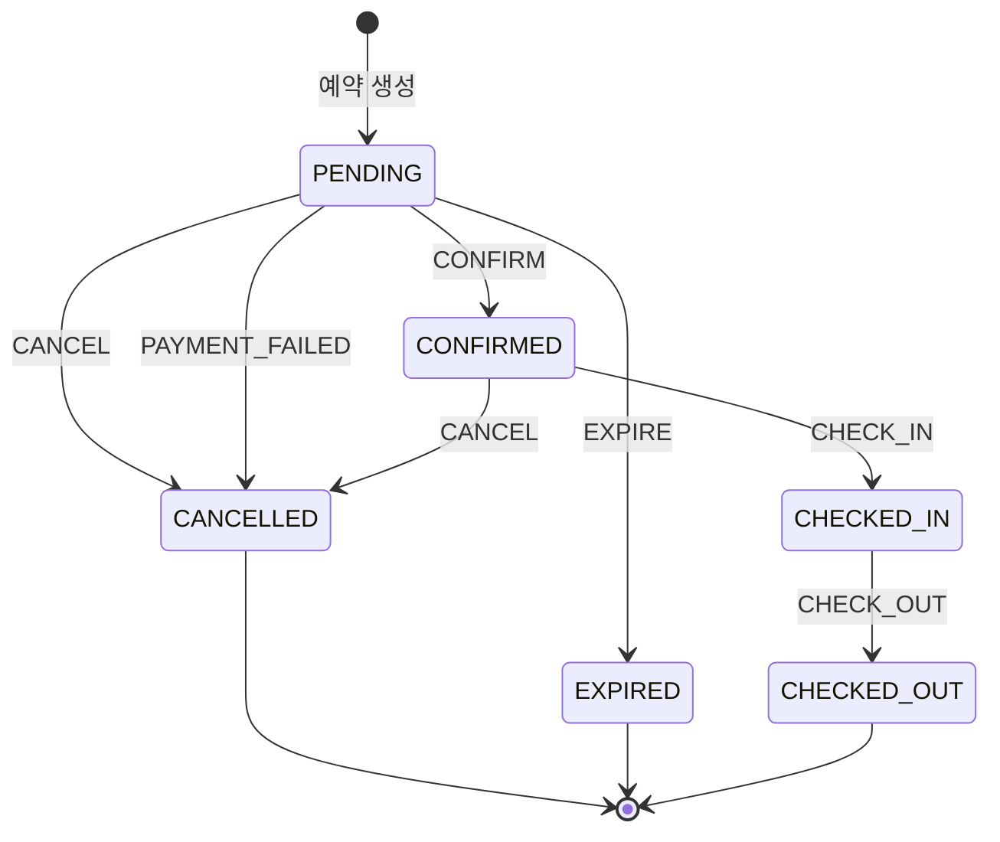

# F04 부하테스트 시나리오 설계

- 상태: 승인 대기
- 작성일: 2026-08-15
- 승인일:
- 근거 문서: `docs/spec/00-problem-and-scope.md`, `docs/briefings/F04.md`, `.claude/skills/load-test/SKILL.md`, `docs/architecture/coding-rules.md`

## 1. 이 문서가 정하는 것

API가 아직 없다. 그래서 지금 확정하는 것은 URL이 아니라 **무엇을 어떤 부하로 때리고, 무엇을 참으로 판정할 것인가**이다.

시나리오마다 아래 넷을 숫자로 못박는다.

1. **부하 모델** — 얼마나 많은 요청을 어떤 곡선으로 꽂는가
2. **불변식** — 부하가 끝난 뒤 반드시 참이어야 하는 명제
3. **불변식 검증 쿼리** — 그 명제를 DB에서 직접 확인하는 SQL
4. **임계값** — 지연·에러율의 합격선

**불변식과 임계값은 급이 다르다.** 불변식은 하드 게이트다. 하나라도 깨지면 그 시나리오는 실패이고 리포트에 실패로 쓴다. 임계값은 참고선이다. 로컬 머신에서 잰 수치라 못 넘겼다고 설계가 틀린 것은 아니며, 못 넘긴 이유를 병목 분석으로 설명하면 된다.

## 2. 증명 대상과 시나리오 매핑

브리핑의 명제 (가)~(라)에 시나리오를 건다. **어느 명제에도 걸리지 않는 시나리오는 만들지 않는다.**

| 시나리오 | 증명하는 명제 | 등급 | 의존 |
|---|---|---|---|
| S1 재고 경합 (순간 집중) | (가) 초과 판매 0 | 필수 | F01 |
| S2 재고 경합 (지속 부하) | (가) 초과 판매 0 | 필수 | F01 |
| S3 멱등성 폭주 | (나) 중복 예약 0 | 필수 | F01 |
| S4 상태 전이 경합 (취소×확정) | (다) 금지 전이 0 | 필수 | F01 |
| S5 락 유무 대조 | (라) 상대 비교 + (가) | 필수 | F01 + 락 스위치 |
| S6 혼합 지속 부하 (재고 누수 검출) | (가)(다) 종합 | 필수 | F01 |
| S7 프로모션 스파이크 | (가) 스파이크 형태 | 조건부 | F02 |
| S8 조회 폭주 속 예약 · 캐시 유무 대조 | (라) 상대 비교 | 조건부 | F03 캐시 |

**S1~S6은 F01 하나만 병합되면 전부 돌아간다.** 00 문서 D4의 절단 순서(F03 캐시 → UC-6 → F02)가 발동해도 명제 (가)(나)(다)와 (라)의 락 대조는 그대로 증명된다.

일정이 극단적으로 밀릴 때의 내부 절단 순서: **S8 → S7 → S6 → S2.** S1·S3·S4·S5는 자르지 않는다. 이 넷이 네 명제의 최소 집합이다.

## 3. 공통 규약

### 3-1. 응답 코드를 어떻게 셀 것인가

부하테스트에서 가장 쉽게 틀리는 지점이다. **거절은 에러가 아니다.**

| 응답 | 의미 | 성능 지표에서 | 불변식 판정에서 |
|---|---|---|---|
| 201 | 예약 생성 성공 | 성공 | 성공 건수로 센다. **이 수가 재고와 맞아야 한다** |
| 200 | 멱등 재요청에 저장된 결과 반환 | 성공 | 새 예약이 아니다. 별도로 센다 |
| 409 `INSUFFICIENT_INVENTORY` | 재고 소진. **설계대로 동작한 것** | 실패로 세지 않는다 | 정상. (가)의 증거다 |
| 409 `DUPLICATE_REQUEST` / `REQUEST_IN_PROGRESS` | 멱등성 방어 작동 | 실패로 세지 않는다 | 정상. (나)의 증거다 |
| 409 `INVALID_STATE_TRANSITION` | 전이 표 밖 요청 거부 | 실패로 세지 않는다 | 정상. (다)의 증거다 |
| 503 `LOCK_ACQUISITION_FAILED` | 락 대기 상한 초과 | **실패로 센다** (별도 지표) | 불변식 위반은 아니다 |
| 5xx (503 락 실패 제외) | 진짜 장애 | 실패 | **한 건이라도 나오면 조사 대상** |

503 락 실패를 실패로 세는 이유: 사용자 입장에서는 재고가 있는데도 예약을 못 한 것이다. 정확성은 지켜졌지만 가용성은 깎였다. 이건 **락 설계의 비용**이고, S5 대조에서 정확히 이 값을 락 없는 쪽과 비교한다.

k6 구현: `http.setResponseCallback(http.expectedStatuses(200, 201, 409))`로 `http_req_failed`가 409를 실패로 세지 않게 하고, 503과 5xx는 커스텀 카운터로 따로 센다.

### 3-2. 공통 커스텀 지표

모든 스크립트가 같은 이름으로 센다. 리포트에서 시나리오 간 비교가 가능해야 한다.

| 지표 | 세는 것 |
|---|---|
| `rsv_created` | 201 |
| `rsv_replayed` | 200 (멱등 재요청 응답) |
| `rej_inventory` | 409 INSUFFICIENT_INVENTORY |
| `rej_duplicate` | 409 DUPLICATE_REQUEST + REQUEST_IN_PROGRESS |
| `rej_transition` | 409 INVALID_STATE_TRANSITION |
| `lock_failed` | 503 LOCK_ACQUISITION_FAILED |
| `server_error` | 위에 해당하지 않는 5xx·연결 실패 |

**모든 시나리오의 1차 검산식:** `rsv_created + rsv_replayed + rej_* + lock_failed + server_error = 총 요청 수`. 이게 안 맞으면 스크립트가 응답을 놓친 것이므로 결과 해석 전에 스크립트를 고친다.

### 3-3. 데이터 격리

시나리오끼리 간섭하면 불변식 검증이 무의미해진다. **시나리오마다 다른 숙박 날짜를 쓴다.**

| 시나리오 | 전용 날짜 |
|---|---|
| S1 | 2026-09-01 |
| S2 | 2026-09-02 |
| S3 | 2026-09-03 |
| S4 | 2026-09-04 |
| S5 | 2026-09-05 (락 ON) / 2026-09-06 (락 OFF) |
| S6 | 2026-09-11 ~ 2026-09-20 |
| S7 | 프로모션 전용 (F02 스펙 확정 후) |
| S8 | 2026-09-21 ~ 2026-09-30 |

날짜 대역이 F01 시드 범위(착수 브리핑 참고값: 오늘부터 90일치) 안에 들어간다. 시드 범위가 달라지면 이 표를 고친다.

### 3-4. 실행 전 초기화

**이전 실행의 잔여 데이터가 섞이면 불변식 검증이 전부 무의미하다.** 매 실행 전에 `load-test/reset.sh`를 돌린다.

```
1. 해당 시나리오 날짜 대역의 예약 행 삭제
2. 해당 날짜 대역의 재고를 시나리오가 요구하는 초기값으로 UPDATE
3. Redis FLUSHDB (멱등성 키·분산락·캐시 전부 비움)
4. 초기 상태 검증 쿼리 실행 — 예약 0건, 재고 = 설정값. 여기서 안 맞으면 실행하지 않는다
```

3번을 빼먹으면 S3(멱등성)이 이전 실행의 키에 걸려 전부 409를 받는다. 반드시 넣는다.

### 3-5. 측정 노이즈 대응

로컬 한 대에서 앱·DB·k6가 함께 도는 환경이라 실행마다 값이 흔들린다.

- 모든 성능 측정 시나리오는 **워밍업 30초**(임계값·집계 제외) 후 본 부하를 건다. JIT 컴파일과 커넥션 풀 예열이 끝나야 한다
- **대조 시나리오(S5, S8)는 3회씩 돌려 중앙값을 채택한다.** 두 조건을 번갈아 실행해(ON→OFF→ON→OFF→ON→OFF) 시간대 편향을 줄인다
- 불변식 검증은 매 실행마다 한다. 3회 중 1회라도 깨지면 실패다

### 3-6. 실행 환경의 한계 (리포트 필수 기재 사항)

시나리오를 설계하는 단계에서부터 못박아 둔다. **여기서 나올 숫자가 무엇의 근거가 되고 무엇의 근거가 못 되는지**를 미리 정해두지 않으면, 리포트를 쓸 때 절대값을 성능 주장으로 잘못 쓰게 된다.

- 앱, MySQL, Redis, k6가 **전부 같은 노트북 한 대**(Apple M2 8코어 / 16GB)에서 돈다. 부하 생성기가 피시험 대상과 CPU·메모리를 나눠 쓴다
- 그래서 처리량·지연의 **절대값은 이 시스템의 성능 한계가 아니다.** k6가 CPU를 뺏어 앱이 못 낸 성능일 수도 있고 그 반대일 수도 있으며, 이 환경에서는 둘을 분리할 수 없다
- **근거로 쓸 수 있는 것은 상대 비교다.** 같은 머신·같은 부하·같은 시각대에 조건 하나만 바꿔 잰 두 값의 차이(S5 락 유무, S8 캐시 유무)만이 설계 판단의 근거가 된다
- **정확성(불변식) 검증은 환경 한계와 무관하게 유효하다.** "재고 10에 성공 10건"은 머신이 느리든 빠르든 참이거나 거짓이다

리포트는 이 구분을 문장으로 명시한다. **성능 수치는 참고, 불변식 검증은 결론.**

리포트에 기록할 환경 항목: 머신 사양, 앱·DB·k6 동시 구동 사실, HikariCP 최대 커넥션(현재 20), MySQL 격리 수준(REPEATABLE-READ), k6 버전(v0.57.0), 실행 시각, 동시에 돌던 다른 프로세스.

## 4. 시나리오

### S1. 재고 경합 — 순간 집중 [필수 / 명제 (가)]

가장 단순하고 가장 중요한 시나리오다. 리포트의 첫 문장이 여기서 나온다.

**노리는 경합:** 같은 `(객실타입, 날짜)` 재고 행 하나에 요청이 한꺼번에 도달한다. 순진한 구현(조회 → 판단 → 저장)이라면 여기서 초과 판매가 난다.

| 항목 | 값 |
|---|---|
| 대상 | 예약 생성 API |
| 초기 재고 | **10실** (객실타입 1종, 날짜 2026-09-01, 1박) |
| 부하 모델 | `shared-iterations` — VU 200, iterations 200, maxDuration 60s |
| 총 요청 | 200건 (재고의 20배) |
| 지속 시간 | 수 초 (전량 소진까지) |
| 요청 구성 | 요청마다 서로 다른 `X-User-Id`(1~200), 서로 다른 `Idempotency-Key`(UUID), 전부 같은 객실타입·같은 날짜·1실 |

VU 200이 각각 1회만 쏘게 해서 **도달 시점을 최대한 겹친다.** 요청 수를 늘리는 것보다 겹치는 게 중요한 시나리오다.

**불변식**

| # | 명제 | 검증 |
|---|---|---|
| I1 | 성공 응답이 **정확히 10건** | k6 `rsv_created == 10` |
| I2 | DB의 활성 예약 행이 **정확히 10건** | Q1 |
| I3 | 재고가 음수인 행이 **0건** | Q2 |
| I4 | 해당 날짜 잔여 재고가 **정확히 0** | Q3 |
| I5 | `초기 재고 = 잔여 + 활성 예약 실수 합` | Q4 |
| I6 | 나머지 190건이 전부 정중히 거절됨 (5xx 0건) | `server_error == 0` |

**I1과 I2가 같아야 한다는 점이 핵심이다.** k6가 201을 10번 받았는데 DB에 11건이 있으면(또는 그 반대면) 응답과 실제가 어긋난 것이고, 이건 초과 판매보다 더 나쁜 버그다.

**검증 쿼리** (테이블·컬럼명은 §6의 잠정 이름. F01 스펙 확정 시 확정한다)

```sql
-- Q1. 활성 예약 행 수 (기대: 10)
SELECT COUNT(*) AS active_reservations
FROM reservation
WHERE room_type_id = :rt AND stay_start = '2026-09-01'
  AND status NOT IN ('CANCELLED', 'EXPIRED');

-- Q2. 재고 음수 행 (기대: 0행. 한 행이라도 나오면 즉시 실패)
SELECT * FROM room_daily_inventory WHERE remaining < 0;

-- Q3. 해당 날짜 잔여 (기대: 0)
SELECT remaining FROM room_daily_inventory
WHERE room_type_id = :rt AND stay_date = '2026-09-01';

-- Q4. 보존식: 잔여 + 활성 예약 실수 = 초기 재고 (기대: 10)
SELECT i.remaining + COALESCE(SUM(r.room_count), 0) AS total
FROM room_daily_inventory i
LEFT JOIN reservation r
  ON r.room_type_id = i.room_type_id
 AND i.stay_date BETWEEN r.stay_start AND r.stay_end - INTERVAL 1 DAY
 AND r.status NOT IN ('CANCELLED', 'EXPIRED')
WHERE i.room_type_id = :rt AND i.stay_date = '2026-09-01'
GROUP BY i.remaining;
```

**임계값**

| 지표 | 합격선 |
|---|---|
| `http_req_duration` p95 | < 1,000ms |
| `server_error` | 0 (하드) |
| `lock_failed` 비율 | < 5% |
| `rej_inventory` | ≥ 180 |

---

### S2. 재고 경합 — 지속 부하 [필수 / 명제 (가)]

S1이 "한순간"을 본다면 S2는 "계속 밀려드는 동안"을 본다. 처리량 측정의 기준선(baseline)이자 S5 대조의 부하 원본이다.

**노리는 경합:** 재고가 소진되는 과정 전체. 소진 직전, 소진 순간, 소진 이후 각 구간에서 동작이 달라지는지 본다.

| 항목 | 값 |
|---|---|
| 초기 재고 | **100실** (날짜 2026-09-02) |
| 부하 모델 | `constant-arrival-rate` — rate 300/s, timeUnit 1s, duration 20s, preAllocatedVUs 200, maxVUs 400 |
| 총 요청 | 약 6,000건 (재고의 60배) |
| 워밍업 | 별도 워밍업 시나리오 30초 (다른 날짜 대역 사용, 집계 제외) |
| 요청 구성 | 요청마다 서로 다른 사용자·멱등성 키, 전부 같은 객실타입·같은 날짜·1실 |

**도착률 고정(arrival-rate) 모델을 쓰는 이유:** VU 고정 모델은 앱이 느려지면 요청 수도 같이 줄어들어, 느려진 사실이 지표에 안 보인다. 도착률을 고정해야 앱이 못 따라오는 만큼 지연과 큐가 드러난다. **S5 대조에서 두 조건에 같은 부하를 넣었다고 말하려면 이 모델이어야 한다.**

**불변식** — S1의 I1~I6과 동일. 숫자만 10 → 100.

| # | 명제 |
|---|---|
| I1 | `rsv_created == 100` |
| I2 | 활성 예약 행 == 100 |
| I3 | `remaining < 0` 행 0건 |
| I4 | 잔여 == 0 |
| I5 | 보존식 성립 |
| I6 | `server_error == 0` |

**임계값**

| 지표 | 합격선 |
|---|---|
| p95 | < 800ms |
| p99 | < 2,000ms |
| `server_error` | 0 (하드) |
| `lock_failed` 비율 | < 5% |
| 달성 RPS | 목표 300/s의 80% 이상 (< 240/s면 병목 분석 필수) |

---

### S3. 멱등성 폭주 [필수 / 명제 (나)]

**노리는 상황:** 클라이언트 재시도, 네트워크 타임아웃 후 재전송, 사용자 더블클릭. 같은 요청이 여러 번 도착한다.

재고는 넉넉히 둔다. **재고 경합이 섞이면 "예약이 한 건인 이유"가 멱등성 때문인지 재고 부족 때문인지 구분이 안 된다.** 이 시나리오는 멱등성만 격리해서 본다.

두 하위 케이스로 나눈다. 성격이 다르다.

**S3-A. 재시도 폭주 (순차적 재전송)**

| 항목 | 값 |
|---|---|
| 초기 재고 | **200실** (넉넉히. 날짜 2026-09-03) |
| 멱등성 키 | **20개**를 준비하고, 각 키를 **50번씩** 재전송 |
| 부하 모델 | `shared-iterations` — VU 100, iterations 1,000 |
| 총 요청 | 1,000건 |
| 기대 예약 | **정확히 20건** |
| 키 선택 | `keys[iterationInTest % 20]` — 같은 키가 여러 VU에 흩어져 동시에도 겹친다 |

**S3-B. 더블클릭 (완전 동시 2연타)**

| 항목 | 값 |
|---|---|
| 멱등성 키 | **100개**, 각 키를 **정확히 2개 VU가 동시에** 발사 |
| 부하 모델 | `shared-iterations` — VU 200, iterations 200 |
| 총 요청 | 200건 |
| 기대 예약 | **정확히 100건** |

S3-B가 더 어려운 케이스다. `SET NX`가 아직 안 끝난 상태에서 두 번째가 들어오는 좁은 틈을 노린다.

**불변식**

| # | 명제 | 검증 |
|---|---|---|
| I1 | 예약 행 수가 **정확히 키 개수** (A: 20, B: 100) | Q5 |
| I2 | **한 멱등성 키에 예약이 2건 이상인 경우가 0건** | Q6 |
| I3 | 재고 차감량 == 키 개수 (A: 200→180, B: 200→100) | Q7 |
| I4 | 같은 키에 대한 모든 성공 응답의 예약 ID가 **전부 동일** | k6 측: 키별 응답 ID를 모아 distinct == 1 |
| I5 | 응답으로 받은 예약 ID가 전부 DB에 실제로 존재 | Q8 |
| I6 | `server_error == 0` | k6 |

I4가 중요하다. 재요청에 200을 주면서 **다른 예약 ID**를 주면 DB에는 한 건이어도 클라이언트는 두 예약이 있다고 믿는다. 행 수만 세면 이 버그를 놓친다.

**검증 쿼리**

```sql
-- Q5. 예약 행 수 (기대: 키 개수)
SELECT COUNT(*) FROM reservation
WHERE room_type_id = :rt AND stay_start = '2026-09-03'
  AND status NOT IN ('CANCELLED', 'EXPIRED');

-- Q6. 멱등성 키 중복 (기대: 0행)
SELECT idempotency_key, COUNT(*) AS cnt
FROM reservation
WHERE stay_start = '2026-09-03'
GROUP BY idempotency_key HAVING COUNT(*) > 1;

-- Q7. 재고 차감량 (기대: A는 180, B는 100)
SELECT remaining FROM room_daily_inventory
WHERE room_type_id = :rt AND stay_date = '2026-09-03';

-- Q8. 응답 ID가 전부 실존하는가 (k6가 남긴 ID 목록과 대조. 기대: 두 집합이 일치)
SELECT id FROM reservation WHERE stay_start = '2026-09-03' ORDER BY id;
```

**임계값**

| 지표 | 합격선 |
|---|---|
| p95 | < 500ms (재고 경합이 없으므로 S1·S2보다 빨라야 정상) |
| `server_error` | 0 (하드) |
| `rsv_created + rsv_replayed + rej_duplicate` | == 총 요청 수 |

---

### S4. 상태 전이 경합 — 취소 × 확정 [필수 / 명제 (다)]

**노리는 경합:** 같은 예약 한 건에 취소와 확정이 같은 순간에 도착한다. 상태머신이 if-else로 흩어져 있으면 여기서 깨진다.

전이 표(00 문서 4절)를 다시 본다.



**여기서 판정을 정밀하게 해야 한다.** PENDING에서 CONFIRM과 CANCEL은 **둘 다 표 안에 있는 전이**다. 그리고 CONFIRMED에서 CANCEL도 표 안에 있다. 그래서 "둘 다 성공했다"가 곧 위반은 아니다.

진짜 위반은 이것이다.

| 판정 | 결과 |
|---|---|
| 하나만 성공, 다른 하나 409 | **정상** |
| 둘 다 성공, 최종 상태 CANCELLED (CONFIRM 먼저 → CANCEL) | **정상.** 표를 두 번 탄 것 |
| 둘 다 성공, 최종 상태 CONFIRMED | **위반.** CANCEL이 성공했다면 CONFIRMED로 끝날 수 없다 |
| CANCEL 성공 응답 후 도착한 CONFIRM이 성공 | **위반.** CANCELLED는 종료 상태다 |
| 최종 상태가 PENDING | **위반.** 둘 중 하나는 반드시 먹혀야 한다 |
| 재고가 상태와 안 맞음 | **위반.** §아래 I4 |

| 항목 | 값 |
|---|---|
| 사전 준비 | PENDING 예약 **300건**을 미리 생성 (`load-test/seed-pending.js` 또는 setup 단계). 재고 넉넉히(400실), 날짜 2026-09-04 |
| 부하 모델 | `shared-iterations` — VU 600, iterations 600 |
| 요청 구성 | 예약 1건당 VU 2개가 짝을 이뤄 하나는 CONFIRM, 하나는 CANCEL을 **동시에** 발사 |
| 총 요청 | 600건 (300쌍) |

**불변식**

| # | 명제 | 검증 |
|---|---|---|
| I1 | 최종 상태가 PENDING인 예약이 **0건** | Q9 |
| I2 | 최종 상태가 전부 CONFIRMED 또는 CANCELLED (제3의 상태 0건) | Q9 |
| I3 | CANCEL이 2xx를 받은 예약 중 최종 상태가 CONFIRMED인 것 **0건** | k6 응답 로그 × Q10 대조 |
| I4 | **상태와 재고가 짝이 맞는다.** 잔여 = 400 − (CONFIRMED 건수) | Q11 |
| I5 | `rej_transition ≥ 1`. 거절이 하나도 없으면 경합이 안 일어난 것이므로 **시나리오 자체를 의심한다** | k6 |
| I6 | `server_error == 0` | k6 |

I5를 넣는 이유: 거절이 0건이면 "완벽하다"가 아니라 "두 요청이 실제로는 겹치지 않았다"일 가능성이 크다. **경합이 일어났다는 증거 없이 경합에 안전하다고 쓸 수 없다.** 0건이면 발사 타이밍을 조여 재실행한다.

**검증 쿼리**

```sql
-- Q9. 최종 상태 분포 (기대: CONFIRMED + CANCELLED = 300, 그 외 0)
SELECT status, COUNT(*) FROM reservation
WHERE stay_start = '2026-09-04' GROUP BY status;

-- Q10. 예약별 최종 상태 (k6가 남긴 "CANCEL이 2xx였던 예약 ID" 목록과 대조)
SELECT id, status FROM reservation WHERE stay_start = '2026-09-04';

-- Q11. 재고 정합 (기대: remaining = 400 - CONFIRMED 건수)
SELECT i.remaining,
       (SELECT COUNT(*) FROM reservation r
         WHERE r.stay_start = '2026-09-04' AND r.status = 'CONFIRMED') AS confirmed
FROM room_daily_inventory i
WHERE i.room_type_id = :rt AND i.stay_date = '2026-09-04';
```

**임계값**

| 지표 | 합격선 |
|---|---|
| p95 | < 800ms |
| `server_error` | 0 (하드) |
| `rej_transition` | ≥ 1 (경합 발생의 증거) |

---

### S5. 락 유무 대조 [필수 / 명제 (라) + (가)]

**이 시나리오가 리포트의 서사다.**

`docs/architecture/coding-rules.md`의 다층 방어 절은 이렇게 주장한다.

> 1차: Redis 분산락 — 대부분의 경합을 DB 앞에서 차단
> 2차: DB 조건부 업데이트 — 락이 만료·실패해도 원자성 보장
> 3차: DB 제약 — 위 둘이 뚫려도 잘못된 데이터는 저장 불가
> **1차가 뚫려도 2차가 막는다는 것을 테스트로 증명한다.**

S5는 그 증명이다. **1차 방어선을 끄고 같은 부하를 넣는다.**

| 항목 | 값 |
|---|---|
| 부하 | **S2와 완전히 동일** (재고 100, 300 RPS × 20s ≈ 6,000건) |
| 조건 A | 분산락 ON — 날짜 2026-09-05 |
| 조건 B | 분산락 OFF — 날짜 2026-09-06 |
| 실행 | ON→OFF→ON→OFF→ON→OFF, 각 3회. 매 실행 전 초기화 + 워밍업 30초. **중앙값 채택** |

**두 축으로 판정한다. 이 구분이 이 시나리오의 전부다.**

**축 1 — 정확성 (양쪽 모두 통과해야 한다)**

| # | 명제 |
|---|---|
| I1 | 조건 A: `rsv_created == 100`, 잔여 0, 음수 0건 |
| I2 | **조건 B: `rsv_created == 100`, 잔여 0, 음수 0건** |
| I3 | 양쪽 모두 보존식 성립 |

**I2가 이 프로젝트에서 가장 중요한 한 줄이다.** 락을 껐는데도 정확히 100건이면, 2차 방어선(조건부 UPDATE)이 실제로 작동한다는 뜻이고, Redis가 죽어도 데이터가 안 깨진다는 뜻이다.

**락을 껐을 때 초과 판매가 나오면 그것은 F04의 실패가 아니라 발견이다.** 리포트의 하이라이트로 쓰고 관리자에게 즉시 보고한다. 2차 방어선이 설계 주장대로 작동하지 않는다는 뜻이므로 F01의 수정 사항이 된다.

**축 2 — 비용 (여기서 차이가 나야 정상)**

| 비교 항목 | 무엇을 말해주는가 |
|---|---|
| 달성 RPS | 락이 처리량을 얼마나 깎았나 |
| p50 / p95 / p99 | 락 대기가 지연 분포의 어디에 얹혔나. **p99가 특히 벌어질 것으로 예상한다** |
| `lock_failed` (503) 건수·비율 | 락 대기 상한에 걸려 **정확성 대신 가용성을 내준 비용** |
| `rej_inventory` 응답의 p95 | 거절이 얼마나 빨리 나가나. 락 OFF면 DB까지 갔다 오므로 느릴 것으로 예상 |
| DB 커넥션 사용률 (HikariCP 지표, 최대 20) | 락 OFF에서 경합이 DB로 내려간 만큼 커넥션이 더 오래 잡히나 |
| MySQL 행 락 대기 | 락 OFF에서 InnoDB 행 락 경합이 늘어난 증거 |

**해석의 기대 그림 (검증 대상이지 전제가 아니다):** 락 ON은 경합을 앱 앞단에서 흡수해 DB 부담이 낮은 대신 락 대기·503이 생긴다. 락 OFF는 503이 사라져 요청은 다 처리되지만 경합이 DB로 내려가 지연 꼬리(p99)와 커넥션 점유가 늘어난다. **실측이 이 그림과 다르면 그림이 아니라 실측을 쓴다.**

**전제 조건 (미충족 시 이 시나리오는 실행 불가)**

분산락을 **설정으로 끌 수 있어야 한다.** 앱 재빌드 없이 `application.yml` 또는 환경 변수로 토글되는 형태여야 한다. 이건 F04가 만들 수 없다(Java 소스 비소유). **F01에 요청해야 하는 항목이며 §7 D2로 올린다.**

**임계값**

| 지표 | 합격선 |
|---|---|
| 양 조건 정확성 불변식 | 전부 통과 (하드) |
| `server_error` | 양쪽 0 (하드) |
| 3회 실행 간 달성 RPS 편차 | 중앙값 대비 ±20% 이내. 넘으면 측정 노이즈가 커서 비교 근거로 못 쓴다 → 반복 횟수를 5회로 늘린다 |

---

### S6. 혼합 지속 부하 — 재고 누수 검출 [필수 / 명제 (가)(다) 종합]

**노리는 것:** 앞의 시나리오들은 짧고 단일 동작이다. 실제 사고는 **예약·확정·취소가 오래 섞여 돌 때** 재고가 슬금슬금 어긋나는 형태로 온다. 취소는 성공했는데 복원이 안 되거나, 만료가 복원을 두 번 하거나 하는 것들이다. 짧은 테스트로는 안 보인다.

| 항목 | 값 |
|---|---|
| 대상 날짜 | 2026-09-11 ~ 2026-09-20 (10일치, 객실타입 여러 종) |
| 초기 재고 | 날짜·타입마다 **50실** |
| 부하 모델 | `constant-arrival-rate` — rate 200/s, duration **5분**, preAllocatedVUs 150, maxVUs 300 |
| 총 요청 | 약 60,000건 |
| 요청 구성 비율 | 예약 생성 60% / 확정 20% / 취소 15% / 조회 5% |
| 대상 선택 | 날짜·객실타입을 무작위로 골라 여러 재고 행에 분산. 확정·취소는 이 시나리오가 만든 예약 중에서 고른다 |

**불변식** — 이 시나리오의 핵심은 마지막 하나다.

| # | 명제 | 검증 |
|---|---|---|
| I1 | **모든 (객실타입, 날짜)에 대해 `잔여 + 활성 예약 실수 = 총 객실 수`** | Q12 — 어긋난 행이 하나라도 나오면 실패 |
| I2 | `remaining < 0` 행 0건 | Q2 |
| I3 | `remaining > 총 객실 수`인 행 0건 (복원 과다 = 없는 방을 파는 것) | Q13 |
| I4 | 전이 표 밖 상태에 도달한 예약 0건 | Q14 |
| I5 | 종료 상태(CANCELLED/EXPIRED/CHECKED_OUT) 예약이 재고를 점유하고 있지 않음 | Q12에 포함 |
| I6 | `server_error == 0` | k6 |

**I3을 빼먹지 않는다.** 초과 판매만 보고 복원 과다를 안 보면, 취소가 재고를 두 번 되돌리는 버그를 통과시킨다. 이건 반대 방향의 같은 버그이며 실제로는 더 찾기 어렵다.

**검증 쿼리**

```sql
-- Q12. 전 구간 보존식 (기대: 0행)
SELECT i.room_type_id, i.stay_date, i.remaining, rt.total_rooms,
       COALESCE(SUM(r.room_count), 0) AS held
FROM room_daily_inventory i
JOIN room_type rt ON rt.id = i.room_type_id
LEFT JOIN reservation r
  ON r.room_type_id = i.room_type_id
 AND i.stay_date BETWEEN r.stay_start AND r.stay_end - INTERVAL 1 DAY
 AND r.status NOT IN ('CANCELLED', 'EXPIRED')
WHERE i.stay_date BETWEEN '2026-09-11' AND '2026-09-20'
GROUP BY i.room_type_id, i.stay_date, i.remaining, rt.total_rooms
HAVING i.remaining + COALESCE(SUM(r.room_count), 0) <> rt.total_rooms;

-- Q13. 복원 과다 (기대: 0행)
SELECT i.* FROM room_daily_inventory i
JOIN room_type rt ON rt.id = i.room_type_id
WHERE i.remaining > rt.total_rooms;

-- Q14. 전이 표 밖 상태 (기대: 0행)
SELECT DISTINCT status FROM reservation
WHERE status NOT IN ('PENDING','CONFIRMED','CANCELLED','EXPIRED','CHECKED_IN','CHECKED_OUT');
```

**임계값**

| 지표 | 합격선 |
|---|---|
| p95 | < 1,000ms |
| `server_error` | 0 (하드) |
| 5분 내내 달성 RPS가 유지됨 | 후반부 RPS가 전반부의 80% 미만이면 자원 누수 의심 → 병목 분석 |
| 메모리·커넥션 지표 | 5분간 우상향 추세가 없을 것 (누수 검출) |

---

### S7. 프로모션 스파이크 [조건부 F02 / 명제 (가)]

**F02가 절단되면 이 시나리오는 폐기한다.** (00 문서 D4)

**노리는 것:** 트래픽이 한 점으로 몰리는 순간. S1이 "많이 몰림"이라면 S7은 "0에서 갑자기 최대치"다. 커넥션 풀·스레드 풀이 예열 없이 얻어맞는다.

| 항목 | 값 |
|---|---|
| 대상 | 선착순 특가 예약 API |
| 특가 재고 | **20실** |
| 부하 모델 | `ramping-arrival-rate` — startRate 0, stages: `{target: 500, duration: '3s'}` → `{target: 500, duration: '15s'}` → `{target: 0, duration: '2s'}`, preAllocatedVUs 300, maxVUs 600 |
| 총 요청 | 약 8,000건 (재고의 400배) |
| 요청 구성 | 요청마다 다른 사용자·멱등성 키 |

**워밍업을 하지 않는다.** 예열 없이 얻어맞는 것이 이 시나리오의 관심사다. 그래서 임계값도 다른 시나리오보다 느슨하다.

**불변식**

| # | 명제 |
|---|---|
| I1 | `rsv_created == 20` (정확히) |
| I2 | 특가 재고 잔여 == 0, 음수 0건 |
| I3 | DB 특가 예약 행 == 20 |
| I4 | 나머지 약 8,000건이 전부 정중히 거절 (`server_error == 0`) |
| I5 | 일반 재고가 특가 예약만큼 정확히 차감됨 (특가와 일반 재고의 관계는 F02 스펙 확정 후 확정) |

**임계값**

| 지표 | 합격선 |
|---|---|
| p95 | < 1,500ms (스파이크 특성상 완화) |
| p99 | < 3,000ms |
| `server_error` | 0 (하드) |
| `lock_failed` 비율 | < 20% (완화. 대신 리포트에 "몇 %가 락 대기로 거절됐는가"를 명시적으로 쓴다) |
| 첫 응답까지 시간 | 스파이크 시작 후 앱이 죽지 않고 응답을 계속 낼 것 |

---

### S8. 조회 폭주 속 예약 · 캐시 유무 대조 [조건부 F03 / 명제 (라)]

**F03 캐시가 절단되면 대조 부분은 폐기하고, 조회+예약 혼합 부하만 남긴다.** (00 문서 D4의 첫 번째 절단 대상이다)

**노리는 것:** 검색 트래픽이 예약 트래픽을 압도하는 실제 패턴. 그리고 **캐시가 보여주는 재고와 실제 재고의 차이.**

| 항목 | 값 |
|---|---|
| 대상 날짜 | 2026-09-21 ~ 2026-09-30 |
| 초기 재고 | 날짜·타입마다 **30실** |
| 부하 모델 | `constant-arrival-rate` — rate 500/s, duration 60s, preAllocatedVUs 200, maxVUs 500 |
| 요청 구성 | 검색 90% / 예약 생성 10% |
| 조건 A | 캐시 ON |
| 조건 B | 캐시 OFF (DB 직행) |
| 실행 | ON/OFF 각 3회 교차, 중앙값 채택 |

**불변식 (양쪽 공통)**

| # | 명제 |
|---|---|
| I1 | 초과 판매 0. `remaining < 0` 행 0건 |
| I2 | 전 구간 보존식 성립 (Q12) |
| I3 | `server_error == 0` |
| I4 | **검색 결과가 음수 잔여를 노출하지 않음** — 캐시가 계산한 값이 음수로 보이면 실패 |

**캐시 정합성 측정 — 별도 프로브 VU**

메인 부하와 별개로 VU 1개가 500ms 간격으로 특정 객실타입·날짜를 검색한다. 그 사이 부하가 그 재고를 소진시킨다.

| 측정값 | 정의 |
|---|---|
| stale window | 재고가 실제로 0이 된 시각(DB 기준) ~ 검색 결과에서 그 객실타입이 사라진 시각의 차이 |
| 합격선 | **stale window ≤ (F03 캐시 TTL) + 2초.** TTL은 F03 스펙 확정 후 이 표에 숫자를 채운다 |
| 캐시 OFF 기준선 | ≤ 1초 (프로브 간격 + 여유) |

**정합성 비용을 정직하게 쓴다.** 캐시 ON이 빠른 대신 몇 초간 팔린 방을 팔 것처럼 보여준다면, 그 몇 초가 캐시의 가격이다. 리포트에 처리량 이득과 stale window를 나란히 놓는다.

**비교 항목 (축 2)**

| 항목 | 무엇을 말해주는가 |
|---|---|
| 검색 p50 / p95 / p99 | 캐시의 직접 효과 |
| 달성 RPS | 500/s를 양쪽 다 감당하는가 |
| **예약 API의 p95** | 검색이 DB를 덜 때리면 예약이 얼마나 편해지는가. **이게 캐시의 진짜 값어치다** |
| DB 커넥션 사용률 (최대 20) | 캐시 OFF에서 검색이 커넥션을 얼마나 잡아먹나 |
| stale window | 정합성 비용 |

**임계값**

| 지표 | 합격선 |
|---|---|
| 캐시 ON 검색 p95 | < 200ms |
| 캐시 OFF 검색 p95 | 기준선으로 기록 (합격선 없음) |
| 정확성 불변식 | 양쪽 전부 통과 (하드) |
| `server_error` | 양쪽 0 (하드) |

## 5. 실행 계획

00 문서 일정 기준: 8/16 저녁 실행 착수, 8/17 리포트.

| 순서 | 시나리오 | 예상 소요 (초기화·검증 포함) | 조건 |
|---|---|---|---|
| 1 | S1 재고 경합 (순간) | 10분 | F01 병합 |
| 2 | S3 멱등성 (A/B) | 15분 | F01 병합 |
| 3 | S4 상태 전이 경합 | 15분 | F01 병합 |
| 4 | S2 재고 경합 (지속) | 15분 | F01 병합 |
| 5 | S5 락 대조 (6회) | 40분 | **락 스위치 필요** |
| 6 | S6 혼합 지속 (5분 × 1회) | 20분 | F01 병합 |
| 7 | S7 프로모션 스파이크 | 15분 | F02 병합 |
| 8 | S8 캐시 대조 (6회) | 40분 | F03 병합 |

S1~S4를 먼저 돌리는 이유: **가장 짧고 가장 명확한 명제부터 확보한다.** 시간이 부족해지면 뒤가 잘리지 앞이 잘리지 않는다.

**실행 중 앱·DB·k6가 같은 머신에서 돈다.** 실행 시각과 동시에 돌던 다른 프로세스를 기록해 리포트에 남긴다.

## 6. 미확정 항목 — F01 스펙 확정 후 채운다

**추정하지 않는다.** 아래는 전부 비워두고, F01 스펙이 병합되면 채운다. 그때까지 스크립트는 이 값들을 상수 파일(`load-test/config.js`) 한 곳에 모아 두고 참조만 한다.

| 항목 | 현재 | 확정 근거 |
|---|---|---|
| 예약 생성 엔드포인트 경로 | 미확정 | F01 스펙 8절 |
| 확정·취소 엔드포인트 경로 | 미확정 | F01 스펙 8절 |
| 요청 본문 필드명 (객실타입 ID, 체크인/아웃, 실수, 인원) | 미확정 | F01 스펙 8절 |
| 응답 본문의 예약 ID 필드명 | 미확정 | F01 스펙 8절 |
| 멱등 재요청 응답 코드 (200 재반환인가 409인가) | 미확정 | F01 스펙 7절 |
| 테이블·컬럼명 (`reservation`, `room_daily_inventory`, `remaining`, `stay_date` 등) | **잠정** — 00 문서와 diagram-rules에 등장한 이름을 그대로 썼다 | F01 스펙 5절 + V001 마이그레이션 |
| 예약이 여러 실(`room_count`)을 지원하는가 | 잠정 (1실 고정으로 설계) | F01 스펙 6절 |
| 상태 이력 테이블 존재 여부 | 없다고 가정 | F01 스펙 5절. **있으면 S4 판정이 훨씬 정밀해진다** |
| 수동 만료(EXPIRE) 트리거 API | 미확정 | 있으면 만료×확정 경합 시나리오를 S4에 추가한다 |
| 시드 재고 규모·날짜 범위 | 참고값(호텔 2, 타입 5, 90일) | F01 스펙 |
| F03 캐시 TTL | 미확정 | F03 스펙. S8 stale window 합격선에 필요 |
| 특가와 일반 재고의 관계 | 미확정 | F02 스펙. S7 I5에 필요 |

## 7. 결정 검토란

이 문서를 쓰면서 작성자가 내린 결정입니다. 항목 번호로 동의 여부를 알려주세요. 전부 동의해야 승인입니다.

### D1. 409는 실패로 세지 않고, 503(락 실패)은 실패로 센다

- **결정:** 재고 부족·중복 요청·금지 전이로 인한 409는 "설계대로 거절한 것"이므로 에러율에서 뺀다. 반면 락 획득 실패로 인한 503은 에러율에 포함해 별도 지표로 센다.
- **이유:** 409는 시스템이 옳게 동작한 증거다. 이걸 실패로 세면 "정확할수록 에러율이 높은 시스템"이라는 이상한 결론이 나온다. 반대로 503은 재고가 남아 있는데도 예약을 못 해준 것이라, 정확성은 지켰지만 사용자는 손해를 봤다. 이 손해가 **락 설계의 가격**이고, S5에서 락 없는 쪽과 비교할 대상이 바로 이 값이다.
- **트레이드오프:** 에러율 지표가 두 갈래로 나뉘어 리포트를 읽는 사람이 한 숫자로 "얼마나 안정적인가"를 판단할 수 없다. 표를 봐야 한다.
- **대안이었던 것:** 503도 정상 거절로 보고 전부 제외(락의 가용성 비용이 안 보임), 409까지 전부 실패로 셈(재고 소진 시 에러율 95%가 나와 무의미).
- **확인 질문:** 409는 정상, 503은 실패로 세는 이 구분에 동의합니까?

### D2. 분산락 on/off 스위치를 F01에 요청한다 (앱 코드 변경 필요)

- **결정:** S5(락 유무 대조)를 실행하려면 앱을 다시 빌드하지 않고 설정값이나 환경 변수로 분산락을 끌 수 있어야 한다. F04는 Java 소스를 소유하지 않으므로 직접 만들지 않고, 관리자를 통해 F01에 요청 사항으로 올린다.
- **이유:** `coding-rules.md`의 다층 방어 절이 "1차가 뚫려도 2차가 막는다는 것을 테스트로 증명한다"고 이미 요구하고 있다. 즉 이 스위치는 F04를 위한 특수 장치가 아니라 F01이 자기 동시성 테스트를 위해서도 필요한 것이다. 두 세션이 같은 것을 원하므로 F01이 만드는 편이 자연스럽다.
- **트레이드오프:** F04가 F01에 의존을 하나 만든다. F01이 안 만들어주면 명제 (라)의 절반이 증명되지 않는다. 또 프로덕션 코드에 "안전장치를 끄는 스위치"가 들어가는 것 자체가 위험 요소다(운영에서 실수로 켜지면 사고).
- **대안이었던 것:** F04가 직접 소스를 고침(소유 규칙 위반이라 기각), 락 OFF 대조를 포기하고 락 ON만 측정(다층 방어 주장이 증명되지 않아 기각), Redis를 통째로 내려서 락을 무력화(앱이 락 실패로 전부 503을 뱉을 가능성이 커서 대조가 안 됨 — 다만 "Redis 장애 시나리오"로는 따로 가치가 있어 보조 실험으로 남겨둘 만하다).
- **확인 질문:** 분산락 비활성화 스위치를 F01 스펙에 넣어달라고 요청해도 괜찮습니까? 그리고 그 스위치는 **테스트 프로파일에서만 켤 수 있도록** 제한하는 편이 좋겠습니까?

### D3. 부하 규모를 300 RPS / 200 VU 수준으로 잡는다

- **결정:** 지속 부하는 300 RPS(S2·S5), 혼합 부하는 200 RPS(S6), 조회 혼합은 500 RPS(S8), 스파이크 순간 최대는 500 RPS(S7)로 상한을 둔다. 순간 집중은 200 VU(S1)다.
- **이유:** 앱·MySQL·Redis·k6가 전부 Apple M2 8코어 한 대에서 돈다. 이보다 크게 올리면 k6가 CPU를 뺏어 측정하는 게 앱 성능인지 k6 성능인지 구분이 안 된다. 그리고 이 프로젝트에서 중요한 건 절대 처리량이 아니라 **재고 10에 요청 200이 몰렸을 때 성공이 정확히 10인가**이므로, 경합 배율(재고 대비 요청 20~400배)만 충분하면 목적은 달성된다.
- **트레이드오프:** "초당 몇 건까지 버티는가"라는 질문에 답하지 못한다. 이 시스템의 성능 한계를 찾는 실험은 못 한다.
- **대안이었던 것:** 한계까지 올리는 실험(같은 머신에서는 신뢰할 수 없는 숫자가 나옴), 별도 머신에서 부하 생성(가용한 머신이 없음).
- **확인 질문:** 성능 한계 탐색은 포기하고, 경합 배율 확보와 상대 비교에 집중하는 이 규모에 동의합니까?

### D4. 시나리오를 필수/조건부로 나누고, 내부 절단 순서를 미리 정한다

- **결정:** S1~S6을 필수(F01만 있으면 실행 가능), S7·S8을 조건부(F02·F03 의존)로 둔다. 시간이 부족하면 S8 → S7 → S6 → S2 순으로 자르고, **S1·S3·S4·S5는 자르지 않는다.**
- **이유:** 00 문서 D4가 "F04 부하테스트는 자르지 않는다"고 했지만, 앞 feature가 잘리면 때릴 대상이 사라지는 형태로 영향을 받는다. 미리 등급을 나눠두면 F02·F03이 잘려도 리포트의 핵심 명제는 그대로 남는다. S1·S3·S4·S5가 남기지 않으면 안 되는 최소 집합인 이유는 이 넷이 각각 명제 (가)(나)(다)(라)에 정확히 하나씩 대응하기 때문이다.
- **트레이드오프:** 최악의 경우 리포트에 스파이크 시나리오와 캐시 대조가 없다. 상대 비교 서사가 "락 유무" 하나로 줄어 (라)가 얇아진다.
- **대안이었던 것:** 전부 필수로 두고 밀리면 그때 판단(급할 때 판단하면 잘못 자른다), F01 의존 시나리오만 설계하고 F02·F03은 나중에 설계(설계 시간이 실행 구간을 잡아먹음).
- **확인 질문:** 이 등급 구분과 내부 절단 순서(S8 → S7 → S6 → S2)에 동의합니까?

### D5. 초기화 스크립트가 F01 소유 테이블에 직접 DML을 친다

- **결정:** 매 실행 전 `load-test/reset.sh`가 예약 테이블의 행을 삭제하고 재고 테이블의 `remaining`을 시나리오 요구값으로 UPDATE하며 Redis를 FLUSHDB한다. F01이 소유한 테이블에 F04 스크립트가 직접 쓰는 것이다.
- **이유:** 이전 실행의 잔여 데이터가 남으면 "성공이 정확히 10건인가"라는 판정 자체가 성립하지 않는다. 초기화는 타협 불가다. 그리고 parallel-work의 소유 규칙은 **코드와 스키마**의 소유를 말하는 것이지 테스트 실행 중 데이터 조작을 금지하는 것으로는 읽히지 않는다. 스키마(마이그레이션)는 절대 건드리지 않는다.
- **트레이드오프:** F01이 컬럼명을 바꾸면 F04 스크립트가 조용히 깨진다. 결합이 생긴다. 또 초기화 스크립트를 로컬이 아닌 곳에 잘못 돌리면 데이터가 날아간다.
- **대안이었던 것:** F01에 테스트용 초기화 API를 요청(프로덕션 코드에 데이터 삭제 API를 넣는 게 더 위험하다고 판단), 매 실행마다 DB 컨테이너를 새로 띄우고 마이그레이션 재실행(안전하지만 실행마다 1~2분이 더 들어 8회 이상 도는 대조 시나리오에서 부담).
- **확인 질문:** 부하테스트 스크립트가 로컬 DB에 한해 직접 초기화 DML을 치는 것을 허용합니까? (안전장치로 접속 대상이 localhost가 아니면 스크립트가 거부하도록 만들 생각입니다)

### D6. 대조 시나리오는 3회 교차 실행 후 중앙값을 쓴다

- **결정:** S5·S8은 조건 A/B를 번갈아 3회씩(총 6회) 돌리고 중앙값을 채택한다. 3회 편차가 중앙값 대비 ±20%를 넘으면 5회로 늘린다.
- **이유:** 앱과 k6가 자원을 나눠 쓰는 환경이라 1회 측정은 그날 그 순간의 잡음이다. 교차로 돌리는 것은 "먼저 돈 쪽이 캐시가 차서 유리했다" 같은 시간 순서 편향을 없애기 위해서다.
- **트레이드오프:** 대조 시나리오 하나에 40분이 든다. 두 개면 80분이고, 8/16 저녁~8/17이라는 일정에서 작지 않은 비용이다.
- **대안이었던 것:** 1회씩만 측정(잡음을 신뢰할 수 없음), 5회 이상(시간이 부족).
- **확인 질문:** 대조 시나리오에 40분씩 쓰는 것에 동의합니까? 일정이 빠듯하면 S8을 1회씩으로 줄이고 S5만 3회로 갈 수도 있습니다.

### D7. 테이블·컬럼명을 잠정으로 쓰고, 스크립트는 상수 파일 한 곳에서 참조한다

- **결정:** 검증 쿼리에 쓴 `reservation`, `room_daily_inventory`, `remaining`, `stay_date` 등은 00 문서와 `diagram-rules.md`에 이미 등장한 이름을 그대로 쓴 **잠정값**이다. F01 스펙과 V001 마이그레이션이 병합되면 대조해 확정한다. 스크립트 쪽 엔드포인트·필드명도 `load-test/config.js` 한 파일에 모아 참조만 한다.
- **이유:** API 계약이 없다고 설계를 멈추면 실행 구간에 설계까지 하게 된다. 판정 기준(무엇이 참인가)은 이름과 무관하게 지금 확정할 수 있고, 이름은 한 파일만 고치면 된다.
- **트레이드오프:** 확정 시점에 이름 대조 작업이 한 번 필요하고, 빠뜨리면 쿼리가 조용히 0행을 반환해 "불변식 통과"로 오독될 수 있다. **그래서 초기화 스크립트에 "초기 상태 검증"(예약 0건, 재고 = 설정값)을 넣어, 쿼리가 실제로 데이터를 잡고 있는지 매번 확인한다.**
- **대안이었던 것:** F01 스펙이 나올 때까지 대기(일정상 불가), F01 세션에 지금 물어보기(스펙 작성 중이라 답이 확정이 아님 — 다만 스펙 승인 직후 대조는 반드시 한다).
- **확인 질문:** 잠정 이름으로 설계를 확정하고, F01 스펙 승인 직후 대조하는 방식에 동의합니까?

## 8. 열린 질문

작성자가 결정하지 못한 것입니다. **F01·F02·F03 스펙이 확정되면 대부분 자동으로 닫힙니다.** 실행 전에 비워야 합니다.

| # | 질문 | 누구에게 | 왜 필요한가 |
|---|---|---|---|
| Q1 | 예약 생성·확정·취소의 엔드포인트 경로와 요청·응답 형식은? | F01 (관리자 경유) | 스크립트 작성. §6 표를 채우는 데 필요 |
| Q2 | 멱등 재요청에 200(저장된 결과)을 주는가, 409를 주는가? | F01 | S3의 `rsv_replayed` 판정 기준이 갈린다 |
| Q3 | 예약이 여러 실을 한 번에 잡는 것을 지원하는가? | F01 | 지원하면 "재고 10에 3실 요청 여러 건" 같은 부분 소진 경합을 S1에 추가할 가치가 있다 |
| Q4 | 예약 상태 이력 테이블이 있는가? | F01 | 있으면 S4에서 "금지 전이가 시도됐다가 막혔다"를 DB로 직접 증명할 수 있다. 없으면 최종 상태와 응답 조합으로 간접 증명해야 한다 |
| Q5 | 수동 EXPIRE 트리거 API가 있는가? | F01 | 있으면 "만료 × 확정" 경합을 S4에 추가한다. 00 문서 UC-5가 명시적으로 이 경합을 관심사로 들고 있다 |
| Q6 | F03 캐시 TTL은 몇 초인가? | F03 | S8의 stale window 합격선 숫자를 못 채운다 |
| Q7 | 특가 재고와 일반 재고는 어떤 관계인가? (특가가 팔리면 일반 재고도 줄어드는가) | F02 | S7 I5의 판정식이 달라진다 |
| Q8 | 리포트에 넣을 목표 수치가 따로 있는가? | 관리자 | 지금 임계값은 전부 작성자가 로컬 환경 기준으로 잡은 값이다. 과제 제출 관점에서 "이 정도는 나와야 한다"는 기준이 따로 있다면 반영한다 |

**Q1~Q7은 F01·F02·F03 세션에 직접 묻지 않고 PM을 경유해 전달한다** (`docs/architecture/parallel-work.md` 세션 간 소통 규칙).

## 9. 학습 노트 후보

이 설계를 하면서 나온, 나중에 본문을 쓸 만한 주제다. **`docs/learning/INDEX.md`에는 직접 넣지 않는다.** 제목만 여기 쌓아두고 관리자가 요청하면 본문을 쓴다.

- k6 executor 선택: `shared-iterations` / `constant-arrival-rate` / `ramping-arrival-rate`가 각각 무엇을 측정하기 위한 도구인가
- 부하테스트에서 "도착률 고정"과 "동시 사용자 고정"의 차이 — 왜 대조 실험에는 도착률 고정이어야 하는가
- 정중한 거절(409)과 장애(5xx)를 구분해 세지 않으면 생기는 오독
- 불변식 기반 부하테스트: 처리량이 아니라 보존식(`잔여 + 점유 = 총량`)을 판정 기준으로 삼는 방식
- 재고 누수 검출: 초과 판매(음수)뿐 아니라 복원 과다(총량 초과)도 같이 봐야 하는 이유
- 같은 머신에서 부하 생성기와 피시험 대상을 함께 돌릴 때 측정값이 오염되는 방식과, 그럼에도 상대 비교가 유효한 이유
- 캐시 정합성의 비용을 수치로 재는 법 — stale window 측정
