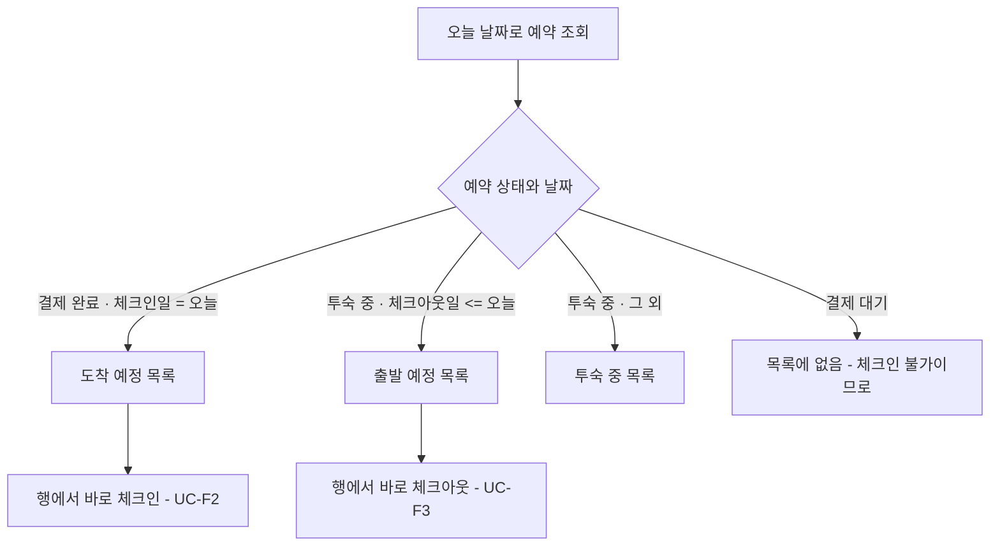
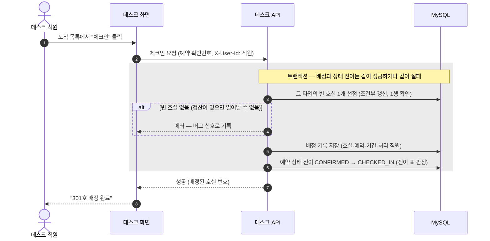
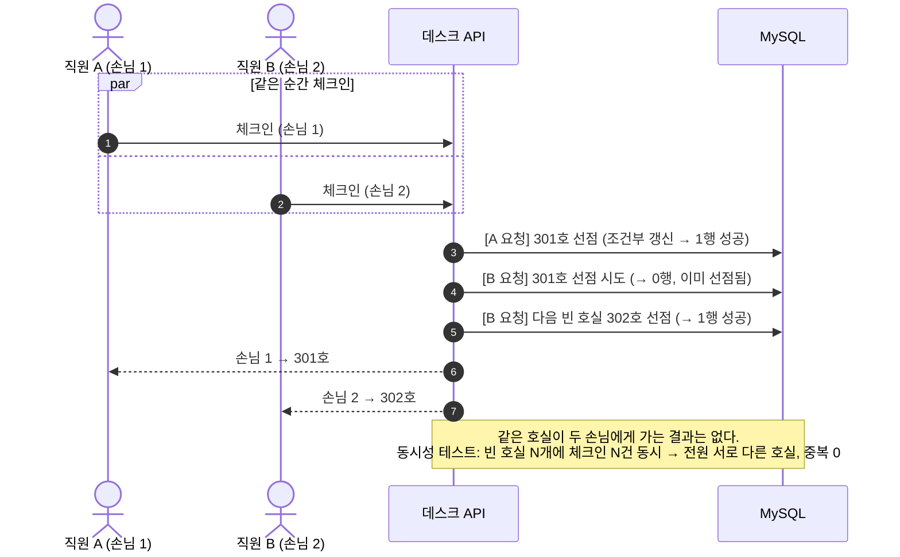
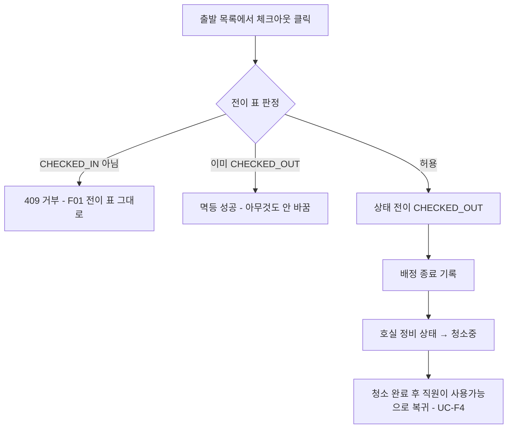
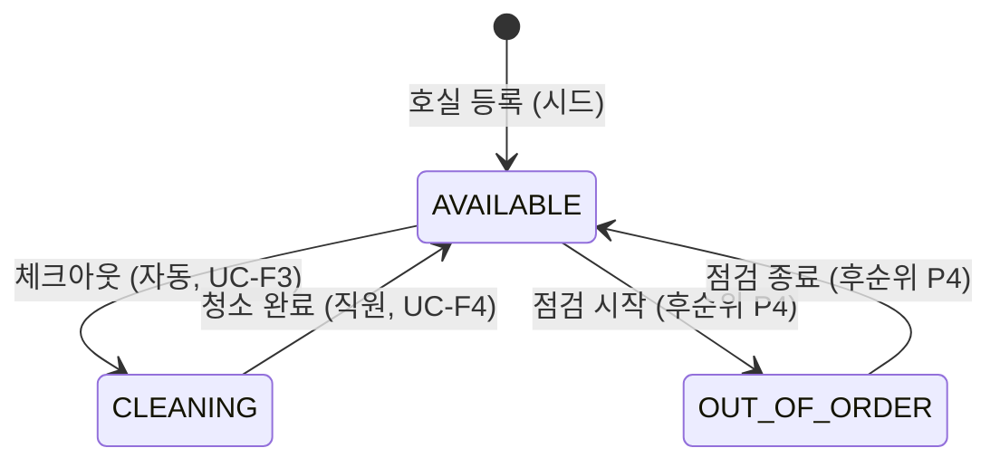

# [F06] 프론트 데스크 — 호실 관리·배정·체크인/아웃 기획서

- 상태: 검토 대기 (이 기능을 만들지 결정하기 위한 자료)
- 작성일: 2026-08-16
- 개정: 2026-08-16 관리자 화면 검토 반영 — ① 체크인 시 호실을 직원이 선택할 수 있게 (전 호실의 선택 가능/불가와 사유 표시) ② 객실×날짜 타임라인 화면 추가 (R3 개정, R8 신설, D3 결정)
- 근거 문서: `docs/spec/00-problem-and-scope.md`(D3), `docs/decisions/ADR-0057-방-배정은-범위-밖.md`, `docs/spec/F01-예약-코어.md`, `app/reservation/domain/transitions.py`(전이 표 실물)

## 0. 한 장 요약

지금 시스템은 **예약까지만** 있다. 손님이 "디럭스 더블 1실"을 예약하고 결제하는 것까지는 되는데, 그 손님이 호텔에 도착했을 때 **몇 호실에 들어가는지**를 다루는 층이 없다. 체크인 API는 있지만 예약 상태만 바꿀 뿐이고, 프런트 직원이 수기로 방을 나눠준다고 가정하고 있다(ADR-0057의 대가 항목).

F06은 그 빠진 층을 만든다. 뼈대가 되는 규칙은 이미 승인된 범위 문서(D3)에 있다.

> **호실은 예약 시점이 아니라 체크인 시점에, 체크인 날짜 순서로 그때 빈 호실을 배정한다. 그러면 방 옮기기(이동)가 구조적으로 생기지 않는다.**

왜 그런가. 내가 체크인할 때 비어 있는 방은, 나보다 늦게 체크인하는 손님 눈에는 "사용 중"으로 보인다. 그래서 뒷사람이 알아서 피해 간다. 앞사람의 배정이 뒷사람의 자리를 뺏는 일이 아예 일어날 수 없다. 연박 손님이 머무는 동안 방이 바뀌지 않는 것도 같은 이유로 자동으로 보장된다. 지금까지는 이 규칙을 **사람이 지키는 것**으로 가정했는데, F06은 이것을 **시스템이 지키게** 만든다. 체크인 버튼을 누르는 순간이 곧 "체크인 날짜 순서"이므로, 자동 배정은 이 규칙을 공짜로 따른다.

또 하나의 핵심은 **두 모델이 서로를 검산한다**는 것이다. 재고 모델은 "몇 개 남았나"를 세는 문제고, 배정 모델은 "누가 어느 호실에"를 짝짓는 문제다. 어느 날짜든 **배정되어 있는 호실 수 = 그 날짜에 투숙 중인 예약이 차지한 객실 수**여야 하고, 이 값은 **판매된 수량(총수량 − 잔여)을 절대 넘을 수 없다**. 이 등식이 깨지면 세는 쪽이든 짝짓는 쪽이든 어딘가 버그가 있다는 뜻이다. 부하테스트(F04)가 재고를 검증하는 것과 같은 방식으로, 배정도 SQL 한 줄로 검증할 수 있게 된다.

그리고 동시성. **데스크 직원 2명이 동시에 체크인을 처리할 때 같은 호실이 두 손님에게 배정되면 안 된다.** 이것은 F01의 "잔여 1실을 두 사람이 동시에 예약"과 정확히 같은 급의 문제이고, 이 과제의 심장(동시성 제어)에 새 사례를 하나 보탠다. 다만 방어 패턴 자체는 F01과 같은 계열(조건부 갱신 + DB 제약 최후 방어선)이라, "새로운 증명"이라기보다 "같은 증명의 두 번째 표본"이다. 이 점은 결정 검토란 D1에서 정직하게 다룬다.

---

# 1. 요구사항 정의

## 1.1 배경

- 예약은 객실타입 단위다. 예약 확인서에 "디럭스 더블"까지만 나오고 방 번호가 없다 (ADR-0057의 대가 1).
- 체크인·체크아웃 API(`POST /api/reservations/{code}/check-in`, `/check-out`)는 F01이 이미 만들었다. 예약 상태만 바꾸고 호실은 모른다.
- 도착한 손님 목록을 보는 방법이 없다. 예약 조회는 확인번호 단건 조회뿐이라, 데스크 직원이 "오늘 올 손님"을 시스템에서 볼 수 없다.
- 배정 순서 규칙(체크인 날짜 순)을 시스템이 강제하지 않는다. ADR-0057이 "그 순서를 지키는 건 사람 몫"이라고 한계로 남겼다. **아무 순서로 배정하면 이동이 생길 수 있다.**

## 1.2 기능 요구사항

**핵심**(이번에 만들면 이것까지)과 **후순위**(스펙만 남기거나 다음으로 미룸)를 나눈다.

### 핵심

| 번호 | 요구사항 | 내용 |
|---|---|---|
| R1 | 호실 대장 | 객실타입마다 실제 호실(101호, 102호…)을 둔다. 개수는 그 타입의 총 객실 수와 같다. 호실 등록·수정 화면은 만들지 않고 시드 데이터로 넣는다 (00 문서 D1과 같은 방침) |
| R2 | 오늘의 도착·출발 목록 | 데스크 화면에서 "오늘 체크인 예정"(결제 완료이고 체크인일이 오늘)과 "오늘 체크아웃 예정"(투숙 중이고 체크아웃일이 오늘 이하)을 목록으로 본다. **새 조회 API가 필요하다** — 지금은 확인번호 단건 조회뿐이다 |
| R3 | 체크인 = 호실 배정 (추천 + 직원 선택) | 체크인 버튼을 누르면 호실 선택 창이 뜬다. 시스템이 빈 호실 중 하나를 **추천으로 미리 선택**해 두고, 직원은 그대로 확정하거나 다른 빈 호실로 바꾼다. 선택 창에는 그 타입의 **전 호실이 선택 가능/불가 사유(투숙 중·청소중·점검중)와 함께** 보인다. 그대로 확정하면 자동 배정과 같다. 어느 쪽이든 배정과 상태 전이는 **같이 성공하거나 같이 실패한다**(한 트랜잭션). 예약이 여러 실이면 실 수만큼 선택한다. *(호실 선택 가능은 2026-08-16 관리자 결정. "그때 빈 방 중에서" 고르는 것은 같으므로 방 옮기기 없음 보장은 유지된다)* |
| R4 | 체크아웃 | 상태를 투숙 종료로 바꾸고, 배정을 끝내고, 그 호실을 "청소중"으로 돌린다. 재고는 건드리지 않는다 (F01 규칙 그대로 — 이미 팔린 밤이다) |
| R5 | 호실 정비 상태 | 호실은 사용가능 / 청소중 / 점검중 세 정비 상태를 가진다. "누가 쓰는 중인가"(점유)는 별도 상태로 두지 않고 **배정 기록에서 계산한다** — 같은 사실을 두 곳에 적으면 어긋나는 순간이 생기기 때문이다. 배정 가능 조건 = 사용가능 상태이면서 점유 아님 |
| R6 | 호실 현황판 | 호실별 현재 상태(빈 방 / 투숙 중 + 손님 / 청소중 / 점검중)를 한 화면에서 본다. 청소 완료 처리(청소중 → 사용가능)도 여기서 한다 |
| R7 | 검산 | 어느 날짜든 「배정된 호실 수 = 그 날짜에 투숙 중인 예약의 객실 수 합 ≤ 판매된 수량(총수량 − 잔여)」이 SQL로 검증 가능해야 한다. F04의 재고 불변식 검증과 같은 계열로 둔다 |
| R8 | 객실×날짜 타임라인 | 호실별로 어떤 손님이 언제부터 언제까지 묵는지 시간축 그래프로 본다. 호실 줄에는 **배정 실적(실선)**만 올리고, 아직 체크인하지 않은 예약은 객실타입별 **「미배정」 줄(점선)**에 둔다 — 예약 시점 가배정이라는 두 번째 진실을 만들지 않기 위해서다. 체크인하면 막대가 호실 줄로 내려온다 *(2026-08-16 관리자 결정으로 추가)* |

### 후순위

| 번호 | 요구사항 | 내용 | 미루는 이유 |
|---|---|---|---|
| P1 | 수동 배정 변경 | 배정된 호실을 직원이 다른 빈 호실로 바꾼다 (손님 요청, 시설 문제) | 방 이동이 필요해지는 건 운영 이벤트(고장 등)뿐인데, 그 운영 이벤트 자체(P4)가 후순위다 |
| P2 | 노쇼 처리 | 체크인일이 지나도록 안 온 예약을 정리한다 | 예약 상태머신에 노쇼 상태가 없다 (F01 D4에서 관리자 판단으로 유예됨). 상태 추가는 F01 전이 표를 고치는 일이라 F06 혼자 못 정한다 |
| P3 | 자동 체크아웃 | 체크아웃일이 되면 자동으로 체크아웃 처리 | 관리자 지시가 이미 있다 — "일단 스펙으로만 남겨두고 나머지 기능들부터 다 구현하자" (ADR-0057) |
| P4 | 점검중 지정·해제 | 호실을 점검중으로 돌리고 되돌린다 | 점검중 호실만큼 재고를 줄여야 하나가 따라오는 질문인데, 이건 재고 모델을 건드리는 별개 문제(의도적 오버부킹과 같은 영역)다. 상태값만 예약해두고 재고 연동은 안 한다 |

## 1.3 비기능 요구사항

| 번호 | 요구사항 | 내용 |
|---|---|---|
| N1 | 동시 체크인 안전성 | 직원 2명이 동시에 체크인해도 같은 호실이 두 손님에게 가지 않는다. 조건부 갱신(1행 성공 확인)으로 막고, DB 유니크 제약을 최후 방어선으로 둔다 — F01의 재고 차감과 같은 3층 방어 계열. **동시성 테스트 필수** (절대 규칙: 단일 스레드 테스트만으로 통과시키지 않는다) |
| N2 | 검산 가능성 | R7의 등식을 검증하는 SQL을 테스트와 부하테스트 양쪽에서 쓸 수 있어야 한다 |
| N3 | 직원 식별 | 기존 `X-User-Id` 방식을 그대로 쓴다. 데스크 직원도 같은 헤더로 식별하고(예: `staff-01`), 배정 기록에 누가 처리했는지 남긴다. 손님/직원 권한 구분은 하지 않는다 — 인증이 이 과제의 관심사가 아니라는 기존 결정(ADR-0006)의 연장이다 |

## 1.4 범위 밖 (명시)

- **예약 시점 호실 지정.** ADR-0057이 밝혔듯 이걸 하는 순간 이동 문제가 진짜로 생긴다. F06을 만들어도 이 원칙은 그대로다.
- **방 이동 자동화·재배치 최적화.** 이동은 구조적으로 안 생기게 했으므로 다룰 일이 없다.
- **점검중 호실의 재고 반영.** 오버부킹 문제와 함께 다룰 영역 (00 문서 D3 검토 결과).
- **청소 인력 배정·일정 관리, 요금 정산, 미니바 등 부대 정산.**
- **호실 관리 화면(등록·수정).** 시드로 고정.

---

# 2. 유스케이스 정리

행위자는 전부 **데스크 직원**이다.

| UC | 이름 | 사전조건 | 사후조건 | 구분 |
|---|---|---|---|---|
| UC-F1 | 오늘의 도착·출발 목록을 본다 | 없음 | 도착 예정·출발 예정·투숙 중 목록이 보인다 | 핵심 |
| UC-F2 | 체크인하며 호실을 자동 배정받는다 | 예약이 결제 완료 상태, 체크인일 ≤ 오늘 < 체크아웃일 (F01 전이 조건 그대로), 그 타입에 배정 가능한 호실 존재 | 예약은 투숙 중, 호실 배정 기록 생성, 검산 등식 유지 | 핵심 |
| UC-F3 | 체크아웃한다 | 예약이 투숙 중 상태 | 예약은 투숙 종료, 배정 종료, 호실은 청소중 | 핵심 |
| UC-F4 | 호실 현황판을 보고 청소 완료를 처리한다 | 없음 (청소 완료는 청소중 호실 대상) | 호실별 상태가 보이고, 청소중 → 사용가능 전이 | 핵심 |
| UC-F5 | 배정을 다른 호실로 바꾼다 | 투숙 중 예약, 대상 호실이 배정 가능 | 배정 기록이 새 호실로 (이력 보존) | 후순위 |
| UC-F6 | 노쇼를 정리한다 | 체크인일 경과, 결제 완료 상태 | (F01 상태머신에 노쇼 추가가 선행 — 스펙만) | 후순위 |
| UC-F7 | 자동 체크아웃 | 체크아웃일 도래, 투숙 중 상태 | (관리자 지시로 스펙만 남김) | 후순위 |

---

# 3. 유스케이스별 흐름 (핵심 4개)

## 3.1 UC-F1. 오늘의 도착·출발 목록

데스크 직원이 화면을 열면 오늘 날짜 기준으로 세 목록이 보인다. 도착 예정(결제 완료이고 체크인일이 오늘), 출발 예정(투숙 중이고 체크아웃일이 오늘 이하), 투숙 중(나머지 투숙 중 전부). 예외 흐름은 사실상 없고, 주의할 것 하나는 **결제 대기(PENDING) 예약은 도착 목록에 넣지 않는다**는 것이다 — 결제 안 된 예약은 체크인할 수 없다는 전이 표 규칙을 목록 단계에서 미리 반영해, 직원이 눌러봤자 거부될 행을 보여주지 않는다.



| 목록 | 조건 | 행에서 가능한 동작 |
|---|---|---|
| 도착 예정 | 상태 CONFIRMED, 체크인일 = 오늘 | 체크인 |
| 출발 예정 | 상태 CHECKED_IN, 체크아웃일 ≤ 오늘 | 체크아웃 |
| 투숙 중 | 상태 CHECKED_IN, 그 외 | 상세 보기 |

## 3.2 UC-F2. 체크인 = 자동 호실 배정 (동시성의 심장)

직원이 도착 목록에서 손님을 골라 체크인을 누르면 **호실 선택 창**이 뜬다. 시스템이 빈 호실 중 하나를 추천으로 미리 선택해 두고, 직원은 그대로 확정하거나 다른 빈 호실로 바꾼다 — 선택 창에는 그 타입의 전 호실이 보이고, 선택할 수 없는 방(투숙 중·청소중·점검중)은 사유와 함께 잠겨 있다(2026-08-16 관리자 결정). 확정하면 시스템은 한 트랜잭션 안에서 ① 그 호실을 선점하고 ② 배정 기록을 만들고 ③ 예약 상태를 투숙 중으로 전이한다. 셋 중 하나라도 실패하면 전부 없던 일이 된다 — 배정만 되고 체크인이 안 됐거나, 체크인됐는데 방이 없는 어중간한 상태를 만들지 않기 위해서다. 대표 예외는 두 가지다. 전이 표가 거부하는 경우(결제 대기 상태, 날짜 범위 밖)는 F01의 기존 규칙 그대로 409로 거부한다. 빈 호실이 없는 경우는 — 검산 등식이 맞다면 **구조적으로 일어날 수 없으므로**(판매량이 총 호실 수를 넘지 않는 한 체크인하는 손님 몫은 항상 남아 있다) — 버그 신호로 취급해 에러를 내고 로그에 남긴다.



| 항목 | 내용 |
|---|---|
| 전이 조건 | F01 전이 표 그대로: CONFIRMED 상태, 체크인일 ≤ 오늘 < 체크아웃일. 이미 투숙 중이면 멱등 성공 (이때 배정을 새로 만들지 않는다 — 멱등 전이는 아무것도 바꾸지 않는다는 F01 원칙 그대로) |
| 여러 실 예약 | 객실 수만큼 호실을 선점한다. 하나라도 못 잡으면 전체 롤백 (F01의 "기간 전체 아니면 전무"와 같은 원칙) |
| 배정 순서 규칙과의 관계 | 체크인 버튼이 눌리는 순서가 곧 체크인 날짜 순서이므로, D3 규칙(그때 빈 방 배정)이 자동으로 지켜진다. 별도의 순서 강제 장치가 필요 없다 |

### 경합 시나리오 — 직원 2명이 동시에 체크인

같은 순간 두 창구에서 체크인이 들어오면, 둘 다 "지금 빈 호실"로 같은 방(예: 301호)을 볼 수 있다. 먼저 선점에 성공한 쪽만 그 방을 얻고, 진 쪽에는 "방금 다른 손님에게 배정됐다"는 안내가 뜬다 — 직원이 명시적으로 고른 방이었다면 다시 고르게 하고, 추천 그대로였다면 시스템이 다음 빈 호실로 자동 재시도한다. 선택 창의 가능/불가 표시는 여는 순간의 스냅샷일 뿐이고 최종 판정은 서버가 하므로, 화면이 낡아도 이중 배정은 생기지 않는다. 조회와 선점을 분리하지 않고 **선점 자체를 조건부 갱신 한 번**으로 하기 때문에, "둘 다 성공"은 DB가 막는다. 혹시 응용 코드가 실수해도 배정 테이블의 유니크 제약(한 호실은 겹치는 기간에 배정 기록 하나만)이 최후 방어선으로 잡는다 — F01 재고의 CHECK 제약과 같은 역할이다.



## 3.3 UC-F3. 체크아웃

출발 목록에서 체크아웃을 누르면 예약이 투숙 종료로 전이되고, 배정이 종료되고, 그 호실은 청소중이 된다. 재고는 건드리지 않는다 — 남은 밤을 다시 파는 것은 별개 정책이고 범위 밖이라는 F01 규칙 그대로다. 예외 흐름: 투숙 중이 아닌 예약의 체크아웃은 전이 표가 409로 거부하고, 이미 투숙 종료면 멱등 성공이다(이때 호실 상태는 다시 건드리지 않는다).



## 3.4 UC-F4. 호실 현황판과 정비 상태

호실의 정비 상태는 세 개뿐이고, 점유(누가 쓰는 중)는 상태가 아니라 배정 기록에서 계산한다. 상태를 네 개로 두고 "투숙 중"을 넣으면 배정 기록과 호실 상태라는 두 진실이 생겨 어긋날 수 있기 때문이다. 전이는 아래 표뿐이며, F01과 같은 방식(전이 표, 세터 금지)으로 구현한다.



| 상태 | 뜻 | 배정 가능한가 |
|---|---|---|
| AVAILABLE (사용가능) | 정비 완료 | 가능 — 단, 배정 기록상 점유 중이 아닐 때만 |
| CLEANING (청소중) | 체크아웃 직후 | 불가 |
| OUT_OF_ORDER (점검중) | 고장·수리 (후순위. 상태값만 예약) | 불가 |

**검산 등식 (R7).** 현황판 하단에 오늘 기준 숫자 세 개를 나란히 보여준다: 배정된 호실 수 / 투숙 중 예약의 객실 수 합 / 판매된 수량(총수량 − 잔여). 앞의 둘은 항상 같아야 하고, 셋째는 앞의 둘보다 크거나 같아야 한다(아직 도착 안 한 손님 몫). 이 화면 자체가 세는 모델과 짝짓는 모델이 서로를 검산하는 창이 된다.

---

# 4. 화면 구성 시안 3종 (UX 층)

세 시안 모두 기존 프론트(`frontend/`, Next.js) 위에 `/desk` 경로 하나를 더하는 형태다. 상단 내비게이션에 "데스크" 탭이 추가되고, 직원 식별은 기존 사용자 전환 장치(X-User-Id)를 그대로 쓴다.

## 시안 가. 「오늘 줄」 — 도착·출발 대기열 중심

**철학: 데스크 업무는 목록을 위에서 아래로 지우는 일이다. 호실은 결과일 뿐, 직원이 고르지 않는다.**

```
+----------------------------------------------------------+
| 여정 PMS   [검색] [예약 확인] [데스크]      직원: staff-01 |
+----------------------------------------------------------+
| 오늘 8/16  |  도착 4  출발 2  투숙 5  |  검산 5 = 5 <= 7  |
+----------------------------------------------------------+
| ▼ 도착 예정 (4)                          [확인번호 검색]  |
|  김OO  디럭스 더블 x1  8/16~8/18  RSV-1A2B   [체크인]     |
|  이OO  스탠다드   x2  8/16~8/17  RSV-3C4D   [체크인]     |
|  ...                                                      |
| ▼ 출발 예정 (2)                                           |
|  박OO  301호  8/14~8/16  RSV-5E6F           [체크아웃]    |
| ▼ 투숙 중 (5)  ·  ▼ 청소중 호실 (1)  302호 [청소 완료]   |
+----------------------------------------------------------+
```

- **영역 구성:** 첫눈에 보이는 것은 오늘의 도착 목록이다. 상단에 요약 숫자(도착·출발·투숙·검산), 본문은 도착 → 출발 → 투숙 → 청소중 순서의 접이식 목록. 호실 현황판은 없거나 보조 화면이다.
- **체크인 동선:** 목록에서 손님 행 확인 → [체크인] → 확인 대화상자 → "301호 배정 완료". **조작 2회** (검색까지 해도 3회).
- **유리:** 도착이 몰리는 오후 시간대의 처리 속도. 자동 배정 철학(직원이 방을 고르지 않는다)과 정확히 일치. 화면이 목록 3개라 구현이 가장 싸다.
- **불리:** 호텔 전체의 공간 감각이 없다. "지금 3층에 빈 방이 몇 개지" 같은 질문에 약하다. 청소중 호실 관리가 곁다리로 붙는다.

## 시안 나. 「호실 보드」 — 격자 현황판 중심

**철학: 데스크의 진실은 방이다. 방 상태판을 보면 오늘이 보인다.**

```
+----------------------------------------------------------+
| 여정 PMS   [검색] [예약 확인] [데스크]      직원: staff-01 |
+----------------------------------------------------------+
| 스탠다드         | 디럭스 더블      | 검산 5 = 5 <= 7     |
| [101 빈] [102 투숙·김OO] [103 청소] | [301 투숙] [302 빈] |
| [104 빈] [105 점검]                 | [303 빈]  [304 투숙]|
+----------------------------------------------------------+
| 오늘: 도착 4 (미처리 2)  출발 2       [도착 목록 열기 ▸]  |
+----------------------------------------------------------+
|  (호실 클릭 시 옆 패널: 투숙 정보 / 체크아웃 / 청소 완료) |
+----------------------------------------------------------+
```

- **영역 구성:** 첫눈에 보이는 것은 객실타입별 호실 격자(색으로 상태 구분)다. 도착·출발 목록은 하단 띠 + 열어보는 패널. 호실을 누르면 그 방 작업(체크아웃, 청소 완료)이 나온다.
- **체크인 동선:** 하단 띠에서 도착 목록 열기 → 손님 선택 → [체크인] → 확인. **조작 3~4회.** 체크인은 "손님→방" 방향인데 이 화면은 "방→손님" 방향이라 체크인만은 한 겹을 더 거친다.
- **유리:** 청소·점검 관리, 하우스키핑과의 소통, 호텔 규모의 시각적 파악. 검산 등식이 화면 자체로 보인다(칠해진 칸 수 = 투숙 수).
- **불리:** 체크인이 주 업무인 시간대엔 동선이 한 겹 길다. 호실 수가 많으면 격자가 화면을 넘친다. 구현이 시안 가보다 무겁다.

## 시안 다. 「점유 타임라인」 — 호실×날짜 간트형

**철학: 배정은 시간 위의 퍼즐이다. 가로축을 봐야 연박과 빈 구간이 보인다.**

```
+----------------------------------------------------------+
|        8/15   8/16   8/17   8/18   8/19                   |
| 101호  [--박OO--]                                          |
| 102호         [------김OO(예정)------]                     |
| 103호  (청소)                                              |
| 301호  [--최OO------------]                                |
+----------------------------------------------------------+
| 오늘 열(8/16) 강조. 막대 클릭 → 체크인/체크아웃            |
+----------------------------------------------------------+
```

- **영역 구성:** 첫눈에 보이는 것은 호실(세로) × 날짜(가로) 격자에 놓인 투숙 막대다. 오늘 열이 강조되고, 막대를 눌러 작업한다.
- **체크인 동선:** 오늘 열에서 도착 예정 막대 찾기 → 클릭 → [체크인] → 확인. **조작 3회**, 단 "찾기"가 목록보다 느리다.
- **유리:** 연박 흐름과 빈 구간이 한눈에 보인다. 수동 배정 변경(P1)이나 예약 시점 배정으로 정책이 바뀌면 최적의 화면이다.
- **불리:** **이 시스템의 철학과 어긋난다.** 미도착 예약은 방이 정해져 있지 않으므로 타임라인에 올릴 줄이 없다 — "예정" 막대를 그리려면 가배정이 필요한데, 그건 예약 시점 배정으로 미끄러지는 길이고 ADR-0057이 막은 바로 그 방향이다. 구현도 셋 중 제일 비싸다.

## 비교와 추천

| | 가. 오늘 줄 | 나. 호실 보드 | 다. 타임라인 |
|---|---|---|---|
| 체크인 1건 조작 수 | **2회** | 3~4회 | 3회 |
| 자동 배정 철학과의 정합 | **정확히 일치** | 중립 | 어긋남 (가배정 유혹) |
| 청소·점검 관리 | 곁다리 | **주인공** | 곁다리 |
| 검산의 가시성 | 숫자 띠 | **격자 자체가 검산** | 약함 |
| 구현 비용 (상대) | **1** | 1.5~2 | 3+ |

**추천: 시안 가 「오늘 줄」.** 이유는 셋이다. ① 이 시스템의 핵심 규칙 — 호실은 체크인 순간에 시스템이 고른다 — 을 화면 구조가 그대로 말한다. 직원에게 방 고르기 화면을 주지 않는 것 자체가 규칙의 UI다. ② 체크인 동선이 가장 짧다. 데스크에서 가장 잦고 가장 바쁜 작업이 체크인이다. ③ 마감 하루 남은 상황에서 구현이 가장 싸다. 시안 나의 장점(청소중 호실 한눈에)은 「오늘 줄」 하단의 청소중 목록 한 줄로 충분히 흡수된다. 시안 다는 예약 시점 배정으로 정책이 바뀌는 날이 오면 그때 다시 꺼낼 시안이다.

---

# 5. 결정 검토란

작성자가 정리한 결정 후보입니다. 항목 번호로 동의 여부를 알려주세요.

### D1. F06을 범위에 넣을 것인가 — 규모 추정 포함

- **결정(제안):** 넣되, 6장 규모 추정을 보고 관리자가 최종 판단한다. 넣는다면 ADR-0057("방 배정은 범위 밖")을 뒤집는 ADR을 남긴다 — 그 문서가 "이 결정이 틀린 것이 되는 때"로 이미 예고한 경로다("배정을 자동화할 때도 열린다").
- **이유:** 배정 자동화는 D3 규칙 덕에 알고리즘이 단순하고("그때 빈 방 주기"), 동시 체크인 경합이라는 동시성 사례를 하나 더한다. 검산 등식은 재고 모델의 정합성을 바깥에서 한 번 더 증명한다.
- **트레이드오프:** 이 과제 평가의 심장(동시성 증명)에 **새로운 패턴을 보태지는 않는다** — ADR-0057이 지적했듯 같은 조건부 갱신 패턴의 반복이다. 마감 하루 전에 시간을 여기 쓰면 부하테스트 리포트와 제출 문서 품질에서 뺏어온다.
- **대안:** ① 전부 구현 ② **이 기획서를 스펙 문서로 다듬어 제출물에만 남기고 구현은 안 한다** (0시간, "설계는 했고 우선순위로 잘랐다"는 서사) ③ 백엔드만 구현하고 화면은 생략.
- **확인 질문:** 6장의 추정(백엔드 7~9시간 + 프론트 3~4시간)을 보고도 남은 일(부하테스트 실행·리포트, 제출 문서)보다 먼저 넣을 가치가 있습니까?

### D2. 넣는다면 핵심만인가 전부인가

- **결정(제안):** 핵심 4개(UC-F1~F4)만 구현하고, 후순위 4개(P1~P4)는 이 문서의 스펙 기술만 남긴다.
- **이유:** 후순위는 각자 발이 걸리는 데가 있다 — 노쇼는 F01 전이 표 수정이 선행이고(F01 D4 유예와 얽힘), 점검중은 재고 연동 질문을 끌고 오고, 수동 변경은 그 둘이 있어야 쓸모가 생긴다.
- **트레이드오프:** "프론트 데스크"라면서 운영 예외(고장·노쇼)는 못 다루는 반쪽이다. 다만 그 반쪽이 정확히 ADR-0057이 "진짜 배정 문제"라고 선 그은 영역이다.
- **대안:** 노쇼까지 포함 (F01 전이 표에 상태 추가 — F01 재오픈이라 비용이 크다).
- **확인 질문:** 노쇼·자동 체크아웃은 이번에도 스펙만 남기는 것으로 확정합니까? (기존 지시 "일단 스펙으로만 남겨두고"의 재확인)

### D3. 화면은 어느 시안으로 가는가 — **관리자 결정됨 (2026-08-16)**

- **결정:** 「오늘 줄」을 기본 화면으로 하되, **객실×날짜 타임라인을 보조 화면으로 추가**하고 **체크인 시 호실 선택을 허용**한다(선택 가능/불가 사유 표시). 관리자가 화면 시안 검토에서 직접 정했다.
- **가배정 문제의 해소:** 시안 다가 우려됐던 이유(미도착 예약을 그리려면 가배정이 필요)는, 호실 줄에는 배정 실적만 올리고 미도착 예약은 객실타입별 「미배정」 줄에 점선으로 두는 방식으로 피한다. 체크인하면 막대가 호실 줄로 내려온다.
- (원안 기록) **결정(제안)이었던 것:** 시안 가 「오늘 줄」. 하단에 청소중 호실 목록(시안 나의 축약)을 붙인다.
- **이유:** 4장 비교 표 — 동선 최단, 자동 배정 철학과 일치, 구현 최저가.
- **트레이드오프:** 호텔 공간 감각(층·구역)은 포기한다. 호실 수가 수백이 되면 보드형이 필요해진다.
- **대안:** 나 (청소 관리 중심 운영이면), 다 (예약 시점 배정으로 정책이 바뀌면).
- **확인 질문:** 「오늘 줄」로 갑니까, 아니면 다른 시안 또는 혼합입니까?

### D4. 검산 등식을 자동 검증에 편입할 것인가

- **결정(제안):** 배정 검산 SQL을 F04의 재고 불변식 검증과 같은 자리(테스트 + 부하테스트 후 검증)에 넣고, 현황판에도 숫자로 노출한다.
- **이유:** "두 모델이 서로를 검산한다"가 이 기능의 존재 이유 중 하나인데, 사람 눈으로만 보면 증명이 아니다. 수치로 증명한다는 과제 목표와 같은 방식이어야 한다.
- **트레이드오프:** F04 검증 스크립트를 건드리게 되면 소유 경계 협의가 필요하다 (구현 세션끼리 직접 맞춘다 — PM 층의 일이 아니다).
- **대안:** 테스트에만 넣고 부하테스트 검증에는 안 넣는다.
- **확인 질문:** 검산을 부하테스트 검증까지 넣는 수준으로 합니까?

### D5. 데스크 직원 식별은 기존 X-User-Id 그대로인가

- **결정(제안):** 그대로 쓴다. 권한 구분 없음. 배정 기록에 처리 직원 값만 남긴다.
- **이유:** 인증은 이 과제의 관심사가 아니라는 결정(ADR-0006)이 이미 있고, 프론트의 사용자 전환 장치를 재사용하면 추가 비용이 0이다.
- **트레이드오프:** 손님이 데스크 화면을 열 수 있다. 시연용 시스템이므로 실해가 없다고 판단했다.
- **대안:** 직원 전용 헤더나 간단한 역할 값 추가 — 인증 흉내가 되어 기존 방침("없는 기능을 있는 것처럼 보이게 하지 않는다")과 어긋난다.
- **확인 질문:** 권한 구분 없이 가도 됩니까?

---

# 6. 구현 규모 추정 (정직하게)

전제: 핵심 4개 UC + 시안 가. F01 코드(전이 표·트랜잭션 경계·테스트 기반)가 이미 있어 재사용이 크다.

| 작업 | 내용 | 추정 |
|---|---|---|
| 백엔드 — 호실·배정 테이블 | `room`(호실 대장)·`room_assignment`(배정 기록) 마이그레이션 + 시드 | 1시간 |
| 백엔드 — 배정 도메인 | 호실 정비 상태 전이 표, 빈 호실 선점(조건부 갱신), 체크인 유스케이스에 배정 결합 (한 트랜잭션) | 2~3시간 |
| 백엔드 — 조회 API | 도착·출발 목록, 호실 현황판, 청소 완료 처리 | 1~2시간 |
| 백엔드 — 테스트 | 단위 + **동시성 테스트**(동시 체크인 N건 → 중복 배정 0) + 검산 SQL 검증 | 2~3시간 |
| **백엔드 소계** | | **7~9시간** (TDD·리뷰어 3명 사이클 포함 시 +2~3시간) |
| 프론트 — 데스크 화면 | `/desk` 1페이지 (목록 3개 + 청소중 + 검산 띠), 계약 사본·검증, 테스트 | 3~4시간 |
| **합계** | | **10~13시간, 리뷰 포함 최대 ~16시간** |

**정직한 판단:** 마감(8/17 밤)까지 남은 확정 작업이 부하테스트 실행·리포트와 제출 문서다. F06 전체 구현은 그 작업들과 **양립하기 어렵다.** 현실적인 선택지는 ① 백엔드 핵심만(화면 없이 API+동시성 테스트, 7~9시간)으로 "동시 배정 경합" 사례를 추가하거나 ② 이 기획서를 다듬어 스펙으로만 제출물에 남기는 것(0시간)이다. 어느 쪽이든 결정 검토란 D1의 답이 정한다.
