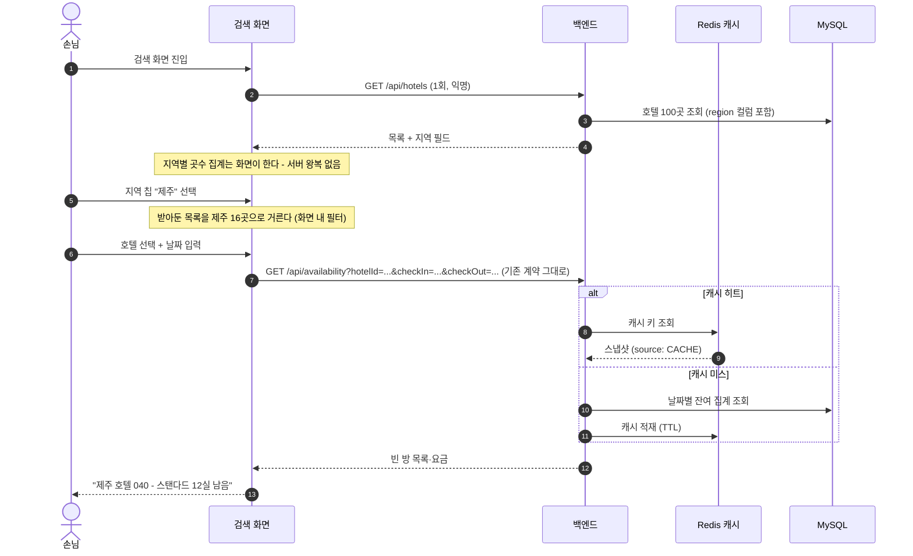

# [F07] 호텔 주소 + 지역 검색(국내 기준) 기획서

- 상태: **결정됨 (2026-08-17) — 지역 검색 기능은 스펙으로만 남긴다. 다만 가짜 시드 주소는 결함이라 고친다.** F06과 같은 처리다([ADR-0061](../decisions/ADR-0061-F06은-스펙으로만-남긴다.md)). 시간이 남으면 그때 착수한다.
- 작성일: 2026-08-16
- 근거 문서: `docs/spec/00-problem-and-scope.md`, `docs/spec/F01-예약-코어.md` 1.9절(시드 계약), `docs/spec/F03-가용-객실-검색.md`(캐시 절·D5), `app/inventory/query/presentation/router.py`·`schemas.py`(호텔 API 실물), `migrations/versions/053_seed_hotels_extension.py`(시드 주소 실물), `frontend/app/search/page.tsx`(검색 화면 실물)

## 0. 한 장 요약

지금 시스템에는 호텔이 100곳 있는데 **지역이라는 개념이 없다.** 호텔마다 주소 문자열은 있지만, 3번부터 100번까지 98곳의 주소가 전부 `서울특별시 테스트구 예약로 N`이라는 가짜 값이다(시드 확장 때 규칙으로 찍어낸 것이다). 그래서 손님이 "제주에 있는 호텔"을 찾을 방법이 없다. 지금 검색 화면이 주는 필터는 호텔 **이름** 글자 검색뿐인데, 이름도 `호텔 050` 같은 일련번호라 걸러낼 단서가 못 된다.

숙박 탐색은 지역에서 시작하는 것이 업계의 기본이다. "8월 20일에 어디 잘까"가 아니라 "제주 가는데 8월 20일에 어디 잘까"가 손님의 실제 질문이다. F07은 그 첫 단추를 채운다 — **호텔마다 지역(서울·부산·제주·강원…)을 달고, 검색 화면에서 지역으로 호텔을 거른 뒤, 거른 호텔의 날짜별 빈 방 조회는 지금 있는 검색 그대로 쓴다.**

구조의 핵심 결론을 먼저 말하면: **날짜 검색 API(`GET /api/availability`)는 한 글자도 건드리지 않는다.** 지역은 그 앞 단계인 호텔 목록 API(`GET /api/hotels`)의 일이다. 현재 검색 화면이 이미 "① 호텔 목록에서 호텔을 고른다 → ② 그 호텔의 날짜별 빈 방을 조회한다"의 2단 구조라서, 지역 필터는 ①에만 끼우면 된다. 검색 API의 캐시 설계(호텔 단위 키, 호텔 단위 무효화)에 영향이 전혀 없다. 근거는 결정 검토란 D3에 있다.

이 기능은 이 과제의 심장(동시성·멱등성·상태 전이)에 **새 증명을 보태지 않는다.** 순수한 탐색 편의 기능이다. 그 대신 비용이 작다 — 백엔드는 컬럼 하나와 응답 필드 하나, 프론트는 필터 칩 한 줄이 전부다. 넣을 가치가 있는지는 규모 추정(6장)을 보고 결정 검토란 D1에서 판단해 달라.

---

# 1. 요구사항 정의

## 1.1 배경 — 지금 무엇이 어떻게 되어 있나

- **호텔 API 실물** (`GET /api/hotels`): `hotelId`, `name`, `address`, `roomTypes`를 준다. 지역 필드도, 필터 파라미터도 없다. 100곳 전체를 한 번에 내려준다.
- **검색 API 실물** (`GET /api/availability`): `hotelId`가 필수다. 즉 **지금도 검색은 호텔 한 곳 단위**다. "여러 호텔을 한 번에 날짜로 검색"하는 API는 애초에 없다.
- **검색 화면 실물** (`frontend/app/search/page.tsx`): 1단에서 호텔 100곳 목록을 이름 글자로 거르고, 호텔을 고르면 2단에서 그 호텔의 빈 방을 조회한다. 지역 필터가 끼어들 자리(1단)가 이미 만들어져 있다.
- **시드 주소 실물** (F01 스펙 1.9절, 리비전 051·053): 호텔 1은 `서울특별시 중구 을지로 100`, 호텔 2는 `부산광역시 해운대구 해운대해변로 200`으로 진짜 같은 주소가 있다. 호텔 3~100은 전부 `서울특별시 테스트구 예약로 N`이다. **주소 문자열에서 지역을 뽑아내면 "서울 99곳, 부산 1곳"이라는 쓸모없는 답이 나온다.** 지역을 만들려면 시드 데이터 자체를 손봐야 한다.

## 1.2 기능 요구사항

**핵심**(이번에 만들면 이것까지)과 **후순위**(스펙만 남김)를 나눈다.

### 핵심

| 번호 | 요구사항 | 내용 |
|---|---|---|
| R1 | 지역 데이터 | 호텔마다 지역 값(서울·부산·제주·강원·경기·인천·경주·전주·여수·대구, 10개)을 정식 컬럼으로 둔다. 호텔 3~100의 가짜 주소도 자기 지역과 맞는 주소로 다시 찍는다 (규칙 생성은 유지 — D4) |
| R2 | 호텔 API에 지역 노출 | `GET /api/hotels` 응답의 호텔마다 `region` 필드를 더한다. 기존 필드는 그대로라 계약이 깨지지 않는다. 서버 쪽 지역 필터 파라미터(`?region=제주`)도 함께 둔다 |
| R3 | 지역 선택 UI | 검색 화면 1단(호텔 목록)에 지역 칩 한 줄을 둔다. 지역을 고르면 그 지역 호텔만 목록에 남고, 이후 날짜·빈 방 조회는 지금과 완전히 같다. 선택한 지역은 URL 쿼리에 남긴다 (기존 화면 규칙 그대로) |
| R4 | 지역별 호텔 수 | 지역 칩에 곳수를 함께 보여준다 — 「제주 16」처럼. 호텔 목록을 이미 전부 받아두므로 화면에서 세면 되고, 별도 API가 필요 없다 |

### 후순위

| 번호 | 요구사항 | 내용 | 미루는 이유 |
|---|---|---|---|
| P1 | 시군구 2차 분류 | 강원 안에서 속초·강릉을 다시 고르는 두 번째 단계 | 100곳을 10개 지역으로 나누면 지역당 5~22곳이다. 이걸 다시 쪼개면 칸마다 호텔이 1~3곳이라 **필터가 목록 훑기보다 느려진다.** 데모 규모에서 2단계는 과하다 (D2) |
| P2 | 지도 표시 | 지역·호텔을 지도 위에 그린다 | 외부 지도 API 연동이 필요하고, 탐색 편의가 목적이라면 칩 필터로 충분하다 |
| P3 | 인기 지역 정렬 | 예약이 많은 지역을 앞에 보여준다 | 예약 집계 쿼리가 필요해지고, 시연 데이터에서는 의미 있는 차이가 안 나온다 |
| P4 | 지역 전체 날짜 조회 | "제주 전체에서 8/20 빈 호텔"을 한 번에 | 지금 구조로는 지역 내 호텔 수만큼(제주면 16번) 빈 방 조회를 돌려야 한다. 제대로 하려면 검색 API에 지역이 들어가야 하는데, 그 길의 대가가 크다 (D3의 나머지 반쪽) |

## 1.3 비기능 요구사항

| 번호 | 요구사항 | 내용 |
|---|---|---|
| N1 | 검색 캐시·성능 무영향 | `GET /api/availability`의 요청·응답·캐시 키(`avail:{호텔}:{날짜}:{인원}:{객실수}`)·무효화(호텔 단위)는 한 글자도 바뀌지 않는다. F04 부하테스트가 재는 경로에 영향이 없어야 한다 |
| N2 | 기존 시드 계약과의 정합 | 호텔 1·2와 객실타입 1~5의 값은 그대로 둔다 — F04 시나리오가 그 값을 그대로 쓴다 (F01 1.9절). 손보는 것은 호텔 3~100의 주소와, 전 호텔의 새 지역 컬럼뿐이다. 다만 3~100의 주소 규칙도 1.9절에 적힌 계약이므로, **그 절의 개정이 함께 가야 한다** |
| N3 | 익명 조회 유지 | 호텔 목록·지역 필터는 지금처럼 로그인 없이(헤더 없이) 부른다. 검색은 익명이라는 기존 결정(F03 D11) 그대로다 |

## 1.4 범위 밖 (명시)

- **지도 API 연동, 좌표·거리 기반 검색.** 위도·경도 컬럼 자체를 두지 않는다.
- **해외 지역.** 국내 시도 단위까지만이다.
- **주소 정제·우편번호·도로명 검증.** 주소는 표시용 문자열일 뿐이다.
- **지역별 요금·재고 정책.** 지역은 순수하게 조회 필터다. 재고·예약 도메인은 지역을 모른다.

---

# 2. 유스케이스 정리

행위자는 전부 **손님**이다.

| UC | 이름 | 사전조건 | 사후조건 | 구분 |
|---|---|---|---|---|
| UC-R1 | 지역별 호텔 수를 보고 지역을 고른다 | 없음 | 지역 칩에 곳수가 보이고, 고른 지역의 호텔만 목록에 남는다 | 핵심 |
| UC-R2 | 지역에서 고른 호텔의 빈 방을 조회한다 | 지역 선택됨, 날짜 입력됨 | 그 호텔의 날짜별 빈 방·요금이 보인다 (기존 검색 그대로) | 핵심 |
| UC-R3 | 지역 안에서 이름으로 더 거른다 | 지역 선택됨 | 지역 필터와 이름 필터가 겹쳐 적용된다 | 핵심 |
| UC-R4 | 시군구로 더 좁힌다 | 지역 선택됨 | (2차 분류 — 스펙만) | 후순위 |
| UC-R5 | 지역 전체의 날짜 가용을 한 번에 본다 | 지역·날짜 입력됨 | (검색 API 개편이 선행 — 스펙만) | 후순위 |

---

# 3. 핵심 흐름 — 지역 선택 → 호텔 필터 → 빈 방 조회

손님의 여정은 세 걸음이다. ① 화면이 열리면 호텔 100곳 목록(지역 포함)을 한 번 받아 지역별 곳수를 센다. ② 지역 칩을 누르면 목록이 그 지역으로 줄어든다 — 이미 받아둔 목록을 화면에서 거르므로 서버 왕복이 없다. ③ 호텔을 고르고 날짜를 넣으면 빈 방 조회가 나가는데, **이 요청은 오늘의 검색 요청과 완전히 같다.** 캐시를 거치는 것도, 낡은 결과가 예약 단계 409로 이어질 수 있다는 약속도 전부 기존 설계 그대로다.



| 항목 | 내용 |
|---|---|
| 지역 필터 위치 | 화면 내 필터가 기본. 서버 필터(`?region=`)는 목록이 커질 미래를 위한 보험이며 이번에 같이 만든다 (비용이 파라미터 하나다) |
| 검색 API와의 관계 | 8번 요청은 오늘과 동일하다. 캐시 키·무효화·낡음 약속에 변화 없음 (N1) |
| 빈 지역 | 분포안(D5)이 모든 지역에 5곳 이상을 보장하므로 "이 지역 호텔 없음"은 정상 흐름에서 나오지 않는다 |

---

# 4. 화면 구성 방향 2안

두 안 모두 기존 검색 화면(`frontend/app/search`) 위에 얹는 것이며, **UI 상세(칩 모양, 배치, 문구)는 프론트(F05 소유) 몫이다.** 여기서는 지역이 어디에 끼어드는지 골격만 정한다.

## 안 가. 검색 화면 안의 지역 칩 줄

**철학: 지역은 필터 중 하나다. 지금 화면 구조를 바꾸지 않고 한 줄만 더한다.**

```
+----------------------------------------------------------+
| 여정 PMS   [검색] [예약 확인]              사용자: user-1 |
+----------------------------------------------------------+
| 체크인 [8/20] 체크아웃 [8/22] 인원 [2] 객실 [1]  [검색]   |
+----------------------------------------------------------+
| 지역: [전체 100] [서울 22] [부산 14] [제주 16] [강원 12]  |
|       [경기 8] [인천 6] [경주 6] [전주 5] [여수 6] ...    |
| 이름으로 찾기 [___________]                               |
+----------------------------------------------------------+
| ▼ 제주 (16곳)                                            |
|  제주 호텔 037   제주특별자치도 제주시 ...     [선택]     |
|  제주 호텔 038   ...                          [선택]     |
+----------------------------------------------------------+
```

- 진입 경로가 지금과 같아서 손님이 새로 배울 것이 없다. 이름 필터와 자연스럽게 겹쳐 쓴다.
- 구현이 가장 싸다 — 칩 한 줄과 거르기 조건 하나.
- 불리한 점: 첫 화면이 여전히 "100곳 목록"으로 시작한다. "어디 갈까"부터 시작하는 탐색 정서는 안 나온다.

## 안 나. 첫 화면의 지역 타일 진입

**철학: 탐색은 지역에서 시작한다. 첫 화면이 곧 지역 선택이다.**

```
+----------------------------------------------------------+
| 여정 PMS         어디로 떠나세요?                         |
+----------------------------------------------------------+
|  [ 서울 ]   [ 부산 ]   [ 제주 ]   [ 강원 ]   [ 경기 ]    |
|   22곳       14곳       16곳       12곳        8곳        |
|  [ 인천 ]   [ 경주 ]   [ 전주 ]   [ 여수 ]   [ 대구 ]    |
+----------------------------------------------------------+
|  타일 클릭 → 검색 화면으로 이동 (?region=제주 쿼리 포함)  |
+----------------------------------------------------------+
```

- 업계 표준 탐색 정서("어디로 떠나세요?")를 그대로 낸다. 시연 첫인상이 좋다.
- 불리한 점: 첫 화면(랜딩)을 새로 만들어야 해서 안 가보다 비싸고, 결국 검색 화면에도 안 가의 칩이 필요하다(지역을 바꾸고 싶을 때 첫 화면으로 되돌아가게 할 수는 없다). 즉 **안 나는 안 가를 포함한다.**

## 비교와 추천

| | 안 가. 칩 줄 | 안 나. 타일 진입 |
|---|---|---|
| 구현 비용 (상대) | **1** | 2 (안 가 포함 + 랜딩 개편) |
| 탐색 정서 | 필터 | **여행의 시작** |
| 기존 화면 변경 | 한 줄 추가 | 랜딩 신설 |

**추천: 안 가.** 마감이 하루 남은 상황에서 안 나의 추가분은 순수하게 인상 비용이다. 안 나는 "안 가를 먼저 만들고 시간이 남으면 타일을 얹는" 확장 경로로 남긴다.

---

# 5. 결정 검토란

작성자가 정리한 결정 후보입니다. 항목 번호로 동의 여부를 알려주세요.

### D1. F07을 범위에 넣을 것인가 — **결정됨 (2026-08-17)**

- **결정:** **지역 검색 기능은 만들지 않는다(대안 ②). 다만 가짜 시드 주소는 고친다.** 둘을 나눈 이유가 아래에 있다. PM 판단이며 관리자가 뒤집으면 그대로 따른다.
- **왜 기능을 잘랐나:** F06과 같은 기준이다 — **이 과제의 평가 대상에 아무것도 보태지 않는다.** 조회 편의는 동시성·멱등성·상태 전이 중 어느 것도 증명하지 않는다. 마감 당일에 4~6시간을 여기 쓰면 부하테스트 마무리와 제출 문서에서 그만큼 뺏어온다.
- **왜 주소는 고치나:** 그건 기능이 아니라 **결함**이다. 호텔 3~100의 주소가 전부 `서울특별시 테스트구 예약로 N`인데, 검색 화면이 이 값을 그대로 찍는다(`frontend/app/search/page.tsx:398`). 검토관이 화면을 열면 **호텔 98곳이 전부 "테스트구"에 있는 것으로 보인다.** 안 만든 기능은 이유를 대면 되지만, 만든 화면에 뜨는 가짜 데이터는 이유를 댈 자리가 없다. 데이터 정정 하나뿐이고 API 응답 형태도 안 바뀐다.
- **범위 밖으로 남기는 것:** `region` 정식 컬럼(R1 후반), 서버 지역 필터(R2), 지역 칩 UI(R3·R4), 지역 타일 첫 화면. 전부 이 문서에 설계가 남는다.
- **되돌리는 비용:** 싸다. 주소가 실제 지역으로 흩어져 있으면 나중에 `region` 컬럼을 채우는 일이 오히려 쉬워진다 — 이번 정정이 F07을 되살릴 때의 선행 작업을 미리 해두는 셈이다.
- (원안 기록) **결정(제안)이었던 것:** 6장 규모 추정을 보고 관리자가 판단한다. 넣는다면 00 문서의 범위 표에 조회 편의 기능으로 추가하는 개정이 함께 간다.
- **이유:** 호텔을 100곳으로 늘린 순간 "어떻게 찾나"가 빈 구멍이 됐다. 시연에서 100곳 목록을 스크롤로 뒤지는 그림은 어색하다. 비용도 이번 후보들 중 가장 싸다 (백엔드 2~3시간 + 프론트 2~3시간).
- **트레이드오프:** 이 과제의 평가 대상(동시성·멱등성·상태 전이의 수치 증명)에 **아무것도 보태지 않는다.** 순수한 조회 편의다. 남은 확정 작업(부하테스트 실행·리포트, 제출 문서)과 시간을 다툰다.
- **대안:** ① 전부 구현 ② 이 기획서를 스펙으로만 제출물에 남기고 구현은 안 한다 (0시간) ③ 백엔드(컬럼·API)만 하고 화면은 생략 — 다만 이 기능은 화면이 없으면 시연 가치가 없어서 ③은 어중간하다.
- **확인 질문:** 부하테스트·제출 문서보다 먼저 넣을 가치가 있습니까? 아니면 스펙만 남깁니까?

### D2. 지역 단계 — 시도 1단만인가, 시군구 2차까지인가

- **결정(제안):** 시도급 1단(10개 지역)만 한다. 시군구는 후순위 P1로 스펙만 남긴다.
- **이유:** 100곳을 10개 지역으로 나누면 지역당 5~22곳이라 필터 한 번이면 목록이 한 화면에 들어온다. 여기서 또 쪼개면 칸마다 1~3곳이 되어 단계만 늘고 얻는 게 없다. 관광 문맥이 강한 곳(속초·강릉)은 지역 이름을 "강원(속초·강릉)"처럼 표기해 1단 안에서 흡수한다.
- **트레이드오프:** "강릉 호텔"과 "속초 호텔"을 구분해 찾을 수는 없다. 실서비스라면 필요하지만 데모 100곳에서는 구분할 대상이 몇 개 없다.
- **대안:** 2단계 전면 도입 (지역 데이터가 컬럼 2개가 되고 UI가 한 단 깊어진다 — 데모 규모에 과함).
- **확인 질문:** 시도급 10개 지역, 1단 필터로 확정합니까?

### D3. 검색 API를 건드리는가, 호텔 API만인가

- **결정(제안):** **호텔 API만 건드린다.** `GET /api/hotels`에 `region` 응답 필드와 선택 필터 파라미터를 더하고, 날짜 검색 `GET /api/availability`는 그대로 둔다. 흐름은 "지역으로 호텔을 거른다 → 고른 호텔의 날짜 가용은 기존 검색으로 조회한다"이다.
- **이유:** 검색 API는 지금도 호텔 한 곳 단위이고, 캐시 설계 전체가 그 위에 서 있다. 캐시 키가 `avail:{호텔}:{날짜}:{인원}:{객실수}`이고, 재고가 바뀌면 **그 호텔의** 캐시만 걷어낸다. 여기에 지역을 넣으면 캐시 키가 지역 단위가 되고, 예약 한 건이 재고를 바꿀 때마다 **그 호텔이 속한 지역 전체의 캐시**를 걷어야 한다 — 무효화 반경이 호텔 1곳에서 최대 22곳으로 커지고, F03이 승인받은 캐시 생애 설계(신선·낡음 상태와 낡음 허용치)를 다시 검토해야 한다. 검색 화면도 이미 2단 구조(호텔 고르기 → 가용 조회)라서, 호텔 API 쪽에 끼우는 것이 코드 실물과도 맞는다.
- **트레이드오프:** "제주 전체에서 8/20 빈 호텔"을 한 방에 못 준다. 지역을 고른 뒤 호텔을 하나씩 눌러봐야 한다. 실서비스라면 아픈 제약이지만, 이 과제의 증명 대상이 아닌 곳에 캐시 재설계를 지불할 이유가 없다 (후순위 P4로 기록).
- **대안:** 검색 API에 `region` 파라미터 추가 (캐시 키·무효화 재설계 + F03 재오픈, 최소 반나절 이상), 화면이 지역 내 호텔 N곳에 가용 조회를 반복 호출 (API는 안 바뀌지만 제주 16곳이면 요청 16발 — 부하테스트 중이 아니면 무해하나 어중간하다).
- **확인 질문:** 검색 API 불변, 호텔 API에만 지역을 얹는 경로로 확정합니까?

### D4. 지역을 정식 컬럼으로 두는가, 주소 문자열에서 뽑는가

- **결정(제안):** `hotel` 테이블에 `region` 컬럼을 정식으로 두고, 호텔 3~100의 시드 주소도 배정된 지역과 맞는 값으로 다시 찍는다. 주소는 표시용, 지역은 거르기·세기용으로 역할을 나눈다.
- **이유:** 셋이다. **정확성** — 지금 주소 실물은 98곳이 가짜 서울 주소라 뽑아낼 지역이 애초에 없고, 주소를 고친 뒤라도 문자열 앞머리 파싱은 "제주특별자치도/제주도" 같은 표기 흔들림에 취약하다. **집계** — 지역별 곳수 세기·거르기가 컬럼이면 SQL 한 줄이다. **정렬** — 지역 노출 순서(서울 먼저 등)를 데이터로 다룰 수 있다. 시드 주소는 지금처럼 규칙 생성(`{지역별 주소 접두} + 호텔 번호`)을 유지해 F01 1.9절의 "전부 규칙에서 유도된다"는 성질을 지킨다.
- **트레이드오프:** 같은 사실(이 호텔이 어느 지역인가)이 주소와 컬럼 두 곳에 적힌다. 시드가 한 번에 같이 찍으므로 어긋날 경로는 없지만, 원칙적으로는 중복이다. 그리고 F01이 소유한 시드 계약(1.9절)의 주소 규칙을 개정해야 하므로 **F01 소유 영역과의 협의가 필요하다** — 호텔 1·2와 객실타입 값은 안 건드리므로 F04 시나리오는 무사하다.
- **대안:** 주소 파생 (컬럼 없이 문자열 파싱 — 위 이유로 기각), 지역 상수를 프론트에만 하드코딩 (백엔드가 지역을 모르면 서버 필터·집계가 불가능하고, 진실이 코드에 숨는다).
- **확인 질문:** 정식 컬럼 + 시드 주소 재작성으로 갑니까? (F01 시드 계약 1.9절 개정 동반)
- **덧붙임:** 호텔 **이름**(`호텔 050`)은 바꾸지 않는다. 이름 규칙도 시드 계약이라 함께 바꾸면 개정 범위가 커지고, 지역은 칩·배지로 보이므로 이름에 또 넣을 필요가 없다.

### D5. 지역 분포안 — 100곳을 이렇게 나눈다

- **결정(제안):** 관광 수요가 큰 곳에 많이 배정한다. 호텔 1(서울)·2(부산)의 기존 값과도 맞는다. id는 연속 대역으로 배정해 시드 SQL이 단순해진다.

| 지역 | 곳수 | 호텔 id | 배정 근거 |
|---|---|---|---|
| 서울 | 22 | 1, 3~23 | 비즈니스+관광 수요 최대 |
| 부산 | 14 | 2, 24~36 | 제2 도시, 해운대 관광 |
| 제주 | 16 | 37~52 | 국내 관광 1번지 |
| 강원(속초·강릉·평창) | 12 | 53~64 | 동해안·산악 관광 |
| 경기 | 8 | 65~72 | 수도권 근교 |
| 인천 | 6 | 73~78 | 공항·송도 |
| 경주 | 6 | 79~84 | 역사 관광 |
| 전주 | 5 | 85~89 | 한옥마을 |
| 여수 | 6 | 90~95 | 남해안 관광 |
| 대구 | 5 | 96~100 | 지방 거점 |
| **합계** | **100** | | |

- **이유:** 모든 지역이 5곳 이상이라 어느 칩을 눌러도 빈 화면이 안 나오고, 서울·제주·부산이 눈에 띄게 많아 "수요 따라 나눴다"는 서사가 시연에서 읽힌다.
- **트레이드오프:** 실제 통계를 반영한 정밀 분포는 아니다. 시연용 그럴듯함이 목표다.
- **대안:** 10개 지역 균등 10곳씩 (그럴듯함이 죽는다), 실제 지역별 숙박업 통계 비율 (조사 비용 대비 데모에서 차이가 안 보인다).
- **확인 질문:** 이 분포로 확정합니까? 지역 구성(10개)이나 곳수를 조정할까요?

---

# 6. 구현 규모 추정 (정직하게)

전제: 핵심 R1~R4 + 화면 안 가. 검색 API·캐시·재고·예약 도메인은 무변.

| 작업 | 내용 | 추정 |
|---|---|---|
| 백엔드 — 지역 컬럼·시드 | `hotel.region` 컬럼 추가 마이그레이션 + 호텔 3~100 주소·지역 재시드 + F01 시드 계약(1.9절) 개정 협의 | 1~1.5시간 |
| 백엔드 — 호텔 API | `GET /api/hotels` 응답에 `region` 필드, 선택 필터 파라미터, 테스트 | 1~1.5시간 |
| **백엔드 소계** | | **2~3시간** (TDD·리뷰어 3명 사이클 포함 시 +1~2시간) |
| 프론트 — 지역 칩 | 칩 줄 + 화면 내 필터 + 지역별 곳수 + URL 쿼리 + 계약 사본 갱신 + 테스트 | 2~3시간 |
| **합계** | | **4~6시간, 리뷰 포함 최대 ~8시간** |

동시성 테스트는 없다 — 이 기능에는 쓰기 경로 자체가 없다(시드 이후 지역은 읽기 전용). 절대 규칙("동시성 코드는 동시성 테스트 동반")의 대상이 아니다.

**정직한 판단:** F06(프론트 데스크, 리뷰 포함 최대 ~16시간)과 비교하면 절반 이하로 싸고, 소유 경계 협의(F01 시드 계약 개정)도 문서 한 절 개정 수준이다. 다만 싸다는 것이 넣을 이유가 되지는 않는다 — 이 기능은 과제의 증명 대상에 0을 보탠다. 남은 확정 작업(부하테스트 실행·리포트, 제출 문서)이 끝나고도 시간이 남을 때의 후보이거나, "100곳 시연이 어색하다"는 문제의식이 그 자체로 지불 이유가 될 때만 넣는 것이 맞다. 판단은 D1의 답이 정한다.
