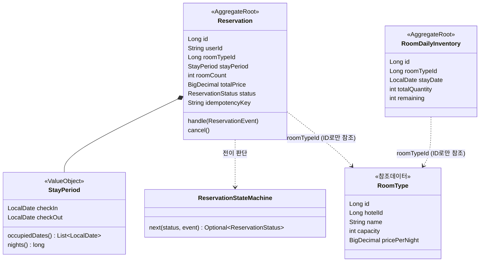
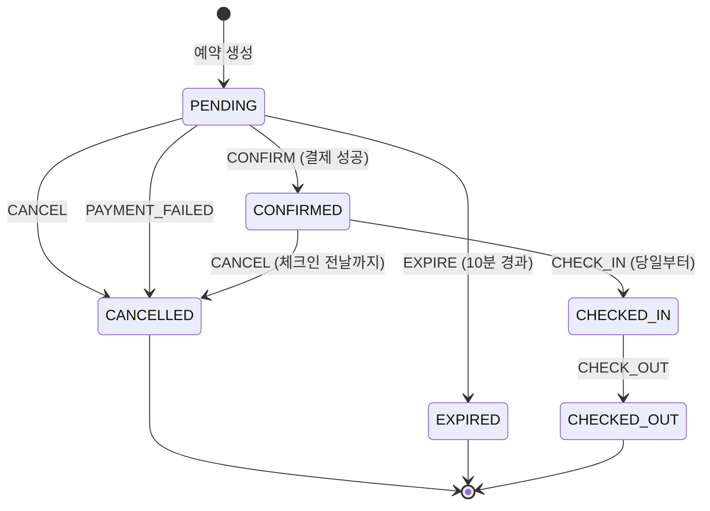
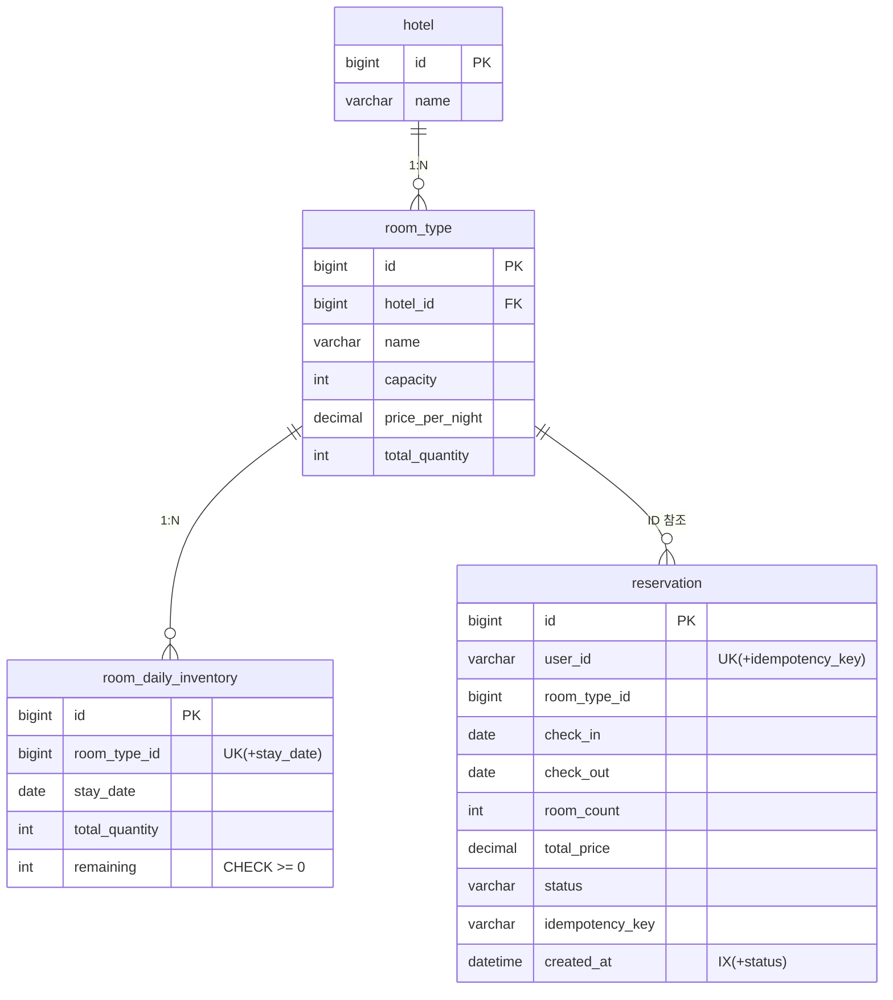
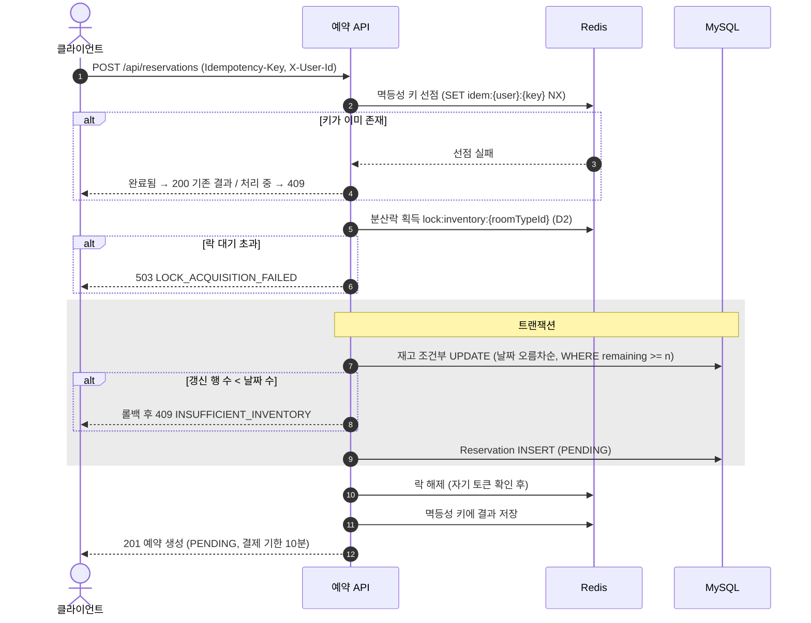
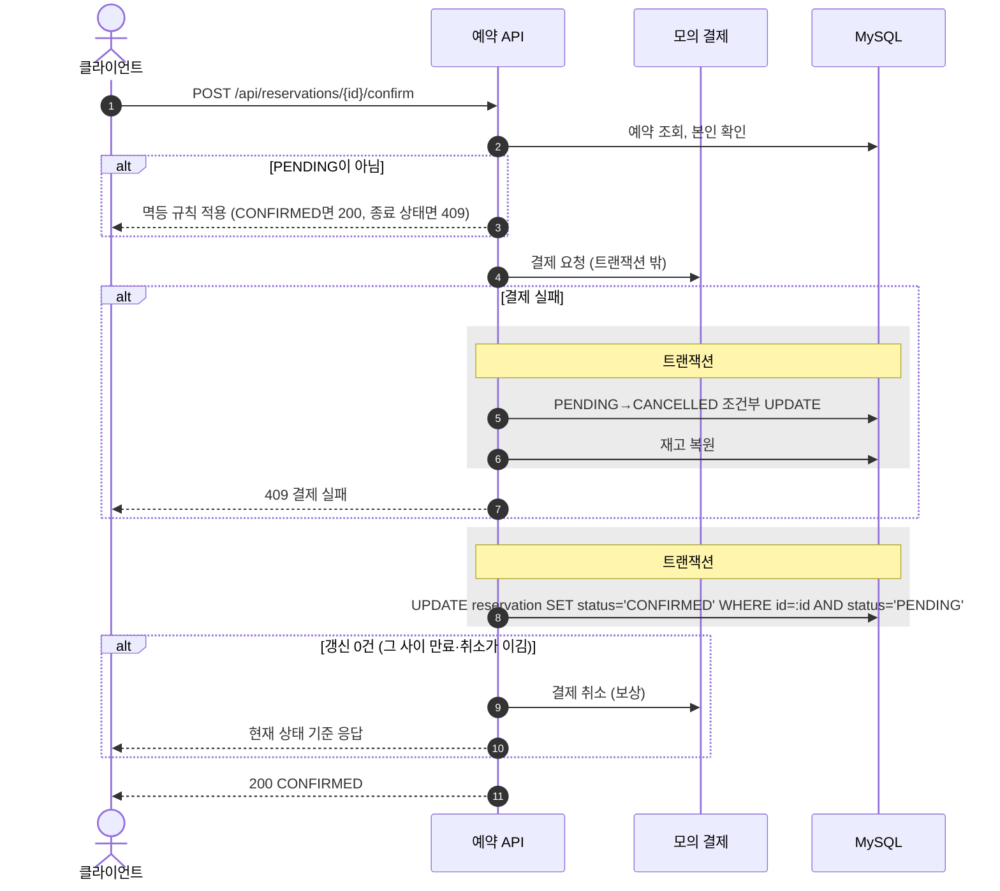

# [F01] 예약 코어

- 상태: 승인 대기
- 작성일: 2026-08-14
- 승인일:

## 1. 무엇을 왜 만드는가

예약의 전체 생명주기(생성 → 확정 → 체크인 → 체크아웃, 그리고 취소·결제실패·만료)와 그 아래의 재고 차감·복원을 만든다. 이게 없으면 시스템에 팔 것이 없다. 그리고 이 feature가 과제의 증명 대상(동시성·멱등성·상태 전이) 전부를 담는다. F02(프로모션), F03(검색)은 이 위에 얹히는 확장이다.

## 2. 범위

**포함하는 것**

- UC-2 예약 생성 (멱등성 키, 재고 차감)
- UC-3 예약 확정 (내부 모의 결제)
- UC-4 예약 취소 (재고 복원)
- UC-5 미결제 만료 (스케줄러)
- UC-6 체크인·체크아웃
- 예약 단건 조회 (검증과 클라이언트 흐름에 필요한 최소 조회)

**포함하지 않는 것**

- 가용 객실 검색: F03 소유. 여기서는 재고 테이블과 도메인만 만든다
- 특가 예약: F02 소유
- 내 예약 목록·페이징: F03에 붙인다. 단건 조회로 흐름 검증은 충분하다

## 3. 소유 범위

- 소유 패키지: `com.pms.reservation.**`, `com.pms.inventory.**` (코어이므로 재고 도메인 포함)
- 읽기만 하는 패키지: 없음 (첫 feature)
- Flyway 번호 대역: V001 ~ V099 (공통 스키마 포함)
- 수정이 필요한 공유 파일: 없음 (`ErrorCode`에 코드 추가가 필요하면 parallel-work 절차를 따른다)

## 4. 도메인 모델링



### 애그리거트 1: Reservation (예약)

- **불변식:**
  - 상태는 전이 표에 있는 경로로만 바뀐다.
  - 확정 이후 투숙 기간·객실타입·수량은 바뀌지 않는다.
  - 체크아웃 날짜는 체크인 날짜보다 뒤다. (StayPeriod VO가 보장)
- **경계 근거:** 위 규칙은 예약 한 건 안에서 완결된다. 재고와는 규칙이 달라 분리한다 (00번 문서 D6).
- **구성:**
  - `Reservation` (루트): id, userId, roomTypeId, stayPeriod, roomCount, totalPrice, status, 생성·확정·취소 시각
  - `StayPeriod` (VO, record): checkIn, checkOut. 생성 시 검증, 점유 날짜 목록 제공
  - `ReservationStatus` (enum): PENDING, CONFIRMED, CHECKED_IN, CHECKED_OUT, CANCELLED, EXPIRED
  - `ReservationEvent` (enum): CONFIRM, PAYMENT_FAILED, CANCEL, EXPIRE, CHECK_IN, CHECK_OUT
  - `ReservationStateMachine`: (상태, 이벤트) → 다음 상태 전이 테이블

### 애그리거트 2: RoomDailyInventory (일별 재고)

- **불변식:** `remaining >= 0`. 어떤 경로로도 음수가 되지 않는다.
- **경계 근거:** 잔여 수량 규칙은 (객실타입, 날짜) 행 하나 안에서 완결된다.
- **구성:** `RoomDailyInventory` (루트): id, roomTypeId, stayDate, totalQuantity, remaining

### 참조 데이터 (애그리거트 아님)

- `Hotel`, `RoomType`: 시드 데이터. 읽기 전용. 수정 유스케이스가 없으므로 불변식 관리 대상이 아니다.

### 상태와 전이 표 (확정본)



| 현재 상태 | 이벤트 | 다음 상태 | 조건 | 멱등 처리 |
|---|---|---|---|---|
| PENDING | CONFIRM | CONFIRMED | 모의 결제 성공 | 이미 CONFIRMED면 성공으로 응답 |
| PENDING | PAYMENT_FAILED | CANCELLED | 모의 결제 실패 | 이미 CANCELLED면 무시 |
| PENDING | CANCEL | CANCELLED | 없음 | 이미 CANCELLED면 성공으로 응답 |
| PENDING | EXPIRE | EXPIRED | 유효시간 경과 | 이미 종료 상태면 건너뜀 |
| CONFIRMED | CANCEL | CANCELLED | 취소 가능 기한 이내 (D3) | 이미 CANCELLED면 성공으로 응답 |
| CONFIRMED | CHECK_IN | CHECKED_IN | 체크인 날짜 당일 이후 | 이미 CHECKED_IN이면 성공으로 응답 |
| CHECKED_IN | CHECK_OUT | CHECKED_OUT | 없음 | 이미 CHECKED_OUT이면 성공으로 응답 |

표에 없는 조합은 전부 `INVALID_STATE_TRANSITION`으로 거부한다. CANCELLED, EXPIRED, CHECKED_OUT은 종료 상태다.

주의할 경합 조합 두 가지. **CANCEL과 CONFIRM이 동시에** 오면 조건부 UPDATE로 하나만 이긴다. **EXPIRE와 CONFIRM이 동시에** 겹치는 경우도 같다. 진 쪽은 현재 상태를 다시 읽어 멱등 규칙에 따라 응답한다.

### 애그리거트 간 관계

`Reservation`이 `roomTypeId`를 들고 있다. 객체 참조는 없다. 재고 조작은 `inventory` 쪽 창구(포트)를 통해서만 한다.

## 5. DB 설계



### 테이블

**hotel** (시드)

| 컬럼 | 타입 | 제약 |
|---|---|---|
| id | BIGINT | PK, AUTO_INCREMENT |
| name | VARCHAR(100) | NOT NULL |

**room_type** (시드)

| 컬럼 | 타입 | 제약 |
|---|---|---|
| id | BIGINT | PK, AUTO_INCREMENT |
| hotel_id | BIGINT | NOT NULL |
| name | VARCHAR(50) | NOT NULL |
| capacity | INT | NOT NULL |
| price_per_night | DECIMAL(12,0) | NOT NULL |
| total_quantity | INT | NOT NULL |

**room_daily_inventory**

| 컬럼 | 타입 | 제약 |
|---|---|---|
| id | BIGINT | PK, AUTO_INCREMENT |
| room_type_id | BIGINT | NOT NULL |
| stay_date | DATE | NOT NULL |
| total_quantity | INT | NOT NULL |
| remaining | INT | NOT NULL, **CHECK (remaining >= 0)** |

**reservation**

| 컬럼 | 타입 | 제약 |
|---|---|---|
| id | BIGINT | PK, AUTO_INCREMENT |
| user_id | VARCHAR(50) | NOT NULL |
| room_type_id | BIGINT | NOT NULL |
| check_in | DATE | NOT NULL |
| check_out | DATE | NOT NULL |
| room_count | INT | NOT NULL |
| total_price | DECIMAL(12,0) | NOT NULL |
| status | VARCHAR(20) | NOT NULL |
| idempotency_key | VARCHAR(80) | NOT NULL |
| created_at / confirmed_at / cancelled_at | DATETIME | created_at만 NOT NULL |

### 인덱스와 제약

| 이름 | 대상 | 종류 | 근거 |
|---|---|---|---|
| uk_inventory_type_date | (room_type_id, stay_date) | UNIQUE | 재고 행의 유일성. 조건부 UPDATE의 대상 특정 |
| chk_inventory_remaining | remaining >= 0 | CHECK | **불변식의 최후 방어선.** 애플리케이션이 다 뚫려도 음수 재고 저장 불가 (MySQL 8.0.16+에서 실제 동작) |
| uk_reservation_idem | (user_id, idempotency_key) | UNIQUE | **멱등성의 최후 방어선.** Redis가 죽어도 같은 키로 예약 두 건 생성 불가 |
| ix_reservation_status_created | (status, created_at) | INDEX | 만료 스케줄러가 PENDING + 생성 시각으로 조회 |
| ix_reservation_user | (user_id) | INDEX | 사용자별 조회 (F03 대비) |

### 마이그레이션 파일

| 파일 | 내용 |
|---|---|
| V001__공통_스키마.sql | 위 4개 테이블, 인덱스, 제약 |
| V002__시드_데이터.sql | 호텔 2곳, 객실타입 5종, 90일치 재고 |

## 6. 유스케이스

### UC-2. 예약 생성

**입력** (주문서 형태, D6 참고): userId(헤더), 멱등성 키(헤더), roomTypeId, checkIn, checkOut, roomCount

**출력**: 예약 id, 상태(PENDING), 결제 기한, 총액

**도메인 모델의 변화**

| 순서 | 대상 | 변화 |
|---|---|---|
| 1 | (Redis) 멱등성 키 | "처리 중"으로 선점 |
| 2 | RoomDailyInventory (숙박일수만큼의 행) | remaining이 각각 roomCount만큼 감소 |
| 3 | Reservation | PENDING으로 새로 생성. 가격은 일수 × 단가 × 수량 |
| 4 | (Redis) 멱등성 키 | 결과(예약 id)로 갱신 |

**흐름**



재고 차감 SQL:

```sql
UPDATE room_daily_inventory SET remaining = remaining - :n
 WHERE room_type_id = :rt AND stay_date = :d AND remaining >= :n
```

**실패 시나리오**

| 상황 | 응답 | 부작용 처리 |
|---|---|---|
| 재고 부족 (일부 날짜 포함) | 409 INSUFFICIENT_INVENTORY | 트랜잭션 롤백. 아무것도 안 남음 |
| 같은 키 처리 중 재요청 | 409 REQUEST_IN_PROGRESS | 없음 |
| 같은 키 완료 후 재요청 | 200 + 기존 결과 | 없음. 새 예약 안 생김 |
| 락 획득 실패 (대기 초과) | 503 LOCK_ACQUISITION_FAILED | 없음 |
| Redis 장애 | 락·멱등 키 없이 진행 (D2, D4) | DB 제약(uk_reservation_idem, 조건부 UPDATE)이 방어 |

### UC-3. 예약 확정

**입력**: userId, 예약 id
**출력**: 예약 상태(CONFIRMED)

**도메인 모델의 변화**

| 순서 | 대상 | 변화 |
|---|---|---|
| 1 | (외부) 모의 결제 | 트랜잭션 밖에서 호출 |
| 2 | Reservation | PENDING → CONFIRMED (성공) 또는 → CANCELLED (실패) |
| 3 | RoomDailyInventory | 결제 실패 시에만 remaining 복원 |

**흐름**



4와 8 사이의 틈이 이 유스케이스의 경합 지점이다. 결제는 성공했는데 그 사이 EXPIRE가 이긴 경우, 조건부 UPDATE 0건으로 감지하고 보상(모의 결제 취소)한다. 이 순서를 스펙으로 못박는다.

### UC-4. 예약 취소

**입력**: userId, 예약 id
**출력**: 예약 상태(CANCELLED)

**도메인 모델의 변화**: Reservation → CANCELLED, RoomDailyInventory remaining 복원 (한 트랜잭션)

**흐름**: 조건부 UPDATE로 전이 (PENDING 또는 CONFIRMED에서). 성공 시 같은 트랜잭션에서 재고 복원. CONFIRMED였다면 모의 환불 호출은 커밋 후.

**취소 기한**: 체크인 날짜 전날 23:59까지 (D3). 이후엔 거부.

### UC-5. 미결제 만료 (EXPIRE)

스케줄러가 1분 주기로 실행 (D5).

```
1. 만료 대상 조회: status=PENDING AND created_at < now - 유효시간(D5)
2. 건별로: UPDATE ... SET status='EXPIRED' WHERE id=:id AND status='PENDING'
   → 성공한 건만 재고 복원 (같은 트랜잭션)
```

건별 조건부 UPDATE라서 확정과 경합해도 안전하다. 확정이 먼저면 0건 갱신으로 건너뛴다.

### UC-6. 체크인 · 체크아웃

조건부 UPDATE 전이만 있다. 재고 변화 없음 (재고는 판매 수량 관리이고, 투숙 여부와 무관).
체크인은 체크인 날짜 당일부터 허용. 날짜 판정은 Clock 주입으로.

## 7. 동시성과 멱등성

### 경합 지점

1. **같은 (객실타입, 날짜) 재고 행에 여러 예약 생성이 동시 진입.** 가장 뜨거운 지점.
2. **같은 예약에 CONFIRM / CANCEL / EXPIRE가 동시 진입.** 상태 전이 경합.
3. **같은 멱등성 키로 동시 재요청.** 더블클릭, 재시도.
4. **여러 날짜 행을 잠그는 두 예약의 교차.** (8/20~22와 8/21~23) 데드락 위험.

### 방어 전략

| 계층 | 수단 | 무엇을 막는가 | 뚫리면? |
|---|---|---|---|
| 1차 | Redis 분산락 (객실타입 단위) | 재고 경합 대부분을 DB 앞에서 직렬화 | 2차가 막는다 |
| 2차 | 조건부 UPDATE (`WHERE remaining >= n`, `WHERE status = ?`) | 재고 음수, 중복 전이 | 3차가 막는다 |
| 3차 | DB 제약 (CHECK remaining >= 0, 멱등 키 UNIQUE) | 잘못된 데이터 저장 자체 | 없음. 최후선 |

**1차를 끈 동시성 테스트를 반드시 포함한다.** 분산락 없이 100 스레드를 돌려도 재고 불변식이 지켜져야 한다.

### 락 순서

재고 차감·복원의 다중 행 UPDATE는 **날짜 오름차순으로 한 문장씩** 실행한다. 교차 기간의 두 요청이 서로 반대 순서로 행 락을 잡으면 데드락이므로, 정렬을 코드에 명시한다. 데드락이 그래도 발생하면(MySQL이 감지해 한쪽을 죽임) 그 요청은 롤백 후 재고 부족과 동일하게 실패 응답한다.

### 멱등성

- 키 형식: 클라이언트가 `Idempotency-Key` 헤더로 전송. 저장 키는 `idem:{userId}:{key}`
- 유효 기간: 24시간 (Redis TTL)
- 재요청 응답: 최초 처리의 결과를 그대로 반환
- 처리 중 재요청: 409 REQUEST_IN_PROGRESS
- Redis 장애 시: DB의 `(user_id, idempotency_key)` UNIQUE가 이중 생성을 막는다. INSERT 시 중복 예외를 잡아 기존 예약을 조회해 응답한다

## 8. API

| 메서드 | 경로 | 설명 |
|---|---|---|
| POST | /api/reservations | 예약 생성 (Idempotency-Key 필수) |
| POST | /api/reservations/{id}/confirm | 확정 (모의 결제) |
| POST | /api/reservations/{id}/cancel | 취소 |
| POST | /api/reservations/{id}/check-in | 체크인 |
| POST | /api/reservations/{id}/check-out | 체크아웃 |
| GET | /api/reservations/{id} | 단건 조회 |

공통 헤더: `X-User-Id`. 예시 요청·응답과 에러 형식은 구현 시 컨트롤러 테스트에 명세로 남긴다.

## 9. 테스트 계획

| 계층 | 무엇을 검증하는가 |
|---|---|
| 도메인 단위 | 전이 표 전 조합(6상태 × 6이벤트) 전수 검증, StayPeriod 규칙, 가격 계산 |
| 유스케이스 | 각 UC 흐름과 실패 분기 (포트는 가짜 구현) |
| 영속성 통합 | 마이그레이션 적용, CHECK·UNIQUE 제약 동작, 조건부 UPDATE 갱신 수 |
| 동시성 | 아래 시나리오 |
| API | 각 엔드포인트 정상·에러 응답 형식 |

**동시성 시나리오 (숫자 확정)**

| # | 시나리오 | 구성 | 기대 |
|---|---|---|---|
| C1 | 재고 경합 | 재고 10, 100 스레드 동시 생성 | 성공 정확히 10, 잔여 0, 예약 행 10 |
| C2 | 1차 방어선 차단 | C1과 동일하되 분산락 비활성 | 결과 동일 |
| C3 | 멱등 키 경합 | 같은 키 100 스레드 | 예약 정확히 1건 |
| C4 | 확정-만료 경합 | 만료 직전 예약에 CONFIRM과 EXPIRE 동시 | 한쪽만 승리, 재고 정합 유지 |
| C5 | 취소-확정 경합 | 같은 예약에 CANCEL·CONFIRM 동시 | 한쪽만 승리 |
| C6 | 교차 기간 데드락 | 8/20~22와 8/21~23 예약을 각 50 스레드 | 데드락 미발생 또는 감지 후 정상 실패, 재고 정합 |

## 10. 구현 시 주의사항

- 결제·환불 등 원격 호출은 트랜잭션 밖. UC-3의 순서를 지킬 것
- 만료 스케줄러와 확정의 경합은 조건부 UPDATE 결과(0건/1건)로만 판단. 조회 후 판단 금지
- 시간 판정(만료, 취소 기한, 체크인 가능일)은 전부 Clock 주입. `now()` 직접 호출 금지
- `ErrorCode`는 이미 필요한 코드가 등록되어 있음. 추가 필요 시 공유 파일 절차
- 멱등 키 DB 컬럼은 UC-2에서만 채워짐. 확정·취소는 예약 id 기반이라 별도 키 불필요 (상태 전이 자체가 멱등)

## 11. 결정 검토란

### D1. 재고 차감을 잠금이 아니라 조건부 UPDATE로 푼다

- **결정:** 재고를 먼저 읽어 잠그는 방식(SELECT FOR UPDATE) 대신, "남아 있을 때만 빼기"를 UPDATE 한 문장(`WHERE remaining >= n`)으로 처리한다.
- **이유:** 읽기·판단·쓰기 세 단계를 한 단계로 줄이면 그 사이에 끼어들 틈 자체가 없다. 잠금 대기가 없어 빠르고, 코드도 단순하다.
- **트레이드오프:** 실패했을 때 "어느 날짜가 부족했는지"를 알려면 추가 조회가 필요하다. 응답에는 부족 날짜 목록 없이 재고 부족으로만 알린다.
- **대안이었던 것:** 비관적 잠금(행을 잠그고 판단). 대기·데드락 관리가 붙고, 이 유스케이스에서는 이점이 없어 기각.
- **확인 질문:** 부족 날짜 상세 없이 "재고 부족"으로만 응답해도 괜찮습니까?

### D2. Redis 분산락은 객실타입 단위 하나로 잡는다

- **결정:** 예약 생성 시 `lock:inventory:{객실타입}` 키 하나만 잡는다. 날짜별로 잡지 않는다.
- **이유:** 날짜별로 잡으면 여러 키를 순서대로 잡아야 해서 분산락끼리의 교착 위험이 생긴다. 키 하나면 그 위험이 없다. 어차피 2차 방어선(조건부 UPDATE)이 정합성을 보장하므로, 1차 락의 역할은 DB 앞에서 줄 세우기다.
- **트레이드오프:** 같은 객실타입의 다른 날짜 예약끼리도 줄을 선다. 불필요한 대기가 생기지만, 정합성 문제는 아니고 성능 문제이며 부하테스트로 영향을 실측한다.
- **대안이었던 것:** (객실타입+날짜)별 다중 락. 정밀하지만 교착 관리가 필요해 기각.
- **확인 질문:** 락 단위를 객실타입 하나로 거칠게 잡는 것에 동의합니까?

### D3. 취소 기한은 "체크인 전날 23:59까지"로 한다

- **결정:** 확정된 예약은 체크인 전날 밤까지만 취소할 수 있다. 당일부터는 거부한다. PENDING 취소는 기한 없다.
- **이유:** 정책이 하나는 있어야 "취소 가능 판정"이 도메인 규칙으로 존재하고 테스트할 수 있다. 위약금·부분 환불은 금액 정책이라 범위 밖이다.
- **트레이드오프:** 실제 호텔의 다양한 취소 정책(무료 취소 기한, 위약금 단계)을 단순화한 것이다.
- **대안이었던 것:** 체크인 24시간 전 기준(시각 계산이 더 복잡), 취소 기한 없음(규칙이 없어져 심심함).
- **확인 질문:** 이 단일 정책으로 괜찮습니까?

### D4. Redis 장애 시 멈추지 않고 DB 방어선으로 계속 서비스한다

- **결정:** 분산락·멱등 키 저장소(Redis)가 죽으면 예약을 거부하는 게 아니라, 락 없이 진행하고 DB 제약이 정합성을 지키게 한다.
- **이유:** 다층 방어를 설계한 이유가 이것이다. 1차가 죽어도 2·3차가 있으니 서비스를 계속할 수 있다. "Redis 장애 = 예약 전면 중단"은 과잉 대응이다.
- **트레이드오프:** Redis 장애 중에는 멱등 재요청에 "기존 결과 재응답"이 아니라 중복 오류 응답이 나갈 수 있다 (DB UNIQUE에 걸려서 기존 예약을 찾아 응답하도록 구현하지만, 처리 중 재요청 구분은 못 한다). DB 부하도 직접 받는다.
- **대안이었던 것:** Redis 장애 시 503으로 거부. 정합성은 같고 가용성만 잃어 기각.
- **확인 질문:** 장애 시 성능·응답 품질 저하를 감수하고 서비스를 계속하는 방향에 동의합니까?

### D5. 결제 유효시간 10분, 만료 스케줄러 1분 주기

- **결정:** PENDING 예약은 생성 후 10분 안에 확정되지 않으면 만료된다. 스케줄러가 1분마다 쓸어담는다.
- **이유:** 10분은 결제 흐름으로 자연스럽고, 부하테스트 중 만료 동작을 관찰하기에도 적당하다. 1분 주기는 "만료 시각 정확성 ±1분"을 뜻하는데, 재고를 최대 1분 더 잡아두는 정도는 비즈니스 문제가 아니다.
- **트레이드오프:** 만료가 정각에 일어나지 않는다. 초 단위 정확성이 필요하면 지연 큐가 필요한데, 그 복잡도를 지불할 이유가 없다.
- **대안이었던 것:** Redis 만료 이벤트 활용(이벤트 유실 가능성, 신뢰 불가), 지연 큐(과함).
- **확인 질문:** 유효 10분, 주기 1분, 만료 정확성 ±1분에 동의합니까?

### D6. 예약 생성 입력을 "주문서" 형태로 잡아 쿠폰 확장 지점을 남긴다 (00번 D5 조건 이행)

- **결정:** 생성 입력을 낱개 파라미터가 아니라 주문서 객체로 받고, 가격 계산을 도메인의 가격 계산기로 분리한다. 지금은 "일수 × 단가 × 수량"뿐이지만, 쿠폰이 들어오면 주문서에 쿠폰 항목을 추가하고 가격 계산기에 할인 단계를 끼우는 것으로 끝나게 한다.
- **이유:** 00번 문서 D5에서 관리자가 건 조건이다. 기존 코드를 고치지 않고 추가만으로 확장되는 구조.
- **트레이드오프:** 현재 기능 대비 한 겹의 간접화가 미리 들어간다. 지금 당장은 없어도 되는 구조를 넣는 것이라, 과설계 경계선에 있다.
- **대안이었던 것:** 지금은 낱개 파라미터로 두고 쿠폰 때 리팩터링. 관리자 조건과 어긋나 기각.
- **확인 질문:** 이 정도의 선반영(주문서 + 가격 계산기 분리)이 조건 의도와 맞습니까?

## 12. 열린 질문

없음. (승인 시점 기준)
