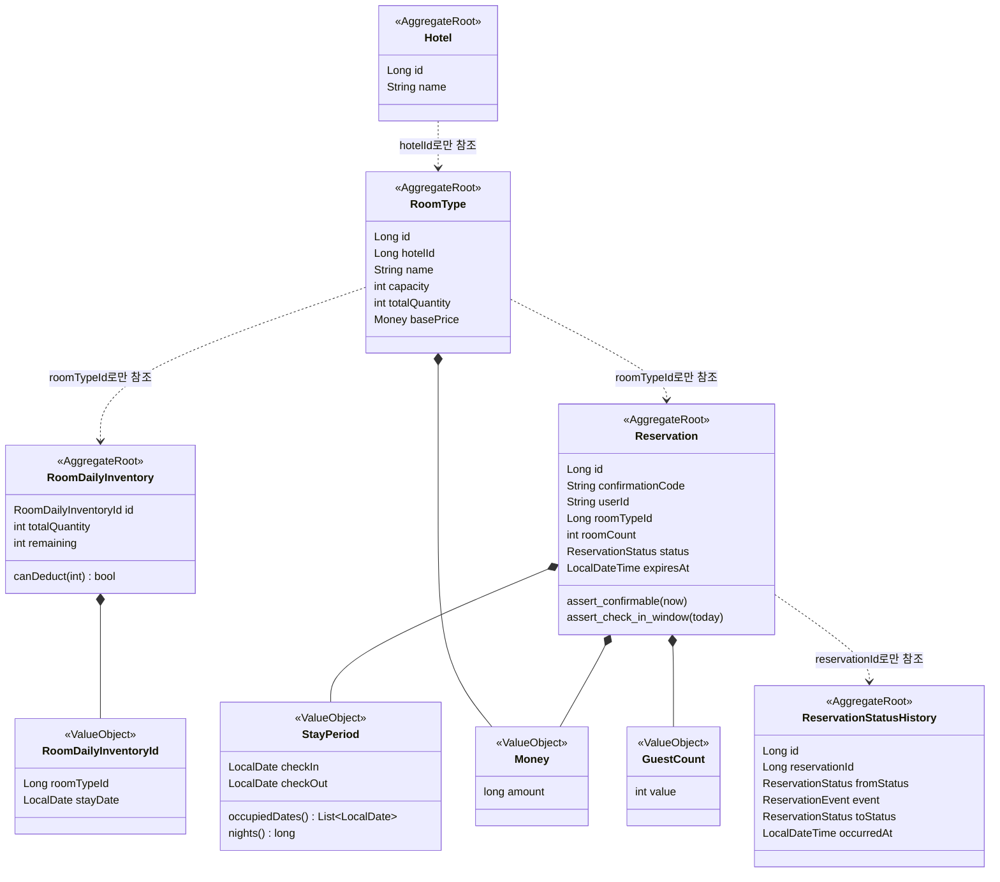
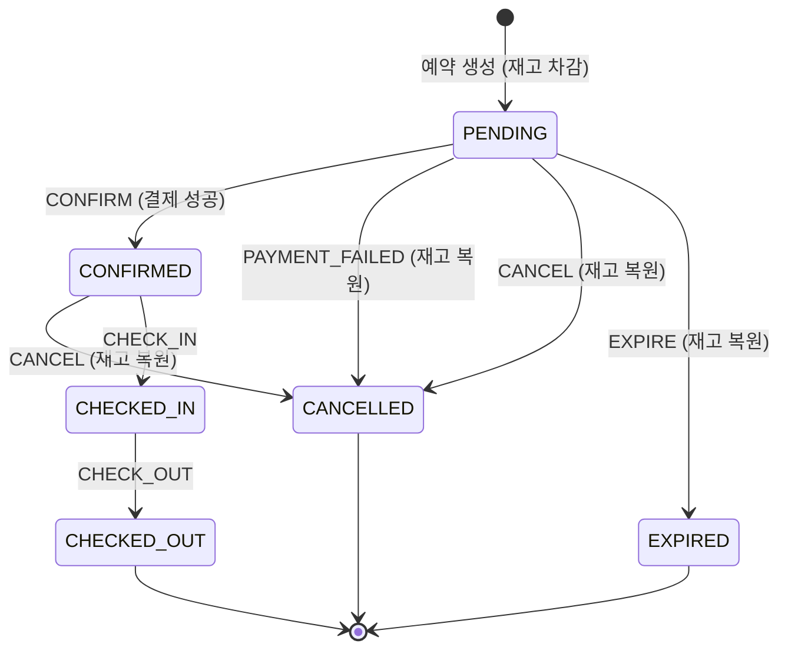
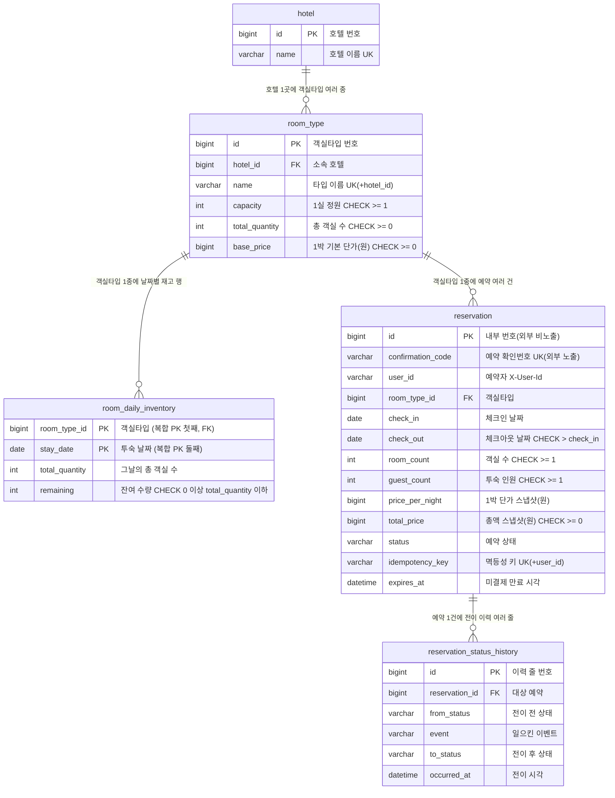
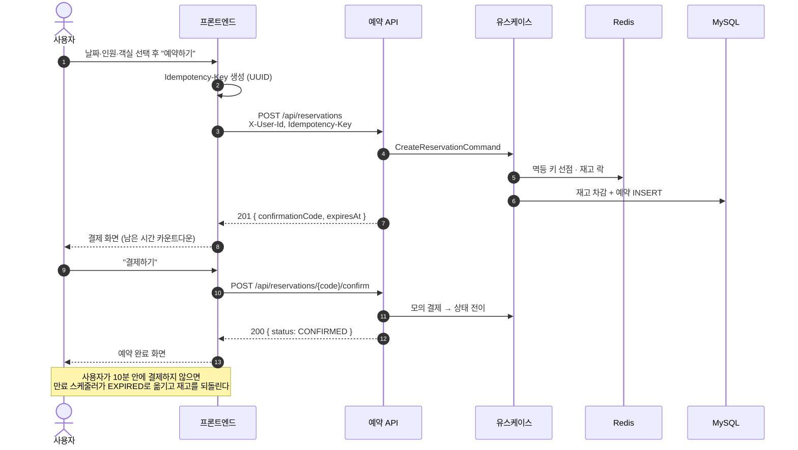
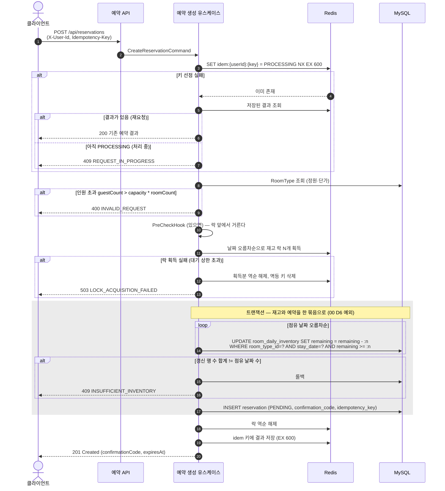
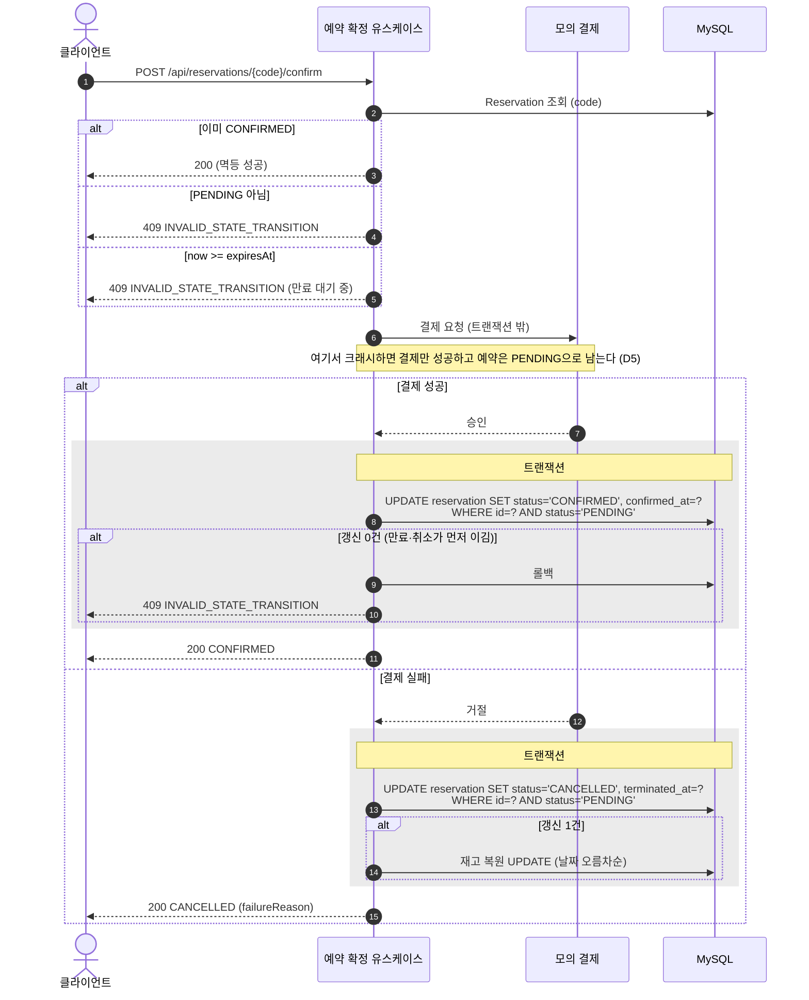
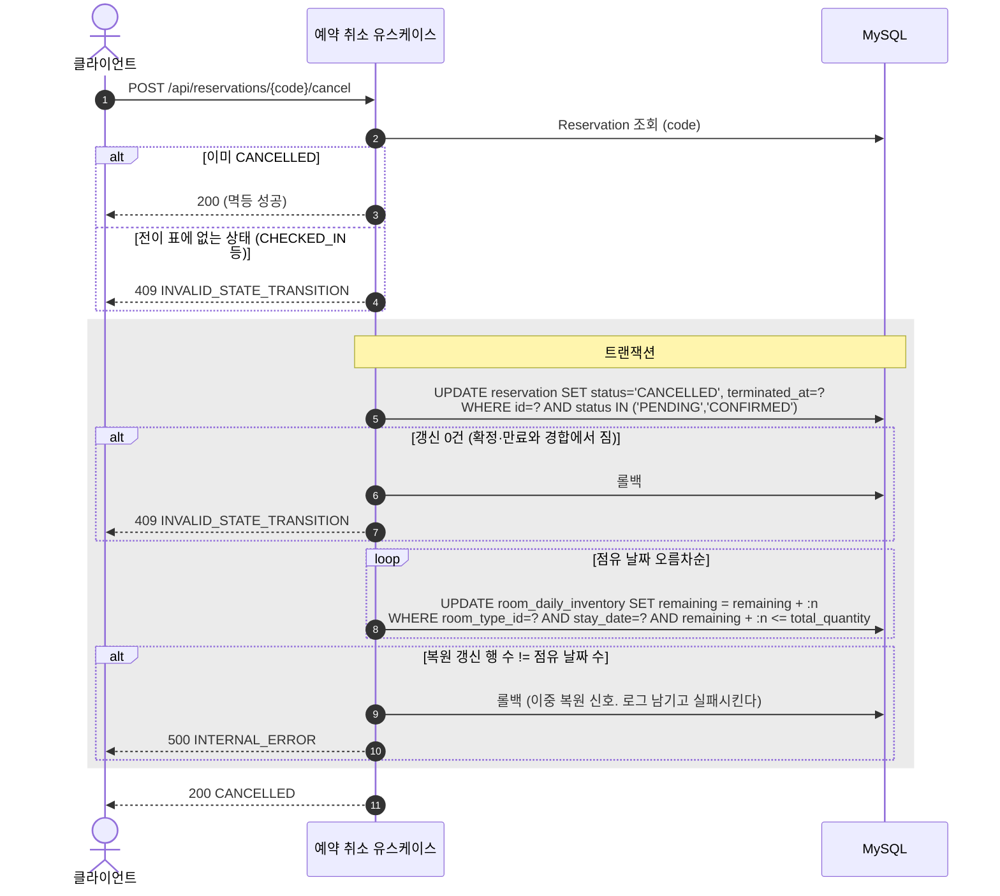
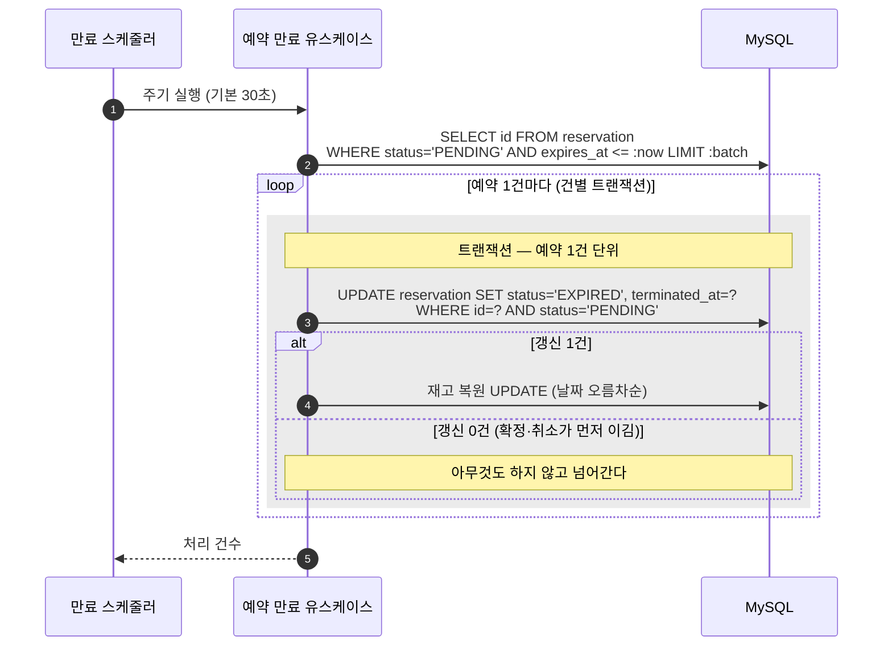
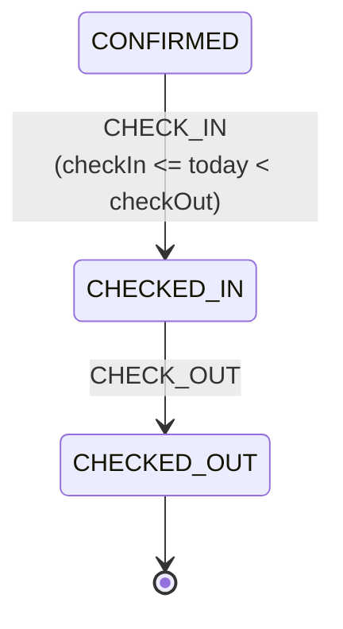

# [F01] 예약 코어

- 상태: ✅ **승인됨** — 2026-08-15 관리자 판정 "승인. 17개 일괄 동의로 처리하고 바로 시작해"
- 스택: Python + FastAPI + SQLModel + Dependency Injector + Alembic + MySQL 8.4 + Redis 7.4
- 작성일: 2026-08-15
- 최종 개정: 2026-08-15 (4단 구조 재정렬 → 관리자 판단 반영 → 스택 전환 반영 → **규칙 문서 개정 4건 반영**)

**마지막 개정에서 반영한 규칙 4건** (전부 `main`의 `docs/architecture/`에 있다)

| # | 규칙 | 이 문서에서 바뀐 곳 |
|---|---|---|
| ① | 레이어 개명 `adapter` → `presentation` + `infrastructure` | 4.1 |
| ② | 세션·트랜잭션 수명과 `TransactionManager` | **4.1 새 절**, 2.5, 4.2 1회차, 4.4, **D28** |
| ③ | 분산락은 `redis-py`의 `Lock` 위에 얹는다 | **3.3 전면 개정** |
| ④ | 레이어 간 데이터는 Pydantic · 결제는 포트 뒤에 | 3.6, **2.3 새 블록** |
- 승인일: **2026-08-15** ([확인] 11개 + [참고] 6개 일괄 동의)

---

## 0. 이 문서를 읽는 법

### 0.1 무엇을 왜 만드는가

이 feature가 없으면 **같은 객실을 여러 사람이 동시에 예약할 때 무슨 일이 벌어지는가**라는 이 과제의 질문 자체가 성립하지 않는다. 예약을 만들고, 재고를 깎고, 그 예약이 확정·취소·만료로 흘러가는 뼈대가 전부 여기 있다.

세 가지가 겹치는 지점이 이 feature의 어려움이다. 잔여 1실을 두 사람이 같은 순간에 노리는 **동시성**, 결제 버튼을 두 번 누르거나 타임아웃 후 재시도가 도착하는 **멱등성**, 그리고 예약이 확정·취소·만료·체크인·체크아웃으로 흩어지는 **상태 전이**. 이 셋 중 하나라도 새면 팔지 않은 방이 팔리거나, 판 방이 사라지거나, 손님 한 명이 두 개의 예약을 갖게 된다.

F02(선착순 특가)와 F03(가용 객실 검색)은 전부 이 feature가 만든 재고 테이블과 예약 상태 위에 얹힌다. 그래서 F01은 순차로 혼자 만들고, 병합된 뒤에야 나머지가 병렬로 붙는다.

### 0.2 문서 구조와 옛 절 번호 대응

**이 문서는 2026-08-15에 4단 구조로 재정렬됐다.** 내용과 계약은 하나도 바뀌지 않았고 배치만 바뀌었다. 다른 세션이 옛 절 번호로 참조하고 있으므로 대응표를 남긴다.

| 옛 절 | 새 절 | 내용 |
|---|---|---|
| 1 무엇을 왜 | 0.1 | 문제 |
| 2 범위 | 0.3 | 포함·제외 |
| 3 소유 범위 | 0.4 | 모듈·마이그레이션 대역·공유 파일 |
| 4.1~4.2 도메인 모델링 | **1.1~1.3** | 클래스 다이어그램, 애그리거트 |
| 4.3 상태와 전이 표 | **1.4** | 상태 6개 × 이벤트 6개 |
| 5.1 ERD | **1.5** | ERD |
| 5.2 테이블 | **1.6** | 테이블·컬럼 설명 |
| 5.3 인덱스와 제약 | **1.7** | 인덱스, CHECK |
| 5.4 마이그레이션 | **1.8** | 마이그레이션 파일 |
| **5.5 시드 데이터 계약** | **1.9** | ← F02·F03·F04가 맞추는 곳 |
| 6 유스케이스 UC-2~6 | **2.2~2.6** | 시퀀스·도메인 흐름 |
| 8 API | **2.1** | 엔드포인트 목록 |
| 7.1 경합 지점 | **3.1** | C1~C6 |
| 7.2 방어 전략 | **3.2** | 3층 방어, 핵심 SQL |
| 7.3 락 순서 | **3.3** | 다중 락 전순서 |
| 7.4 멱등성 | **3.4** | Redis + UK |
| **7.5 확장 지점** | **3.6** | ← F02가 구현하는 곳 |
| 9 테스트 계획 | **4.3** | 계층별·동시성 K1~K10 |
| 10 구현 시 주의사항 | **4.4** | 함정 목록 |
| 11 결정 검토란 | **부록 A** | D1~D28 |
| 12 열린 질문 | **부록 B** | |

### 0.3 범위

**포함하는 것**

| # | 유스케이스 | 이 feature에서 증명할 것 |
|---|---|---|
| UC-2 | 예약 생성 | 멱등성 키, 날짜별 재고 차감의 원자성, 분산락, PENDING 생성 |
| UC-3 | 예약 확정 (내부 모의 결제) | 외부 호출을 트랜잭션 밖으로, 결제 실패 분기, 확정-만료 경합 |
| UC-4 | 예약 취소 | 재고 복원, 취소-확정 경합, 이중 복원 방지 |
| UC-5 | 미결제 만료 (EXPIRE) | 시간 기반 전이, 만료-확정 경합, 재고 복원 |
| UC-6 | 체크인·체크아웃 | 전이 표 완성, 종료 상태 도달 |

공통 스키마(호텔·객실타입)와 시드 데이터, 전역 시각 기준(타임존) 고정도 F01의 몫이다.

**포함하지 않는 것**

| 뺀 것 | 이유 |
|---|---|
| 가용 객실 검색 API | F03 소유(UC-1). 스키마만 F01이 만들고 조회 코드는 만들지 않는다 |
| 선착순 특가 재고 | F02 소유(UC-7). `promotion.**`와 V201~ 대역이 F02 몫이다 |
| 개별 객실 호수 배정 | 00 문서 D3에서 제외 확정. 수량 모델로 간다 |
| **노쇼 자동 처리** | **관리자 판단으로 제외 (D4 기각).** 손님이 안 오면 운영자가 취소로 처리한다고 가정한다. 상태와 스케줄러를 만들지 않는다 |
| 취소 수수료·취소 마감 시각 | 정산·요금 규칙이 딸려 온다. 체크인 전이면 전액 취소 가능으로 단순화한다 (D15) |
| 요금제(rate plan)·날짜별 가격 | 객실타입당 단일 고정 단가. 00 문서 제외 표에 추가 제안 (D8) |
| 한 예약에 여러 객실타입 묶기 | 한 예약 = 한 객실타입. 주문서 구조로 자리만 남긴다 (D8, D12) |
| 세금·수수료·통화 | 총액 단일 필드. 원 단위 정수 (D8) |
| 확정 후 날짜·객실타입 변경 | 취소 후 재예약으로 갈음 (D8) |
| 결제 원장·정산 배치 | 모의 결제라 실제 돈이 움직이지 않는다. 실 PG였다면 필요하다는 사실만 기록 (D5) |

### 0.4 소유 범위

- **소유 모듈:** `app/reservation/**`, `app/inventory/**`
  - 단 `app/inventory/query/**`는 F03 소유다. **만들지 않는다.**
- **읽기만 하는 모듈:** `app/common/**` (에러 계층, 응답 포맷, `Clock`, 설정). **`common`은 아무에게도 의존하지 않는다.** 예외가 하나 있다 — **`app/common/db.py`는 아직 없고 F01이 만든다** (아래).
- **Alembic 리비전 대역:** `001` ~ `099` (공통 스키마와 시드 데이터 포함). `--rev-id`로 명시한다
- **루트 조립 파일(`app/containers.py`·`app/main.py`)은 소유가 아니라 공유다.** 각 feature가 자기 프로바이더·라우터 줄만 추가한다 (Soft — 충돌 시 병합)

**공유 파일 — 선행 커밋은 더 이상 필요 없다.**

원래 D2(`Asia/Seoul` 고정 시계)와 `PMS_` 키 6개를 담은 선행 커밋을 계획했는데, **둘 다 Python 스캐폴딩(PR #6)으로 이미 `main`에 들어갔다.** 승인이 나면 **선행 커밋 없이 바로 1회차로 간다.**

| 파일 | 상태 | 근거 |
|---|---|---|
| `app/common/clock.py` | ✅ **`main`에 있음** — `Asia/Seoul` 고정 | D2 |
| `app/common/config.py` | ✅ **`main`에 있음** — `PMS_` 키 6개 | D10, D11, D17, 2.3절 |
| `app/common/db.py` | ⛔ **없다. F01이 1회차에서 만든다** — `TransactionManager` | **D28** |

`main`에 이미 들어가 있는 설정은 정확히 이것이다.

  ```python
  # app/common/config.py — 기본값과 환경변수 이름
  PMS_RESERVATION_HOLD_MINUTES         = 10     # D11
  PMS_RESERVATION_EXPIRE_SCAN_SECONDS  = 30     # D11
  PMS_LOCK_ENABLED                     = True   # D17
  PMS_LOCK_WAIT_MILLIS                 = 200    # D10
  PMS_LOCK_TTL_SECONDS                 = 3      # D10
  PMS_PAYMENT_DECLINE_RATE             = 0.0    # 2.3절 — 기본은 항상 승인
  ```

  **필드 이름이 아니라 이 환경변수 이름이 계약이다.** 조작자가 셸에 치는 이름과 부하테스트 리포트에 적히는 이름이 같아야 한다. 중간에 번역 계층이 하나 끼면, 리포트를 보고 실험을 재현하려는 사람이 그 문자열을 그대로 붙여넣을 수 없다. **편의가 아니라 재현성 문제다.**

  > **이 표기는 원래 `pms.lock.enabled` 형태였다.** Spring 프로퍼티 이름을 그대로 옮긴 것이었는데, `coding-rules.md`가 "조작자가 치는 그대로"를 요구하고 그 근거가 더 강해서 환경변수 이름으로 통일했다. **`PMS_LOCK_ENABLED` 하나만 쓴다.**

  **`app/common/db.py`는 다른 세션도 쓰게 된다.** `parallel-work.md`의 공유 파일 절차대로 **1회차 안에서 이 파일만 담은 작은 커밋을 먼저 만들어 `main`에 올리고** 다른 세션이 rebase로 받아가게 한다. 유스케이스를 쓰는 세션 전부가 이 두 컨텍스트 매니저 위에 서기 때문이다.

  에러 코드는 F01에 필요한 것이 이미 전부 있어 손대지 않는다. 결제 실패를 에러가 아니라 정상 흐름의 결과로 설계했기 때문이다 (2.3절).

  **설정을 한 곳에서 읽어 프로바이더로 나눠주는 것이 중요하다.** 같은 값을 두 곳에서 따로 읽으면 어긋나고, 특히 `/api/internal/config`가 노출하는 값이 락 구현체가 쓰는 값과 갈리면 **"꺼졌다고 보고하는데 실제로는 도는"** 상태가 만들어진다 (D26).

F03이 읽게 될 `room_daily_inventory`·`room_type` 테이블과 `app/inventory/domain/`은 F01이 만든다. F03은 이 스키마를 읽기 전용으로 쓰고, 조회 전용 코드는 `app/inventory/query/`에 둔다.

---

# 1. 도메인 구조

## 1.1 도메인 모델 한눈에 보기



| 구성 요소 | 무엇인가 | 왜 이렇게 두나 |
|---|---|---|
| `Hotel` (호텔) | 숙소 한 곳 | 시드로만 들어오고 바뀌지 않는다. 사실상 조회 필터다 |
| `RoomType` (객실타입) | 스탠다드·디럭스 같은 판매 단위 | 정원(`capacity`)·총 객실 수·기본 단가를 들고 있다. 인원 검증과 가격 스냅샷의 출처다 |
| `RoomDailyInventory` (일별 재고) | 객실타입 하나의 하루치 잔여 수량 | **이 행이 동시성 제어의 대상이다.** 기간이 아니라 날짜 단위여야 부분 겹침을 정확히 다룬다 |
| `RoomDailyInventoryId` (재고 행 식별자) | `(객실타입, 날짜)` 복합 식별자 | 이 재고 행을 가리키는 유일한 방법이고 절대 바뀌지 않는다. 대리키를 따로 두지 않는 근거는 D16 |
| `Reservation` (예약) | 예약서 한 장 | 상태 전이의 주인. 재고 객체를 들지 않고 `roomTypeId`만 든다 |
| `StayPeriod` (투숙 기간) | 체크인·체크아웃 날짜 쌍 | "체크아웃이 체크인보다 뒤"라는 규칙과 "점유 날짜 목록" 계산이 살 자리 |
| `GuestCount` (투숙 인원) | 예약 전체의 투숙 인원 수 | 1 이상이라는 규칙과 정원 비교가 살 자리 |
| `Money` (금액) | 원 단위 정수 금액 | 통화·세금을 제외했으므로 정수 한 필드. 음수 금지 규칙만 담는다. **두 컨텍스트가 함께 쓰는 공유 VO이고 `inventory/domain/models.py`에 둔다** — reservation → inventory 도메인 import는 이 한 건만 의도된 예외다 (2회차 리뷰 기록) |
| `ReservationStatusHistory` (상태 이력) | 실제로 일어난 전이 한 건의 기록 | 최종 상태만으로는 `CANCELLED`가 `PENDING`에서 왔는지 `CONFIRMED`에서 왔는지 알 수 없다. 전이 표가 실제로 지켜졌음을 DB로 증명하는 자리다 (D19) |

점선 화살표는 **ID 참조**다. **애그리거트 간에 `relationship()`을 걸지 않는다.** 관계를 걸면 무심코 다른 애그리거트를 함께 로드·수정하게 되어 **트랜잭션 경계가 조용히 넓어지고**, 연관을 타고 나가는 의도치 않은 락과 쿼리가 동시성 실험을 오염시킨다. 조인이 필요하면 조회 전용 쿼리에서 명시적으로 쓴다.

## 1.2 애그리거트

**RoomDailyInventory (일별 재고)**

- **불변식:** `0 <= remaining <= totalQuantity`. 잔여는 음수가 될 수 없고, 총 객실 수를 넘을 수도 없다. 위쪽 경계가 필요한 이유는 **이중 복원**이 아래쪽 경계만큼 위험하기 때문이다. 취소와 만료가 같은 예약에 대해 각각 재고를 되돌리면 팔 수 있는 방보다 많은 방이 생긴다.
- **경계 근거:** 잔여 수량이라는 하나의 숫자를 지키는 규칙만 들어 있다. 다른 날짜의 재고는 서로 독립이라 같은 애그리거트로 묶을 이유가 없다. 3박 예약이 3개의 애그리거트를 건드리는 것은 정상이며, 그래서 락 순서 규칙(3.3절)이 필요해진다.
- **구성:** 엔티티 `RoomDailyInventory`, 식별자 VO `RoomDailyInventoryId(roomTypeId, stayDate)`. 대리키를 두지 않고 자연키를 그대로 PK로 쓴다 (D16).

**Reservation (예약)**

- **불변식:**
  1. 상태는 전이 표에 있는 조합으로만 바뀐다. 표 밖의 전이는 거부한다.
  2. 종료 상태(`CHECKED_OUT`, `CANCELLED`, `EXPIRED`)에서는 나가지 않는다.
  3. 투숙 기간은 생성 이후 바뀌지 않는다. 확정 후 변경은 범위에서 뺐다.
  4. `guestCount <= roomType.capacity * roomCount`. 생성 시점에 검증하고 이후 바뀌지 않는다.
  5. 단가와 총액은 생성 시점의 스냅샷이며 이후 바뀌지 않는다.

  **생성 조건(불변식이 아님):** 예약을 만들 때 `checkOut > today`여야 한다 (D21). 이것을 위 목록에 넣지 않은 이유는 **시간이 흐르면 성립하지 않게 되기 때문이다.** 어제 만든 정상 예약도 숙박이 끝나면 `checkOut <= today`가 된다. 불변식은 항상 참이어야 하는 규칙이고, 이것은 생성 시점에만 검사하는 선행 조건이다. 둘을 섞으면 "불변식이 깨진 예약"이 정상적으로 잔뜩 생긴다.
- **경계 근거:** 위 다섯은 전부 예약서 한 장 안에서 판단된다. 재고 잔여는 여기서 판단할 수 없으므로 다른 애그리거트다.
- **구성:** 엔티티 `Reservation`, VO `StayPeriod` / `GuestCount` / `Money`, enum `ReservationStatus` / `ReservationEvent`.

**ReservationStatusHistory (상태 이력)**

- **불변식:** 기록된 행은 수정·삭제되지 않는다. 추가만 있는 테이블이다.
- **경계 근거:** 예약의 불변식에 관여하지 않는 감사 기록이라 `Reservation`과 같은 애그리거트로 묶지 않는다. 묶으면 `@OneToMany`가 필요해지고(금지 항목), 예약을 읽을 때마다 이력이 딸려 나와 뜨거운 경로가 무거워진다. **ID 참조로 떨어뜨리고 별도 리포지토리로 쓴다.**
- **구성:** 엔티티 `ReservationStatusHistory` 단독.

**Hotel, RoomType**

- **불변식:** `RoomType.capacity >= 1`, `RoomType.totalQuantity >= 0`.
- **경계 근거:** 관리자 CRUD를 제외했으므로(00 D1) 시드 이후 변하지 않는 읽기 전용 참조 데이터다. 각각 독립 애그리거트 루트로 두되 수정 유스케이스가 없다.

## 1.3 애그리거트 간 관계

| 들고 있는 쪽 | 들고 있는 ID | 왜 객체가 아니라 ID인가 |
|---|---|---|
| `RoomType` | `hotelId` | 호텔은 조회 필터일 뿐, 객실타입의 불변식에 관여하지 않는다 |
| `RoomDailyInventory` | `roomTypeId` | 재고 행은 자기 잔여 수량만 책임진다 |
| `Reservation` | `roomTypeId` | 예약이 재고 객체를 들면 `relationship()`을 타고 락이 번진다. 정원·단가는 생성 시 값으로 복사해 스냅샷으로 보관한다 |

## 1.4 상태와 전이 표

**상태 6개, 이벤트 6개다.** `NO_SHOW`는 관리자 판단으로 제외했다 (D4 기각).



**상태가 뜻하는 것**

| 상태 | 뜻 | 재고를 쥐고 있는가 |
|---|---|---|
| `PENDING` | 만들어졌지만 아직 결제되지 않음. `expiresAt`까지만 유효 | **쥐고 있다** |
| `CONFIRMED` | 결제 완료 | **쥐고 있다** |
| `CHECKED_IN` | 투숙 중 | 쥐고 있다 (이미 팔린 밤) |
| `CHECKED_OUT` | 투숙 종료 (종료 상태) | 되돌리지 않는다 |
| `CANCELLED` | 사용자 취소 또는 결제 거절 (종료 상태) | **되돌렸다** |
| `EXPIRED` | 미결제 만료 (종료 상태) | **되돌렸다** |

**허용 전이 상세.** 코드의 전이 테이블은 이 표와 한 줄씩 대응한다. **7줄이다.**

| 현재 상태 | 이벤트 | 다음 상태 | 조건 | 재고 | 멱등 처리 |
|---|---|---|---|---|---|
| PENDING | CONFIRM | CONFIRMED | 결제 성공. `now < expiresAt` | 변화 없음 | 이미 CONFIRMED면 성공 처리 |
| PENDING | PAYMENT_FAILED | CANCELLED | 결제 거절 응답 | 복원 | 이미 CANCELLED면 성공 처리 |
| PENDING | CANCEL | CANCELLED | 없음 | 복원 | 이미 CANCELLED면 성공 처리 |
| PENDING | EXPIRE | EXPIRED | `now >= expiresAt` | 복원 | 이미 EXPIRED면 성공 처리 |
| CONFIRMED | CANCEL | CANCELLED | 없음 (체크인 전이면 언제든) | 복원 | 이미 CANCELLED면 성공 처리 |
| CONFIRMED | CHECK_IN | CHECKED_IN | **`checkIn <= today < checkOut`** | 변화 없음 | 이미 CHECKED_IN이면 성공 처리 |
| CHECKED_IN | CHECK_OUT | CHECKED_OUT | 없음 | 변화 없음 | 이미 CHECKED_OUT이면 성공 처리 |

**전수 표 — 36칸.** `→X`는 X로 전이, `멱등`은 상태를 바꾸지 않고 성공 응답, `거부`는 `409 INVALID_STATE_TRANSITION`이다. **허용 7 + 멱등 6 + 거부 23 = 36.**

| 현재 ＼ 이벤트 | CONFIRM | PAYMENT_FAILED | CANCEL | EXPIRE | CHECK_IN | CHECK_OUT |
|---|---|---|---|---|---|---|
| **PENDING** | →CONFIRMED | →CANCELLED | →CANCELLED | →EXPIRED | 거부 | 거부 |
| **CONFIRMED** | 멱등 | 거부 | →CANCELLED | 거부 | →CHECKED_IN | 거부 |
| **CHECKED_IN** | 거부 | 거부 | 거부 | 거부 | 멱등 | →CHECKED_OUT |
| **CHECKED_OUT** | 거부 | 거부 | 거부 | 거부 | 거부 | 멱등 |
| **CANCELLED** | 거부 | 멱등 | 멱등 | 거부 | 거부 | 거부 |
| **EXPIRED** | 거부 | 거부 | 거부 | 멱등 | 거부 | 거부 |

읽는 법에 주의할 곳이 셋 있다.

- **`CONFIRMED + EXPIRE = 거부.`** 확정된 예약은 만료되지 않는다. 만료 스케줄러는 `status = 'PENDING'`을 조건으로 건 UPDATE를 쓰므로 애초에 이 조합에 도달하지 않지만, 표에는 거부로 명시해 수동 API로도 뚫리지 않게 한다.
- **`CANCELLED + EXPIRE = 거부.`** 취소된 예약은 이미 재고를 되돌렸다. 여기서 만료를 멱등 성공으로 처리하면 "재고를 또 되돌려도 되는 것처럼" 보이는 코드가 생긴다. 거부해서 이상 신호가 드러나게 둔다.
- **`EXPIRED + CANCEL = 거부.`** 사용자가 만료된 예약을 취소하려 하면 "이미 취소됨"이 아니라 "만료됨"이라고 답해야 한다. 조용히 성공시키면 사용자는 자기 예약이 살아 있었다고 오해한다.

**멱등 전이가 재고를 건드리지 않는다는 것이 핵심이다.** 상태를 실제로 바꾼 요청만 재고를 복원한다. 구현에서는 조건부 UPDATE의 갱신 행 수가 1일 때만 복원 로직을 태운다 (3.2절).

**D4 기각으로 생긴 구멍 — 알고 남긴다.** `CONFIRMED`에서 자동으로 나가는 출구가 없다. 손님이 오지 않으면 그 예약은 기간이 지나도 `CONFIRMED`로 남는다. 운영자가 취소 API를 부르면 정리되지만 자동으로는 정리되지 않는다. **이것을 제출 문서의 「알고 있는 한계」에 적는다.** 체크인 상한(`today < checkOut`)은 이와 별개의 구멍이라 그대로 살렸다 — 상한이 없으면 체크아웃 날짜가 지난 예약도 체크인된다.

**자동 취소 스케줄러를 만들지 않은 이유는 D15와 충돌하기 때문이다.** 취소는 재고를 복원한다. 노쇼를 자동으로 취소 처리하면 노쇼 객실이 자동으로 다시 팔리게 되어 "노쇼 객실 재판매 안 함"과 정면으로 어긋난다. 자동 전이를 만들지 않으면 자동 복원도 없다. 운영자가 명시적으로 취소하면 재고가 돌아오는데, 그건 사람이 "다시 팔겠다"고 판단한 것이라 모순이 아니다.

## 1.5 ERD



## 1.6 테이블과 컬럼

각 컬럼에 **어떤 값이 들어가고 누가 어떻게 읽는지**를 적는다.

### `hotel` — 호텔

| 컬럼 | 타입 | 제약 | 어떤 값인가 | 어떻게 쓰이는가 |
|---|---|---|---|---|
| `id` | BIGINT | PK, AUTO_INCREMENT | 1, 2 (시드 고정) | `room_type.hotel_id`가 참조. F03 검색의 호텔 필터 |
| `name` | VARCHAR(100) | NOT NULL, UK | `서울 그랜드 호텔` | 표시용. UK는 시드 재적용 시 중복 삽입 방지 |
| `address` | VARCHAR(255) | NOT NULL | 도로명 주소 문자열 | 표시 전용. **검색 조건이 아니다** |
| `created_at` | DATETIME(6) | NOT NULL | 시드 삽입 시각 | 감사용. 조회하지 않는다 |

### `room_type` — 객실타입

| 컬럼 | 타입 | 제약 | 어떤 값인가 | 어떻게 쓰이는가 |
|---|---|---|---|---|
| `id` | BIGINT | PK, AUTO_INCREMENT | 1~5 (시드 고정) | 예약·재고의 참조 대상. **API 요청 본문의 `roomTypeId`가 이 값이다** |
| `hotel_id` | BIGINT | NOT NULL, FK → `hotel(id)` | 1 또는 2 | 소속 호텔. F03이 호텔별 검색에 쓴다 |
| `name` | VARCHAR(100) | NOT NULL, UK(`hotel_id`,`name`) | `스탠다드`, `스위트` | 표시용. UK는 같은 호텔 안 중복 방지 |
| `capacity` | INT | NOT NULL, CHECK `>= 1` | 1실 정원 (2~4) | **인원 검증의 기준.** `guestCount <= capacity * roomCount` |
| `total_quantity` | INT | NOT NULL, CHECK `>= 0` | 총 객실 수 (10~100) | 재고 행 생성의 기준값. 시드가 이 값을 날짜별로 복사한다 |
| `base_price` | BIGINT | NOT NULL, CHECK `>= 0` | 1박 정가, 원 단위 정수 | **단가 스냅샷의 출처.** 할인이 없으면 이 값이 `price_per_night`가 된다 |
| `created_at` | DATETIME(6) | NOT NULL | 시드 삽입 시각 | 감사용 |

### `room_daily_inventory` — 일별 재고 · **동시성 제어의 대상 테이블**

| 컬럼 | 타입 | 제약 | 어떤 값인가 | 어떻게 쓰이는가 |
|---|---|---|---|---|
| `room_type_id` | BIGINT | **PK(1/2)**, FK → `room_type(id)` | 1~5 | 복합 PK의 첫 컬럼. 차감·복원 UPDATE의 `WHERE` 절 절반 |
| `stay_date` | DATE | **PK(2/2)** | `2026-08-01`~`2026-10-29` | 투숙 날짜. **체크아웃 당일은 점유하지 않는다.** 3박이면 이 행이 3개 |
| `total_quantity` | INT | NOT NULL, CHECK `>= 0` | 그날 판매 가능한 총 객실 수 | 복원 UPDATE의 상한 조건(`remaining + n <= total_quantity`)에 쓰인다 |
| `remaining` | INT | NOT NULL, CHECK `>= 0`, CHECK `<= total_quantity` | 남은 객실 수 | **이 시스템에서 가장 뜨거운 값이다.** 차감·복원 조건부 UPDATE가 전부 이 컬럼을 건다 |
| `created_at` | DATETIME(6) | NOT NULL | 시드 삽입 시각 | 감사용 |
| `updated_at` | DATETIME(6) | NOT NULL | 마지막 차감·복원 시각 | 조건부 UPDATE가 매번 갱신. 부하테스트 후 어느 행이 움직였는지 확인용 |

**이 테이블만 대리키(auto-increment `id`)를 두지 않고 자연키 `(room_type_id, stay_date)`를 그대로 PK로 쓴다.** 근거는 D16이다.

`total_quantity`를 `room_type`에서 조인해 오지 않고 재고 행에 복사해 두는 이유는 두 가지다. 첫째, `remaining <= total_quantity` CHECK 제약이 같은 행 안에서만 표현 가능하다. 둘째, 날짜별로 판매 가능 수량이 달라지는 상황(객실 정비, 오버부킹 정책)이 오면 이 컬럼만 바꾸면 된다.

### `reservation` — 예약

| 컬럼 | 타입 | 제약 | 어떤 값인가 | 어떻게 쓰이는가 |
|---|---|---|---|---|
| `id` | BIGINT | PK, AUTO_INCREMENT | 내부 순번 | FK 참조와 조건부 UPDATE의 `WHERE id = ?`. **API에 노출하지 않는다** (D7) |
| `confirmation_code` | VARCHAR(32) | NOT NULL, UK | `260901-H1R3-K7M2XQ4R` | **모든 API 경로의 식별자.** 체크인일+호텔+객실타입+무작위 8자 (D7). **소비하는 쪽은 이 포맷을 모른다** — 언제나 전체 일치로만 조회한다 |
| `user_id` | VARCHAR(64) | NOT NULL | `X-User-Id` 헤더 값 | 취소 시 소유자 검증. 멱등성 키와 조합해 UK를 이룬다 |
| `room_type_id` | BIGINT | NOT NULL, FK → `room_type(id)` | 1~5 | 어느 재고 행을 깎고 되돌릴지 결정한다 |
| `check_in` | DATE | NOT NULL | 투숙 시작일 | 점유 날짜 계산의 시작. 체크인 조건 `checkIn <= today` |
| `check_out` | DATE | NOT NULL, CHECK `> check_in` | 투숙 종료일 | 점유 날짜 계산의 끝(**미포함**). 체크인 상한 `today < checkOut`, 생성 조건 `checkOut > today` |
| `room_count` | INT | NOT NULL, CHECK `>= 1` | 예약한 객실 수 | 차감·복원 UPDATE의 `:count`. **음수가 들어오면 재고가 늘어난다** — CHECK가 막는 이유 |
| `guest_count` | INT | NOT NULL, CHECK `>= 1` | 투숙 인원 합계 | 생성 시 `<= capacity * roomCount` 검증 (D1). 저장 후에는 표시용 |
| `price_per_night` | BIGINT | NOT NULL, CHECK `>= 0` | **실제로 청구한** 1박 단가 | 생성 시점 스냅샷. 특가면 특가 단가가 들어간다 (D22). 사후 백필 불가라 반드시 저장 |
| `total_price` | BIGINT | NOT NULL, CHECK `>= 0` | `price_per_night × nights × roomCount` | 응답 표시. 역산 대신 저장해 두면 계산 규칙이 바뀌어도 과거 값이 안전하다 |
| `status` | VARCHAR(20) | NOT NULL | `PENDING` 등 enum 이름 대문자 | **상태 전이 조건부 UPDATE의 `WHERE status = :expected`.** 동시성 승패가 이 컬럼에서 갈린다 |
| `idempotency_key` | VARCHAR(128) | NOT NULL, UK(`user_id`,`idempotency_key`) | 클라이언트가 만든 키 | **멱등성의 최후 방어선.** Redis가 죽어도 중복 예약이 저장되지 않는다 |
| `expires_at` | DATETIME(6) | NOT NULL | 생성 시각 + 10분 | 만료 스케줄러의 조회 조건. 확정 유스케이스도 `now >= expiresAt`을 스스로 검사한다 |
| `confirmed_at` | DATETIME(6) | NULL | 확정 시각 | NULL이면 확정된 적 없음. 응답에 실린다 |
| `terminated_at` | DATETIME(6) | NULL | 종료 상태 도달 시각 | 취소·만료·체크아웃 시 기록. NULL이면 아직 진행 중 |
| `created_at` | DATETIME(6) | NOT NULL | 생성 시각 | `→ PENDING` 전이를 이력에 남기지 않는 대신 이 값이 그 역할을 한다 |
| `updated_at` | DATETIME(6) | NOT NULL | 마지막 전이 시각 | 감사용 |

### `reservation_status_history` — 상태 전이 이력 · **추가만 하고 수정·삭제하지 않는다**

| 컬럼 | 타입 | 제약 | 어떤 값인가 | 어떻게 쓰이는가 |
|---|---|---|---|---|
| `id` | BIGINT | PK, AUTO_INCREMENT | 전역 순번 | **전이 순서의 판단 기준.** `occurred_at`이 아니다 |
| `reservation_id` | BIGINT | NOT NULL, FK → `reservation(id)` | 대상 예약 | 예약 하나의 이력을 모아 읽는 조회 키 |
| `from_status` | VARCHAR(20) | NOT NULL | 전이 전 상태 | "`CANCELLED`가 `PENDING`에서 왔는지 `CONFIRMED`에서 왔는지"를 답한다 |
| `event` | VARCHAR(20) | NOT NULL | 전이를 일으킨 이벤트 | 같은 `CANCELLED`도 `CANCEL`인지 `PAYMENT_FAILED`인지 구분 |
| `to_status` | VARCHAR(20) | NOT NULL | 전이 후 상태 | 종료 상태 중복 도달 검증에 쓰인다 |
| `occurred_at` | DATETIME(6) | NOT NULL | 유스케이스가 읽은 `now` | 표시용. **같은 트랜잭션이면 값이 같을 수 있어 순서 판단에 쓰지 않는다** |

**컬럼 값은 enum 이름 그대로**의 대문자 문자열이다. `from_status`·`to_status`는 `PENDING`·`CONFIRMED`·`CHECKED_IN`·`CHECKED_OUT`·`CANCELLED`·`EXPIRED`, `event`는 `CONFIRM`·`PAYMENT_FAILED`·`CANCEL`·`EXPIRE`·`CHECK_IN`·`CHECK_OUT`이다.

**이 테이블로 증명할 수 있는 것 세 가지.** 동시성 테스트와 F04 부하 검증이 그대로 쓴다. 셋 다 **결과가 비어 있어야 통과**다.

```sql
-- (1) 재고 복원이 예약당 정확히 한 번인가
--     복원을 일으키는 이벤트는 정확히 이 셋이다 (1.4절 전이 표)
SELECT reservation_id, COUNT(*) AS restore_count
  FROM reservation_status_history
 WHERE event IN ('CANCEL', 'PAYMENT_FAILED', 'EXPIRE')
 GROUP BY reservation_id
HAVING COUNT(*) > 1;

-- (2) 종료 상태에 두 번 도달한 예약이 있는가 (종료 상태는 나갈 수 없다)
SELECT reservation_id, COUNT(*)
  FROM reservation_status_history
 WHERE to_status IN ('CANCELLED', 'EXPIRED', 'CHECKED_OUT')
 GROUP BY reservation_id
HAVING COUNT(*) > 1;

-- (3) 전이 표 밖의 전이가 실제로 일어났는가
--     결과가 허용 7행의 부분집합이어야 한다
SELECT DISTINCT from_status, event, to_status
  FROM reservation_status_history;
```

(3)에 대한 주의. 이 테이블은 **거부된 시도를 기록하지 않으므로**(D19) "금지된 전이가 시도됐다가 막혔다"는 증명하지 못한다. 그건 전이 표 36칸 전수 테스트의 몫이다. 다만 **"표 밖의 전이가 실제로는 한 번도 일어나지 않았다"는 증명된다.** 시도의 부재가 아니라 결과의 부재이며, 운영 데이터로 하는 증명이라는 점에서 값이 다르다.

**기록하는 것은 실제로 일어난 전이뿐이다.** 예약 생성(`→ PENDING`)은 이력에 넣지 않는다. 초기 상태가 항상 `PENDING`인 것은 불변이라 `reservation.created_at`으로 충분하고, 이력 테이블을 전이 표와 **정확히 1:1로** 유지하는 편이 읽기 쉽다.

`status`를 MySQL ENUM 타입이 아니라 VARCHAR로 두는 이유는, ENUM에 값을 추가하려면 테이블을 변경해야 하고 순서에 의존하는 함정이 있기 때문이다. 상태 목록의 진실은 코드의 전이 표이며 DB는 문자열로 보관한다.

**파이썬 Enum의 이름과 값을 같은 대문자 문자열로 둔다.**

```python
class ReservationStatus(str, Enum):
    PENDING = "PENDING"        # 이름 == 값
```

**이것이 검증 쿼리의 생사를 가른다.** 값이 이름과 다르면 위 세 쿼리의 `IN` 필터가 **0행을 돌려주고 모든 불변식이 통과로 보인다.** 조용한 실패라 아무도 모른다. 방어책 전체는 4.3절에 있다. `__tablename__`도 자동 생성 규칙에 기대지 않고 명시한다 — 마이그레이션의 테이블명과 어긋날 수 있다.

## 1.7 인덱스와 제약

| 이름 | 대상 컬럼 | 종류 | 근거 |
|---|---|---|---|
| `uk_hotel_name` | `hotel(name)` | UNIQUE | 시드 재적용 시 중복 삽입 방지 |
| `uk_room_type_hotel_name` | `room_type(hotel_id, name)` | UNIQUE | 같은 호텔에 같은 이름의 타입이 둘일 수 없다 |
| `PRIMARY` | `room_daily_inventory(room_type_id, stay_date)` | 복합 PK (클러스터드) | **재고 차감·복원 조건부 UPDATE가 정확히 한 행을 지정하는 경로이자 유일성 보장.** 클러스터드라 세컨더리 인덱스를 거치지 않고 바로 행에 도달하고, 잠기는 인덱스 레코드가 하나뿐이다. F03의 `(객실타입, 날짜 범위)` 조회도 이 인덱스 하나로 커버된다 (D16) |
| `uk_reservation_code` | `reservation(confirmation_code)` | UNIQUE | 조회·상태 전이 API의 진입 경로. 중복 코드 생성 방지 |
| `uk_reservation_idempotency` | `reservation(user_id, idempotency_key)` | UNIQUE | **멱등성의 최후 방어선.** Redis가 죽어도 같은 키로 두 건이 저장되지 않는다 |
| `idx_reservation_expire` | `reservation(status, expires_at)` | 일반 | 만료 스케줄러의 `WHERE status = 'PENDING' AND expires_at <= ?` |
| `idx_history_reservation` | `reservation_status_history(reservation_id, id)` | 일반 | 예약 하나의 전이 이력을 순서대로 읽는 유일한 조회 경로. 동시성 테스트와 F04 부하 검증이 "복원이 정확히 한 번"을 이 조회로 확인한다 |
| `idx_reservation_room_type` | `reservation(room_type_id)` | 일반 | **새 인덱스가 아니다.** MySQL이 FK에 어차피 만드는 암묵 인덱스에 이름을 붙인 것 — 암묵 이름은 예측 불가라 모델-스키마 대조(T28)를 깨뜨린다 (구현 중 추가, PM 승인) |

PK를 빼면 추가한 인덱스는 위 여섯 개뿐이다. 예약 목록 조회 API를 범위에 넣지 않았으므로 `(user_id, created_at)` 인덱스는 만들지 않는다. 근거 없는 인덱스는 쓰기 비용만 늘린다. **노쇼 스케줄러용 `idx_reservation_noshow`는 D4 기각으로 제거했다.**

**불변식을 지키는 제약 (최후 방어선).** 애플리케이션 로직이 전부 뚫려도 아래가 막는다.

| 제약 | 막는 것 | 뚫렸을 때 벌어지는 일 |
|---|---|---|
| `CHECK remaining >= 0` | 초과 판매 | 없는 방이 팔린다 |
| `CHECK remaining <= total_quantity` | **이중 복원** | 취소와 만료가 같은 예약의 재고를 각각 되돌려 팔 수 있는 방이 늘어난다. 이건 조용히 진행돼서 아무도 모른다 |
| `CHECK room_count >= 1` | 음수·0 객실 수 요청 | `room_count = -5`면 차감 UPDATE의 `remaining >= :count` 조건을 통과하면서 재고를 **늘린다** |
| `CHECK check_out > check_in` | 뒤집힌 기간 | 점유 날짜 목록이 비어 재고를 하나도 안 깎고 예약이 생긴다 |
| `CHECK guest_count >= 1` | 인원 0명 예약 | 정원 검증이 무의미해진다 |
| `UNIQUE (user_id, idempotency_key)` | 중복 예약 | Redis 장애 시 재시도가 두 건의 예약이 된다 |
| `PRIMARY KEY (room_type_id, stay_date)` | 재고 행 분열 | 같은 (타입, 날짜) 행이 둘 생겨 잔여 수량의 진실이 두 곳이 된다 |

`room_count >= 1`과 `check_out > check_in`은 도메인 VO 생성자에서도 검증한다. **같은 규칙을 두 곳에서 검증하는 것은 중복이 아니라 방어선이다.** VO는 정상 경로를 빠르게 막고, CHECK는 SQL이 직접 실행되는 경로(마이그레이션, 수동 조작, 벌크 UPDATE)를 막는다.

**예외가 하나 있다.** 생성 조건 `checkOut > today`(D21)만 DB 최후 방어선이 없다. MySQL CHECK 제약에는 `CURDATE()` 같은 비결정적 함수를 쓸 수 없어 원리적으로 불가능하다. 이 규칙만 애플리케이션 검증 한 겹이다.

## 1.8 마이그레이션 파일

Alembic을 쓴다. 기본은 해시 리비전 ID지만 `--rev-id`로 명시할 수 있어 **번호 대역은 그대로 간다. F01은 `001`~`099`다.**

```bash
alembic revision --rev-id 001_common_schema -m "공통 스키마"
```

| 리비전 ID | 내용 |
|---|---|
| `001_common_schema` | `hotel`, `room_type` 생성 |
| `002_inventory_schema` | `room_daily_inventory` 생성 |
| `003_reservation_schema` | `reservation` 생성 |
| `004_reservation_history_schema` | `reservation_status_history` 생성 |
| `051_seed_hotel_room_type` | 호텔 2곳, 객실타입 5종 (값은 1.9절) |
| `052_seed_daily_inventory` | **고정 날짜** `2026-08-01` ~ `2026-10-29` 90일치 재고 450행 |

**CHECK 제약과 시드는 SQL을 그대로 쓴다.** `op.execute(...)`로 재귀 CTE를 넣으면 된다. 1.7절의 제약 7종도 마찬가지다 — **DB에 거는 것이라 언어가 바뀌어도 같다.**

**`004`까지는 스키마, `051`부터가 시드다.** 번호를 띄운 것은 나중에 스키마 변경이 필요할 때 `005~050`을 쓰기 위해서다.

**통합·동시성 테스트는 이 시드에 의존하지 않는다.** 각 테스트가 자기 데이터를 직접 넣고 지운다. 시드는 로컬 실행과 k6 부하테스트를 위한 것이다.

## 1.9 시드 데이터 계약

**이 절은 F02·F03·F04가 이 문서만 보고 맞출 수 있어야 한다.** 세션마다 다른 날짜나 id를 가정하면 통합 시점에 **조용히 실패한다.** 재고 행이 없는 날짜를 예약하면 응답이 `409 INSUFFICIENT_INVENTORY`인데, 이건 "매진"과 구분되지 않아 정상 동작처럼 보인다. 부하테스트가 성공 0건을 받고 나서야 뭔가 잘못됐음을 알게 된다. 그래서 값을 여기 숫자로 고정한다.

### (1) 재고 날짜 범위 — `CURDATE()`가 아니라 고정 날짜다

```
2026-08-01 ~ 2026-10-29  (90일, 양끝 포함)
```

`CURDATE()` 기준으로 만들면 **마이그레이션을 실행한 날에 따라 범위가 움직인다.** 마이그레이션은 한 번만 실행되므로 실행일로부터 90일이 지나면 재고가 없는 날짜가 생기고, 세 세션이 각자 다른 "오늘"을 가정하면 어긋난다.

**범위가 오늘(2026-08-15)을 안에 포함하도록 잡았다.** 미래에서만 시작하면 `checkIn <= today < checkOut`이 조건인 **체크인을 시연할 수 없다.**

| 쓰임 | 권장 날짜 |
|---|---|
| 일반 예약(생성·확정·취소·만료) | 범위 안 아무 날짜. 예: `2026-09-01` ~ `2026-09-04` |
| **체크인** 시연·테스트 | `checkIn = 2026-08-15`(오늘), `checkOut = 2026-08-17` |
| 체크인 상한 거부 확인 | `checkIn = 2026-08-10`, `checkOut = 2026-08-12` (이미 끝난 숙박 → 생성 자체가 400) |
| 재고 없음(409) 확인 | `2026-10-30` 이후 |

**예약 생성은 `checkOut > today`를 요구한다** (D21). `checkIn >= today`가 아니다. 체크인일이 지났어도 체크아웃일이 남았으면 **진행 중인 투숙**이고, 체크인이 바로 그 구간의 사건이라 허용해야 한다.

### (2) 호텔 — 리비전 `051`

| id | name | address |
|---|---|---|
| 1 | 서울 그랜드 호텔 | 서울특별시 중구 을지로 100 |
| 2 | 부산 오션뷰 호텔 | 부산광역시 해운대구 해운대해변로 200 |

### (3) 객실타입 — 리비전 `051`

| id | hotel_id | name | capacity | total_quantity | base_price |
|---|---|---|---|---|---|
| 1 | 1 | 스탠다드 | 2 | 100 | 150000 |
| 2 | 1 | 디럭스 | 3 | 50 | 250000 |
| **3** | 1 | **스위트** | 4 | **10** | 600000 |
| 4 | 2 | 오션뷰 스탠다드 | 2 | 80 | 180000 |
| 5 | 2 | 오션뷰 스위트 | 4 | 20 | 450000 |

**`id = 3`(스위트, 10실)이 경합 실험용이다.** 부하테스트에서 "잔여 10에 수백 명이 몰린다"를 만들려면 이런 객실타입이 시드에 있어야 한다. 재고가 전부 넉넉하면 경합이 일어나지 않아 아무것도 증명하지 못한다. `id = 5`(20실)는 보조 경합 대상이다.

`capacity`는 정원 검증(`guestCount ≤ capacity × roomCount`)의 기준이다. 스탠다드 1실이면 최대 2명이고, 3명을 넣으면 400이 떨어진다.

### (4) 재고 행의 초기 `remaining` — 전부 `total_quantity`와 같다

일부러 줄여둔 날짜는 **하나도 없다.** 시드는 "판매 시작 전" 상태여야 부하테스트가 매번 같은 출발선에서 시작한다. 특정 날짜만 줄여두면 "왜 이 날짜만 다른가"가 문서에 없는 암묵 지식이 되고, 부하 결과를 해석할 때 그 지식을 모르는 사람은 틀린 결론을 낸다. 특정 날짜의 재고를 줄이고 싶으면 시드가 아니라 **테스트가 직접 UPDATE**한다.

행 수는 5종 × 90일 = **450행**이다.

### (5) 재시드 방법

부하테스트를 한 번 돌리면 재고가 소진된다. 되돌리는 방법은 하나다.

```bash
docker compose down -v && docker compose up -d   # 볼륨까지 지운다
alembic upgrade head                              # 마이그레이션이 처음부터 다시 적용된다
```

**날짜를 고정했기 때문에 몇 번을 돌려도 정확히 같은 상태가 나온다.**

### (6) `X-User-Id` 규약

사용자 테이블이 없다(ADR-0006). `VARCHAR(64)` 안에 들어가고 비어 있지 않으면 **어떤 값이든 받는다.** 별도 검증도 조회도 하지 않는다.

| 쓰임 | 권장 형식 | 예 |
|---|---|---|
| k6 부하테스트 | `user-{VU번호}` | `user-1` ~ `user-200` |
| 통합 테스트 | `test-{시나리오}-{n}` | `test-cancel-01` |

**주의: 같은 예약을 다루는 요청은 같은 값을 써야 한다.** 취소는 소유자를 검증하고, 남의 예약이면 403이 아니라 **404**를 돌려준다(확인번호의 존재 자체를 알려주지 않기 위해서다). VU 번호가 요청마다 바뀌면 취소가 전부 404가 되는데, 이건 "예약이 없다"로 읽혀서 원인을 찾기 어렵다.

멱등성 키도 `(userId, idempotencyKey)` 조합으로 저장하므로, **서로 다른 VU가 같은 멱등성 키 문자열을 써도 서로 간섭하지 않는다.**

---

# 2. 유스케이스별 도메인 객체의 흐름

## 2.1 사용자 액션과 API

인증은 `X-User-Id` 헤더로 대체한다 (ADR-0006). 모든 요청에 이 헤더가 필요하다.

| 사용자가 하는 일 | 화면 동작 | 메서드 | 경로 | 유스케이스 |
|---|---|---|---|---|
| 방을 고르고 "예약하기" | 날짜·인원·객실 수 입력 → 제출 | POST | `/api/reservations` | UC-2 (2.2) |
| 예약 내역을 본다 | 확인번호로 조회 | GET | `/api/reservations/{confirmationCode}` | 단건 조회 |
| "결제하기" | 결제 수단 선택 → 제출 | POST | `/api/reservations/{confirmationCode}/confirm` | UC-3 (2.3) |
| "예약 취소" | 확인 후 제출 | POST | `/api/reservations/{confirmationCode}/cancel` | UC-4 (2.4) |
| 호텔에 도착해 체크인 | 프런트 직원이 처리 | POST | `/api/reservations/{confirmationCode}/check-in` | UC-6 (2.6) |
| 퇴실 | 프런트 직원이 처리 | POST | `/api/reservations/{confirmationCode}/check-out` | UC-6 (2.6) |
| (사용자 액션 아님) | 스케줄러 30초 주기 | POST | `/api/internal/reservations/expire` | UC-5 (2.5) — 수동 트리거 |

**경로 식별자는 내부 `id`가 아니라 `confirmationCode`다** (D7). 연속 번호를 노출하면 예약 총량 추정과 열거 조회가 가능하고, 식별자 형식 변경은 API를 파괴하는 변경이라 나중에 못 고친다.

### 에러 코드 계약

응답 본문의 `code`에 실릴 수 있는 문자열은 **이 표가 전부다.** 여기 없는 문자열이 나가면 계약 위반이다.

| `code` | HTTP | 언제 | 받는 쪽이 할 일 |
|---|---|---|---|
| `INVALID_REQUEST` | 400 | 입력이 규칙에 어긋남 (기간·인원·객실 수, 해석 실패, 할인 2개 이상) | 요청을 고쳐서 다시 보낸다 |
| `RESOURCE_NOT_FOUND` | 404 | 대상 없음. **남의 예약도 이것이다** — 403이면 존재를 알려주게 된다 | 식별자를 확인한다 |
| `INVALID_STATE_TRANSITION` | 409 | 전이 표가 거부한 전이 (만료 대기 중 확정 포함) | 현재 상태를 조회한다 |
| `INSUFFICIENT_INVENTORY` | 409 | 어느 하루라도 잔여 부족, 재고 행 없는 날짜 | 날짜·수량을 바꾼다 |
| `REQUEST_IN_PROGRESS` | 409 | 같은 멱등 키가 처리 중 | 잠시 뒤 **같은 키로** 재요청 |
| `LOCK_ACQUISITION_FAILED` | 503 | 락 대기 상한 초과. 요청 잘못이 아니라 **혼잡** | 잠시 뒤 **그대로** 재시도 |
| `INTERNAL_ERROR` | 500 | 예상 못 한 실패 | `traceId`로 문의 |

**이 표의 기계 검증본이 `app/common/error_codes.py`에 있고, `tests/test_error_contract.py`가 코드베이스의 모든 예외 클래스를 순회해 계약 밖 코드를 잡는다.** 표와 검증본은 같은 커밋에서 함께 바꾼다.

**소비자는 판정을 상태 코드가 아니라 `code`에 걸어라.** 두 축 중 `code`가 더 안정적이다 — 상태 코드는 예외→HTTP 변환 계층이 삐끗하면 바뀌는 값임이 실제로 증명됐다(락 실패가 503이 아니라 400으로 나갈 뻔한 것이 그 사례다). F04는 이미 본문 `code` 기반으로 판정한다.

**왜 이렇게까지 하는가.** `code`가 계약과 어긋나는 실패는 조용하다 — **HTTP 상태 코드는 정상으로 나가고 문자열만 다르다.** 눈으로 보면 멀쩡하고, F04가 `code`를 비교하는 시점에야 드러난다. 실제로 한 번 어긋났다(스캐폴딩의 `NOT_FOUND`, F03 발견).

**예외 계층과의 대응.** 항상 구체적 이유가 있는 409·503의 기반 클래스(`ConflictError`·`ServiceUnavailableError`)는 **기본 `code`가 없어 그대로 던지면 만들 때 터진다.** 계약에 포괄적인 409·503 코드가 없기 때문이다.

### 사용자부터 시작하는 전체 흐름



**프론트엔드가 책임지는 것 둘.** 첫째, `Idempotency-Key`를 **클라이언트가 만든다.** 서버가 만들면 재시도할 때 다른 키가 되어 멱등성이 성립하지 않는다. 둘째, `expiresAt`을 받아 카운트다운을 보여준다. 서버는 만료를 강제할 뿐 알림을 밀어주지 않는다.

## 2.2 UC-2. 예약 생성

**입력** — 주문서 형태의 커맨드다. 쿠폰이 붙을 자리를 여기 남긴다 (00 D5, D12).

| 항목 | 출처 | 설명 |
|---|---|---|
| `userId` | `X-User-Id` 헤더 | 예약자 |
| `idempotencyKey` | `Idempotency-Key` 헤더 | 클라이언트가 만든다 |
| `roomTypeId` | 본문 | 주문 항목의 상품 |
| `stayPeriod` | 본문 (`checkIn`, `checkOut`) | 주문 항목의 기간 |
| `roomCount` | 본문 | 주문 항목의 수량 |
| `guestCount` | 본문 | 투숙 인원 |
| `discounts` | 본문 (선택) | 적용할 할인 참조. 0개면 정가. **일반 예약 API에는 노출하지 않는다** — F02의 특가 예약 유스케이스가 채운다 (D22) |

**출력:** `confirmationCode`, `status`(항상 `PENDING`), `roomTypeId`, `checkIn`, `checkOut`, `roomCount`, `guestCount`, `pricePerNight`, `totalPrice`, `expiresAt`.

**도메인 모델의 변화**

| 순서 | 대상 | 변화 |
|---|---|---|
| 1 | (Redis) 멱등성 키 | `SET NX` 로 `PROCESSING` 선점. 실패하면 아래로 가지 않는다 |
| 2 | (확장) `ReservationPreCheckHook` | 값비싼 작업 전에 요청을 거를 기회. 거부되면 락도 트랜잭션도 열지 않는다 |
| 3 | (Redis) 재고 분산락 | 점유 날짜 수만큼 락 획득. **날짜 오름차순** |
| 4 | `RoomType` | 조회만. `capacity`로 인원 검증, `basePrice`를 단가 스냅샷으로 복사 |
| 5 | `RoomDailyInventory` (N일치 행) | 각 행의 `remaining`이 `roomCount`만큼 **감소**. 한 행이라도 실패하면 전부 롤백 |
| 6 | `Reservation` | `PENDING` 상태로 **새로 생성**. `expiresAt = now + 보류시간`, `confirmationCode` 발급, `pricePerNight`·`totalPrice` 확정 |
| 7 | (Redis) 재고 분산락 | 커밋 뒤 **획득 역순**으로 해제 |
| 8 | (Redis) 멱등성 키 | 결과(확인번호)를 저장하고 TTL 갱신 |

가격은 도메인 서비스 `ReservationPricing`이 정한다. 유스케이스가 아니다.

```
pricePerNight = discounts가 비었으면 roomType.basePrice
                아니면 DiscountResolver가 돌려준 AppliedDiscount.pricePerNight
totalPrice    = pricePerNight * nights * roomCount
```

**`price_per_night`에는 실제로 청구한 단가가 들어간다.** 특가 예약이면 특가 단가다. 정가를 넣으면 예약서와 사용권의 금액이 달라지고, D6이 스냅샷을 저장한 이유(사후 백필 불가)가 무너진다. 정가는 `room_type.base_price`에 그대로 있고 이 프로젝트에서는 변하지 않으므로(00 D1) 할인폭이 필요하면 언제든 계산할 수 있다.

**흐름**



**실패 시나리오**

| 상황 | 응답 | 부작용 처리 |
|---|---|---|
| 같은 멱등성 키로 재요청, 이전 결과 있음 | 200 + 저장된 결과 | 없음. 새 예약을 만들지 않는다 |
| 같은 멱등성 키로 재요청, 아직 처리 중 | 409 `REQUEST_IN_PROGRESS` | 없음 |
| `guestCount > capacity * roomCount` | 400 `INVALID_REQUEST` | 멱등성 키를 **삭제**한다. 잘못된 입력은 고쳐서 다시 보내는 것이 정상이다 |
| `roomCount < 1` 또는 `checkOut <= checkIn` | 400 `INVALID_REQUEST` | 위와 같다 |
| `checkOut <= today` (이미 끝난 숙박) | 400 `INVALID_REQUEST` | 멱등성 키 삭제. **`checkIn`이 지난 것은 거부하지 않는다** — 진행 중인 투숙이다 (D21) |
| 존재하지 않는 `roomTypeId` | 404 `RESOURCE_NOT_FOUND` | 멱등성 키 삭제 |
| 재고 행이 없는 날짜 (`2026-10-30` 이후) | 409 `INSUFFICIENT_INVENTORY` | 트랜잭션 롤백. 갱신 행 수가 모자란 것으로 같이 잡힌다 |
| 어느 하루라도 잔여 부족 | 409 `INSUFFICIENT_INVENTORY` | **트랜잭션 롤백으로 앞 날짜 차감분도 되돌아간다.** 부분 차감이 남지 않는다 |
| 사전 검사 훅이 거부 | 훅이 정한 응답 | **락을 잡지 않고 트랜잭션도 열지 않는다.** 멱등성 키는 남긴다 |
| 락 획득 대기 상한 초과 | 503 `LOCK_ACQUISITION_FAILED` | 획득한 락 역순 해제, 멱등성 키 삭제 |
| DB UK 위반 (Redis 장애로 멱등 키가 뚫림) | 200 + 기존 예약 결과 | UK 위반을 잡아 기존 예약을 조회해 돌려준다. 500으로 던지지 않는다 |

**"재고 행이 없는 날짜"에 대한 주의.** 시드 범위(1.9절) 밖 날짜는 "아직 판매를 열지 않은 것"과 "매진"이 구분되지 않고 둘 다 재고 부족으로 응답한다. 잘못 파는 것보다 안 파는 쪽이 안전하므로 이 방향의 실패는 허용한다. **다만 이 구분 불가가 병렬 세션에서 지뢰가 된다** — 그래서 날짜를 1.9절에 고정 값으로 박았다.

**요청·응답 예시**

```http
POST /api/reservations
X-User-Id: user-1001
Idempotency-Key: 7f3a9c2e-1b4d-4a55-9e21-0c8f2d6b1a90
Content-Type: application/json

{
  "roomTypeId": 3,
  "checkIn": "2026-09-01",
  "checkOut": "2026-09-04",
  "roomCount": 1,
  "guestCount": 2
}
```

```json
{
  "confirmationCode": "260901-H1R3-K7M2XQ4R",
  "status": "PENDING",
  "roomTypeId": 3,
  "checkIn": "2026-09-01",
  "checkOut": "2026-09-04",
    "roomCount": 1,
  "guestCount": 2,
  "pricePerNight": 600000,
  "totalPrice": 1800000,
  "expiresAt": "2026-09-01T14:35:00"
}
```

같은 멱등성 키로 다시 보내면 **200 OK**에 위와 같은 본문이 온다.

## 2.3 UC-3. 예약 확정 (내부 모의 결제)

**입력:** `X-User-Id`, `confirmationCode`.
**출력:** `confirmationCode`, `status`(`CONFIRMED` 또는 `CANCELLED`), `confirmedAt`, 결제 실패 시 `failureReason`.

**도메인 모델의 변화 (결제 성공)**

| 순서 | 대상 | 변화 |
|---|---|---|
| 1 | `Reservation` | 조회만. `PENDING`이고 `now < expiresAt`인지 확인 |
| 2 | (외부) 모의 결제 | **트랜잭션 밖에서** 호출 |
| 3 | `Reservation` | `status`가 `PENDING → CONFIRMED`, `confirmedAt` 기록 |
| 4 | `ReservationStatusHistory` | `(PENDING, CONFIRM, CONFIRMED)` 한 줄 **추가**. 3의 갱신 행 수가 1일 때만 |
| — | `RoomDailyInventory` | **변화 없음.** 재고는 생성 시점에 이미 확보했다 |

**도메인 모델의 변화 (결제 실패)**

| 순서 | 대상 | 변화 |
|---|---|---|
| 1~2 | 위와 같음 | 모의 결제가 거절 응답 |
| 3 | `Reservation` | `status`가 `PENDING → CANCELLED`, `terminatedAt` 기록 |
| 4 | `ReservationStatusHistory` | `(PENDING, PAYMENT_FAILED, CANCELLED)` 한 줄 **추가** |
| 5 | `RoomDailyInventory` (N일치 행) | 각 행의 `remaining`이 `roomCount`만큼 **증가**. 3의 조건부 UPDATE가 1건일 때만 |

**흐름**



**실패 시나리오**

| 상황 | 응답 | 부작용 처리 |
|---|---|---|
| 존재하지 않는 확인번호 | 404 `RESOURCE_NOT_FOUND` | 없음 |
| 이미 `CONFIRMED` | 200 (멱등 성공) | 없음. 결제를 다시 호출하지 않는다 |
| `CANCELLED`·`EXPIRED` 상태 | 409 `INVALID_STATE_TRANSITION` | 결제를 호출하지 않는다 |
| `now >= expiresAt`인 `PENDING` | 409 `INVALID_STATE_TRANSITION` | 결제를 호출하지 않는다. 스케줄러가 아직 안 돌았을 뿐 이미 만료된 예약이다 |
| 결제 거절 | 200 + `status: CANCELLED` | 재고 복원. **에러가 아니라 정상 흐름의 결과다** |
| 결제 승인 후 조건부 UPDATE 0건 | 409 `INVALID_STATE_TRANSITION` | 만료·취소가 먼저 이겼다. **결제 취소(환불)를 호출해 보상한다** |

**모의 결제의 동작 규약.** 실제 PG를 붙이지 않으므로 내부 모의 모듈이 대신한다.

| 항목 | 값 |
|---|---|
| 설정 키 | `PMS_PAYMENT_DECLINE_RATE` (0.0 ~ 1.0) |
| 기본값 | **`0.0` — 항상 승인** |
| `0.0` / `1.0` | **결정적이다.** 각각 항상 승인 / 항상 거절 |
| 그 사이 값 | 확률적으로 거절. **비결정적이므로 자동 테스트에서 쓰지 않는다.** 로컬 시연용이다 |
| 거절 사유 | `PAYMENT_DECLINED` 한 가지 |
| 지연 | 없음. 즉시 응답한다 |

기본값을 `0.0`으로 두는 이유는 **비결정성은 명시적으로 켜야 하기 때문이다.** 기본이 확률적이면 테스트가 가끔 깨지고, 그때 원인이 경합인지 결제인지 구분되지 않는다. `1.0`을 결정적으로 만들어 두는 이유는 결제 실패 분기만 따로 검증하는 회차를 돌 수 있게 하기 위해서다.

**결제는 포트 뒤에 둔다.** 유스케이스가 아는 것은 이 두 개뿐이고, 모의 결제인지 실제 PG인지는 컨테이너가 정한다.

```python
# app/reservation/application/ports.py
class PaymentPort(Protocol):
    def charge(self, reservation_id: int, amount: int,
               idempotency_key: str) -> PaymentResult: ...

class PaymentResult(BaseModel):
    model_config = ConfigDict(frozen=True)
    approved: bool
    transaction_id: str | None = None
    decline_reason: str | None = None
```

**거절은 예외가 아니라 반환값이다.** 결제 거절은 정상적으로 일어나는 결과이고 예약은 그때 `CANCELLED`로 간다. 예외로 던지면 유스케이스가 `try/except`로 정상 흐름을 다루게 되고, **진짜 장애(네트워크 끊김)와 구분이 사라진다.** 예외는 "판단할 수 없었다"일 때만 던진다 — 그때는 상태를 바꾸지 않고 500으로 올린다.

**호출은 트랜잭션 밖이다.** 외부 호출이 트랜잭션 안에 있으면 상대가 느릴 때 DB 커넥션과 행 락을 쥔 채 기다린다. 위 시퀀스에서 결제가 트랜잭션 블록 앞에 있는 것이 그 이유다.

**실제 PG를 붙일 때 바뀌는 것은 어댑터 하나와 컨테이너 한 줄이다.** 유스케이스·도메인·테스트는 손대지 않는다. 그게 포트를 둔 이유다.

**결제 실패를 200으로 돌려주는 이유.** 결제 거절은 서버 오류도 클라이언트 오류도 아니다. 요청은 정상적으로 처리됐고 그 결과가 "취소"일 뿐이다. `4xx`로 돌려주면 클라이언트가 재시도해야 할 실패로 오해한다.

**보상할 수 없는 틈 (D5).** 위 시퀀스의 결제 호출과 상태 전이 사이에서 프로세스가 죽으면 **결제는 성공했는데 예약은 `PENDING`으로 남는다.** 그 예약은 만료 스케줄러가 `EXPIRED`로 옮기고 재고를 되돌리지만, 결제된 돈은 아무도 되돌리지 않는다. 우리 쪽에 결제 기록이 없기 때문이다. 이 틈은 이번 구현에서 닫지 않는다. **실 PG를 붙인다면 결제 원장 선기록 + 정산 배치가 반드시 필요하다는 사실을 여기 기록해 둔다.**

```json
{ "confirmationCode": "260901-H1R3-K7M2XQ4R", "status": "CONFIRMED", "confirmedAt": "2026-09-01T14:27:11" }
```
```json
{ "confirmationCode": "260901-H1R3-K7M2XQ4R", "status": "CANCELLED", "failureReason": "PAYMENT_DECLINED" }
```

## 2.4 UC-4. 예약 취소

**입력:** `X-User-Id`, `confirmationCode`.
**출력:** `confirmationCode`, `status`(`CANCELLED`), `terminatedAt`.

**도메인 모델의 변화**

| 순서 | 대상 | 변화 |
|---|---|---|
| 1 | `Reservation` | 조회만. 소유자 확인(`userId` 일치) |
| 2 | `Reservation` | `status`가 `PENDING` 또는 `CONFIRMED` → `CANCELLED`, `terminatedAt` 기록 |
| 3 | `ReservationStatusHistory` | `(직전 상태, CANCEL, CANCELLED)` 한 줄 **추가** |
| 4 | `RoomDailyInventory` (N일치 행) | 각 행의 `remaining`이 `roomCount`만큼 **증가**. **2의 갱신 행 수가 1일 때만** |

**흐름**



**실패 시나리오**

| 상황 | 응답 | 부작용 처리 |
|---|---|---|
| 존재하지 않는 확인번호 | 404 `RESOURCE_NOT_FOUND` | 없음 |
| 다른 사용자의 예약 | 404 `RESOURCE_NOT_FOUND` | **403이 아니라 404다.** 남의 확인번호가 존재한다는 사실 자체를 알려주지 않는다 |
| 이미 `CANCELLED` | 200 (멱등 성공) | **재고를 복원하지 않는다.** 조건부 UPDATE가 0건이므로 복원 루프에 들어가지 않는다 |
| `EXPIRED` 상태 | 409 `INVALID_STATE_TRANSITION` | 없음. "이미 취소됨"이 아니라 "만료됨"이라고 답한다 |
| `CHECKED_IN`·`CHECKED_OUT` | 409 `INVALID_STATE_TRANSITION` | 없음 |
| 확정 요청과 동시 도착 | 둘 중 하나만 200, 다른 하나는 409 | 조건부 UPDATE가 승자를 정한다 |
| 복원 UPDATE가 CHECK에 걸림 | 500 `INTERNAL_ERROR` | 롤백. **이중 복원이 발생했다는 뜻이므로 조용히 넘기지 않는다.** 로그를 남긴다 |

## 2.5 UC-5. 미결제 만료 (EXPIRE)

`PENDING` 상태로 `expiresAt`을 넘긴 예약을 `EXPIRED`로 옮기고 재고를 되돌린다.

**입력:** 없음(스케줄러가 주기적으로 실행). 테스트·부하테스트를 위해 수동 트리거 API도 둔다.
**출력:** 처리 건수.

**도메인 모델의 변화** — 대상 예약 각각에 대해

| 순서 | 대상 | 변화 |
|---|---|---|
| 1 | `Reservation` | `status`가 `PENDING → EXPIRED`, `terminatedAt` 기록 |
| 2 | `ReservationStatusHistory` | `(PENDING, EXPIRE, EXPIRED)` 한 줄 **추가** |
| 3 | `RoomDailyInventory` (N일치 행) | `remaining`이 `roomCount`만큼 증가. **1의 갱신 행 수가 1일 때만** |

**흐름**



스케줄러는 **유스케이스를 부르기만 한다.** 주기를 기다릴 수 없으므로 테스트와 수동 트리거 API는 유스케이스를 직접 부른다.

**건별 트랜잭션으로 나누는 이유가 셋이다** (D28). **한 건이 실패해도 나머지가 처리된다** — 한 트랜잭션이면 마지막 건의 실패가 앞의 999건을 되돌린다. **락을 오래 쥐지 않는다** — 트랜잭션이 길어지는 동안 재고 행 락이 남고, 동시성이 주제인 시스템에서 스케줄러가 락을 오래 쥐는 것은 그 자체로 사고다. 그리고 **경합에서 지는 것이 정상 흐름이다** — 사용자가 같은 예약을 확정하는 중이면 이 건의 전이 UPDATE가 0건을 받는데, 그건 실패가 아니라 "졌다"이다.

**조회와 처리를 나누는 것에 주의한다.**

```python
def expire_due(self) -> int:
    with self._tx.read() as session:                      # 조회 전용. 커밋하지 않는다
        ids = find_due_reservation_ids(session, self._clock.now(), limit=batch)

    expired = 0
    for reservation_id in ids:                            # 건마다 독립 트랜잭션
        with self._tx.write() as session:
            if transition_and_restore(session, reservation_id):
                expired += 1
    return expired
```

**조회 결과는 처리 시점에 이미 낡았을 수 있다.** 그 사이에 사용자가 확정했을 수 있기 때문이다. 그래서 처리 쪽이 `WHERE id = ? AND status = 'PENDING'` 조건을 다시 걸어 **스스로 판정한다.** 조회는 **후보를 좁히는 것이지 판정이 아니다.** 이 구분을 놓치면 "조회 때 `PENDING`이었으니 만료시켜도 된다"는 코드가 나오고, 그것이 C5(확정된 예약의 재고 복원)를 그대로 만든다.

**실패 시나리오**

| 상황 | 응답 | 부작용 처리 |
|---|---|---|
| 확정과 만료가 동시 도착 | 조건부 UPDATE가 승자를 정한다 | 만료가 지면 재고를 되돌리지 않고 넘어간다 |
| 취소와 만료가 동시 도착 | 위와 같다 | 복원은 정확히 한 번만 일어난다 |
| 배치 중 한 건이 예외 | 그 건만 롤백, 나머지는 계속 | 예외를 로그로 남긴다. 삼키지 않는다 |
| 스케줄러가 멈춤 | 만료가 지연될 뿐 데이터는 안전 | 확정 유스케이스가 `now >= expiresAt`을 스스로 검사해 거부한다. **스케줄러는 재고 회수 담당이지 정합성 담당이 아니다** |

## 2.6 UC-6. 체크인·체크아웃

**체크인**

- 입력: `confirmationCode`. 출력: `status`(`CHECKED_IN`).
- 조건: `CONFIRMED` 상태이고 **`checkIn <= today < checkOut`**.
- 모델 변화: `Reservation.status`만 바뀐다. 재고는 그대로다. 이미 팔린 밤이기 때문이다.

`today < checkOut` 상한을 두는 이유는, 상한이 없으면 **체크아웃 날짜가 지난 예약도 체크인할 수 있기 때문이다.** D4(노쇼)를 기각했으므로 이 상한이 기간 지난 예약을 막는 **유일한 장치**다.

**체크아웃**

- 입력: `confirmationCode`. 출력: `status`(`CHECKED_OUT`).
- 조건: `CHECKED_IN` 상태. 날짜 조건은 두지 않는다. 조기 체크아웃은 정상이다.
- 모델 변화: `Reservation.status`, `terminatedAt`. **재고는 되돌리지 않는다.** 남은 밤을 다시 파는 것은 별개의 정책이고 범위 밖이다.



**실패 시나리오**

| 상황 | 응답 | 부작용 처리 |
|---|---|---|
| `PENDING` 상태에서 체크인 | 409 `INVALID_STATE_TRANSITION` | 확정되지 않은 예약은 체크인할 수 없다 |
| `today < checkIn` (도착 전) | 409 `INVALID_STATE_TRANSITION` | 없음 |
| `today >= checkOut` (기간 지남) | 409 `INVALID_STATE_TRANSITION` | 없음. **이 예약은 `CONFIRMED`로 남는다** — D4 기각으로 생긴 구멍이며 한계로 문서화한다 |
| 이미 `CHECKED_IN`인데 체크인 재요청 | 200 (멱등 성공) | 없음 |
| `CHECKED_IN`이 아닌데 체크아웃 | 409 `INVALID_STATE_TRANSITION` | 없음 |

**에러 응답 형식**

```json
{
  "code": "INSUFFICIENT_INVENTORY",
  "message": "요청한 날짜의 잔여 객실이 부족합니다",
  "traceId": "0af7651916cd43dd8448eb211c80319c"
}
```

---

# 3. 기술 스택과 로직

**이 절의 구성:** 먼저 풀어야 할 문제(3.1)를 놓고, 그 문제에 어떤 수단을 왜 골랐는지(3.2~3.5)를 붙이고, 마지막에 대안과의 비교를 표로 모은다(3.7).

## 3.1 풀어야 할 문제 — 경합 지점

| # | 어디서 | 어떤 행에 | 무엇이 깨지는가 |
|---|---|---|---|
| C1 | UC-2 재고 차감 | `room_daily_inventory`의 `(roomTypeId, stayDate)` 행 N개 | 조회→판단→차감을 나눠 하면 잔여 1을 두 요청이 각각 읽고 둘 다 차감한다. **초과 판매** |
| C2 | UC-2 다일 예약 | 같은 객실타입의 서로 다른 날짜 행들 | A가 3/1→3/2 순으로, B가 3/2→3/1 순으로 잠그면 **데드락** |
| C3 | UC-2 멱등성 | 같은 `(userId, idempotencyKey)` | 더블클릭·재시도가 예약 두 건이 된다 |
| C4 | UC-3 ↔ UC-4 | 같은 `reservation` 행 | 확정과 취소가 동시에 성공하면 상태가 하나인데 결과가 둘이다 |
| C5 | UC-3 ↔ UC-5 | 같은 `reservation` 행 | 확정과 만료가 동시에 성공하면 **확정된 예약의 재고가 복원된다.** 판 방이 다시 팔린다 |
| C6 | UC-4 ↔ UC-5 | 같은 `reservation` 행 + 재고 행 N개 | 취소와 만료가 각각 재고를 되돌리면 **이중 복원**. `remaining > total_quantity` |

C1과 C3은 **다른 요청 사이의** 경합이고, C4~C6은 **같은 예약을 향한 서로 다른 이벤트** 사이의 경합이다. 전자는 재고 행이, 후자는 예약 행이 경합 지점이다. 둘 다 해법의 뼈대는 같다. **읽고 판단하고 쓰는 세 단계를 조건부 UPDATE 한 단계로 줄인다.**

(D4 기각으로 옛 C7 "노쇼 ↔ 체크인"은 사라졌다.)

## 3.2 3층 방어

| 계층 | 수단 | 무엇을 막는가 | 뚫리면? |
|---|---|---|---|
| 1차 | **Redis 분산락** (`lock:inventory:{roomTypeId}:{stayDate}`) | C1의 대부분을 DB 앞에서 차단해 재시도와 롤백을 줄인다 | 2차가 막는다. **락을 꺼도 초과 판매가 0건임을 테스트로 증명한다** |
| 2차 | **조건부 UPDATE** | C1(`remaining >= :n`), C4~C6(`status = :expected`), 복원(`remaining + :n <= total_quantity`)의 원자성 | 3차가 막는다 |
| 3차 | **DB 제약** (CHECK, UNIQUE) | 잘못된 데이터의 저장 자체 | 없다. 최후 방어선이다 |

**핵심 SQL 세 줄.** 이 셋이 F01 동시성 제어의 전부다.

```sql
-- 재고 차감 (UC-2). 갱신 0건이면 그 날짜가 부족했던 것이다
UPDATE room_daily_inventory
   SET remaining = remaining - :count, updated_at = :now
 WHERE room_type_id = :roomTypeId AND stay_date = :date
   AND remaining >= :count;

-- 상태 전이 (UC-3, 4, 5, 6). 갱신 0건이면 경합에서 진 것이다
UPDATE reservation
   SET status = :next, terminated_at = :now, updated_at = :now
 WHERE id = :id AND status = :expected;

-- 재고 복원 (UC-3 실패분, UC-4, UC-5). 상태 전이가 1건일 때만 실행한다
UPDATE room_daily_inventory
   SET remaining = remaining + :count, updated_at = :now
 WHERE room_type_id = :roomTypeId AND stay_date = :date
   AND remaining + :count <= total_quantity;
```

**이 설계에서 가장 중요한 생각 하나 — 재고 복원은 상태 전이의 *결과*다.** 재고를 되돌리는 요청은 셋(취소·결제 실패·만료)인데 되돌릴 기회는 한 번뿐이다. 이 "한 번"을 **상태 전이 조건부 UPDATE가 정한다.** 셋 중 누가 먼저 오든 예약 행의 상태를 바꾸는 데 성공한 하나만 갱신 행 수 1을 받고, 나머지는 0을 받아 복원 루프에 들어가지 못한다. 복원이 상태 전이와 나란히 달리는 병렬 동작이 아니라 그 뒤에 매달린 결과라는 점이 요지다.

**상태 이력 기록도 같은 문에 걸린다.** 이력 INSERT 역시 갱신 행 수가 1일 때만 실행한다. 그래서 이력 테이블은 **실제로 일어난 전이와 정확히 1:1**이 되고, "복원이 몇 번 일어났는가"를 이력 줄 수로 셀 수 있다. 취소 요청 50건이 동시에 와서 `CANCELLED` 이력이 두 줄이면 그 자체가 버그의 증거다 (K10).

복원 UPDATE에 `remaining + :count <= total_quantity` 조건을 다시 거는 것은 위 논리가 어딘가에서 깨졌을 때를 위한 감지 장치다. 복원 갱신 행 수가 점유 날짜 수와 다르면 트랜잭션을 롤백하고 로그를 남긴다. **조용히 넘기지 않는다.**

**1차를 껐을 때의 증명.** `PMS_LOCK_ENABLED=false`로 분산락을 통째로 끄고 UC-2 동시성 테스트를 돌린다. 재고 10에 100 스레드를 붙여 **성공이 정확히 10건, 잔여가 0**이면 2차 방어가 단독으로 성립한다는 뜻이다(K2). 이 스위치는 F04의 "락 있음/없음" 처리량 비교에도 그대로 쓴다.

## 3.3 분산락과 락 순서

**락은 예약 생성 한 곳에서만 쓴다.** 확정·취소·만료·체크인은 예약 행 하나만 건드리고 조건부 UPDATE 한 문장이 이미 원자적이라 락이 필요 없다. 여러 행을 한 묶음으로 다뤄야 하는 자리가 예약 생성뿐이라 락도 여기에만 있다.

**키는 `(객실타입, 날짜)` 하나당 하나다.**

```
lock:inventory:{roomTypeId}:{stayDate}
```

8월 20일 체크인, 23일 체크아웃(3박)이면 점유 날짜가 20·21·22 셋이라 락도 셋이다. **체크아웃 당일은 자고 가지 않으므로 재고를 쓰지 않는다.**

### 락 하나를 잡는 일은 직접 만들지 않는다 — `redis-py`의 `Lock`을 쓴다

**`SET NX PX` + 획득마다 고유 토큰 + Lua로 비교 후 삭제 + 대기 상한은 `redis-py`에 이미 들어 있다.** 이걸 손으로 다시 쓰면 검증되지 않은 코드가 하나 더 생기고, **그 코드가 틀리면 조용히 틀린다** — 락은 평소에 정상으로 보이고 경합이 몰릴 때만 깨지기 때문이다.

| 필요한 것 | `redis.lock.Lock`이 해주는 일 |
|---|---|
| 원자적 획득 | `SET key token NX PX ttl` |
| 획득 1회당 고유 토큰 | `acquire()`마다 새 UUID |
| 원자적 해제 | Lua 스크립트로 값 비교와 삭제를 한 번에 |
| 남의 락을 지우는 사고 방지 | 토큰이 다르면 `LockNotOwnedError` |
| 대기 상한 | `blocking_timeout` |

**Redlock은 쓰지 않는다.** Redlock은 **독립된 Redis 마스터 여러 대**에 과반수로 락을 거는 알고리즘인데 우리는 **한 대**를 쓴다. 노드가 하나면 `SET NX`보다 나은 것이 없고 복잡도만 떠안는다. 더 근본적으로, Redlock이 푸는 문제는 "락이 정확성을 책임질 때 그 락을 얼마나 믿을 수 있는가"인데 **여기서는 락이 정확성을 책임지지 않는다.** 그건 2차 조건부 UPDATE의 일이다(3.2절). **정확성이 걸려 있지 않은 장치를 정교하게 만드는 것은 값을 못 만든다.**

같은 이유로 **TTL을 워치독으로 연장하지 않는다.** TTL이 트랜잭션보다 먼저 끝나 다른 요청이 같은 재고 행에 들어와도 2차가 원자적이라 초과 판매가 생기지 않는다. 최악이 "두 요청이 같은 행을 두드리며 느려진다"이므로, TTL을 넉넉히 잡고 만료가 실제로 일어나는지 **로그로 관찰하는 쪽**을 택한다.

### 우리가 직접 쓰는 것은 여러 개를 한 묶음으로 다루는 부분뿐이다

`redis-py`의 `Lock`은 **키 하나**를 다룬다. 3박 예약은 재고 행 3개를 함께 잠가야 하고, 그 **순서·부분 실패 정리·대기 상한 배분**이 우리 몫이다.

```python
# app/reservation/infrastructure/lock.py — RedisLockAdapter (D10)
@contextmanager
def acquire_all(self, keys: list[str], *, wait_s: float, ttl_s: int):
    ordered = sorted(set(keys))            # ← 정렬·중복 제거가 여기서만 일어난다
    deadline = time.monotonic() + wait_s   # ← 대기 상한은 전체에 한 번
    held: list[Lock] = []
    try:
        for key in ordered:
            remaining = deadline - time.monotonic()
            lock = self._redis.lock(key, timeout=ttl_s,
                                    blocking_timeout=max(remaining, 0))
            if not lock.acquire():
                raise LockAcquisitionError(key)
            held.append(lock)
        yield                              # ← 전부 잡은 뒤에야 호출부로 넘어간다
    finally:
        for lock in reversed(held):        # ← 역순 해제. 중간에 실패해도 잡은 것은 반드시 푼다
            try:
                lock.release()
            except LockNotOwnedError:
                logger.warning("락이 이미 만료됐다", extra={"key": lock.name})
```

**우리 판단은 셋이다.**

**정렬은 여기서만 한다.** 호출부는 정렬할 기회조차 없다 — 넘기는 것은 집합이고 순서는 구현의 몫이다. 관리자 지시가 "바깥에서 실수해도 안에서 정렬하도록"이었다. "어차피 오름차순으로 들어온다"는 가정에 기대면 **그 가정은 리팩터링 한 번에 깨지고, 깨진 것은 부하가 걸리기 전까지 드러나지 않는다.**

**대기 상한은 전체에 한 번 건다.** `blocking_timeout`에 상한값을 키마다 그대로 주면 **3박 예약이 상한의 세 배까지 기다린다.** 남은 시간을 계산해 넘긴다. 상한을 넘기면 이미 잡은 것을 역순으로 전부 풀고 503으로 실패한다 — **부분 획득 상태로 진행하지 않는다.**

**해제는 역순이고 `finally`에 둔다.** 다른 요청이 오름차순으로 잡고 있으므로 같은 방향으로 풀면 앞쪽 키를 놓는 순간 상대가 그것만 잡고 뒤쪽에서 다시 막힌다.

**`LockNotOwnedError`를 삼키지 않는다.** "내가 잡은 락이 이미 만료돼 남이 가져갔다"는 뜻이고 **TTL이 트랜잭션보다 짧다는 신호다.** 락 획득 실패(503)와 함께 반드시 로그로 남긴다 — **F04가 부하테스트 결과를 해석할 때 이 두 로그가 근거가 된다.**

**해제는 커밋 뒤다.** 커밋 전에 풀면 다른 요청이 아직 반영되지 않은 재고를 읽는다. 순서는 `락 획득 → 트랜잭션 시작 → 커밋 → 락 해제`이고, 이 순서가 4.1절 열두 줄에 그대로 보인다.

**기본값:** 대기 상한 `PMS_LOCK_WAIT_MILLIS=200`, TTL `PMS_LOCK_TTL_SECONDS=3`.

### 데드락이 나지 않는 근거

모든 요청이 같은 전순서(날짜 오름차순)로만 락을 잡으면 순환 대기가 생길 수 없다. A가 3/1을 쥐고 3/2를 기다리는 동안 B는 3/2를 쥔 채 3/1을 기다릴 수 없다. B가 3/2를 쥐었다는 것은 B가 3/1을 이미 지나갔거나 필요로 하지 않는다는 뜻이기 때문이다.

**같은 목록을 재고 차감 UPDATE의 실행 순서에도 쓴다.** 락만 정렬하고 DB 쪽을 안 하면 같은 데드락이 InnoDB 행 락에서 난다. 특히 **락을 껐을 때(K2) 방어선이 DB 행 락뿐이라 그대로 드러난다.** 분산락이 꺼져 있어도 행 락이 같은 순서로 잡히므로 데드락이 나지 않는다.

**단일 락으로 후퇴해야 하면 키를 만드는 자리 한 곳만 고치면 된다.**

## 3.4 멱등성

멱등성이 필요한 연산은 **예약 생성 하나**다. 확정·취소·만료·체크인은 상태 전이 자체가 멱등하다. 이미 목표 상태면 조건부 UPDATE가 0건을 돌려주고, 그때 재고를 건드리지 않기 때문이다.

- **키 형식:** 클라이언트가 `Idempotency-Key` 헤더로 보낸다. 서버가 만들지 않는다. Redis 키는 `idem:reservation:{userId}:{key}`로 사용자와 조합한다. 조합하지 않으면 다른 사용자가 같은 키 문자열을 보냈을 때 남의 예약 결과를 받는다.
- **유효 기간:** Redis TTL 10분. 예약 보류 시간(D11)과 같다. 그 뒤 같은 키가 오면 Redis는 통과시키지만 **DB의 `UNIQUE (user_id, idempotency_key)`가 막는다.**
- **최초 요청:** `SET idem:... = "PROCESSING" NX EX 600`이 성공하면 최초다. 처리 후 값을 `DONE:{confirmationCode}`로 덮고 TTL을 갱신한다.
- **재요청 응답:** 값이 `DONE:...`이면 그 확인번호로 예약을 조회해 **200**과 함께 같은 본문을 돌려준다. (최초는 201, 재요청은 200 — 상태 코드로 구분할 수 있게 둔다.)
- **처리 중 재요청:** 값이 `PROCESSING`이면 **409 `REQUEST_IN_PROGRESS`**. 대기시키지 않는다. 대기는 커넥션을 잡아둬 부하 상황에서 더 나쁘다.
- **입력 오류로 실패:** 키를 삭제한다. 재시도가 의미 있는 실패(입력 오류 400·잘못된 참조 404·혼잡 503)가 전부 여기 해당한다 — 고친 재시도가 최초 요청이 된다 (2.2절 실패 표 기준).
- **재고 부족(409)은 키를 남기되, `FAILED:{코드}`로 완료 표시한다 (D30).** 같은 키 재요청이 같은 409 `INSUFFICIENT_INVENTORY`를 받게 하기 위해서다. `PROCESSING`인 채로 남기면 재요청이 **다른 의미의 409(`REQUEST_IN_PROGRESS`)로 둔갑한다** — "같은 키 = 같은 결과"(D18)가 깨진다. 사전 검사 훅 거부도 같다.

**Redis가 죽으면.** 멱등성 키가 통째로 무력화되고 같은 요청이 두 번 처리된다. 이때 두 번째 INSERT가 `UNIQUE (user_id, idempotency_key)`에 걸린다. 유스케이스는 이 위반을 잡아 **기존 예약을 조회해 200으로 돌려준다.** 500으로 던지지 않는다. **Redis는 빠른 길이고 DB 제약이 정답이다.**

**같은 키에 다른 내용이 오면** 이번 구현은 검사하지 않고 저장된 결과를 그대로 돌려준다. 페이로드 해시를 저장해 불일치 시 422로 거절하는 것이 정석이지만 이 과제의 증명 대상이 아니라 뺐다. 몰라서 빠진 것이 아니다.

## 3.5 시각 기준

업무 시각을 **`Asia/Seoul`로 고정**한다 (D2). 시스템 기본 존을 따라가면 로컬은 KST, Testcontainers 컨테이너는 UTC다. "오늘"이 9시간 어긋나면 만료 판정과 체크인 날짜 판정이 환경마다 다른 답을 내고, **이런 종류의 버그는 재현이 안 되는 플레이키 테스트로 나타난다.**

**시각은 유스케이스에서 한 번만 읽어 도메인과 SQL에 파라미터로 넘긴다.** `Clock` 프로토콜을 `app/common/clock.py`에 두고 주입받는다. 한 요청 안에서 `now`를 여러 번 읽으면 만료 판정과 기록 시각이 미세하게 어긋난다. **도메인 안에서 `datetime.now()`를 부르는 것은 금지다.**

## 3.6 다른 feature를 위한 확장 지점

F02(선착순 특가)가 특가 사용권을 예약에 묶으려면 예약의 생성과 반납 시점을 알아야 한다. **F01은 `promotion` 패키지를 절대 참조하지 않는다.** 참조하면 소유 경계가 무너지고, F02가 병합되기 전에는 F01이 **import조차 되지 않는다** — 앱이 아예 뜨지 않는다.

그래서 **F01이 인터페이스를 정의하고 F02가 구현한다.** 의존은 `F02 → F01` 한 방향으로만 흐른다.

**주문서 커맨드의 모양.** 00 D5가 요구한 확장 자리가 여기다 (D12 개정).

```python
# app/reservation/application/commands.py

class CreateReservationCommand(BaseModel):
    model_config = ConfigDict(frozen=True)     # 값이다. 만들어진 뒤 바뀌지 않는다
    user_id: str
    idempotency_key: str
    line: OrderLine
    discounts: list[DiscountRef] = []          # 지금은 0개 또는 1개

class OrderLine(BaseModel):
    model_config = ConfigDict(frozen=True)
    room_type_id: int
    stay_period: StayPeriod
    room_count: int
    guest_count: GuestCount

class DiscountRef(BaseModel):
    """어떤 할인을 적용할지 가리키는 참조. F01은 할인의 내용을 모른다."""
    model_config = ConfigDict(frozen=True)
    type: DiscountType
    reference: str

class DiscountType(str, Enum):
    PROMOTION = "PROMOTION"      # COUPON이 생기면 여기 추가된다
```

**계층을 넘는 그릇은 전부 Pydantic이다.** dataclass·dict·튜플로 넘기지 않는다. 그릇마다 사는 곳과 표기가 정해져 있다.

| 그릇 | 사는 곳 | 표기 |
|---|---|---|
| `~Request` / `~Response` | `presentation/schemas.py` | JSON `camelCase` (`ApiModel` 상속) |
| `~Command` / `~Result` | `application/commands.py` | 파이썬 `snake_case`, `frozen` |
| 도메인 모델 | `domain/models.py` | SQLModel — 그 자체가 Pydantic이다 |

이유가 셋이다. **SQLModel이 Pydantic이라 경계 변환이 `model_validate(reservation)` 한 줄로 끝난다.** dataclass를 섞으면 경계마다 손으로 옮기는 코드가 생기고 필드가 늘 때 한 곳을 빠뜨린다. **FastAPI가 `response_model`에서 Swagger를 만들어 준다** — 이 프로젝트에서 계약이 어긋나 생긴 사고가 이미 여러 번이었는데, **문서와 구현이 어긋날 자리 자체가 없어진다.** 그리고 **검증이 경계에서 한 번에 끝나** 잘못된 값이 유스케이스까지 내려가지 않는다.

**`Command`·`Result`는 `frozen`이다.** 유스케이스가 입력을 고쳐 쓰면 어디서 바뀌었는지 추적할 수 없다.

**주의 둘.** **`ApiModel`을 상속하지 않은 스키마는 그 엔드포인트만 `snake_case`로 나간다** — 조용히 어긋나므로 상속을 빠뜨리지 않는다. 그리고 **SQLModel 테이블 클래스를 `response_model`에 그대로 달지 않는다.** 내부 `id`와 `idempotency_key`가 응답과 Swagger 문서에 새어 나간다. `Response`는 별도 클래스다.

**Pydantic을 쓰는 것과 불변식을 Pydantic에 두는 것은 다른 이야기다.** validator는 "이 값이 형식에 맞는가"까지이고 "이 예약이 성립하는가"는 도메인 메서드다 (D27).

`discounts`가 비어 있으면 정가 예약이다. **할인은 명시적으로 요청해야만 적용된다.** 요청 없이 `(객실타입, 날짜)`가 일치한다는 이유로 자동 적용하면 **일반가로 예약하려는 사용자까지 특가를 소진시키고, 특가가 열린 날짜에는 일반 예약이 아예 불가능해진다.**

```python
# app/reservation/application/ports.py

class ReservationPreCheckHook(Protocol):
    """값비싼 작업에 들어가기 전에 요청을 거를 기회를 준다.
    멱등 키 선점과 입력 검증 뒤, 분산락을 잡기 전에 호출된다.
    거부는 예외로 표현한다. 거부되면 락도 트랜잭션도 열리지 않는다.
    세션을 받지 않는다 - 트랜잭션이 아직 없고, 여기서 DB를 건드리지 말라는 뜻이다.
    """
    def check(self, command: CreateReservationCommand) -> None: ...


class DiscountResolver(Protocol):
    """할인 참조를 실제 적용 단가로 해석한다. 해석할 수 없으면 None."""
    def resolve(self, session: Session, ref: DiscountRef,
                room_type_id: int, period: StayPeriod) -> AppliedDiscount | None: ...


class AppliedDiscount(BaseModel):
    model_config = ConfigDict(frozen=True)
    ref: DiscountRef
    price_per_night: Money


class ReservationCreationHook(Protocol):
    """예약이 만들어진 직후, 같은 트랜잭션에서 호출된다."""
    def on_created(self, session: Session, reservation_id: int,
                   command: CreateReservationCommand) -> None: ...


class ReservationReleaseHook(Protocol):
    """예약에 묶인 부가 자원을 반납한다.
    상태 전이 조건부 UPDATE가 1건 성공했을 때만, 같은 트랜잭션에서 정확히 한 번 호출된다.
    """
    def on_released(self, session: Session, reservation_id: int,
                    from_status: ReservationStatus, event: ReservationEvent) -> None: ...
```

**세션을 첫 인자로 받는 것이 계약의 핵심이다.** Spring은 트랜잭션이 스레드에 매여 있어 훅이 아무것도 안 해도 같은 트랜잭션에 들어갔다. SQLAlchemy는 그렇지 않다 — **세션을 넘겨주지 않으면 구현자가 자기 세션을 열 수 있고, 그러면 트랜잭션이 둘로 갈라진다.**

```
F01 트랜잭션:   재고 차감 → 예약 INSERT → ... → 롤백
F02 트랜잭션:   사용권 발급 → 이미 커밋됨        ← 되돌아가지 않는다
```

**"함께 커밋하거나 함께 롤백한다"가 조용히 깨진다.** 시그니처에 있으면 빠뜨릴 수 없고, **구현부는 `session_factory`를 주입받지 않는다** — 받을 수 없으면 열 수 없다.

**유스케이스는 이들을 리스트 프로바이더로 주입받아 전부 호출한다.** 구현이 하나도 없으면 빈 리스트라 아무 일도 일어나지 않고, **F02 병합 전에도 F01은 그대로 동작한다.**

다만 **이 보장의 위치가 타입 시스템에서 조립 설정으로 내려왔다.** 프로바이더를 등록하지 않는 실수를 컴파일러가 잡아주지 않는다. 그래서 **테스트로 고정한다** — "F02 프로바이더를 등록하지 않고 코어 유스케이스가 그대로 동작한다"(T74).

**해석과 훅은 역할이 다르다.** `DiscountResolver`는 **질의**(값을 읽어 단가를 돌려줌)이고 `ReservationCreationHook`은 **명령**(재고를 깎고 사용권을 만듦)이다. 가격이 INSERT 전에 확정돼야 하므로 해석이 훅보다 앞설 수밖에 없다. 둘이 어긋날 걱정은 없다 — 같은 트랜잭션 안에서 같은 행을 읽고 쓰기 때문에, 해석 시점과 훅 시점 사이에 특가가 매진되면 **훅의 조건부 UPDATE가 0건을 반환하고 예외를 던져 트랜잭션 전체가 롤백된다.**

**호출 순서.** 넷이 예약 생성의 서로 다른 시점에 걸린다.

```
멱등 키 선점 → 입력 검증 → [PreCheckHook] → 락 획득
                          ┌─ 트랜잭션 ────────────────────────────┐
                          │ [DiscountResolver] → 가격 확정        │
                          │ → 재고 차감 → 예약 INSERT             │
                          │ → [CreationHook]                     │
                          └──────────────────────────────────────┘
                            커밋 → 락 해제
상태 전이 시: 전이 UPDATE 1건 성공 → 재고 복원 + 이력 + [ReleaseHook]  (트랜잭션 안)
```

`PreCheckHook`이 **락보다 앞**이라는 점이 중요하다. 매진 요청을 거르는 것이 목적인데 락을 세 개 잡고 나서 거르면 아끼려던 비용을 이미 치른 뒤다. 락 앞에 두면 거부 경로에 풀 락도 없어 정리가 가장 짧다. **확장 지점의 위치는 편의가 아니라 방어선의 배치다.**

| 항목 | 규칙 |
|---|---|
| 사전 검사 거부 (`check`가 예외) | 락을 잡지 않고 트랜잭션도 열지 않는다. **멱등성 키는 남긴다** |
| 해석 실패 (`resolve`가 빈 값) | **400 `INVALID_REQUEST`.** 정가로 조용히 넘어가지 않는다 — 사용자가 기대한 금액보다 더 청구하게 된다 (fail-closed) |
| `discounts` 크기 > 1 | 400. 할인 중복 적용은 범위 밖이다 |
| 호출 시점 (생성) | 예약 INSERT 직후. `id`는 이 시점에 확정돼 있다 |
| 호출 시점 (반납) | **상태 전이 조건부 UPDATE가 1건 성공했을 때만.** 재고 복원과 같은 자리다 |
| 호출 횟수 | 정확히 한 번. 멱등 재요청(갱신 0건)에서는 호출되지 않는다 |
| 예외 | 훅이 던지면 **트랜잭션 전체 롤백.** 사용권 반납이 실패했는데 예약만 취소되는 일은 없다 |
| 금지 | **훅 안에서 분산락을 잡지 않는다.** 훅은 트랜잭션 안에서 불리므로 락을 잡으면 `락 → 트랜잭션 → 커밋 → 해제` 순서가 뒤집힌다 (3.3절) |

**"정확히 한 번"의 보장이 어디서 오는지가 요점이다.** 구현자가 중복 호출을 걱정할 필요가 없다. 3.2절의 이중 복원 방지 논리가 그대로 적용된다. 그래도 구현자에게 권하는 것은 **자기 조건부 UPDATE를 두는 것**이다(`WHERE id = ? AND status = 'USED'` 형태). F01의 보장에 기대는 것은 맞지만 다층 방어의 2층은 스스로 갖는 편이 낫다.

## 3.7 기술 선택과 대안 비교

각 선택의 **트레이드오프와 기각한 대안**이다. 상세 근거는 부록 A의 D 항목에 있다.

| 문제 | 고른 것 | 왜 | 기각한 대안과 이유 | D |
|---|---|---|---|---|
| 초과 판매 (C1) | **조건부 UPDATE** | 읽고-판단하고-쓰는 세 단계를 한 문장으로 줄인다. 재시도 없이 한 번에 승패가 갈린다. SQLAlchemy `update()...where()` + `rowcount` | 낙관락(`version_id_col` — 경합이 설계 전제라 재시도 폭풍), 비관락 `FOR UPDATE`(되는 일에 락 대기 추가) | D14 |
| 경합 완화 | **Redis 분산락, `(타입,날짜)` 단위** | DB 앞에서 걸러 재시도·롤백을 줄인다. 겹치지 않는 날짜는 서로 안 막는다 | 객실타입 단위 단일 락(겹치지 않는 날짜까지 직렬화 → 처리량이 락 하나로 수렴), 기간 전체를 한 키로(겹치는 기간과 상호 배제 안 됨) | D10 |
| 데드락 (C2) | **전순서 고정 (날짜 오름차순)** | 모두가 같은 순서로 잡으면 순환 대기가 성립 불가. 락·DB 양쪽에 같은 근거 | 데드락 감지 후 재시도(재현 어렵고 처리량 손실), 락 하나로 합치기(위와 같은 이유) | D10 |
| 중복 예약 (C3) | **Redis `SET NX` + DB UK** | Redis는 빠른 길, UK는 정답. Redis가 죽어도 뚫리지 않는다 | Redis만(장애 시 중복), 범용 멱등 테이블(연산이 하나뿐인데 조인과 정합성 관심사가 늘어남) | D9 |
| 이중 복원 (C6) | **복원을 상태 전이의 결과로** | 되돌릴 기회를 상태 전이 UPDATE가 정한다. 셋이 와도 1을 받은 하나만 복원 | 복원 여부를 별도 플래그로(플래그 갱신 자체가 또 경합), 애플리케이션에서 순서 조율(분산 환경에서 성립 안 함) | — |
| 최후 방어 | **CHECK + UNIQUE** | 3층 방어를 선언했으면 3층이 실제로 있어야 한다 | 애플리케이션 검증만(선언이 거짓이 됨), 트리거(디버깅·마이그레이션 관리가 나쁨) | D3 |
| 재고 행 식별 | **자연키 복합 PK** | 뜨거운 경로에서 잠기는 인덱스 레코드와 B-트리 탐색이 절반. F03 범위 조회도 이 인덱스로 커버 | 대리키 + UNIQUE(락 대상과 탐색이 두 배) | D16 |
| 외부 식별자 | **자체 포맷 확인번호** (체크인일+호텔+객실+무작위 8자) | 열거·총량 추정을 막으면서 운영자가 코드만 보고 식별할 수 있다. **로직은 포맷을 모른다** | `id` 노출(열거 가능), UUIDv4(운영 식별 불가), 순수 무작위(운영자가 아무것도 못 읽음) | D7 |
| 상태 전이 | **전이 표 상수** | `(상태, 이벤트) → 다음`을 표로만 판단. 표를 고치면 전수 테스트가 먼저 깨진다 | if-else 분기(ADR-0003에서 금지), 상태 패턴 클래스(클래스 6개로 늘고 표를 한눈에 못 봄) | — |
| 증명 수단 | **상태 이력 테이블 (성공분만)** | 복원 횟수를 줄 수로 직접 셀 수 있다. 잔여만 보면 "두 번 깎고 두 번 되돌림"을 놓친다 | 이력 없음(간접 증명이라 약함), 거부 시도까지 기록(`REQUIRES_NEW`가 뜨거운 경로에 트랜잭션 추가) | D19 |
| 락 검증 | **`PMS_LOCK_ENABLED` 플래그** | 1차를 꺼도 불변식이 지켜지는지 증명해야 한다(K2) | 테스트 프로파일 한정(통합·부하에서 못 씀 — 정작 증명이 필요한 계층) | D17 |
| 락 구현 | **`redis-py`의 `Lock`을 쓰고 묶음 처리만 얹는다** | `SET NX PX`·토큰·Lua 해제·대기 상한이 이미 검증돼 있다. 우리 몫은 정렬·부분 실패 정리·대기 상한 배분뿐 | 직접 구현(검증 안 된 코드가 늘고 **틀리면 조용히 틀린다**), Redlock(마스터가 한 대라 `SET NX`보다 나은 게 없고 **락이 정확성을 책임지지도 않는다**), 워치독 TTL 연장(같은 이유) | D10 |
| 트랜잭션 경계 | **`TransactionManager.write()`/`read()` 둘만** | 세션 하나 = 트랜잭션 하나. 경계가 들여쓰기로 보인다 | `@transactional` 데코레이터(**락이 트랜잭션 밖이라는 사실이 코드에서 사라진다**), 라우터 `Depends(get_db)`(경계의 주인이 라우터가 됨), `begin_nested()`(훅 계약에 구멍) | D28 |

---

# 4. 프로젝트 구조와 구현 방안

## 4.1 모듈 구조

레이어는 `clean-architecture.md`를 따른다. **의존은 안쪽(도메인)으로만 흐르고, 파이썬은 그것을 컴파일러가 지켜주지 않으므로 리뷰에서 import를 직접 본다.**

```
app/
├── main.py                      FastAPI 앱, 라우터 등록, 컨테이너 연결
├── containers.py                루트 컨테이너 (컨텍스트 컨테이너들을 묶는다)
│
├── common/                      ← 공용. 아무에게도 의존하지 않는다
│   ├── config.py                pydantic-settings. PMS_* 키가 여기 산다   [스캐폴딩 완료]
│   ├── clock.py                 Clock 프로토콜 + Asia/Seoul 고정 구현 (D2)  [스캐폴딩 완료]
│   ├── errors.py                예외 계층 (4갈래: 400·404·409·503)         [스캐폴딩 완료]
│   ├── error_codes.py           에러 코드 계약의 기계 검증본 (2.1절 표와 1:1) [PR #9]
│   ├── error_handlers.py        예외 → HTTP 변환. 도메인은 상태 코드를 모른다 [스캐폴딩 완료]
│   ├── response.py              ApiModel — camelCase 변환은 여기 한 곳뿐    [스캐폴딩 완료]
│   └── db.py                    ★ TransactionManager (write/read)  ← F01이 만든다. D28
│
├── inventory/                   ← F01 소유
│   ├── domain/
│   │   ├── models.py            RoomDailyInventory, Hotel, RoomType, Money
│   │   └── repositories.py      InventoryRepository (Protocol)
│   ├── infrastructure/
│   │   └── persistence.py       ★ 재고 차감·복원 조건부 UPDATE
│   ├── query/                   ← F03 소유. 만들지 않는다
│   └── container.py
│
└── reservation/                 ← F01 소유
    ├── domain/
    │   ├── models.py            Reservation, ReservationStatusHistory,
    │   │                        StayPeriod, GuestCount  (VO를 파일로 쪼개지 않는다)
    │   ├── enums.py             ReservationStatus(6), ReservationEvent(6)
    │   ├── transitions.py       ★ 전이 표 36칸. 스펙 1.4절과 1:1로 대조된다
    │   ├── services.py          ReservationPricing, ConfirmationCodeGenerator
    │   └── repositories.py      ReservationRepository, HistoryRepository (Protocol)
    ├── application/
    │   ├── ports.py             LockPort, IdempotencyPort, PaymentPort,
    │   │                        그리고 확장 지점 4종 (3.6절)
    │   ├── commands.py          CreateReservationCommand, OrderLine, DiscountRef …
    │   └── usecases/
    │       ├── create_reservation.py    ★ 락·멱등·트랜잭션이 한 함수에서 읽힌다
    │       └── transition_reservation.py  확정·취소·만료·체크인아웃·조회 —
    │                                    뼈대가 같아 한 파일이다 (300줄 규칙)
    ├── presentation/            ← 들어오는 경계
    │   ├── router.py            라우터
    │   ├── schemas.py           요청·응답. ApiModel을 상속해 camelCase로 나간다
    │   ├── scheduler.py         만료 스케줄러 (유스케이스를 부르기만 한다)
    │   └── actuator.py          GET /api/internal/config (D26)
    ├── infrastructure/          ← 나가는 경계
    │   ├── persistence.py       리포지토리 구현. ★ 상태 전이 조건부 UPDATE
    │   ├── lock.py              RedisLockAdapter(acquire_all), NoOpLockAdapter
    │   ├── idempotency.py       Redis SET NX
    │   └── payment.py           모의 결제 (2.3절)
    └── container.py
migrations/                      Alembic. F01 대역은 001~099
tests/
```

**`presentation`과 `infrastructure`는 둘 다 바깥이지만 안쪽을 향하는 방식이 다르다.** `presentation`은 `application`을 **부르고**, `infrastructure`는 `application`이 정의한 포트를 **구현한다.** 화살표 방향이 반대다. 이 둘을 `adapter` 한 이름으로 묶으면 DB 구현이 화면 계층 옆에 앉아서, 읽는 사람이 들어오는 쪽인지 나가는 쪽인지를 파일을 열어봐야 안다. **이름이 자리를 설명하지 못하면 다음 사람이 잘못된 자리에 놓는다.**

**디렉터리가 아니라 모듈로 폈다.** `infrastructure/persistence/inventory_repository.py`가 아니라 `infrastructure/persistence.py`다. 파이썬은 모듈이 곧 네임스페이스라 파일 하나짜리 패키지를 만들면 import만 길어진다. **300줄을 넘으면 그때 패키지로 쪼갠다.**

**Java 판에서 사라진 것 하나 — 유스케이스를 두 개로 쪼개지 않는다.** Spring에서는 락을 트랜잭션 밖에서 잡으려고 바깥 빈과 `@Transactional` 안쪽 빈으로 나눠야 했다. 프록시를 거치지 않으면 트랜잭션이 아예 안 열렸기 때문이다. SQLAlchemy는 세션이 명시적이라 **한 함수 안에서 순서가 그대로 읽힌다.**

```python
def create(self, command: CreateReservationCommand) -> ReservationResult:
    self._idempotency.claim(...)                      # 멱등 키 선점
    validate(command)                                 # 입력 검증
    for hook in self._pre_check_hooks:                # [PreCheckHook] — 락보다 앞 (D23)
        hook.check(command)
    with self._lock.acquire_all(keys, wait_s=..., ttl_s=...):  # 락 (안에서 정렬한다, D10)
        with self._tx.write() as session:                 # ← 여기부터 트랜잭션
            price = self._pricing.resolve(session, command)   # [DiscountResolver]
            deduct_inventory(session, ...)                    # 조건부 UPDATE
            reservation = insert_reservation(session, ...)
            for hook in self._creation_hooks:                 # [CreationHook]
                hook.on_created(session, reservation.id, command)
        # 커밋은 with 블록을 나올 때. 락 해제는 그 바깥
    self._idempotency.store(...)                          # 멱등 결과 저장 (트랜잭션 밖)
```

**이 한 조각이 3.3절(락 순서)·3.6절(확장 지점 호출 순서)·D23(사전 검사 위치)을 전부 눈으로 확인시켜 준다.** Java 판에서는 두 클래스에 흩어져 있어 문서 없이는 순서를 읽을 수 없었다.

### 세션과 트랜잭션의 경계 (D28)

**세션은 작업 단위이고 트랜잭션은 DB의 원자 단위다.** 한 세션이 커밋을 여러 번 하며 여러 트랜잭션을 걸칠 수 있다. **이 프로젝트는 둘의 수명을 일치시킨다 — 세션 하나 = 트랜잭션 하나다.**

한 유스케이스에서 커밋을 두 번 하면 **그 사이에 남이 끼어든다.** 재고를 깎고 커밋한 뒤 예약 INSERT에서 실패하면 재고만 줄어든 상태가 남는다. 수명을 일치시키면 이 실수가 **구조적으로 불가능해진다.**

**유스케이스도 `sessionmaker`를 직접 부르지 않는다.** `app/common/db.py`의 컨텍스트 매니저 **두 개만** 쓴다.

```python
# app/common/db.py — F01이 만든다
class TransactionManager:
    @contextmanager
    def write(self) -> Iterator[Session]:
        """쓰기 경로. 정상 종료하면 커밋, 예외가 나면 롤백."""
        with self._session_factory() as session:
            with session.begin():
                yield session

    @contextmanager
    def read(self) -> Iterator[Session]:
        """조회 경로. 커밋하지 않는다."""
        with self._session_factory() as session:
            yield session
            session.rollback()   # 자동으로 열린 읽기 트랜잭션을 명시적으로 닫는다
```

**조회 경로에서 `rollback()`을 부르는 것은 되돌릴 것이 있어서가 아니다.** SQLAlchemy는 **첫 `SELECT`에서 트랜잭션을 자동으로 연다.** 그것을 닫지 않으면 커넥션이 **유휴 트랜잭션 상태로 반납되고**, MySQL에서 이 상태가 쌓이면 오래된 스냅샷이 유지되며 정리가 밀린다.

**데코레이터(`@transactional`)를 쓰지 않는다.** 두 가지를 잃기 때문이다. **첫째, 락이 트랜잭션 밖에 있다는 사실이 안 보인다** — 이 프로젝트에서 순서가 틀리면 바로 버그인데 데코레이터는 그 순서를 메서드 바깥으로 감춘다. 위 열두 줄이 값을 만드는 이유가 이것이다. **둘째, 한 메서드 안에 트랜잭션 밖 작업이 섞이는 것이 정상이다** — 멱등 키 선점과 저장, 사전 검사, 락이 전부 밖이다. 데코레이터는 메서드 전체를 감싸므로 이걸 표현하려면 메서드를 억지로 쪼개야 하고, **그건 우리가 이 스택으로 옮기며 없앤 바로 그 강제 분할이다** (D25).

**무엇이 안이고 무엇이 밖인가.**

| 밖 (트랜잭션 전) | 안 | 밖 (커밋 후) |
|---|---|---|
| 멱등 키 선점 (Redis) | 재고 조건부 UPDATE | 락 해제 |
| 입력 검증 | 예약 INSERT | 멱등 키에 결과 저장 (Redis) |
| 사전 검사 훅 (D23) | 상태 전이 UPDATE | |
| 락 획득 | 이력 INSERT | |
| 모의 결제 호출 (2.3절) | 확장 지점 훅 호출 | |

**Redis 접근과 결제 호출은 전부 밖이다.** DB 커넥션과 행 락을 쥔 채 네트워크 왕복을 기다리면 그만큼 다른 요청이 막히고, **부하가 걸릴수록 이 대기가 커진다.**

**한 유스케이스에 `write()` 하나.** 예약 생성이 재고·예약·(F02의) 프로모션 세 구역을 한 묶음으로 다루는 것도 이 하나 안에서 끝낸다.

**금지 넷.**

| 금지 | 이유 |
|---|---|
| **라우터가 `Depends(get_db)`로 세션을 받는다** | FastAPI에서 가장 흔한 패턴인데, 그러면 **트랜잭션 경계의 주인이 라우터가 되고** 유스케이스가 자기 원자성을 스스로 책임지지 못한다 |
| **`begin_nested()` (세이브포인트)** | 이 프로젝트의 계약이 "함께 커밋하거나 함께 롤백한다"인데 **세이브포인트는 그 계약에 구멍을 낸다.** 3.6절 훅 계약이 그 위에 서 있다 |
| 세션을 `self`에 저장 | 유스케이스는 상태가 없다. 저장하는 순간 동시 요청이 같은 세션을 공유한다 |
| 유스케이스 안에서 `commit()` 직접 호출 | 커밋 시점은 `with` 블록의 끝 하나뿐이다 |

**규칙 넷을 지킨다.**

| 규칙 | 이유 |
|---|---|
| `domain`은 `sqlmodel`·`sqlalchemy`와 표준 라이브러리만 import한다 | `fastapi`·`redis`·`dependency_injector`가 들어오면 DB와 웹 없이 테스트할 수 없다 (D27) |
| **애그리거트 간 `relationship()`을 걸지 않는다** | 예약은 `room_type_id`와 날짜만 갖는다. 관계를 걸면 무심코 다른 애그리거트를 함께 로드·수정해 **트랜잭션 경계가 조용히 넓어진다** |
| 불변식을 Pydantic validator에 두지 않는다 | validator는 요청 파싱 관심사로 읽히고 **코드에서 객체를 직접 만들 때 우회된다.** 도메인 메서드에 둔다 (D27) |
| **훅은 세션을 인자로 받는다** | 안 주면 구현자가 자기 세션을 열어 트랜잭션이 갈라진다. 3.6절 |

**컨테이너는 컨텍스트마다 두고 루트가 묶는다.** F02가 없어도 F01이 그대로 돌아야 하고, 그것을 테스트로 고정한다 — **"확장 feature의 프로바이더를 등록하지 않고 코어 유스케이스가 동작한다"**(T74). 타입 시스템이 강제하던 보장이 **조립 설정으로 내려왔기 때문에** 컴파일러가 안 잡아준다.

**설정은 한 곳에서 읽어 프로바이더로 나눠준다.** 특히 `/api/internal/config`가 노출하는 값은 **락 구현체가 실제로 쓰는 그 프로바이더**에서 와야 한다. 아니면 "꺼졌다고 보고하는데 실제로는 도는" 상태가 만들어진다 (D26, T89).

## 4.2 구현 순서와 리뷰 단위

한 번에 전부 만들고 한 번 리뷰받으면 리뷰가 무의미해진다. **4회차로 나누고, 각 회차 끝에 리뷰어 3명(`concurrency-reviewer`·`domain-reviewer`·`architecture-reviewer`)을 병렬로 부른다.** 앞 회차의 리뷰가 나오기 전에 다음 회차를 쓰지 않는다 — 1회차에서 지적받은 것이 2회차에 복제되는 것을 막기 위해서다.

| 회차 | 만드는 것 | 완료 기준 | 리뷰 초점 |
|---|---|---|---|
| **1** | **`common/db.py`의 `TransactionManager`(D28)**, 스키마 001~004·051~052, `inventory` 도메인·리포지토리 구현, **재고 차감·복원 조건부 UPDATE** | T27~T45 초록 | **여기가 가장 값진 리뷰다.** 동시성의 심장이고, 여기 패턴이 뒤 회차 전체에 복제된다 |
| **2** | `Reservation` 애그리거트, VO, **전이 표(36칸)**, 상태 이력 | T1~T26 초록 | `domain-reviewer` 주도. 전이 표와 1.4절의 일치, 세터 부재, 애그리거트 경계 |
| **3** | 멱등성 포트·구현체, **분산락 구현체**(`redis-py`의 `Lock` 위에 `acquire_all`만 얹는다) | 락·멱등 테스트 + 락 레벨 데드락 테스트 | `concurrency-reviewer` 주도. **D10 조건 검증** |
| **4** | 유스케이스 6종, **확장 훅 4개**, 컨트롤러, 만료 스케줄러 | T46~T86 전부 + **K1~K10 전부** 초록 | 세 명 전원. 트랜잭션 경계, 레이어 누수, F02 훅 계약 |

**1회차를 도메인 단위(2회차)보다 앞에 두는 이유.** TDD 리듬만 보면 인프라 없는 도메인 단위가 더 싸고 빠르다. 그런데 조건부 UPDATE 패턴은 재고 차감과 상태 전이 **양쪽에 쓰인다.** 재고 쪽을 먼저 리뷰받으면 그 교훈이 상태 전이 구현에 반영되지만, 순서를 바꾸면 같은 지적을 두 번 받는다. 리뷰 가치가 TDD 리듬보다 우선한다.

**회차 간 규칙**

- 각 회차는 **자기 테스트가 전부 초록**이어야 리뷰에 넘어간다. 빨간 채로 리뷰를 요청하지 않는다.
- 리뷰 지적은 **다음 회차로 미루지 않고 그 회차 안에서 반영**한다.
- 동시성 테스트는 `@pytest.mark.concurrency`로 분리한다. 회차 중에는 빼고 돌리고, **회차 끝에는 반드시 포함해 돌린다.**
- 각 회차 끝에 `pytest` 전체를 돌린다.

실패 테스트 목록 T1~T86의 착수 순서는 `docs/spec/F01-구현-계획.md`에 있다.

## 4.3 테스트 계획

| 계층 | 무엇을 검증하는가 | 인프라 |
|---|---|---|
| 도메인 단위 | **전이 표 36칸 전수**, `StayPeriod`·`GuestCount`·`Money` 규칙, 점유 날짜 계산(체크아웃 당일 제외) | 없음 |
| 유스케이스 | 여섯 유스케이스의 흐름과 실패 분기 | 포트를 가짜 구현으로 |
| 영속성 통합 | **마이그레이션 적용**, CHECK 제약 7종이 실제로 거부하는지, 조건부 UPDATE의 `rowcount` | Testcontainers MySQL |
| 동시성 | 아래 K1~K10 | Testcontainers MySQL + Redis |
| API | 라우터부터 DB까지. 상태 코드와 에러 코드 매핑 | Testcontainers 전체 |

**SQLite를 쓰지 않는다.** 락 동작이 다른 것도 문제지만 **CHECK 동작이 다른 것이 결정적이다.** 우리 3층 방어의 최후선이 CHECK인데, SQLite로 그것을 검증하면 **검증 자체가 거짓이 된다.**

**모델에서 테이블을 자동 생성하지 않는다.** 마이그레이션을 실제로 돌려서 테스트한다. 자동 생성하면 마이그레이션이 틀려도 모르고, **CHECK와 인덱스가 실제로 걸렸는지는 마이그레이션을 실행해야만 확인된다.**

**전이 표 전수 검증.** 6상태 × 6이벤트 = 36조합을 `@pytest.mark.parametrize`로 순회한다. 허용 7칸은 다음 상태를, 멱등 6칸은 상태 불변을, 나머지 23칸은 `InvalidStateTransitionError`를 확인한다. **표를 고치면 이 테스트가 먼저 깨진다.** 그것이 목적이다.

**CHECK 제약 검증.** 도메인을 우회해 네이티브 SQL로 위반 값을 직접 넣고 거부되는지 본다. VO에서 막히면 CHECK가 살아 있는지 알 수 없으므로 이 테스트만은 도메인을 건너뛴다.

### ⚠️ 검증 쿼리 자체를 검증한다 — 이 스펙에서 가장 조용한 실패

1.6절의 이력 검증 쿼리 셋은 **"결과가 비어 있으면 통과"** 형태다. 그래서 **쿼리가 아무것도 못 찾아도 통과한다.**

```sql
WHERE event IN ('CANCEL', 'PAYMENT_FAILED', 'EXPIRE')
```

Enum을 이름이 아닌 **값**으로 저장했고 그 값이 소문자나 다른 문자열이면, 이 `IN` 필터는 **0행을 돌려주고 모든 불변식이 통과로 보인다.** "이중 복원 0건"이 초록불로 뜨는데 실제로는 **아무것도 검사하지 않은 것**이다.

막는 방법 셋을 전부 쓴다.

| 수단 | 내용 |
|---|---|
| **모호함을 없앤다** | `class ReservationEvent(str, Enum): CANCEL = "CANCEL"` — **이름과 값을 같은 대문자로** 둔다. 어느 쪽으로 저장돼도 같은 문자열이다 |
| **모집단을 함께 센다** | 위반 건수가 0인지 보기 전에 **검사 대상이 0이 아닌지** 먼저 단언한다. `COUNT(*) > 0`이고 `DISTINCT event`가 예상 6개의 부분집합이면서 **비어 있지 않아야** 한다 |
| **일부러 깨뜨려 본다** | 불변식을 의도적으로 위반시킨 데이터를 넣고 **검증이 그것을 잡는지** 확인한 뒤 되돌린다. 몇 분이면 되고, 이게 없으면 "모든 검증 통과"가 무의미할 가능성이 리포트에 남는다 |

**세 번째가 가장 중요하다.** 앞의 둘은 예상한 실패 모드만 막지만, 이건 **검증 장치가 실제로 작동한다는 것**을 보여준다. F04 리포트에도 이 절차를 거쳤다고 적는다.

### 동시성 시나리오

| # | 시나리오 | 준비 | 스레드 | 기대 결과 |
|---|---|---|---|---|
| K1 | 잔여 10에 서로 다른 사용자 100명이 1박 1실 동시 예약 | `remaining` 10 | 100 | 성공 10, 실패 90, 잔여 0, 예약 행 정확히 10 |
| K2 | **분산락을 끈 상태**로 K1과 동일 | `PMS_LOCK_ENABLED=false` | 100 | K1과 동일. **2차 방어 단독 성립 증명** |
| K3 | 같은 멱등성 키로 동시 요청 | `remaining` 10 | 50 | 예약 정확히 1건, 잔여 9 |
| K4 | **Redis 멱등 저장소를 무력화**하고 K3와 동일 | 가짜 멱등 포트 | 50 | 예약 정확히 1건. DB UK가 최후 방어선임을 증명 |
| K5 | 같은 예약에 확정·취소 동시 요청 | `PENDING` 1건 (3박) | 확정 25 + 취소 25 | 최종 상태는 하나. `CANCELLED`면 3일치 각각 +1 |
| K6 | 같은 예약에 취소·만료 동시 실행 | 만료된 `PENDING` 1건 (3박) | 취소 50 + 만료 10 | 재고 복원이 **정확히 1회** |
| K7 | 3박 예약 동시 요청, 가운데 날짜만 잔여 1 | 100 / 1 / 100 | 100 | 성공 정확히 1건. **실패 99건이 1·3일차를 깎지 않았는지** 확인 |
| K8 | 겹치는 기간을 반대 순서로 요청 | 9/1~9/4와 9/3~9/6 | 각 50 | **`OperationalError` 코드 1213(데드락) 0건** |
| K9 | **부분 소진.** 잔여 10에 100명이 **3실씩** | `remaining` 10 | 100 | 성공 정확히 **3**건, 잔여 **1** |
| K10 | 취소 이력이 정확히 한 줄인지 | `CONFIRMED` 1건 | 취소 50 | `to_status='CANCELLED'` 줄이 **정확히 1개** |

전 시나리오 공통으로 지킨다.

- **`threading.Barrier`로 전원을 모아뒀다 함께 출발**시킨다. 루프에서 바로 제출하면 앞선 작업이 끝나버려 경합이 안 일어난다.
- **`Barrier`의 인원수와 `max_workers`를 정확히 맞춘다.** 풀이 요청 수보다 작으면 배리어가 열리지 않아 **영원히 멈춘다.** 실패가 아니라 정지로 나타나므로 알아채기 어렵다.
- **경합이 실제로 일어났는지 함께 검증한다.** 실패 건수가 0이면 요청이 안 겹친 것이고 **그런 통과는 무의미하다.** K1이면 `재고부족 >= 동시요청 - 재고 - 여유` 형태로 단언한다.
- **예외를 종류별로 센다.** 예상한 실패(`InsufficientInventoryError`, `InvalidStateTransitionError`)와 예상 못 한 실패(데드락, 타입 오류, 타임아웃)를 나눠 세고, **후자가 하나라도 있으면 실패**시킨다. MySQL 데드락은 `OperationalError` 에러 코드 **1213**이다.
- **결과 수뿐 아니라 DB 최종 상태를 직접 조회한다.** 성공 10건이 나와도 예약 행이 11건일 수 있다.
- 재고를 되돌리는 시나리오(K5·K6·K10)는 **이력 줄 수도 함께 센다.** 잔여만 보면 "두 번 깎고 두 번 되돌린" 경우를 놓친다.
- **트랜잭션 롤백으로 격리하지 않는다.** 스레드마다 자기 세션을 열어야 하므로 각 테스트가 테이블을 직접 비우거나 시나리오마다 다른 날짜·객실타입을 쓴다. FK 때문에 `reservation_status_history` → `reservation` → `room_daily_inventory` → `room_type` → `hotel` 순으로 지운다.
- `@pytest.mark.concurrency`로 분리한다. 회차 중에는 빼고 돌리고 **회차 끝에는 반드시 포함**해 돌린다.

## 4.4 구현 시 주의사항

**Java 판의 함정 목록을 그대로 옮기지 않았다.** 사라진 것, 이름만 바뀐 것, 새로 생긴 것을 나눠 적는다. **"Java 함정이니까 지운다"로 처리하면 진짜 위험한 것이 같이 지워진다.**

### 사라진 것

- **`@Transactional` 자기 호출이 프록시를 우회하는 문제.** 세션이 명시적이라 숨은 프록시가 없다.
- **락 때문에 유스케이스를 두 개로 쪼갤 이유.** 4.1절의 열두 줄이 그 증거다.

### 이름만 바뀐 것 — **없어졌다고 착각하면 안 된다**

**ORM 캐시와 벌크 UPDATE의 불일치.** JPA 1차 캐시가 SQLAlchemy **identity map**으로 이름만 바꿔 그대로 있다. 벌크 `update()` 뒤에 이미 로드된 객체는 낡는다. `synchronize_session=False`를 명시하고, **벌크 UPDATE 뒤에 같은 객체를 읽지 않는다.** 읽어야 하면 `session.expire_all()` 뒤에 다시 조회한다.

**`rowcount`를 반드시 확인한다.** `@Modifying` 반환값을 버리면 안 되던 것과 똑같다. **이 프로젝트에서 가장 중요한 한 줄이다** — 차감·복원·상태 전이 세 곳 전부 검사한다. 버리는 순간 3층 방어의 2층이 통째로 사라지는데 **아무 신호도 나지 않는다.**

**시각은 유스케이스에서 한 번만 읽는다.** `Clock` 프로토콜로 주입받아 도메인과 SQL에 파라미터로 넘긴다. **도메인 안에서 `datetime.now()`를 부르는 것은 금지다.** 한 요청에서 여러 번 읽으면 만료 판정과 기록 시각이 미세하게 어긋난다.

**`occupied_dates()`는 체크아웃 당일을 포함하지 않는다.** 9/1 체크인, 9/4 체크아웃이면 9/1·9/2·9/3 셋이다. 하루를 더하면 백투백 예약(앞 손님 체크아웃일 = 뒷 손님 체크인일)이 서로를 밀어낸다.

**락 획득은 트랜잭션 밖, 해제는 커밋 뒤.** `with lock: with session.begin():` 순서다. 안팎이 바뀌면 커밋 전에 락이 풀려 다른 요청이 반영되지 않은 재고를 읽는다.

**멱등성 키 정리는 `finally`에서.** 입력 오류로 예외가 나면 키를 지워야 하는데 예외 경로에서 빠뜨리기 쉽다.

**FK 때문에 테스트 정리 삭제 순서를 지킨다.** 틀리면 정리가 실패하고 다음 테스트가 남은 데이터 위에서 돌아 원인 모를 실패가 난다.

### 새로 생긴 것 — **셋 다 조용히 실패한다**

**확장 지점이 세션을 인자로 받지 않으면 트랜잭션이 갈라진다.** Spring은 트랜잭션이 스레드에 매여 있어 훅이 자동으로 같은 트랜잭션에 들어갔다. SQLAlchemy는 아니다. 세션을 안 주면 구현자가 자기 세션을 열 수 있고, **"함께 커밋하거나 함께 롤백한다"가 조용히 깨진다.**

**여기서 테스트를 잘못 고르면 초록불을 테스트가 만들어준다.** "훅이 예외를 던지면 전체 롤백"만으로는 안 잡힌다 — 훅이 던지면 갈라진 세션도 커밋 전이라 함께 롤백되어 정상 구현과 결과가 같다. **버그는 훅이 성공한 뒤 호출부가 실패할 때만 드러난다.** 두 테스트가 다 있어야 한다 (T79·T79b).

**Enum을 값으로 저장하면 검증 SQL이 통째로 무력화된다.** `WHERE event IN ('CANCEL', ...)`가 0행을 돌려주고 **모든 불변식이 통과로 보인다.** `class ReservationEvent(str, Enum): CANCEL = "CANCEL"`처럼 **이름과 값을 같은 대문자로** 둔다. `__tablename__`도 명시한다 — 자동 생성 규칙에 기대면 마이그레이션의 테이블명과 어긋날 수 있다. 자세한 방어는 4.3절.

**세션을 여는 자리가 늘면 트랜잭션이 조용히 쪼개진다 (D28).** FastAPI에서 가장 흔한 패턴이 `Depends(get_db)`로 라우터에 세션을 주입하는 것인데, **그 순간 트랜잭션 경계의 주인이 라우터가 되고** 유스케이스가 자기 원자성을 스스로 책임지지 못한다. 세션을 여는 것은 `TransactionManager.write()`/`read()` **둘뿐이다.** 조회 경로에서 `rollback()`을 빠뜨리면 커넥션이 **유휴 트랜잭션 상태로 반납되는데**, 이건 테스트에서 안 드러나고 부하가 걸려야 커넥션 풀이 마른다.

**설정 노출 키가 조작자가 셸에 치는 이름과 달라지면 재현이 막힌다.** `/api/internal/config`는 **조작자가 셸에 실제로 입력하는 환경변수 이름 그대로**(`PMS_LOCK_ENABLED`)를 평평한 문자열로 쓴다(D26). 번역하는 순간 리포트의 설정 표와 실제 값이 갈린다.

**`confirmation_code` 포맷을 읽는 코드를 만들지 않는다 (D7).** 만드는 함수만 있고 읽는 함수는 없다. 코드를 잘라 호텔·객실타입·날짜를 얻고 싶어지는 자리가 반드시 생기는데, 그 값들은 전부 `reservation` 컬럼에 이미 있다. 조회는 언제나 전체 일치이고 입력에 형식 검사도 걸지 않는다. **T25b가 이 규약을 강제한다.**

**충돌 재시도.** 무작위 부분이 8자라 충돌 확률은 무시할 만하지만 0은 아니다. UK 위반을 잡아 최대 3회 재생성한다. 접두사가 `(체크인일, 호텔, 객실타입)`으로 공간을 나눠주므로 충돌은 같은 그룹 안에서만 일어난다.

**만료 스케줄러는 유스케이스와 분리한다.** 스케줄러는 유스케이스를 부르기만 하고, 테스트와 수동 트리거 API는 유스케이스를 직접 부른다. 주기를 기다릴 수 없기 때문이다.

**스케줄러가 겹쳐 돌아도 안전하다.** 단일 인스턴스를 전제하지만 겹쳐도 조건부 UPDATE 때문에 재고가 두 번 복원되지 않는다. **이 성질을 깨는 최적화**(먼저 조회해 상태를 판단하고 나중에 저장)**를 넣지 않는다.**

---

# 부록 A. 결정 검토란

이 문서를 쓰면서 작성자가 내린 결정입니다. 항목 번호로 동의 여부를 알려주세요.

**진행 상황:** D1·D4·D7·D10·D17·D22·D25·D26·D27·**D28** 판단 완료. D24는 스택 전환으로 폐기되고 D26이 대체했습니다. 남은 것은 **[확인]·[참고] 17개의 일괄 동의**입니다.

**D28은 새로 묻는 결정이 아닙니다.** 규칙 문서(`coding-rules.md`) 개정으로 이미 정해진 것을 F01 범위에 적용한 결과를 기록한 항목입니다.

**D1~D7은 `docs/reviews/F01-spec-review-업계정합성.md`의 반영 후보 7개에 대한 판단입니다.**

### D1. 투숙 인원 필드를 넣고 정원을 검증한다 (반영 후보 1: 채택) — ✅ **승인됨**

- **결정:** `reservation.guest_count` 컬럼을 두고, 예약 생성 시 `guestCount <= roomType.capacity * roomCount`를 검증한다. 위반은 400이다.
- **이유:** 00 문서 서사가 "고객은 날짜 범위와 인원으로 가용 객실을 검색한다"인데 인원이 어디에도 저장되지 않으면 서사와 데이터가 어긋난다. `capacity`도 아무도 읽지 않는 죽은 컬럼이 된다. 그리고 인원 없이 쌓인 예약 행은 **사후에 복구할 방법이 없다.**
- **트레이드오프:** 필드 하나와 검증 하나가 늘고, 정원 초과라는 실패 분기가 추가된다. 이 과제의 증명 대상인 동시성과는 무관한 코드다.
- **대안이었던 것:** 인원을 아예 빼기(00 서사와 F03 검색이 무너져 기각), 받되 검증 안 하기(죽은 데이터라 기각).
- **관리자 판단 (2026-08-15):** "가벼운 로직으로 보이니 넣자." → **채택 확정.**

### D2. 업무 시각을 `Asia/Seoul`로 고정한다 (반영 후보 2: 채택)

- **결정:** `app/common/clock.py`의 `Clock` 구현이 `ZoneInfo("Asia/Seoul")`을 기준으로 `now()`·`today()`를 준다.
- **이유:** 시스템 기본 존을 따라가면 로컬은 KST, Testcontainers 컨테이너는 UTC다. "오늘"이 9시간 어긋나 만료 판정과 체크인 날짜 판정이 환경마다 다른 답을 낸다. **이런 종류의 버그는 재현이 안 되는 플레이키 테스트로 나타난다.**
- **트레이드오프:** 공유 파일이라 다른 세션이 rebase해야 한다. 단일 타임존 하드코딩이라 다국가 확장 시 재설계가 필요하다.
- **대안이었던 것:** UTC 고정(DB 설정과 어긋나 변환 지점이 늘어 기각), 호텔별 타임존 컬럼(범위 초과), 그냥 두기(플레이키 방치라 기각).
- **현재 상태:** ✅ **이미 `main`에 있다.** Python 스캐폴딩(PR #6)에 포함돼 병합됐고, 테스트(`str(now.tzinfo) == "Asia/Seoul"`)도 함께 들어갔다. **선행 커밋을 따로 만들 필요가 없어졌다.**
- **확인 질문:** ~~공유 파일을 별도 선행 커밋으로 수정해도 괜찮습니까?~~ → **스캐폴딩 승인으로 해소됨.** 다만 **`Asia/Seoul` 고정 자체**에 대한 동의는 여전히 필요하다 (다른 세션이 이미 전제로 삼고 있다).

### D3. CHECK 제약을 최후 방어선으로 건다 (반영 후보 3: 채택)

- **결정:** `remaining >= 0`, `remaining <= total_quantity`, `room_count >= 1`, `check_out > check_in`, `guest_count >= 1`, 금액 `>= 0`을 CHECK 제약으로 건다.
- **이유:** 3층 방어를 선언했는데 3층이 비어 있으면 실제로는 2층이다. 특히 둘이 결정적이다. `room_count = -5`면 차감 UPDATE의 `remaining >= :count`를 **통과하면서 재고를 늘린다.** 그리고 `remaining <= total_quantity`가 없으면 **이중 복원이 아무 신호 없이 성공한다.**
- **트레이드오프:** 쓰기마다 제약 평가 비용이 붙고, 같은 규칙을 VO와 CHECK 두 곳에서 검증해 중복처럼 보인다.
- **대안이었던 것:** 애플리케이션 검증만(3층 방어 선언이 거짓이 되어 기각), 트리거(디버깅·마이그레이션 관리가 나빠 기각).
- **확인 질문:** 애플리케이션 검증과 중복되더라도 CHECK 제약을 전부 걸어도 괜찮습니까?

### D4. `NO_SHOW` 상태 추가 — ⏸️ **유예됨 (추후 작업)**

- **원래 제안:** `CONFIRMED --NO_SHOW--> NO_SHOW` 전이를 추가하고(하루 주기 스케줄러 + 수동 트리거), 체크인 조건에 `today < checkOut` 상한을 건다.
- **관리자 판단 (2026-08-15):** "손님이 안 오면 취소 처리한다고 가정하자." / **"노쇼에 대한 기능은 추후 작업으로 남겨두자. 우선은 예약 코어부터 모두 구현."** → **이번 범위에서 빼고 뒤로 미룬다.** 기각이 아니라 유예다 — 필요성 자체는 인정됐고 순서만 뒤로 갔다.
- **반영 결과:**
  - 상태 7→**6개**, 이벤트 7→**6개**, 전이 표 49→**36칸**(허용 7 + 멱등 6 + 거부 23)
  - `idx_reservation_noshow` 인덱스 제거, `/api/internal/reservations/no-show` 엔드포인트 제거
  - 경합 지점 C7(노쇼↔체크인) 소멸 → C1~C6
  - **체크인 상한 `today < checkOut`은 살렸다.** 노쇼와 별개 구멍이며, 없으면 체크아웃일이 지난 예약도 체크인된다. D4를 잘라도 이건 따로 살아남는다고 처음부터 설계했다
  - 0.3절 제외 표에 "노쇼 자동 처리" 추가. 00 문서 제외 표에도 추가할 것을 PM에 제안한다
- **자동 취소 스케줄러를 만들지 않은 이유 (작성자가 짚은 것):** 취소는 재고를 복원한다. 노쇼를 자동으로 취소 처리하면 노쇼 객실이 자동으로 다시 팔려 **D15("노쇼 객실 재판매 안 함")와 정면으로 어긋난다.** 자동 전이를 만들지 않으면 자동 복원도 없어 D15가 그대로 지켜진다. 운영자가 명시적으로 취소하면 재고가 돌아오는데, 그건 사람이 "다시 팔겠다"고 판단한 것이라 모순이 아니다.
- **남는 구멍 (한계로 문서화):** `CONFIRMED`에서 자동으로 나가는 출구가 없다. 손님이 오지 않으면 기간이 지나도 `CONFIRMED`로 남는다. 제출 문서 「알고 있는 한계」에 적는다.

### D5. 확정 중 크래시로 생기는 틈을 닫지 않고 문서에 명시한다 (반영 후보 5: 채택)

- **결정:** 모의 결제 성공 직후 프로세스가 죽으면 **결제만 되고 예약은 `PENDING`으로 남아 만료된다.** 이 틈을 닫지 않고, 원인과 실 PG에서의 해법을 2.3절에 적어둔다.
- **이유:** 스펙에 "보상 처리가 완비되어 있다"고 쓰면 그것은 거짓이다. 검토관이 이 틈을 먼저 찾으면 문서 전체의 신뢰가 무너진다. 반대로 **한계를 스스로 알고 적어두면 그것은 설계 역량의 증거가 된다.**
- **트레이드오프:** "미완성"이 문서에 명시적으로 남는다.
- **대안이었던 것:** 결제 원장과 정산 배치 만들기(최소 반나절이라 기각), 아무 말 안 하기(정직성 문제라 기각).
- **확인 질문:** 이 틈을 닫지 않고 한계로 문서화하는 것으로 괜찮습니까?

### D6. 1박 단가를 예약에 스냅샷으로 저장한다 (반영 후보 6: 채택)

- **결정:** `reservation.price_per_night` 컬럼을 두고 생성 시점의 단가를 복사해 넣는다. `total_price`도 함께 저장한다.
- **이유:** 총액만 저장하면 F02의 특가가 들어온 뒤 **총액에서 밤별 단가를 역산할 수 없다.** 그리고 **가격 스냅샷은 사후 백필이 불가능하다.**
- **트레이드오프:** 단일 고정 단가인 지금은 `room_type.base_price`와 값이 같아 중복으로 보인다.
- **대안이었던 것:** 총액만 저장(역산 불가로 기각), 밤별 가격 명세 테이블(F01 범위 초과).
- **확인 질문:** 지금은 중복으로 보이더라도 단가 스냅샷 컬럼을 넣어도 괜찮습니까?

### D7. 외부 식별자를 자체 포맷 확인번호로 한다 — ✅ **승인됨 (형식 지정)**

- **관리자 판단 (2026-08-15):** *"유저가 받는 예약번호는 우리만의 key로 만들자. 예약 날짜+예약호텔+예약객실+무작위코드 이런 느낌으로. **단 해당 key 포맷에 의한 로직은 넣지 말자.** 로직에서는 해당 키를 무작위 키처럼 대할 것 — key 포맷이 로직에 영향을 주면 안 된다. 단순 운영/유저 식별용임."*

- **결정:** `reservation.confirmation_code`(UK)를 두고 **API 경로와 응답에는 이것만 쓴다.** auto-increment `id`는 내부 전용으로 남긴다. 코드는 아래 포맷으로 만들되 **코드를 소비하는 모든 곳은 이 포맷을 모른다.**

  ```
  260901-H1R3-K7M2XQ4R
  └────┘ └──┘ └──────┘
  체크인   호텔  무작위 8자
  yyMMdd  객실타입
  ```

  | 조각 | 규칙 |
  |---|---|
  | 체크인 날짜 | `yyMMdd`. 생성 시각이 아니라 **투숙 시작일**이다 — 프런트가 "오늘 도착"을 눈으로 고르는 것이 운영상 쓸모 있다. 기간은 생성 후 바뀌지 않으므로(1.2절) 코드가 어긋날 일이 없다 |
  | 호텔·객실타입 | `H{hotelId}R{roomTypeId}` |
  | 무작위 | **8자**, 혼동 문자(`0`/`O`, `1`/`I`) 제외 32자 알파벳 |
  | 전체 | 20자, `VARCHAR(32)` + UK |

- **왜 이 형식이 안전한가.** 원래 D7이 막으려던 것은 **총량 추정**과 **열거**였다. 둘 다 그대로 막힌다 — 앞부분은 요청자가 이미 아는 정보(자기 예약의 날짜·호텔·객실)이고, 예약 건수에 대해 아무것도 말하지 않는다. 열거는 무작위 8자가 막는다. 접두사가 탐색 공간을 `(날짜, 호텔, 객실타입)` 그룹으로 좁혀주지만 그 안에서 여전히 32<sup>8</sup> ≈ 1.1조라 온라인 대입은 불가능하다.

- **"포맷에 의한 로직을 넣지 않는다"를 어떻게 강제하는가.** 이 제약이 이 결정의 핵심이다. 규칙 넷으로 못을 박는다.

  | 규칙 | 내용 |
  |---|---|
  | 조회 | **언제나 `WHERE confirmation_code = ?` 전체 일치.** 코드를 잘라 `hotelId`·`roomTypeId`·날짜를 얻지 않는다. 그 값들은 전부 `reservation` 컬럼에 이미 있다 |
  | 검증 | 입력 코드에 **형식 검사를 걸지 않는다.** 길이·정규식으로 미리 거르지 않고 그냥 조회해서 없으면 404다 |
  | 파싱 | 코드에서 값을 꺼내는 함수를 **만들지 않는다.** 만드는 함수만 있고 읽는 함수는 없다 |
  | 타입 | `CHAR`가 아니라 **`VARCHAR(32)`**. 길이를 고정하지 않는 것 자체가 "길이에 기대지 않는다"는 선언이다 |

  **강제 수단은 테스트다(T25b).** 포맷을 전혀 따르지 않는 코드(예: `zzz`)를 가진 예약을 직접 넣고 조회·확정·취소·체크인이 **전부 정상 동작**하는지 확인한다. 어딘가에서 포맷을 읽고 있으면 이 테스트가 깨진다. 규약을 문장이 아니라 테스트로 붙잡는다.

- **트레이드오프:**
  - **전화로 불러주기가 나빠졌다.** 12자에서 20자가 됐고, 앞부분 `260901`에는 혼동 문자 제외 규칙을 적용할 수 없다(날짜라서 `0`과 `1`이 필연이다). 다만 앞부분은 **숫자로 읽히는 맥락**이라 사람이 덜 헷갈리고, 무작위 8자에는 규칙이 그대로 살아 있다.
  - **코드가 정보를 드러낸다.** 코드를 본 사람은 투숙 날짜와 호텔·객실타입을 알 수 있다. 코드를 보는 사람은 소유자뿐이고(남의 코드 조회는 404) 그 정보는 소유자가 이미 아는 것이라 손실이 없다고 판단했다.
  - **"쓰지 않는 구조"를 코드에 담는다.** 포맷이 있는데 아무도 안 읽는 것은 그 자체로 유혹이다. 나중에 누가 "여기서 파싱하면 편한데"라고 생각할 수 있다. T25b가 그 유혹을 막는 자리다.
- **기각한 대안:** `id` 그대로 노출(열거 가능, 되돌릴 수 없음), UUIDv4(36자에 의미 없는 문자열이라 운영 식별에 못 씀), 순수 무작위 12자(초안 — 안전하지만 운영자가 코드만 보고 아무것도 알 수 없다. 관리자가 이 점을 골랐다).
- **하위 영향:** **F04가 확인번호 경로로 k6 스크립트를 이미 짰다.** 경로 구조(`/api/reservations/{code}`)는 그대로이고 **문자열 내용과 길이만 바뀐다.** 응답에서 받은 값을 그대로 쓰는 형태라면 수정이 필요 없고, 길이를 가정한 곳이 있으면 그곳만 고치면 된다. PM 경유로 알린다.

### D8. 검토가 남긴 문서화 후보 4개를 00 문서 제외 표에 추가할 것을 제안한다

- **결정:** 아래 네 줄을 `docs/spec/00-problem-and-scope.md` 제외 표에 추가할 것을 제안한다. 00 문서는 PM 소유이므로 **F01이 직접 고치지 않고 승인 후 PM 경유로 반영**한다. **D4 기각으로 "노쇼 자동 처리"가 다섯 번째 줄로 추가된다.**

  | 제외 항목 | 이유 |
  |---|---|
  | 요금제(rate plan)와 날짜별 가격 | 객실타입당 단일 고정 단가. 요금제는 재고 문제와 독립적인 상업 레이어이며, 도입하면 재고 행마다 가격 축이 하나 더 붙는다 |
  | 한 예약에 여러 객실타입 묶기 | 한 예약 = 한 객실타입. 여러 타입을 묶으려면 주문 부모 테이블이 필요해 구조 변경이 크다 |
  | 세금·수수료·통화 | 총액을 원 단위 정수 단일 필드로. 세금 규칙은 국가별로 갈라져 범위가 폭발한다 |
  | 확정 후 날짜·객실타입 변경 | 취소 후 재예약으로 갈음. 옛 기간 복원과 새 기간 차감을 한 트랜잭션에 묶어야 해 예약 생성보다 어렵다 |
  | **노쇼 자동 처리 (추가)** | **손님이 오지 않으면 운영자가 취소로 처리한다고 가정한다.** 자동 전이를 두면 재고가 자동 복원되어 "노쇼 객실 재판매 안 함"과 어긋난다 |

- **이유:** 업계 기준으로는 전부 핵심 기능이라 **아무 언급 없이 빠져 있으면 "몰라서 뺀 것"으로 읽힌다.**
- **트레이드오프:** 제외 표가 길어져 "안 만든 것"이 눈에 더 많이 띈다.
- **확인 질문:** 이 다섯 줄을 00 문서 제외 표에 추가하도록 PM 세션에 전달해도 괜찮습니까?

### D9. 멱등성 키를 별도 테이블이 아니라 `reservation` 컬럼과 UK로 둔다

- **결정:** 멱등성 테이블을 만들지 않고 `reservation.idempotency_key`에 `UNIQUE (user_id, idempotency_key)`를 건다.
- **이유:** F01에서 멱등성 키가 필요한 연산은 **예약 생성 하나뿐이다.** 연산이 하나뿐인데 범용 테이블을 만들면 조인이 늘고 예약 INSERT와 키 저장이 두 행으로 갈라진다. **같은 트랜잭션의 같은 행에 UK로 얹으면 원자성이 공짜로 따라온다.**
- **트레이드오프:** 나중에 예약 외 연산에 멱등성이 필요하면 같은 컬럼을 또 만들어야 한다.
- **대안이었던 것:** 범용 `idempotency_record` 테이블(위 이유로 기각), Redis만(장애 시 중복으로 기각).
- **확인 질문:** 멱등성 키를 예약 테이블 컬럼으로 두고, 범용 테이블은 필요해질 때 만들어도 괜찮습니까?

### D10. 분산락을 `(객실타입, 날짜)` 단위로 여러 개 잡는다 — ✅ **승인됨**

- **결정:** 락 키를 `lock:inventory:{roomTypeId}:{stayDate}`로 하고, 3박 예약이면 락 3개를 **날짜 오름차순으로** 잡는다. 하나라도 못 잡으면 획득분을 역순 해제하고 503으로 실패한다.
- **어디서 쓰는가 (관리자 요청으로 풀어 씀):** **예약 생성 한 곳뿐이다.** 확정·취소·만료·체크인은 예약 행 하나만 건드리고 조건부 UPDATE가 이미 원자적이라 락이 없다. 예약 생성만 여러 행(날짜 수만큼)을 한 묶음으로 다룬다.
- **어떻게 쓰는가:** 8/20~8/23(3박)이면 점유 날짜가 20·21·22 셋이라(체크아웃 당일은 안 잔다) 락도 셋이다. 오름차순 획득 → 트랜잭션 → 커밋 → 역순 해제. TTL 3초. 상세는 3.3절.
- **락 하나를 잡는 일은 직접 만들지 않는다 (규칙 개정 ③ 반영).** `SET NX PX`·고유 토큰·Lua 비교 삭제·대기 상한은 **`redis-py`의 `Lock`에 이미 있다.** 우리가 쓰는 것은 **여러 개를 한 묶음으로 다루는 부분뿐이다** — 정렬, 부분 실패 정리, 역순 해제, 그리고 **대기 상한을 전체에 한 번만 거는 것**(키마다 주면 3박이 상한의 세 배를 기다린다). `Redlock`은 노드가 한 대라 기각했다.
- **이유:** 객실타입 단위 락 하나면 훨씬 단순하지만 **겹치지도 않는 날짜 예약까지 전부 직렬화된다.** 인기 객실에 트래픽이 몰리면 처리량이 락 하나의 속도로 수렴하고, **부하테스트에서 보여줄 수치가 사라진다.** 데드락은 전순서 고정으로 막는다.
- **트레이드오프:** 다중 락 획득·해제·부분 실패 롤백 로직이 필요하다. Redis 왕복이 날짜 수만큼 늘고, **정렬을 한 군데라도 빠뜨리면 데드락**인데 재현이 어려운 버그다.
- **위험 완화:** 정렬이 일어나는 자리를 `LockPort.acquire_all(keys, *, wait_s, ttl_s)` 한 곳으로 좁혔다. 부르는 쪽은 정렬을 신경 쓸 수 없고, 단일 락으로 후퇴하면 키 생성 한 곳만 바뀐다.
- **대안이었던 것:** 객실타입 단위 단일 락(위 이유로 기각), 기간 전체를 한 키로(겹치는 기간과 상호 배제가 안 되어 기각), 락 없이 조건부 UPDATE만(다층 방어 선언과 어긋나고 락 유무 비교 실험 불가로 기각).
- **관리자 판단 (2026-08-15):** *"날짜단위 다중 락 lock ordering 고려해서 잠그도록 설정하자. **바깥에서 실수해도 안에서 정렬**하도록."* → **채택 확정이며, 위험 완화 방식까지 지정됐다.**

  지정된 형태가 이미 설계해둔 것과 같다. `LockPort.acquire_all(keys, *, wait_s, ttl_s)`가 **받은 목록을 스스로 정렬**하므로 부르는 쪽이 정렬을 빠뜨려도 데드락이 나지 않는다. 부르는 쪽은 정렬할 기회조차 없다.

  **한 가지를 더 붙인다.** 락 순서만 정렬하고 **재고 차감 UPDATE의 실행 순서를 정렬하지 않으면 DB 행 락에서 같은 데드락이 난다.** 특히 락을 껐을 때(K2·D17) 방어선이 DB 행 락뿐이라 그대로 드러난다. 그래서 **두 곳이 같은 정렬된 목록을 공유하는지**를 3회차 리뷰 항목으로 명시하고, `.sorted()`를 지우면 깨지는 테스트(T56)를 둔다.

### D11. 미결제 보류 시간을 10분으로 하고 설정값으로 뺀다

- **결정:** `expiresAt = 생성 시각 + 10분`. `PMS_RESERVATION_HOLD_MINUTES`로 설정. 만료 스케줄러는 **30초** 주기(`PMS_RESERVATION_EXPIRE_SCAN_SECONDS`).
- **이유:** 10분은 결제 수단을 고르고 카드 정보를 넣는 데 넉넉하면서, 재고가 묶여 있는 시간으로는 너무 길지 않다. **정합성은 스케줄러가 아니라 확정 유스케이스의 `now >= expiresAt` 검사가 책임진다.** 스케줄러는 늦어도 안전하다.
- **트레이드오프:** 인기 날짜에는 10분간 재고가 묶인다. 근거가 실측이 아니라 관례라 확신의 근거가 약하다.
- **대안이었던 것:** 5분(결제 중 만료 위험), 30분(재고가 오래 묶임), 만료 없음(재고가 영원히 묶임).
- **확인 질문:** 보류 10분 / 스케줄러 30초 주기로 시작해도 괜찮습니까?

### D12. 예약 생성 입력을 주문서 형태로 잡고 가격 계산을 도메인 서비스로 분리한다 (00 D5 조건 이행) — **개정됨**

- **원래 결정:** 주문서 구조 + `ReservationPricing` 분리. **쿠폰 필드는 지금 만들지 않는다.**
- **원래 이유:** 00 D5의 조건은 "쿠폰 적용을 파라미터 추가와 도메인 계층 추가만으로 구현할 수 있게 자리를 남기라"였다. 반대로 지금 `list[Coupon]`을 만들어 두면 **항상 비어 있는 필드**가 응답과 검증과 테스트에 계속 등장한다. 쓰지 않는 필드는 문서가 아니라 잡음이다.
- **개정 (2026-08-15, 보고서 제출 후):** **`discounts` 자리를 지금 만든다.** 위 결정을 뒤집는다.

  근거가 사라졌다. F02가 특가 사용권을 붙이면서 **실제 사용자가 생겼기 때문이다.** 이제 그 필드는 죽은 필드가 아니다.

  자리가 없으면 F02는 `(객실타입, 날짜)` 일치로 **추론**해야 하는데, 그러면 **일반가로 예약하려는 사용자가 자기도 모르게 특가를 소진시키고, 특가가 열린 날짜에는 일반 예약이 아예 불가능해진다.**

  **판단 자체는 그대로 유효했다.** 사용자가 없던 시점에 필드를 만들지 않은 것은 옳았고, 사용자가 생긴 지금 만드는 것도 옳다. 전제가 바뀐 것이지 판단이 틀렸던 것이 아니다. 구체적인 모양은 3.6절에 있다.

### D13. 시드 재고 날짜를 고정 값으로 박고, 경합 실험용 소량 재고 타입을 둔다

- **결정:** 호텔 2곳, 객실타입 5종, 재고 날짜는 **`2026-08-01` ~ `2026-10-29` 고정 90일**. `id=3` 스위트의 `total_quantity`는 **10**. 전체 값은 1.9절.
- **이유:** 세 가지가 걸려 있다. 첫째, **`CURDATE()` 기준이면 마이그레이션 실행일에 따라 범위가 움직이고**, 세션마다 다른 날짜를 가정하면 **조용히 실패한다** — 재고 행이 없는 날짜는 `409 재고부족`이라 "매진"과 구분되지 않는다. F02 세션이 이 지뢰를 찾아냈다. 둘째, **범위가 오늘을 포함해야 체크인을 시연할 수 있다.** 셋째, **소량 재고 타입이 있어야 경합이 일어난다.**
- **트레이드오프:** `2026-10-29` 이후에는 이 시드가 쓸모없어진다. 과제용 선택이지 운영에 쓸 방식이 아니다.
- **대안이었던 것:** `CURDATE()` 기준 90일(원안, 위 이유로 기각), 미래에서만 시작(체크인 시연 불가), 365일치(행만 5배), 특정 날짜 재고를 미리 줄여두기(문서에 없는 암묵 지식이 되어 기각).
- **확인 질문:** 마감 이후 쓸모없어지는 것을 감수하고 시드 날짜를 고정해도 괜찮습니까?

### D14. 낙관락(`version_id_col`)을 쓰지 않고 조건부 UPDATE로 일원화한다

- **결정:** `room_daily_inventory`와 `reservation` 어디에도 SQLAlchemy의 `version_id_col`(버전 컬럼)을 두지 않는다.
- **이유:** 낙관락은 **충돌하면 예외를 던지고 재시도**하는 방식이라 경합이 드물 때 유리하다. 이 시스템의 전제는 정확히 반대다. 인기 객실 하나에 수백 요청이 몰리면 대부분이 충돌 예외를 맞고 재시도 폭풍이 인다. 반면 조건부 UPDATE는 **재시도 없이 한 번에 승패가 갈린다.** 게다가 재고 차감은 "현재 값이 무엇이든 충분하기만 하면 깎는다"라서 버전 비교 자체가 불필요한 제약이다.
- **트레이드오프:** ORM 더티 체킹을 못 쓰고 전부 `update()...where()` 문이라 코드가 SQL에 가까워진다. identity map 무효화(`synchronize_session=False`)를 직접 챙겨야 한다.
- **대안이었던 것:** 재고에 낙관락(재시도 폭풍), 비관락 `FOR UPDATE`(되는 일에 락 대기 추가. 단 F04에서 **비교 대상**으로 구현해볼 가치는 있어 그때 재검토), 상황별 혼용(방어선이 흐려짐).
- **확인 질문:** 낙관락 없이 조건부 UPDATE로만 가도 괜찮습니까?

### D15. 취소 수수료·취소 마감을 두지 않고, 노쇼 객실을 재판매하지 않는다

- **결정:** 체크인 전이면 언제든 전액 취소 가능. 취소 수수료·환불 정책·취소 마감 시각을 두지 않는다. 노쇼로 처리된 예약의 재고는 **되돌리지 않는다.**
- **D4 기각 후의 의미 (2026-08-15 갱신):** 노쇼 자동 전이 자체를 만들지 않으므로 **자동 복원이 일어날 경로가 없다.** 이 원칙은 자동으로 지켜진다. 운영자가 명시적으로 취소하면 재고가 돌아오는데, 그건 사람이 "다시 팔겠다"고 판단한 것이라 이 원칙과 모순되지 않는다.
- **이유:** 취소 정책은 요금·환불·정산이 딸려 오는 상업 레이어이고, 이 과제가 증명하려는 동시성·상태 전이와 아무 관계가 없다.
- **트레이드오프:** 실제 서비스로 보면 취소 정책이 없는 예약 시스템은 비현실적이다.
- **대안이었던 것:** 취소 마감을 체크인 전날 자정으로(시각 기준만 늘어 기각), 노쇼 시 재고 복원(요금을 받았는데 방도 되파는 모순이라 기각).
- **확인 질문:** 취소 정책 없이 전액 취소 가능으로 두어도 괜찮습니까?

### D16. 일별 재고 테이블만 자연키 복합 PK를 쓴다

- **결정:** `room_daily_inventory`에 대리키를 두지 않고 `(room_type_id, stay_date)`를 그대로 PK로 쓴다. 다른 테이블은 전부 대리키 유지다. (F03 세션의 질문을 받아 확정했다.)
- **이유:** 이 테이블은 F01의 가장 뜨거운 쓰기 경로이고 접근 방법이 오직 하나다. **언제나 `(객실타입, 날짜)`로 찾는다.** 대리키를 두면 그 위에 유니크 인덱스를 또 걸어야 하고, 재고 차감 UPDATE 한 번이 **세컨더리 인덱스 레코드와 클러스터드 레코드 두 곳을 잠근다.** 자연키 PK면 한 곳만 잠그고 B-트리 탐색도 한 번이다. 덤으로 **F03의 날짜 범위 조회가 이 인덱스 하나로 커버되어** 별도 커버링 인덱스가 필요 없어진다. 그리고 이 자연키는 절대 바뀌지 않아 자연키 PK의 고전적 위험이 성립하지 않는다.
- **트레이드오프:** `@EmbeddedId`가 필요해 이 엔티티만 모양이 다르다. `save()` 시 신규·기존 판별이 자명하지 않아 **재고 행은 시드로만 넣고 애플리케이션은 UPDATE만 한다**는 규칙을 지켜야 한다.
- **대안이었던 것:** 대리키 + UNIQUE(뜨거운 경로에서 락 대상과 탐색이 두 배라 기각), 대리키 + 커버링 인덱스(인덱스만 늘고 얻는 것이 없어 기각).
- **확인 질문:** 이 테이블만 다른 모양이 되더라도 자연키 복합 PK로 가도 괜찮습니까?

**D17~D19는 F04 세션이 PM을 통해 올린 요청에 대한 판단입니다.**

### D17. 분산락을 설정으로 끌 수 있게 만든다 — ✅ **승인됨 (범위 조정)**

- **원래 제안:** `PMS_LOCK_ENABLED`(기본 `true`)로 분산락을 끌 수 있게. **테스트 프로파일에 한정하지 않고 운영 프로파일에서도** 끌 수 있게 둔다.
- **관리자 판단 (2026-08-15):** "운영이 아니라 프로젝트 환경변수 — feature flag 느낌으로 설정해두자. 운영까지 갈 필요는 없다." → **채택하되 프레이밍을 바꾼다.**
- **확정된 형태:**

  ```python
  # app/common/config.py  (pydantic-settings)
  class LockSettings(BaseSettings):
      enabled: bool = True        # 기본값
      # 환경변수 PMS_LOCK_ENABLED=false 로 뒤집는다
  ```

  **프로젝트 수준 feature flag**로 정의한다. 테스트 전용으로 못 박지 않으므로 F04가 같은 앱을 플래그만 바꿔 두 번 돌려 처리량을 비교할 수 있다. 꺼진 채 기동하면 WARN 로그를 남긴다 — 껐다는 것을 잊고 측정하는 사고를 막는 값싼 장치다.
- **관리자 지적이 옳았던 점 (작성자 기록):** 이 프로젝트에 진짜 운영 환경이 없으므로 "운영에서도 끈다"는 명분 자체가 과했다. 기능적으로 필요한 것(테스트 프로파일 한정이 아닐 것)은 그대로 얻으면서 정당화만 정직해졌다.
- **이유:** `coding-rules.md`가 이미 "1차 방어선을 껐을 때도 불변식이 지켜지는지 증명한다"를 요구한다. **스위치가 없으면 K2를 못 돌리고 그 명제를 증명할 수 없다.**
- **트레이드오프:** 락이 꺼진 경로가 별도의 테스트 대상이 된다.
- **대안이었던 것:** 테스트 전용 한정(F04 비교 실험 불가로 기각), 스위치 없이 테스트에서만 가짜 락을 `override`로 갈아끼우기(**통합 동시성 테스트와 부하테스트에서는 못 쓴다** — 정작 증명이 필요한 계층이라 기각).

### D18. 멱등 재요청에 409가 아니라 200과 저장된 결과를 돌려준다

- **결정:** 같은 멱등성 키로 온 재요청에는 **200 OK와 최초 요청의 응답 본문을 그대로** 돌려준다. 최초만 201. 409는 **아직 처리 중일 때만**(`REQUEST_IN_PROGRESS`).
- **이유:** 멱등성의 정의가 "같은 요청이 두 번 들어와도 결과가 한 번과 같아야 한다"이고, 여기서 결과란 **서버 상태만이 아니라 클라이언트가 받는 응답까지**다. 재요청에 409를 주면 클라이언트는 "실패했다"고 읽고 또 재시도한다. **재시도가 재시도를 부르는 구조가 되는데, 이건 정확히 멱등성이 막으려던 상황이다.** 201과 200으로 나누는 것은 최초와 재요청을 구분할 수단을 남겨두기 위해서다.
- **트레이드오프:** 최초 응답을 저장해야 하므로 Redis에 결과를 쓰고 TTL을 관리해야 한다.
- **대안이었던 것:** 재요청에 409(재시도 폭풍으로 기각), 재요청에도 201(부하테스트에서 실제 생성 건수를 셀 수 없어 기각).
- **확인 질문:** 멱등 재요청을 200 + 저장된 결과로 응답해도 괜찮습니까?

### D19. 상태 전이 이력 테이블을 두되, **성공한 전이만** 기록한다

- **결정:** `reservation_status_history`에 `(전이 전 상태, 이벤트, 전이 후 상태, 시각)`을 남긴다. **거부된 시도는 기록하지 않는다.**
- **이유:** 상태머신이 이 과제의 간판인데 지금 DB에는 **현재 상태 한 칸밖에 없다.** 더 중요한 것은 동시성 증명이다. 이력이 있으면 **"재고 복원이 정확히 한 번 일어났다"를 줄 수로 직접 셀 수 있다.** 잔여만 보는 검증은 "두 번 깎고 두 번 되돌린" 경우를 놓친다(K10).

  거부된 시도를 기록하지 않는 이유는 **트랜잭션 때문이다.** 거부는 예외를 던져 롤백시키므로 같은 트랜잭션에 쓴 이력도 함께 사라진다. 남기려면 `REQUIRES_NEW`가 필요한데 뜨거운 경로에 트랜잭션을 하나 더 얹는 일이다. **금지된 전이가 막혔다는 것은 전이 표 36칸 전수 테스트가 증명한다.**
- **트레이드오프:** 테이블·마이그레이션·리포지토리가 늘고 모든 전이에 INSERT가 붙는다. 보관 정책은 만들지 않는다. F04가 기대한 "금지된 전이 시도를 DB로 증명"은 이 결정으로는 못 한다.
- **대안이었던 것:** 이력 없음(이중 복원 검증이 약해 기각), 거부 시도까지 `REQUIRES_NEW`로 기록(뜨거운 경로 비용으로 기각), `@OneToMany`로 애그리거트에 포함(금지 항목).
- **확인 질문:** 성공한 전이만 기록하는 이력 테이블을 추가해도 괜찮습니까?

### D20. F02를 위한 확장 훅을 F01이 정의하고 F02가 구현한다

- **결정:** `ReservationCreationHook`과 `ReservationReleaseHook`을 `app/reservation/application/ports.py`에 `Protocol`로 두고 **리스트 프로바이더** 주입으로 호출한다. F01은 `promotion`을 참조하지 않는다. (F02 세션의 질문을 받아 확정. 3.6절)
- **이유:** F01이 promotion을 직접 부르면 **의존이 `F01 → F02`로 생겨 소유 경계가 무너지고, F02 병합 전에는 F01이 import조차 되지 않아 앱이 뜨지 않는다.** 인터페이스를 F01이 정의하면 방향이 뒤집힌다. 리스트 프로바이더 주입은 구현이 0개일 때 자연히 아무 일도 안 일어나게 한다. 그리고 **"정확히 한 번 반납"을 F02가 새로 풀 필요가 없다** — 반납 훅을 상태 전이 UPDATE가 1건 성공한 자리에서 부르면 3.2절 논리가 그대로 상속된다.
- **트레이드오프:** 구현이 없는 인터페이스를 미리 만드는 것이라 D12에서 기각한 "빈 추상화"의 예외다. 근거는 **사용자가 확정돼 있고 대안이 소유 경계 위반**이라는 것이다. 훅 구현자의 제약(분산락 금지)이 문서로만 강제된다.
- **대안이었던 것:** F01이 promotion 직접 호출(경계 붕괴), 도메인 이벤트 발행(누가 듣는지 추적이 어렵고 예외 전파·순서가 불명확), F02가 이력 폴링(비동기라 "정확히 한 번"이 깨짐), F02가 생성 유스케이스를 감싸기(락·트랜잭션 순서가 뒤집힘).
- **확인 질문:** 구현이 아직 없는 확장 훅을 F01이 미리 정의해도 괜찮습니까?

### D21. 예약 생성에 `checkIn >= today`가 아니라 `checkOut > today`를 요구한다

**보고서 제출 후 추가된 항목입니다.** F03 세션과 규칙이 갈리는 지점이 발견되어 확정했습니다.

- **결정:** 예약 생성 시 `checkOut > today`를 검증한다. 위반은 400. **`checkIn`이 과거인 것은 거부하지 않는다.** 애플리케이션 계층에서만 검사한다.
- **이유:** 원안은 **아무 검증도 하지 않는 것**이었다. 그러면 이미 끝난 숙박을 새로 예약할 수 있다. 그렇다고 흔한 규칙인 `checkIn >= today`를 걸면 **체크인을 시연할 수 없다.** `checkOut > today`가 둘을 동시에 만족한다. 그리고 이건 우회로가 아니라 **도메인적으로 더 정확한 규칙이다** — 체크인일이 지났지만 체크아웃일이 남은 예약은 *진행 중인 투숙*이고 실제로 존재하는 상태다. 경계를 "숙박이 끝났는가"에 두는 것이 "숙박이 시작됐는가"에 두는 것보다 옳다.
- **트레이드오프:** **이 규칙만 DB 최후 방어선이 없다.** MySQL CHECK에는 `CURDATE()` 같은 비결정적 함수를 쓸 수 없어 원리적으로 불가능하다. 시드 범위 앞부분이 사실상 팔 수 없는 재고가 된다. 그리고 시간이 흐르면 기존 예약에서 성립하지 않게 되므로 **불변식이 아니라 생성 시점 선행 조건으로만** 존재한다.
- **대안이었던 것:** 검증 없음(원안, 끝난 숙박 예약을 허용해 기각), `checkIn >= today`(체크인 시연 불가로 기각), CHECK 제약(MySQL이 허용하지 않아 불가능), 검증을 F03 검색에만 두기(예약 API를 직접 부르면 뚫려 기각).
- **F03과의 관계:** F03은 검색에서 `checkIn >= today`로 **더 좁게** 막는다. 모순이 아니라 층이 다르다 — **검색은 "고를 수 있는 것"을 보여주고 예약은 "만들 수 있는 것"을 받는다.**
- **확인 질문:** 이 규칙만 DB 최후 방어선 없이 애플리케이션 검증 한 겹으로 가도 괜찮습니까?

### D22. 할인 단가는 할인의 소유자가 정하고, F01은 포트로 받아 그대로 스냅샷한다 — ✅ **승인됨**

**보고서 제출 후 추가된 항목입니다.** F02 세션의 질문을 받아 확정했습니다.

- **결정:** `DiscountResolver` 포트를 F01이 정의하고 F02가 구현한다. `ReservationPricing`이 그 결과를 받아 단가를 정하고, **`price_per_night`에는 실제로 청구한 단가(특가면 특가)를 저장한다.** 해석에 실패하면 정가로 넘어가지 않고 400으로 거절한다.
- **관리자 판단 (2026-08-15):** "예약 스냅샷에 실제 특가 청구 단가를 기록하겠다는 건가? 의도적 비정규화로 보이는데 그런거라면 채택임." → **정확한 이해이며 채택 확정.**
- **성격 (관리자 표현대로):** **의도적 비정규화이자 스냅샷이다.** `room_type.base_price`를 조인해 읽으면 "지금 가격"이 나오는데, 예약에 필요한 건 **계약이 성립한 순간의 가격**이다. 정가를 올리면 과거 예약의 청구액이 소급해 바뀌어 버린다. 특가는 그 값이 정가와 달라질 뿐 같은 논리의 연장이다.
- **이유:** 대안 (다)가 "F01은 정가만 기록하고 불일치를 문서화"였는데 **이건 D6의 존재 이유를 무너뜨린다.** D6의 근거가 "당시 가격은 어디에도 없고 사후 백필이 불가능하다"였는데, 정가를 박으면 **그 스냅샷이 실제 청구 금액이 아니다.** 틀린 값을 되돌릴 수 없게 저장하는 것이다.

  F01이 직접 할인가를 계산할 수는 없다. 할인의 내용을 모르고, 알면 소유 경계가 무너진다. 그래서 **값은 소유자가 주고 계산 권한은 F01이 갖는다.** 해석 실패를 400으로 막는 이유는 **조용히 정가로 넘어가면 사용자가 기대한 금액보다 더 청구하기 때문이다.** 돈이 걸린 판단은 fail-closed여야 한다.
- **트레이드오프:** 확장 지점이 하나에서 둘로 늘었다. F01이 `PROMOTION`이라는 낱말을 갖게 되는데, F02 코드에 대한 의존은 아니지만 어휘 수준의 결합이다.
- **대안이었던 것:** (다) 정가만 기록(위 이유로 기각), (가) 커맨드에 확정 단가를 직접 실어 F01이 그대로 저장(가장 싸지만 F01의 가격 계산이 우회 가능해져 기각. **시간이 부족하면 이쪽으로 후퇴할 수 있다**), 정가용 컬럼 추가(`base_price`가 변하지 않아 불필요).

### D23. 락보다 앞에서 요청을 거를 수 있는 사전 검사 훅을 둔다

**보고서 제출 후 추가된 항목입니다.** F02 세션이 A/B로 올린 것을 받아 판단했습니다.

- **결정:** `ReservationPreCheckHook`을 추가한다. 멱등 키 선점과 입력 검증 뒤, **분산락을 잡기 전에** 호출한다. 거부되면 락도 트랜잭션도 열지 않는다.
- **이유:** F02의 특가 게이트가 놓일 자리가 없었다. 기존 확장 지점 둘은 **모두 트랜잭션 안**이라, F02 코드가 실행될 수 있는 가장 이른 시점이 이미 락을 잡고 트랜잭션을 연 뒤다. 거기서 게이트를 돌리면 아끼려던 비용을 이미 치른 뒤이고, **트랜잭션 안에서 원격 호출을 하지 않는다**는 규칙에도 걸린다.

  정확성은 이 훅이 없어도 지켜진다. **잃는 것은 처리량이다.** 잔여 20에 8,000건이 오면 7,980건이 락을 잡고 트랜잭션을 열고 0건을 받고 롤백한다.

  비용이 작다는 것이 결정의 근거다. **F01은 이미 트랜잭션 밖 단계(멱등 키 선점 → 검증 → 락 획득)를 갖고 있어 끼울 자리가 그대로 있다.** 인터페이스 하나와 호출 지점 하나, 거부 시 정리는 기존 "재고 부족" 경로를 그대로 쓴다.

  **F02가 제안한 위치(락 획득 *후*)를 바꿨다.** 매진 요청을 거르는 것이 목적인데 락을 셋 잡고 나서 거르면 아끼려던 비용을 이미 치른 뒤다.
- **트레이드오프:** **F01의 확장 지점이 넷이 됐고, 넷 모두 구현자가 F02 하나뿐이다.** 이건 명백한 설계 냄새다. D12에서 기각했던 것을 D20·D22에 이어 세 번째로 예외 처리하는 셈이고, 예약 생성이 "여러 훅을 순서대로 부르는 틀"에 가까워지면서 순서 자체가 계약이 된다. **다섯 번째가 필요해지면 그때는 훅을 더 만들 것이 아니라 F02가 자기 진입점을 갖는 쪽을 다시 검토해야 한다.** 그 선을 여기 적어둔다.

  **이 선의 범위를 분명히 해둔다 (2026-08-15 추가).** 이 선은 **예약 생성 흐름에 순서대로 끼어드는 훅**에 대한 것이다. 걱정의 내용이 "순서가 계약이 된다"와 "구현자가 하나뿐인 추상화"였기 때문이다. D26의 설정 기여자(`RuntimeContributor`)는 요청 경로 밖의 읽기 전용이고 구현자가 둘(F02·F03)이라 **둘 다 해당하지 않으므로 이 선에 세지 않는다.** 예약 생성 흐름의 훅은 여전히 넷이 상한이다.
- **대안이었던 것:** A안 그냥 두기(정확성엔 영향 없지만 특가만 2층 방어가 되어 "3층 방어" 서사에 예외가 붙고 F04가 관련 수치를 측정할 수 없음), C안 F02가 서블릿 필터로 끼어들기(본문 재파싱 + F01 웹 계층 침범이라 F02가 스스로 기각), F02가 자기 엔드포인트를 갖기(예약 생성 로직이 두 벌이 되거나 락·트랜잭션 순서가 뒤집힘).
- **확인 질문:** 확장 지점이 넷으로 느는 것을 감수하고 사전 검사 훅을 추가해도 괜찮습니까?

### D24. 락 설정 상태를 actuator에 싣는다 — ❌ **폐기 (D26이 대체)**

F04의 락 스위치 검증을 위해 `/actuator/info`에 설정을 싣기로 했던 항목이다. **스택이 FastAPI로 바뀌면서 actuator 자체가 없어져 계약이 성립하지 않는다.** D26으로 대체한다.

**판단의 알맹이는 D26에 그대로 옮겨졌다** — 왜 필요한가(락이 실제로 꺼졌는지 확인 못 하면 대조가 거짓이 된다), 응답 계약(평평한 문자열 키), 가장 중요한 제약(값의 출처가 락 코드가 쓰는 그 설정 객체여야 한다). 기각 이력만 여기 남긴다.

**중간에 검토했던 actuator `env` 개방안도 함께 폐기된다.** 그 안의 문제였던 "설정 전체가 노출된다"는 D26에서 아예 사라진다 — **우리가 실을 키를 직접 고르기 때문이다.**

### D25. 동기(sync) + 스레드풀로 간다 — ✅ **승인됨**

**스택 전환으로 새로 생긴 결정입니다.**

- **결정:** FastAPI 라우트를 `def`(sync)로 쓰고 SQLAlchemy 동기 세션을 쓴다. `async def` + 비동기 드라이버를 쓰지 않는다.
- **이유:**
  1. **지금 설계가 거의 그대로 옮겨진다.** 락 → 트랜잭션 → 커밋 → 해제 순서, 조건부 UPDATE, 스레드 기반 동시성 테스트가 전부 표기만 바뀐다.
  2. FastAPI는 **`def` 핸들러를 자동으로 스레드풀에서 실행**하므로 DB 바운드 작업에 실제 병렬성이 나온다. 이 규모에서 async의 이득이 없다.
  3. **전환을 결정한 이유 자체가 "2일 안에 검토까지 해야 한다"였다.** async를 고르면 비동기 드라이버·세션 수명·테스트 하네스가 전부 새 학습거리가 되어 **전환의 목적을 스스로 깎는다.**
- **트레이드오프:** 커넥션 풀과 스레드풀 크기가 처리량 상한을 정하므로 F04 결과 해석 시 이 둘을 명시해야 한다. "async를 다뤄봤다"를 보여줄 기회를 잃는다.
- **기각한 대안:** `async def` + 비동기 드라이버(3번 이유로 기각), 혼용(세션 종류가 둘이 되어 어느 것이 실제 경로인지 흐려져 기각).

### D26. 락 설정 상태를 `GET /api/internal/config`로 노출한다 — ✅ **승인됨**

**D24를 대체합니다.** F04와 응답 계약까지 합의했습니다.

- **결정:** `GET /api/internal/config` 라우트를 F01이 만든다. actuator가 없으므로 직접 만든다.
- **이유:** F04의 락 On/Off 대조는 **실행 전에 스위치가 실제로 꺼졌는지 확인**해야 한다. F04가 자기 「거짓 통과」 목록에서 가장 위험한 항목으로 꼽은 것이다 — **스위치가 실제로는 안 꺼져서 두 회차가 같은 조건이 되면 결과가 "차이 없음"으로 나오고, 그 결론은 "락이 없어도 되더라"로 읽혀 정반대 주장을 만든다.**
- **응답 계약:**

  ```json
  { "loadTest": {
      "PMS_LOCK_ENABLED": false,
      "PMS_LOCK_WAIT_MILLIS": 200,
      "PMS_LOCK_TTL_SECONDS": 3,
      "PMS_RESERVATION_HOLD_MINUTES": 10,
      "PMS_RESERVATION_EXPIRE_SCAN_SECONDS": 30,
      "PMS_PAYMENT_DECLINE_RATE": 0.0
    },
    "implementations": {
      "LockPort": "NoOpLockAdapter",
      "PaymentPort": "FakePaymentAdapter"
    },
    "processId": 12345 }
  ```

  **`loadTest`의 키는 조작자가 셸에 치는 환경변수 이름 그대로의 평평한 문자열이다. 중첩하지 않는다.**

  ```
  사람이 치는 것:  PMS_LOCK_ENABLED=false uvicorn app.main:app
  노출되는 키:     "PMS_LOCK_ENABLED": false      ← 같아야 한다
  ```

  이름을 바꾸지 않으면 번역 과정에서 어긋날 자리가 없고, 셸에서 중첩 JSON 파싱은 깨지기 쉽다. **필수는 `PMS_LOCK_ENABLED` 하나**이고 나머지는 있으면 좋은 것이다.

- **다른 컨텍스트의 키는 기여자 방식으로 싣는다 (F02 질문으로 확정, PM·F02 합의).**

  F02(`PMS_PROMOTION_*`)와 F03(캐시)도 자기 설정을 실어야 한다. **엔드포인트는 하나여야 한다** — F02가 자기 엔드포인트를 따로 파면 "설정을 두 곳에서 따로 읽는" 상태 그 자체가 된다. 그렇다고 F01이 F02 컨테이너를 직접 읽으면 의존 방향이 뒤집힌다.

  그래서 확장 지점 패턴 그대로 간다. **`app/common`에 기여자 `Protocol`을 두고**(아무에게도 의존하지 않으므로 여기가 맞다 — `reservation`에 두면 F03이 `reservation`을 import하는 새 의존이 생긴다), 각 컨텍스트가 자기 컨테이너에 구현 하나를 등록하고, F01의 라우트가 **리스트 프로바이더로 모아** 응답을 합친다. 구현이 0개인 컨텍스트는 자연히 안 나온다.

  ```python
  # app/common/runtime_report.py — 기여 계약. 그릇은 규칙대로 Pydantic이다
  class RuntimeReport(BaseModel):
      model_config = ConfigDict(frozen=True)
      load_test: dict[str, bool | int | float | str] = {}   # 실행 전. 키는 환경변수 이름 그대로
      implementations: dict[str, str] = {}                  # 실행 전. 포트 이름 → 실제 클래스 이름
      counters: dict[str, int] = {}                         # 실행 후. 프로세스 누적, 차분으로 판정

  class RuntimeContributor(Protocol):
      def report(self) -> RuntimeReport: ...
  ```

  **`counters` 칸은 F02 제안으로 추가됐고, 그때 `ConfigReport`에서 `RuntimeReport`로 개명했다.** 실행 후 판정 데이터가 들어오는 순간 "Config"라는 이름이 거짓이 되기 때문이다. 규칙 셋: ① 키는 컨텍스트 소유의 `snake_case`, 충돌은 단언 실패. ② 값은 프로세스 시작 이후 누적(단조 증가) — F04의 회차 판정은 **회차 전후 두 GET의 차분**으로 한다. ③ ⚠️ **프로세스 단위다** — 워커를 여럿 띄우면 합산 안 된 값이 진짜처럼 나가므로 부하테스트는 단일 프로세스 기동을 전제하고, 스레드풀에서 증가하므로 구현은 스레드 안전해야 한다.

  **키 충돌은 합칠 때 단언한다.** `PMS_` 접두가 컨텍스트별로 갈리므로 정상 경로에서 충돌이 없고, 있다면 같은 키를 두 곳이 소유한다는 뜻이라 조용히 덮어쓰지 않고 실패시킨다.

  **이것은 D23이 그은 "다섯 번째 확장 지점" 선에 걸리지 않는다.** 그 선이 겨냥한 것은 **예약 생성 흐름에 순서대로 끼어드는 훅**이다 — 순서가 계약이 되어 문서 없이는 읽을 수 없어지는 것. 설정 기여자는 **요청 경로 밖의 읽기 전용**이라 순서가 없고, 구현자도 F02 하나가 아니라 F02·F03 둘이다. "구현자가 하나뿐인 추상화"라는 냄새도 해당하지 않는다. D23에 같은 기록을 남긴다.

  **이 응답만 `camelCase` 규칙의 예외다.** `loadTest`는 `camelCase`지만 그 안의 키는 환경변수 이름이라 대문자와 밑줄 그대로다. **표기 규칙보다 "조작자가 친 것과 같아야 한다"가 우선**이기 때문이고, 이건 사람이 직접 읽는 유일한 응답이다.

- **`implementations` — 값만으로는 못 잡는 상태가 있다 (F03 발견, PM 지시로 추가).**

  설정 값은 **"무엇을 의도했는가"**이고, 주입된 클래스는 **"실제로 무엇이 들어갔는가"**다. 파이썬에서는 이 둘이 갈라질 수 있고 컴파일러가 안 잡아준다 — 컨테이너 배선 실수 하나면 **"값은 `false`인데 컨테이너는 여전히 Redis 구현을 물고 있는"** 상태가 된다. 그래서 컨테이너에서 **실제로 꺼낸 객체**의 클래스 이름을 함께 싣는다.

  **값은 `type(container.lock()).__name__`처럼 실물에서 뽑는다.** 문자열을 손으로 적으면 그 문자열이 또 어긋날 자리가 된다.

  **락에는 값과 구현이 둘 다 필요하다.** F03의 캐시는 `Redis…`/`NoOp…` 클래스 이름만 보면 끝인데, 락은 `RedisLockAdapter`가 물려 있어도 **대기 상한이 0이면 첫 시도에 실패하고 바로 503이라** 락이 있는 것도 없는 것도 아닌 상태가 된다. 클래스 이름은 배선을, `PMS_LOCK_WAIT_MILLIS`·`PMS_LOCK_TTL_SECONDS` 값은 그 배선이 실제로 작동하는 조건을 말해준다.

  **`processId`는 응답을 만든 프로세스의 pid다.** F04가 GET을 두 번 불러 pid가 다르면 멀티 워커다 — 카운터 차분 판정의 전제(단일 프로세스)를 워커 수 설정값(선언)이 아니라 실물로 확인한다.

  **`PaymentPort`도 싣는다.** F04가 결제 거절률 실험을 돌릴 때 `FakePaymentAdapter`가 아닌 것이 물려 있으면 그 회차가 통째로 무의미해진다.

- **가장 중요한 제약 — 검증 장치가 검증 대상과 같은 곳을 봐야 한다.**

  **이 값은 락 코드가 실제로 쓰는 그 설정 프로바이더에서 읽는다.** 따로 읽으면 **"config는 false라고 하는데 락은 true로 도는"** 상태가 만들어지고, **그러면 이 장치가 막으려던 거짓 통과를 이 장치 자신이 만든다.** Dependency Injector에서 **같은 `Configuration` 프로바이더를 락 구현체와 이 라우트에 함께 주입**하면 구조적으로 어긋날 수 없다. 테스트로도 못을 박는다(T87~T89).
- **경로를 `/internal/config`가 아니라 `/api/internal/config`로 한 이유:** 내 기존 내부 API가 `/api/internal/reservations/expire`다. **내부 엔드포인트가 두 네임스페이스로 갈리면 F04 스크립트와 문서에서 헷갈린다.**
- **위치:** `app/reservation/presentation/actuator.py`. `PMS_` 키 6개가 전부 F01 소유(락·예약·결제)라 공유 파일이 아니다. **락 구현체를 만드는 3회차에 함께 만든다** — 같은 회차에 만들어야 "같은 프로바이더를 공유한다"는 제약이 구조적으로 지켜진다.
- **기각한 대안:** actuator `env` 개방(스택 전환으로 무의미해졌고, 그 전에도 `show-values`를 열어야 해서 **설정 전체가 노출**되는 문제가 있었다), 프로파일 조건부 개방(**어떤 프로파일로 띄우는지에 의존**해서 "열었다고 생각했는데 안 열린" 상태가 되는데, 그건 이 결정이 막으려던 실패 모드와 같은 종류다), `/actuator/info` 방식(actuator 부재로 불가).

### D27. 도메인이 SQLModel에 의존하는 범위 — ✅ **승인됨**

**스택 전환으로 새로 생긴 결정입니다.**

- **결정:** 도메인 모델은 **`sqlmodel`·`sqlalchemy`와 표준 라이브러리까지만** 의존한다. `fastapi`·`redis`·`dependency_injector`가 도메인에 들어오면 규칙 위반이다. **원래 규칙("`jakarta.persistence` 외의 프레임워크에 의존하지 않는다")의 대응이다.**
- **VO 검증을 어디에 두는가:** `StayPeriod`·`GuestCount`·`Money`의 규칙은 **도메인 메서드/생성자에 둔다.** Pydantic validator로만 표현하지 않는다.
  - 이유: 이 규칙들은 **`400`을 던지기 위한 입력 검증이 아니라 불변식**이다. validator에만 두면 요청 파싱 계층의 관심사처럼 보이고, **코드에서 객체를 직접 만들 때(테스트·훅) 우회된다.**
  - 다만 Pydantic이 타입 수준에서 잡아주는 것은 **중복으로 두어도 된다.** VO와 DB CHECK를 둘 다 둔 것과 같은 논리다 — **중복이 아니라 방어선이다.**
- **`Session`을 도메인 메서드가 받지 않는다.** 도메인 객체는 자기 상태만 다룬다. 세션을 받기 시작하면 그 순간 DB 없이 테스트할 수 없게 된다. **확장 지점 훅이 세션을 받는 것과 혼동하지 않는다** — 훅은 `application` 계층의 포트이지 도메인이 아니다.

### D28. 세션과 트랜잭션의 수명을 일치시키고, `TransactionManager` 둘로만 연다 — ✅ **판단 완료 (규칙 문서 반영됨)**

**규칙 문서(`coding-rules.md`) 개정으로 확정된 항목입니다. 이 스펙은 그것을 F01 범위에 적용한 결과만 적습니다.** 새로 묻는 것은 없습니다.

- **결정:** 세션 하나 = 트랜잭션 하나. 세션을 여는 진입점은 `app/common/db.py`의 `TransactionManager.write()`·`read()` **둘뿐**이고, **이 파일은 F01이 만든다**(스캐폴딩에 없다).
- **왜 유스케이스가 `sessionmaker`를 직접 부르지 않는가:** 한 유스케이스에서 커밋이 두 번 일어나면 그 사이에 남이 끼어든다. 재고를 깎고 커밋한 뒤 예약 INSERT가 실패하면 **재고만 줄어든 상태가 남는다.** 진입점을 둘로 좁히면 이 실수가 구조적으로 불가능해진다.
- **`read()`가 `rollback()`을 부르는 이유:** 되돌릴 것이 있어서가 아니라, SQLAlchemy가 **첫 `SELECT`에서 자동으로 연 트랜잭션**을 닫기 위해서다. 안 닫으면 커넥션이 유휴 트랜잭션 상태로 반납되고 MySQL에서 오래된 스냅샷이 쌓인다.
- **데코레이터를 기각한 근거가 4.1절의 열두 줄이다.** `@transactional`을 쓰면 **락이 트랜잭션 밖에 있다는 사실이 코드에서 사라진다.** 이 프로젝트는 그 순서가 틀리면 바로 버그이고, 멱등 키 선점·사전 검사·락이 전부 트랜잭션 밖이라 메서드 전체를 감싸는 방식과 맞지 않는다.
- **F01에서 직접 걸리는 자리:** **UC-5 만료 스케줄러**다. 조회는 `read()` 한 번, 처리는 **건마다 `write()`**로 연다. 한 트랜잭션이면 마지막 건의 실패가 앞의 999건을 되돌린다. 그리고 **조회는 후보를 좁히는 것이지 판정이 아니다** — 처리 쪽이 `WHERE status = 'PENDING'`을 다시 걸어 스스로 판정한다 (2.5절).
- **트레이드오프:** 유스케이스마다 `with` 한 줄이 늘고, 트랜잭션이 필요한 곳을 저자가 직접 판단해야 한다. 데코레이터 방식보다 손이 조금 더 가지만 **경계가 들여쓰기로 보이는 것**을 그 값으로 친다.
- **금지로 못 박은 둘:** 라우터가 `Depends(get_db)`로 세션을 받는 것, `begin_nested()` 세이브포인트. 앞은 트랜잭션 경계의 주인을 라우터로 옮기고, 뒤는 **3.6절 훅 계약("함께 커밋하거나 함께 롤백")에 구멍을 낸다.**

### D29. 투숙 기간에 상한 30박을 둔다 — ✅ **구현 중 결정 (기록)**

**2회차 리뷰(동시성) 지적으로 생긴 결정입니다. 되돌리는 비용이 코드 몇 줄이라 정하고 진행하며 여기 기록합니다** (운영 규칙: 코드 몇 줄이면 기록 후 진행).

- **결정:** `StayPeriod`는 최대 **30박**이다. 초과하면 400 `INVALID_REQUEST`.
- **이유:** 기간이 곧 락 키 수·차감 행 수다. 상한이 없으면 1,200박 요청 하나가 같은 객실타입의 락 키 1,200개를 잡고, 재고 행이 없어 실패·롤백할 때까지 정상 요청들을 락 대기 초과(503)로 밀어낸다. **데이터는 안 깨지지만(2·3층 방어) 가용성이 공격당한다.**
- **30인 이유:** 업계 통상 장기 투숙 상한이고, 시드 날짜 범위(90일)·F04 시나리오(1~3박)와 충돌하지 않는다. 숫자 자체는 중요하지 않고 **유계라는 사실**이 중요하다.
- **트레이드오프:** 정당한 초장기 투숙 요청이 거부된다. 이 과제 범위에는 그런 사용자가 없다.
- **대안이었던 것:** 상한 없음(위 시나리오), 락 개수 상한만(기간과 락이 어긋나는 두 번째 규칙이 생김).

### D30. 멱등 키에 실패 완료 상태(`FAILED:{코드}`)를 둔다 — ✅ **구현 중 결정 (기록)**

**3회차 리뷰(도메인)가 잡은 스펙-기계 불일치를 닫는 결정입니다.**

- **문제:** 3.4절은 "재고 부족은 키를 남긴다 — 같은 키로 다시 보내도 결과가 같기 때문"이라고 했는데, 3상태(`PROCESSING`/`DONE`)만으로는 이 문장이 기계적으로 성립하지 않았다. 재고 부족 후 키가 `PROCESSING`으로 남아 **재요청이 `INSUFFICIENT_INVENTORY`가 아니라 `REQUEST_IN_PROGRESS`를 받았다** — 사용자는 아무것도 처리 중이 아닌데 TTL 10분간 409 루프에 갇힌다.
- **결정:** `FAILED:{에러 코드}` 값과 `failed` 상태를 추가한다. 재고 부족·사전 검사 거부는 `store_failure()`로 완료 표시하고, 재요청은 저장된 것과 **같은 에러 코드**를 받는다.
- **트레이드오프:** 재고 부족 후 재고가 다시 생겨도(남의 취소) 같은 키 재요청은 여전히 409를 받는다 — 새로 시도하려면 새 키를 써야 한다. 이것은 D18의 정의("결과란 응답까지")를 따른 것이다. 멱등 재생은 상태 조회가 아니다.
- **대안이었던 것:** 키 삭제(스펙 문장과 정면 충돌), 상태 유지 + 스펙 문장 수정(약속을 낮추는 쪽이라 기각).

### D31. 예상 못 한 실패(500)의 멱등 키는 삭제한다 — ✅ **구현 중 결정 (기록)**

**4회차 리뷰가 잡은 미정의 행을 닫는 결정입니다.** 2.2절 실패 표에 500의 키 처리가 없었다.

- **문제:** 훅 버그·DB 장애 같은 예상 못 한 예외로 500이 나가면 키가 `PROCESSING`인 채 남아, 재시도가 TTL 10분간 가짜 `REQUEST_IN_PROGRESS`(409)에 갇힌다 — D30이 409류에서 잡은 둔갑이 500류에 그대로 남아 있었다.
- **결정:** 500 경로에서 키를 **삭제**한다. 트랜잭션이 롤백되어 아무것도 커밋되지 않았으므로 재시도가 최초 요청이 되는 것이 맞다. 커밋 후 결과 저장 전에 죽는 창은 DB UK가 재생(200)으로 받는다 (T54 경로).
- **대안이었던 것:** `store_failure("INTERNAL_ERROR")`(재시도를 10분 막는데 근거가 없다 — 500은 재시도가 의미 있는 실패다), 방치(위 둔갑).

### D32. 결제 승인 후 확정 경합 패배는 전부 보상(환불) 분기로 수렴시킨다 — ✅ **구현 중 결정 (기록)**

**4회차 리뷰(도메인·동시성 공통 심각)를 닫는 결정입니다.**

- **문제:** 전이 판정을 write 트랜잭션의 **재조회 상태**로 다시 세우면, 경쟁자가 먼저 커밋한 넓은 창에서 패배가 `거부 예외`나 `멱등`으로 위장되어 스펙 2.3의 "결제 취소(환불)를 호출해 보상한다" 분기에 도달하지 못한다. 특히 **확정↔확정 창**에서 패배자가 멱등 200을 받아 결제가 두 건 남는다.
- **결정:** 결제를 정당화한 상태(`PENDING`)를 조건부 UPDATE의 기대 상태로 그대로 건다. 승인 후 이기지 못한 **모든** 경우가 `lost` 하나로 수렴하고, 그때 **자기 결제를 환불하고 409**를 낸다. 이중 확정 창의 패배자도 자기 charge를 되돌리므로 예약 하나에 결제가 두 건 남지 않는다.
- **남는 한계 (D5 계열):** 환불 호출 자체가 실패하거나 그 직전에 프로세스가 죽는 창은 닫지 않는다 — 실 PG라면 결제 원장 대조 배치의 몫이다. 모의 결제라 실해가 없어 문서화로 갈음한다.

---

# 부록 B. 열린 질문

- **확정·체크인·체크아웃의 소유자 검증 비대칭** — 취소·조회는 남의 예약을 404로 막는데(2.4절 명시) 확정은 확인번호만 알면 제3자가 결제를 트리거할 수 있다. 스펙 2.3 실패 표에 소유자 행이 없어 구현은 표를 따랐다. 의도된 비대칭인지(프런트 직원이 대리 확정하는 시나리오?) 관리자 확인이 필요하다.

없음. 판단이 필요한 것은 전부 부록 A의 D 항목으로 올렸다.

**현재 대기 중:** [확인]·[참고] 17개의 일괄 동의. 그중 **D2·D16·D18·D21·D23 다섯은 다른 세션이 이미 전제로 삼고 있습니다.** 스택 전환으로 스펙이 다시 쓰였으므로 **새 승인 요청 때 묶어서 올립니다.**

---

# 부록 C. 학습 노트 후보

구현 중 개념이 처음 나오면 `learning-note` 스킬로 제목만 쌓는다.

- InnoDB 클러스터드 인덱스와 세컨더리 인덱스의 락 대상 차이 (D16)
- 조건부 UPDATE와 낙관락의 경합 특성 비교 (D14)
- 분산락의 전순서 고정이 데드락을 막는 원리 (D10)
- Redis Lua 스크립트로 락 해제를 원자적으로 만드는 이유 — 그리고 그것을 `redis-py`가 이미 해준다는 것 (3.3절)
- `LockNotOwnedError`가 "TTL이 트랜잭션보다 짧다"는 신호인 이유 (3.3절)
- SQLAlchemy에서 세션과 트랜잭션이 다른 것, 조회 경로에 `rollback()`이 필요한 이유 (D28)
- 멱등성 키의 이중 방어: Redis 빠른 길과 DB 유니크 제약 (D9)
- SQLAlchemy identity map과 벌크 UPDATE의 불일치 (4.4절)
- 파이썬 GIL이 DB 경합 테스트에 영향을 주지 않는 이유 (4.3절)
- `threading.Barrier` 인원수와 `max_workers`가 어긋나면 영원히 멈추는 문제 (4.3절)
- Enum 이름과 값이 다르면 검증 SQL이 조용히 무력화되는 문제 (4.3절)
