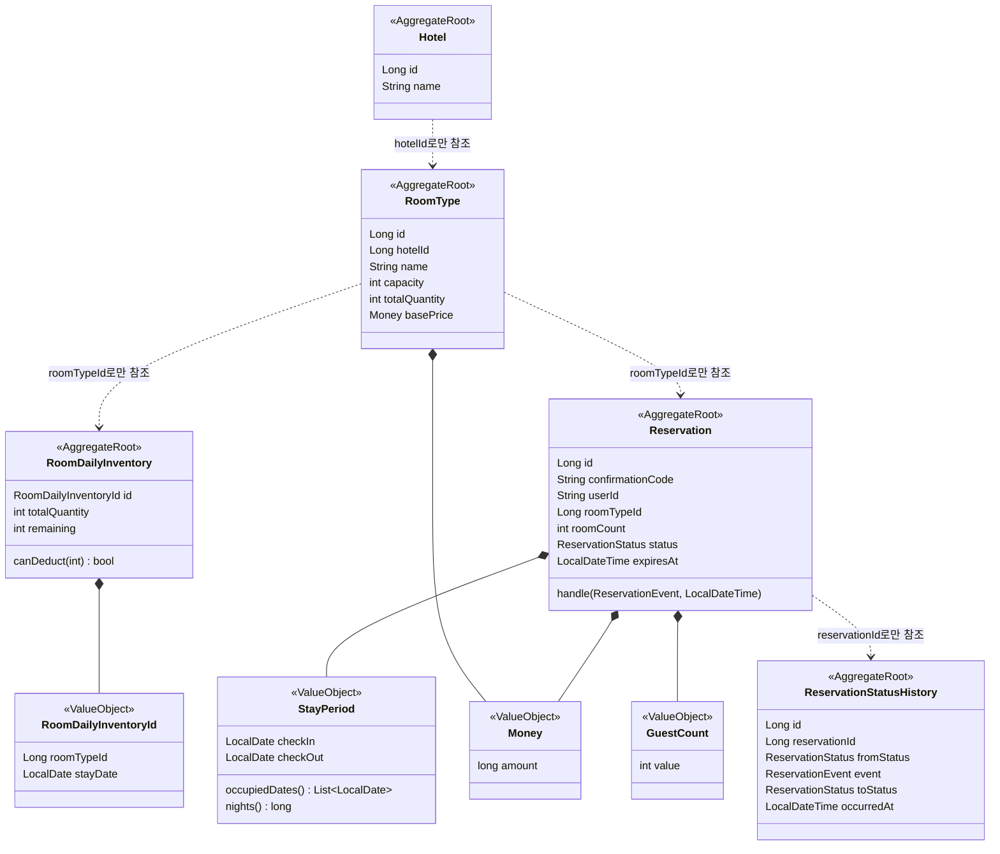
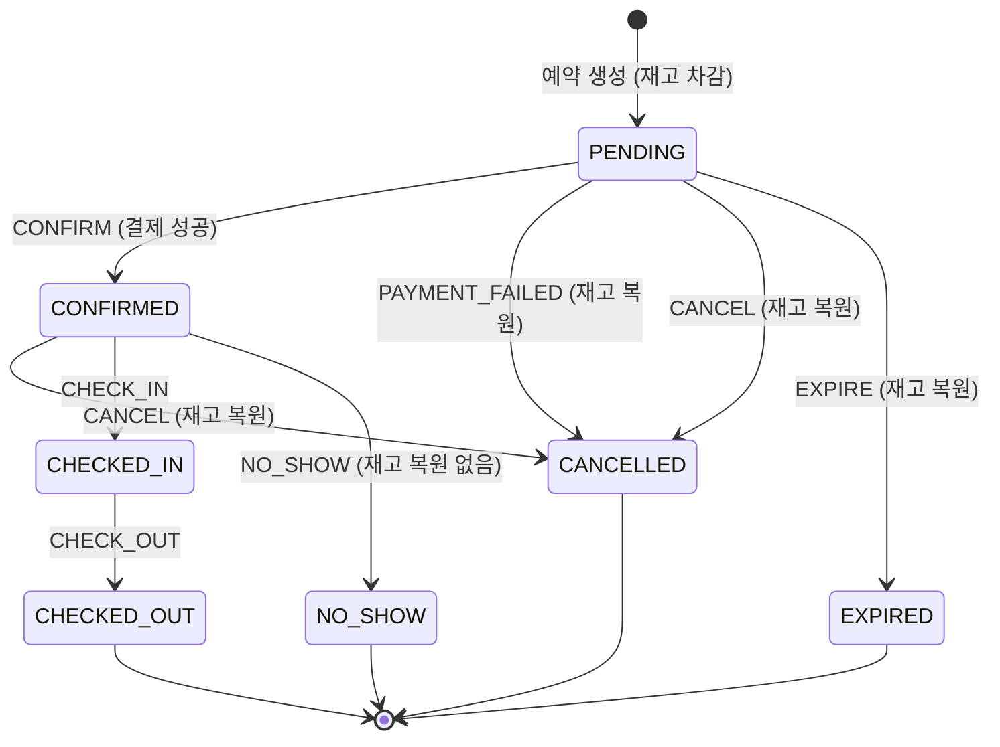
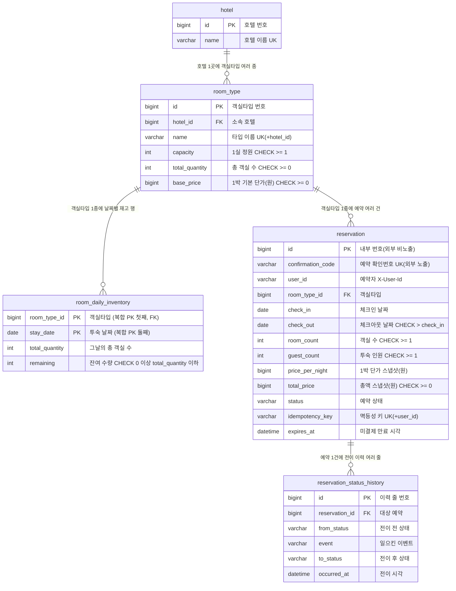
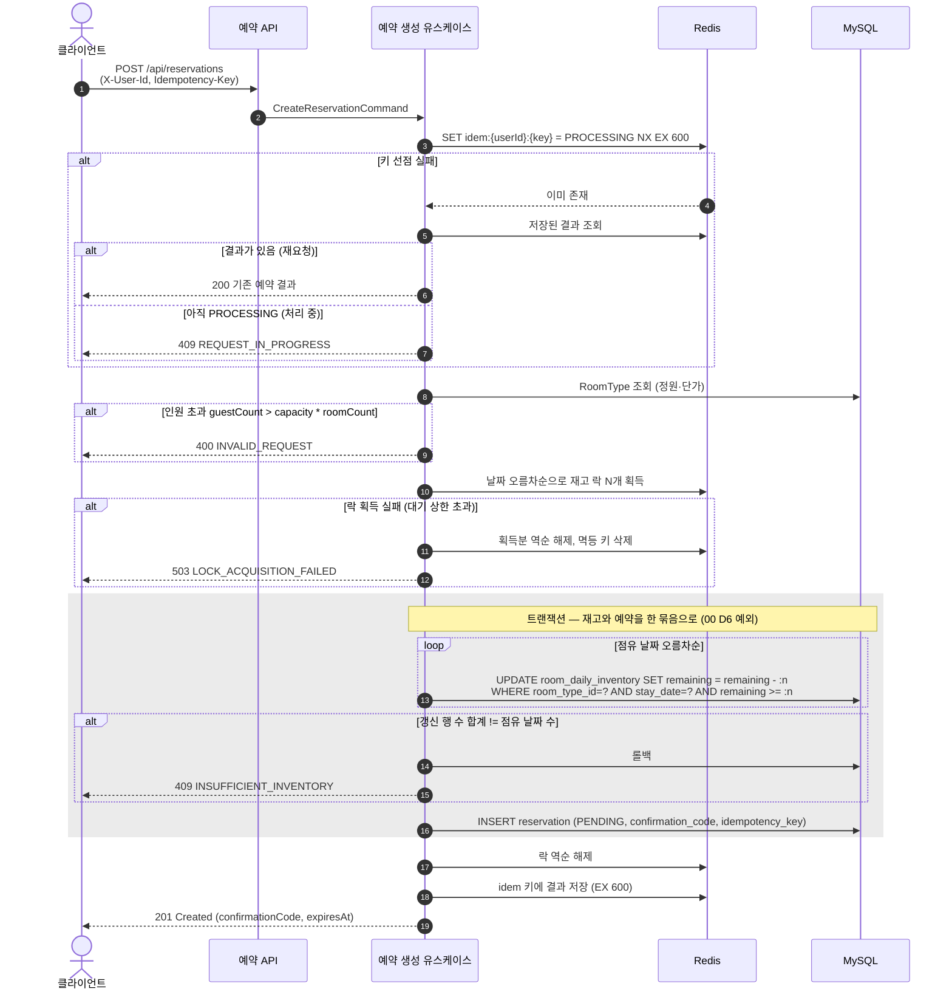
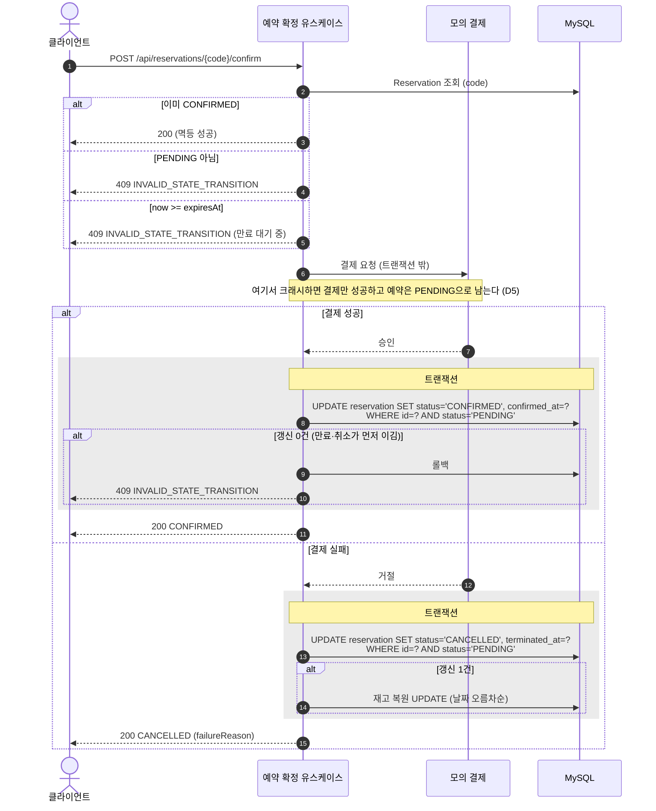
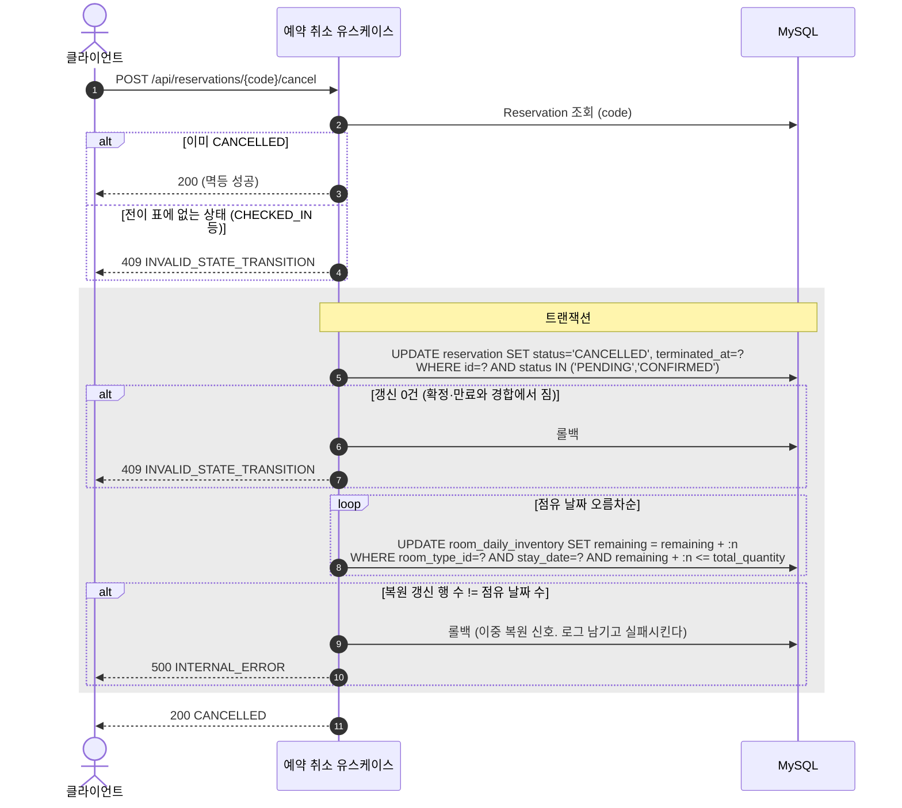
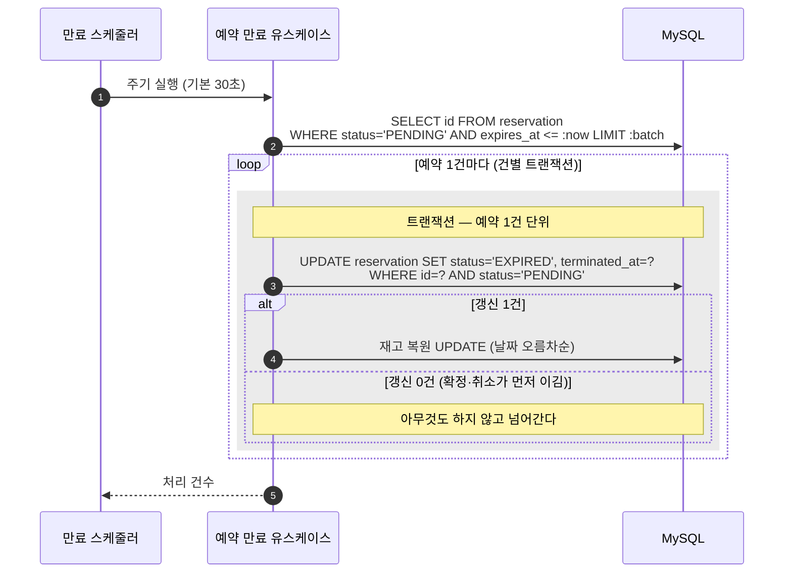
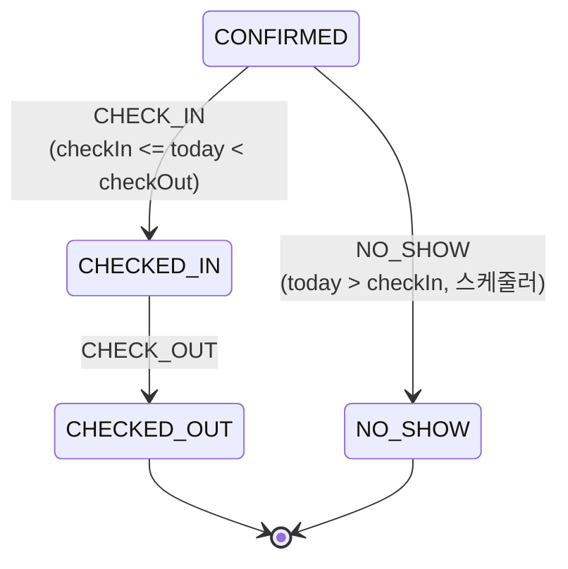

# [F01] 예약 코어

- 상태: 승인 대기
- 작성일: 2026-08-15
- 승인일:

## 1. 무엇을 왜 만드는가

이 feature가 없으면 **같은 객실을 여러 사람이 동시에 예약할 때 무슨 일이 벌어지는가**라는 이 과제의 질문 자체가 성립하지 않는다. 예약을 만들고, 재고를 깎고, 그 예약이 확정·취소·만료로 흘러가는 뼈대가 전부 여기 있다.

세 가지가 겹치는 지점이 이 feature의 어려움이다. 잔여 1실을 두 사람이 같은 순간에 노리는 **동시성**, 결제 버튼을 두 번 누르거나 타임아웃 후 재시도가 도착하는 **멱등성**, 그리고 예약이 여섯 갈래로 흩어지는 **상태 전이**. 이 셋 중 하나라도 새면 팔지 않은 방이 팔리거나, 판 방이 사라지거나, 손님 한 명이 두 개의 예약을 갖게 된다.

F02(선착순 특가)와 F03(가용 객실 검색)은 전부 이 feature가 만든 재고 테이블과 예약 상태 위에 얹힌다. 그래서 F01은 순차로 혼자 만들고, 병합된 뒤에야 나머지가 병렬로 붙는다.

## 2. 범위

**포함하는 것**

| # | 유스케이스 | 이 feature에서 증명할 것 |
|---|---|---|
| UC-2 | 예약 생성 | 멱등성 키, 날짜별 재고 차감의 원자성, 분산락, PENDING 생성 |
| UC-3 | 예약 확정 (내부 모의 결제) | 외부 호출을 트랜잭션 밖으로, 결제 실패 분기, 확정-만료 경합 |
| UC-4 | 예약 취소 | 재고 복원, 취소-확정 경합, 이중 복원 방지 |
| UC-5 | 미결제 만료 (EXPIRE) | 시간 기반 전이, 만료-확정 경합, 재고 복원 |
| UC-6 | 체크인·체크아웃 (+ 노쇼) | 전이 표 완성, 종료 상태 도달 보장 |

공통 스키마(호텔·객실타입)와 시드 데이터, 전역 시각 기준(타임존) 고정도 F01의 몫이다.

**포함하지 않는 것**

| 뺀 것 | 이유 |
|---|---|
| 가용 객실 검색 API | F03 소유(UC-1). 스키마만 F01이 만들고 조회 코드는 만들지 않는다 |
| 선착순 특가 재고 | F02 소유(UC-7). `promotion.**`와 V201~ 대역이 F02 몫이다 |
| 개별 객실 호수 배정 | 00 문서 D3에서 제외 확정. 수량 모델로 간다 |
| 취소 수수료·취소 마감 시각 | 정산·요금 규칙이 딸려 온다. 체크인 전이면 전액 취소 가능으로 단순화한다 (D15) |
| 노쇼 객실의 재판매 | 노쇼는 요금을 받고 방을 잡아둔 것으로 본다. 재고를 되돌리지 않는다 (D15) |
| 요금제(rate plan)·날짜별 가격 | 객실타입당 단일 고정 단가. 00 문서 제외 표에 추가 제안 (D8) |
| 한 예약에 여러 객실타입 묶기 | 한 예약 = 한 객실타입. 주문서 구조로 자리만 남긴다 (D8, D12) |
| 세금·수수료·통화 | 총액 단일 필드. 원 단위 정수 (D8) |
| 확정 후 날짜·객실타입 변경 | 취소 후 재예약으로 갈음 (D8) |
| 결제 원장·정산 배치 | 모의 결제라 실제 돈이 움직이지 않는다. 실 PG였다면 필요하다는 사실만 기록 (D5) |

## 3. 소유 범위

- **소유 패키지:** `com.pms.reservation.**`, `com.pms.inventory.**`
  - 단 `com.pms.inventory.query.**`는 F03 소유다. **만들지 않는다.**
- **읽기만 하는 패키지:** `com.pms.common.**` (예외 계층, 에러 코드, 응답 포맷, Clock 설정)
- **Flyway 번호 대역:** V001 ~ V099 (공통 스키마와 시드 데이터 포함)
- **수정이 필요한 공유 파일:** 두 곳이며, 둘 다 `parallel-work.md`의 공유 파일 절차대로 **이 변경만 담은 작은 커밋을 `main`에 먼저 반영**하고 다른 세션이 rebase로 받아가게 한다.

  | 파일 | 변경 | 근거 |
  |---|---|---|
  | `com.pms.common.config.ClockConfig` | 시스템 기본 존 대신 `Asia/Seoul` 고정 | D2 |
  | `src/main/resources/application.yml` | `pms.reservation.hold-minutes`, `pms.reservation.expire-scan-interval`, `pms.lock.enabled`, `pms.lock.wait-millis`, `pms.lock.ttl-seconds` 추가 | D10, D11, 7.2절의 락 On/Off 실험 |

  `application.yml`의 키는 전부 `pms.` 아래에 새로 추가하는 것이라 기존 설정과 충돌하지 않는다. `pms.lock.enabled`는 F04 부하테스트가 "락 있음/없음"을 비교할 때도 쓰므로 미리 넣어두는 편이 낫다.

  `ErrorCode`는 F01에 필요한 코드가 이미 전부 등록돼 있어 손대지 않는다. 결제 실패를 에러가 아니라 정상 흐름의 결과로 설계했기 때문이다 (UC-3).

F03이 읽게 될 `room_daily_inventory`·`room_type` 테이블과 `com.pms.inventory.domain`은 F01이 만든다. F03은 이 스키마를 읽기 전용으로 쓰고, 조회 전용 코드는 `inventory.query.**`에 둔다.

## 4. 도메인 모델링

### 4.1 컨텍스트 배치



| 구성 요소 | 무엇인가 | 왜 이렇게 두나 |
|---|---|---|
| `Hotel` (호텔) | 숙소 한 곳 | 시드로만 들어오고 바뀌지 않는다. 사실상 조회 필터다 |
| `RoomType` (객실타입) | 스탠다드·디럭스 같은 판매 단위 | 정원(`capacity`)·총 객실 수·기본 단가를 들고 있다. 인원 검증과 가격 스냅샷의 출처다 |
| `RoomDailyInventory` (일별 재고) | 객실타입 하나의 하루치 잔여 수량 | 이 행이 동시성 제어의 대상이다. 기간이 아니라 날짜 단위여야 부분 겹침을 정확히 다룬다 |
| `RoomDailyInventoryId` (재고 행 식별자) | `(객실타입, 날짜)` 복합 식별자 | 이 재고 행을 가리키는 유일한 방법이고 절대 바뀌지 않는다. 대리키를 따로 두지 않는 근거는 D16 |
| `Reservation` (예약) | 예약서 한 장 | 상태 전이의 주인. 재고 객체를 들지 않고 `roomTypeId`만 든다 |
| `StayPeriod` (투숙 기간) | 체크인·체크아웃 날짜 쌍 | "체크아웃이 체크인보다 뒤"라는 규칙과 "점유 날짜 목록" 계산이 살 자리 |
| `GuestCount` (투숙 인원) | 예약 전체의 투숙 인원 수 | 1 이상이라는 규칙과 정원 비교가 살 자리 |
| `Money` (금액) | 원 단위 정수 금액 | 통화·세금을 제외했으므로 `long` 한 필드. 음수 금지 규칙만 담는다 |
| `ReservationStatusHistory` (상태 이력) | 실제로 일어난 전이 한 건의 기록 | 최종 상태만으로는 `CANCELLED`가 `PENDING`에서 왔는지 `CONFIRMED`에서 왔는지 알 수 없다. 전이 표가 실제로 지켜졌음을 DB로 증명하는 자리다 (D19) |

점선 화살표는 **ID 참조**다. JPA 연관관계(`@ManyToOne`, `@OneToMany`)로 매핑하지 않는다. 연관을 타고 나가는 의도치 않은 락과 쿼리가 동시성 실험을 오염시키기 때문이다.

### 4.2 애그리거트

**RoomDailyInventory (일별 재고)**

- **불변식:** `0 <= remaining <= totalQuantity`. 잔여는 음수가 될 수 없고, 총 객실 수를 넘을 수도 없다. 위쪽 경계가 필요한 이유는 **이중 복원**이 아래쪽 경계만큼 위험하기 때문이다. 취소와 만료가 같은 예약에 대해 각각 재고를 되돌리면 팔 수 있는 방보다 많은 방이 생긴다.
- **경계 근거:** 잔여 수량이라는 하나의 숫자를 지키는 규칙만 들어 있다. 다른 날짜의 재고는 서로 독립이라 같은 애그리거트로 묶을 이유가 없다. 3박 예약이 3개의 애그리거트를 건드리는 것은 정상이며, 그래서 락 순서 규칙이 필요해진다.
- **구성:** 엔티티 `RoomDailyInventory`, 식별자 VO `RoomDailyInventoryId(roomTypeId, stayDate)`. 대리키를 두지 않고 자연키를 그대로 PK로 쓴다 (D16).

**Reservation (예약)**

- **불변식:**
  1. 상태는 전이 표에 있는 조합으로만 바뀐다. 표 밖의 전이는 거부한다.
  2. 종료 상태(`CHECKED_OUT`, `CANCELLED`, `EXPIRED`, `NO_SHOW`)에서는 나가지 않는다.
  3. 투숙 기간은 생성 이후 바뀌지 않는다. 확정 후 변경은 범위에서 뺐다.
  4. `guestCount <= roomType.capacity * roomCount`. 생성 시점에 검증하고 이후 바뀌지 않는다.
  5. 단가와 총액은 생성 시점의 스냅샷이며 이후 바뀌지 않는다.
- **경계 근거:** 위 다섯은 전부 예약서 한 장 안에서 판단된다. 재고 잔여는 여기서 판단할 수 없으므로 다른 애그리거트다.
- **구성:** 엔티티 `Reservation`, VO `StayPeriod` / `GuestCount` / `Money`, enum `ReservationStatus` / `ReservationEvent`.

**ReservationStatusHistory (상태 이력)**

- **불변식:** 기록된 행은 수정·삭제되지 않는다. 추가만 있는 테이블이다.
- **경계 근거:** 예약의 불변식에 관여하지 않는 감사 기록이라 `Reservation`과 같은 애그리거트로 묶지 않는다. 묶으면 `@OneToMany`가 필요해지고(금지 항목), 예약을 읽을 때마다 이력이 딸려 나와 뜨거운 경로가 무거워진다. **ID 참조로 떨어뜨리고 별도 리포지토리로 쓴다.**
- **구성:** 엔티티 `ReservationStatusHistory` 단독.

**Hotel, RoomType**

- **불변식:** `RoomType.capacity >= 1`, `RoomType.totalQuantity >= 0`.
- **경계 근거:** 관리자 CRUD를 제외했으므로(00 D1) 시드 이후 변하지 않는 읽기 전용 참조 데이터다. 각각 독립 애그리거트 루트로 두되 수정 유스케이스가 없다.

### 4.3 상태와 전이 표



**허용 전이 상세.** 코드의 전이 테이블은 이 표와 한 줄씩 대응한다.

| 현재 상태 | 이벤트 | 다음 상태 | 조건 | 재고 | 멱등 처리 |
|---|---|---|---|---|---|
| PENDING | CONFIRM | CONFIRMED | 결제 성공. `now < expiresAt` | 변화 없음 | 이미 CONFIRMED면 성공 처리 |
| PENDING | PAYMENT_FAILED | CANCELLED | 결제 거절 응답 | 복원 | 이미 CANCELLED면 성공 처리 |
| PENDING | CANCEL | CANCELLED | 없음 | 복원 | 이미 CANCELLED면 성공 처리 |
| PENDING | EXPIRE | EXPIRED | `now >= expiresAt` | 복원 | 이미 EXPIRED면 성공 처리 |
| CONFIRMED | CANCEL | CANCELLED | 없음 (체크인 전이면 언제든) | 복원 | 이미 CANCELLED면 성공 처리 |
| CONFIRMED | CHECK_IN | CHECKED_IN | `checkIn <= today < checkOut` | 변화 없음 | 이미 CHECKED_IN이면 성공 처리 |
| CONFIRMED | NO_SHOW | NO_SHOW | `today > checkIn` | **복원하지 않음** | 이미 NO_SHOW면 성공 처리 |
| CHECKED_IN | CHECK_OUT | CHECKED_OUT | 없음 | 변화 없음 | 이미 CHECKED_OUT이면 성공 처리 |

**전수 표.** 표의 모든 칸을 채운다. `→X`는 X로 전이, `멱등`은 상태를 바꾸지 않고 성공 응답, `거부`는 `409 INVALID_STATE_TRANSITION`이다.

| 현재 ＼ 이벤트 | CONFIRM | PAYMENT_FAILED | CANCEL | EXPIRE | CHECK_IN | CHECK_OUT | NO_SHOW |
|---|---|---|---|---|---|---|---|
| **PENDING** | →CONFIRMED | →CANCELLED | →CANCELLED | →EXPIRED | 거부 | 거부 | 거부 |
| **CONFIRMED** | 멱등 | 거부 | →CANCELLED | 거부 | →CHECKED_IN | 거부 | →NO_SHOW |
| **CHECKED_IN** | 거부 | 거부 | 거부 | 거부 | 멱등 | →CHECKED_OUT | 거부 |
| **CHECKED_OUT** | 거부 | 거부 | 거부 | 거부 | 거부 | 멱등 | 거부 |
| **CANCELLED** | 거부 | 멱등 | 멱등 | 거부 | 거부 | 거부 | 거부 |
| **EXPIRED** | 거부 | 거부 | 거부 | 멱등 | 거부 | 거부 | 거부 |
| **NO_SHOW** | 거부 | 거부 | 거부 | 거부 | 거부 | 거부 | 멱등 |

읽는 법에 주의할 곳이 셋 있다.

- **`CONFIRMED + EXPIRE = 거부.`** 확정된 예약은 만료되지 않는다. 만료 스케줄러는 `status = 'PENDING'`을 조건으로 건 UPDATE를 쓰므로 애초에 이 조합에 도달하지 않지만, 표에는 거부로 명시해 수동 API로도 뚫리지 않게 한다.
- **`CANCELLED + EXPIRE = 거부.`** 취소된 예약은 이미 재고를 되돌렸다. 여기서 만료를 멱등 성공으로 처리하면 "재고를 또 되돌려도 되는 것처럼" 보이는 코드가 생긴다. 거부해서 이상 신호가 드러나게 둔다.
- **`EXPIRED + CANCEL = 거부.`** 사용자가 만료된 예약을 취소하려 하면 "이미 취소됨"이 아니라 "만료됨"이라고 답해야 한다. 조용히 성공시키면 사용자는 자기 예약이 살아 있었다고 오해한다.

**멱등 전이가 재고를 건드리지 않는다는 것이 핵심이다.** 상태를 실제로 바꾼 요청만 재고를 복원한다. 구현에서는 조건부 UPDATE의 갱신 행 수가 1일 때만 복원 로직을 태운다 (7.2절).

### 4.4 애그리거트 간 관계

| 들고 있는 쪽 | 들고 있는 ID | 왜 객체가 아니라 ID인가 |
|---|---|---|
| `RoomType` | `hotelId` | 호텔은 조회 필터일 뿐, 객실타입의 불변식에 관여하지 않는다 |
| `RoomDailyInventory` | `roomTypeId` | 재고 행은 자기 잔여 수량만 책임진다 |
| `Reservation` | `roomTypeId` | 예약이 재고 객체를 들면 JPA 연관을 타고 락이 번진다. 정원·단가는 생성 시 값으로 복사해 스냅샷으로 보관한다 |

## 5. DB 설계

### 5.1 ERD



### 5.2 테이블

**`hotel`** — 호텔

| 컬럼 | 타입 | 제약 | 설명 |
|---|---|---|---|
| `id` | BIGINT | PK, AUTO_INCREMENT | |
| `name` | VARCHAR(100) | NOT NULL, UK | 호텔 이름 |
| `address` | VARCHAR(255) | NOT NULL | 표시용. 검색 조건이 아니다 |
| `created_at` | DATETIME(6) | NOT NULL | |

**`room_type`** — 객실타입

| 컬럼 | 타입 | 제약 | 설명 |
|---|---|---|---|
| `id` | BIGINT | PK, AUTO_INCREMENT | |
| `hotel_id` | BIGINT | NOT NULL, FK → `hotel(id)` | 소속 호텔 |
| `name` | VARCHAR(100) | NOT NULL, UK(`hotel_id`, `name`) | 스탠다드, 디럭스 등 |
| `capacity` | INT | NOT NULL, CHECK `capacity >= 1` | 1실 정원. 인원 검증의 기준 |
| `total_quantity` | INT | NOT NULL, CHECK `total_quantity >= 0` | 총 객실 수. 재고 행 생성의 기준값 |
| `base_price` | BIGINT | NOT NULL, CHECK `base_price >= 0` | 1박 기본 단가. 원 단위 정수 |
| `created_at` | DATETIME(6) | NOT NULL | |

**`room_daily_inventory`** — 일별 재고. **동시성 제어의 대상 테이블이다.**

| 컬럼 | 타입 | 제약 | 설명 |
|---|---|---|---|
| `room_type_id` | BIGINT | **PK(1/2)**, NOT NULL, FK → `room_type(id)` | 복합 PK의 첫 컬럼 |
| `stay_date` | DATE | **PK(2/2)**, NOT NULL | 투숙 날짜. 체크아웃 당일은 점유하지 않는다 |
| `total_quantity` | INT | NOT NULL, CHECK `total_quantity >= 0` | 그날 판매 가능한 총 객실 수 |
| `remaining` | INT | NOT NULL, CHECK `remaining >= 0`, CHECK `remaining <= total_quantity` | 잔여 수량 |
| `created_at` | DATETIME(6) | NOT NULL | |
| `updated_at` | DATETIME(6) | NOT NULL | |

**이 테이블만 대리키(auto-increment `id`)를 두지 않고 자연키 `(room_type_id, stay_date)`를 그대로 PK로 쓴다.** 근거는 D16이다.

`total_quantity`를 `room_type`에서 조인해 오지 않고 재고 행에 복사해 두는 이유는 두 가지다. 첫째, `remaining <= total_quantity` CHECK 제약이 같은 행 안에서만 표현 가능하다. 둘째, 날짜별로 판매 가능 수량이 달라지는 상황(객실 정비, 오버부킹 정책)이 오면 이 컬럼만 바꾸면 된다.

**`reservation`** — 예약

| 컬럼 | 타입 | 제약 | 설명 |
|---|---|---|---|
| `id` | BIGINT | PK, AUTO_INCREMENT | 내부 식별자. API에 노출하지 않는다 |
| `confirmation_code` | CHAR(12) | NOT NULL, UK | 외부 노출용 예약 확인번호 |
| `user_id` | VARCHAR(64) | NOT NULL | `X-User-Id` 헤더 값 |
| `room_type_id` | BIGINT | NOT NULL, FK → `room_type(id)` | |
| `check_in` | DATE | NOT NULL | |
| `check_out` | DATE | NOT NULL, CHECK `check_out > check_in` | |
| `room_count` | INT | NOT NULL, CHECK `room_count >= 1` | 예약한 객실 수 |
| `guest_count` | INT | NOT NULL, CHECK `guest_count >= 1` | 투숙 인원 합계 |
| `price_per_night` | BIGINT | NOT NULL, CHECK `price_per_night >= 0` | 생성 시점 1박 단가 스냅샷 |
| `total_price` | BIGINT | NOT NULL, CHECK `total_price >= 0` | 총액 스냅샷 |
| `status` | VARCHAR(20) | NOT NULL | `ReservationStatus` 문자열 |
| `idempotency_key` | VARCHAR(128) | NOT NULL, UK(`user_id`, `idempotency_key`) | 생성 요청의 멱등성 키 |
| `expires_at` | DATETIME(6) | NOT NULL | 미결제 만료 시각 |
| `confirmed_at` | DATETIME(6) | NULL | 확정 시각. 없으면 확정된 적 없음 |
| `terminated_at` | DATETIME(6) | NULL | 종료 상태 도달 시각(취소·만료·노쇼·체크아웃) |
| `created_at` | DATETIME(6) | NOT NULL | |
| `updated_at` | DATETIME(6) | NOT NULL | |

**`reservation_status_history`** — 상태 전이 이력. **추가만 하고 수정·삭제하지 않는다.**

| 컬럼 | 타입 | 제약 | 설명 |
|---|---|---|---|
| `id` | BIGINT | PK, AUTO_INCREMENT | 순번이 곧 전이 순서다 |
| `reservation_id` | BIGINT | NOT NULL, FK → `reservation(id)` | 대상 예약 |
| `from_status` | VARCHAR(20) | NOT NULL | 전이 전 상태 |
| `event` | VARCHAR(20) | NOT NULL | 전이를 일으킨 이벤트 |
| `to_status` | VARCHAR(20) | NOT NULL | 전이 후 상태 |
| `occurred_at` | DATETIME(6) | NOT NULL | 전이 시각. 유스케이스가 읽은 `now`와 같은 값 |

**기록하는 것은 실제로 일어난 전이뿐이다.** 예약 생성(`→ PENDING`)은 이력에 넣지 않는다. 초기 상태가 항상 `PENDING`인 것은 불변이라 `reservation.created_at`으로 충분하고, 이력 테이블을 전이 표와 **정확히 1:1로** 유지하는 편이 읽기 쉽다. 거부된 전이 시도를 기록하지 않는 이유는 D19에 적었다.

`status`를 ENUM 타입이 아니라 VARCHAR로 두는 이유는, MySQL ENUM에 값을 추가하려면 테이블을 변경해야 하고 순서에 의존하는 함정이 있기 때문이다. 상태 목록의 진실은 코드의 전이 테이블이며 DB는 문자열로 보관한다.

### 5.3 인덱스와 제약

| 이름 | 대상 컬럼 | 종류 | 근거 |
|---|---|---|---|
| `uk_hotel_name` | `hotel(name)` | UNIQUE | 시드 재적용 시 중복 삽입 방지 |
| `uk_room_type_hotel_name` | `room_type(hotel_id, name)` | UNIQUE | 같은 호텔에 같은 이름의 타입이 둘일 수 없다 |
| `PRIMARY` | `room_daily_inventory(room_type_id, stay_date)` | 복합 PK (클러스터드) | **재고 차감·복원 조건부 UPDATE가 정확히 한 행을 지정하는 경로이자 유일성 보장.** 클러스터드 인덱스라 세컨더리 인덱스를 거치지 않고 바로 행에 도달하고, 잠기는 인덱스 레코드가 하나뿐이다. F03의 `(객실타입, 날짜 범위)` 조회도 이 인덱스 하나로 커버된다 (D16) |
| `uk_reservation_code` | `reservation(confirmation_code)` | UNIQUE | 조회·상태 전이 API의 진입 경로. 중복 코드 생성 방지 |
| `uk_reservation_idempotency` | `reservation(user_id, idempotency_key)` | UNIQUE | **멱등성의 최후 방어선.** Redis가 죽어도 같은 키로 두 건이 저장되지 않는다 |
| `idx_reservation_expire` | `reservation(status, expires_at)` | 일반 | 만료 스케줄러의 `WHERE status = 'PENDING' AND expires_at <= ?` |
| `idx_reservation_noshow` | `reservation(status, check_in)` | 일반 | 노쇼 스케줄러의 `WHERE status = 'CONFIRMED' AND check_in < ?` |
| `idx_history_reservation` | `reservation_status_history(reservation_id, id)` | 일반 | 예약 하나의 전이 이력을 순서대로 읽는 유일한 조회 경로. 동시성 테스트와 F04 부하 검증이 "복원이 정확히 한 번"을 이 조회로 확인한다 |

PK를 빼면 추가한 인덱스는 위 일곱 개뿐이다. 예약 목록 조회 API를 범위에 넣지 않았으므로 `(user_id, created_at)` 인덱스는 만들지 않는다. 근거 없는 인덱스는 쓰기 비용만 늘린다.

**불변식을 지키는 제약 (최후 방어선).** 애플리케이션 로직이 전부 뚫려도 아래가 막는다.

| 제약 | 막는 것 | 뚫렸을 때 벌어지는 일 |
|---|---|---|
| `CHECK remaining >= 0` | 초과 판매 | 없는 방이 팔린다 |
| `CHECK remaining <= total_quantity` | **이중 복원** | 취소와 만료가 같은 예약의 재고를 각각 되돌려 팔 수 있는 방이 늘어난다. 이건 조용히 진행돼서 아무도 모른다 |
| `CHECK room_count >= 1` | 음수·0 객실 수 요청 | `room_count = -5`면 차감 UPDATE의 `remaining >= :count` 조건을 통과하면서 재고를 **늘린다** |
| `CHECK check_out > check_in` | 뒤집힌 기간 | 점유 날짜 목록이 비어 재고를 하나도 안 깎고 예약이 생긴다 |
| `CHECK guest_count >= 1` | 인원 0명 예약 | 정원 검증이 무의미해진다 |
| `UNIQUE (user_id, idempotency_key)` | 중복 예약 | Redis 장애 시 재시도가 두 건의 예약이 된다 |
| `PRIMARY KEY (room_type_id, stay_date)` | 재고 행 분열 | 같은 (타입, 날짜) 행이 둘 생겨 잔여 수량의 진실이 두 곳이 된다 |

`room_count >= 1`과 `check_out > check_in`은 도메인 VO 생성자에서도 검증한다. **같은 규칙을 두 곳에서 검증하는 것은 중복이 아니라 방어선이다.** VO는 정상 경로를 빠르게 막고, CHECK는 SQL이 직접 실행되는 경로(마이그레이션, 수동 조작, 벌크 UPDATE)를 막는다.

### 5.4 마이그레이션 파일

| 파일 | 내용 |
|---|---|
| `V001__공통_스키마.sql` | `hotel`, `room_type` 생성 |
| `V002__재고_스키마.sql` | `room_daily_inventory` 생성 |
| `V003__예약_스키마.sql` | `reservation` 생성 |
| `V004__예약_상태_이력_스키마.sql` | `reservation_status_history` 생성 |
| `V051__시드_호텔_객실타입.sql` | 호텔 2곳, 객실타입 5종 (값은 5.5절) |
| `V052__시드_일별_재고.sql` | **고정 날짜** `2026-08-01` ~ `2026-10-29` 90일치 재고 450행을 재귀 CTE로 생성 |

시드의 구체적인 값은 다음 절(5.5 시드 데이터 계약)에 숫자로 박아둔다. **통합·동시성 테스트는 이 시드에 의존하지 않는다.** 각 테스트가 자기 데이터를 직접 넣고 지운다 (`tdd.md`: 테스트 간 데이터 격리는 각 테스트가 책임진다). 시드는 로컬 실행과 k6 부하테스트를 위한 것이다.

### 5.5 시드 데이터 계약

**이 절은 F02·F03·F04가 이 문서만 보고 맞출 수 있어야 한다.** 세션마다 다른 날짜나 id를 가정하면 통합 시점에 **조용히 실패한다.** 재고 행이 없는 날짜를 예약하면 응답이 `409 INSUFFICIENT_INVENTORY`인데, 이건 "매진"과 구분되지 않아 정상 동작처럼 보인다. 부하테스트가 성공 0건을 받고 나서야 뭔가 잘못됐음을 알게 된다. 그래서 값을 여기 숫자로 고정한다.

**(1) 재고 날짜 범위 — `CURDATE()`가 아니라 고정 날짜다**

```
2026-08-01 ~ 2026-10-29  (90일, 양끝 포함)
```

`CURDATE()` 기준으로 만들면 **마이그레이션을 실행한 날에 따라 범위가 움직인다.** Flyway는 한 번만 실행되므로 실행일로부터 90일이 지나면 재고가 없는 날짜가 생기고, 세 세션이 각자 다른 "오늘"을 가정하면 어긋난다. 고정 날짜면 문서만 보고 같은 값을 쓴다.

**범위가 오늘(2026-08-15)을 안에 포함하도록 잡았다.** 이게 미래에서만 시작하면 `checkIn <= today < checkOut`이 조건인 **체크인과 노쇼를 시연할 수 없다.** UC-6이 통째로 검증 불가가 된다.

| 쓰임 | 권장 날짜 |
|---|---|
| 일반 예약(생성·확정·취소·만료) | 범위 안 아무 날짜. 예: `2026-09-01` ~ `2026-09-04` |
| **체크인** 시연·테스트 | `checkIn = 2026-08-15`(오늘), `checkOut = 2026-08-17` |
| **노쇼** 시연·테스트 | `checkIn = 2026-08-14`, `checkOut = 2026-08-16` |
| 재고 없음(409) 확인 | `2026-10-30` 이후 |

과거 날짜 예약을 막는 규칙은 두지 않았다. `checkIn >= today` 검증은 범위에 없다. 부하테스트가 과거 날짜를 자유롭게 쓸 수 있고, 그게 재고 문제와 무관하기 때문이다.

**(2) 호텔 — `V051`**

| id | name | address |
|---|---|---|
| 1 | 서울 그랜드 호텔 | 서울특별시 중구 을지로 100 |
| 2 | 부산 오션뷰 호텔 | 부산광역시 해운대구 해운대해변로 200 |

**(3) 객실타입 — `V051`**

| id | hotel_id | name | capacity | total_quantity | base_price |
|---|---|---|---|---|---|
| 1 | 1 | 스탠다드 | 2 | 100 | 150000 |
| 2 | 1 | 디럭스 | 3 | 50 | 250000 |
| **3** | 1 | **스위트** | 4 | **10** | 600000 |
| 4 | 2 | 오션뷰 스탠다드 | 2 | 80 | 180000 |
| 5 | 2 | 오션뷰 스위트 | 4 | 20 | 450000 |

**`id = 3`(스위트, 10실)이 경합 실험용이다.** 부하테스트에서 "잔여 10에 수백 명이 몰린다"를 만들려면 이런 객실타입이 시드에 있어야 한다. 재고가 전부 넉넉하면 경합이 일어나지 않아 아무것도 증명하지 못한다. `id = 5`(20실)는 보조 경합 대상이다.

`capacity`는 정원 검증(`guestCount ≤ capacity × roomCount`)의 기준이다. 스탠다드 1실이면 최대 2명이고, 3명을 넣으면 400이 떨어진다.

**(4) 재고 행의 초기 `remaining` — 전부 `total_quantity`와 같다**

일부러 줄여둔 날짜는 **하나도 없다.** 시드는 "판매 시작 전" 상태여야 부하테스트가 매번 같은 출발선에서 시작한다. 특정 날짜만 줄여두면 "왜 이 날짜만 다른가"가 문서에 없는 암묵 지식이 되고, 부하 결과를 해석할 때 그 지식을 모르는 사람은 틀린 결론을 낸다. 특정 날짜의 재고를 줄이고 싶으면 시드가 아니라 **테스트가 직접 UPDATE**한다.

행 수는 5종 × 90일 = **450행**이다.

**(5) 재시드 방법 — 부하테스트를 반복하려면 필요하다**

부하테스트를 한 번 돌리면 재고가 소진된다. 되돌리는 방법은 하나다.

```bash
docker compose down -v && docker compose up -d   # 볼륨까지 지운다
./gradlew bootRun                                 # Flyway가 처음부터 다시 적용된다
```

**날짜를 고정했기 때문에 몇 번을 돌려도 정확히 같은 상태가 나온다.** `CURDATE()` 기반이었다면 재시드할 때마다 날짜 범위가 움직여 k6 스크립트가 어느 날 갑자기 깨진다. 이것이 고정 날짜의 두 번째 이득이다.

**(6) `X-User-Id` 규약**

사용자 테이블이 없다(ADR-0006). `VARCHAR(64)` 안에 들어가고 비어 있지 않으면 **어떤 값이든 받는다.** 별도 검증도 조회도 하지 않는다.

| 쓰임 | 권장 형식 | 예 |
|---|---|---|
| k6 부하테스트 | `user-{VU번호}` | `user-1` ~ `user-200` |
| 통합 테스트 | `test-{시나리오}-{n}` | `test-cancel-01` |

**주의: 같은 예약을 다루는 요청은 같은 값을 써야 한다.** 취소는 소유자를 검증하고, 남의 예약이면 403이 아니라 **404**를 돌려준다(확인번호의 존재 자체를 알려주지 않기 위해서다). VU 번호가 요청마다 바뀌면 취소가 전부 404가 되는데, 이건 "예약이 없다"로 읽혀서 원인을 찾기 어렵다.

멱등성 키도 `(userId, idempotencyKey)` 조합으로 저장하므로, **서로 다른 VU가 같은 멱등성 키 문자열을 써도 서로 간섭하지 않는다.**

## 6. 유스케이스

### UC-2. 예약 생성

**입력** — 주문서 형태의 커맨드다. 쿠폰이 붙을 자리를 여기 남긴다 (00 D5, D12).

| 항목 | 출처 | 설명 |
|---|---|---|
| `userId` | `X-User-Id` 헤더 | 예약자 |
| `idempotencyKey` | `Idempotency-Key` 헤더 | 클라이언트가 만든다 |
| `roomTypeId` | 본문 | 주문 항목의 상품 |
| `stayPeriod` | 본문 (`checkIn`, `checkOut`) | 주문 항목의 기간 |
| `roomCount` | 본문 | 주문 항목의 수량 |
| `guestCount` | 본문 | 투숙 인원 |

**출력**

`confirmationCode`, `status`(항상 `PENDING`), `roomTypeId`, `checkIn`, `checkOut`, `roomCount`, `guestCount`, `pricePerNight`, `totalPrice`, `expiresAt`.

**도메인 모델의 변화**

| 순서 | 대상 | 변화 |
|---|---|---|
| 1 | (Redis) 멱등성 키 | `SET NX` 로 `PROCESSING` 선점. 실패하면 아래로 가지 않는다 |
| 2 | (Redis) 재고 분산락 | 점유 날짜 수만큼 락 획득. **날짜 오름차순** |
| 3 | `RoomType` | 조회만. `capacity`로 인원 검증, `basePrice`를 단가 스냅샷으로 복사 |
| 4 | `RoomDailyInventory` (N일치 행) | 각 행의 `remaining`이 `roomCount`만큼 **감소**. 한 행이라도 실패하면 전부 롤백 |
| 5 | `Reservation` | `PENDING` 상태로 **새로 생성**. `expiresAt = now + 보류시간`, `confirmationCode` 발급, `pricePerNight`·`totalPrice` 확정 |
| 6 | (Redis) 재고 분산락 | 커밋 뒤 **획득 역순**으로 해제 |
| 7 | (Redis) 멱등성 키 | 결과(확인번호)를 저장하고 TTL 갱신 |

가격은 `totalPrice = pricePerNight * nights * roomCount`로 계산한다. 이 계산은 유스케이스가 아니라 도메인 서비스 `ReservationPricing`이 한다. 쿠폰이 들어오면 이 서비스에 할인 계산을 더하는 것만으로 끝나게 하기 위해서다 (D12).

**흐름**



**실패 시나리오**

| 상황 | 응답 | 부작용 처리 |
|---|---|---|
| 같은 멱등성 키로 재요청, 이전 결과 있음 | 200 + 저장된 결과 | 없음. 새 예약을 만들지 않는다 |
| 같은 멱등성 키로 재요청, 아직 처리 중 | 409 `REQUEST_IN_PROGRESS` | 없음 |
| `guestCount > capacity * roomCount` | 400 `INVALID_REQUEST` | 멱등성 키를 **삭제**한다. 잘못된 입력은 고쳐서 다시 보내는 것이 정상이다 |
| `roomCount < 1` 또는 `checkOut <= checkIn` | 400 `INVALID_REQUEST` | 위와 같다 |
| 존재하지 않는 `roomTypeId` | 404 `RESOURCE_NOT_FOUND` | 멱등성 키 삭제 |
| 재고 행이 없는 날짜 (시드 범위 밖, `2026-10-30` 이후) | 409 `INSUFFICIENT_INVENTORY` | 트랜잭션 롤백. 갱신 행 수가 모자란 것으로 같이 잡힌다 |
| 어느 하루라도 잔여 부족 | 409 `INSUFFICIENT_INVENTORY` | **트랜잭션 롤백으로 앞 날짜 차감분도 되돌아간다.** 부분 차감이 남지 않는다 |
| 락 획득 대기 상한 초과 | 503 `LOCK_ACQUISITION_FAILED` | 획득한 락 역순 해제, 멱등성 키 삭제 |
| DB UK 위반 (Redis 장애로 멱등 키가 뚫림) | 200 + 기존 예약 결과 | UK 위반을 잡아 기존 예약을 조회해 돌려준다. 500으로 던지지 않는다 |

**"재고 행이 없는 날짜"에 대한 주의.** 시드 범위(`2026-08-01` ~ `2026-10-29`, 5.5절) 밖 날짜는 "아직 판매를 열지 않은 것"과 "매진"이 구분되지 않고 둘 다 재고 부족으로 응답한다. 판매 여부를 별도 컬럼으로 관리하는 것은 범위에서 뺐다. 잘못 파는 것보다 안 파는 쪽이 안전하므로 이 방향의 실패는 허용한다.

**이 구분 불가가 병렬 세션에서 지뢰가 된다.** 다른 feature가 시드 범위 밖 날짜를 가정하면 예약이 전부 409로 떨어지는데, 응답만 봐서는 매진과 똑같아 보여서 원인을 찾는 데 오래 걸린다. 그래서 날짜를 5.5절에 고정 값으로 박았다.

### UC-3. 예약 확정 (내부 모의 결제)

**입력:** `X-User-Id`, `confirmationCode`.
**출력:** `confirmationCode`, `status`(`CONFIRMED` 또는 `CANCELLED`), `confirmedAt`, 결제 실패 시 `failureReason`.

**도메인 모델의 변화 (결제 성공)**

| 순서 | 대상 | 변화 |
|---|---|---|
| 1 | `Reservation` | 조회만. `PENDING`이고 `now < expiresAt`인지 확인 |
| 2 | (외부) 모의 결제 | **트랜잭션 밖에서** 호출 |
| 3 | `Reservation` | `status`가 `PENDING → CONFIRMED`, `confirmedAt` 기록 |
| 4 | `ReservationStatusHistory` | `(PENDING, CONFIRM, CONFIRMED)` 한 줄 **추가**. 3의 갱신 행 수가 1일 때만 |
| — | `RoomDailyInventory` | **변화 없음.** 재고는 생성 시점에 이미 확보했다 |

**도메인 모델의 변화 (결제 실패)**

| 순서 | 대상 | 변화 |
|---|---|---|
| 1~2 | 위와 같음 | 모의 결제가 거절 응답 |
| 3 | `Reservation` | `status`가 `PENDING → CANCELLED`, `terminatedAt` 기록 |
| 4 | `ReservationStatusHistory` | `(PENDING, PAYMENT_FAILED, CANCELLED)` 한 줄 **추가** |
| 5 | `RoomDailyInventory` (N일치 행) | 각 행의 `remaining`이 `roomCount`만큼 **증가**. 3의 조건부 UPDATE가 1건일 때만 |

**흐름**



**실패 시나리오**

| 상황 | 응답 | 부작용 처리 |
|---|---|---|
| 존재하지 않는 확인번호 | 404 `RESOURCE_NOT_FOUND` | 없음 |
| 이미 `CONFIRMED` | 200 (멱등 성공) | 없음. 결제를 다시 호출하지 않는다 |
| `CANCELLED`·`EXPIRED` 상태 | 409 `INVALID_STATE_TRANSITION` | 결제를 호출하지 않는다 |
| `now >= expiresAt`인 `PENDING` | 409 `INVALID_STATE_TRANSITION` | 결제를 호출하지 않는다. 스케줄러가 아직 안 돌았을 뿐 이미 만료된 예약이다 |
| 결제 거절 | 200 + `status: CANCELLED` | 재고 복원. **에러가 아니라 정상 흐름의 결과다** |
| 결제 승인 후 조건부 UPDATE 0건 | 409 `INVALID_STATE_TRANSITION` | 만료·취소가 먼저 이겼다. **결제 취소(환불)를 호출해 보상한다** |

**결제 실패를 200으로 돌려주는 이유.** 결제 거절은 서버 오류도 클라이언트 오류도 아니다. 요청은 정상적으로 처리됐고 그 결과가 "취소"일 뿐이다. `4xx`로 돌려주면 클라이언트가 재시도해야 할 실패로 오해한다. 이 선택 덕분에 `ErrorCode`에 `PAYMENT_FAILED`를 추가할 필요가 없어 공유 파일을 건드리지 않는다.

**보상할 수 없는 틈 (D5).** 위 시퀀스의 2번과 3번 사이에서 프로세스가 죽으면 **결제는 성공했는데 예약은 `PENDING`으로 남는다.** 그 예약은 만료 스케줄러가 `EXPIRED`로 옮기고 재고를 되돌리지만, 결제된 돈은 아무도 되돌리지 않는다. 우리 쪽에 결제 기록이 없기 때문이다.

이 틈은 이번 구현에서 닫지 않는다. 닫으려면 결제 요청 **전에** 결제 시도를 원장에 기록하고(트랜잭션 1), 결제 후 결과를 기록하고(트랜잭션 2), 원장과 PG를 대조하는 정산 배치가 필요하다. 모의 결제라 실제로 잃는 돈이 없고, 이 구조를 만드는 비용이 이 과제의 증명 대상(동시성·멱등성·상태 전이)을 넘어선다. **실 PG를 붙인다면 반드시 필요하다는 사실을 여기 기록해 둔다.**

### UC-4. 예약 취소

**입력:** `X-User-Id`, `confirmationCode`.
**출력:** `confirmationCode`, `status`(`CANCELLED`), `terminatedAt`.

**도메인 모델의 변화**

| 순서 | 대상 | 변화 |
|---|---|---|
| 1 | `Reservation` | 조회만. 소유자 확인(`userId` 일치) |
| 2 | `Reservation` | `status`가 `PENDING` 또는 `CONFIRMED` → `CANCELLED`, `terminatedAt` 기록 |
| 3 | `ReservationStatusHistory` | `(직전 상태, CANCEL, CANCELLED)` 한 줄 **추가** |
| 4 | `RoomDailyInventory` (N일치 행) | 각 행의 `remaining`이 `roomCount`만큼 **증가**. **2의 갱신 행 수가 1일 때만** |

**흐름**



**실패 시나리오**

| 상황 | 응답 | 부작용 처리 |
|---|---|---|
| 존재하지 않는 확인번호 | 404 `RESOURCE_NOT_FOUND` | 없음 |
| 다른 사용자의 예약 | 404 `RESOURCE_NOT_FOUND` | **403이 아니라 404다.** 남의 확인번호가 존재한다는 사실 자체를 알려주지 않는다 |
| 이미 `CANCELLED` | 200 (멱등 성공) | **재고를 복원하지 않는다.** 조건부 UPDATE가 0건이므로 복원 루프에 들어가지 않는다 |
| `EXPIRED` 상태 | 409 `INVALID_STATE_TRANSITION` | 없음. "이미 취소됨"이 아니라 "만료됨"이라고 답한다 |
| `CHECKED_IN`·`CHECKED_OUT`·`NO_SHOW` | 409 `INVALID_STATE_TRANSITION` | 없음 |
| 확정 요청과 동시 도착 | 둘 중 하나만 200, 다른 하나는 409 | 조건부 UPDATE가 승자를 정한다 |
| 복원 UPDATE가 CHECK에 걸림 | 500 `INTERNAL_ERROR` | 롤백. **이중 복원이 발생했다는 뜻이므로 조용히 넘기지 않는다.** 로그를 남긴다 |

### UC-5. 미결제 만료 (EXPIRE)

`PENDING` 상태로 `expiresAt`을 넘긴 예약을 `EXPIRED`로 옮기고 재고를 되돌린다.

**입력:** 없음(스케줄러가 주기적으로 실행). 테스트·부하테스트를 위해 수동 트리거 API도 둔다.
**출력:** 처리 건수.

**도메인 모델의 변화** — 대상 예약 각각에 대해

| 순서 | 대상 | 변화 |
|---|---|---|
| 1 | `Reservation` | `status`가 `PENDING → EXPIRED`, `terminatedAt` 기록 |
| 2 | `ReservationStatusHistory` | `(PENDING, EXPIRE, EXPIRED)` 한 줄 **추가** |
| 3 | `RoomDailyInventory` (N일치 행) | `remaining`이 `roomCount`만큼 증가. **1의 갱신 행 수가 1일 때만** |

**흐름**



**건별 트랜잭션으로 나누는 이유.** 한 배치를 통째로 한 트랜잭션에 넣으면 예약 하나가 실패할 때 나머지가 전부 되돌아가고, 트랜잭션이 길어지는 동안 재고 행에 락이 오래 남는다. 동시성이 주제인 시스템에서 스케줄러가 락을 오래 쥐는 것은 그 자체로 사고다.

**실패 시나리오**

| 상황 | 응답 | 부작용 처리 |
|---|---|---|
| 확정과 만료가 동시 도착 | 조건부 UPDATE가 승자를 정한다 | 만료가 지면 재고를 되돌리지 않고 넘어간다 |
| 취소와 만료가 동시 도착 | 위와 같다 | 복원은 정확히 한 번만 일어난다 |
| 배치 중 한 건이 예외 | 그 건만 롤백, 나머지는 계속 | 예외를 로그로 남긴다. 삼키지 않는다 |
| 스케줄러가 멈춤 | 만료가 지연될 뿐 데이터는 안전 | 확정 유스케이스가 `now >= expiresAt`을 스스로 검사해 거부한다 (UC-3). **스케줄러는 재고 회수 담당이지 정합성 담당이 아니다** |

### UC-6. 체크인·체크아웃 (+ 노쇼)

**체크인**

- 입력: `confirmationCode`. 출력: `status`(`CHECKED_IN`).
- 조건: `CONFIRMED` 상태이고 `checkIn <= today < checkOut`.
- 모델 변화: `Reservation.status`만 바뀐다. 재고는 그대로다. 이미 팔린 밤이기 때문이다.

`today < checkOut` 상한을 두는 이유는, 상한이 없으면 **체크아웃 날짜가 지난 예약도 체크인할 수 있기 때문**이다. 노쇼 스케줄러가 멈춘 사이에도 이 조건이 막는다. 스케줄러가 정합성을 책임지지 않는다는 원칙(UC-5)과 같은 구조다.

**체크아웃**

- 입력: `confirmationCode`. 출력: `status`(`CHECKED_OUT`).
- 조건: `CHECKED_IN` 상태. 날짜 조건은 두지 않는다. 조기 체크아웃은 정상이다.
- 모델 변화: `Reservation.status`, `terminatedAt`. **재고는 되돌리지 않는다.** 남은 밤을 다시 파는 것은 별개의 정책이고 범위 밖이다.

**노쇼**

- 스케줄러가 매일 실행한다. 대상: `status = 'CONFIRMED' AND check_in < today`.
- 조건부 UPDATE `WHERE id = ? AND status = 'CONFIRMED'`로 `NO_SHOW`로 옮기고 `terminatedAt`을 기록한다.
- **재고를 되돌리지 않는다.** 노쇼는 요금을 받고 방을 비워둔 것으로 본다 (D15).
- 수동 트리거 API도 둔다. 하루 주기 스케줄러는 테스트와 시연에서 기다릴 수 없다.

**흐름**



**실패 시나리오**

| 상황 | 응답 | 부작용 처리 |
|---|---|---|
| `PENDING` 상태에서 체크인 | 409 `INVALID_STATE_TRANSITION` | 확정되지 않은 예약은 체크인할 수 없다 |
| `today < checkIn` (도착 전) | 409 `INVALID_STATE_TRANSITION` | 없음 |
| `today >= checkOut` (기간 지남) | 409 `INVALID_STATE_TRANSITION` | 없음. 노쇼 스케줄러가 정리한다 |
| 이미 `CHECKED_IN`인데 체크인 재요청 | 200 (멱등 성공) | 없음 |
| `CHECKED_IN`이 아닌데 체크아웃 | 409 `INVALID_STATE_TRANSITION` | 없음 |
| 노쇼 처리와 체크인이 동시 도착 | 조건부 UPDATE가 승자를 정한다 | 어느 쪽이 이기든 재고는 움직이지 않아 안전하다 |

## 7. 동시성과 멱등성

### 7.1 경합 지점

| # | 어디서 | 어떤 행에 | 무엇이 깨지는가 |
|---|---|---|---|
| C1 | UC-2 재고 차감 | `room_daily_inventory`의 `(roomTypeId, stayDate)` 행 N개 | 조회→판단→차감을 나눠 하면 잔여 1을 두 요청이 각각 읽고 둘 다 차감한다. **초과 판매** |
| C2 | UC-2 다일 예약 | 같은 객실타입의 서로 다른 날짜 행들 | A가 3/1→3/2 순으로, B가 3/2→3/1 순으로 잠그면 **데드락** |
| C3 | UC-2 멱등성 | 같은 `(userId, idempotencyKey)` | 더블클릭·재시도가 예약 두 건이 된다 |
| C4 | UC-3 ↔ UC-4 | 같은 `reservation` 행 | 확정과 취소가 동시에 성공하면 상태가 하나인데 결과가 둘이다 |
| C5 | UC-3 ↔ UC-5 | 같은 `reservation` 행 | 확정과 만료가 동시에 성공하면 **확정된 예약의 재고가 복원된다.** 판 방이 다시 팔린다 |
| C6 | UC-4 ↔ UC-5 | 같은 `reservation` 행 + 재고 행 N개 | 취소와 만료가 각각 재고를 되돌리면 **이중 복원**. `remaining > total_quantity` |
| C7 | UC-6 노쇼 ↔ 체크인 | 같은 `reservation` 행 | 체크인한 손님이 노쇼로 기록된다 |

C1과 C3은 **다른 요청 사이의** 경합이고, C4~C7은 **같은 예약을 향한 서로 다른 이벤트** 사이의 경합이다. 전자는 재고 행이, 후자는 예약 행이 경합 지점이다. 둘 다 해법의 뼈대는 같다. **읽고 판단하고 쓰는 세 단계를 조건부 UPDATE 한 단계로 줄인다.**

### 7.2 방어 전략

| 계층 | 수단 | 무엇을 막는가 | 뚫리면? |
|---|---|---|---|
| 1차 | Redis 분산락 (`lock:inventory:{roomTypeId}:{stayDate}`) | C1의 대부분을 DB 앞에서 차단해 재시도와 롤백을 줄인다 | 2차가 막는다. **락을 꺼도 초과 판매가 0건임을 테스트로 증명한다** |
| 2차 | 조건부 UPDATE | C1(`remaining >= :n`), C4~C7(`status = :expected`), C6 복원(`remaining + :n <= total_quantity`)의 원자성 | 3차가 막는다 |
| 3차 | DB 제약 (CHECK, UNIQUE) | 잘못된 데이터의 저장 자체 | 없다. 최후 방어선이다 |

**핵심 SQL 세 줄.** 이 셋이 F01 동시성 제어의 전부다.

```sql
-- 재고 차감 (UC-2). 갱신 0건이면 그 날짜가 부족했던 것이다
UPDATE room_daily_inventory
   SET remaining = remaining - :count, updated_at = :now
 WHERE room_type_id = :roomTypeId AND stay_date = :date
   AND remaining >= :count;

-- 상태 전이 (UC-3, 4, 5, 6). 갱신 0건이면 경합에서 진 것이다
UPDATE reservation
   SET status = :next, terminated_at = :now, updated_at = :now
 WHERE id = :id AND status = :expected;

-- 재고 복원 (UC-3 실패분, UC-4, UC-5). 상태 전이가 1건일 때만 실행한다
UPDATE room_daily_inventory
   SET remaining = remaining + :count, updated_at = :now
 WHERE room_type_id = :roomTypeId AND stay_date = :date
   AND remaining + :count <= total_quantity;
```

**이중 복원 방지의 논리.** 재고를 되돌리는 요청은 셋(취소·결제 실패·만료)인데 되돌릴 기회는 한 번뿐이다. 이 "한 번"을 **상태 전이 조건부 UPDATE가 정한다.** 셋 중 누가 먼저 오든 예약 행의 상태를 바꾸는 데 성공한 하나만 갱신 행 수 1을 받고, 나머지는 0을 받아 복원 루프에 들어가지 못한다. 재고 복원이 상태 전이의 **결과**이지 병렬 동작이 아니라는 점이 요지다.

**상태 이력 기록도 같은 문에 걸린다.** 이력 INSERT 역시 갱신 행 수가 1일 때만 실행한다. 그래서 이력 테이블은 **실제로 일어난 전이와 정확히 1:1**이 되고, "복원이 몇 번 일어났는가"를 이력 줄 수로 셀 수 있다. 취소 요청 50건이 동시에 와서 `CANCELLED` 이력이 두 줄이면 그 자체가 버그의 증거다 (K6).

복원 UPDATE에 `remaining + :count <= total_quantity` 조건을 다시 거는 것은 위 논리가 어딘가에서 깨졌을 때를 위한 감지 장치다. 복원 갱신 행 수가 점유 날짜 수와 다르면 트랜잭션을 롤백하고 로그를 남긴다. **조용히 넘기지 않는다.** 조용히 넘기면 잘못된 재고가 그대로 팔린다.

**1차를 껐을 때의 증명.** `pms.lock.enabled=false` 설정으로 분산락을 통째로 끄고 UC-2 동시성 테스트를 돌린다. 재고 10에 100 스레드를 붙여 **성공이 정확히 10건, 잔여가 0**이면 2차 방어가 단독으로 성립한다는 뜻이다. 이 스위치는 부하테스트(F04)에서 "락 있음/없음" 처리량 비교에도 그대로 쓴다.

### 7.3 락 순서

**날짜 오름차순으로 잠근다.** 3박 예약이면 재고 행 3개에 락 3개가 필요하다.

```java
List<LocalDate> dates = stayPeriod.occupiedDates().stream().sorted().toList();
```

정렬은 코드에 명시적으로 남긴다. "`datesUntil`이 어차피 오름차순"이라는 가정에 기대지 않는다. 그 가정은 리팩터링 한 번에 깨진다.

- 획득: 오름차순. 하나라도 대기 상한(기본 200ms)을 넘기면 **이미 획득한 것을 역순으로 전부 풀고** 503으로 실패한다. 부분 획득 상태로 진행하지 않는다.
- 해제: 획득 역순. 커밋 **뒤에** 푼다. 커밋 전에 풀면 다른 요청이 아직 반영되지 않은 재고를 읽는다.
- TTL: 3초. 프로세스가 죽어도 락이 스스로 풀려야 한다. 트랜잭션 예상 시간보다 넉넉하되, 장애 시 서비스가 멈춰 있는 시간은 짧아야 한다.
- 해제 시 Lua 스크립트로 **토큰 비교와 삭제를 원자적으로** 한다. 그렇지 않으면 TTL로 이미 풀린 뒤 남의 락을 지운다.

**데드락이 나지 않는 근거.** 모든 요청이 같은 전순서(날짜 오름차순)로만 락을 잡으면 순환 대기가 생길 수 없다. A가 3/1을 쥐고 3/2를 기다리는 동안 B는 3/2를 쥔 채 3/1을 기다릴 수 없다. B가 3/2를 쥐었다는 것은 B가 3/1을 이미 지나갔거나 필요로 하지 않는다는 뜻이기 때문이다.

같은 근거가 DB 레벨에도 적용된다. 트랜잭션 안의 재고 차감 UPDATE도 **같은 날짜 오름차순으로** 실행한다. 분산락이 꺼져 있어도 InnoDB 행 락이 같은 순서로 잡히므로 데드락이 나지 않는다.

**객실타입 단위 락(`lock:room-type:{id}`)을 쓰지 않은 이유**는 D10에 적었다.

### 7.4 멱등성

멱등성이 필요한 연산은 **예약 생성 하나**다. 확정·취소·만료·체크인은 상태 전이 자체가 멱등하다. 이미 목표 상태면 조건부 UPDATE가 0건을 돌려주고, 그때 재고를 건드리지 않기 때문이다. 별도 키가 필요 없다.

- **멱등성 키 형식:** 클라이언트가 `Idempotency-Key` 헤더로 보낸다. 서버가 만들지 않는다. Redis 키는 `idem:reservation:{userId}:{key}`로 사용자와 조합한다. 조합하지 않으면 다른 사용자가 같은 키 문자열을 보냈을 때 남의 예약 결과를 받는다.
- **유효 기간:** Redis TTL 10분. 예약 보류 시간(D11)과 같다. 그 뒤 같은 키가 오면 Redis는 통과시키지만 **DB의 `UNIQUE (user_id, idempotency_key)`가 막는다.**
- **최초 요청:** `SET idem:... = "PROCESSING" NX EX 600`이 성공하면 최초다. 처리 후 값을 `DONE:{confirmationCode}`로 덮고 TTL을 갱신한다.
- **재요청 시 응답:** 값이 `DONE:...`이면 그 확인번호로 예약을 조회해 **200**과 함께 같은 본문을 돌려준다. 새로 처리하지 않는다. (최초 응답은 201, 재요청은 200이다. 상태 코드로 최초와 재요청을 구분할 수 있게 둔다.)
- **처리 중 재요청 시 응답:** 값이 `PROCESSING`이면 **409 `REQUEST_IN_PROGRESS`**. 대기시키지 않는다. 대기는 커넥션을 잡아둬 부하 상황에서 더 나쁘다.
- **입력 오류로 실패한 경우:** 키를 삭제한다. 잘못된 요청을 고쳐 다시 보내는 것은 정상 흐름이다. 반면 재고 부족(409)은 키를 **남긴다.** 같은 키로 다시 보내도 결과는 같기 때문이다.

**Redis가 죽으면.** 멱등성 키가 통째로 무력화되고 같은 요청이 두 번 처리된다. 이때 두 번째 INSERT가 `UNIQUE (user_id, idempotency_key)`에 걸린다. 유스케이스는 이 위반을 잡아 **기존 예약을 조회해 200으로 돌려준다.** 500으로 던지지 않는다. Redis는 빠른 길이고 DB 제약이 정답이다.

**같은 키에 다른 내용이 오면.** 이번 구현은 검사하지 않고 저장된 결과를 그대로 돌려준다. 페이로드 해시를 저장해 불일치 시 422로 거절하는 것이 정석이지만, 이 과제의 증명 대상이 아니라 뺐다. 스펙에 명시했으니 몰라서 빠진 것이 아니다.

### 7.5 다른 feature를 위한 확장 지점

F02(선착순 특가)가 특가 사용권을 예약에 묶으려면 예약의 생성과 반납 시점을 알아야 한다. **F01은 `promotion` 패키지를 절대 참조하지 않는다.** 참조하면 소유 경계가 무너지고, F02가 병합되기 전에는 F01이 컴파일조차 되지 않는다.

그래서 **F01이 인터페이스를 정의하고 F02가 구현한다.** 의존은 `F02 → F01` 한 방향으로만 흐른다.

```java
// com.pms.reservation.application.port.out
/** 예약이 만들어진 직후, 같은 트랜잭션에서 호출된다. */
public interface ReservationCreationHook {
    void onCreated(Long reservationId, CreateReservationCommand command);
}

/**
 * 예약에 묶인 부가 자원을 반납한다.
 * 상태 전이 조건부 UPDATE가 1건 성공했을 때만, 같은 트랜잭션에서 정확히 한 번 호출된다.
 */
public interface ReservationReleaseHook {
    void onReleased(Long reservationId, ReservationStatus from, ReservationEvent event);
}
```

**유스케이스는 이 둘을 `List<...>`로 주입받아 전부 호출한다.** 구현이 하나도 없으면 빈 리스트라 아무 일도 일어나지 않는다. `@ConditionalOnMissingBean` 같은 장치가 필요 없고, **F02 병합 전에도 F01은 그대로 동작한다.** F02가 빈 하나를 추가하면 자동으로 들어온다.

| 항목 | 규칙 |
|---|---|
| 호출 시점 (생성) | 예약 INSERT 직후. `id`는 이 시점에 확정돼 있다 |
| 호출 시점 (반납) | **상태 전이 조건부 UPDATE가 1건 성공했을 때만.** 재고 복원과 같은 자리다 |
| 호출 횟수 | 정확히 한 번. 멱등 재요청(갱신 0건)에서는 호출되지 않는다 |
| 예외 | 훅이 던지면 **트랜잭션 전체 롤백.** 사용권 반납이 실패했는데 예약만 취소되는 일은 없다 |
| 노쇼 | **반납 훅을 부르지 않는다.** 노쇼는 일반 재고도 복원하지 않는다 (D15). 같은 대칭을 지킨다 |
| 금지 | **훅 안에서 분산락을 잡지 않는다.** 훅은 트랜잭션 안에서 불리므로 락을 잡으면 `락 → 트랜잭션 → 커밋 → 해제` 순서가 뒤집힌다 (7.3절) |

**"정확히 한 번"의 보장이 어디서 오는지가 요점이다.** 구현자가 중복 호출을 걱정할 필요가 없다. 7.2절의 이중 복원 방지 논리가 그대로 적용된다 — 되돌리려는 요청이 셋이어도 상태 전이 UPDATE에서 1을 받은 하나만 복원 코드에 들어가고, 훅은 정확히 그 자리에서 불린다. K10이 이것을 검증한다.

구현자에게 권하는 것은 **그래도 자기 조건부 UPDATE를 두는 것**이다(`WHERE id = ? AND status = 'USED'` 형태). F01의 보장에 기대는 것은 맞지만 다층 방어의 2층은 스스로 갖는 편이 낫다. Redis 멱등 키를 믿으면서도 DB에 UK를 건 것과 같은 이유다.

## 8. API

인증은 `X-User-Id` 헤더로 대체한다 (ADR-0006). 모든 요청에 이 헤더가 필요하다.

| 메서드 | 경로 | 설명 |
|---|---|---|
| POST | `/api/reservations` | 예약 생성 (UC-2). `Idempotency-Key` 필수 |
| GET | `/api/reservations/{confirmationCode}` | 예약 단건 조회 |
| POST | `/api/reservations/{confirmationCode}/confirm` | 예약 확정 (UC-3) |
| POST | `/api/reservations/{confirmationCode}/cancel` | 예약 취소 (UC-4) |
| POST | `/api/reservations/{confirmationCode}/check-in` | 체크인 (UC-6) |
| POST | `/api/reservations/{confirmationCode}/check-out` | 체크아웃 (UC-6) |
| POST | `/api/internal/reservations/expire` | 만료 수동 트리거 (UC-5). 스케줄러와 같은 유스케이스 |
| POST | `/api/internal/reservations/no-show` | 노쇼 수동 트리거 (UC-6) |

경로 식별자는 내부 `id`가 아니라 `confirmationCode`다 (D7).

**예약 생성 요청**

```http
POST /api/reservations
X-User-Id: user-1001
Idempotency-Key: 7f3a9c2e-1b4d-4a55-9e21-0c8f2d6b1a90
Content-Type: application/json

{
  "roomTypeId": 3,
  "checkIn": "2026-09-01",
  "checkOut": "2026-09-04",
  "roomCount": 1,
  "guestCount": 2
}
```

**예약 생성 응답 (201 Created)**

```json
{
  "confirmationCode": "K7M2XQ4RN9PH",
  "status": "PENDING",
  "roomTypeId": 3,
  "checkIn": "2026-09-01",
  "checkOut": "2026-09-04",
  "nights": 3,
  "roomCount": 1,
  "guestCount": 2,
  "pricePerNight": 180000,
  "totalPrice": 540000,
  "expiresAt": "2026-09-01T14:35:00"
}
```

같은 멱등성 키로 다시 보내면 **200 OK**에 위와 같은 본문이 온다.

**예약 확정 응답 (200 OK, 결제 성공)**

```json
{
  "confirmationCode": "K7M2XQ4RN9PH",
  "status": "CONFIRMED",
  "confirmedAt": "2026-09-01T14:27:11"
}
```

**예약 확정 응답 (200 OK, 결제 실패)**

```json
{
  "confirmationCode": "K7M2XQ4RN9PH",
  "status": "CANCELLED",
  "failureReason": "PAYMENT_DECLINED"
}
```

**에러 응답 (409 Conflict, 재고 부족)**

```json
{
  "code": "INSUFFICIENT_INVENTORY",
  "message": "요청한 날짜의 잔여 객실이 부족합니다",
  "traceId": "0af7651916cd43dd8448eb211c80319c"
}
```

**에러 응답 (409 Conflict, 처리 중 재요청)**

```json
{
  "code": "REQUEST_IN_PROGRESS",
  "message": "같은 요청이 처리 중입니다",
  "traceId": "4bf92f3577b34da6a3ce929d0e0e4736"
}
```

**만료 수동 트리거 응답 (200 OK)**

```json
{ "expiredCount": 12 }
```

## 9. 테스트 계획

| 계층 | 무엇을 검증하는가 |
|---|---|
| 도메인 단위 | 전이 표 49칸 전수 검증, `StayPeriod`·`GuestCount`·`Money` 규칙, 점유 날짜 계산(체크아웃 당일 제외) |
| 유스케이스 | 다섯 유스케이스의 흐름과 실패 분기. 락·멱등 저장소·결제는 가짜 구현으로 |
| 영속성 통합 | 마이그레이션 적용, CHECK 제약 7종이 실제로 거부하는지, 조건부 UPDATE의 갱신 행 수 |
| 동시성 | 아래 8개 시나리오 |
| API | 컨트롤러부터 DB까지. 상태 코드와 에러 코드 매핑 |

**전이 표 전수 검증.** 7상태 × 7이벤트 = 49조합을 `@ParameterizedTest`로 순회한다. 허용 8칸은 다음 상태를 확인하고, 멱등 7칸은 상태가 그대로임을 확인하고, 나머지 34칸은 `InvalidStateTransitionException`을 확인한다. **표를 고치면 이 테스트가 먼저 깨진다.** 그것이 이 테스트의 목적이다.

**CHECK 제약 검증.** 도메인을 우회해 네이티브 SQL로 직접 위반 값을 넣고 예외가 나는지 본다. VO 생성자에서 막히면 CHECK가 살아 있는지 알 수 없기 때문에, 이 테스트만은 도메인을 건너뛴다.

**동시성 시나리오**

| # | 시나리오 | 준비 | 스레드 | 기대 결과 |
|---|---|---|---|---|
| K1 | 잔여 10에 서로 다른 사용자 100명이 1박 1실 동시 예약 | `remaining` 10 | 100 | 성공 10, 실패 90(전부 `INSUFFICIENT_INVENTORY`), 잔여 0, `PENDING` 예약 정확히 10건 |
| K2 | **분산락을 끈 상태**로 K1과 동일 | `pms.lock.enabled=false`, `remaining` 10 | 100 | K1과 동일. 2차 방어 단독 성립 증명 |
| K3 | 같은 멱등성 키로 동시 요청 | `remaining` 10 | 50 | 예약 정확히 1건, 잔여 9. 응답은 201 하나 + 200 또는 409 나머지 |
| K4 | **Redis 멱등 저장소를 끈 상태**로 K3와 동일 | 멱등 포트를 무력화한 가짜 구현 | 50 | 예약 정확히 1건. DB UK가 최후 방어선임을 증명 |
| K5 | 같은 예약에 확정·취소 동시 요청 | `PENDING` 예약 1건 (3박) | 확정 25 + 취소 25 | 최종 상태는 `CONFIRMED` 또는 `CANCELLED` 중 하나. `CANCELLED`면 3일치 재고가 각각 정확히 +1, `CONFIRMED`면 변화 0 |
| K6 | 같은 예약에 취소·만료 동시 실행 | 만료 시각이 지난 `PENDING` 1건 (3박) | 취소 50 + 만료 트리거 10 | 재고 복원이 **정확히 1회**. `remaining <= total_quantity` 유지 |
| K7 | 3박 예약 동시 요청, 가운데 날짜만 잔여 1 | 1일차 100, 2일차 1, 3일차 100 | 100 | 성공 정확히 1건. **실패한 99건이 1·3일차 재고를 깎지 않았는지** 확인 (부분 차감 롤백) |
| K8 | 기간이 겹치는 서로 다른 예약을 반대 순서로 요청 | 9/1~9/4와 9/3~9/6 재고 | 각 50 | 데드락 예외 0건. `DeadlockLoserDataAccessException`이 한 건이라도 나오면 실패 |
| K9 | **부분 소진.** 잔여 10에 100명이 **3실씩** 동시 예약 | `remaining` 10 | 100 | 성공 정확히 **3**건, 잔여 **1**. 잔여 1이 남았는데도 3실 요청이 전부 실패해야 한다 (`remaining >= 3` 조건). 1·2건만 성공하거나 4건이 성공하면 실패 |
| K10 | 취소 이력이 정확히 한 줄인지 | `CONFIRMED` 예약 1건 | 취소 50 | `reservation_status_history`에 `to_status='CANCELLED'` 줄이 **정확히 1개**. 2개면 이중 복원이 일어났다는 직접 증거 |

전 시나리오 공통으로 지킨다.

- `CountDownLatch`로 **모든 스레드를 모아뒀다 한 번에 출발**시킨다. 루프에서 바로 제출하면 앞선 작업이 끝나버려 경합이 일어나지 않는다.
- 예외를 **종류별로 센다.** 예상한 실패(`InsufficientInventoryException`, `InvalidStateTransitionException`)와 예상 못 한 실패(데드락, NPE, 타임아웃)를 나눠 세고, 후자가 하나라도 있으면 테스트를 실패시킨다.
- 성공 횟수만 보지 않고 **DB 최종 상태를 직접 조회해** 잔여 수량과 예약 행 수를 확인한다.
- 재고를 되돌리는 시나리오(K5·K6·K10)는 **상태 이력 줄 수**도 함께 센다. 잔여 수량이 맞아떨어져도 이력이 두 줄이면 어딘가에서 두 번 처리된 것이다. 잔여만 보면 "두 번 깎고 두 번 되돌린" 경우를 놓친다.
- 동시성 테스트에는 `@Tag("concurrency")`를 붙인다. 개발 중에는 빼고 돌리고 커밋 전에는 반드시 포함한다.
- `@Transactional` 롤백을 쓸 수 없으므로(스레드마다 별도 트랜잭션) 각 테스트가 테이블을 직접 비운다. FK 때문에 `reservation_status_history` → `reservation` → `room_daily_inventory` → `room_type` → `hotel` 순으로 지운다.

## 10. 구현 시 주의사항

스펙을 쓰면서 발견한, 구현할 때 밟기 쉬운 함정들이다.

**JPA 1차 캐시와 벌크 UPDATE.** 재고 차감·복원과 상태 전이는 전부 조건부 UPDATE(JPQL `@Modifying`)로 나간다. 같은 트랜잭션에서 그 엔티티를 이미 읽어뒀다면 영속성 컨텍스트의 값이 낡는다. `@Modifying(clearAutomatically = true, flushAutomatically = true)`를 붙이고, **UPDATE 이후에는 반드시 다시 조회한다.**

**갱신 행 수를 반드시 확인한다.** `@Modifying` 메서드의 반환값을 버리는 순간 모든 방어가 무너진다. 차감·복원·상태 전이 세 곳 전부 반환값을 검사한다.

**시각은 유스케이스에서 한 번만 읽는다.** `Clock`으로 읽은 시각을 도메인과 SQL에 파라미터로 넘긴다. 한 요청 안에서 `now`를 여러 번 읽으면 만료 판정과 기록 시각이 미세하게 어긋난다. 도메인 안에서 `LocalDateTime.now()`를 부르는 것은 금지다.

**`occupiedDates()`는 체크아웃 당일을 포함하지 않는다.** 9/1 체크인, 9/4 체크아웃이면 점유 날짜는 9/1·9/2·9/3 세 개다. 여기서 하루를 더하면 백투백 예약(앞 손님 체크아웃일 = 뒷 손님 체크인일)이 서로를 밀어낸다.

**락 획득은 트랜잭션 밖, 해제는 커밋 뒤.** `락 획득 → 트랜잭션 시작 → 커밋 → 락 해제` 순서다. `@Transactional` 메서드 안에서 락을 잡으면 순서가 뒤집힌다. 유스케이스를 두 빈으로 나누고, 락을 잡는 바깥 빈이 트랜잭션이 걸린 안쪽 빈을 호출한다. **같은 클래스 안에서 `@Transactional` 메서드를 직접 호출하면 프록시를 거치지 않아 트랜잭션이 아예 열리지 않는다.**

**멱등성 키 정리는 finally에서.** 입력 오류로 예외가 나면 키를 지워야 하는데, 예외 경로에서 빠뜨리기 쉽다. 어떤 경로로 나가도 키 상태가 확정되게 만든다.

**`confirmation_code` 충돌.** 무작위 12자리라 충돌 확률은 무시할 만하지만 0은 아니다. UK 위반을 잡아 최대 3회 재생성한다. 혼동하기 쉬운 문자(`0`/`O`, `1`/`I`)를 뺀 32자 알파벳을 쓴다. 전화로 불러줄 수 있어야 한다.

**노쇼 스케줄러는 하루 주기다.** 테스트에서 하루를 기다릴 수 없으므로 유스케이스를 스케줄러와 분리하고, 스케줄러는 그 유스케이스를 부르기만 한다. 테스트와 수동 트리거 API는 유스케이스를 직접 부른다. 만료 스케줄러도 같은 구조다.

**스케줄러가 여러 인스턴스에서 동시에 돌 수 있다.** 이번 구현은 단일 인스턴스를 전제하지만, 설령 겹쳐 돌아도 조건부 UPDATE 때문에 재고가 두 번 복원되지 않는다. 이 성질을 깨는 최적화(먼저 조회해 상태를 판단하고 나중에 저장)를 넣지 않는다.

**FK가 걸린 테이블의 삭제 순서.** 테스트 정리에서 `reservation` → `room_daily_inventory` → `room_type` → `hotel` 순으로 지운다. 순서를 틀리면 FK 위반으로 정리가 실패하고, 다음 테스트가 남은 데이터 위에서 돌아 원인 모를 실패가 난다.

## 11. 결정 검토란

이 문서를 쓰면서 작성자가 내린 결정입니다. 항목 번호로 동의 여부를 알려주세요. 전부 동의해야 승인입니다.

**D1~D7은 `docs/reviews/F01-spec-review-업계정합성.md`의 반영 후보 7개에 대한 판단입니다.** 관리자가 아직 결정하지 않은 사항이라 전부 여기 올립니다. **7개 모두 채택을 제안합니다.**

### D1. 투숙 인원 필드를 넣고 정원을 검증한다 (반영 후보 1: 채택)

- **결정:** `reservation.guest_count` 컬럼을 두고, 예약 생성 시 `guestCount <= roomType.capacity * roomCount`를 검증한다. 위반은 400이다.
- **이유:** 00 문서 서사가 "고객은 날짜 범위와 인원으로 가용 객실을 검색한다"인데 인원이 어디에도 저장되지 않으면 서사와 데이터가 어긋난다. `capacity`도 아무도 읽지 않는 죽은 컬럼이 된다. 그리고 인원 없이 쌓인 예약 행은 **사후에 복구할 방법이 없다.** 나중에 컬럼을 추가해도 기존 행의 인원은 영원히 모른다.
- **트레이드오프:** 필드 하나와 검증 하나가 늘고, 정원 초과라는 실패 분기가 유스케이스와 테스트에 추가된다. 이 과제의 증명 대상인 동시성과는 무관한 코드다.
- **대안이었던 것:** 인원을 아예 빼고 `capacity` 컬럼도 지우기(00 서사와 F03 검색 조건이 무너져 기각), 인원을 받되 검증하지 않기(죽은 데이터를 만드는 것과 같아 기각).
- **확인 질문:** 인원수 필드와 정원 검증을 넣어도 괜찮습니까?

### D2. 업무 시각을 `Asia/Seoul`로 고정한다 (반영 후보 2: 채택)

- **결정:** `ClockConfig`의 `Clock` 빈을 `Clock.system(ZoneId.of("Asia/Seoul"))`로 바꾸고, 스펙에 "이 시스템의 모든 날짜·시각 판단은 `Asia/Seoul` 기준"이라고 명시한다. `ClockConfig`는 공유 파일이므로 **이 변경만 담은 작은 커밋을 `main`에 먼저 반영**한다.
- **이유:** 지금은 `Clock.systemDefaultZone()`이라 실행 환경의 기본 존을 따라간다. 로컬은 KST, Testcontainers 컨테이너는 UTC다. 이러면 "오늘"이 9시간 어긋나 만료 판정과 체크인 날짜 판정이 환경마다 다른 답을 낸다. **이런 종류의 버그는 재현이 안 되는 플레이키 테스트로 나타나서 원인을 찾는 데 오래 걸린다.** JDBC URL에는 이미 `serverTimezone=Asia/Seoul`이 들어 있어 DB 쪽은 맞춰져 있고, 애플리케이션만 어긋나 있는 상태다.
- **트레이드오프:** 공유 파일을 건드리므로 다른 세션이 `main`을 rebase해 받아가야 한다. 그리고 단일 타임존을 하드코딩하는 것이라 다국가 서비스로 확장할 때는 호텔별 타임존으로 다시 설계해야 한다.
- **대안이었던 것:** UTC로 고정(DB 설정과 어긋나 변환 지점이 늘어 기각), 호텔별 타임존 컬럼(이 과제 범위를 넘어 기각), 그냥 두기(플레이키 테스트를 방치하는 것이라 기각).
- **확인 질문:** `Asia/Seoul` 고정을 위해 공유 파일 `ClockConfig`를 별도 선행 커밋으로 수정해도 괜찮습니까?

### D3. CHECK 제약을 최후 방어선으로 건다 (반영 후보 3: 채택)

- **결정:** `remaining >= 0`, `remaining <= total_quantity`, `room_count >= 1`, `check_out > check_in`, `guest_count >= 1`, 금액 3종 `>= 0`을 CHECK 제약으로 건다.
- **이유:** 우리는 3층 방어를 선언했는데 3층이 비어 있으면 실제로는 2층이다. 특히 두 개가 결정적이다. `room_count = -5`가 들어오면 차감 UPDATE의 `remaining >= :count` 조건을 **통과하면서 재고를 늘린다.** 그리고 `remaining <= total_quantity`가 없으면 **이중 복원이 아무 신호 없이 성공한다.** 팔 수 있는 방보다 많은 방이 생기는데 아무도 모른다.
- **트레이드오프:** 쓰기마다 제약 평가 비용이 붙는다(측정 가능한 수준은 아니다). 그리고 같은 규칙을 VO 생성자와 CHECK 두 곳에서 검증하게 되어 중복처럼 보인다.
- **대안이었던 것:** 애플리케이션 검증만 믿기(3층 방어라는 선언 자체가 거짓이 되어 기각), 트리거로 검증(MySQL 트리거는 디버깅이 어렵고 마이그레이션에서 관리하기 나빠 기각).
- **확인 질문:** 애플리케이션 검증과 중복되더라도 CHECK 제약을 전부 걸어도 괜찮습니까?

### D4. `NO_SHOW` 상태를 추가하고 체크인에 상한을 둔다 (반영 후보 4: 채택)

- **결정:** `CONFIRMED --NO_SHOW--> NO_SHOW` 전이를 추가하고(하루 주기 스케줄러 + 수동 트리거), 체크인 조건에 `today < checkOut` 상한을 건다.
- **이유:** 지금 표에는 **`CONFIRMED`에서 나가는 출구가 취소와 체크인뿐이다.** 손님이 안 오면 그 예약은 영원히 `CONFIRMED`로 남는다. 상태머신이 이 프로젝트의 간판인데 종료 상태에 도달하지 않는 경로가 있는 것은 스스로 만든 약점이다. 체크인 상한은 별개의 구멍이다. 상한이 없으면 **체크아웃 날짜가 한참 지난 예약도 체크인할 수 있다.** 그리고 이 상한은 노쇼 스케줄러가 멈춰 있는 동안의 방어선이기도 하다. 구현 비용은 만료 스케줄러 패턴을 그대로 재사용하므로 작다.
- **트레이드오프:** 상태가 6개에서 7개로, 전이 표가 36칸에서 49칸으로 늘어 전수 테스트가 커진다. 스케줄러가 하나 더 늘어 운영 관심사가 늘어난다. 하루가 빠듯한 일정에서 순수한 추가 작업이다.
- **대안이었던 것:** 체크인 상한만 넣고 `NO_SHOW`는 빼기(그러면 기간이 지난 `CONFIRMED`가 영원히 남아 완결성 문제가 그대로라 기각), 노쇼를 `CANCELLED`로 처리하기(취소와 노쇼는 요금 처리가 정반대여서 같은 상태로 뭉치면 나중에 되돌릴 수 없어 기각).
- **하위 영향:** 이 결정은 **00 문서(`docs/spec/00-problem-and-scope.md`) §4의 승인된 전이 표를 넓히는 것이다.** 그 표에는 `NO_SHOW`가 없다. 승인되면 00 문서 §4도 함께 갱신해야 하며, 00 문서는 PM 세션 소유이므로 **갱신은 PM이 한다** (F01은 손대지 않는다). F04는 이 항목이 승인 전임을 알고 부하 시나리오를 짜고 있다.
- **확인 질문:** 일정 부담을 감수하고 `NO_SHOW` 상태와 체크인 상한을 넣어도 괜찮습니까? 그 경우 00 문서 §4 전이 표 갱신을 PM 세션에 맡겨도 괜찮습니까?

### D5. 확정 중 크래시로 생기는 틈을 닫지 않고 문서에 명시한다 (반영 후보 5: 채택)

- **결정:** 모의 결제 성공 직후 프로세스가 죽으면 **결제만 되고 예약은 `PENDING`으로 남아 만료된다.** 이 틈을 이번에 닫지 않고, 원인과 실 PG에서의 해법(결제 원장 선기록 + 정산 배치)을 UC-3에 적어둔다.
- **이유:** 스펙에 "보상 처리가 완비되어 있다"고 쓰면 그것은 거짓이다. 검토관이 이 틈을 먼저 찾으면 문서 전체의 신뢰가 무너진다. 반대로 **한계를 스스로 알고 적어두면 그것은 설계 역량의 증거가 된다.** 모의 결제라 실제로 잃는 돈이 없고, 원장과 정산 배치를 만드는 비용은 이 과제의 증명 대상을 넘어선다.
- **트레이드오프:** "미완성"이 문서에 명시적으로 남는다. 이 틈을 문제 삼는 검토자에게는 감점 요인이 될 수 있다.
- **대안이었던 것:** 결제 원장 테이블과 정산 배치를 만들기(최소 반나절, F01이 하루를 넘기게 되어 기각), 아무 말도 안 하기(정직성 문제라 기각).
- **확인 질문:** 이 틈을 닫지 않고 한계로 문서화하는 것으로 괜찮습니까?

### D6. 1박 단가를 예약에 스냅샷으로 저장한다 (반영 후보 6: 채택)

- **결정:** `reservation.price_per_night` 컬럼을 두고 생성 시점의 `room_type.base_price`를 복사해 넣는다. `total_price`도 함께 저장한다.
- **이유:** 총액만 저장하면 F02의 특가(날짜별 다른 가격)가 들어온 뒤 **총액에서 밤별 단가를 역산할 수 없다.** 3박 54만원이 18만원×3인지 20만+17만+17만인지 알 수 없다. 그리고 **가격 스냅샷은 사후 백필이 불가능하다.** 당시 가격은 어디에도 남아 있지 않다. 컬럼 하나의 비용으로 되돌릴 수 없는 정보 손실을 막는다.
- **트레이드오프:** 컬럼이 하나 늘고, 단일 고정 단가인 지금은 `room_type.base_price`와 값이 같아 중복으로 보인다. 그리고 밤마다 가격이 다른 경우를 이 한 컬럼으로는 여전히 표현하지 못한다(그건 밤별 명세 테이블이 필요한 별개 문제다).
- **대안이었던 것:** 총액만 저장(역산 불가로 기각), 밤별 가격 명세 테이블(테이블이 하나 늘고 F01 범위를 넘어 기각. F02가 필요해지면 그때 만든다).
- **확인 질문:** 지금은 중복으로 보이더라도 단가 스냅샷 컬럼을 넣어도 괜찮습니까?

### D7. 외부에 노출하는 식별자를 무작위 확인번호로 한다 (반영 후보 7: 채택)

- **결정:** `reservation.confirmation_code`(12자리 무작위 대문자 영숫자, UK)를 두고 **API 경로와 응답에는 이것만 쓴다.** auto-increment `id`는 내부 전용으로 남긴다.
- **이유:** 연속 번호를 노출하면 누구나 예약 총량과 증가 속도를 추정할 수 있고, 번호를 하나씩 늘려가며 남의 예약을 조회할 수 있다(열거 공격). 업계가 전부 불투명한 확인번호를 쓰는 이유다. 그리고 **이건 나중에 바꿀 수 없다.** 식별자 형식을 바꾸는 것은 API를 파괴하는 변경이라, 처음에 정하지 않으면 영원히 못 고친다. 비용은 컬럼 하나와 UK 하나다.
- **트레이드오프:** 모든 조회가 PK 대신 UK 인덱스를 한 번 더 타고, 코드 생성·충돌 재시도 로직이 추가된다. k6 스크립트도 정수 id 대신 문자열 코드를 다뤄야 한다.
- **대안이었던 것:** `id` 그대로 노출(열거 가능, 되돌릴 수 없어 기각), UUIDv4 사용(36자라 전화로 불러줄 수 없고 인덱스가 커서 기각), `id`를 노출하되 소유자 검증으로 막기(총량 추정은 여전히 가능해 기각).
- **하위 영향 (지금 판단해야 하는 이유):** 이 결정은 **다른 세션의 산출물에 직접 영향을 준다.** 확정·취소·체크인·체크아웃·조회의 모든 경로가 `/{confirmationCode}`로 잡혀 있고, F04는 이 경로로 k6 부하 시나리오를 이미 작성 중이다. **뒤집으면 F04 스크립트의 모든 경로와 응답 파싱이 바뀐다.** 나중에 뒤집는 비용이 지금 뒤집는 비용보다 훨씬 크다.
- **확인 질문:** 조회 경로가 한 단계 늘고 F04 스크립트가 문자열 코드를 다뤄야 하더라도, 무작위 확인번호를 외부 식별자로 써도 괜찮습니까?

### D8. 검토가 남긴 문서화 후보 4개를 00 문서 제외 표에 추가할 것을 제안한다

- **결정:** 아래 네 줄을 `docs/spec/00-problem-and-scope.md`의 제외 표에 추가할 것을 제안한다. 00 문서는 PM 세션 소유이므로 **F01이 직접 고치지 않고 승인 후 PM 경유로 반영**한다. F01 스펙의 2절에는 이미 적어뒀다.

  | 제외 항목 | 이유 |
  |---|---|
  | 요금제(rate plan)와 날짜별 가격 | 객실타입당 단일 고정 단가로 간다. 요금제는 재고 문제와 독립적인 상업 레이어이며, 도입하면 재고 행마다 가격 축이 하나 더 붙는다 |
  | 한 예약에 여러 객실타입 묶기 | 한 예약 = 한 객실타입. 여러 타입을 묶으려면 주문 부모 테이블(order/order-line)이 필요해 구조 변경이 크다. 00 D5의 주문서 구조가 그 확장 지점이다 |
  | 세금·수수료·통화 | 총액을 원 단위 정수 단일 필드로 둔다. 세금 규칙은 국가별로 갈라져 범위가 폭발한다 |
  | 확정 후 날짜·객실타입 변경 | 취소 후 재예약으로 갈음한다. 변경은 옛 기간 복원과 새 기간 차감을 한 트랜잭션에 묶어야 해서 예약 생성보다 어려운 별개 문제다 |

- **이유:** 업계 기준으로는 전부 핵심 기능이라 **아무 언급 없이 빠져 있으면 "몰라서 뺀 것"으로 읽힌다.** 알고 뺐다는 사실은 문서에만 남길 수 있다. 검토자가 남긴 판단도 "정당한 절단이며 문서에 없다는 것만이 문제"였다.
- **트레이드오프:** 제외 표가 길어져 "안 만든 것"이 눈에 더 많이 띈다. 그리고 00 문서 수정을 PM에게 의뢰해야 해서 절차가 한 단계 늘어난다.
- **대안이었던 것:** F01 스펙에만 적기(00 문서가 전체 범위의 진실이라 그쪽에 없으면 반쪽이라 기각), 제외 표에 안 적기(위 이유로 기각).
- **확인 질문:** 이 네 줄을 00 문서 제외 표에 추가하도록 PM 세션에 전달해도 괜찮습니까?

### D9. 멱등성 키를 별도 테이블이 아니라 `reservation` 컬럼과 UK로 둔다

- **결정:** 멱등성 기록용 테이블을 만들지 않고, `reservation.idempotency_key` 컬럼에 `UNIQUE (user_id, idempotency_key)`를 건다. Redis가 1차, 이 UK가 최후 방어선이다.
- **이유:** F01에서 멱등성 키가 필요한 연산은 **예약 생성 하나뿐이다.** 확정·취소·만료·체크인은 상태 전이 조건부 UPDATE 자체가 멱등이라 키가 필요 없다. 연산이 하나뿐인데 범용 테이블을 만들면 조인이 늘고 예약 INSERT와 키 저장이 두 행으로 갈라져 정합성 관심사가 하나 더 생긴다. **같은 트랜잭션의 같은 행에 UK로 얹으면 원자성이 공짜로 따라온다.**
- **트레이드오프:** 나중에 예약 외의 연산(F02 특가 예약 등)에 멱등성이 필요하면 그 테이블에도 같은 컬럼을 또 만들어야 한다. 그리고 키를 예약 수명과 분리해 관리할 수 없다(예약 행이 살아 있는 한 키도 산다).
- **대안이었던 것:** 범용 `idempotency_record` 테이블(위 이유로 기각. F02에서 필요해지면 그때 승격을 재검토한다), Redis만 쓰기(Redis 장애 시 중복 예약이 뚫려 기각).
- **확인 질문:** 멱등성 키를 예약 테이블 컬럼으로 두고, 범용 테이블은 필요해질 때 만들어도 괜찮습니까?

### D10. 분산락을 객실타입 단위가 아니라 `(객실타입, 날짜)` 단위로 여러 개 잡는다

- **결정:** 락 키를 `lock:inventory:{roomTypeId}:{stayDate}`로 하고, 3박 예약이면 락 3개를 **날짜 오름차순으로** 잡는다. 하나라도 못 잡으면 획득분을 역순 해제하고 503으로 실패한다.
- **이유:** 객실타입 단위 락(`lock:room-type:{id}`) 하나면 구현이 훨씬 단순하지만, **같은 객실타입의 서로 겹치지 않는 날짜 예약까지 전부 직렬화된다.** 인기 객실타입 하나에 트래픽이 몰리는 순간 처리량이 락 하나의 처리 속도로 수렴한다. 이 과제는 부하테스트로 수치를 증명하는 것이 목표인데, 그 구조로는 보여줄 수치가 나오지 않는다. 데드락은 **전순서 고정**으로 막는다. 모두가 날짜 오름차순으로만 잡으면 순환 대기가 생길 수 없다.
- **트레이드오프:** 다중 락 획득·해제·부분 실패 롤백 로직이 필요해 락 어댑터가 복잡해진다. 락 왕복이 날짜 수만큼 늘어 3박 예약의 Redis 왕복이 3배다. 그리고 정렬을 한 군데라도 빠뜨리면 데드락이 나는데, 이건 재현이 어려운 종류의 버그다.
- **대안이었던 것:** 객실타입 단위 단일 락(위 이유로 기각), 기간 전체를 하나의 키로(`{roomTypeId}:{checkIn}:{checkOut}` — 겹치는 다른 기간과 상호 배제가 안 되어 락의 의미가 없어 기각), 분산락 없이 조건부 UPDATE만(2차 방어만으로도 정합성은 지켜지지만 다층 방어 선언과 어긋나고 락 유무 비교 실험을 못 하게 되어 기각).
- **확인 질문:** 락 어댑터 복잡도를 감수하고 날짜 단위 다중 락으로 가도 괜찮습니까?

### D11. 미결제 보류 시간을 10분으로 하고 설정값으로 뺀다

- **결정:** `PENDING` 예약의 `expiresAt`을 생성 시각 + **10분**으로 한다. `pms.reservation.hold-minutes`로 설정하고 테스트에서는 짧게 바꾼다. 만료 스케줄러는 **30초** 주기로 돈다.
- **이유:** 10분은 결제 수단을 고르고 카드 정보를 넣는 데 넉넉하면서, 재고가 팔리지 않은 채 묶여 있는 시간으로는 너무 길지 않은 값이다. 실제 OTA들의 결제 대기 시간과도 비슷한 범위다. 스케줄러 주기를 30초로 잡은 것은 만료 지연이 재고 회수 지연이기 때문인데, **정합성은 스케줄러가 아니라 확정 유스케이스의 `now >= expiresAt` 검사가 책임진다.** 스케줄러는 늦어도 안전하고 빠르면 재고를 빨리 돌려줄 뿐이다.
- **트레이드오프:** 인기 날짜에는 10분간 재고가 묶여 다른 손님이 못 산다. 반대로 더 짧게 잡으면 결제 중에 예약이 사라지는 경험이 생긴다. 어느 쪽이든 근거는 실측이 아니라 관례라 확신의 근거가 약하다.
- **대안이었던 것:** 5분(결제 중 만료 위험이 커 기각), 30분(인기 날짜에 재고가 오래 묶여 기각), 만료 없음(재고가 영원히 묶여 기각).
- **확인 질문:** 보류 10분 / 스케줄러 30초 주기로 시작해도 괜찮습니까?

### D12. 예약 생성 입력을 주문서 형태로 잡고 가격 계산을 도메인 서비스로 분리한다 (00 D5 조건 이행)

- **결정:** `CreateReservationCommand`를 "주문서 한 장 + 주문 항목 하나(객실타입·기간·수량·인원)" 구조로 만들고, 가격 계산을 유스케이스가 아니라 도메인 서비스 `ReservationPricing`에 둔다. **쿠폰 필드는 지금 만들지 않는다.**
- **이유:** 00 D5의 조건은 "쿠폰 적용을 파라미터 추가와 도메인 계층 추가만으로 구현할 수 있게 자리를 남기라"였다. 그 조건을 만족시키는 최소 구조는 두 가지다. 입력이 **주문서 모양**이어야 항목과 할인이 나란히 놓일 자리가 생기고, 가격 계산이 **한 군데 모여 있어야** 할인 규칙을 끼워 넣을 지점이 하나로 정해진다. 반대로 지금 `List<Coupon> coupons`를 만들어 두면 **항상 비어 있는 필드**가 API 응답과 검증과 테스트에 계속 등장한다. 쓰지 않는 필드는 문서가 아니라 잡음이다.
- **트레이드오프:** 항목이 하나뿐인데 주문서 구조를 쓰므로 지금은 한 겹이 낭비다. 그리고 "자리를 남겼다"는 것이 코드에 필드로 드러나지 않아 **스펙을 읽지 않으면 확장 지점이 어디인지 알 수 없다.** 그래서 `ReservationPricing`에 확장 지점임을 주석으로 남긴다.
- **대안이었던 것:** 지금 쿠폰 필드까지 만들기(죽은 필드가 되어 기각), 아무 구조도 잡지 않고 유스케이스에서 곱하기(쿠폰이 오면 유스케이스를 뜯어야 해서 00 D5 조건 위반), 할인 정책 인터페이스와 구현체를 미리 만들기(구현체가 하나도 없는 추상화라 과잉 설계로 기각).
- **확인 질문:** 쿠폰 필드 없이 주문서 구조와 가격 계산 분리만으로 00 D5의 확장 지점 조건을 충족한 것으로 봐도 괜찮습니까?

### D13. 시드 재고 날짜를 `CURDATE()`가 아니라 **고정 날짜**로 박고, 경합 실험용 소량 재고 타입을 하나 둔다

- **결정:** 호텔 2곳, 객실타입 5종, 재고 날짜는 **`2026-08-01` ~ `2026-10-29` 고정 90일**. 객실타입 하나(`id=3` 스위트)는 `total_quantity`를 **10**으로 둔다. 전체 값은 스펙 5.5절에 숫자로 박았다.
- **이유:** 세 가지가 걸려 있다. 첫째, **`CURDATE()` 기준이면 마이그레이션 실행일에 따라 범위가 움직인다.** F02·F03·F04가 각자 다른 날짜를 가정하면 통합 시점에 어긋나는데, 이게 **조용히 실패한다.** 재고 행이 없는 날짜는 `409 재고부족`으로 응답하고 이건 "매진"과 구분되지 않아 정상 동작처럼 보인다. F02 세션이 자기 특가 날짜를 점검하다 이 지뢰를 찾아냈다. 둘째, **범위가 오늘을 포함해야 체크인·노쇼를 시연할 수 있다.** 조건이 `checkIn <= today < checkOut`이라 미래에서만 시작하면 UC-6이 통째로 검증 불가다. 셋째, **소량 재고 타입이 있어야 경합이 일어난다.** 재고가 전부 넉넉하면 부하테스트가 아무것도 증명하지 못한다. 고정 날짜는 재시드에도 이득이다 — 몇 번을 다시 넣어도 정확히 같은 상태가 나와서 k6 스크립트가 어느 날 갑자기 깨지지 않는다.
- **트레이드오프:** 날짜를 박아두면 **`2026-10-29` 이후에는 이 시드가 쓸모없어진다.** 새 마이그레이션으로 범위를 늘려야 한다(적용된 파일은 수정 금지라 새 버전을 올린다). 과제 마감이 `2026-08-17`이라 문제되지 않지만, 이건 과제용 선택이지 운영에 쓸 방식이 아니다. 그리고 범위 밖 날짜는 "판매 전"과 "매진"이 구분되지 않는다(fail-closed라 안전한 방향이다). 시드가 고정이라 다양한 부하 시나리오는 k6가 데이터를 더 넣어야 한다.
- **대안이었던 것:** `CURDATE()` 기준 90일(원안. 위 이유로 기각), 미래에서만 시작하는 범위(체크인·노쇼 시연 불가로 기각), 호텔 1곳(00 문서의 멀티 호텔 서사가 무너져 기각), 365일치(행이 5배인데 얻는 것이 없어 기각), 특정 날짜의 재고를 미리 줄여두기(문서에 없는 암묵 지식이 되어 부하 결과 해석을 틀리게 만들어 기각. 줄일 일이 있으면 테스트가 직접 UPDATE한다).
- **확인 질문:** 마감 이후 쓸모없어지는 것을 감수하고 시드 날짜를 고정 값으로 박아도 괜찮습니까?

### D14. 낙관락(`@Version`)을 쓰지 않고 조건부 UPDATE로 일원화한다

- **결정:** `room_daily_inventory`와 `reservation` 어디에도 `@Version` 컬럼을 두지 않는다. 재고 차감·복원과 상태 전이는 전부 조건부 UPDATE로 처리한다.
- **이유:** 낙관락은 **충돌하면 예외를 던지고 재시도**하는 방식이라 경합이 드물 때 유리하다. 그런데 이 시스템의 경합 지점은 정확히 반대다. 인기 객실 하나에 수백 요청이 몰리는 상황이 설계 전제다. 거기서 낙관락을 쓰면 대부분이 충돌 예외를 맞고 재시도 폭풍이 일어난다. 반면 조건부 UPDATE는 **재시도 없이 한 번에 승패가 갈린다.** 게다가 재고 차감은 "현재 값이 무엇이든 충분하기만 하면 깎는다"라서 버전 비교 자체가 불필요한 제약이다. 두 방식을 섞으면 어느 것이 실제 방어선인지 흐려진다.
- **트레이드오프:** 엔티티를 읽어서 필드를 고치고 더티 체킹으로 저장하는 JPA의 편한 방식을 못 쓴다. 전부 JPQL `@Modifying` 쿼리라 코드가 SQL에 가까워지고, 1차 캐시 무효화를 직접 챙겨야 한다. 그리고 "JPA 낙관락을 다뤄봤다"는 것을 보여줄 기회를 잃는다.
- **대안이었던 것:** 재고에 낙관락(재시도 폭풍으로 기각), 비관락 `SELECT ... FOR UPDATE`(조건부 UPDATE로 되는 일에 락 대기를 추가하는 것이라 기각. 단 F04 부하테스트에서 **비교 대상**으로 구현해볼 가치는 있어 그때 재검토), 상황별 혼용(방어선이 흐려져 기각).
- **확인 질문:** 낙관락 없이 조건부 UPDATE로만 가도 괜찮습니까?

### D15. 취소 수수료·취소 마감을 두지 않고, 노쇼 객실을 재판매하지 않는다

- **결정:** 체크인 전이면 언제든 전액 취소 가능하다. 취소 수수료·환불 정책·취소 마감 시각을 두지 않는다. 그리고 노쇼로 처리된 예약의 재고는 **되돌리지 않는다.**
- **이유:** 취소 정책은 요금·환불·정산이 딸려 오는 상업 레이어이고, 이 과제가 증명하려는 동시성·상태 전이와 아무 관계가 없다. 시각 기준을 하나 더 만들면 타임존 판정 지점만 늘어난다. 노쇼 재판매를 하지 않는 것은 **업계 관행과 같은 방향**이다. 노쇼는 요금을 받고 방을 비워둔 것으로 본다. 재판매를 하려면 "언제부터 다시 팔 수 있는가"라는 정책과 당일 재고 조정이 필요한데, 이는 오버부킹과 함께 다뤄야 할 별개 문제다.
- **트레이드오프:** 실제 서비스로 보면 취소 정책이 없는 예약 시스템은 비현실적이다. 그리고 노쇼 재고를 안 되돌리므로 그날 팔 수 있었던 방이 빈 채로 남는다.
- **대안이었던 것:** 취소 마감을 체크인 전날 자정으로 두기(시각 기준이 늘고 얻는 것이 없어 기각), 노쇼 시 재고 복원(당일 재고에 갑자기 방이 생겨 이미 마감된 검색 결과와 어긋나고, 요금을 받았는데 방도 되파는 모순이라 기각).
- **확인 질문:** 취소 정책 없이 전액 취소 가능으로 두고, 노쇼 객실을 재판매하지 않아도 괜찮습니까?

### D16. 일별 재고 테이블만 자연키 복합 PK를 쓴다

- **결정:** `room_daily_inventory`에 대리키 `id`를 두지 않고 `(room_type_id, stay_date)`를 그대로 PK로 쓴다. 다른 테이블은 전부 대리키 유지다. (F03 세션의 질문을 받아 이 스펙에서 확정했다.)
- **이유:** 이 테이블은 F01의 가장 뜨거운 쓰기 경로이고, 접근 방법이 오직 하나다. **언제나 `(객실타입, 날짜)`로 찾는다.** 대리키를 두면 그 위에 유니크 인덱스를 또 걸어야 하고, 재고 차감 UPDATE 한 번이 **세컨더리 인덱스 레코드와 클러스터드 레코드 두 곳을 잠근다.** 자연키 PK면 한 곳만 잠그고 B-트리 탐색도 한 번이다. 경합이 설계 전제인 행에서 잠기는 대상과 탐색 횟수가 절반이 되는 것은 작은 차이가 아니다. 덤으로 클러스터드 인덱스가 `(객실타입, 날짜)` 순으로 정렬돼 **F03의 날짜 범위 조회가 이 인덱스 하나로 커버된다.** F03이 별도 커버링 인덱스를 추가할 필요가 없어져 쓰기 비용도 줄어든다. 그리고 이 자연키는 절대 바뀌지 않는다 — 자연키 PK가 위험한 이유(값이 바뀌면 참조가 전부 깨짐)가 여기서는 성립하지 않는다.
- **트레이드오프:** JPA 매핑에 `@EmbeddedId`가 필요해 이 엔티티만 다른 테이블과 모양이 달라진다. `save()` 시 신규·기존 판별이 대리키만큼 자명하지 않아 재고 행은 **시드로만 넣고 애플리케이션은 UPDATE만 한다**는 규칙을 지켜야 한다. 그리고 훗날 이 행을 참조하는 테이블이 생기면 FK가 두 컬럼이 된다(현재는 참조하는 쪽이 없다).
- **대안이었던 것:** 대리키 + `UNIQUE (room_type_id, stay_date)` (일관성은 좋지만 뜨거운 경로에서 락 대상과 인덱스 탐색이 두 배라 기각), 대리키를 두되 자연키에 커버링 인덱스 추가(인덱스가 하나 더 늘어 쓰기 비용만 늘고 얻는 것이 없어 기각).
- **확인 질문:** 이 테이블만 다른 모양이 되더라도 자연키 복합 PK로 가도 괜찮습니까?

**D17~D19는 F04 세션이 PM을 통해 올린 요청에 대한 판단입니다. 셋 다 채택을 제안합니다.**

### D17. 분산락을 설정으로 끌 수 있게 만들고, 프로파일로 제한하지 않는다

- **결정:** `pms.lock.enabled` 설정(기본 `true`)으로 Redis 분산락을 통째로 끌 수 있게 만든다. **테스트 프로파일에 한정하지 않고 운영 프로파일에서도 끌 수 있게 둔다.**
- **이유:** `coding-rules.md`의 다층 방어 절이 이미 "1차 방어선을 껐을 때도 불변식이 지켜지는지 증명한다"를 요구한다. **스위치가 없으면 내가 그 명제를 증명할 수 없다.** K2 시나리오가 통째로 불가능해진다. 프로파일로 제한하지 않는 이유는 두 가지다. 첫째, F04의 부하테스트는 운영과 같은 프로파일로 도는 앱에 부하를 거는 것이고, 여기서 락 유무를 비교하지 못하면 "분산락이 처리량에 얼마를 기여하는가"라는 이 과제의 가장 흥미로운 수치가 사라진다. 둘째, **락을 꺼도 데이터가 안전하다는 것이 우리 설계의 주장이다.** 그 주장이 참이면 운영에서 꺼지는 것은 사고가 아니라 성능 저하일 뿐이고, 주장이 거짓이면 프로파일로 감추는 것이 아니라 설계를 고쳐야 한다.
- **트레이드오프:** 설정 실수로 운영에서 락이 꺼질 수 있다. 그러면 DB 경합이 늘어 처리량이 떨어지고 롤백이 잦아진다(데이터는 2·3차 방어로 안전하다). 그리고 락 어댑터에 분기가 하나 생겨, 락이 꺼진 경로가 별도의 테스트 대상이 된다.
- **대안이었던 것:** 테스트 프로파일 한정(F04가 운영 프로파일에 부하를 거는 구조라 비교 실험이 불가능해져 기각), 스위치 없이 테스트에서만 가짜 락 빈 주입(단위·유스케이스 테스트는 되지만 **통합 동시성 테스트와 부하테스트에서는 안 된다.** 정작 증명이 필요한 계층에서 못 쓴다), 스위치를 두되 켜진 상태로 기동 시 경고 로그(채택안에 포함한다 — 꺼진 채 뜨면 WARN을 남긴다).
- **확인 질문:** 운영 프로파일에서도 분산락을 끌 수 있게 두고, 꺼진 채 기동하면 경고 로그를 남기는 것으로 괜찮습니까?

### D18. 멱등 재요청에 409가 아니라 200과 저장된 결과를 돌려준다

- **결정:** 같은 멱등성 키로 온 재요청에는 **200 OK와 최초 요청의 응답 본문을 그대로** 돌려준다. 최초 요청만 201 Created다. 409는 **아직 처리 중일 때만** 쓴다(`REQUEST_IN_PROGRESS`).
- **이유:** 멱등성의 정의가 "같은 요청이 두 번 들어와도 결과가 한 번과 같아야 한다"이다. 여기서 결과란 **서버 상태만이 아니라 클라이언트가 받는 응답까지**다. 재요청에 409를 주면 클라이언트는 "실패했다"고 읽고 또 재시도한다. 재시도가 재시도를 부르는 구조가 되고, 이건 정확히 멱등성이 막으려던 상황이다. 사용자 화면에는 예약이 성공했는데 에러가 뜬다. 201과 200으로 나누는 것은 **최초와 재요청을 구분할 수단은 남겨두기 위해서다.** 클라이언트는 둘 다 성공으로 처리하면 되고, 관측·부하테스트에서는 둘을 나눠 셀 수 있다.
- **트레이드오프:** 최초 응답을 저장해 둬야 하므로 Redis에 결과를 쓰고(또는 확인번호로 예약을 다시 조회하고) TTL을 관리해야 한다. 그리고 "요청이 실제로 처리된 것인지"를 상태 코드만으로는 알 수 없어, 클라이언트가 201/200을 구분하지 않으면 중복 요청이 조용히 묻힌다.
- **대안이었던 것:** 재요청에 409 반환(재시도 폭풍을 부르고 멱등성의 취지를 뒤집어 기각), 재요청에도 201 반환(최초와 재요청을 구분할 수단이 사라져 기각. 부하테스트에서 실제 생성 건수를 셀 수 없다).
- **확인 질문:** 멱등 재요청을 200 + 저장된 결과로 응답해도 괜찮습니까?

### D19. 상태 전이 이력 테이블을 두되, **성공한 전이만** 기록한다

- **결정:** `reservation_status_history` 테이블을 추가하고 `(전이 전 상태, 이벤트, 전이 후 상태, 시각)`을 남긴다. **거부된 전이 시도는 기록하지 않는다.** 거부는 로그로만 남긴다.
- **이유:** 상태머신이 이 과제의 간판인데 지금 DB에는 **현재 상태 한 칸밖에 없다.** 그러면 `CANCELLED`인 예약이 `PENDING`에서 왔는지 `CONFIRMED`에서 왔는지, 결제 실패였는지 사용자 취소였는지 아무도 모른다. 더 중요한 것은 동시성 증명이다. 이력이 있으면 **"재고 복원이 정확히 한 번 일어났다"를 이력 줄 수로 직접 셀 수 있다.** 잔여 수량만 보는 검증은 "두 번 깎고 두 번 되돌린" 경우를 놓친다(K10). 구현 비용은 전이당 INSERT 한 줄이고, 상태 전이는 예약 생성만큼 뜨거운 경로가 아니다.

  거부된 시도를 기록하지 않는 이유는 **트랜잭션 때문이다.** 거부는 예외를 던져 트랜잭션을 롤백시키므로 같은 트랜잭션에 쓴 이력도 함께 사라진다. 남기려면 별도 트랜잭션(`REQUIRES_NEW`)을 열어야 하는데, 이는 커넥션을 하나 더 쓰고 뜨거운 경로에 트랜잭션을 하나 더 얹는 일이다. **금지된 전이가 막혔다는 것은 이력이 아니라 전이 표 전수 테스트(49칸)가 증명한다.** 그게 더 강한 증명이고 비용도 없다.
- **트레이드오프:** 테이블·마이그레이션·리포지토리가 하나씩 늘고, 모든 상태 전이 유스케이스에 INSERT가 붙는다. 예약 건수 × 전이 횟수만큼 행이 쌓이는데 보관 정책(파티셔닝·아카이빙)은 만들지 않는다. 그리고 F04가 기대한 "금지된 전이 시도를 DB로 증명"은 **이 결정으로는 못 한다.** 그 부분은 전이 표 전수 테스트로 대체한다고 F04에 알렸다.
- **대안이었던 것:** 이력 테이블 없음(F04 요청 이전의 원안. 최종 상태로만 간접 증명이라 이중 복원 검증이 약해 기각), 거부된 시도까지 `REQUIRES_NEW`로 기록(뜨거운 경로에 트랜잭션 추가는 동시성이 주제인 시스템에서 비싸고, 전수 테스트가 더 강한 증명이라 기각), 이력을 `Reservation` 애그리거트 안에 `@OneToMany`로(금지 항목이고 예약 조회마다 이력이 딸려 나와 기각).
- **확인 질문:** 성공한 전이만 기록하는 이력 테이블을 추가해도 괜찮습니까? 금지된 전이의 증명을 전수 테스트에 맡기는 것에 동의하십니까?

### D20. F02를 위한 확장 훅 2개를 F01이 정의하고 F02가 구현한다

- **결정:** `ReservationCreationHook`과 `ReservationReleaseHook`을 `reservation.application.port.out`에 두고, 유스케이스가 `List<...>`로 주입받아 호출한다. F01은 `promotion` 패키지를 참조하지 않는다. (F02 세션의 질문을 받아 확정했다. 스펙 7.5절)
- **이유:** F02가 특가 사용권을 예약에 묶으려면 예약의 생성·반납 시점을 알아야 한다. F01이 promotion을 직접 부르면 **의존이 `F01 → F02`로 생겨 소유 경계가 무너지고, F02 병합 전에는 F01이 컴파일조차 되지 않는다.** 인터페이스를 F01이 정의하면 의존이 뒤집혀 `F02 → F01` 한 방향이 된다. `List` 주입을 쓰는 이유는 구현이 0개일 때 자연히 아무 일도 안 일어나기 때문이다 — 조건부 빈 장치 없이 F02 병합 전후가 모두 동작한다. 그리고 **"정확히 한 번 반납"을 F02가 새로 풀 필요가 없다.** 반납 훅을 상태 전이 UPDATE가 1건 성공한 자리에서 부르면 7.2절의 이중 복원 방지 논리가 그대로 상속된다.
- **트레이드오프:** 지금 구현이 하나도 없는 인터페이스를 F01이 미리 만드는 것이라, F02가 없으면 **죽은 확장 지점**이다. D12에서 "구현체가 하나도 없는 추상화는 과잉 설계"라며 할인 정책 인터페이스를 기각했는데, 여기서는 예외를 두는 셈이다. 근거는 D12와 달리 **사용자가 확정돼 있고(F02 세션이 지금 이걸 기다린다) 대안이 소유 경계 위반이라는 것**이다. 그리고 훅이 트랜잭션 안에서 불리므로 훅 구현자가 지켜야 할 제약(분산락 금지)이 생기는데, 이건 문서로만 강제된다.
- **대안이었던 것:** F01이 promotion을 직접 호출(소유 경계 붕괴, 컴파일 의존으로 기각), Spring 도메인 이벤트 발행(`@TransactionalEventListener(BEFORE_COMMIT)`이면 원자성은 되지만 누가 듣는지 추적이 어렵고 예외 전파·순서가 불명확해 기각. 동시성이 주제라 "정확히 한 번"의 경로가 눈에 보여야 한다), F02가 상태 이력 테이블을 폴링(비동기라 "정확히 한 번"이 깨져 기각), F02가 예약 생성 유스케이스를 감싸기(F01의 락 획득이 트랜잭션 밖이라 감싸면 락·트랜잭션 순서가 뒤집혀 기각).
- **확인 질문:** 구현이 아직 없는 확장 훅 2개를 F01이 미리 정의해도 괜찮습니까? (D12에서 기각한 "빈 추상화"와 다르게 취급하는 근거는 위에 적었습니다)

## 12. 열린 질문

없음. 판단이 필요한 것은 전부 11절의 D 항목으로 올렸다.

`docs/reviews/F01-spec-review-업계정합성.md`가 **명시적 보류**로 남긴 4건은 이 스펙에서도 보류하며, 각각 다음 위치에 근거를 적어뒀다.

| 보류 항목 | 이 스펙에서의 처리 | 위치 |
|---|---|---|
| 다타입 묶음의 주문 부모 테이블 | 00 문서 제외 표에 추가 제안. 주문서 구조가 확장 지점 | D8, D12 |
| 노쇼 이후 재판매 정책 | 재판매하지 않음으로 결정 | D15 |
| 멱등 키 재사용 시 페이로드 해시 검증 | 검사하지 않음. 저장된 결과를 그대로 반환 | 7.4절 |
| 시드 범위 밖 날짜의 "판매 전"과 "매진" 구분 | 구분하지 않음. 둘 다 재고 부족 응답(fail-closed). 대신 날짜를 고정 값으로 박아 세션 간 어긋남을 막음 | 5.5절, UC-2 실패 시나리오, D13 |

## 13. 학습 노트 후보

PM 세션이 병합할 때 모은다. 여기서는 제목만 쌓는다 (`learning-note` 스킬).

- 조건부 UPDATE의 갱신 행 수가 동시성 제어의 신호가 되는 이유
- 이중 복원: 재고 하한(`>= 0`)만큼 상한(`<= total_quantity`)이 중요한 이유
- 락 전순서 고정으로 데드락을 없애는 원리와 그 증명
- InnoDB에서 자연키 복합 PK와 대리키 + 유니크 인덱스의 잠금 범위 차이
- 멱등성 2층 구조: Redis는 빠른 길, DB 유니크 제약이 정답
- 트랜잭션 밖 외부 호출이 남기는 크래시 틈과 결제 원장·정산 배치
- 상태 전이 표를 데이터로 두고 전수 테스트로 고정하는 방법
- `@Modifying` 벌크 UPDATE와 JPA 1차 캐시 불일치
- 멱등 재요청에 200을 돌려주는 것과 409를 돌려주는 것의 차이 (재시도 폭풍)
- 상태 이력 테이블로 "정확히 한 번"을 증명하기: 잔여 수량만 보면 놓치는 것
- 다층 방어의 각 층을 개별로 끌 수 있어야 검증 가능해지는 이유
