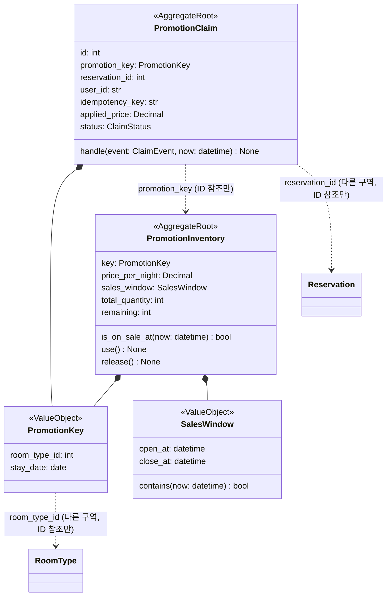
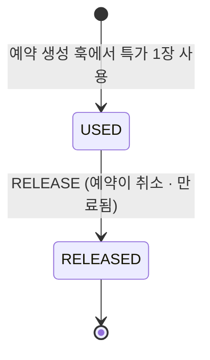
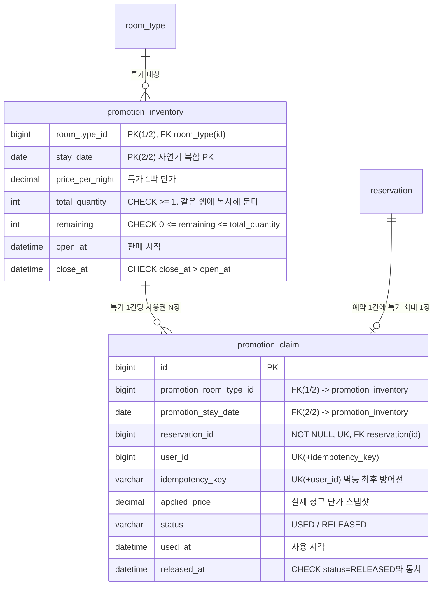
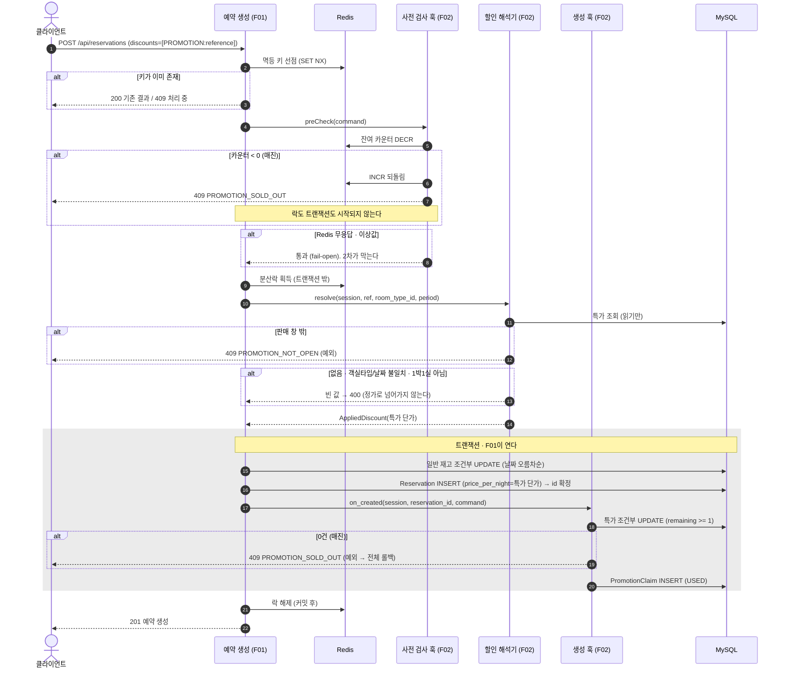
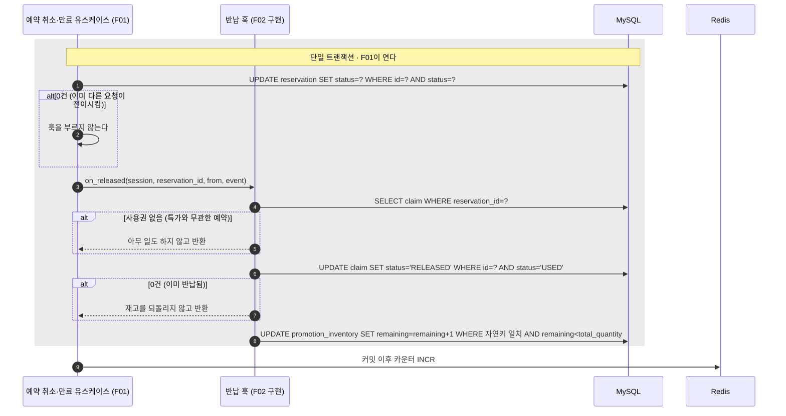

# [F02] 선착순 프로모션

- 상태: **폐기됨 (2026-08-16, 관리자 결정)**
- 작성일: 2026-08-15
- 승인일: —

> **이 문서는 구현되지 않았다.** 관리자 판단 — *"특가 객실은 숙박/예약에서 메인 문제는 아닌듯하다."* 구현은 도메인 계층 착수 직후(전이 표·enum·예외까지, `app/promotion/domain/`)에 중단됐고, 그 시점 코드는 `worktree-f02-promotion-rebased` 브랜치에 남아 있다.
>
> **문서로서는 유효하다.** "한 점에 몰리는 경합은 흩어진 경합과 방어 수단이 다르다"(§1)는 분석, 카운터 게이트 설계(§7), 세션 분리 함정과 그 판별력 분석(§7, D16 — `coding-rules.md`의 정식 규칙이 됐고 F01이 그 규칙대로 구현했다)은 이 프로젝트가 무엇을 고민했는지의 기록이며, 제출 문서에서 "검토했고 범위에서 뺐다"의 근거로 쓴다. F01의 확장 지점 넷은 구현체 없이 자리로 남는다 — 그것이 "확장에 열린 구조"의 증거다.

## 1. 무엇을 왜 만드는가

F01은 여러 날짜에 흩어진 재고 행을 다룬다. 경합이 있어도 요청마다 건드리는 행이 조금씩 다르다.

특가는 다르다. **오픈 시각에 수백 요청이 재고 행 딱 하나로 몰린다.** 잔여 10개짜리 특가에 500명이 같은 순간에 달려들면, 순진한 구현(조회 → 판단 → 저장)은 10개를 훨씬 넘겨 판다. 게다가 이 트래픽의 대부분은 **어차피 실패할 요청**이다. 매진된 뒤에도 계속 들어오는 요청이 DB 커넥션을 다 잡아먹으면, 특가와 무관한 일반 예약까지 같이 죽는다.

이 feature가 없으면 과제는 "여러 행에 퍼지는 경합" 한 종류만 다루고 끝난다. **한 점에 몰리는 경합은 방어 수단 자체가 달라진다**는 것을 보여주는 것이 F02의 존재 이유다.

## 2. 범위

**포함하는 것**

- UC-7 선착순 특가 예약 — 한정 수량 특가를 선착순으로 판다
- UC-7-B 특가 잔여 조회 — 오픈 대기 화면이 잔여를 폴링한다 (읽기 전용, 부하 대부분이 여기로 온다)
- UC-7-C 특가 반납 — 예약이 취소·만료되면 특가 재고를 되돌린다. **F01이 정의한 반납 훅의 구현체**로 만든다 (D6)
- UC-7-D 잔여 카운터 재동기화 — Redis 카운터를 DB 기준으로 다시 맞춘다 (기동 시 + 주기적)

**포함하지 않는 것**

| 뺀 것 | 이유 |
|---|---|
| 쿠폰 발급·사용 | 00 D5에서 범위 밖으로 확정. 대신 확장 자리만 남긴다 (D10) |
| 여러 밤에 걸친 특가 (연박 특가) | 경합점이 여러 행으로 흩어져 F01과 같은 문제가 된다. F02가 보여줄 것은 단일 행 경합이다 (D4) |
| 한 요청에 여러 객실 (수량 지정) | 위와 같은 이유. 1실 고정 (D4) |
| 프로모션 등록·수정 관리자 API | 00 D1(관리자 기능 제외). 프로모션은 Alembic 시드로 넣는다 |
| 같은 날짜·타입에 겹치는 프로모션 여러 개 | 어느 쪽이 적용되는지 정하는 규칙이 추가로 필요하다. UK로 막는다 (D9) |
| 특가 예약의 별도 취소 API | 취소는 F01의 예약 상태 전이다. F02는 F01이 부르는 반납 훅에서 재고만 되돌린다 (D6) |
| 대기열(줄 세우기) | 선착순 판정을 큐로 옮기면 이 과제가 증명하려는 DB 경합 제어가 사라진다 |

## 3. 소유 범위

`docs/architecture/parallel-work.md`에 따른 선언이다.

- **소유 모듈:** `app/promotion/**`, `app/promotion/container.py`
- **읽기만 하는 모듈:** `app/inventory/domain/`, `app/reservation/domain/`, `app/reservation/application/ports.py`
  - 다른 feature가 소유한 도메인은 **읽기만 한다.** 수정이 필요하다고 판단되면 손대지 않고 관리자에게 보고한다
  - **파이썬은 의존 방향을 컴파일러가 지켜주지 않는다**(`clean-architecture.md`). import 한 줄이면 경계가 넘어가고 아무도 막지 않는다. **리뷰에서 import를 직접 본다**는 전제로 쓴다
- **Alembic 리비전 대역:** `201` ~ `299` (`--rev-id`로 지정한다)
- **수정이 필요한 공유 파일** (둘 다 parallel-work의 공유 파일 절차 — 해당 변경만 담은 작은 커밋을 main에 먼저 — 를 따른다 → **D12**)
  - `app/common/errors.py`에 예외·에러 코드 2개 추가 (`PROMOTION_NOT_OPEN`, `PROMOTION_SOLD_OUT`. 중복 관련 코드는 만들지 않는다 → D18)
  - `app/common/runtime_report.py`의 `RuntimeContributor` 구현 1개 등록 (파일 자체는 F01이 먼저 만든다 → §7 설정 노출)
  - `app/common/config.py`에 게이트 스위치 1개 추가 (기본 켬. F01의 락 스위치와 같은 성격 → §7, D5)

> **✅ `parallel-work.md` 갱신본과 대조 완료** (2026-08-15, `main` 기준). 이전 판본은 경로가 Java 표기였고 PM 세션이 갱신 예정이라고 알려왔었다. 갱신본에서 확인한 것 셋이다.
>
> - **소유 모듈·대역 배정이 위 선언과 일치한다** — `app/promotion/**`, 마이그레이션 `201`~`299`, ADR `0020`~`0029`
> - **공유 파일 분류에서 `app/common/**`가 "절차를 밟으면 고칠 수 있다"에 그대로 있다.** 위 두 파일의 처리 방식(D12)이 유효하다
> - **`down_revision` 규칙이 새로 들어왔다.** 아래 절에서 다룬다

**`down_revision`이 병렬 작업의 새 함정이고, 이게 F02에 직접 걸린다.** Flyway는 번호만 안 겹치면 됐지만 **Alembic은 각 리비전이 앞 리비전을 가리킨다.** 두 세션이 같은 리비전을 가리키면 히스토리가 갈라지고 `alembic upgrade head`가 "여러 head"라며 멈춘다.

`parallel-work.md`가 정한 규칙은 **"자기 앞 리비전은 소유 feature가 병합된 뒤에 확정한다. 병합 순서가 곧 리비전 순서다"**이다. F02가 §5에서 이미 "`201`의 `down_revision`은 F01이 main에 병합된 뒤에야 확정할 수 있다"고 적어둔 것이 전 세션 규칙이 됐다. **번호 대역(`201`~`299`)은 내 것이지만 사슬의 시작점은 내 것이 아니다** — 그래서 리비전 파일을 미리 다 써두더라도 `down_revision` 한 줄은 병합 시점까지 비워둔다.

**모듈 배치는 `clean-architecture.md`의 컨텍스트 구조를 그대로 따른다.**

```
app/promotion/
├── domain/
│   ├── models.py         PromotionInventory, PromotionClaim, VO(PromotionKey, SalesWindow)
│   ├── enums.py          ClaimStatus, ClaimEvent
│   ├── transitions.py    사용권 전이 표 (데이터)
│   └── repositories.py   리포지토리 Protocol
├── application/
│   ├── commands.py       PromotionRemainingResult 등
│   └── usecases/         잔여 조회, 카운터 재동기화
├── presentation/         들어오는 경계 — HTTP
│   ├── router.py         GET /api/promotions/{roomTypeId}/{stayDate}
│   └── schemas.py        응답 스키마 (ApiModel 상속)
├── infrastructure/       나가는 경계 — DB·Redis
│   ├── persistence.py    조건부 UPDATE·조회 쿼리, F01 확장 지점 구현체 셋
│   └── cache.py          Redis 잔여 카운터 게이트 (사전 검사 훅 구현체)
└── container.py          이 컨텍스트의 프로바이더 묶음
```

**레이어 이름이 `adapter/` 하나에서 `presentation/`·`infrastructure/` 둘로 갈렸다** (2026-08-15 규칙 개정). `clean-architecture.md`의 근거는 **두 바깥 층의 방향이 반대**라는 것이다 — `presentation`은 요청을 받아 안으로 넣고, `infrastructure`는 안에서 바깥을 부른다. 한 이름으로 묶으면 "화면 계층에 왜 DB가 있나"에서 읽는 사람이 멈춘다.

**F02는 `lock.py`를 만들지 않는다.** 특가 재고에는 락을 두지 않기 때문이다(D5 — 조건부 UPDATE 한 줄로 원자성이 완결된다). 일반 재고 락은 F01 것을 그대로 탄다.

**폴더가 아니라 파일이다.** 이전 판본은 `persistence/`·`cache/`를 디렉터리로 그렸는데, `clean-architecture.md`가 **"작은 것을 파일로 쪼개지 않는다 — 파일이 300줄을 넘어가면 그때 쪼갠다"**로 못박았다. 파이썬은 모듈이 곧 네임스페이스라 클래스 하나에 파일 하나를 만들면 import만 길어진다.

### F01 확장 지점 구현체를 `infrastructure/`에 두는 이유

**한 번 짚고 넘어간다. 이 넷은 두 바깥 층 어느 쪽 설명에도 정확히 들어맞지 않기 때문이다.**

`presentation`은 **들어오는** 경계이고 `infrastructure`는 **나가는** 경계인데, 훅은 **F01이 F02를 부르는** 자리라 방향으로만 보면 들어오는 쪽이다. 그런데 `presentation`의 정의는 "HTTP를 받아 `Command`로 옮긴다"이고, 훅에는 HTTP가 없다.

**`infrastructure`에 둔다. 기준을 방향이 아니라 하는 일로 잡았다.**

| 구현체 | 하는 일 | 자리 |
|---|---|---|
| 생성 훅 · 반납 훅 | 받은 세션에 조건부 UPDATE와 INSERT를 실행한다 | `infrastructure/persistence.py` |
| 할인 해석기 | 받은 세션으로 특가 행을 읽는다 | `infrastructure/persistence.py` |
| 사전 검사 훅 (게이트) | Redis 카운터를 `DECR`한다 | `infrastructure/cache.py` |

**넷 다 몸통이 전부 바깥 자원 접근이다.** 그리고 자기가 쓰는 쿼리·키와 같은 파일에 있는 편이 읽기 좋다. `application/`에 두면 SQL이 유스케이스 계층으로 올라오고, 그건 `clean-architecture.md`가 명시적으로 금지한 것이다(`usecases/`에 SQL을 쓰지 않는다).

**대신 판단은 도메인에 남긴다.** "`rowcount == 0`이면 매진"은 훅이 하지만, "무엇이 매진인가"(불변식 `remaining >= 0`)와 사용권 전이 판정은 `domain/`에 있다. 훅은 그 판정을 SQL 한 줄로 실행하는 자리다.

**`app/promotion/domain/`은 F01을 import하지 않는다.** F01 타입(`Session`·`CreateReservationCommand`·`ReservationStatus`)이 등장하는 것은 `infrastructure/` 두 파일뿐이다.

### F01과의 계약 (2026-08-15 확정)

F02는 F01 위에 얹힌다. **F01이 확장 지점 넷을 인터페이스로 정의했고, F02가 그 구현체를 제공한다.** F01은 promotion이라는 것이 존재하는지도 모른다. 의존은 **F02 → F01 한 방향**이다.

**원문 위치.** F01 스펙이 2026-08-15에 4단 구조로 재정렬됐다(계약 내용은 불변, 배치만 바뀜). 아래 계약의 원문은 `docs/spec/F01-예약-코어.md`의 이 절들에 있다.

| 내용 | F01 절 | 옛 번호 |
|---|---|---|
| 확장 지점 넷 · 호출 순서 · 훅 규칙 표 | **3.6** | 7.5 |
| 시드 데이터 계약 (특가 투숙일이 이 범위 안이어야 한다) | **1.9** | 5.5 |
| 상태와 전이 표 (반납 대상 판정의 근거) | **1.4** | 4.3 |
| 테이블·컬럼 (`reservation.price_per_night` 등) | **1.6** | 5.2 |
| 결정 검토란 | **부록 A** | 11 |

옛 번호로 적힌 이 문서의 기록(§13 재확인 목록 등)은 당시 표기 그대로 둔다. 대응은 이 표로 한다.

```python
# app/reservation/application/ports.py  (F01 소유. F02는 구현만 한다)

class ReservationCreationHook(Protocol):
    def on_created(self, session: Session, reservation_id: int,
                   command: CreateReservationCommand) -> None:
        """예약 INSERT 직후, 호출부의 세션 안에서 호출된다."""

class ReservationReleaseHook(Protocol):
    def on_released(self, session: Session, reservation_id: int,
                    from_status: ReservationStatus, event: ReservationEvent) -> None:
        """상태 전이 조건부 UPDATE가 1건 성공했을 때만 정확히 한 번."""
```

> **⚠ 세션이 첫 인자로 온다. 이게 계약의 핵심이다.**
>
> **F02 구현체는 절대로 자기 세션을 열지 않는다.** 받은 `session`만 쓴다. 열면 트랜잭션이 둘로 갈라져서 "예약과 사용권이 함께 커밋된다"(D3)가 **조용히** 깨진다 — 단일 스레드 테스트는 전부 초록으로 통과한다.
>
> `coding-rules.md`의 「세션을 넘겨받는 쪽은 절대 스스로 열지 않는다」가 이 규칙이고, 지키는 방법이 셋이다.
>
> - **시그니처에 있으면 빠뜨릴 수 없다.** 컨텍스트 변수나 전역으로 몰래 공유하지 않는다
> - **구현체는 `session_factory`를 주입받지 않는다.** 받을 수 없으면 열 수 없다. **F02 컨테이너에서 훅 구현체에 `session_factory`도 `TransactionManager`도 주입하지 않는다**
> - **정적으로도 본다.** `app/promotion/infrastructure/persistence.py`가 `sessionmaker`·`create_engine`·`session_factory`·`TransactionManager`를 import하지 않는다. import가 없으면 만들 수단이 없다

> **✅ 이 방어선이 프로젝트 규칙이 됐다** (2026-08-15 개정 `coding-rules.md`). F02가 D16으로 세운 세 갈래가 그대로 규칙 문서에 들어갔고, **판별력 표(어느 시나리오가 세션 분리를 잡는가)도 함께 들어갔다.** F02 스펙에서만 지키는 약속이 아니라 전 세션이 지키는 규칙이라, 리뷰에서 이 문서를 인용할 필요가 없어졌다.
>
> **세션을 여는 진입점이 둘로 고정됐다.** 이제 유스케이스도 `sessionmaker`를 직접 부르지 않고 `TransactionManager.write()` / `read()` **둘만** 쓴다. F02의 조회 유스케이스(§8 잔여 조회)는 `read()`를 쓴다 — 커밋하지 않고, 자동으로 열린 읽기 트랜잭션을 명시적으로 닫는다. **훅 구현체는 둘 중 어느 것도 주입받지 않는다.**
>
> **`begin_nested()`(세이브포인트)가 금지 목록에 들어갔다.** 이건 F02에 직접 걸린다 — "특가만 실패하고 예약은 살린다"를 만들고 싶어지면 세이브포인트가 그 수단이 되기 때문이다. **그건 D3의 명제("예약과 사용권은 함께 커밋되거나 함께 롤백된다")를 정면으로 깨는 것**이고, 규칙이 그 유혹을 미리 잘라뒀다. 특가가 매진이면 예약도 실패하는 것이 F02의 설계다(§7).

여기에 **할인 해석기**가 하나 더 있다. 주문서(`CreateReservationCommand`)에 할인 요청을 싣는 자리가 생겼고, F01은 그 할인의 내용을 모른 채 F02에게 "이 할인은 1박에 얼마냐"고 묻는다.

```python
# app/reservation/application/ports.py  (F01 소유. F02는 구현만 한다)

class DiscountResolver(Protocol):
    def resolve(self, session: Session, ref: DiscountRef,
                room_type_id: int, period: StayPeriod) -> AppliedDiscount | None: ...

class AppliedDiscount(BaseModel):
    model_config = ConfigDict(frozen=True)
    ref: DiscountRef
    price_per_night: Decimal

# 주문서 쪽
class CreateReservationCommand(BaseModel):
    model_config = ConfigDict(frozen=True)
    user_id: str
    idempotency_key: str
    line: OrderLine
    discounts: list[DiscountRef] = []   # 0개 또는 1개

class DiscountRef(BaseModel):
    model_config = ConfigDict(frozen=True)
    type: DiscountType
    reference: str

class DiscountType(str, Enum):
    PROMOTION = "PROMOTION"             # COUPON이 생기면 여기 추가
```

> **계층을 넘는 그릇은 전부 `BaseModel`이다** (2026-08-15 개정 `coding-rules.md`). 이전 판본은 위 타입들을 `@dataclass(frozen=True)`로 그렸는데, 규칙이 **"dataclass·dict·튜플로 넘기지 않는다"**로 못박았다. `frozen`은 `ConfigDict(frozen=True)`로 옮겨간다.
>
> **F02에 실제로 걸리는 이득이 둘이다.** ① SQLModel이 Pydantic이라 `PromotionInventory` 행에서 `AppliedDiscount`를 만들 때 `model_validate(...)`로 끝난다 — dataclass를 섞으면 경계마다 손으로 옮기는 코드가 생기고 필드가 늘 때 한 곳을 빠뜨린다. ② 라우터에 `response_model`을 달면 **Swagger 문서가 코드에서 나온다.** §8의 잔여 조회 응답이 문서와 어긋날 자리가 없어진다.
>
> **위 넷은 F01 소유라 F02가 정하지 않는다.** 여기 적은 것은 F01이 규칙을 따를 때 F02 구현체가 받게 될 형태이고, 실제 시그니처가 다르면 F02가 맞춘다.

**`DiscountType`도 이름과 값을 같은 대문자로 둔다.** `coding-rules.md`의 Enum 규칙이다 — 값으로 저장되면 F04의 검증 SQL `IN` 필터가 0행을 돌려주고 **모든 불변식이 통과로 보인다.** 이 enum은 F01 소유라 내가 정하지 않지만, F02의 `ClaimStatus`·`ClaimEvent`에는 같은 규칙을 적용한다(§4).

**`Command`·`Result`는 `frozen`이고 표기는 `snake_case`다.** API 경계의 `camelCase` 변환은 `presentation/schemas.py`의 `ApiModel` 상속 한 곳에서만 일어난다(§8, D17).

F01의 가격 계산은 이렇게 된다.

```
price_per_night = discounts가 비었으면 room_type.base_price
                  아니면 resolve()가 돌려준 AppliedDiscount.price_per_night
total_price     = price_per_night * nights * room_count
```

**그래서 `reservation.price_per_night`에 실제로 청구한 단가가 들어간다. 특가면 특가다.** 초안이 안고 있던 금액 불일치(D7의 트레이드오프)가 **없어졌다.**

F01의 예약 생성 유스케이스가 훅들을 `list[...]`로 주입받아 전부 호출한다. **구현이 0개면 빈 리스트라 아무 일도 일어나지 않는다.** 그래서 F02 병합 전에도 F01은 그대로 돌고, F02가 잘려나가도(00 D4 절단 4순위) F01은 멀쩡하다. F02는 컨테이너에 프로바이더를 등록하면 자동으로 들어온다.

> **⚠ 이 보장의 위치가 내려갔다.** Java에서는 `List<Hook>` 주입이라 **타입 시스템이 강제**했다. 지금은 **컨테이너 조립 설정**에 있고, **프로바이더 등록 실수는 컴파일러가 안 잡아준다.**
>
> `clean-architecture.md`가 이것을 테스트로 고정하라고 요구한다 — **"확장 feature의 프로바이더를 등록하지 않고 코어 유스케이스가 그대로 동작한다."** F02는 절단 후보 4순위라(00 D4) 이 성질이 실제로 쓰일 수 있다. **T35**로 넣었다.

| # | 계약 내용 | 상태 |
|---|---|---|
| C1 | `ReservationCreationHook` — 예약 INSERT 직후 같은 트랜잭션에서 호출. `reservation_id`가 이미 확정돼 있다 | **확정** |
| C2 | `ReservationReleaseHook` — 상태 전이가 실제로 일어난 1건에 대해 **정확히 한 번** 호출. 재고를 복원하는 전이(`CANCEL`·`PAYMENT_FAILED`·`EXPIRE`)와 같은 자리다. 멱등 재요청(갱신 0건)에서는 호출되지 않는다 | **확정** |
| C3 | 사용권이 예약을 가리키는 키는 **내부 `reservation.id` (BIGINT)**. `promotion_claim.reservation_id`에 FK를 건다 | **확정** |
| C4 | 트랜잭션 안 순서: ① 일반 재고 차감 ② **할인 해석 → 가격 확정** ③ `Reservation` INSERT ④ 생성 훅 호출. **훅에서 예외를 던지면 ①~③까지 전부 롤백된다** | **확정** |
| C5 | 시드 데이터 계약 — 재고 2026-08-01~10-29 고정, 객실타입 5종 | **확정** (§9-3) |
| C6 | 주문서에 할인 요청을 싣는 자리 — `list[DiscountRef] discounts`. F02는 `DiscountRef(DiscountType.PROMOTION, reference)`로 쓴다 | **확정** |
| C7 | `DiscountResolver` — F01이 정의, F02가 구현. **읽기 전용 질의다.** 세션을 받는다 | **확정** |
| C8 | **사전 검사 훅** — 락 획득 **전에** 호출. 거부하면 락도 세션도 시작되지 않는다. **넷 중 유일하게 세션을 받지 않는다** | **확정** |
| C9 | **확장 지점 넷 모두 `session`을 첫 인자로 받는다** (C8 제외). 구현체는 자기 세션을 열지 않는다 | **확정** (스택 전환 시 신설) |

```python
# C8. 사전 검사 훅 — 세션이 없다
class ReservationPreCheckHook(Protocol):
    def check(self, command: CreateReservationCommand) -> None:
        """값비싼 작업 전에 거를 기회. 거부는 예외로 표현한다."""
```

> **세션을 안 주는 것이 곧 "여기서 DB를 건드리지 마라"는 선언이다.** 사전 검사는 락도 세션도 열리기 전에 도는 자리라 DB에 손댈 수단이 없어야 맞다. **F02 게이트가 Redis만 보는 이유가 시그니처에 드러나 있다.** 잔여를 DB에서 확인하고 싶어지는 순간, 그럴 수단이 없다는 것이 답이다 — 그 판정은 2차 조건부 UPDATE의 몫이다.

### 확정된 호출 순서

**이 순서가 곧 계약이다.** F02의 조각 넷이 각각 어디에 끼는지가 여기서 결정된다.

```
멱등 키 선점 → 입력 검증 → [사전 검사 훅] → 락 획득 → 세션 시작
     F01           F01          ★F02          F01       F01
                                     세션 없음
                                                  ┌─ tx.write() ─────────────────┐
                                                  │ [할인 해석기]★F02 → 가격 확정 │
                                                  │ 재고 차감 → 예약 INSERT       │
                                                  │        → [생성 훅]★F02       │
                                                  └──────────────────────────────┘
                                                    커밋 → 락 해제

상태 전이 시: 전이 UPDATE 1건 성공 → 재고 복원 + 이력 + [반납 훅]★F02  (같은 세션 안)
```

> **해석기가 세션 안으로 들어왔다.** Java 판에서는 "락 획득 → 해석기 → 가격 확정 → 트랜잭션 시작"으로 그렸는데, 해석기가 이제 `session`을 인자로 받으므로 **세션이 열린 뒤여야 한다.** 순서 자체(해석기가 생성 훅보다 앞)는 그대로다.
>
> **오히려 이쪽이 낫다.** 해석과 훅이 같은 세션 안에 있으면 그 사이에 특가가 매진돼도 훅의 조건부 UPDATE가 0건을 반환해 전체가 롤백된다. Java 판에서 "같은 트랜잭션이라 어긋날 걱정이 없다"고 쓴 근거가 **시그니처로 강제된다.**

**사전 검사가 락보다 앞인 이유.** 락 뒤에 두면 **락을 잡고 나서 거르게 된다.** 3박이면 Redis 왕복이 세 번이고, 아끼려던 비용을 이미 치른 뒤에 거르는 셈이라 게이트의 취지가 반쯤 깎인다. 앞에 두면 매진 요청이 락 왕복을 아예 하지 않고, **거부 경로에 잡은 락이 없어 정리가 가장 짧다**(역순 해제 로직을 안 탄다). 멱등 키는 남긴다 — 재고 부족과 같은 성격이라 같은 키로 다시 와도 결과가 같아야 한다.

**할인 해석기가 락 뒤인 이유.** 가격을 확정하려면 어떤 특가를 쓸지가 정해져야 하고, 그 판단이 **재고 확보와 같은 구간 안에** 있어야 한다.

**F01이 이 위치를 테스트로 못박았다** (F01 T80f: 사전 검사가 거부하면 가짜 락의 호출 횟수가 0). **F02의 게이트는 이 위치를 전제로 동작한다.** 위치가 흔들리면 그 테스트가 먼저 깨진다.

### ⚠ 확장 지점은 여기까지다

F01의 확장 지점이 넷(사전 검사·해석기·생성 훅·반납 훅)이 됐고, **넷 모두 구현자가 F02 하나다.** F01은 원래 "구현체 없는 추상화는 과잉 설계"라며 확장 자리를 기각했었고, 그 판단을 세 번 연속 예외 처리한 셈이다. 예약 생성이 **여러 훅을 순서대로 부르는 틀**에 가까워지고 있고, **순서 자체가 계약이 되어 문서 없이는 읽을 수 없다.**

F01이 선을 그었고 F02도 그대로 받는다.

> **다섯 번째 확장 지점이 필요해지면, 훅을 더 만들 것이 아니라 F02가 자기 진입점을 갖는 쪽을 다시 검토한다.**

**이건 원칙이 아니라 판단이다.** 지금 넷은 임계점을 넘지 않았다고 본 것뿐이다. **F02가 다섯 번째를 필요로 하게 되면 F01에 요청하기 전에 PM 세션에 먼저 알린다.** 그 시점이 구조를 다시 볼 시점이다.

**선이 재는 대상이 확정됐다** (2026-08-15, F01 D23). 설정 노출 기여자(`RuntimeContributor`, §7)가 이 선에 걸리는지가 실제로 문제 됐고, F01이 **안 걸린다**로 판단했다 — 선의 걱정은 "순서가 계약이 된다"와 "구현자가 하나뿐인 추상화" 둘인데, 설정 기여자는 요청 경로 밖 읽기 전용이라 순서가 없고 구현자가 F02·F03 둘이다. **예약 생성 흐름의 훅은 여전히 넷이 상한이다.**

### 해석기와 훅은 역할이 다르다

| | `DiscountResolver.resolve()` | `ReservationCreationHook.on_created()` |
|---|---|---|
| 성격 | **질의.** 값을 읽어 단가를 돌려준다 | **명령.** 재고를 차감하고 사용권을 만든다 |
| 시점 | 예약 INSERT **전** (가격이 확정돼야 INSERT할 수 있다) | 예약 INSERT **후** (`reservation_id`가 필요하다) |
| 쓰기 | **절대 하지 않는다** | 한다 |
| 세션 | 받는다. **읽기에만 쓴다** | 받는다. 쓰기에 쓴다 |

**`resolve()` 안에서 재고를 차감하지 않는다.** 거기는 읽기만 하는 자리다. 차감은 훅 한 곳에서만 일어난다.

**둘이 어긋날 걱정은 하지 않아도 된다.** 같은 트랜잭션에서 같은 행을 읽고 쓴다. 해석과 훅 사이에 특가가 매진되면 **훅의 조건부 UPDATE가 0건 → 예외 → 트랜잭션 전체 롤백**이다. 가격만 할인가로 잡히고 재고는 안 깎인 상태가 만들어질 수 없다.

### `resolve()`가 빈 값을 돌려주는 경우

F01은 빈 값을 받으면 **400으로 거절한다. 정가로 조용히 넘어가지 않는다.** 돈이 걸린 판단은 fail-closed여야 하기 때문이다 — 조용히 정가로 넘어가면 사용자가 기대한 것보다 더 청구하게 된다.

F02의 해석기는 아래를 확인한다. **대부분은 빈 값(400)이고, 판매 창만 예외(409)다.**

| 확인 | 어긋나면 |
|---|---|
| `reference` 파싱 성공, 그 특가가 존재하는가 | 빈 값 → 400 |
| 그 특가의 객실타입·날짜가 **인자로 받은 `room_type_id`·`period`와 일치**하는가 | 빈 값 → 400 |
| 1박 1실인가 (`period.nights() == 1`, `room_count == 1`) | 빈 값 → 400. D4 제약을 여기서 강제한다 |
| 판매 창 안인가 (주입한 `Clock` 기준) | **예외** → 409 `PROMOTION_NOT_OPEN`. 잘못된 요청이 아니라 기다렸다 다시 보내면 되는 요청이라 코드를 구분한다 |

> **객실타입·날짜 일치 검사는 의도한 방어다. 지우지 마라.**
>
> `resolve()`는 `reference`뿐 아니라 F01이 넘겨준 `room_type_id`와 `period`도 함께 받는다. 이 둘을 대조하면 **사용자가 A 특가를 요청하면서 B 객실을 예약하는 시도**가 차단된다. 시그니처가 이미 그렇게 생겨 있어 추가 비용이 없다.
>
> 시그니처를 줄이거나 이 검사를 "중복"으로 보고 빼면 **가장 싼 방어 하나가 조용히 사라진다.** 특가는 돈이 걸린 자리라 그 손실이 크다.
>
> **이 문단을 안 읽은 사람도 막히도록 테스트를 붙인다** — T18d-1(객실타입 축), T18d-2(날짜 축). 검사를 지우면 두 테스트가 빨개진다. **문서보다 테스트가 세다.**

**잔여 수량은 확인하지 않는다.** 매진 판정은 훅의 조건부 UPDATE가 한다. 해석기에서 잔여를 보면 매진이 400 `INVALID_REQUEST`로 나가는데, 매진의 올바른 응답은 409 `PROMOTION_SOLD_OUT`이다. **판정의 권한을 한 곳에 둔다.**

`discounts`가 2개 이상이면 F01이 400으로 거절한다. 할인 중복 적용은 범위 밖이다(00 D5).

## 4. 도메인 모델링

### 구역 배치

프로모션을 **재고·예약과 나란한 세 번째 구역**으로 둔다. 00 D6이 "F02 스펙 때 재검토"로 미뤄둔 항목의 결론이다 → **D1**

```
inventory (재고)            reservation (예약)          promotion (프로모션)
└ RoomDailyInventory        └ Reservation               ├ PromotionInventory
                                                        └ PromotionClaim
```

### 도메인 모델 다이어그램



| 구성 요소 | 무엇인가 | 왜 이렇게 두나 |
|---|---|---|
| `PromotionInventory` 특가 재고 | "이 객실타입의 이 날짜를, 이 가격에, 이 기간 동안, 몇 개까지" 라는 판매 약속 하나 | 잔여 수량과 판매 창이 **함께** 지켜져야 한다. 창이 닫혔으면 잔여가 남아도 팔면 안 되고, 창이 열려 있어도 잔여가 없으면 팔면 안 된다. 둘이 같은 규칙이라 한 애그리거트다 |
| `PromotionKey` 특가 식별자 | 객실타입 + 날짜 | **이 둘이 곧 특가의 자연키이자 DB의 복합 PK다.** 값으로 묶어두면 사용권도 같은 VO로 특가를 가리킬 수 있다 |
| `SalesWindow` 판매 창 | 오픈·마감 시각 | "마감이 오픈보다 빠를 수 없다"는 규칙을 담을 자리 |
| `PromotionClaim` 특가 사용권 | **예약 한 건에 특가가 적용됐다는 사실 한 줄.** 언제 적용됐고 얼마에 적용됐고 반납됐는지를 남긴다 | 특가 재고 행은 "몇 장 남았나"만 안다. **누가 어느 예약에 얼마로 썼는지**는 남는 곳이 따로 있어야 반납과 정산이 가능하다. 쿠폰이 생기면 같은 형태로 한 줄이 더 붙는다 (D10) |

### 애그리거트

**PromotionInventory (특가 재고)**

- **불변식**
  1. `0 <= remaining <= total_quantity` — 초과 판매도, 이중 복원도 불가능하다
  2. `total_quantity >= 1`
  3. `sales_window.close_at > sales_window.open_at`
  4. 판매 창 밖에서는 `use()`가 성립하지 않는다
  5. **판매 창은 투숙일을 넘겨 열려 있을 수 없다** — `close_at <= 투숙일 다음날 00:00 (KST)`. 이미 지나간 밤을 파는 일을 막는다 (D14)
- **경계 근거:** 위 표 참조. 판매 창과 잔여 수량은 하나의 판매 약속을 이루는 두 면이다
- **구성:** 루트 엔티티 `PromotionInventory`(SQLModel 테이블, `__tablename__ = "promotion_inventory"`), 복합 PK `(room_type_id, stay_date)`, VO `PromotionKey`, VO `SalesWindow`. **VO는 `models.py` 한 파일에 같이 둔다** (`clean-architecture.md`: 작은 것을 파일로 쪼개지 않는다)
- **상태:** 저장하지 않는다. "예정 / 판매 중 / 매진 / 종료"는 `(now, sales_window, remaining)`에서 계산되는 파생값이다. 저장하면 상태를 바꿔주는 스케줄러가 또 필요하고, 그 스케줄러와 실제 잔여가 어긋나는 순간이 생긴다

**PromotionClaim (특가 사용권)**

- **불변식**
  1. `(user_id, idempotency_key)`는 유일하다 — 같은 요청이 두 장을 만들 수 없다
  2. `reservation_id`는 유일하다 — 한 예약에 특가가 두 번 적용될 수 없다
  3. `status = RELEASED`인 것과 `releasedAt`이 채워진 것은 동치다
  4. 상태는 아래 전이 표를 벗어날 수 없다
  5. `reservation_id`는 생성 시점부터 채워져 있고 절대 비지 않는다. **예약이 먼저 만들어진 뒤에야 사용권이 생기기 때문이다** (C4)
- **경계 근거:** 특가 재고와 분리한 이유는 **수명이 다르기 때문**이다. 재고 행은 프로모션당 하나이고 초당 수백 번 갱신된다. 사용권은 판매 건마다 하나씩 새로 생기고 많아야 한 번 갱신된다(반납). 한 애그리거트로 묶으면 사용권 한 장을 읽을 때마다 경합의 중심인 재고 행을 함께 잠그게 된다
- **구성:** 루트 엔티티 `PromotionClaim`(`__tablename__ = "promotion_claim"`), `ClaimStatus`, `ClaimEvent`

> **⚠ Enum은 이름으로 저장한다. 이름과 값을 같은 대문자로 둔다.**
>
> ```python
> class ClaimStatus(str, Enum):
>     USED = "USED"
>     RELEASED = "RELEASED"
>
> class ClaimEvent(str, Enum):
>     RELEASE = "RELEASE"
> ```
>
> **값으로 저장되면 검증이 조용히 무의미해진다.** F04의 불변식 검증이 `WHERE status = 'RELEASED'` 형태인데, DB에 `released`로 저장돼 있으면 **그 필터가 0행을 돌려주고 모든 검증이 통과로 보인다.** 깨진 것이 아니라 아무것도 안 본 것인데 초록불이 켜진다. `coding-rules.md`의 Enum 규칙이고, F04가 찾아낸 함정이다.
>
> **`ck_claim_released` CHECK 제약도 `status <> 'RELEASED'`라는 문자열에 의존한다**(§5). 표기가 어긋나면 이 CHECK가 항상 참이 되어 3차 방어선 한 줄이 조용히 사라진다. **T36으로 저장 표기를 직접 확인한다.**

### 상태와 전이 표

`PromotionClaim`의 전이 표다. 코드의 전이 테이블과 이 표가 일치해야 한다.

**상태가 둘뿐인 이유.** 예약이 먼저 만들어지고 그 직후 같은 트랜잭션에서 사용권이 생기므로(C4), "재고는 잡았는데 예약은 아직"인 중간 상태가 존재하지 않는다. 사용권은 태어날 때 이미 예약에 붙어 있다.

| 현재 상태 | 이벤트 | 다음 상태 | 조건 | 멱등 처리 |
|---|---|---|---|---|
| USED | RELEASE | RELEASED | 연결된 예약이 반납 대상 이벤트(`CANCEL`·`PAYMENT_FAILED`·`EXPIRE`)로 전이됨 (§6) | — |
| USED | (그 외 전부) | — | **금지** | — |
| RELEASED | RELEASE | RELEASED | 이미 반납된 건에 반납이 또 들어옴 | **조용히 성공 처리하되 재고를 다시 되돌리지 않는다.** 조건부 UPDATE가 0건을 반환하는 것으로 판정한다 |
| RELEASED | (그 외 전부) | — | **금지.** 반납된 사용권은 되살리지 않는다 | — |

표에 없는 조합은 전부 거부한다. `RELEASED`는 종료 상태다.



### 애그리거트 간 관계

ID 참조만 쓴다. 애그리거트 간 `relationship()`을 걸지 않는다.

| 들고 있는 쪽 | 들고 있는 것 | 가리키는 대상 | 구역 |
|---|---|---|---|
| `PromotionInventory` | `key.room_type_id` | `RoomType` | inventory (다른 구역). **DB에서는 FK를 건다** — F01이 V001에서 만드는 부모 테이블이고 값이 바뀌지 않는 참조 데이터다 |
| `PromotionClaim` | `promotion_key` (객실타입 + 날짜) | `PromotionInventory` | promotion (같은 구역) |
| `PromotionClaim` | `reservation_id` | `Reservation` | reservation (다른 구역). **내부 `reservation.id` (BIGINT)를 쓰고 DB에서 FK를 건다** (C3 확정) |
| `PromotionClaim` | `user_id` | 사용자 (엔티티 없음. `X-User-Id` 헤더값, ADR-0006) | — |

## 5. DB 설계



### 테이블

**`promotion_inventory`** — 특가 재고. **이 테이블의 한 행이 이 feature의 모든 경합이 몰리는 지점이다.**

F01의 `room_daily_inventory`가 쓰는 두 패턴을 그대로 가져온다 (F01 세션이 PM 경유로 전달한 권고, D13).

1. **대리키 없이 자연키 복합 PK.** 대리키를 두면 재고 차감 UPDATE 한 번이 세컨더리 인덱스와 클러스터드 레코드 **두 곳을 잠근다.** 자연키면 한 곳만 잠근다. **특가 재고는 일반 재고보다 경합이 심한 행이라 이 이득이 더 크다.**
2. **`total_quantity`를 같은 행에 복사해 둔다.** `remaining <= total_quantity` CHECK를 같은 행에서 걸기 위해서다. 취소가 두 번 처리돼 재고가 총량을 넘는 사고를 DB가 직접 막는다.

| 컬럼 | 타입 | 제약 | 설명 |
|---|---|---|---|
| `room_type_id` | `bigint` | PK(1/2), FK → `room_type(id)` | 객실타입. F01이 V001에서 만든 부모 테이블을 참조만 한다 |
| `stay_date` | `date` | PK(2/2) | 특가가 적용되는 1박. **이 둘이 곧 특가의 식별자다** |
| `price_per_night` | `decimal(12,2)` | NOT NULL, CHECK `>= 0` | 특가 단가 |
| `total_quantity` | `int` | NOT NULL, CHECK `>= 1` | 한정 수량. **같은 행에 두는 이유는 아래 CHECK를 걸기 위해서다** |
| `remaining` | `int` | NOT NULL, CHECK `>= 0`, CHECK `<= total_quantity` | 잔여. 이 컬럼이 불변식의 대상 |
| `open_at` | `datetime(6)` | NOT NULL | 판매 시작 (UTC 저장) |
| `close_at` | `datetime(6)` | NOT NULL, CHECK `> open_at` | 판매 마감 (UTC 저장) |
| `created_at` | `datetime(6)` | NOT NULL | |
| `updated_at` | `datetime(6)` | NOT NULL | |

**`promotion_claim`** — 특가 사용권. "예약 한 건에 특가가 적용됐다"는 사실의 원장.

| 컬럼 | 타입 | 제약 | 설명 |
|---|---|---|---|
| `id` | `bigint` | PK, AUTO_INCREMENT | 사용권은 INSERT되고 많아야 한 번 갱신되며 **갱신 경합이 없으므로** 대리키를 둔다. 자연키 PK의 이득(잠금 한 곳)은 **갱신이 몰리는 행**에만 해당한다 (D13 적용 범위) |
| `promotion_room_type_id` | `bigint` | NOT NULL, FK(1/2) → `promotion_inventory` | 같은 구역이라 FK를 건다 |
| `promotion_stay_date` | `date` | NOT NULL, FK(2/2) → `promotion_inventory` | 위와 한 쌍 |
| `reservation_id` | `bigint` | **NOT NULL**, UNIQUE, **FK → `reservation(id)`** | 내부 예약 식별자 (C3 확정). 예약이 먼저 만들어지므로 NULL일 수 없다 |
| `user_id` | `bigint` | NOT NULL | `X-User-Id` |
| `idempotency_key` | `varchar(64)` | NOT NULL | 클라이언트가 보낸 키 |
| `applied_price` | `decimal(12,2)` | NOT NULL | 사용 시점의 특가 단가 스냅샷. 프로모션 가격이 나중에 바뀌어도 청구액은 안 바뀐다 |
| `status` | `varchar(16)` | NOT NULL | `USED` / `RELEASED` |
| `used_at` | `datetime(6)` | NOT NULL | 특가를 쓴 시각 |
| `released_at` | `datetime(6)` | NULL | 반납된 시각 |

**`reservation_id`에 FK를 거는 것은 다른 구역 참조 규칙과 어긋나지 않는다.** 도메인 코드는 여전히 ID만 들고 다니고 `relationship()`을 걸지 않는다. FK는 DB가 고아 행을 막아주는 장치이며, F01이 계약 C3에서 내부 id를 쓰라고 명시했다.

### 인덱스와 제약

| 이름 | 대상 컬럼 | 종류 | 근거 |
|---|---|---|---|
| `pk_promotion_inventory` | `promotion_inventory(room_type_id, stay_date)` | PRIMARY KEY (자연키) | 대리키를 두면 재고 차감 UPDATE가 세컨더리 인덱스와 클러스터드 레코드 두 곳을 잠근다. 자연키면 한 곳만 잠근다. **동시에 D9(날짜·타입당 특가 하나)의 유일성도 이 PK가 보장하므로 별도 UNIQUE가 필요 없다** |
| `ck_promotion_remaining_lower` | `promotion_inventory.remaining >= 0` | CHECK | **불변식 1의 최후 방어선.** 애플리케이션이 전부 뚫려도 초과 판매가 저장되지 않는다 |
| `ck_promotion_remaining_upper` | `promotion_inventory.remaining <= total_quantity` | CHECK | **이중 복원의 최후 방어선.** 같은 건이 두 번 반납되면 여기서 막힌다 |
| `ck_promotion_window` | `promotion_inventory.close_at > open_at` | CHECK | 시드 데이터 오타 방어 |
| `ck_promotion_not_past` | `promotion_inventory.close_at <= stay_date + INTERVAL 1 DAY` | CHECK | **불변식 5.** 이미 지나간 밤을 파는 일을 막는다. **F01이 `checkIn >= today`를 검증하지 않으므로 F02가 자기 규칙으로 세운다** (D14). MySQL 8.4가 이 표현을 CHECK에서 거부하면 도메인 검증 + 202 리비전 시드 검증 테스트로 대체하고, 그 사실을 스펙에 남긴다 |
| `ck_promotion_quantity` | `promotion_inventory.total_quantity >= 1` | CHECK | 0개짜리 프로모션은 의미가 없다 |
| `uk_claim_idempotency` | `promotion_claim(user_id, idempotency_key)` | UNIQUE | **멱등성의 최후 방어선.** Redis가 죽어도 같은 요청은 두 장을 만들 수 없다 |
| `uk_claim_reservation` | `promotion_claim(reservation_id)` | UNIQUE | 한 예약에 특가 두 장 적용 금지 (불변식 2). **동시에 반납 훅의 조회 인덱스이기도 하다** — 훅은 `WHERE reservation_id = ?`로 사용권을 찾으므로 이 유니크 인덱스 하나가 제약과 조회를 겸한다 |
| `ck_claim_released` | `status <> 'RELEASED' OR released_at IS NOT NULL` | CHECK | 상태와 시각이 어긋난 행을 막는다 |

**정리 배치용 인덱스는 두지 않는다.** 반납이 F01의 훅으로 밀려 들어오므로 훑을 일이 없다. 조회는 전부 `reservation_id` 한 건 단위이고 `uk_claim_reservation`이 그 경로를 덮는다. 근거 없는 인덱스는 넣지 않는다.

**불변식을 지키는 제약:** `ck_promotion_remaining_lower`와 `ck_promotion_remaining_upper`가 3차 방어선이다. 조건부 UPDATE가 전부 뚫려도 DB가 거부한다.

### 마이그레이션 파일

**Alembic 리비전 2개.** `--rev-id`로 대역(`201~299`)을 지킨다.

| 리비전 | 내용 |
|---|---|
| `201_promotion_tables` | `promotion_inventory`, `promotion_claim` 생성. 위 인덱스·CHECK 포함 |
| `202_promotion_seed` | 시연·부하테스트용 특가 시드. `INSERT ... SELECT`로 F01 시드의 `room_type` 식별자를 조회해 넣는다 (하드코딩하지 않는다). **특가 `stay_date`가 F01 재고 시드의 날짜 범위 안에 들어야 한다 〔F01 재확인 V12〕** |

**컬럼 타입과 제약은 마이그레이션에 직접 쓴다.** `coding-rules.md`가 "스키마의 진실은 마이그레이션이고 모델 클래스가 아니다"라고 못박았다. 위 §5 테이블 표의 타입(`DECIMAL(12,2)`, `VARCHAR(64)`, `DATETIME(6)`)을 SQLModel 추론에 맡기지 않고 리비전에 명시한다.

**`201`은 F01의 `room_type`·`reservation` 리비전에 의존한다.** FK를 걸기 때문이다. Alembic `down_revision`을 F01의 마지막 리비전으로 잡는다 — **F01이 main에 병합된 뒤에야 이 값을 확정할 수 있다.**

시드는 최소 3건을 넣는다. 이미 열린 특가(부하테스트 즉시 실행용), 곧 열릴 특가(오픈 순간 스파이크 재현용), 이미 닫힌 특가(판매 창 밖 거부 검증용).

## 6. 유스케이스

### UC-7. 선착순 특가 예약

**입력**

**특가 예약은 일반 예약과 같은 요청이다.** 입구는 `POST /api/reservations` 하나이며(§8), 특가는 거기에 할인 한 줄이 붙은 것이다.

| 항목 | 위치 | 설명 |
|---|---|---|
| `roomTypeId`, `checkIn`, `checkOut`, `roomCount`, `guestCount` | 본문 | 일반 예약과 동일. **F01 소유** |
| `discounts[0] = {type: PROMOTION, reference}` | 본문 | **이 한 줄이 특가 요청이다.** `reference`는 `"{room_type_id}:{stay_date}"` (D15) |
| `X-User-Id`, `Idempotency-Key` | 헤더 | F01이 처리한다 |

**F02가 강제하는 제약은 해석기에서 검사한다.** 1박(`check_out = check_in + 1일`), 1실(`room_count = 1`), 그리고 `reference`가 가리키는 특가가 `room_type_id`·기간과 일치할 것 (D4). 어긋나면 빈 값을 돌려주고, 그것은 400이 된다.

**출력**

F01의 예약 생성 응답 그대로다. **특가라고 해서 응답 형식이 달라지지 않는다.** `pricePerNight`에 실제 청구 단가(특가)가 담긴다.

**도메인 모델의 변화**

| 순서 | 대상 | 변화 | 트랜잭션 |
|---|---|---|---|
| 순서 | 대상 | 변화 | 트랜잭션 | 주인 |
|---|---|---|---|---|
| 1 | Redis 멱등 키 | `SET NX`로 선점 | 밖 | F01 |
| 2 | Redis 잔여 카운터 | **게이트.** `DECR` 결과가 음수면 즉시 `INCR`로 되돌리고 거부한다. **락도 트랜잭션도 시작되지 않는다** | 밖 | **F02 사전 검사 훅** |
| 3 | 분산락 | 재고 날짜 락 획득 | 밖 | F01 |
| 4 | PromotionInventory (읽기) | **할인 해석.** 특가를 읽어 단가를 돌려준다. **쓰지 않는다** | 밖 | **F02 해석기** |
| 5 | RoomDailyInventory (해당 1일 행) | `remaining` 1 감소 | **트랜잭션** | F01 |
| 6 | Reservation | `PENDING`으로 새로 생성 → `reservation_id` 확정. **`price_per_night`에 특가 단가가 들어간다** | 〃 | F01 |
| 7 | PromotionInventory | `remaining` 1 감소 (조건부 UPDATE). **0건이면 예외를 던져 5·6까지 통째로 롤백시킨다** | 〃 | **F02 생성 훅** |
| 8 | PromotionClaim | `USED` 상태로 새로 생성. `reservation_id`와 `applied_price` 기록 | 〃 | **F02 생성 훅** |
| 9 | Redis 멱등 키 | 결과 저장 | 밖 | F01 |

**F02가 손대는 것은 2·4·7·8 넷뿐이다.** 요청을 받는 것도, 락을 잡는 것도, 트랜잭션을 여는 것도, 멱등을 처리하는 것도 전부 F01이다.

**카운터는 게이트에서 이미 줄었으므로 커밋 후에 다시 줄이지 않는다.** 반대로 게이트를 통과한 뒤 어떤 이유로든 실패하면 그만큼 카운터가 실제보다 작아진다. **F02가 관측할 수 없는 실패 경로가 있으므로**(예: 일반 재고 부족은 F02 훅을 부르지 않는다) 그 오차는 재동기화(UC-7-D)가 회복한다. 오차 방향은 과소 판매이고, 창의 폭은 재동기화 주기다.

**4와 7이 같은 행을 읽고 쓴다.** 읽을 때 잔여가 있었는데 쓸 때 없어졌다면 7이 0건을 반환하고 전체가 롤백된다. **그래서 "할인가로 계산된 예약인데 특가는 안 깎인" 상태가 만들어질 수 없다.**

**왜 한 트랜잭션인가 (D3)**

F01이 확장 지점을 인터페이스로 열어줬기 때문에(C1·C4), 특가 차감과 사용권 발급을 **예약 생성과 같은 트랜잭션 안**에서 할 수 있게 됐다. 셋 중 하나라도 실패하면 전부 되돌아간다. 중간 상태가 없으므로 홀드도, 홀드 만료 스케줄러도, 보상 경로도 필요 없다.

**순서가 뒤집힌 것이 핵심이다.** 이전 설계는 "특가를 먼저 잡고 예약을 나중에" 만들었다. 지금은 **예약을 먼저 만들고 특가를 붙인다.** 그래야 `reservation_id`가 이미 확정돼 있어 사용권이 태어날 때부터 예약을 가리킬 수 있다. 그래서 사용권에 `HELD` 같은 중간 상태가 사라졌다.

**대가는 00 D6 예외가 세 구역으로 커지는 것이다.** 이 트랜잭션 하나가 inventory·reservation·promotion을 모두 건드린다. 다만 **예외의 자리는 그대로다** — 00 D6이 허용한 것은 "예약 생성이라는 한 자리"이고, 그 자리에 구역이 하나 더 들어온 것이지 새 자리가 생긴 것이 아니다. 이 판단은 D3에서 관리자 확인을 받는다.

**흐름**



**실패 시나리오**

| 상황 | 응답 | 부작용 처리 |
|---|---|---|
| 상황 | 응답 | 부작용 처리 |
|---|---|---|
| `reference`가 가리키는 특가 없음 · 파싱 실패 | 400 `INVALID_REQUEST` | 해석기가 빈 값 반환 → 트랜잭션 롤백 |
| 객실타입·기간이 `reference`와 불일치 | 400 `INVALID_REQUEST` | 〃. **A 특가로 B 객실을 사려는 시도를 막는다** |
| 1박·1실이 아님 | 400 `INVALID_REQUEST` | 〃 (D4) |
| 판매 창 전·후 | 409 `PROMOTION_NOT_OPEN` | 해석기가 예외를 던진다 → 트랜잭션 롤백. **400이 아니라 409인 이유는 "잘못된 요청"이 아니라 "지금은 안 되는 요청"이기 때문이다.** 오픈 전이면 기다렸다 다시 시도하면 된다 |
| 특가 조건부 UPDATE 0건 (매진) | 409 `PROMOTION_SOLD_OUT` | 훅이 예외를 던져 **트랜잭션 전체 롤백.** 일반 재고와 예약도 되돌아간다 |
| 일반 재고 부족 (F01) | 409 `INSUFFICIENT_INVENTORY` | F01이 해석기·훅을 부르기 전에 실패하므로 **특가는 손도 안 댄다** |
| `discounts`가 2개 이상 | 400 (F01이 낸다) | 할인 중복 적용은 범위 밖 |
| 멱등 키 재요청 | F01이 처리 | F02는 관여하지 않는다 |
| 커밋 직후 프로세스 죽음 | 응답 없음 (클라이언트 타임아웃) | **데이터는 정합하다.** 예약과 사용권이 함께 커밋됐다. 커밋 후 카운터 `DECR`이 안 됐을 수 있으나 **카운터는 조회용이고 재동기화(UC-7-D)가 회복한다** |

**이전 설계에 있던 "예약은 남았는데 특가만 반납되는 틈"이 사라졌다.** 두 쓰기가 같은 트랜잭션에 있기 때문이다.

**롤백되면 카운터를 되돌릴 필요가 없다.** 카운터는 커밋 후에만 줄이므로, 롤백된 요청은 애초에 카운터를 건드리지 않는다. 초안의 `DECR` → 실패 시 `INCR` 보상 경로가 통째로 없어졌다.

### UC-7-B. 특가 잔여 조회

**입력:** `roomTypeId`, `stayDate` (경로). 인증 불필요

**출력:** `roomTypeId`, `stayDate`, `pricePerNight`, `salesState`(`SCHEDULED`/`OPEN`/`SOLD_OUT`/`CLOSED`), `remaining`, `openAt`

**도메인 모델의 변화:** 없다. 읽기 전용이다.

**흐름:** Redis 잔여 카운터를 읽어 응답한다. 카운터가 없으면 DB에서 읽고 카운터를 채운다. `salesState`는 `(now, sales_window, remaining)`에서 계산한다.

오픈 대기 화면은 이 API를 초당 여러 번 두드린다. **부하의 대부분이 여기로 온다.** DB로 직행시키면 특가 예약이 커넥션을 못 얻는다.

**실패 시나리오**

| 상황 | 응답 | 부작용 처리 |
|---|---|---|
| 프로모션 없음 | 404 `RESOURCE_NOT_FOUND` | 없음 |
| Redis 장애 | 200, DB에서 읽은 값 | 없음. 캐시는 있으면 좋은 것이지 정확성의 근거가 아니다 |

`remaining`은 **근사값**이다. Redis 카운터는 보상 도중 실제보다 작을 수 있다. 응답 스키마와 문서에 "근사값"임을 명시한다. 결코 실제보다 크지 않다는 것이 중요하다 — 작게 보이는 것은 안전한 방향이다.

### UC-7-C. 특가 반납 (F01 반납 훅의 구현체)

**입력:** `session`, `reservation_id`, `from`(전이 전 상태), `event`(전이 이벤트). F01이 **상태 전이 조건부 UPDATE가 1건 성공했을 때만, 같은 트랜잭션에서 정확히 한 번** 호출한다 (계약 C2)

**출력:** 없음

**도메인 모델의 변화**

| 순서 | 대상 | 변화 |
|---|---|---|
| 1 | PromotionClaim (`reservation_id`로 조회) | 없으면 **아무 일도 하지 않고 끝낸다.** 특가와 무관한 예약이 훨씬 많다 |
| 2 | PromotionClaim | 조건부 UPDATE `SET status='RELEASED' WHERE id=? AND status='USED'`. **0건이면 아래를 하지 않는다** |
| 3 | PromotionInventory | 2가 1건일 때만 조건부 UPDATE `SET remaining = remaining + 1 WHERE 자연키 일치 AND remaining < total_quantity` |
| 4 | Redis 잔여 카운터 | **커밋 이후에** `INCR`. 트랜잭션 안에서 원격 호출을 하지 않는다 (`coding-rules.md`) |

**순서가 중요하다.** 상태 전이를 **먼저** 시도하고 1건이 갱신됐을 때만 재고를 되돌린다. 반대로 하면 같은 건이 두 번 들어왔을 때 재고가 두 번 늘어난다.

**F01이 "정확히 한 번"을 보장하는데 왜 또 조건부 UPDATE를 하는가.** F01의 보장은 신뢰하되 **다층 방어의 2층은 자기가 가져야 하기 때문**이다. F01이 Redis 멱등 키를 믿으면서도 DB에 유니크 제약을 건 것과 같은 이유다. 남의 보장에만 의존하는 방어는 그 보장이 바뀌는 순간 조용히 무너진다.

**어떤 이벤트에 훅이 오는가.** F01은 **재고를 복원하는 전이**에서만 훅을 부른다. 그래도 F02는 `event`를 보고 **자기 쪽에서도 반납 대상인지 판단한다.** 판단 근거를 F01의 호출 여부에만 두면, F01의 정책이 바뀌었을 때 F02가 조용히 따라가 버린다.

**어떤 종료 상태가 반납 대상인가.** F01의 전이 표 확정본(**상태 6개 × 이벤트 6개, 허용 전이 7개, 멱등 6칸, 거부 23칸 = 36칸**. F01 §1.4)을 기준으로 판정한다.

| F01 예약 상태 | 도달 이벤트 | 특가 재고 반납 | 이유 |
|---|---|---|---|
| `CANCELLED` | `CANCEL` | **반납한다** | 팔린 방이 다시 빈다. 특가도 다시 팔 수 있어야 한다 |
| `CANCELLED` | `PAYMENT_FAILED` | **반납한다** | 결제가 거절됐다. 특가를 소진한 것이 아니다 |
| `EXPIRED` | `EXPIRE` | **반납한다** | 미결제 만료다. 결제되지 않았으니 특가를 소진한 것이 아니다 |
| `CHECKED_OUT` | `CHECK_OUT` | 반납하지 않는다 | 정상적으로 소비된 예약이다 |
| `PENDING` / `CONFIRMED` / `CHECKED_IN` | — | 반납하지 않는다 | 종료 상태가 아니다 |

**같은 `CANCELLED`라도 도달 이벤트가 둘이다.** 둘 다 반납이라 판정은 갈리지 않지만, 반납 훅이 받는 것은 `from` 상태와 `event`이지 `to` 상태가 아니다. 구현은 **이벤트로 판정한다** — `CANCEL`·`PAYMENT_FAILED`·`EXPIRE` 셋이 반납 대상이다.

**특가 예약에만 필요한 별도 상태나 전이는 없다.** 특가 예약도 `Reservation`을 그대로 쓰고 F01의 전이 표를 그대로 따른다. 즉 **F02는 F01 소유 도메인에 어떤 변경도 요구하지 않는다.** F02가 관리하는 상태는 `PromotionClaim` 자기 것뿐이다.

#### 노쇼가 **유예**되면서 이번 범위에서 빠진 항목

**이 표에는 원래 `NO_SHOW` 행이 있었다.** "방은 그 손님 앞으로 잡혀 있었고 재판매되지 않았으므로 특가는 소진된 것"이라는 이유로 **반납하지 않는다**로 판정했었다. F01의 일반 재고 정책(F01 D15, 노쇼 객실은 복원하지 않음)과 같은 결론이었고, **두 세션이 서로 모른 채 따로 판단해 같은 답에 닿았다.**

**2026-08-15 관리자 판단으로 `NO_SHOW` 상태가 이번 범위에서 빠졌다.** 관리자 원문은 *"노쇼에 대한 기능은 **추후 작업으로 남겨두자.** 우선은 예약 코어부터 모두 구현"*이다 (F01 D4). 판정할 상태가 없어졌으므로 행을 지웠다. **판단이 틀려서 지운 것이 아니다.** 노쇼를 다시 넣게 되면 위 판정을 그대로 되살리면 된다.

> **기각이 아니라 유예로 확정됐다 (2026-08-15).** 기능의 필요성은 인정됐고 **순서만 뒤로 갔다.** 이 구분이 위 문장의 값을 바꾼다 — 기각이면 "혹시 몰라 남긴 기록"이지만 **유예면 실제로 되살릴 일이 생긴다.** 그때 판정을 처음부터 다시 하지 않도록 근거를 통째로 남겨둔다.
>
> **되살릴 때 확인할 것 하나.** 노쇼 상태가 돌아오면 **취소와 노쇼가 서로 다른 이벤트가 된다.** 그 순간 아래 "구분할 수단이 없다"는 전제가 깨지므로, 반납 대상 표에 `NO_SHOW`(반납하지 않음) 행을 되살리고 반납 훅의 이벤트 판정에 그 분기를 넣어야 한다. **지금 없는 것은 정책이 아니라 정책을 표현할 수단이다.**

#### 운영자가 노쇼를 수동 취소하면 특가는 반납된다 — 의도된 동작이다

노쇼가 자동 전이로 처리되지 않으므로, 손님이 오지 않은 예약은 **운영자가 취소 API를 불러** 정리한다. 그 경로는 `CANCEL` 이벤트이고, 위 표에서 **반납 대상**이다. 즉 **노쇼 객실의 특가 사용권이 반납되어 다시 팔릴 수 있다.**

**이것을 그대로 둔다.** F01이 자동 노쇼 전이를 만들지 않은 논리가 특가에도 그대로 적용된다 — 자동 전이가 없으므로 **자동 반납도 없다.** 운영자가 명시적으로 취소를 누르는 것은 사람이 "이 방을 다시 팔겠다"고 판단한 것이고, 그 판단에 일반 재고가 따라간다면 특가도 따라가는 것이 일관된다. 방은 돌아왔는데 특가만 안 돌아오면 **그날 특가로 팔 수 있었던 한 자리가 아무 기록 없이 증발한다.**

**대칭이 요점이다.** 일반 재고와 특가 재고는 같은 물리적 객실을 가리키므로(D2) **둘의 복원 여부가 갈리면 안 된다.** 어느 쪽이든 한쪽만 돌아오면 재고가 어긋난다. 지금은 둘 다 `CANCEL`에서 돌아오므로 맞다.

**만약 "노쇼 객실은 재판매하지 않는다"를 지키고 싶다면** 필요한 것은 F02의 예외 처리가 아니라 **노쇼를 표현하는 상태를 되살리는 것**이다(유예된 F01 D4가 정확히 그것이다). 취소와 노쇼가 같은 이벤트인 한 F02는 둘을 구분할 수단이 없다 — 반납 훅이 받는 `event`가 양쪽 모두 `CANCEL`이기 때문이다. **구분할 수 없는 것을 구분하는 척하는 코드를 넣지 않는다.**



**실패 시나리오**

| 상황 | 응답 | 부작용 처리 |
|---|---|---|
| 사용권 없음 (특가 아닌 예약) | 훅이 조용히 반환 | 없음. **정상 경로다.** 대부분의 예약이 여기 해당한다 |
| 사용권 상태 전이 UPDATE 0건 | 재고를 되돌리지 않고 반환 | 없음. 이미 반납된 건이다 |
| 재고 복원 UPDATE 0건 (`remaining = total_quantity`) | 경고 로그 | 없음. 이미 다 반납된 상태다. **CHECK 상한이 막을 상황을 조건부 UPDATE가 먼저 막은 것이므로 정상 동작** |
| 훅에서 예외 발생 | 취소 트랜잭션 전체 롤백 | **취소가 실패한다.** 사용자에게는 오류로 보인다. 특가 반납 실패 때문에 취소를 막는 것이 맞는가는 §10에 판단을 적었다 |
| Redis `INCR` 실패 (커밋 후) | 경고 로그 | 카운터가 실제보다 작아진다. **과소 판매 방향이라 안전하다.** UC-7-D가 회복한다 |

### UC-7-D. 잔여 카운터 재동기화

**입력:** 없음. 애플리케이션 기동 시 1회 + 고정 주기 실행

**출력:** 없음. 보정 건수 로그

**도메인 모델의 변화:** 없다. Redis 카운터만 DB의 `remaining` 값으로 덮어쓴다.

**왜 필요한가.** 카운터는 정확성의 근거가 아니라 **DB 앞의 문턱**이다(D5). 롤백·`INCR` 실패·Redis 재시작으로 실제보다 작아질 수 있고, 작아진 채로 두면 **팔 수 있는 특가를 매진으로 잘못 알린다.** 주기적으로 DB 기준으로 다시 맞춘다.

**덮어쓰기가 경합과 만나면.** 재동기화가 읽은 값과 쓰는 시점 사이에 판매가 일어나면 카운터가 잠깐 실제보다 커질 수 있다. 그 구간의 초과 요청은 **2차 조건부 UPDATE가 막는다.** 카운터가 틀려도 초과 판매는 나지 않는다 — 이것이 S2가 증명하는 명제다.

**실패 시나리오**

| 상황 | 응답 | 부작용 처리 |
|---|---|---|
| Redis 장애 | 경고 로그, 다음 주기 재시도 | 없음. 게이트가 없는 상태로 도는 것이고 2차가 막는다 |
| DB 조회 실패 | 경고 로그 | 카운터를 건드리지 않는다. 낡은 값이 남는 편이 잘못된 값보다 낫다 |

## 7. 동시성과 멱등성

### 경합 지점

| # | 지점 | 무엇이 동시에 오는가 | 순진하게 짜면 |
|---|---|---|---|
| R1 | `promotion_inventory` **단일 행** | 오픈 순간 수백 요청이 같은 행 하나를 갱신 | 조회 → 판단 → 저장 사이에 끼어들어 잔여 10개를 수십 개 판다 |
| R2 | 같은 행에 **차감과 반납이 동시에** | 특가 청구(`-1`)와 예약 취소(`+1`)가 같은 행에서 만난다 | 반납이 늦게 반영돼 `remaining > total_quantity`가 된다 |
| R3 | `room_daily_inventory` 해당 날짜 행 | 특가 요청 + 일반 예약 요청이 같은 재고 행 | F01의 방어에 F02가 올라탄다. F02가 별도 경로로 차감하면 F01의 락이 무의미해진다 |
| R4 | `promotion_claim` UK | 더블클릭·재시도로 같은 `(user_id, idempotency_key)`가 동시에 둘 | 사용권 두 장, 재고 두 번 차감 |
| R5 | 같은 예약에 **취소가 동시에 둘** | 두 요청이 같은 예약을 취소하려 한다 | 반납 훅이 두 번 불려 재고를 두 번 되돌린다 |
| R6 | 재동기화와 판매가 동시에 | UC-7-D가 카운터를 덮어쓰는 사이 판매가 일어난다 | 카운터가 잠깐 실제보다 커진다 → **2차가 막으므로 초과 판매는 없다** |

### 방어 전략

| 계층 | 수단 | 무엇을 막는가 | 뚫리면? |
|---|---|---|---|
| 1차 | **Redis 잔여 카운터 게이트** (사전 검사 훅, `DECR` 후 음수면 거부). **락보다 앞이라 매진 요청은 락 왕복도 하지 않는다** | R1의 **초과 트래픽**. 매진 뒤 밀려오는 요청이 락·트랜잭션·DB에 도달하지 못하게 한다 | 2차가 막는다. **정확성은 그대로, 처리량만 떨어진다** |
| 2차 | **DB 조건부 UPDATE** `SET remaining=remaining-1 WHERE room_type_id=? AND stay_date=? AND remaining>=1` | R1의 **초과 판매**. 읽고-판단하고-쓰는 세 단계를 한 단계로 줄인다. 자연키 PK로 바로 찾으므로 잠기는 곳이 클러스터드 레코드 하나뿐이다 | 3차가 막는다 |
| 2차 | **DB 조건부 UPDATE** `SET status='RELEASED' WHERE id=? AND status='USED'` | R5의 이중 반납. 전이가 1건 성공한 호출만 재고를 되돌린다 | 3차가 막는다 |
| 2차 | F01의 예약 생성 유스케이스를 **그대로 호출** | R3. 일반 재고에 대해서는 F01의 분산락·조건부 UPDATE를 그대로 쓴다. **F02는 자기 경로를 만들지 않는다** | F01의 3차 방어 |
| — | **F01의 "정확히 한 번" 훅 호출 보장** (C2) | R5. 상태 전이 조건부 UPDATE가 1건 성공한 경우에만 훅이 불린다 | **이걸 방어선으로 세지 않는다.** 남의 보장이라 바뀔 수 있다. 위의 2차가 F02 몫이다 |
| 3차 | **DB CHECK** `remaining >= 0` | 초과 판매의 저장 | 없음. 최후 방어선 |
| 3차 | **DB CHECK** `remaining <= total_quantity` | R2·R5의 이중 복원 저장 | 없음. 최후 방어선 |
| 3차 | **DB UNIQUE** `(user_id, idempotency_key)` | R4. Redis가 죽어도 사용권은 한 장 | 없음. 최후 방어선 |
| 3차 | **DB UNIQUE** `(reservation_id)` | 한 예약에 특가 두 장 | 없음. 최후 방어선 |

**왜 1차가 분산락이 아니라 카운터 게이트인가 (D5).** 락은 경합을 없애는 게 아니라 **줄을 세운다.** 잔여 10개에 500요청이면 매진 뒤에도 490개가 락을 순서대로 기다렸다가 DB를 한 번씩 두드린다. 선착순에서 필요한 것은 줄 세우기가 아니라 **일찍 자르기**다. Redis `DECR`은 원자적이라 락 없이 "몇 번째 요청인가"를 O(1)로 판정한다.

**게이트가 락보다 앞에 있는 것이 핵심이다.** 락 뒤에 두면 락을 잡고 나서 거르게 되고, 3박이면 Redis 왕복이 세 번이다. 아끼려던 비용을 이미 치른 뒤에 거르는 셈이다. 앞에 두면 매진 요청은 **락 왕복도 트랜잭션도 없이** 돌아간다.

특가 재고 자체에는 락을 두지 않는다. **행이 하나**라서 락 순서 문제가 없고, 조건부 UPDATE 한 줄이면 원자성이 완결된다. 락으로 얻을 것이 없다.

> **⚠ "직접 만들 이유가 없으면 만들지 마라"를 게이트에 적용하면 어떻게 되는가.**
>
> 2026-08-15 규칙 개정에서 **분산락을 직접 구현하지 않고 `redis-py`의 `Lock`을 쓴다**로 정해졌다. `SET NX PX` + 토큰 + Lua 비교 삭제 + 대기 상한이 이미 라이브러리에 들어 있고, **직접 쓰면 검증되지 않은 코드가 하나 늘고 그게 틀리면 조용히 틀린다.** F02의 게이트에도 같은 잣대를 대야 한다.
>
> **대본 결과: 게이트는 그대로 둔다. 다만 이유가 "라이브러리에 없어서"가 아니다.**
>
> | | 분산락 | F02 게이트 |
> |---|---|---|
> | 직접 만들면 쓰게 되는 것 | `SET NX PX` + UUID 토큰 + Lua 해제 + 만료·소유권 처리 — **여러 명령을 엮은 프로토콜** | `DECR` **한 명령** |
> | 틀릴 여지 | 토큰을 안 쓰면 남의 락을 지우고, 해제가 원자적이지 않으면 이중 해제가 난다 | `DECR`의 원자성은 Redis가 보장한다. 우리가 엮을 것이 없다 |
> | 라이브러리 대체물 | `redis.lock.Lock` | **없다.** `redis-py`는 `DECR`을 그대로 노출한다 |
>
> **직접 만들지 말라는 규칙이 겨냥하는 것은 "여러 명령을 엮어 만든 프로토콜"이다.** 락이 위험한 이유는 명령 하나가 아니라 획득·소유권·해제가 엮인 절차이기 때문이고, 게이트에는 그 절차가 없다. **`DECR` 하나를 부르는 것은 직접 구현이 아니라 그냥 사용이다.**
>
> **그래서 게이트를 락으로 바꾸지 않는다.** 바꾸면 D5가 기각한 것으로 되돌아간다 — 락은 줄을 세우고, 선착순에 필요한 것은 일찍 자르기다.
>
> **한 군데는 규칙대로 물러섰다.** 게이트의 되돌림(잔여가 음수면 `INCR`로 복구)을 원자적으로 만들고 싶어지면, **`DECR`+`INCR`을 손으로 엮은 절차를 만들지 않고 Lua 스크립트를 `redis.register_script(...)`로 등록해 쓴다.** 그것도 라이브러리 기능이다. 다만 지금은 필요 없다 — 아래 §D5 부록에서 보듯 되돌림이 늦거나 빠져도 **게이트는 1차 방어라 정확성에 기여하지 않는다.** 값을 못 만드는 정교화는 하지 않는다는 것이 락 절의 결론과 같다.

**1차를 껐을 때도 불변식이 지켜지는 증명.** 게이트를 끄는 스위치 `PMS_PROMOTION_GATE_ENABLED=false`를 둔다. S2를 그 상태로 돌려 성공 건수가 여전히 정확히 재고 수와 같으면 2차가 혼자서도 막는다는 뜻이다. Redis 장애 = 이 상태다.

**스위치의 성격은 F01의 락 스위치와 정확히 같게 맞춘다** (F01 D17, 2026-08-15 관리자 판단 "운영이 아니라 프로젝트 환경변수 — feature flag 느낌").

```
사람이 치는 것:  PMS_PROMOTION_GATE_ENABLED=false uvicorn app.main:app
노출되는 키:     "PMS_PROMOTION_GATE_ENABLED": false      ← 같아야 한다
```

- **키 문자열은 조작자가 셸에 치는 그대로다.** `coding-rules.md`의 설정 키 규칙이다. 다른 이름을 쓰면 번역 계층이 하나 생기고, **리포트의 설정 표를 보고 실험을 재현하려는 사람이 그 문자열을 그대로 붙여넣을 수 없다.** 편의가 아니라 재현성 문제다
- **프로젝트 수준 feature flag**다. 운영 환경을 상정한 스위치가 아니다 — 이 프로젝트에 운영 환경이 없으므로 그런 명분을 붙이지 않는다
- **테스트 설정에 못 박지 않는다.** 못 박으면 F04가 같은 앱을 플래그만 바꿔 두 번 돌리는 비교 실험을 할 수 없고, 정작 증명이 필요한 계층(통합·부하)에서 쓸 수 없다
- **꺼진 채 기동하면 WARN 로그를 남긴다.** 껐다는 것을 잊고 측정하는 사고를 막는 값싼 장치다. F01이 락 스위치에 붙인 것과 같다
- 스위치 자체는 **F02 소유**이고 `app/common/config.py` 추가는 공유 파일 절차를 탄다 (D12와 같은 취급)

> **⚠ 노출하는 값의 출처가 실제로 쓰는 그 객체여야 한다.**
>
> F04가 실행 전에 이 값을 읽어 "게이트가 꺼진 상태에서 측정했다"를 리포트에 적는다. **설정을 두 곳에서 따로 읽으면 "꺼졌다고 보고하는데 실제로는 도는" 상태가 만들어진다.** `coding-rules.md`가 못박은 대로 **컨테이너에서 같은 프로바이더를 게이트와 노출 엔드포인트 양쪽에 주입해** 구조적으로 어긋날 수 없게 한다.
>
> **검증 장치가 검증 대상과 다른 곳을 보면 검증이 아니다.** 이건 §4 Enum 표기 함정과 같은 종류다 — 둘 다 **초록불이 켜져 있는데 아무것도 안 본** 상태를 만든다. **T18a-6**으로 노출 값과 실제 동작이 일치하는지 확인한다.

#### 값 하나로는 부족하다 — 사각지대가 양쪽에 하나씩 있다

**2026-08-15, F03 세션이 락에서 같은 문제를 찾아 PM 경유로 전달했다.** 설정 값만 노출하면 **"값은 `false`인데 컨테이너는 여전히 Redis 구현을 물고 있는"** 상태를 못 잡는다. **설정 값은 "무엇을 의도했는가"이고 주입된 클래스는 "실제로 무엇이 들어갔는가"인데, 파이썬에서는 둘이 갈라질 수 있고 컴파일러가 안 잡아준다.**

**F02에는 사각지대가 하나 더 있다. 게이트가 fail-open이기 때문이다.**

| 상태 | 설정 값 | 주입된 구현 | 게이트가 실제로 자르나 | 무엇으로 잡나 |
|---|---|---|---|---|
| 정상 켬 | `true` | `RedisPromotionGate` | 자른다 | — |
| 정상 끔 | `false` | `NoOpPromotionGate` | 안 자른다 | — |
| **배선 실수** | `false` | **`RedisPromotionGate`** | **자른다** | 값만 보면 못 잡는다 → **구현 클래스** |
| **Redis 장애 (fail-open)** | `true` | `RedisPromotionGate` | **안 자른다** | 클래스만 보면 못 잡는다 → **카운터** |

**아래 둘이 왜 위험한지가 같다.** 둘 다 F04의 on/off 대조를 무의미하게 만든다. 배선 실수면 "껐다고 확인하고 돌렸는데 실제로는 켜져" 있고, Redis 장애면 "켰다고 확인하고 돌렸는데 실제로는 꺼져" 있다. **두 회차가 같은 조건이 되고, 결과는 "차이 없음"으로 나온다.** 그리고 그 수치는 **"게이트가 없어도 되더라"라는 정반대 결론**을 만든다. 리포트를 읽는 사람이 그걸 알아챌 방법이 없다.

**셋을 함께 싣는다.** F02 기여자가 실물 계약(`app/common/runtime_report.py`, 아래 확정 블록)에 맞춰 내놓는 모양은 이렇다.

```python
RuntimeReport(
    load_test={"PMS_PROMOTION_GATE_ENABLED": True},          # 키는 셸에 치는 그대로
    implementations={"promotion_gate": type(self._gate).__name__},
    counters={"rejected_by_gate": ...,                       # 프로세스 시작 이후 누적
              "rejected_by_conditional_update": ...},
)
```

- **`load_test`의 키** — **조작자가 셸에 치는 그대로**다(§7 앞 절). 계약이 이 규칙을 그릇 docstring에 박아뒀다
- **`implementations`의 값** — **실물에서 뽑는다.** `type(self._gate).__name__`이고, 문자열을 손으로 적지 않는다. 손으로 적으면 **그게 또 어긋날 자리**가 된다. 계약의 표현 그대로 — 설정 값은 "무엇을 의도했는가"이고 이 값은 "실제로 무엇이 들어갔는가"다
- **카운터 둘** — 게이트가 자른 누적 건수와 조건부 UPDATE가 `rowcount == 0`으로 거른 누적 건수

> **✅ `counters: dict[str, int] = {}` 필드가 계약에 채택됐다 (2026-08-15, F02 제안 → F01 수용).** 근거는 제안 그대로다 — 카운터는 기존 두 칸 어디에도 맞지 않고, 억지로 넣으면 그릇의 규칙이 거짓이 된다. **채택과 함께 그릇 전체가 개명됐다**: `ConfigReport` → **`RuntimeReport`**, `ConfigContributor` → **`RuntimeContributor`**, 모듈 `runtime_report.py`. F01의 근거 — **카운터가 들어오는 순간 "Config"라는 이름이 거짓말을 시작하고**, 아직 아무것도 병합 전이라 지금이 개명 비용이 0인 유일한 시점이다. 엔드포인트 경로 `/api/internal/config`는 그대로다(F04 스크립트가 이미 물고 있다).
>
> **새 칸의 계약 규칙 셋 (F01 지정 문구).**
>
> 1. **키는 컨텍스트 소유의 `snake_case` 이름**이고, 기존 두 칸과 동일하게 **충돌 시 단언 실패**다.
> 2. **값은 프로세스 시작 이후 누적(단조 증가)이다.** F04의 회차 판정은 **회차 전후 두 GET의 차분**으로 한다. 절대값 규칙이면 "언제부터 센 것인가"가 회차마다 흔들린다.
> 3. **⚠ 카운터는 프로세스 단위다 — 이 설계의 유일한 함정이다.** uvicorn을 워커 여럿으로 띄우면 각 프로세스가 자기 숫자만 세고, **합산 안 된 값이 조용히 진짜처럼 나간다** — 표본-0 초록불과 같은 부류다. **부하테스트는 단일 프로세스 기동을 전제**하고, F04가 그 전제를 리포트 실행 조건에 명시한다.
>
> **스레드 안전이 F02 구현 몫이다.** 동기 + 스레드풀 스택이라 증가 연산이 경합하는데 **파이썬 `+=`는 원자적이지 않다.** 방식(락, `itertools.count` 등)은 구현에서 정하되 **동시성 테스트로 뒷받침한다(T18a-9)** — "카운터가 가끔 하나 모자란다"는 정확히 이 프로젝트가 잡으려는 부류의 버그다.

**카운터를 왜 넣는지가 앞의 둘과 다르다. 그래서 판정 시점도 다르다.**

| 판정 시점 | 무엇으로 | 무엇을 말해주나 |
|---|---|---|
| **실행 전** | 설정 값 + 구현 클래스 | **"게이트가 살아 있을 예정이다."** 배선 실수를 여기서 잡는다 |
| **실행 후** | 카운터 두 개 | **"게이트가 실제로 살아서 잘랐다."** fail-open을 여기서 잡는다 |

**실행 전 값만으로는 fail-open을 잡을 수 없다.** Redis는 실행 도중에도 죽을 수 있고, 그러면 실행 전 확인이 무엇이었든 게이트는 전부 통과시킨다. **"게이트가 살아 있다"를 증명하는 것은 실행 전 값이 아니라 실행 후 카운터다.**

**그래서 회차를 무효로 만드는 조건을 미리 적어둔다. F04가 이걸 그대로 판정에 쓴다.**

| 회차 | 무효 조건 | 뜻 |
|---|---|---|
| 게이트 **켠** 회차 | `rejected_by_gate == 0`인데 매진 이후 요청이 있었다 | 게이트가 안 잘랐다 — **Redis가 죽었거나 배선이 틀렸다.** 이 회차는 off 회차와 같은 조건이다 |
| 게이트 **끈** 회차 | `rejected_by_gate > 0` | 껐는데 잘랐다 — **배선이 틀렸다** |

**두 조건 다 "차이 없음"이라는 결과를 만들어낸다.** 그 결과를 보고 게이트가 쓸모없다고 결론 내리기 전에 이 두 줄을 먼저 본다.

**`rejected_by_conditional_update`를 함께 싣는 이유는 다른 데 있다.** 이건 게이트 진단이 아니라 **다층 방어의 증거**다. 게이트를 끈 회차에서 이 값이 올라가면 **"1차가 없어도 2차가 실제로 막았다"**가 수치로 남는다 — S2가 증명하려는 명제 그 자체이고, 지금까지 "성공 건수가 정확히 N"이라는 결과로만 보이던 것을 **막은 쪽에서도** 보이게 한다.

> **F03은 같은 질문(서버 카운터를 싣나)에 반대로 답했다 — 캐시 히트 카운터를 싣지 않는다. 둘 다 맞다.** 기준은 **그 정보가 응답에 이미 있는가**다. F03의 캐시 히트는 모든 200 응답의 `source` 필드에 실려 있어 k6가 전수 집계할 수 있다. **F02의 두 거부는 응답이 서로 같다** — 게이트가 잘랐든 조건부 UPDATE가 잘랐든 클라이언트에게는 똑같은 409 `PROMOTION_SOLD_OUT`이다. 응답으로 구분할 수 없는 정보만 서버가 센다.

> **✅ 탑재 방식이 확정됐고 실물이 나와 있다 (2026-08-15, F01 D26. `origin/worktree-F01:app/common/runtime_report.py`에서 대조 완료).** 컨텍스트별 기여자를 리스트 프로바이더로 모으는 1안이다.
>
> ```python
> # app/common/runtime_report.py  (공유 파일. F01이 단독 커밋으로 먼저 만든다)
> class RuntimeReport(BaseModel):
>     model_config = ConfigDict(frozen=True)
>     load_test: dict[str, bool | int | float | str]   # 키 = 셸에 치는 환경변수 이름 그대로
>     implementations: dict[str, str]                  # 값 = 컨테이너에서 꺼낸 실물의 클래스 이름
>     counters: dict[str, int] = {}                    # 프로세스 시작 이후 누적. 위 채택 블록 참조
>
> class RuntimeContributor(Protocol):
>     def report(self) -> RuntimeReport: ...
>
> def merge_reports(reports): ...   # 키 충돌 시 조용히 덮지 않고 ValueError
> ```
>
> - **이름의 이력.** F01 초안이 `ConfigReport`/`ConfigContributor`(모듈 `config_report.py`)였고, `counters` 채택과 함께 **`RuntimeReport`/`RuntimeContributor`(`runtime_report.py`)로 개명됐다** — 카운터가 들어오는 순간 "Config"라는 이름이 거짓말을 시작하기 때문이다. 병합 전이라 개명 비용이 0인 시점에 바꿨다
> - **`Protocol`의 자리가 `reservation`이 아니라 `common`이다.** F01의 근거가 맞다 — `reservation`에 두면 **F03이 `reservation`을 import하는 새 의존이 생긴다.** F02는 훅 때문에 이미 있는 의존이라 그 자리가 자연스러워 보였지만, F03에는 없던 의존을 새로 만드는 것이었다. `common`은 아무에게도 의존하지 않으므로 **컨텍스트 간 계약이 살 자리다**
> - **F02는 자기 컨테이너에 `RuntimeContributor` 구현 하나를 등록한다.** F01 라우트가 리스트 프로바이더로 모아 `merge_reports`로 합친다. **구현 0개면 자연히 안 나온다** — F02가 잘려도 F01이 그대로 돈다 (T35와 같은 성질)
> - **키 충돌은 조용히 덮어쓰지 않고 `ValueError`로 실패한다.** `PMS_` 접두가 컨텍스트별로 갈려 정상 경로엔 충돌이 없고, 있다면 같은 키를 두 곳이 소유한다는 뜻이다 — 어느 쪽이 이기든 한쪽의 보고는 거짓이 된다
> - **이것은 다섯 번째 훅이 아니다.** F01이 D23에서 선의 범위를 명시했다 — 넷 상한은 **예약 생성 흐름에 끼어드는 훅**의 상한이고, 설정 기여자는 요청 경로 밖 읽기 전용에 구현자가 F02·F03 둘이라 그 선이 재는 대상이 아니다. *"선을 소리 없이 넓힌 게 아니라 선이 무엇을 재는지 분명히 한 것이다"* (F01)

**그리고 이 스위치가 F04의 측정 도구다.** 껐다 켜서 "매진 트래픽을 DB 앞에서 자르면 처리량이 얼마나 달라지는가"를 수치로 낸다. **이 프로젝트가 파는 것이 정확히 그런 상대 비교다.**

### 락 순서

**F02는 락을 도입하지 않는다.** 특가 재고는 조건부 UPDATE 한 줄로 원자성이 완결된다.

> **⚠ 훅 안에서는 절대로 분산락을 잡지 않는다.**
>
> F01의 예약 생성은 `락 획득 → 세션 시작 → 커밋 → 락 해제` 순서다(`coding-rules.md`의 락 규칙). **훅은 세션 안에서 불린다.** 거기서 락을 잡으면 순서가 뒤집혀서 **커밋 전에 락이 풀리거나, 락을 쥔 채 커밋을 기다리게 된다.** 둘 다 재현이 어려운 버그다.
>
> 훅이 하는 일은 조건부 UPDATE 두 번과 INSERT 한 번뿐이다. 원격 호출도 하지 않는다 — Redis `INCR`은 커밋 이후로 미룬다.

> **⚠⚠ 그리고 이것이 이 스택에서 더 위험하다 — 훅 안에서 세션을 열지 않는다.**
>
> **락 규칙보다 이쪽이 조용하다.** 락 순서가 뒤집히면 최소한 부하가 걸릴 때 증상이 나온다. **세션이 갈라지면 단일 스레드 테스트가 전부 초록인데 데이터가 어긋난다.**
>
> ```
> 호출부 세션:  재고 차감 → 예약 INSERT → ... → 롤백
> 구현부 세션:  특가 차감 + 사용권 INSERT → 이미 커밋됨   ← 되돌아가지 않는다
> ```
>
> **D3의 핵심 명제가 여기서 깨진다.** "예약과 사용권이 함께 커밋되거나 함께 롤백된다"는 F02 설계 전체가 딛고 선 문장이다. 홀드 2단계를 버린 이유도, 보상 경로를 없앤 이유도 전부 이 문장 하나였다. **세션이 갈라지면 홀드를 버리면서 없앴다고 선언한 그 상태가 그대로 돌아온다** — 특가만 나가고 예약은 없는 상태.
>
> 막는 수단 셋 (`coding-rules.md`):
>
> | 수단 | F02가 하는 일 |
> |---|---|
> | 시그니처 | 받은 `session`만 쓴다. 다른 경로로 세션을 구하지 않는다 |
> | 주입 차단 | **컨테이너에서 훅 구현체에 `session_factory`를 주입하지 않는다.** 받을 수 없으면 열 수 없다 |
> | 정적 확인 | `app/promotion/infrastructure/persistence.py`가 `sessionmaker`·`create_engine`·`session_factory`·`TransactionManager`를 import하지 않는다 |
>
> **테스트는 T22b가 잡는다. T22만으로는 못 잡는다** — 아래 참조.

#### 세션 분리를 잡는 테스트는 T22 하나로는 부족하다

**T22("훅이 매진에 예외를 던지면 예약도 롤백된다")는 세션이 갈라진 구현도 통과한다.** 구현부가 예외를 던지면 **자기 세션도 커밋 전이라 함께 롤백되기** 때문이다. 정상 구현과 결과가 같아서 **판별력이 0이다.**

버그는 **훅이 성공한 뒤에만** 드러난다.

| 시나리오 | 세션이 갈라진 구현에서 | 잡히나 | 테스트 |
|---|---|---|---|
| 훅이 예외를 던진다 (매진) | 자기 세션도 커밋 전이라 함께 롤백. 정상 구현과 같은 결과 | ❌ | T22 |
| **훅이 성공한 뒤 F01이 실패한다** | **F02는 이미 커밋했다. 특가가 깎이고 사용권 행이 살아남는다** | ✅ | **T22b** |

**둘 다 쓴다.** T22가 계약의 절반(훅 실패 시 전체 롤백)을 지키고, **T22b가 세션 분리를 잡는다.** T22b가 없으면 "이 함정을 잡는 테스트가 있다"고 말할 수 없고, 그 상태가 정확히 이 문서가 경고하는 실패 모드다 — **초록불이 켜져 있는데 데이터가 어긋난다.** 그 초록불을 테스트가 만들어주면 안 된다.

F01이 대응하는 것을 T79b로 넣었다. **양쪽에 있어야 계약이 닫힌다** — F01은 자기 유스케이스에서, F02는 자기 구현체에서 본다.

**이 동적 테스트가 필요한 범위를 확장 지점 넷 전체에 대해 확정했다** (2026-08-15, F01과 교차 점검 — F02의 T26d 발견이 F01의 T79c를 낳았다). **기준은 한 줄이다: 세션으로 쓰기를 하는 구현체.**

| 확장 지점 | 동적 테스트 | 이유 |
|---|---|---|
| 생성 훅 | **T22b** | 세션으로 쓰기를 한다 |
| 반납 훅 | **T26d** | 세션으로 쓰기를 한다 |
| 사전 검사 훅 | 불필요 | 세션을 아예 안 받는다 — 갈라질 세션이 없다 |
| 할인 해석기 | 불필요 | 읽기 전용 질의라 "쓰고 성공한 뒤 호출부 실패" 판별이 성립하지 않는다. **정적 검사(T37)가 덮는다** — 같은 파일이다 |

**락이 없어도 정합성이 지켜지는 근거.** 이건 추측이 아니라 증명 대상이다. F01이 K2에서, F02가 S2에서 같은 명제를 증명한다 — **1차 방어를 통째로 끄고 재고 N에 N보다 많은 스레드를 붙여도 정확히 N건만 성공한다.** 분산락은 DB 앞에서 경합을 줄이는 수단일 뿐이고, **정합성은 조건부 UPDATE와 CHECK가 책임진다.**

**그럼에도 자원 획득 순서는 고정해 문서에 남긴다.** 나중에 특가에 락이 필요하다고 판단되면 이 순서를 지켜야 한다.

```
특가 락 (F02, 필요시)  →  재고 날짜 락 (F01, 날짜 오름차순)  →  DB 행 락
```

**락이 필요해지면 그것은 F02의 특가 예약 유스케이스 바깥에서 잡는다.** 훅 안이 아니다. 일반 예약은 특가를 아예 건드리지 않으므로 역방향 경로가 없고, 따라서 순환 대기가 성립하지 않는다.

**여러 개를 잡게 되면 정렬은 포트 안에서 한다.** 지금 설계로는 특가 락이 **하나뿐**이라 해당 없지만, 늘어날 때를 위해 방식을 미리 고정한다. F01이 D10에서 확정하고 `coding-rules.md`가 규칙으로 받은 형태가 이것이다.

```python
class LockPort(Protocol):
    def acquire_all(self, keys: list[str], *, wait_s: float, ttl_s: int
                    ) -> AbstractContextManager[None]:
        """받은 키를 정렬해서 전부 잠근다. 하나라도 실패하면 LockAcquisitionError."""
```

- **부르는 쪽에 정렬을 맡기지 않는다.** 관리자 표현으로 *"바깥에서 실수해도 안에서 정렬하도록"*이다. 호출부가 정렬을 빠뜨릴 기회 자체를 없애는 것이 요점이다 — **넘기는 것은 집합이고 순서는 구현의 몫이다**
- **정렬을 규약으로 두면 데드락은 규약을 어긴 한 곳에서 난다.** 그리고 그 한 곳은 부하가 걸리기 전까지 드러나지 않는다. **지킬 사람이 없으면 어길 사람도 없다**
- F02가 특가 락을 여러 개 잡게 되면 **같은 방식(포트가 안에서 정렬)을 쓴다.** 자체 정렬 규약을 새로 만들지 않는다
- **구현체 안쪽은 `redis-py`의 `Lock`을 키마다 하나씩 쓴다.** F02가 이 포트를 구현할 일은 없지만(F01 소유), 쓰게 되면 대기 상한을 키마다 그대로 주지 않고 **전체에 한 번 걸어 남은 시간을 계산해 넘긴다** — 안 그러면 3박 예약이 상한의 세 배까지 기다린다. 해제는 **역순**이다

> **락 순서와 DB 행 접근 순서가 같은 목록에서 나와야 한다** (규칙 개정에서 추가된 문장). 락만 정렬하고 UPDATE 실행 순서를 정렬하지 않으면 DB 행 락에서 같은 데드락이 난다. **F02에는 지금 해당 없다** — 특가는 행이 하나라 순서라는 것이 없다. 다만 이 문장이 F02의 K2/S2 실험(1차 방어를 끄고 돌리기)에서 의미를 갖는다: **락을 끄면 방어선이 DB 행 락뿐이라 정렬을 빠뜨린 곳이 그대로 드러난다.**

### 멱등성

- **멱등성 키 형식:** 클라이언트가 `Idempotency-Key` 헤더로 보낸다. Redis 키는 `promotion:idem:{user_id}:{key}`
- **유효 기간:** 24시간
- **재요청 시 응답:** 저장된 결과를 그대로 200으로 반환한다. 재처리하지 않는다
- **처리 중 재요청 시 응답:** 409 `REQUEST_IN_PROGRESS`
- **Redis가 죽으면:** F01의 멱등 선점이 무력화되지만, **F01의 예약 UK가 같은 `(user_id, idempotency_key)`를 잡아 200 + 기존 예약으로 변환한다** (2026-08-15 F01 확정 — 중복이 에러로 표현되는 경로 자체를 없앤 설계다). **정확성은 DB가 지키고 Redis는 속도만 담당한다**
- **F02는 멱등을 직접 처리하지 않는다.** 입구가 F01이므로 선점·재요청 응답은 전부 F01의 몫이다. **F02가 하는 일은 `command.idempotency_key`를 사용권에 기록해 DB 최후 방어선을 만드는 것뿐이다.** 훅은 이미 멱등 관문을 통과한 요청에서만 불린다
- **그래도 F02가 최후 방어선을 갖는 이유:** F01의 멱등이 뚫리면 같은 요청이 두 번 처리되어 특가가 두 번 깎인다. `uk_claim_idempotency`가 두 번째 INSERT를 거부해 트랜잭션을 롤백시킨다. **남의 방어를 믿되 자기 최후선은 자기가 갖는다**는 원칙(D6과 같다)이 여기에도 적용된다
- **이 최후선이 발동하면 그것은 시스템 이상 신호다.** 훅은 예약 INSERT가 **성공한 뒤**에만 불리므로, 같은 멱등 키가 여기까지 두 번 도달하려면 **F01의 예약 UK가 먼저 뚫렸어야 한다.** Redis와 F01 UK가 다 뚫린 상태라 클라이언트 응답을 다듬을 자리가 아니다 — **500 `INTERNAL_ERROR`로 나가고, 반드시 로그를 남긴다.** 전용 에러 코드를 만들지 않는 근거는 D18에 있다

## 8. API

> **✅ 표기 미결이 닫혔다 (2026-08-15 규칙 개정).** 이전 판본에서 F02가 snake_case 통일을 제안하며 올려뒀던 항목이다(D17). **규칙이 반대로 정했고, F02는 그것을 따른다.**
>
> **정해진 것:** API JSON은 **`camelCase`**, 파이썬 식별자는 `snake_case`, 그리고 **변환은 `presentation` 계층 한 곳에서만** 일어난다. `app/common/response.py`의 `ApiModel`을 상속하면 `alias_generator=to_camel`이 자동으로 걸린다.
>
> ```python
> class PromotionRemainingResponse(ApiModel):   # 상속을 빠뜨리면 이 엔드포인트만 snake_case로 나간다
>     room_type_id: int
>     price_per_night: Decimal
>     remaining_is_approximate: bool
> ```
>
> **내 제안이 기각된 근거가 타당하다.** 나는 "번역 계층이 재현성을 깎는다"고 주장했는데, 그 논리가 성립하는 조건은 **번역이 여러 곳에 흩어져 손으로 이뤄질 때**다. `ApiModel` 한 곳에서 자동 변환되면 사람이 옮겨 적을 자리가 없어서 어긋날 곳도 없다. **내 주장의 전제가 이 설계에서 깨진다.**
>
> **그리고 재현성이 진짜로 걸리는 자리는 따로 명시적으로 예외 처리됐다.** 설정 값을 싣는 응답의 **키 자리는 환경변수 이름 그대로** 둔다 — `{ "loadTest": { "PMS_PROMOTION_GATE_ENABLED": false } }`. 바깥은 `camelCase`, 안쪽 키는 대문자·밑줄이다. 일관성이 깨져 보이지만 의도된 것이고, **F02가 걱정하던 것이 정확히 이 자리 하나였다.** 규칙이 그 자리만 정확히 도려냈다.
>
> **아래 예시는 그대로 유효하다** (`roomTypeId`, `pricePerNight`, 경로 `{roomTypeId}`). 표기·엔드포인트 구성·필드 구성·에러 코드 전부 확정이다.

**특가 예약 전용 엔드포인트는 없다.** 특가는 일반 예약과 같은 `POST /api/reservations`에 **할인 요청 한 줄을 더 실어 보내는 것**이다. F02가 만드는 엔드포인트는 조회 하나뿐이다.

| 메서드 | 경로 | 소유 | 설명 |
|---|---|---|---|
| POST | `/api/reservations` | **F01** | 예약 생성. `discounts`에 특가를 실으면 특가 예약이 된다 |
| GET | `/api/promotions/{roomTypeId}/{stayDate}` | **F02** | 특가 잔여·판매 상태 조회 (UC-7-B) |
| GET | 설정 노출 (운영 엔드포인트) | **F01/PM** | F04가 실행 전에 스위치 값을 읽는다. **F02는 엔드포인트를 만들지 않고 자기 스위치 값만 싣는다** |

**설정 노출 엔드포인트는 F02가 만들지 않는다.** F01이 만들고, **F02는 `app/common/runtime_report.py`의 `RuntimeContributor` 구현 하나를 자기 컨테이너에 등록한다** (탑재 방식 확정 — §7 설정 노출 절). 싣는 내용은 스위치 값 + 게이트 구현 클래스 이름 + 카운터 둘이고, 값의 출처는 **게이트가 실제로 쓰는 것과 같은 프로바이더**여야 한다(§7, T18a-6). **F02가 임의로 두 번째 노출 경로를 만들면 그 순간 "두 곳에서 따로 읽는" 상태가 된다.**

**왜 전용 엔드포인트를 두지 않는가.** 특가 예약은 일반 예약과 **다른 종류의 요청이 아니라 같은 요청에 할인이 붙은 것**이다. 경로를 나누면 같은 예약 생성 로직이 두 입구를 갖게 되고, 쿠폰이 생기면 입구가 또 하나 는다. 할인 수단이 늘어도 입구는 하나여야 한다(D10).

### POST /api/reservations (F01 소유)

요청

```
POST /api/reservations
X-User-Id: 42
Idempotency-Key: 6f1c2a90-3f0f-4c1e-9d0c-2b1e5f8a1234
```

```json
{
  "roomTypeId": 1,
  "checkIn": "2026-09-14",
  "checkOut": "2026-09-15",
  "roomCount": 1,
  "guestCount": 2,
  "discounts": [
    { "type": "PROMOTION", "reference": "1:2026-09-14" }
  ]
}
```

`discounts`를 빼면 정가 예약이다. **특가는 이 배열에 한 줄이 있느냐 없느냐의 차이뿐이다.** `reference` 형식은 F02가 정하며 F01에게는 불투명한 문자열이다 (D15).

응답의 형식은 F01 소유다. 특가 예약이라고 해서 응답이 달라지지 않으며, `pricePerNight`에 **실제로 청구된 단가**(특가면 특가)가 담긴다. 정가는 `room_type.base_price`로 언제든 조회할 수 있으므로 따로 싣지 않는다.

**F02가 만드는 오류 응답**

특가 때문에 실패하는 경우 F02가 던진 도메인 예외가 아래 코드로 변환된다.

```json
{
  "code": "PROMOTION_SOLD_OUT",
  "message": "특가가 모두 소진되었습니다",
  "traceId": "..."
}
```

```json
{
  "code": "PROMOTION_NOT_OPEN",
  "message": "아직 판매 시작 전이거나 이미 종료된 특가입니다",
  "traceId": "..."
}
```

### GET /api/promotions/{roomTypeId}/{stayDate}

응답 200

```json
{
  "roomTypeId": 3,
  "stayDate": "2026-09-12",
  "pricePerNight": 79000.00,
  "salesState": "OPEN",
  "remaining": 4,
  "remainingIsApproximate": true,
  "openAt": "2026-09-01T12:00:00Z",
  "closeAt": "2026-09-10T12:00:00Z"
}
```

### 추가하는 에러 코드 (공유 파일)

`app/common/errors.py`는 공유 파일이다. **한 번에 다 넣고 그 뒤로는 건드리지 않는다** — 하나씩 추가하면 그때마다 다른 세션이 rebase해야 한다.

**추가하는 것은 둘이다.**

| 코드 | HTTP | 언제 | 던지는 곳 |
|---|---|---|---|
| `PROMOTION_NOT_OPEN` | 409 | 판매 창 전이거나 이미 끝남 | F02 해석기 |
| `PROMOTION_SOLD_OUT` | 409 | 잔여 없음 | F02 생성 훅 |

> **⚠ 이 목록이 하루에 두 번 바뀌었다. 과정을 남긴다** (2026-08-15, D18).
>
> 원래 "중복 요청"에 `DUPLICATE_REQUEST`를 **재사용**할 계획이었는데, F04가 그 코드가 계약(`app/common/error_codes.py`, 일곱 개)에 없음을 발견했다. F01 D18이 **중복을 에러로 표현하는 경로 자체를 없앴기 때문**이다 — 재요청 완료분은 200 + 저장된 결과, 처리 중은 409 `REQUEST_IN_PROGRESS`, **Redis가 뚫려 F01의 DB UNIQUE에 걸린 경우조차 200 + 기존 예약**이다.
>
> 한때 계약에 다시 추가하는 안(셋째 코드)까지 갔다가 **철회했다.** F01의 UK 처리 방식을 알고 나니 **F02의 UK에 같은 멱등 키가 도달하는 정상 경로 자체가 없었다** — 아래 멱등성 절과 D18 참조. 결론: **코드는 둘로 돌아간다.**

**재사용하는 것 (추가하지 않는다).**

| 상황 | 쓰는 코드 | 근거 |
|---|---|---|
| `reference`가 가리키는 특가 없음 · 파싱 실패 | `INVALID_REQUEST` (400) | 해석기가 빈 값을 돌려주면 F01이 400을 낸다. **F02가 코드를 정하지 않는다** |
| 객실타입·기간 불일치, 1박·1실 위반 | `INVALID_REQUEST` (400) | 위와 같은 경로 |
| 일반 재고 부족 | `INSUFFICIENT_INVENTORY` (409) | F01이 던진다. F02는 관여하지 않는다 |
| `uk_claim_idempotency` 위반 (발동하면 안 되는 최후 방어선) | `INTERNAL_ERROR` (500) + 로그 | **발동 자체가 시스템 이상 신호다.** F01의 방어가 전부 뚫렸다는 뜻이라 클라이언트 응답을 다듬을 자리가 아니다 → D18 |

**"같은 사용자가 같은 특가를 두 번 청구"는 이 표에 없다. 에러가 아니기 때문이다** (D8 — 1인 1건 제한을 두지 않는다). 다른 멱등 키로 두 번 사면 두 장을 갖는 것이 정상 경로다. **같은 멱등 키의 재요청은 F01이 200으로 처리하므로 그것도 F02의 에러가 아니다.** F02가 에러 코드를 정의할 중복 시나리오가 남아 있지 않다.

**왜 판매 창 밖은 400이 아니라 409인가.** 400은 "요청이 잘못됐다"이고 409는 "지금 상태와 충돌한다"이다. 오픈 전 요청은 잘못된 요청이 아니라 **기다렸다 다시 보내면 되는 요청**이다. 클라이언트가 재시도할지 포기할지를 코드만 보고 판단할 수 있어야 한다. 그래서 해석기는 이 경우에만 빈 값 대신 예외를 던진다.

**절차** (parallel-work 공유 파일 절차, D12): 스펙 승인 후 **이 두 코드 추가만 담은 작은 커밋**을 만들어 main에 먼저 올리고, PM이 다른 세션에 rebase를 알린다. F02 feature 브랜치의 큰 변경과 섞지 않는다. **순서는 F01 → F03 → F02다** — F01이 `errors.py`의 `NotFoundError` 기본 `code`를 계약에 맞게 고치는 커밋이 선행하므로(2026-08-15 PM 공지), 그 뒤에 올린다.

**예외 클래스와 `error_codes.py` 등록은 같은 커밋에 넣는다.** F01의 계약 테스트가 `app` 전체를 순회하므로 **F02 예외가 계약에 등록돼 있지 않으면 그 테스트가 빨개진다** (2026-08-15 F01 확인). 등록을 잊는 실수는 CI가 막아주지만, 그건 "따로 커밋하면 중간 상태가 빨갛다"는 뜻이기도 하다.

**코드 문자열은 응답 본문에서 직접 확인한다 (T39).** 계약에 적은 `"PROMOTION_SOLD_OUT"`과 코드가 실제로 내보내는 문자열이 어긋나는 종류는 **상태 코드가 409로 정상으로 나가면서 문자열만 틀리기 때문에, 응답 본문을 문자열로 보는 테스트 말고는 잡을 방법이 없다.** F01의 `NotFoundError`에서 실제로 일어난 어긋남이고(기본 `code`가 계약에 없는 `NOT_FOUND`였다), F03이 같은 방식의 테스트를 먼저 뒀다. §4 Enum 표기 함정과 같은 종류다 — F04의 실패 분류가 `code` 문자열로 집계되므로, 어긋나면 **그 코드의 실패가 전부 "기타"로 묶여 리포트에서 사라진다.**

**F04가 판정 기준을 상태 코드가 아니라 본문 `code`로 확정했다** (2026-08-15). 이유가 실측으로 증명됐다 — 503이 400으로 나갈 뻔한 사고가 있었고, **상태 코드는 변환 계층이 삐끗하면 바뀌는 값**이다. `code`는 도메인이 정하는 값이라 덜 흔들린다. **그래서 F02가 계약 문자열을 지키는 것(T39)이 F04 리포트의 전제 조건이 됐다** — F04의 "아는 코드" 목록에 없는 문자열이 나가면 그 실패는 전부 `unknown_rejection`으로 분류된다.

## 9. 테스트 계획

| 계층 | 무엇을 검증하는가 |
|---|---|
| 도메인 단위 | `PromotionClaim` 전이 표 **전수 검증**(허용 3종 + 금지 조합 전부), `SalesWindow.contains` 경계값(`open_at` 정각 포함·`close_at` 정각 제외), `PromotionInventory.use()`가 잔여 0에서 실패, `PromotionKey` 생성 규칙 |
| 유스케이스 | UC-7 정상 흐름, 판매 창 밖 거부, 매진 거부, 멱등 재요청 시 재처리 없음. F01 유스케이스는 가짜 구현으로 갈아끼운다 |
| 훅 단위 | 생성 훅이 재고를 줄이고 사용권을 만든다 / 매진에서 예외를 던진다. 반납 훅이 사용권 없는 예약에 무동작 / 두 번 불려도 한 번만 반납 |
| 영속성 통합 | 201·202 리비전 적용, CHECK 4종이 실제로 거부하는지(`remaining = -1`, `remaining = total+1` 직접 INSERT), UNIQUE 2종, 조건부 UPDATE 반환 행 수 |
| 동시성 | 아래 표 |
| 통합 (F01 연동) | 예약 취소·결제거절·만료가 실제로 특가를 되돌리는지, 체크아웃은 되돌리지 않는지, **매진 시 예약까지 롤백되는지** |
| 스케줄러 통합 | 카운터 재동기화가 어긋난 값을 DB 기준으로 회복 (UC-7-D) |

### 9-1. 동시성 테스트 시나리오

한눈에 보는 표다. 상세 설계는 바로 아래에 있다.

| # | 시나리오 | 스레드 | 특가 재고 | 일반 재고 | 기대 결과 |
|---|---|---|---|---|---|
| S1 | 매진까지 동시 요청 | 200 | 10 | 충분(100) | 성공 정확히 10, 나머지 190은 409 `PROMOTION_SOLD_OUT`. `remaining = 0`. 생성된 `Reservation` 10건 |
| S2 | **게이트를 끈 상태로 S1 반복** (`PMS_PROMOTION_GATE_ENABLED=false`) | 200 | 10 | 충분(100) | S1과 동일. **1차 없이도 초과 판매 0건.** 이 테스트가 통과하지 못하면 F02는 완성이 아니다 |
| S2b | **Redis를 통째로 내린 상태로 S1 반복** | 200 | 10 | 충분(100) | S1과 동일. 게이트가 **fail-open**이라 전부 통과시키고 2차가 막는다. **장애 시 매진이 아니라 통과가 나오는지**를 본다 |
| S3 | 일반 재고가 먼저 마르는 경우 | 100 | 20 | 5 | 성공 5건. **특가 `remaining = 15`.** F01이 훅을 부르기 전에 실패하므로 나머지 95건은 특가를 손도 대지 않는다 |
| S4 | 같은 사용자·같은 멱등 키 폭주 | 100 | 10 | 충분 | 사용권 1장, 예약 1건, 특가 `remaining = 9` |
| S5 | 같은 사용자·**다른** 멱등 키 동시 2회 | 2 | 10 | 충분 | 사용권 2장. 유니크 제약은 키가 다르면 막지 않는다 (D8의 결과를 못박는 테스트) |
| S6 | 판매 창 밖 폭주 | 200 | 10 | 충분 | 성공 0건, 전부 409 `PROMOTION_NOT_OPEN`. `remaining = 10` 불변 |
| S7 | 차감과 반납이 동시에 (이중 반납 검출) | 청구 50 + **같은 예약에 취소 5회씩** 동시 | 10 | 충분 | `remaining`이 `total_quantity`를 넘지 않는다. 반납분이 정확히 한 번씩만 더해진다 |
| S9 | **특가와 무관한 예약의 취소** | 100 | 10 | 충분 | 반납 훅이 100번 불리지만 사용권이 없어 전부 무동작. **특가 `remaining` 불변.** 훅이 남의 예약을 건드리지 않는지 본다 |
| S10 | 카운터 재동기화 중 판매 | 판매 100 + 재동기화 반복 | 10 | 충분 | 카운터가 잠깐 실제보다 커져도 **성공은 정확히 10건.** R6이 초과 판매로 이어지지 않음을 증명한다 |
| S8 | 오픈 시각 동시 진입 | 300 (오픈 직전 대기) | 10 | 충분 | 오픈 전 요청 전부 거부, 오픈 후 정확히 10건 성공 |

**공통 규약**

- `CountDownLatch` 하나로 전 스레드를 동시에 출발시킨다. **`Thread.sleep`으로 타이밍을 맞추지 않는다** (금지 목록)
- 성공 건수는 응답 코드 집계로, 최종 상태는 **DB 직접 조회**로 확인한다. 애플리케이션이 보고한 값을 믿지 않는다
- 매 시나리오 끝에 **불변식 두 개를 항상 확인한다**: `remaining >= 0`, `remaining <= total_quantity`
- 시각은 주입한 `Clock`으로 고정한다. 판매 창 안/밖은 실제 대기가 아니라 `Clock`을 옮겨 만든다
- MySQL 8.4·Redis 7.4를 실제 컨테이너로 띄운다. 인메모리 DB 금지

**상세 설계 — PM이 지목한 세 가지**

**S1 (+S2). 특가 N실에 N보다 많은 스레드가 동시 진입**

| 항목 | 내용 |
|---|---|
| 준비 | 특가 `total_quantity = remaining = 10`, 판매 창 안. 일반 재고 100. 사용자 200명, 각자 다른 `Idempotency-Key` |
| 실행 | 200 스레드가 래치 해제와 동시에 `POST /api/reservations` (본문에 `discounts=[{PROMOTION, "1:2026-09-14"}]`) |
| 검증 | ① 201 응답이 **정확히 10건** ② 409 `PROMOTION_SOLD_OUT`이 190건 ③ `promotion_inventory.remaining = 0` ④ `promotion_claim`에 `USED` 10건 ⑤ `Reservation` 10건 (**사용권 수와 정확히 같아야 한다**) ⑥ **`remaining`이 한 번도 음수로 내려가지 않았다** — CHECK 위반 예외가 로그에 없어야 한다 |
| 실패하면 무슨 뜻인가 | 성공이 10을 넘으면 조건부 UPDATE가 원자적이지 않다는 뜻. 10보다 적으면 정상 요청이 잘못 거절된 것이다 |
| S2 차이 | `PMS_PROMOTION_GATE_ENABLED=false`로 두고 그대로 반복한다. 기대 결과가 S1과 완전히 같아야 한다. 다르면 정확성이 Redis에 의존한다는 뜻이고, 그건 Redis 장애 시 초과 판매가 난다는 뜻이다 |
| S2b 차이 | **Redis 자체를 내린 채로** 반복한다. S2와 다른 것을 본다 — S2는 "게이트가 없을 때 정확한가", **S2b는 "게이트가 고장났을 때 통과시키는가(fail-open)"**이다. 여기서 매진 응답이 나오면 fail-closed로 잘못 구현된 것이고, **재고가 있는데 못 파는 상태**가 된다 |
| 측정할 것 | S1과 S2의 **처리량 차이**를 기록한다. 이것이 "매진 트래픽을 DB 앞에서 자르면 얼마나 달라지는가"의 답이고, **F04 리포트가 쓸 수치다.** 게이트가 자른 건수와 조건부 UPDATE가 자른 건수를 따로 세어 함께 남긴다 |

**S4. 같은 사용자가 같은 특가에 동시 2회 청구 (유니크 제약 검증)**

| 항목 | 내용 |
|---|---|
| 준비 | 특가 `remaining = 10`. 사용자 1명. **같은 `Idempotency-Key`** |
| 실행 | 100 스레드가 동시에 같은 요청. (최소 형태는 2 스레드. 100은 경합 폭을 키운 것) |
| 검증 | ① `promotion_claim` 행이 **정확히 1개** ② `Reservation`이 1건 ③ `remaining = 9` ④ 응답은 201 한 건 + 나머지는 200(저장된 결과) 또는 409 `REQUEST_IN_PROGRESS`. **500은 하나도 없어야 한다** |
| 추가 회차 | **Redis를 끈 상태로 반복한다.** 멱등 선점이 없어도 결과 데이터는 같아야 한다 — 사용권 1장, 예약 1건, `remaining = 9`. 이때 후착 요청은 **F01의 예약 UK가 잡아 200 + 기존 예약**으로 나가는 것이 기대값이고(F01 확정), **F02의 `uk_claim_idempotency`는 발동하지 않아야 한다** — 훅은 예약 INSERT 성공 후에만 불리기 때문이다. 발동했다면 F01의 UK가 뚫린 것이라 이 회차가 실패한 것이 아니라 **F01과의 계약이 깨진 것**이다. 멈추고 보고한다 |
| 실패하면 무슨 뜻인가 | 행이 2개면 최후 방어선인 유니크 제약이 없거나 키 조합이 틀린 것. 500이 나오면 제약 위반을 도메인 예외로 변환하지 않은 것 |

**S7. 특가 예약 취소와 다른 사용자의 청구가 동시에 (이중 반납 검출)**

| 항목 | 내용 |
|---|---|
| 준비 | 특가 `total_quantity = 10`, `remaining = 0` (10건 전부 `USED`) |
| 실행 | ① 그 10건 각각에 **취소 요청을 5개씩 동시에**(총 50) 보낸다 ② 동시에 새 사용자 50명이 특가 청구를 시도한다 |
| 검증 | ① `promotion_claim`의 `RELEASED`가 **정확히 10건** (같은 건이 두 번 반납되지 않음) ② 전 구간에서 `remaining <= total_quantity = 10` ③ 최종 `remaining = 10 - (새로 USED 된 건수)` ④ `remaining <= total_quantity` CHECK 위반이 **한 번도 발생하지 않았다** |
| 실패하면 무슨 뜻인가 | `remaining`이 10을 넘으면 상태 전이 조건부 UPDATE 없이 재고를 되돌렸다는 뜻이다. **CHECK가 잡아서 예외가 났다면 3차 방어선은 살아 있지만 2차가 뚫린 것이므로 여전히 결함으로 판정한다.** 3차에 기대어 통과시키지 않는다 |
| 왜 이 시나리오가 필요한가 | 반납은 "상태 전이 성공 1건 → 재고 +1"의 순서로만 안전하다. **F01이 훅을 정확히 한 번 부른다고 보장하지만, 그 보장에만 기대면 보장이 바뀌는 순간 조용히 무너진다.** 이 테스트는 F02의 2층이 혼자서도 막는지를 본다 |
| 참고 | F01의 취소도 상태 전이 조건부 UPDATE로 막으므로 훅은 실제로 10번만 불릴 것이다. **그래도 이 테스트는 F02 쪽 조건부 UPDATE를 일부러 뚫어보는 회차를 추가로 돌린다** — 훅을 직접 두 번 호출해 재고가 한 번만 늘어나는지 확인한다 |

**나머지 시나리오 요지**

- **S3**: 일반 재고 5, 특가 20. 성공 5건, 특가 `remaining = 15`. **F01이 훅을 부르기 전에 실패하므로 특가는 애초에 차감되지 않는다.** 이전 홀드 설계에서는 여기에 보상 경로가 필요했는데, 단일 트랜잭션이 되면서 그 경로 자체가 사라졌다
- **S5**: 같은 사용자·다른 키로 동시 2건 → 둘 다 성공. D8(1인 제한 없음)이 의도된 동작임을 코드로 못박는다. 나중에 제한을 넣게 되면 이 테스트가 먼저 빨개진다
- **S6**: 판매 창 밖 200요청 → 전부 409 `PROMOTION_NOT_OPEN`, `remaining` 불변. **200건 모두가 트랜잭션을 열고서야 거부된다**는 한계(§10, D5)를 드러내는 자리이기도 하다
- **S8**: `Clock`을 오픈 직전으로 두고 300 스레드를 대기시킨 뒤 오픈 이후로 옮긴다. 오픈 전 요청은 전부 `PROMOTION_NOT_OPEN`, 이후 정확히 10건 성공

### 9-2. TDD 실패 테스트 목록 (구현 착수 순서)

승인 직후 이 순서대로 **빨간 테스트부터** 쓴다. 위에서 아래로 갈수록 바깥 계층이다.

| 순번 | 테스트 | 먼저 빨개지는 이유 |
|---|---|---|
| T1 | `SalesWindow`가 `close_at <= open_at`이면 생성 거부 | VO 자체가 없다 |
| T2 | `SalesWindow.contains`가 `open_at` 정각은 포함, `close_at` 정각은 제외 | 경계 규칙 미정의 |
| T3 | `PromotionKey`가 `room_type_id`·`stay_date` 없이 생성 거부 | VO 없음 |
| T4 | `PromotionInventory`가 `total_quantity < 1`이면 생성 거부 | 불변식 2 |
| T5 | `use()`가 `remaining = 0`에서 실패 | 불변식 1 |
| T6 | `use()`가 판매 창 밖에서 실패 (주입한 `now`로) | 불변식 4 |
| T7 | `release()`가 `remaining = total_quantity`에서 실패 | 이중 반납 금지 |
| T8 | `ClaimStateMachine`의 `USED --RELEASE--> RELEASED`가 표대로 동작 | 전이 테이블 없음 |
| T9 | **`ClaimStateMachine` 금지 조합 전수 거부** (2상태 × 이벤트 중 표에 없는 전부) | 표 밖 전이 금지 |
| T10 | `PromotionClaim`이 `reservation_id` 없이 생성 거부 | 불변식 5 |
| T11 | `RELEASED → RELEASE`가 멱등 성공하되 재고를 다시 되돌리지 않음 | 멱등 규칙 |
| T12 | 201 리비전 적용 후 `remaining = -1` 직접 INSERT가 거부됨 | CHECK 하한 |
| T13 | `remaining = total_quantity + 1` 직접 INSERT가 거부됨 | CHECK 상한 |
| T14 | 같은 `(user_id, idempotency_key)` 두 번 INSERT가 거부됨 | 멱등 최후 방어선 |
| T15 | 같은 `reservation_id` 두 번 INSERT가 거부됨 | 한 예약 한 특가 |
| T16 | 같은 `(room_type_id, stay_date)` 특가 두 번 INSERT가 거부됨 | 복합 PK = D9 |
| T16b | `close_at`이 투숙일 다음날 00:00을 넘는 특가 INSERT가 거부됨 | 불변식 5 = D14. **CHECK가 안 걸리면 이 테스트가 도메인 검증만으로 통과하는지 확인한다** |
| T16c | 202 리비전 시드의 세 특가 투숙일이 전부 재고 범위(2026-08-01~10-29) 안에 있음 | **V12가 되살아나는 것을 막는 회귀 테스트** |
| T17 | 조건부 차감 UPDATE가 `remaining = 0`에서 **0행**을 반환 | 매진 판정의 근거 |
| T18 | 조건부 반납 UPDATE가 `remaining = total_quantity`에서 **0행**을 반환 | 이중 반납 판정 |
| T18a-1 | **사전 검사 훅**이 카운터가 남아 있으면 통과, 음수면 거부 | 게이트 구현 없음 |
| T18a-2 | 거부 시 `INCR`로 카운터를 되돌림 | 게이트가 카운터를 갉아먹지 않는다 |
| T18a-3 | **Redis 무응답·이상값이면 통과 (fail-open)** | **잘못 자르면 아무도 안 잡아준다.** D5 부록 |
| T18a-4 | `PMS_PROMOTION_GATE_ENABLED=false`면 게이트가 항상 통과 | F04 측정 스위치 |
| **T18a-6** | **노출 엔드포인트가 보고하는 값과 게이트의 실제 동작이 일치** (끈 상태로 보고하면 실제로도 꺼져 있음) | **"꺼졌다고 보고하는데 실제로는 도는" 상태를 막는다.** 같은 프로바이더에서 오는지의 확인 |
| **T18a-7** | 노출의 `implementation`이 **실제 주입된 객체의 클래스 이름과 일치** (`type(gate).__name__`으로 뽑았는지 — 끈 상태에서 `NoOpPromotionGate`로 바뀌는 것까지) | **설정 값과 주입 실물이 갈라진 배선 실수**를 잡는다. F03이 락에서 찾은 사각지대의 게이트판 (§7) |
| **T18a-8** | 게이트가 요청을 자르면 `rejected_by_gate`가 1 증가하고, 조건부 UPDATE가 0행이면 `rejected_by_conditional_update`가 1 증가 | **fail-open 사각지대의 근거 값.** 실행 전 확인으로는 못 잡는 "켰는데 Redis가 죽어 전부 통과"를 F04가 실행 후 이 값으로 판정한다 (§7) |
| **T18a-9** | N 스레드가 동시에 카운터를 올려도 합이 정확히 N (동시성) | **파이썬 `+=`는 원자적이지 않다.** "카운터가 가끔 하나 모자란다"는 이 프로젝트가 잡으려는 부류 그 자체. F04의 회차 판정이 이 값의 차분에 매달린다 (§7 counters 규칙) |
| T18a-5 | 게이트가 거부하면 **락이 한 번도 획득되지 않음** (가짜 락 호출 0회) | **위치가 락 앞이라는 계약**을 못박는다. F01 T80f와 짝 |
| T18b | **해석기**가 유효한 특가에 대해 특가 단가를 돌려줌 | 해석기 구현 없음 |
| T18c | 해석기가 **재고를 차감하지 않음** (호출 전후 `remaining` 동일) | 질의와 명령의 분리 |
| T18d | 해석기가 빈 값을 돌려주는 경우 전수 — 없음 / 객실타입·날짜 불일치 / 1박1실 아님 | fail-closed |
| **T18d-1** | **`reference`는 A 특가인데 예약은 B 객실타입 → 빈 값** | **이 검사를 지우려는 사람을 막는 테스트.** 문서의 "지우지 마라"보다 이 테스트가 세다 |
| **T18d-2** | **`reference`는 9/14 특가인데 예약 기간은 9/20 → 빈 값** | 위와 같은 방어의 날짜 축 |
| T18g | 판매 창 밖이면 **빈 값이 아니라 예외** → 409 `PROMOTION_NOT_OPEN` | 400과 409를 가르는 결정(D12)을 코드로 못박는다 |
| T18e | 해석기가 **잔여 0에서도 단가를 돌려줌** (매진 판정은 훅의 몫) | 판정 권한을 한 곳에 둔다 |
| T18f | `reference` 파싱이 실패하면 빈 값 | fail-closed |
| T19 | **생성 훅**이 불리면 특가 `remaining`이 1 줄고 `USED` 사용권이 생김 | 훅 구현 없음 |
| T20 | **생성 훅이 매진 상태에서 예외를 던진다** | 롤백 유발의 근거 |
| T21 | UC-7 정상 흐름: 예약 생성 → 훅 → 응답 201. **예약과 사용권이 함께 커밋됨** | 유스케이스 없음 |
| T22 | **특가 매진 시 세션 전체가 롤백된다** — 예약도 일반 재고도 되돌아감 | 단일 트랜잭션의 핵심 명제 (D3). **단, 세션 분리는 못 잡는다 — T22b가 필요하다** |
| **T22b** | **생성 훅이 성공한 뒤 F01이 실패하면 특가 차감과 사용권 행도 사라진다** | **세션 분리를 잡는 테스트 (생성 훅).** 이게 없으면 §7의 함정을 잡는 수단이 없다. F01 T79b와 짝. **반납 훅은 T26d가 같은 역할** |
| T23 | 판매 창 밖 요청이 409 `PROMOTION_NOT_OPEN`. **카운터를 건드리지 않는다** | 에러 매핑 |
| T24 | 매진 요청이 409 `PROMOTION_SOLD_OUT` | 에러 매핑 |
| T25 | 같은 멱등 키 재요청이 **재처리 없이** 저장된 결과 반환 | 멱등 |
| T26 | **반납 훅**이 `CANCEL`·`PAYMENT_FAILED`·`EXPIRE`에서 재고를 되돌림. **판정은 `to` 상태가 아니라 `event`로 한다** | 반납 대상 판정 |
| T26b | **`CHECK_OUT`에서는 되돌리지 않음** | 소비된 예약을 반납하면 안 판 것을 판 것으로 만든다 |
| T26c | **운영자 취소(`CANCEL`)가 특가를 되돌린다** — 노쇼 정리 경로가 반납 대상임을 고정한다 | 노쇼 수동 취소가 의도된 반납임을 테스트로 못 박는다 (§6) |
| **T26d** | **반납 훅이 성공한 뒤 F01의 취소 트랜잭션이 실패하면 특가 복원과 사용권 전이도 되돌아감** | **T22b의 반납판.** 세션 분리 함정은 세션을 받는 구현체마다 있고, 반납 훅이 갈라지면 "취소는 안 됐는데 특가만 복원된" 상태 — 같은 방을 두 번 팔 수 있는 상태 — 가 생긴다. 리뷰어 기준(2026-08-15) 자체 점검에서 T22b가 생성 훅만 덮는 것을 발견하고 추가했다 |
| T27 | **반납 훅이 사용권 없는 예약에 불려도 아무 일도 하지 않음** | 남의 예약을 건드리지 않는다 |
| T28 | **반납 훅을 같은 건에 두 번 불러도 재고가 한 번만 늘어남** | F01 보장과 무관하게 F02의 2층이 막는지 |
| T29 | 카운터 재동기화가 어긋난 카운터를 DB 값으로 되돌림 | UC-7-D |
| T31 | 해석기가 빈 값을 돌려주면 **400이 나가고 정가로 넘어가지 않음** | fail-closed의 통합 검증 |
| T32 | `discounts`가 2개면 400 | 중복 적용 금지 |
| T33 | 특가 예약 후 **`reservation.price_per_night == promotion_claim.applied_price`** | D7의 중복 저장이 어긋나지 않는지 |
| T34 | 특가 예약의 `reservation.price_per_night`가 **정가가 아니라 특가** | 금액 불일치가 없어졌다는 명제 |
| **T35** | **F02 프로바이더를 등록하지 않고 F01 예약 생성이 그대로 동작함** | **절단 4순위(00 D4) 대비.** 보장이 타입 시스템에서 조립 설정으로 내려갔으므로 컴파일러가 안 잡아준다 (`clean-architecture.md`) |
| **T36** | `promotion_claim.status`가 DB에 **`'USED'`·`'RELEASED'` 대문자로 저장됨** (raw SQL로 직접 확인) | **Enum 표기 함정.** 소문자로 저장되면 `ck_claim_released` CHECK와 F04 검증 SQL이 조용히 무의미해진다 |
| **T37** | `app/promotion/infrastructure/persistence.py`가 `sessionmaker`·`create_engine`·`session_factory`·**`TransactionManager`**를 **import하지 않음** (정적 확인) | 세션 분리 함정의 정적 방어선. **import가 없으면 만들 수단이 없다** |
| **T38** | F02 코드 전체에 **`begin_nested`가 없음** (정적 확인) | 세이브포인트는 D3("함께 커밋하거나 함께 롤백")에 구멍을 낸다. **"특가만 실패하고 예약은 살리자"는 유혹이 정확히 이 API로 구현된다** |
| **T39** | 409 응답 **본문의 `code` 문자열**이 계약 그대로 `"PROMOTION_SOLD_OUT"` / `"PROMOTION_NOT_OPEN"` (응답 본문을 문자열로 직접 확인) | **상태 코드는 정상인데 문자열만 어긋나는 종류**는 이것 말고 잡을 방법이 없다. 어긋나면 F04의 실패 분류에서 이 코드의 실패가 전부 "기타"로 사라진다. F01 `NotFoundError`에서 실제로 일어났다 |
| T30~ | 동시성 S1~S10 (9-1) | 마지막. **단일 스레드 테스트가 다 초록이 된 뒤에 쓴다** |

**T9·T22b·T28·T30 이후가 이 목록의 핵심이다.** 전이 표 전수 검증, **세션 분리 방어**, 이중 반납 방어, 그리고 동시성. 나머지는 이 넷을 쓸 수 있는 상태를 만드는 과정이다.

> **핵심 자리가 T22에서 T22b로 바뀌었다.** Java 판에서는 T22("훅이 예외를 던지면 전체 롤백")가 D3의 증명이었다. 이 스택에서 **T22는 세션이 갈라진 구현도 통과시킨다.** 증명의 무게가 T22b로 옮겨갔다 — 스택 전환에서 **테스트 목록의 의도가 바뀐 유일한 지점**이다.

**T35~T39는 전부 "조용한 실패"를 잡는다.** 다섯 다 없어도 다른 테스트는 전부 초록이고, 다섯이 막는 것은 전부 **아무것도 안 봤는데 통과로 보이는** 상태다. Java 판에서는 컴파일러와 타입 시스템이 하던 몫이 여기서는 테스트로 내려왔다.

**T37·T38은 실행이 아니라 소스를 읽는 테스트다.** 둘 다 `ast`로 F02 모듈의 import와 호출 이름을 훑어 금지어가 없는지 본다. 이런 테스트를 쓰는 이유는 **금지 대상이 "잘못된 결과"가 아니라 "잘못된 수단"이기 때문**이다 — 세션을 열거나 세이브포인트를 잡는 코드는 결과가 정상으로 보이므로 결과를 보는 테스트로는 구분할 수 없다.

### 9-3. F04에 넘길 특가 시드 값

F04의 특가 스파이크 시나리오가 이 숫자에 의존한다. **F01 시드 데이터 계약(2026-08-15 확정)에 맞춰 절대 날짜로 확정했다.** 상대 날짜(`D+30` 같은 표기)는 "`D`가 무엇인가"라는 질문을 다시 만들므로 쓰지 않는다.

**전제 — F01 시드 계약 확정본**

- 재고 날짜 범위: **2026-08-01 ~ 2026-10-29** (90일, 양끝 포함, 고정 절대 날짜. `CURDATE()` 기반 아님)
- 객실타입: id=1 스탠다드(100실, 150,000) / id=2 디럭스(50실, 250,000) / id=3 스위트(10실, 600,000) / id=4 오션뷰 스탠다드(80실, 180,000) / id=5 오션뷰 스위트(20실, 450,000)
- 초기 `remaining`은 전부 `total_quantity`와 같다. 줄여둔 날짜 없음 (5종 × 90일 = 450행)

**특가 시드 확정값**

| 프로모션 | 대상 객실타입 | 투숙일 | 정가 | 특가 단가 | 한정 수량 | 판매 창 (KST) | 용도 |
|---|---|---|---|---|---|---|---|
| **P1** 열린 특가 | **id=1 스탠다드** (100실) | **2026-09-14** | 150,000 | **75,000** (50%) | **20** | 2026-08-01 00:00 ~ 2026-09-15 00:00 | **F04 스파이크의 대상.** 특가 20실에 3초간 8000건 |
| **P2** 예정 특가 | id=1 스탠다드 (100실) | **2026-09-15** | 150,000 | 75,000 (50%) | 20 | 2026-09-01 00:00 ~ 2026-09-16 00:00 | 오픈 순간 진입(S8) 재현용 |
| **P3** 닫힌 특가 | **id=2 디럭스** (50실) | **2026-09-16** | 250,000 | 150,000 (60%) | 10 | 2026-08-01 00:00 ~ 2026-08-10 00:00 | 판매 창 밖 거부(S6) 검증용 |

**날짜를 이렇게 고른 이유**

- 셋 다 시드 범위(08-01~10-29) **한가운데**라 양끝 경계 문제가 없다
- 체크인·체크아웃 시연 구간(08-14~08-17)과 멀어 F01 시나리오와 겹치지 않는다
- F04가 일반 경합 시나리오에 쓸 9월 초와도 떨어져 있다

**객실타입을 이렇게 고른 이유**

- **P1이 id=1 스탠다드(100실)인 것이 핵심이다.** 특가 20실을 빼도 그날 일반 재고가 80 남는다. 만약 총 20실짜리 타입에 20실 특가를 열면 **특가가 그날 일반 재고를 통째로 먹어서, F04가 재는 것이 특가 경합인지 일반 재고 고갈인지 구분되지 않는다.** "정확히 20건"이라는 결과가 어느 방어선 때문인지 증명할 수 없으면 그 실험은 의미가 없다. 시드 5종 중 이 조건(그날 일반 재고 ≥ 100)을 만족하는 것은 id=1뿐이다
- **id=3 스위트(10실)는 비워둔다.** F04가 일반 예약 경합 실험에 쓰는 타입이라 특가를 겹치면 두 실험이 서로 간섭한다
- P3는 id=2 디럭스로 뒀다. 성능 측정 대상이 아니라 거부 응답 검증용이므로 수량 여유가 필요 없다

**그 밖**

- 202 리비전 시드는 `INSERT ... SELECT`로 객실타입을 이름으로 찾아 넣는다. **위 id 값에 의존하지 않는다.** F01이 나중에 id를 바꿔도 F02 시드는 그대로 동작한다
- 부하테스트용 사용자 식별자(`X-User-Id`) 규약도 F01 시드 계약을 따른다
- **k6 스파이크는 P1(이미 열린 특가)에 때린다.** P2의 "오픈 순간"은 통합 테스트에서 주입한 `Clock`을 옮겨 재현하고, k6에서는 VU 급증으로 같은 형태를 만든다. 프로모션 오픈 시각을 실제 벽시계에 맞추면 부하테스트 실행 시각에 시드가 묶여버린다

### 9-4. k6 부하 시나리오(F04 소유)에 넘길 것

- 오픈 순간 스파이크: 0 → 500 VU 급증
- 잔여 조회 폴링과 예약 요청의 혼합 비율. **부하의 대부분은 조회(UC-7-B)로 온다**
- **D2가 승인되면 합격 판정식에 "그날 총 판매량 ≤ 총 객실 수"를 추가할 수 있다** (D1 트레이드오프 표 참조)

## 10. 구현 시 주의사항

**F01 병합 전에 코드를 쓰지 않는다.** F01 스펙이 승인되면 §3의 C1~C6과 §13을 대조하고, 어긋나면 이 문서를 먼저 고친다.

**F02를 통째로 들어내도 F01이 돌아야 한다** (00 D4: F02는 절단 후보 4순위). 훅이 리스트 프로바이더라 **F02 프로바이더가 등록되지 않으면 빈 리스트가 되어 아무 일도 일어나지 않는다.** 이 성질을 깨는 변경을 하지 않는다. 의존 방향은 항상 F02 → F01 한 방향이다.

**다섯 번째 확장 지점이 필요해지면 멈추고 PM 세션에 알린다.** F01의 확장 지점은 넷이고 구현자는 F02뿐이다. 다섯 번째가 필요하다는 것은 훅을 하나 더 만들 신호가 아니라 **F02가 자기 진입점을 갖는 쪽을 다시 볼 신호**다 (§3).

> **⚠ 훅 안에서 하면 안 되는 것**
>
> - **세션을 새로 여는 것.** 이 스택에서 **가장 조용한 함정**이다. 받은 `session`만 쓴다. §7 참조. **`session_factory`도 `TransactionManager`도 주입받지 않고, `sessionmaker`·`create_engine`을 import하지 않는다**
> - **`begin_nested()`(세이브포인트).** `coding-rules.md` 금지 목록에 있다. **"특가만 실패시키고 예약은 살리자"가 정확히 이 API로 구현되고, 그게 D3를 깨는 방법이다.** 특가가 매진이면 예약도 실패한다 — 그게 설계다
> - **분산락 획득.** F01의 락 순서(`락 → 세션 → 커밋 → 락 해제`)가 뒤집힌다. §7 락 순서 참조
> - **Redis 접근을 포함한 원격 호출.** `coding-rules.md`가 세션 안 원격 호출을 금지한다. 카운터 `INCR`은 **커밋 이후로** 미룬다
> - **예외를 삼키는 것.** 훅에서 예외를 삼키면 특가가 매진인데 예약만 만들어진다. 매진이면 **반드시 예외를 던져 세션 전체를 롤백시킨다**
> - **`synchronize_session` 없는 벌크 UPDATE**, 그리고 **차감 후 같은 객체 다시 읽기.** §7 참조

> **⚠ 해석기(`resolve`) 안에서 하면 안 되는 것**
>
> - **재고 차감.** 해석기는 **질의**다. 값을 읽어 단가를 돌려줄 뿐이다. 차감은 훅 한 곳에서만 일어난다. 여기서 차감하면 같은 트랜잭션 안에서 두 번 깎인다
> - **잔여 수량 확인 후 빈 값 반환.** 매진을 해석기가 판정하면 400 `INVALID_REQUEST`가 나가는데, 매진의 올바른 응답은 409 `PROMOTION_SOLD_OUT`이다. **판정 권한은 훅의 조건부 UPDATE 한 곳에 둔다**
> - **못 찾았을 때 정가로 넘어가기.** 빈 값을 돌려주면 F01이 400으로 거절한다. 그게 의도다. 돈이 걸린 판단은 fail-closed여야 한다

**훅 안에서 애그리거트 둘을 함께 수정한다.** `PromotionInventory`(재고 차감)와 `PromotionClaim`(사용권 발급)은 같이 성공하거나 같이 실패해야 한다. 재고만 줄고 사용권이 없으면 나중에 무엇을 되돌려야 할지 알 방법이 없다. `ddd.md`가 요구한 대로 명시한다 → **D11**

**반납 훅이 취소를 실패시킬 수 있다.** 훅에서 예외가 나면 취소 트랜잭션 전체가 롤백되어 사용자의 취소가 실패한다. **이 방향이 맞다고 판단했다.** 취소는 성공했는데 특가만 안 돌아온 상태는 조용히 재고를 잃는 것이고, 사후에 발견하기 어렵다. 반면 취소 실패는 사용자에게 즉시 보이고 재시도로 회복된다. **눈에 보이는 실패가 조용한 손실보다 낫다.** 다만 훅의 작업은 조건부 UPDATE 두 번뿐이라 실패 가능성 자체가 낮다.

**Redis 카운터는 정확성의 근거가 아니다.** 카운터가 실제보다 작아지는 것(과소 판매)은 허용하고, 커지는 것은 위험하지만 2차가 막는다. `DECR` 후 트랜잭션이 롤백되면 반드시 `INCR`로 되돌리고, `INCR`이 실패하면 로그만 남기고 넘어간다. 되돌리기가 유실된 만큼은 재동기화(UC-7-D)가 회복한다.

**시간은 주입받는다.** 도메인 안에서 `datetime.now()`를 부르지 않는다(`coding-rules.md` 금지 목록). `SalesWindow.contains(now)`처럼 파라미터로 받는다. `open_at`·`close_at`은 UTC로 저장하고, 사람이 읽는 값(시드·문서)은 `Asia/Seoul` 기준으로 표기한다. 테스트 컨테이너는 UTC, 로컬은 KST라 이걸 고정하지 않으면 만료 판정이 환경마다 9시간 어긋난다 (F01 업계 정합성 검토 2번 항목과 같은 함정).

**도메인은 `sqlmodel`·`sqlalchemy`와 표준 라이브러리만 의존한다.** `fastapi`·`redis`·`dependency_injector`가 `app/promotion/domain/`에 들어오면 규칙 위반이다. **게이트(Redis)는 `infrastructure/cache.py`에, 훅 구현체는 `infrastructure/persistence.py`에, 조회 API는 `presentation/`에 둔다.**

**애그리거트 간에 `relationship()`을 걸지 않는다.** `PromotionClaim`은 `reservation_id`·`promotion` 자연키를 **ID로만** 갖는다. 관계를 걸면 무심코 다른 애그리거트를 함께 로드·수정하게 되고 **트랜잭션 경계가 조용히 넓어진다** — 훅이 짧아야 한다는 원칙과 정면으로 충돌한다. F01의 `Reservation`을 `relationship`으로 끌어오면 F02 → F01 의존이 도메인 계층까지 내려가는 문제도 있다. FK 제약은 DB에 걸되 ORM 관계는 만들지 않는다.

**계층을 넘는 그릇은 `BaseModel`이다.** `Result`는 `application/commands.py`에 `frozen`으로, 응답 스키마는 `presentation/schemas.py`에 **`ApiModel` 상속**으로 둔다. **상속을 빠뜨리면 그 엔드포인트만 `snake_case`로 나가고, 그건 클라이언트가 깨질 때까지 아무도 모른다** (§8).

**불변식을 Pydantic validator에 두지 않는다.** validator는 요청 파싱 계층으로 읽히고 **코드에서 객체를 직접 만들 때 우회된다.** `SalesWindow`의 `close_at > open_at`, `total_quantity >= 1` 같은 불변식은 **도메인 메서드**에 둔다. 타입 수준 검사(정수인가 날짜인가)가 중복으로 붙는 것은 괜찮다 — VO와 DB CHECK를 둘 다 두는 것과 같은 논리다.

**도메인 메서드는 `Session`을 받지 않는다.** `use()`·`release()`는 자기 상태만 다룬다. 세션을 받기 시작하면 그 순간 DB 없이 테스트할 수 없게 된다 (`clean-architecture.md`). T5~T7이 DB 없이 도는 것이 이 규칙의 확인이다.

**게이트는 잔여만 보고 시각은 보지 않는다.** 판매 창 밖 요청은 게이트를 통과해 해석기까지 가서 거부된다. 즉 **오픈 대기 트래픽은 락까지 잡는다.** 이 한계를 알고 부하테스트에서 측정한다. 오픈 대기 트래픽을 잔여 조회 API(UC-7-B)로 유도하는 것이 설계 의도이므로, 조회 API는 반드시 Redis에서 응답해야 한다.

**게이트를 통과한 뒤 실패한 요청 중 F02가 못 보는 것이 있다.** 일반 재고 부족이나 멱등 충돌은 F02의 훅을 부르지 않고 끝나므로, 게이트가 깎은 카운터를 되돌릴 기회가 없다. **오차 방향은 과소 판매이고 재동기화(UC-7-D)가 회복한다.** 재동기화 주기를 게이트 도입 전보다 짧게 잡는 근거가 이것이다.

**조건부 UPDATE의 `rowcount`를 반드시 확인한다.** `remaining >= 1`을 통과했는지는 갱신 행 수로만 알 수 있다. 0이면 매진이다. 예외를 삼키지 않는다.

**`synchronize_session=False`를 반드시 붙인다.** 안 붙이면 SQLAlchemy가 신원 맵을 맞추려 추가 쿼리를 날리거나 예외를 낸다. 우리는 `rowcount`만 읽고 객체 상태에 기대지 않으므로 동기화가 필요 없다 (`coding-rules.md`).

**⚠ 조건부 UPDATE 뒤에 같은 객체를 읽지 않는다.** 벌크 UPDATE는 세션의 신원 맵을 거치지 않으므로, 같은 세션에 이미 로드된 `PromotionInventory`는 **옛 `remaining`을 그대로 갖고 있다.** 훅은 차감 후 그 값을 읽을 일이 없게 짠다 — **판정은 `rowcount`로 끝난다.** 값이 필요하면 `session.expire()` 후 새로 조회한다.

**훅은 짧아야 한다.** 훅이 하는 일이 늘어날수록 F01의 트랜잭션이 길어지고, 경합 중인 재고 행을 그만큼 오래 잠근다. 조건부 UPDATE 두 번과 INSERT 한 번을 넘기지 않는다. 로그도 반복문 안에서 남기지 않는다.

**재동기화 스케줄러는 특가 하나씩 처리한다.** 전체를 한 트랜잭션으로 묶으면 경합 중인 재고 행을 오래 잠근다. 그리고 이 스케줄러는 DB를 읽기만 하고 Redis만 쓴다.

**확인번호는 무작위 문자열로만 취급한다.** F01이 `confirmation_code`를 도입했고 형식이 `260901-H1R3-K7M2XQ4R`(체크인 `yyMMdd` + 호텔·객실타입 + 무작위 8자)라 **읽으면 날짜와 객실타입이 보인다.** 그래도 **거기서 값을 뽑아 쓰지 않는다** — 관리자가 F01 D7에 건 제약이 "key 포맷에 의한 로직 금지"다. 특가 판정에 필요한 날짜와 객실타입은 `promotion_claim`과 `reservation`의 자기 컬럼에서 읽는다. **포맷에서 파싱한 값은 형식이 바뀌는 순간 조용히 틀린 답을 내놓는데, 그 형식은 F01 소유라 F02가 통제하지 못한다.**

## 11. 결정 검토란

이 문서를 쓰면서 작성자가 내린 결정입니다. 항목 번호로 동의 여부를 알려주세요. 전부 동의해야 승인입니다.

**등급 안내.** 18개가 같은 무게가 아닙니다. 등급으로 나눴으니 위에서부터 보시면 됩니다.

| 등급 | 뜻 | 해당 항목 |
|---|---|---|
| **[필수]** | 뒤집히면 스펙을 다시 써야 한다. 여기에 시간을 쓰시면 된다 | D1, D2, D3, D5, **D16** |
| **[확인]** | 판단은 섰다. 동의만 받으면 된다 | D4, D6, D8, D10, D14, **D18** |
| **[참고]** | 기록용. 반대가 없으면 그대로 간다 | D7, D9, D11, D12, D13, D15, **D17** |

**[필수] 다섯 항목 중 넷은 서로 물려 있습니다.** D2가 "특가도 일반 재고를 차감한다"로 정해졌기 때문에 예약 생성이 세 구역에 걸치고, D3가 그 셋을 한 트랜잭션에 묶습니다. D1만 따로 보시면 판단이 어렵습니다. **D1 → D2 → D3 순서로 읽어주세요.**

> **D16은 스택 전환으로 새로 생긴 [필수]입니다.** 파이썬에서는 트랜잭션이 자동으로 공유되지 않아서, **D3가 지키려던 것("예약과 특가가 함께 커밋된다")이 구현 실수 하나로 조용히 깨질 수 있습니다.** D3에 동의하셨다면 D16은 그 동의를 실제로 지키는 장치입니다. **D3와 함께 보셔야 합니다.**
>
> 다만 **D16의 본체는 2026-08-15 규칙 개정에서 프로젝트 규칙이 됐습니다.** 그래서 이 항목에서 실제로 물을 것은 F02가 그 위에 얹은 테스트 넷(T22b·T26d·T37·T38)뿐입니다.
>
> **D17(API 표기)은 미결이 아니게 됐습니다.** 이전 판본에서 F02가 snake_case를 제안하며 올렸던 항목인데, **규칙이 `camelCase`로 확정했고 F02는 따릅니다.** 등급을 [확인]에서 [참고]로 내렸습니다. **이 판본에는 미결 항목이 없습니다.**
>
> **D18은 F04의 발견(재사용하려던 에러 코드가 계약에 없음)으로 생겼습니다.** PM 의견과 다른 선택을 했고 갈리는 지점을 항목 안에 적었습니다 — **"같은 사용자의 중복 청구가 에러인가"이고, D8에 따르면 아닙니다.** D8과 함께 보셔야 합니다.

> **⚠ D3와 D6은 2026-08-15에 뒤집힌 항목입니다.** 초안에서는 홀드 2단계와 폴링 방식이었는데, **F01이 확장 지점(훅) 두 개를 인터페이스로 열어주면서 그 선택의 근거가 사라졌습니다.** 각 항목에 "왜 뒤집었나"를 적었습니다. 초안을 이미 보셨다면 이 둘만 다시 봐주시면 됩니다.

### D1. [필수] 프로모션을 재고·예약과 나란한 세 번째 구역으로 분리한다

- **결정:** 코드를 재고·예약 두 구역이 아니라 **재고·예약·프로모션 세 구역**으로 나눈다. 프로모션 구역은 자기 규칙("특가 잔여가 0 밑으로 내려가지 않는다", "판매 창 밖에서는 팔지 않는다")만 책임진다.
- **이유:** 00 문서 안에서 두 절이 서로 다른 그림을 그리고 있어 이걸 정리해야 한다. §4 도메인 개요는 특가 재고를 재고 구역 안에 그렸고, §5 feature 분할 표는 F02에게 `promotion.**` 패키지를 배정했다. 병렬 작업 규칙상 F01이 소유한 재고 구역을 F02가 고칠 수 없으므로, 특가 재고를 재고 구역에 두면 **F02가 자기 것을 만들 자리가 없어진다.** 그리고 특가의 규칙(판매 창, 선착순)은 일반 재고에 없는 규칙이라 섞어두면 재고 구역이 두 가지 일을 하게 된다.
- **트레이드오프 (핵심. 이것 때문에 [필수]입니다):**

  **특가로 팔린 방도 실제 객실 하나를 차지한다.** 그래서 특가 예약은 특가 재고와 일반 재고를 둘 다 줄여야 한다(D2). 차감하지 않으면 같은 방을 특가로도 팔고 일반가로도 파는 셈이 되고, 그건 이 과제가 막겠다고 선언한 바로 그 초과 판매다.

  그런데 특가 재고를 별도 구역에 두면, 예약 하나를 만드는 일이 **promotion·inventory·reservation 세 구역**에 걸친다. 00 D6이 승인받은 예외는 "예약 생성**만** 두 구역을 한 묶음으로"였다. 세 구역으로 늘리면 그 예외를 확대하는 것이고, 그건 다시 물어야 하는 일이다.

  **이 답이 부하테스트에서 증명할 수 있는 명제를 바꾼다.** F04 세션이 특가 스파이크 시나리오를 설계하다 독립적으로 같은 지점에 막혀 질문을 올렸다(F04 Q7). 서로 모르는 두 세션이 같은 구멍에 빠졌다는 것은 여기가 이 설계의 급소라는 뜻이다.

  | 특가가 일반 재고를 | F04가 증명할 수 있는 것 |
  |---|---|
  | 차감하지 않으면 | "특가 성공이 정확히 20건" — 그것뿐이다 |
  | **차감하면** | "특가 성공이 정확히 20건 **그리고** 그날 총 판매량이 총 객실 수를 넘지 않았다" |

  아래쪽이 훨씬 강한 명제이고, **그게 00 §1이 막겠다고 선언한 초과 판매 그 자체다.** 특가 20실에 3초간 8000건을 때리는 상황에서 총 판매량이 총 객실 수 안에 있었다는 것은, 스파이크 한가운데서도 재고 불변식이 지켜졌다는 뜻이다.

  **예외는 확대된다. 그 사실을 감춘 채 올리지 않는다.** F01이 확장 지점을 열어준 뒤로는 특가 차감을 예약 생성과 같은 트랜잭션에 넣는 것이 가장 깨끗해졌고(D3), 그래서 **이 트랜잭션 하나가 세 구역을 건드린다.** 다만 **예외의 자리는 늘지 않았다** — 00 D6이 허용한 것은 "예약 생성이라는 한 자리"이고, 그 자리에 구역이 하나 더 들어온 것이지 새로운 예외 자리가 생긴 것이 아니다.

  나머지 비용: 구역이 셋으로 늘어 전체 그림이 복잡해진다. "재고"라는 말이 두 곳(일반·특가)에 있어 처음 읽는 사람이 헷갈릴 수 있다. 그리고 승인되면 00 §4 그림과 §5 표의 어긋남을 고쳐야 한다.
- **대안이었던 것:**

  | 대안 | 얻는 것 | 잃는 것 | 판정 |
  |---|---|---|---|
  | **A. `PromotionInventory`를 inventory 구역 안에 두기** (00 §4의 원래 그림) | 재고 차감이 한 구역에서 끝나 트랜잭션 경계가 가장 단순하다. 00 D6 예외가 그대로 유지된다 | **F02가 F01 소유 도메인 패키지(`inventory.domain`)에 클래스를 추가해야 한다.** 병렬 작업 규칙의 hard 소유 위반이라 F02가 자기 것을 만들 자리가 없다. F02가 잘려나갈 때(00 D4) F01 도메인에서 특가 코드를 떼어내야 한다 | 기각 |
  | **B. 특가를 일반 재고 행의 컬럼으로 녹이기** | 테이블 하나. 차감이 한 행에서 끝나 경합점도 하나 | 특가가 없는 날짜 행에까지 특가 컬럼이 붙는다. F01 소유 테이블을 F02가 고쳐야 한다. 판매 창 같은 특가 규칙이 일반 재고 행에 섞인다 | 기각 |
  | **C. 세 구역으로 나누고 홀드 2단계** | 00 D6 예외를 확대하지 않는다 | 결과적 일관성. 홀드 만료 스케줄러와 보상 경로가 는다. 예약은 남고 특가만 반납되는 틈이 생긴다 | **기각** (D3에서 뒤집음) |
  | **D. 세 구역으로 나누고 F01 훅으로 한 트랜잭션** | 강한 일관성. 홀드도 스케줄러도 보상도 필요 없다. **F01을 한 줄도 수정하지 않는다** | 00 D6 예외가 세 구역으로 커진다 | **채택** |

  **A안이 트랜잭션 경계는 가장 단순합니다.** 병렬 작업 규칙만 아니라면 A가 나쁜 안이 아니라는 점을 밝혀둡니다. A로 가시려면 특가 재고의 소유권을 F01로 넘기고 F02는 예약 흐름만 담당하도록 feature 분할을 다시 그려야 합니다.
- **확인 질문:**
  1. 프로모션을 세 번째 구역으로 분리하고, **00 D6의 예외가 세 구역으로 커지는 것을 받아들이는** D안으로 가도 괜찮습니까? 아니면 특가 재고를 재고 구역에 두는 **A안**으로 되돌리고 소유권 분할을 다시 그릴까요?
  2. 승인되면 00 문서 §4 도메인 개요 그림과 §5 feature 분할 표가 서로 어긋난 채 남습니다. 00 문서는 PM 세션 소유라 F02가 직접 고치지 않습니다. **승인 시 PM 세션이 §4·§5를 같은 커밋에서 갱신**하는 것으로 처리해도 괜찮습니까? (PM 세션과 합의된 처리입니다)

### D2. [필수] 특가를 팔면 일반 재고도 함께 줄인다

- **결정:** 특가 재고는 일반 재고와 **별개의 풀이 아니라 그 일부를 떼어놓은 것**으로 본다. 특가 예약 1건은 특가 재고 1과 일반 재고 1을 **둘 다** 차감한다.
- **이유:** 특가로 팔린 방도 실제 객실이다. 일반 재고를 줄이지 않으면 물리적 객실 수보다 많이 팔 수 있는 구멍이 생긴다. 00 §1이 정면으로 다루겠다고 선언한 초과 판매가 바로 그것이다.
- **트레이드오프:** 특가 요청이 일반 재고 경합에도 참여하므로, 특가만의 순수한 처리량을 측정하기 어려워진다. 그리고 특가 재고가 남아 있어도 일반 재고가 마르면 특가를 못 판다(테스트 S3). 사용자 입장에서는 "특가 4개 남았다는데 왜 안 되지?"가 된다.
- **대안이었던 것:** 특가를 완전히 별도 풀로 두기(구현이 단순하고 경합점이 하나로 깔끔하다). 초과 판매 구멍이 생겨 기각했다. 시드 단계에서 특가 수량만큼 일반 재고를 미리 빼두기(차감은 특가 행에서만)도 검토했으나, 팔리지 않은 특가가 일반 판매로 돌아오지 못해 기각했다.
- **확인 질문:** 특가 예약이 두 재고를 모두 차감하는 방식으로, 즉 특가를 일반 재고의 부분 할당으로 봐도 괜찮습니까?

### D3. [필수] F01의 확장 지점을 써서 예약 생성과 특가 차감을 한 트랜잭션에 넣는다

> **이 항목은 2026-08-15에 뒤집혔다.** 처음에는 홀드 2단계(재고를 먼저 잡고 예약을 나중에 만드는 방식)로 썼다. **F01이 확장 지점 두 개를 인터페이스로 열어주면서 그 근거가 사라졌다.** 무엇이 바뀌었는지 아래 "왜 뒤집었나"에 적었다.

- **결정:** F01이 정의한 `ReservationCreationHook`을 F02가 구현한다. F01의 예약 생성 트랜잭션이 ① 일반 재고 차감 ② `Reservation` INSERT ③ 훅 호출 순으로 돌고, 훅에서 특가를 차감하고 사용권을 만든다. **특가가 매진이면 훅이 예외를 던져 트랜잭션 전체가 롤백된다.**
- **이유:** 셋이 같이 성공하거나 같이 실패한다. 중간 상태가 없으므로 홀드도, 홀드 만료 스케줄러도, 보상 경로도 필요 없다. 그리고 **F01을 한 줄도 수정하지 않는다** — F01이 인터페이스를 정의했고 F02는 구현만 제공하며, 구현이 없으면 빈 리스트라 F01은 그대로 돈다.
- **왜 뒤집었나:** 홀드 방식을 고른 유일한 이유는 "00 D6 예외를 세 구역으로 확대하지 않으려고"였다. 그 대가로 결과적 일관성, 정리 스케줄러, 그리고 **예약은 남았는데 특가만 반납되는 틈**을 받아들이고 있었다. 그 틈은 완전히 없앨 수 없다고 스펙에 적어뒀던 것이다. 훅이 생기면서 **대가 없이 강한 일관성을 얻을 수 있게 됐다.** 예외를 확대하지 않으려고 실제 결함을 안고 가는 것은 본말이 뒤집힌 선택이다.
- **트레이드오프:** **00 D6의 예외가 두 구역에서 세 구역으로 커진다.** 그리고 특가 차감이 F01의 트랜잭션 안에서 일어나므로 **트랜잭션이 조금 길어진다** — 조건부 UPDATE 한 번과 INSERT 한 번이 붙는다. 경합이 심한 순간에 그만큼 락을 더 오래 쥔다. 또 F02의 버그가 F01의 예약 생성을 실패시킬 수 있다(훅에서 예외가 나면 예약이 안 만들어진다).
- **대안이었던 것:** 홀드 2단계(위 "왜 뒤집었나"의 대가 때문에 기각). 특가 차감을 커밋 후 별도 트랜잭션으로 미루기(예약은 생겼는데 특가가 안 빠지는 창이 생겨 기각. 방향만 바꾼 같은 문제다).
- **확인 질문:** 00 D6의 예외를 세 구역으로 확대하는 대신 **중간 상태 없는 강한 일관성**을 얻는 이 방식으로 가도 괜찮습니까? (예외의 자리는 여전히 "예약 생성" 한 곳뿐입니다)

### D4. [확인] 특가는 1박·1실로 고정한다

- **결정:** 특가 예약은 프로모션이 지정한 하루, 객실 1개만 살 수 있다. 요청에 수량이나 날짜 범위를 받지 않는다.
- **이유:** F02가 보여줄 것은 **한 점에 몰리는 경합**이다. 여러 밤이나 여러 실을 허용하면 경합점이 여러 행으로 흩어져 F01이 이미 다루는 문제와 같아진다. 그리고 실제 선착순 특가도 대개 이 형태다.
- **트레이드오프:** 연박 특가를 못 보여준다. "특가로 2박 하고 싶다"는 자연스러운 요구를 거절하게 된다. 데모 시나리오가 다소 인위적으로 보일 수 있다.
- **대안이었던 것:** 프로모션에 날짜 범위를 주고 그 안에서 원하는 박수를 고르게 하기. 경합점이 흩어져 F02의 존재 이유가 약해지고, 부분 실패(3박 중 2박만 특가) 처리 규칙이 새로 필요해져 기각했다.
- **확인 질문:** 특가를 1박·1실로 고정해도 괜찮습니까?

### D5. [필수] 1차 방어를 분산락이 아니라 Redis 잔여 카운터 게이트로 둔다. 위치는 락 **앞**이다

> **경위.** 초안에서는 F02가 자기 엔드포인트를 갖고 거기서 게이트를 돌렸다. 전용 엔드포인트가 없어지면서(§8) 게이트를 놓을 자리가 사라져 한때 **1차 방어가 비었었다.** F01이 **사전 검사 훅**을 추가하기로 하면서(F01 D23) 자리가 생겼고, **위치는 내가 제안한 "락 획득 후"가 아니라 "락 획득 전"으로 확정됐다.**

- **결정:** ① 특가 재고 자체에는 락을 두지 않는다. 조건부 UPDATE 한 줄로 원자성이 완결된다. ② **1차 방어는 Redis 잔여 카운터 게이트**이고, **F01의 사전 검사 훅 구현체**로 만든다. ③ 게이트는 **락 획득보다 앞**에서 돌아 매진 요청이 락 왕복조차 하지 않게 한다. ④ 끄고 켜는 스위치 `PMS_PROMOTION_GATE_ENABLED`를 둔다. **성격은 F01 락 스위치와 같은 프로젝트 수준 feature flag**로 맞춘다(F01 D17 확정 형태). 테스트 프로파일에 못 박지 않고, 꺼진 채 기동하면 WARN을 남긴다.
- **이유:** 락은 경합을 없애는 게 아니라 줄을 세운다. 잔여 10개에 500요청이면 매진 후 490개가 락을 순서대로 기다렸다가 DB를 한 번씩 두드린다. 선착순에서 필요한 것은 일찍 자르기다. **위치가 락 앞인 이유**는 락 뒤에 두면 3박짜리 요청이 Redis 락 왕복을 세 번 한 뒤에 걸러져 아끼려던 비용을 이미 치르기 때문이다. 그리고 거부 경로에 잡은 락이 없어 **정리가 가장 짧다**.
- **트레이드오프:** Redis 카운터와 DB 잔여가 어긋날 수 있다. **게이트를 통과한 뒤 실패한 요청 중 F02가 관측할 수 없는 것들**(예: 일반 재고 부족은 F02 훅을 부르지 않는다)이 카운터를 실제보다 작게 만든다. 방향은 과소 판매이고 재동기화(UC-7-D)가 회복하지만, 그 주기만큼은 **팔 수 있는 특가를 매진으로 알릴 수 있다.** 그리고 F01의 확장 지점이 넷이 되는 데 이 결정이 한몫했다(§3의 "확장 지점은 여기까지다").
- **대안이었던 것:**

  | 대안 | 얻는 것 | 잃는 것 | 판정 |
  |---|---|---|---|
  | **A. 게이트 없이 2층으로 간다** | 계약 추가 없음. 코드가 가장 단순 | 매진 트래픽이 전부 DB까지 온다. 일반 재고는 3층인데 **특가만 2층이라 제출 문서에 각주가 는다.** F04가 상대 비교를 못 한다 | 기각 |
  | **B-1. 사전 검사 훅을 락 획득 *후*에** (내 최초 제안) | 게이트가 제자리를 찾는다 | **락을 셋 잡고 나서 거른다.** 아끼려던 비용을 이미 치른 뒤다 | 기각 (F01 지적) |
  | **B-2. 사전 검사 훅을 락 획득 *전*에** | 매진 요청이 락 왕복도 안 한다. 거부 경로 정리가 가장 짧다 | F01 확장 지점이 하나 더 는다 | **채택 (F01 D23)** |
  | **C. F02가 서블릿 필터를 건다** | F01 계약 무변경 | 본문 재파싱이 취약하고, **F02가 F01의 웹 계층에 침범해 `F02 → F01` 한 방향 의존이 깨진다** | 기각 |
- **확인 질문:** 1차 방어를 카운터 게이트로 두고 **락보다 앞에서** 돌리는 이 구조로 가도 괜찮습니까? 대가는 카운터가 실제보다 작아질 수 있다는 것(과소 판매 방향)이며, 아래 부록의 fail-open 규칙으로 그 위험을 줄입니다.

### D5 부록. 게이트는 반드시 fail-open이다

**게이트를 붙이게 되면 반드시 fail-open이다.**

**게이트는 정확한 판정자가 아니다.** Redis 카운터는 DB의 진짜 잔여와 어긋날 수 있다 — 롤백된 트랜잭션, 반납, 카운터 갱신 실패 때문이다. 그래서 **두 방향의 오류가 대칭이 아니다.**

| 게이트의 오류 | 결과 | 누가 잡아주나 |
|---|---|---|
| 잘못 **통과**시켰다 (실제로는 매진) | 요청이 DB까지 가서 조건부 UPDATE 0건 → 409 | **2차가 잡아준다.** 손해는 쿼리 한 번 |
| 잘못 **잘랐다** (실제로는 재고 있음) | 사용자가 재고가 있는데도 매진을 본다 | **아무도 안 잡아준다.** 게다가 정상 응답이라 **로그에도 남지 않는다** |

그래서 규칙은 이렇다.

- **Redis 응답이 없거나 느리면 통과.** 장애 시 게이트는 없는 것처럼 행동한다
- **카운터가 음수이거나 이상한 값이면 통과.** 모르겠으면 통과다
- **카운터를 DB 잔여보다 넉넉하게 유지한다.** 자르는 기준을 실제보다 보수적으로 둔다
- **게이트가 자른 건수와 조건부 UPDATE가 자른 건수를 따로 센다.** 둘의 비율이 게이트의 정확도이고, F04가 리포트에 쓴다

**이 원칙은 훅 안에서 락을 잡지 않는 것과 같은 성격이다 — 책임이 없는 자리에서 최종 판정을 내리지 않는다.** 최종 판정은 조건부 UPDATE 한 곳에만 있다.

### D6. [확인] 취소·만료로 인한 특가 반납은 F01이 정의한 반납 훅에서 한다

> **이 항목도 2026-08-15에 뒤집혔다.** 처음에는 F02가 주기적으로 예약 상태를 폴링해 스스로 반납하는 방식이었다. **F01이 `ReservationReleaseHook`을 정의하면서 폴링의 근거가 사라졌다.**

- **결정:** F02가 `ReservationReleaseHook`을 구현한다. F01이 **상태 전이 조건부 UPDATE가 1건 성공했을 때만, 같은 트랜잭션에서 정확히 한 번** 이 훅을 부른다. F02는 사용권을 찾아 `RELEASED`로 전이시키고 재고를 되돌린다.
- **이유:** 폴링을 고른 유일한 이유는 "F01이 F02를 부르면 의존 방향이 역전된다"였다. **그 걱정이 해소됐다.** F01이 인터페이스를 정의하고 F02가 구현하므로 F01은 promotion의 존재를 모른다. 의존은 여전히 F02 → F01 한 방향이고, F02 프로바이더가 없으면 빈 리스트라 F01은 그대로 돈다. 그러면서 **반납이 즉시 일어나고 취소와 같은 트랜잭션에 묶인다.**
- **트레이드오프:** F02의 반납 로직이 실패하면 **취소 트랜잭션 전체가 롤백되어 사용자의 취소가 실패한다.** 폴링 방식이었다면 취소는 성공하고 반납만 늦어졌을 것이다. 이 방향을 택한 근거는 §10에 적었다 — **눈에 보이는 실패가 조용한 재고 손실보다 낫다.** 그리고 F01의 "정확히 한 번" 보장에 의존하게 되므로, 그 보장이 바뀌면 F02가 조용히 영향을 받는다. 그래서 **F02도 자기 조건부 UPDATE를 2층으로 둔다.**
- **대안이었던 것:** 폴링(위 이유로 기각. 복원이 최대 한 주기 늦고 폴링 쿼리가 계속 돈다). 특가 예약은 아예 취소 불가로 선언하기(가장 단순하지만 미결제 만료분이 영구히 사라져 팔 수 있는 특가를 못 판다).
- **확인 질문:** 반납을 F01의 훅으로 즉시 처리하고, 그 대가로 **특가 반납 실패가 취소 실패로 이어지는 것**을 받아들여도 괜찮습니까?

### D7. [참고] 특가 단가는 예약과 사용권 양쪽에 남는다

> **이 항목의 트레이드오프가 2026-08-15에 사라졌다.** 초안에서는 "F01이 적용 단가를 받아주지 않으면 예약에는 정가가, 사용권에는 특가가 기록되어 금액이 갈린다"가 감수해야 할 대가였다. **F01이 `DiscountResolver`를 도입하면서 예약에 실제 청구 단가가 들어가게 됐고, 불일치가 없어졌다.**
>
> **2026-08-15 관리자 승인으로 확정됐다** (F01 D22 채택). 이 재작성은 가정이 아니라 확정된 계약 위에 서 있다 — `reservation.price_per_night`에 특가 단가가 들어간다.

- **결정:** `reservation.price_per_night`에는 F01이 해석기에서 받은 **실제 청구 단가**(특가면 특가)가 들어간다. F02는 그와 별개로 `promotion_claim.applied_price`에 **자기가 승인한 단가**를 남긴다.
- **이유:** 두 값의 성격이 다르다. 예약 쪽은 **"얼마를 청구했나"**의 기록이고, 사용권 쪽은 **"이 할인이 얼마를 승인했나"**의 기록이다. 나중에 쿠폰이 붙으면 쿠폰 원장에도 같은 자리가 생기고, 그때 "청구액 하나에 대해 어떤 할인이 얼마씩 기여했나"를 볼 수 있어야 한다. 그리고 프로모션 가격이 나중에 바뀌어도 이미 팔린 건의 승인 단가는 바뀌면 안 된다.
- **트레이드오프:** **같은 숫자가 두 곳에 저장된다.** 버그로 어긋나면 어느 쪽이 진실인지 즉시 알기 어렵다. 이 위험은 테스트로 막는다 — 특가 예약 후 `reservation.price_per_night == promotion_claim.applied_price`를 확인하는 검증을 넣는다(T33).
- **대안이었던 것:** 사용권에서 `applied_price`를 빼고 예약 쪽만 남기기(중복은 없어지지만 할인 원장이 자기가 승인한 값을 모르게 되고, 쿠폰이 붙었을 때 기여도를 나눌 근거가 사라진다). F01 `reservation`에 `promotion_id` 컬럼 추가하기(F01 소유 스키마 수정이라 규칙 위반).
- **확인 질문:** 같은 단가가 예약과 사용권 양쪽에 남고, 일치 검증을 테스트로 두는 방식으로 가도 괜찮습니까?

### D15. [참고] `DiscountRef.reference`에 특가의 자연키를 문자열로 싣는다

- **결정:** `reference`를 `"{room_type_id}:{stay_date}"` 형식으로 쓴다. 예: `"1:2026-09-14"`. F01에게는 불투명한 문자열이고 **형식의 주인은 F02다.**
- **이유:** D13에 따라 특가에는 대리키가 없고 `(room_type_id, stay_date)`가 식별자다. 그 둘을 그대로 싣는다. F01은 해석하지 않고 그대로 넘겨주기만 하므로 F02가 형식을 바꿔도 F01은 영향을 받지 않는다.
- **왜 이게 안전한가:** `resolve()`는 `reference`뿐 아니라 **F01이 넘겨준 `room_type_id`·`period`도 함께 받는다.** 둘이 어긋나면 빈 값을 돌려준다. 즉 **사용자가 A 특가를 요청하면서 B 객실을 예약하는 시도가 차단된다.** 문자열 파싱이 실패해도 빈 값이고, 빈 값은 400이다(fail-closed).
- **트레이드오프:** 식별자를 문자열로 직렬화하므로 파싱 코드가 생기고, 나중에 특가에 대리키를 도입하면 형식이 바뀐다(다만 F02 안에서만 바뀐다). 그리고 `reference`가 사람이 읽을 수 있는 값이라 API 응답에 노출되면 내부 구조가 조금 드러난다.
- **대안이었던 것:** 특가에 대리키를 도입해 그 값을 싣기(D13의 자연키 결정을 뒤집어야 한다). JSON을 문자열로 넣기(불투명한 문자열에 구조를 넣는 것이라 더 나쁘다).
- **확인 질문:** `reference`를 `"{room_type_id}:{stay_date}"` 형식으로 정하고, 형식의 소유권을 F02가 갖는 것으로 해도 괜찮습니까?

### D8. [확인] 한 사용자가 여러 장 사는 것을 막지 않는다

- **결정:** "1인 1건" 제한을 두지 않는다. 같은 사용자가 다른 멱등 키로 여러 번 요청하면 여러 장을 살 수 있다.
- **이유:** 제한을 걸려면 `(promotion_id, user_id)` 유니크가 필요한데, 그러면 취소한 사람이 다시 못 산다. MySQL에는 "취소된 건은 제외하고 유일" 같은 부분 유니크가 없어서 상태 컬럼을 NULL로 비우는 우회가 필요하고, 그 우회는 `RELEASED` 이력을 지운다. 절단 후보에 들일 복잡도가 아니다.
- **트레이드오프:** 한 사람이 특가를 쓸어갈 수 있다. 선착순 특가에서 흔히 기대하는 공정성 장치가 빠진다. 검토관이 "선착순인데 1인 제한이 없나"라고 볼 여지가 있다.
- **대안이었던 것:** `(promotion_id, user_id)` 유니크 + 취소 시 `user_id`를 비우기(이력 손실). 애플리케이션에서 카운트해 막기(경합에서 뚫린다. 최후 방어선이 없는 방어는 이 프로젝트가 금지하는 형태다).
- **확인 질문:** 1인 구매 수량 제한 없이 순수 선착순으로 가도 괜찮습니까?

### D9. [참고] 같은 객실타입·날짜에 프로모션은 하나만 허용한다

- **결정:** `(room_type_id, stay_date)`에 유일성을 강제한다. D13에 따라 이 둘이 복합 PK이므로 **PK가 곧 이 제약이다.** 별도 UNIQUE 인덱스를 두지 않는다.
- **이유:** 둘 이상이면 "어느 특가가 적용되는가"를 정하는 규칙(우선순위, 더 싼 것 우선 등)이 새로 필요하다. 그 규칙은 쿠폰 중복 적용 문제와 같은 성격이고, 00 D5가 이미 범위 밖으로 밀어낸 영역이다.
- **트레이드오프:** 기간이 겹치지 않는 두 특가(예: 오전 특가·오후 특가)도 못 만든다. 프로모션 운영의 유연성이 사라진다.
- **대안이었던 것:** 제약 없이 두고 애플리케이션에서 "가장 싼 것" 선택. 선택 규칙이 곧 할인 정책이라 범위가 커져 기각했다.
- **확인 질문:** 날짜·객실타입당 특가 하나로 제한해도 괜찮습니까?

### D10. [확인] 쿠폰 확장 자리를 "예약 1건에 붙는 적용 근거 1행"으로 남긴다

- **결정:** 00 D5의 조건(나중에 쿠폰을 붙일 수 있게 자리를 남길 것)을 이렇게 이행한다. `promotion_claim`을 **"예약 한 건에 적용된 할인 근거 한 줄"**의 형태로 만든다. 쿠폰이 생기면 ① `DiscountType`에 `COUPON`을 추가하고 ② `DiscountResolver`를 하나 더 구현하고 ③ 같은 형태의 `coupon_claim`을 옆에 붙이면 된다.
- **이유:** 확장에 열린 구조란 추상 인터페이스를 미리 만드는 것이 아니라, **새 수단을 추가할 때 기존 코드를 고치지 않아도 되는 형태**를 뜻한다. **F01이 할인의 내용을 모른다는 것이 그 핵심이다** — `reference`는 F01에게 불투명한 문자열이고, 가격은 해석기가 돌려준다. F01은 쿠폰이 생겨도 바뀌지 않는다.
- **트레이드오프:** 지금은 쓰지 않는 일반화라, 쿠폰이 끝내 안 붙으면 `promotion_claim`이 필요보다 한 겹 일반적인 모양으로 남는다. 그리고 **여러 할인을 동시에 적용하는 규칙(중복 적용, 적용 순서)은 여전히 없다** — `discounts`는 0개 또는 1개이고 2개 이상이면 400이다. 쿠폰과 특가를 함께 쓰는 규칙은 그때 정해야 한다.
- **대안이었던 것:** 지금 전략 패턴과 할인 합성 규칙까지 미리 만들기(쓰이지 않는 추상화라 기각). 자리를 아예 안 남기기(00 D5 조건 위반).
- **확인 질문:** 이 정도의 자리 남김으로 00 D5의 "확장에 열린 구조" 조건을 충족한 것으로 봐도 괜찮습니까?

### D11. [참고] 생성 훅 안에서 애그리거트 둘을 함께 수정한다

- **결정:** 특가 재고 차감(`PromotionInventory`)과 사용권 발급(`PromotionClaim`)을 같은 트랜잭션에서 처리한다. `ddd.md`의 "한 트랜잭션에 애그리거트 하나" 원칙에 대한 예외다.
- **이유:** 재고만 줄고 사용권이 없으면 **나중에 무엇을 되돌려야 하는지 알 방법이 없다.** 되돌릴 근거를 남기는 것이 사용권의 존재 이유라서 재고 차감과 반드시 같이 성공해야 한다. 00 D6이 예약 생성에 같은 예외를 허용한 것과 같은 논리다.
- **트레이드오프:** 원칙에 예외가 하나 더 생긴다. 예외가 늘어날수록 원칙의 구속력이 약해진다. 그리고 D3에 따라 이 둘은 F01의 트랜잭션 안에서 수정되므로, **한 트랜잭션이 건드리는 애그리거트가 넷(일반 재고·예약·특가 재고·사용권)이 된다.**
- **대안이었던 것:** 두 애그리거트를 하나로 합치기(재고 행을 읽을 때마다 사용권 목록이 딸려와 경합 중심 행을 불필요하게 잠근다). 사용권을 먼저 만들고 재고를 나중에 줄이기(같은 트랜잭션이라 실질 차이가 없고, 사용권이 예약을 가리키려면 예약이 먼저 있어야 하는 순서 제약만 남는다).
- **확인 질문:** 한 트랜잭션이 네 애그리거트를 건드리는 것을 허용해도 괜찮습니까? (D3와 함께 판단해주세요)

### D12. [참고] 공유 파일 `ErrorCode`에 코드 2개를 추가한다

> **2026-08-15에 둘 → 셋 → 둘로 오간 항목이다.** `DUPLICATE_REQUEST` 재사용 계획이 무산되며(계약에서 사라짐) 한때 셋째 코드로 추가하려 했으나, **중복을 다루는 코드 자체가 필요 없다는 결론(D18)으로 둘로 돌아왔다.**

- **결정:** `PROMOTION_NOT_OPEN`(409), `PROMOTION_SOLD_OUT`(409) **딱 둘만** 추가한다. 나머지 실패는 전부 기존 코드(`INVALID_REQUEST`, `INSUFFICIENT_INVENTORY`, `INTERNAL_ERROR`)를 재사용한다. 목록은 §8에 확정해뒀다. **승인 후 이 변경만 담은 작은 커밋을 F01 → F03 순서 뒤에 만들어 main에 먼저 올린다. 예외 클래스와 `error_codes.py` 등록을 같은 커밋에 넣는다** — F01의 계약 테스트가 미등록 예외를 잡는다.
- **이유:** 매진과 판매 창 밖은 클라이언트가 **다르게 대응해야 하는** 실패다. 매진은 포기해야 하고, 판매 창 전이면 기다렸다 다시 시도해야 한다. 같은 코드로 묶으면 클라이언트가 구분할 수 없다. **공유 파일은 한 번만 건드린다** — 하나씩 추가하면 그때마다 세 세션이 rebase해야 한다.
- **트레이드오프:** 공유 파일을 건드리므로 다른 세션이 한 번 rebase해야 한다. 그리고 F02가 잘려나가면 쓰이지 않는 코드 2개가 남는다. **지금 목록을 확정하는 대신, 구현 중에 새 코드가 필요해져도 기존 코드로 흡수해야 한다** (예외: D8이 뒤집히는 경우 — D18의 트레이드오프).
- **대안이었던 것:** 기존 `INSUFFICIENT_INVENTORY`와 `INVALID_REQUEST`로 전부 흡수하기(클라이언트가 "포기"와 "재시도"를 구분 못 함). 프로모션 전용 에러 코드 체계를 따로 만들기(응답 형식이 갈라져 기각).
- **확인 질문:** 공유 파일에 코드 **2개만** 추가하고, F01 → F03 → F02 순서로 병합해도 괜찮습니까?

### D13. [참고] 특가 재고 테이블에 F01의 자연키 복합 PK 패턴을 그대로 쓴다

- **결정:** `promotion_inventory`에 대리키를 두지 않고 `(room_type_id, stay_date)`를 복합 PK로 쓴다. `total_quantity`를 같은 행에 복사해 `remaining <= total_quantity` CHECK를 건다. F01 세션이 PM 경유로 전달한 권고를 그대로 수용한 것이다.
- **이유:** 대리키를 두면 재고 차감 UPDATE 한 번이 세컨더리 인덱스와 클러스터드 레코드 **두 곳을 잠근다.** 자연키면 한 곳만 잠근다. **특가 재고는 일반 재고보다 경합이 심한 행이라 이 이득이 더 크다.** `total_quantity` 복사는 이중 복원(취소가 두 번 처리되어 재고가 총량을 넘는 사고)을 DB가 직접 막게 해준다. 그리고 F01과 같은 패턴을 쓰면 두 테이블을 같은 눈으로 읽을 수 있다.
- **적용 범위 — `promotion_claim`에는 이 패턴을 쓰지 않는다.** 사용권 테이블은 대리키 `id`를 유지한다. **패턴을 베낀 것이 아니라 패턴이 생긴 이유를 보고 갈랐다.** 자연키 PK의 이득은 "갱신 UPDATE가 잠그는 곳이 클러스터드 레코드 하나뿐"인 것인데, 사용권은 INSERT만 되고 **갱신 경합이 없다.** 상태 전이 UPDATE는 건별로 한 번씩 일어나고 여러 요청이 같은 행을 두고 다투지 않는다. 이득이 없는 자리에 자연키를 쓰면 복합 FK 컬럼만 늘어난다. 반대로 `promotion_inventory`는 **모든 요청이 같은 행 하나를 갱신하는** 자리라 이득이 그대로 살아난다.
- **트레이드오프:** 특가에 대리키가 없으므로 **API 경로가 `/api/promotions/{roomTypeId}/{stayDate}`로 길어진다.** 짧은 `/api/promotions/7`보다 읽기 나쁘고, 나중에 대리키를 도입하면 API가 깨진다. 그리고 `promotion_claim`이 특가를 가리킬 때 컬럼 두 개를 들고 다녀야 한다. **두 테이블이 서로 다른 키 방식을 쓰게 되는 것도 대가다** — 읽는 사람이 "왜 여기만 다른가"를 묻게 되고, 그 답이 위 적용 범위 문단이다.
- **대안이었던 것:** 대리키 PK + `(room_type_id, stay_date)` UNIQUE(경로가 짧아지지만 잠금이 두 곳이 되고 F01과 패턴이 갈린다). 프로모션 캠페인 테이블을 따로 두고 재고를 그 자식으로 두기(캠페인 식별자를 얻지만 테이블이 하나 늘고 조인이 는다).
- **확인 질문:** 경로가 길어지는 대신 잠금이 한 곳으로 줄고 F01과 패턴이 맞는 자연키 복합 PK로 가도 괜찮습니까?

### D14. [확인] 지나간 밤은 팔지 않는다는 규칙을 F02가 스스로 세운다

- **결정:** 특가의 판매 창은 투숙일을 넘길 수 없다(`close_at <= 투숙일 다음날 00:00 KST`). 도메인 불변식으로 강제하고 DB CHECK로도 건다.
- **이유:** **F01은 `checkIn >= today`를 검증하지 않는다** (F01 시드 계약 전달 시 확인). 즉 과거 날짜 예약이 통과한다. 특가는 사용자가 날짜를 고르지 않고 프로모션이 정해주므로 사용자 입력으로 과거 날짜가 들어올 일은 없지만, **판매 창이 투숙일보다 늦게까지 열려 있으면 이미 지나간 밤을 파는 상태가 된다.** 시드 오타 하나로 그 상태가 만들어질 수 있고, 그렇게 팔린 예약은 사후에 되돌리기 어렵다. F01이 막아주지 않는 것을 알았으니 F02가 자기 경계 안에서 막는다.
- **트레이드오프:** 규칙이 하나 늘고, 프로모션 운영 유연성이 줄어든다. "투숙 다음날 새벽까지 늦게 온 손님에게 특가를 판다" 같은 예외를 못 만든다. 그리고 MySQL 8.4가 CHECK에서 날짜 산술을 거부하면 DB 최후 방어선 없이 도메인 검증만 남는다 — 그 경우 방어가 한 겹 얇아진다.
- **대안이었던 것:** 규칙을 두지 않고 시드를 조심해서 넣기(사람의 주의에 기대는 방어라 기각). 더 강하게 `close_at <= 투숙일 00:00`으로 잡기(투숙 당일 특가를 아예 못 팔게 되어 기각. 당일 특가는 실제로 흔하다).
- **확인 질문:** F01이 과거 날짜를 막지 않는 것을 F02가 자기 규칙으로 보완해도 괜찮습니까? 그리고 판매 마감을 **투숙 당일까지 허용**하는 선(투숙일 다음날 00:00)으로 잡아도 괜찮습니까?

### D16. [필수] 훅 구현체에 `session_factory`를 주입하지 않는다 — 세션을 열 수단 자체를 없앤다

> **이 항목은 스택 전환(2026-08-15)으로 새로 생겼다.** Java·Spring에서는 존재하지 않던 위험이다.
>
> **✅ 그리고 같은 날 프로젝트 규칙이 됐다.** F02가 세운 세 갈래(시그니처·주입 차단·정적 확인)와 **판별력 표**가 그대로 `coding-rules.md`에 들어갔다. **그래서 이 항목은 이제 "허락을 구하는 결정"이 아니다.** 아래는 규칙이 된 부분과 F02가 그 위에 얹은 부분을 갈라 적은 것이고, **확인이 필요한 것은 뒤쪽뿐이다.**

- **결정:** F02 컨테이너에서 **확장 지점 구현체(사전 검사·해석기·생성 훅·반납 훅)에는 `session_factory`도 `TransactionManager`도 주입하지 않는다.** 받은 `session`만 쓴다. 더해서 ① 구현 모듈이 `sessionmaker`·`create_engine`·`session_factory`·`TransactionManager`를 import하지 않는지 정적으로 확인하고(**T37**), ② **훅이 성공한 뒤 F01이 실패하는** 경로를 **세션을 받아 쓰기를 하는 구현체마다** 테스트하며(생성 훅 **T22b**, 반납 훅 **T26d**), ③ **`begin_nested`가 F02 코드에 없는지** 정적으로 확인한다(**T38**).

  **`TransactionManager`가 추가된 이유.** 규칙 개정으로 세션 진입점이 `TransactionManager.write()` / `read()` 둘로 고정됐다. **주입을 막을 대상이 `session_factory` 하나에서 둘로 늘었다** — `TransactionManager`를 받으면 `write()` 한 줄로 세션을 열 수 있으므로 막는 의미가 사라진다. F02의 조회 유스케이스는 `read()`를 쓰므로 이 클래스를 받지만, **훅 구현체는 받지 않는다.**

  **`begin_nested` 금지가 D16에 붙는 이유.** 세이브포인트는 세션을 새로 열지 않으면서도 같은 결과를 만든다 — **"특가만 롤백하고 예약은 커밋"**이다. 주입을 막아도 이 경로는 남아 있어서, 규칙이 금지 목록에 넣은 것을 F02가 T38로 받는다. **D3를 깨는 두 번째 문이다.**
- **이유:** Spring은 트랜잭션이 스레드에 매여 있어 훅이 아무것도 안 해도 같은 트랜잭션에 들어갔다. **SQLAlchemy는 그렇지 않다.** 구현체가 자기 세션을 열면 트랜잭션이 갈라지고, **"예약과 사용권이 함께 커밋되거나 함께 롤백된다"(D3)가 조용히 깨진다.**

  **이게 왜 [필수]인가.** D3는 F02 설계 전체가 딛고 선 문장이다. 홀드 2단계를 버린 것도, 홀드 만료 스케줄러와 보상 경로를 없앤 것도 전부 그 하나 때문이었다. **세션이 갈라지면 홀드를 버리면서 없앴다고 선언한 그 상태가 그대로 돌아온다** — 특가만 나가고 예약은 없는 상태. 다만 이번에는 **그 상태를 만들어내는 설계가 문서에 없어서, 아무도 그것을 찾지 않는다.**

  **그리고 조용하다.** 단일 스레드 테스트가 전부 초록으로 통과한다. 실패는 롤백이 실제로 일어나는 경로에서만, 그것도 데이터가 어긋난 뒤에 드러난다.
- **트레이드오프:** 훅 구현체가 **자기 힘으로는 DB에 손댈 수 없게 된다.** 나중에 훅 밖에서 특가를 읽는 별도 작업이 필요해지면 그것은 다른 클래스여야 한다(예: 재동기화 스케줄러는 자기 유스케이스라 세션을 연다). **주입을 막는 것이 곧 역할을 못 박는 것**이라 이 대가는 의도한 것이다.
- **대안이었던 것:**
  - **문서에 "열지 마라"만 쓰기** — 규칙을 어길 수단이 그대로 남는다. 파이썬은 컴파일러가 안 잡아주므로 **지킬 수단 없는 규칙은 언젠가 깨진다**. 기각
  - **T22만으로 충분하다고 보기** — **세션이 갈라진 구현도 T22를 통과한다.** 구현부가 예외를 던지면 자기 세션도 커밋 전이라 함께 롤백되기 때문이다. 판별력이 0인 테스트를 방어선으로 세는 것이 가장 위험하다. 기각
  - **런타임에 세션 동일성을 검사하기**(받은 세션과 실제 쓰는 세션이 같은지 assert) — 실행 경로에 검사가 하나 늘고, **어차피 자기 세션을 연 구현은 받은 세션을 안 쓰므로** 잡히지 않는 경우가 있다. 주입 차단이 더 싸고 확실해서 기각
- **확인 질문:** **주입 차단과 정적 확인은 규칙이라 물을 것이 없습니다.** 물을 것은 **F02가 얹은 네 테스트(T22b·T26d·T37·T38)가 과한가**입니다. 넷 다 "잘못된 결과"가 아니라 **"잘못된 수단"**을 잡는 테스트라 결과를 보는 테스트로는 대체할 수 없다고 봤습니다. 이대로 가도 괜찮습니까?

### D17. [참고] API 표기는 `camelCase`다 — F02의 제안이 기각됐고, 그 판단이 옳다

> **이전 판본에서는 [확인] 등급의 미결 제안이었다.** F02가 snake_case 통일을 제안하며 "F02가 정할 수 없다"고 올렸던 항목이고, **2026-08-15 규칙 개정에서 반대로 확정됐다.** 결정 자체가 F02 손을 떠났으므로 [참고]로 내린다. **기록으로 남기는 이유는 내 논거가 어디서 틀렸는지가 다음 판단에 쓸모 있기 때문이다.**

- **결정:** **API JSON은 `camelCase`, 파이썬 식별자는 `snake_case`, 변환은 `ApiModel` 상속 한 곳.** F02는 규칙을 따르고 §8 예시를 그대로 둔다.
- **이유:** 규칙이 `app/common/response.py`의 `ApiModel`에 `alias_generator=to_camel`을 걸어 **변환 지점을 하나로 만들었다.** 그리고 재현성이 실제로 걸리는 자리 — 설정 값을 싣는 응답의 키 — 는 **명시적 예외로 도려냈다**(`{ "loadTest": { "PMS_PROMOTION_GATE_ENABLED": false } }`).
- **내 논거가 틀린 지점:** 나는 "번역 계층이 재현성을 깎는다"고 주장했다. **그 논리는 번역이 여러 곳에 흩어져 손으로 이뤄질 때만 성립한다.** 한 곳에서 자동 변환되면 사람이 옮겨 적을 자리가 없어 어긋날 곳도 없다. **내가 든 사례(부하테스트가 읽는 설정 키)는 표기 규칙 전체의 문제가 아니라 한 자리의 문제였고, 규칙은 그 한 자리만 정확히 예외 처리했다.** 일반 규칙을 바꿔 풀 문제가 아니었다.
- **뒤늦게 근거가 하나 더 생겼다.** 2026-08-15에 **F05 프론트엔드(Next.js)가 범위에 추가됐다.** API를 실제로 소비하는 클라이언트가 생겼고, 그쪽 관례도 `camelCase`다. **내가 제안한 snake_case였다면 번역 계층이 없어지는 게 아니라 프론트엔드로 옮겨갔을 뿐이다.** 기각이 옳았다는 것이 이 추가로 더 분명해졌다.
- **트레이드오프:** 파이썬 코드와 API 응답의 필드 이름이 눈으로 볼 때 다르다. Swagger와 k6 스크립트는 `camelCase`, 유스케이스와 도메인은 `snake_case`다. **`ApiModel` 상속을 빠뜨리면 그 엔드포인트만 조용히 `snake_case`로 나가고**, 이건 클라이언트가 깨질 때까지 아무도 모른다 — 규칙 문서도 이 위험을 명시했다.
- **대안이었던 것:** snake_case 통일(내 원안 — 기각됨), 경로만 snake_case로 하고 본문은 camelCase(**가장 나쁘다** — 한 API 안에서 두 규칙이 섞인다).
- **확인 질문:** **없습니다. 규칙대로 갑니다.** 다만 이 항목이 이전 판본에서 미결로 올라가 있었으므로, 그것이 닫혔다는 것만 확인해주십시오.

### D18. [확인] 중복 관련 에러 코드를 만들지 않는다 — 남은 발동 조건이 없다

> **2026-08-15 F04 발견으로 생긴 항목이다.** 재사용하려던 `DUPLICATE_REQUEST`가 `main`의 계약(`app/common/error_codes.py`, 일곱 개)에 없다 — F01 D18이 중복을 에러로 표현하는 경로를 없앴기 때문이다. PM이 세 갈래(계약 추가 / 전용 코드 신설 / 200 반환)를 제시했고, **하루 동안 내 결론이 두 번 바뀌었다.** 처음엔 계약 추가(가)로 썼다가, **F01의 UK 처리 방식이 확정되면서 전제가 깨져 철회했다.** PM과 F01의 권고는 전용 코드(`PROMOTION_ALREADY_CLAIMED` 류) 신설인데, **최종적으로 그것과도 다른 결론을 냈다. 갈리는 지점을 아래에 적는다.**

- **결정:** **아무 코드도 만들지 않는다.** 중복이라는 상황을 경로별로 갈라 보면 F02가 에러 코드를 정의할 자리가 남지 않는다.

  | 상황 | 누가 어떻게 처리하나 | F02 코드 필요? |
  |---|---|---|
  | 같은 멱등 키 재요청 (Redis 정상) | F01 — 200 + 저장된 결과, 처리 중이면 409 `REQUEST_IN_PROGRESS` | 없음 |
  | 같은 멱등 키 재요청 (Redis 죽음) | **F01의 예약 UK가 잡아 200 + 기존 예약** (F01 확정) | 없음 |
  | 같은 사용자가 **다른 키로** 같은 특가 재청구 | **에러가 아니다** — D8이 1인 1건 제한을 두지 않았다. 두 장을 갖는 것이 정상 성공이다 | 없음 |
  | F02의 `uk_claim_idempotency` 발동 | **시스템 이상.** 훅은 예약 INSERT 성공 후에만 불리므로 여기 도달했다면 F01의 UK가 먼저 뚫린 것이다 | 기존 500 `INTERNAL_ERROR` + 로그 |

  **이 결론은 UK의 키가 무엇인지에 걸려 있고, F01이 정확히 그것을 물었다 (2026-08-15).** 답: **`uk_claim_idempotency`의 키는 `(user_id, idempotency_key)`다** (§5 제약 표) — **예약의 멱등 키 기반이지, `(user_id, 특가)` 같은 업무 규칙 유니크가 아니다.** 그런 업무 유니크는 이 스펙에 존재하지 않으며, D8(1인 1건 제한 없음)이 유지되는 한 존재해서도 안 된다 — 있으면 "다른 키로 두 번째 장을 사는" 정상 경로를 DB가 거부하게 된다. 키가 멱등 키 기반이므로 **발동 = 같은 멱등 키의 예약 INSERT가 두 번 성공 = F01 UK 파손**이라는 연쇄가 성립하고, 500이 정직하다는 결론이 선다.

  **`uk_claim_reservation`(`reservation_id` 단독)의 발동도 같은 논리다.** 이게 발동하려면 F01이 같은 예약에 생성 훅을 두 번 불렀어야 하고, 그건 C2("정확히 한 번") 계약의 파손이다. 똑같이 500 + 로그.

- **이유 — PM·F01 권고(전용 코드)를 따르지 않는 근거:** `PROMOTION_ALREADY_CLAIMED`가 정확한 이름이 되려면 **"이미 가진 사용자의 재청구를 거부하는" 규칙이 있어야 하는데, D8이 그 규칙을 두지 않기로 했다.** 발동 조건이 없는 코드를 계약에 넣으면 두 가지가 잘못된다 — ① F04의 "아는 코드" 목록에 **영원히 0건인 죽은 항목**이 생기고, ② 코드 목록을 읽는 사람에게 **"이 시스템은 중복 청구를 막는다"는 거짓 신호**를 준다. 계약은 시스템이 실제로 하는 일의 목록이어야 한다.
- **마지막 행을 500으로 두는 이유:** 발동 자체가 "F01과의 계약이 깨졌다"는 뜻이라 **클라이언트가 대응할 수 있는 상황이 아니다.** 에러 코드는 "받는 쪽이 무엇을 해야 하는가"로 고르는데, 받는 쪽이 할 수 있는 것이 없다. 다듬은 409를 주면 오히려 **시스템 이상을 정상 거부처럼 보이게 숨긴다.** 500 + 로그가 정직하다.
- **트레이드오프:** D8이 뒤집혀 1인 1건 제한이 생기면 **그때 `PROMOTION_ALREADY_CLAIMED`를 만들어야 하고, 공유 파일을 한 번 더 건드리게 된다** — "공유 파일은 한 번만"(D12)의 예외가 된다. 이 비용을 알고 선택했다. 지금 미리 넣어두는 것보다 죽은 코드가 계약에 앉아 있는 비용이 더 크다고 봤다.
- **대안이었던 것:** (가) `DUPLICATE_REQUEST` 계약 복원 — **철회.** "Redis가 죽으면 돌려줄 저장 결과가 없다"는 전제로 골랐는데, F01이 DB에서 기존 예약을 재구성해 200을 주는 것으로 확정되면서 전제가 깨졌다. (나) `PROMOTION_ALREADY_CLAIMED` 신설 — 발동 조건이 없다(위 이유). (다) F02도 200 — 처리 주체가 F01이라 F02가 정할 것이 없고, 이미 F01 설계가 그렇게 돼 있다.
- **확인 질문:** 코드를 만들지 않는 결론으로 가도 괜찮습니까? **PM·F01 권고와 다른 결론이라 갈리는 지점을 명시합니다** — "같은 사용자의 재청구를 막는 규칙이 있는가"이고, D8에 따르면 없습니다. **D8과 함께 판단해주십시오. D8이 뒤집히면 이 항목의 결론도 (나)로 뒤집히는 것이 맞습니다.**

## 12. 열린 질문

**없다.** 이전 판본의 유일한 열린 질문이던 API 표기(D17)가 2026-08-15 규칙 개정으로 닫혔다 — **`camelCase` 확정이고 F02의 제안은 기각됐다.** 그 논거가 어디서 틀렸는지는 D17에 기록으로 남겼다.

**다만 관리자 판단이 필요한 갈림이 하나 있다 — D18이다.** F02의 판단은 섰지만(중복 관련 코드를 만들지 않는다) **PM·F01의 권고(전용 코드 신설)와 결론이 다르다.** 갈리는 지점은 "같은 사용자의 재청구를 막는 규칙이 있는가"이고, D8(1인 1건 제한 없음)에 따르면 없다. D8과 묶어 판단할 문제라 열린 질문이 아니라 결정 검토란에 있다.

F01에 의존하는 계약 항목(§3 C1~C9, §13)은 **13개가 전부 해소됐다.** 스택 전환 뒤에도 계약 내용은 하나도 바뀌지 않았고, **세션 인자가 붙으면서 C9가 하나 늘었다.**

**대신 병합 순서에 매달린 값이 하나 남아 있다. 질문이 아니라 일정 의존이다.**

| 항목 | 무엇을 기다리나 | 확정 시점 |
|---|---|---|
| `201` 리비전의 `down_revision` | **F01의 마지막 리비전 번호.** Alembic은 각 리비전이 앞 리비전을 가리키고, 두 세션이 같은 것을 가리키면 `alembic upgrade head`가 "여러 head"라며 멈춘다 | **F01이 main에 병합된 직후.** `parallel-query`가 아니라 병합 순서가 답을 준다 |

**이건 판단을 기다리는 것이 아니라 사실을 기다리는 것이다.** 리비전 파일의 나머지(테이블·CHECK·시드)는 미리 다 쓸 수 있고, 한 줄만 병합 시점에 채운다.

**스택 전환으로 새로 생겼던 D 항목 둘의 현재 상태.**

| 항목 | 왜 생겼나 | 지금 |
|---|---|---|
| **D16** [필수] 훅 구현체에 세션 진입 수단 주입 금지 | Spring은 트랜잭션이 자동 공유됐지만 SQLAlchemy는 아니다. **D3의 명제가 구현 실수로 조용히 깨질 수 있다** | **규칙이 됐다.** F02가 얹은 것은 테스트 넷(T22b·T26d·T37·T38) |
| **D17** API 표기 | 파이썬 관례가 snake_case인데 예시가 camelCase였다 | **닫혔다.** `camelCase` 확정. [확인] → [참고] |

## 13. F01 재확인 목록

**2026-08-15 최종 갱신. 재확인 목록이 비었다.** F01 세션이 PM 경유로 재고 구조·전이 표·시드 계약·확장 지점(훅)·할인 해석기까지 전부 전달하면서 **12개 항목이 모두 해소됐다.** 아래 표는 무엇이 어떻게 확정됐고 본문 어디에 반영됐는지의 기록으로 남긴다.

F01 스펙이 승인되면 이 표를 위에서부터 훑으며 대조한다. "반대로 나오면"은 **F01의 결정이 내 추정과 다를 때 F02 설계가 얼마나 바뀌는지**를 적은 것이다. 재확인이 몇 분에 끝나도록 미리 계산해두었다.

**변경 규모 등급.** 〈문구〉 문서만 고침 · 〈설정〉 값 하나 · 〈코드1〉 파일 한 곳 · 〈API〉 외부 계약이 바뀜 · 〈중단〉 멈추고 보고.

| # | 재확인할 것 | 내 추정 | 위치 | 반대로 나오면 |
|---|---|---|---|---|
| V1 | **[해소]** 일별 재고 테이블 구조 | 확정본 수령: `room_daily_inventory(room_type_id, stay_date)` 복합 PK, `total_quantity`·`remaining` + CHECK 2종 | §5 전체, D13 | — 반영 완료. **F02도 같은 패턴을 채택했다 (D13)** |
| V2 | **[해소]** 부모 테이블 (`hotel`, `room_type`) | 확정본 수령: F01이 V001에서 만든다. F02는 참조만 | §5 ERD, V202 시드 | — 반영 완료. `promotion_inventory.room_type_id`에 FK를 건다 |
| V3 | **[해소]** 예약 생성 확장 지점 | 확정본 수령: `ReservationCreationHook`. 예약 INSERT 직후 같은 트랜잭션에서 호출, `reservationId` 확정 상태 | §3 계약, §6 흐름, D3 | — 반영 완료. **D3를 홀드 2단계에서 단일 트랜잭션으로 뒤집었다** |
| V4 | **[해소]** 주문서에 할인 요청을 싣는 자리와 가격 반영 방식 | 확정본 수령: `List<DiscountRef> discounts`(0~1개) + **`DiscountResolver`**. `reservation.price_per_night`에 실제 청구 단가가 들어간다 | §3 C6·C7, §6 흐름, D7, D15 | — 반영 완료. **금액 불일치가 아예 없어졌다.** 준비하던 "불일치를 제출 문서에 명시" 경로는 폐기했고, D7의 트레이드오프가 사라졌다. 대신 `reference` 형식 결정(D15)이 새로 생겼다 |
| V5 | **[해소]** 예약 초기 상태 이름 | 확정본 수령: `PENDING` | §6 출력, §8 응답 예시 | — 반영 완료 |
| V6 | **[해소 → 개정]** 종료 상태와 반납 대상 판정 | 1차 확정본: 상태 7개(`NO_SHOW` 포함), 허용 전이 8개. **2026-08-15 개정: `NO_SHOW` 유예(F01 D4 — 기각이 아니라 추후 작업)로 이번 범위는 상태 6개 · 허용 전이 7개 · 36칸** | §6 UC-7-C 반납 대상 표 | — 반영 완료. **반납은 `CANCEL`·`PAYMENT_FAILED`·`EXPIRE` 셋.** `NO_SHOW` 행은 상태가 사라져 삭제했고 판단 근거만 §6에 보존했다. 특가 예약에만 필요한 별도 상태·전이는 없으므로 **F01 도메인 변경 요구가 없다** |
| V7 | **[해소]** 취소·만료를 F02가 아는 방법 | 확정본 수령: `ReservationReleaseHook`. 상태 전이 1건 성공 시 같은 트랜잭션에서 **정확히 한 번** 호출. 재고를 복원하는 전이와 같은 자리 | §6 UC-7-C, D6 | — 반영 완료. **D6를 폴링에서 훅으로 뒤집었다.** 예약 상태를 따로 조회할 필요가 없어졌다 |
| V8 | **[해소]** 사용권이 예약을 가리키는 키 | 확정본 수령: **내부 `reservation.id` (BIGINT)**, FK를 건다. `confirmation_code`는 쓰지 않는다 | §4 관계표, §5 claim 테이블 | — 반영 완료. **〈중단〉 등급이었던 유일한 항목이 닫혔다** |
| V9 | **[해소]** 훅 안에서 락을 잡아도 되는가 | 확정본 수령: **잡으면 안 된다.** F01의 락 순서가 뒤집힌다. 특가는 조건부 UPDATE만 쓴다 | §7 락 순서, §10 | — 반영 완료. 락 순서를 **특가 락(필요시) → 재고 날짜 락 → DB 행 락**으로 문서에 고정했다 |
| V10 | F01의 멱등 키 헤더 이름과 TTL | `Idempotency-Key`, 24시간 | §7 멱등성 | 〈설정〉 헤더 이름이 다르면 F02 어댑터에서 변환(1줄). TTL이 다르면 F02 TTL을 F01에 맞춘다(설정값 1개). **F02 TTL이 F01보다 길면 "F02는 기억하는데 F01은 잊은" 구간이 생기므로 반드시 F01 이하로 맞춘다** |
| V11 | **[해소]** F01이 예약 단위 확인번호(`confirmation_code`)를 도입하는가 | **도입 확정** (F01 D7 채택, 2026-08-15). 형식은 `260901-H1R3-K7M2XQ4R` (체크인 yyMMdd + 호텔·객실타입 + 무작위 8자, `VARCHAR(32)`) | §8 응답, §10 | — **F02 변경 없음.** 예약 응답 형식은 F01 소유이고 특가 예약이라고 달라지지 않는다. 사용권이 예약을 가리키는 키는 V8에서 내부 `id`로 확정돼 확인번호와 무관하다. **다만 "포맷에 의한 로직 금지" 제약이 F02에도 걸리므로 §10에 남겼다** |
| V12 | **[해소]** 시드 데이터 계약 (날짜 범위·객실타입·수량·단가) | 확정본 수령: 재고 **2026-08-01 ~ 2026-10-29 고정 절대 날짜**, 객실타입 5종, 초기 `remaining` = `total_quantity` | §9-3 | — 반영 완료. 특가 투숙일을 2026-09-14/15/16으로 확정했다 |

**12개 전부 해소됐다. 이 목록에 남은 미확정은 없다.**

**해소 과정에서 설계가 세 군데 바뀌었다.** V3(생성 훅)이 D3를, V7(반납 훅)이 D6를 뒤집었고, V4(할인 해석기)가 D7의 트레이드오프를 없앴다. **셋 다 "F01을 건드리지 않으려고 감수하던 대가"가 사라진 경우**다. F01이 확장 지점을 열어주기 전까지는 그 대가들이 최선이었고, 열린 뒤에는 최선이 아니게 됐다. 뒤집은 근거는 각 D 항목의 인용 블록에 남겼다.

**남은 것은 관리자 결정뿐이다.** 스펙 안에 미확정 사항은 없다.

**V12는 이렇게 닫혔다.** 원안이 `CURDATE()` 기준이라 실행 시각에 따라 시드가 달라지는 상태였다. 특가 `stay_date`가 재고 범위를 벗어나면 일반 재고 행이 없어 전건 실패하는데 **응답이 409 재고부족이라 정상 동작처럼 보인다.** F04가 성공 0건을 받고 나서야 알게 되는 형태였다. 같은 문제가 F03(검색 날짜)·F04(시나리오 날짜)에도 있어 PM 세션이 **F01 스펙의 "시드 데이터 계약" 절**로 일괄 처리했고, 고정 절대 날짜로 확정됐다.

**V8은 PM 세션이 F01에 직접 확인해 답을 준다.** F02는 기다리지 않는다.

### F01 결정이 관리자 검토에서 뒤집히면 F02가 다시 쓰는 양 (2026-08-15)

관리자가 F01 스펙의 D 항목들을 직접 검토 중이다. 위 V 목록이 "F01의 답이 내 추정과 다르면"이었다면, **이 표는 "이미 받은 답이 관리자 검토에서 뒤집히면"의 역인덱스다.** 영향 큰 순서. 규모 등급은 V 목록과 같다 — 〈문구〉 〈설정〉 〈코드1〉 〈API〉 〈중단〉.

| F01 항목 | 뒤집히면 F02는 | 규모 |
|---|---|---|
| **D20·D23 확장 훅 넷** | **스펙의 절반을 다시 쓴다.** D3(단일 트랜잭션)·D5(게이트 위치)·D6(반납 훅)이 전부 훅 계약 위에 서 있다. 훅이 사라지면 홀드 2단계 + 폴링(초안 설계)으로 회귀하고 §3·§6·§7·§9 재작성, 사용권 상태 3개 복원, 만료 스케줄러·보상 경로 부활 | **〈중단〉** — 멈추고 재승인부터 |
| **D18 멱등 200 + 기존 예약** | **F02 D18(중복 코드 안 만듦)의 전제가 깨진다.** UK 충돌이 에러로 돌아오면 그 에러의 코드가 다시 필요해지고, 공유 파일 커밋이 셋으로 늘어난다. §7 멱등성·§8 표·S4 추가 회차 기대값 갱신 | 〈코드1〉 + 공유 파일 재협의 |
| **D16 재고 자연키 복합 PK** | 내 D13이 이 패턴의 채택이다. 다만 **자동으로 따라 뒤집히지는 않는다** — F02가 자연키를 쓰는 근거(모든 요청이 한 행을 갱신, 잠금 두 곳→한 곳)는 특가 재고에서 독립적으로 성립한다. F01이 대리키로 가면 "패턴 통일" 근거만 잃고, **F02도 대리키로 맞추라는 지시면** PK·API 경로(`/{roomTypeId}/{stayDate}` → `/{id}`)·`reference` 형식(D15)·201 리비전·관련 테스트가 바뀐다 | 지시 없으면 〈문구〉, 있으면 **〈API〉** |
| **D26 설정 노출 기여자** | §7 노출 절 재작성, T18a-6~8 재배치. 카운터 제안도 무효 | 〈코드1〉 |
| **D13 시드 고정 날짜** | §9-3 특가 시드 날짜(9/14·15·16)와 T16c 갱신. **상대 날짜로 회귀하면 반대 의견을 낸다** — V12에서 제거한 지뢰(전건 409가 정상처럼 보임)가 F02·F03·F04에 동시에 되살아난다 | 〈설정〉 + 이의 제기 |
| **D17 락 스위치 성격 / D7 확인번호 / D10 락 정렬** | 각각 게이트 스위치 문구, §10 포맷 제약 문구, §7 정렬 문구만 따라간다 | 〈문구〉 |
| **D4 `NO_SHOW` 유예 철회 (부활)** | 반납 표에 `NO_SHOW` 행 복원 + 훅 이벤트 판정 분기 하나. **§6에 복원 절차를 미리 적어뒀다** | 〈문구·코드1〉 |

**요약 한 줄:** 훅(D20·D23)만 아니면 F02는 부분 수정으로 흡수한다. **훅이 뒤집히면 멈추고 보고한다.**

## 14. 학습 노트 후보

`docs/learning/INDEX.md`는 PM 세션 소유라 직접 넣지 않는다. 제목만 여기 쌓아둔다.

- 선착순 재고에서 분산락과 원자적 카운터 중 무엇을 1차 방어로 둘 것인가
- 홀드-확정 2단계(좌석 홀드 패턴)와 단일 트랜잭션의 비교
- 훅(콜백) 인터페이스로 의존 방향을 뒤집기 — 의존성 역전이 병렬 작업의 소유 경계와 만나는 지점
- 남의 "정확히 한 번" 보장 위에 자기 방어선을 한 겹 더 두는 이유
- 질의와 명령을 나누는 이유 — 같은 데이터를 읽는 자리와 바꾸는 자리를 분리했을 때 얻는 것
- 돈이 걸린 판단에서 fail-closed — 못 찾았을 때 조용히 기본값으로 넘어가면 안 되는 경우
- 같은 값을 두 곳에 저장할 때의 판단 기준과 일치 검증 테스트
- 조건부 UPDATE의 갱신 행 수를 상태 전이 판정에 쓰는 방법
- Redis 카운터와 DB 잔여가 어긋날 때 어느 방향의 오차를 허용할 것인가 (과소 판매는 안전, 과대 판매는 치명)
- 되돌리기(보상)를 미는 방식과 당기는 방식 — 이벤트 발행 대 폴링
- MySQL에 부분 유니크 인덱스가 없어서 생기는 "취소 후 재구매" 문제
- 바운디드 컨텍스트를 나눌 때 소유권(병렬 작업)이 경계를 결정하는 경우
