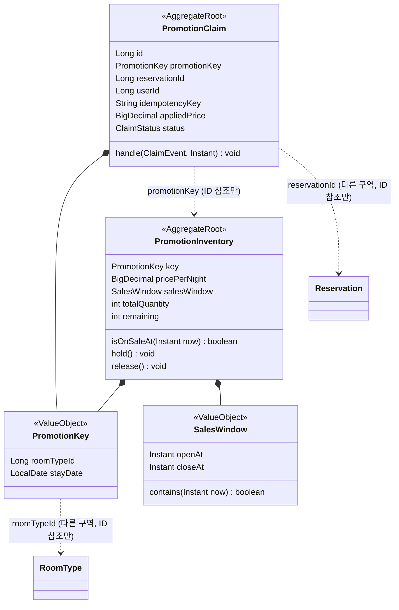
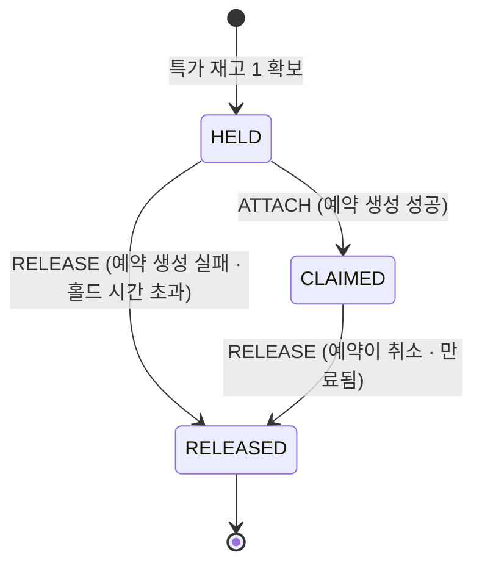
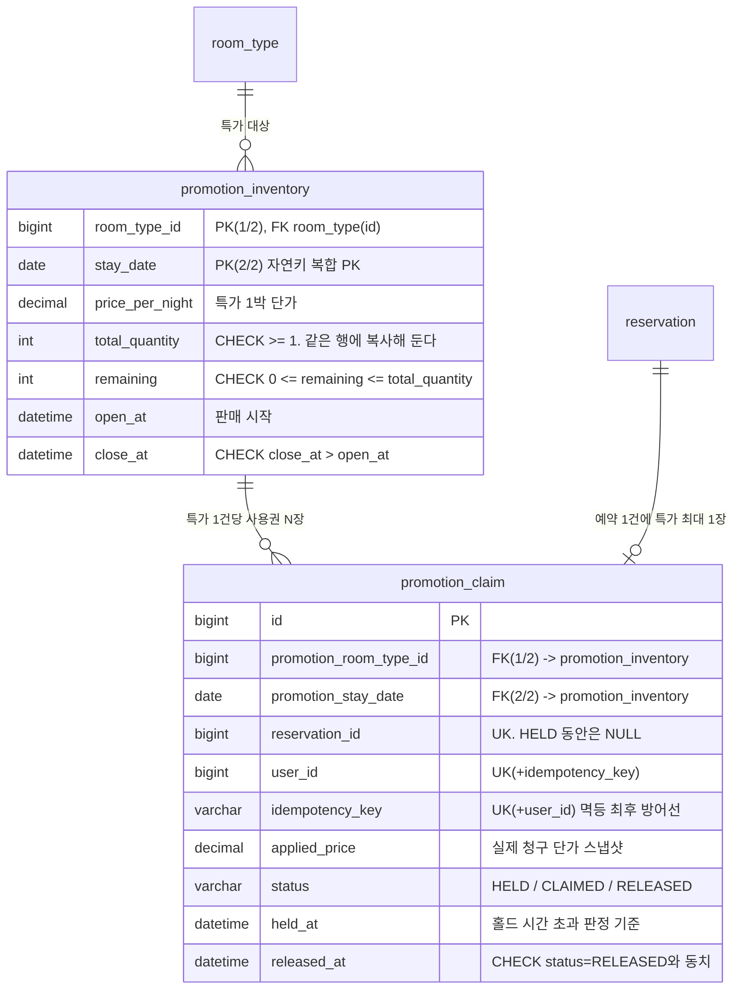
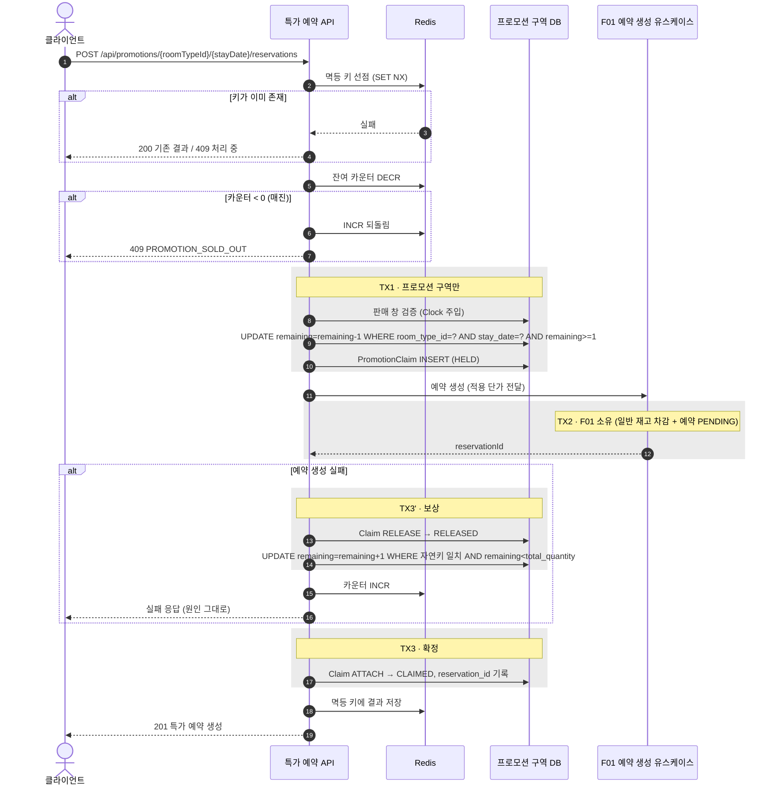
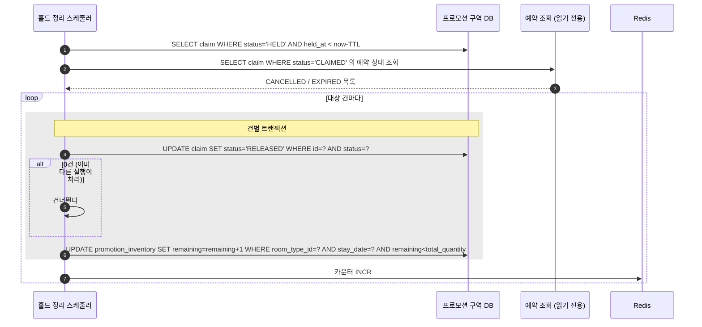

# [F02] 선착순 프로모션

- 상태: 승인 대기
- 작성일: 2026-08-15
- 승인일:

## 1. 무엇을 왜 만드는가

F01은 여러 날짜에 흩어진 재고 행을 다룬다. 경합이 있어도 요청마다 건드리는 행이 조금씩 다르다.

특가는 다르다. **오픈 시각에 수백 요청이 재고 행 딱 하나로 몰린다.** 잔여 10개짜리 특가에 500명이 같은 순간에 달려들면, 순진한 구현(조회 → 판단 → 저장)은 10개를 훨씬 넘겨 판다. 게다가 이 트래픽의 대부분은 **어차피 실패할 요청**이다. 매진된 뒤에도 계속 들어오는 요청이 DB 커넥션을 다 잡아먹으면, 특가와 무관한 일반 예약까지 같이 죽는다.

이 feature가 없으면 과제는 "여러 행에 퍼지는 경합" 한 종류만 다루고 끝난다. **한 점에 몰리는 경합은 방어 수단 자체가 달라진다**는 것을 보여주는 것이 F02의 존재 이유다.

## 2. 범위

**포함하는 것**

- UC-7 선착순 특가 예약 — 한정 수량 특가를 선착순으로 판다
- UC-7-B 특가 잔여 조회 — 오픈 대기 화면이 잔여를 폴링한다 (읽기 전용, 부하 대부분이 여기로 온다)
- UC-7-C 특가 홀드 정리 — 예약으로 이어지지 못한 홀드와, 예약이 취소·만료된 건의 특가 재고를 되돌린다 (내부 스케줄러)

**포함하지 않는 것**

| 뺀 것 | 이유 |
|---|---|
| 쿠폰 발급·사용 | 00 D5에서 범위 밖으로 확정. 대신 확장 자리만 남긴다 (D10) |
| 여러 밤에 걸친 특가 (연박 특가) | 경합점이 여러 행으로 흩어져 F01과 같은 문제가 된다. F02가 보여줄 것은 단일 행 경합이다 (D4) |
| 한 요청에 여러 객실 (수량 지정) | 위와 같은 이유. 1실 고정 (D4) |
| 프로모션 등록·수정 관리자 API | 00 D1(관리자 기능 제외). 프로모션은 Flyway 시드로 넣는다 |
| 같은 날짜·타입에 겹치는 프로모션 여러 개 | 어느 쪽이 적용되는지 정하는 규칙이 추가로 필요하다. UK로 막는다 (D9) |
| 특가 예약의 별도 취소 API | 취소는 F01의 예약 상태 전이다. F02는 그 결과를 따라가며 재고만 되돌린다 (D6) |
| 대기열(줄 세우기) | 선착순 판정을 큐로 옮기면 이 과제가 증명하려는 DB 경합 제어가 사라진다 |

## 3. 소유 범위

`docs/architecture/parallel-work.md`에 따른 선언이다.

- **소유 패키지:** `com.pms.promotion.**`
- **읽기만 하는 패키지:** `com.pms.inventory.domain`, `com.pms.reservation.domain`, `com.pms.reservation.application.port.in`
  - 다른 feature가 소유한 도메인은 **읽기만 한다.** 수정이 필요하다고 판단되면 손대지 않고 관리자에게 보고한다
- **Flyway 번호 대역:** V201 ~ V299
- **수정이 필요한 공유 파일:** `com.pms.common.exception.ErrorCode`에 2개 추가 (`PROMOTION_NOT_OPEN`, `PROMOTION_SOLD_OUT`). parallel-work의 공유 파일 절차(해당 변경만 담은 작은 커밋을 main에 먼저)를 따른다 → **D12**

### F01에 요구하는 계약과 대체안

F02는 F01 위에 얹힌다. F01 스펙이 확정되기 전에 쓰는 문서이므로, **의존 항목마다 "없으면 무엇으로 대체하는가"를 함께 적는다.** 대체안이 전부 있으므로 F01의 어떤 결정도 F02를 막지 않는다.

본문에서 F01에 의존하는 서술에는 **〔F01 재확인〕** 표시를 달았다. 전체 목록은 §13에 모았다. **표시가 붙은 것은 추정이며 확정이 아니다. F01 스펙 승인 후 대조하고, 어긋나면 이 문서를 먼저 고친 뒤 구현에 들어간다.**

| # | F01에 요구하는 것 | 근거 | 없으면 |
|---|---|---|---|
| C1 | 예약 생성 유스케이스가 `application/port/in`의 공개 인터페이스로 존재하고, F02가 호출할 수 있다 | `clean-architecture.md`가 유스케이스 인터페이스를 이미 요구한다. 사실상 보장 | 대체 불가. 이 경우에만 관리자에게 보고하고 멈춘다 |
| C2 | 예약 생성 입력(주문서)에 **적용 단가**를 넘길 자리가 있다 | 00 D5 검토 결과가 F01 스펙에 요구한 조건 | F01 예약에는 정가가 기록되고, 실제 청구 단가는 `promotion_claim.applied_price`에만 남는다. 이 불일치를 스펙과 제출 문서에 명시한다 (D7) |
| C3 | 예약 생성 결과에 `reservationId`가 포함된다 | 예약 식별자 없이는 응답을 만들 수 없다. 사실상 보장 | 대체 불가. C1과 함께 보고 대상 |
| C4 | 예약 상태를 식별자로 조회할 읽기 경로가 있다 | 홀드 정리 스케줄러가 취소·만료를 알아야 한다 | F02가 자체 읽기 전용 포트를 정의하고 `reservation` 테이블을 조회한다. **스키마도 도메인도 건드리지 않으므로 대체안이 안전하다** |
| C5 | 시드 데이터에 객실타입과 일별 재고가 있다 | 특가는 그 위에 얹힌다 | F02 시드를 `INSERT ... SELECT`로 써서 F01 시드의 식별자 값을 하드코딩하지 않는다. 이미 이렇게 쓸 것이므로 실질 의존 없음 |

## 4. 도메인 모델링

### 구역 배치

프로모션을 **재고·예약과 나란한 세 번째 구역**으로 둔다. 00 D6이 "F02 스펙 때 재검토"로 미뤄둔 항목의 결론이다 → **D1**

```
inventory (재고)            reservation (예약)          promotion (프로모션)
└ RoomDailyInventory        └ Reservation               ├ PromotionInventory
                                                        └ PromotionClaim
```

### 도메인 모델 다이어그램



| 구성 요소 | 무엇인가 | 왜 이렇게 두나 |
|---|---|---|
| `PromotionInventory` 특가 재고 | "이 객실타입의 이 날짜를, 이 가격에, 이 기간 동안, 몇 개까지" 라는 판매 약속 하나 | 잔여 수량과 판매 창이 **함께** 지켜져야 한다. 창이 닫혔으면 잔여가 남아도 팔면 안 되고, 창이 열려 있어도 잔여가 없으면 팔면 안 된다. 둘이 같은 규칙이라 한 애그리거트다 |
| `PromotionKey` 특가 식별자 | 객실타입 + 날짜 | **이 둘이 곧 특가의 자연키이자 DB의 복합 PK다.** 값으로 묶어두면 사용권도 같은 VO로 특가를 가리킬 수 있다 |
| `SalesWindow` 판매 창 | 오픈·마감 시각 | "마감이 오픈보다 빠를 수 없다"는 규칙을 담을 자리 |
| `PromotionClaim` 특가 사용권 | 특가 한 장을 잡아서 예약 한 건에 붙이기까지의 원장 | 재고를 잡은 사실과 예약에 붙은 사실은 **다른 시점에** 확정된다. 그 사이 상태를 기록할 곳이 필요하다. 쿠폰이 생기면 같은 형태로 한 줄이 더 붙는다 (D10) |

### 애그리거트

**PromotionInventory (특가 재고)**

- **불변식**
  1. `0 <= remaining <= totalQuantity` — 초과 판매도, 이중 복원도 불가능하다
  2. `totalQuantity >= 1`
  3. `salesWindow.closeAt > salesWindow.openAt`
  4. 판매 창 밖에서는 `hold()`가 성립하지 않는다
  5. **판매 창은 투숙일을 넘겨 열려 있을 수 없다** — `closeAt <= 투숙일 다음날 00:00 (KST)`. 이미 지나간 밤을 파는 일을 막는다 (D14)
- **경계 근거:** 위 표 참조. 판매 창과 잔여 수량은 하나의 판매 약속을 이루는 두 면이다
- **구성:** 루트 엔티티 `PromotionInventory`, VO `PromotionKey`(`@EmbeddedId`), VO `SalesWindow`
- **상태:** 저장하지 않는다. "예정 / 판매 중 / 매진 / 종료"는 `(now, salesWindow, remaining)`에서 계산되는 파생값이다. 저장하면 상태를 바꿔주는 스케줄러가 또 필요하고, 그 스케줄러와 실제 잔여가 어긋나는 순간이 생긴다

**PromotionClaim (특가 사용권)**

- **불변식**
  1. `(userId, idempotencyKey)`는 유일하다 — 같은 요청이 두 장을 만들 수 없다
  2. `reservationId`는 유일하다 — 한 예약에 특가가 두 번 적용될 수 없다
  3. `status = RELEASED`인 것과 `releasedAt`이 채워진 것은 동치다
  4. 상태는 아래 전이 표를 벗어날 수 없다
  5. `CLAIMED`가 되기 전에는 `reservationId`가 비어 있다
- **경계 근거:** 특가 재고와 분리한 이유는 **수명이 다르기 때문**이다. 재고 행은 프로모션당 하나이고 초당 수백 번 갱신된다. 사용권은 판매 건마다 하나씩 새로 생기고 거의 갱신되지 않는다. 한 애그리거트로 묶으면 사용권 한 장을 읽을 때마다 경합의 중심인 재고 행을 함께 잠그게 된다
- **구성:** 루트 엔티티 `PromotionClaim`, enum `ClaimStatus`, enum `ClaimEvent`

### 상태와 전이 표

`PromotionClaim`의 전이 표다. 코드의 전이 테이블과 이 표가 일치해야 한다.

| 현재 상태 | 이벤트 | 다음 상태 | 조건 | 멱등 처리 |
|---|---|---|---|---|
| HELD | ATTACH | CLAIMED | 예약 생성 성공. `reservationId`가 주어짐 | 이미 CLAIMED이고 같은 `reservationId`면 성공 처리. 다른 `reservationId`면 거부 |
| HELD | RELEASE | RELEASED | 예약 생성 실패, 또는 홀드 유효시간 초과 | 이미 RELEASED면 성공 처리 (재고는 다시 되돌리지 않는다) |
| CLAIMED | RELEASE | RELEASED | 연결된 예약이 CANCELLED 또는 EXPIRED | 이미 RELEASED면 성공 처리 |
| CLAIMED | ATTACH | — | **금지.** 같은 `reservationId`면 위의 멱등 처리로 흡수되고, 다른 값이면 불변식 2 위반 | — |
| RELEASED | ATTACH | — | **금지.** 반납된 사용권을 되살리지 않는다. 되사려면 새로 홀드한다 | — |
| RELEASED | RELEASE | RELEASED | 멱등. 재고는 되돌리지 않는다 | 성공 처리 |

표에 없는 조합은 전부 거부한다. `RELEASED`는 종료 상태다.



### 애그리거트 간 관계

ID 참조만 쓴다. `@ManyToOne`, `@OneToMany`를 쓰지 않는다.

| 들고 있는 쪽 | 들고 있는 것 | 가리키는 대상 | 구역 |
|---|---|---|---|
| `PromotionInventory` | `key.roomTypeId` | `RoomType` | inventory (다른 구역). **DB에서는 FK를 건다** — F01이 V001에서 만드는 부모 테이블이고 값이 바뀌지 않는 참조 데이터다 |
| `PromotionClaim` | `promotionKey` (객실타입 + 날짜) | `PromotionInventory` | promotion (같은 구역) |
| `PromotionClaim` | `reservationId` | `Reservation` | reservation (다른 구역) **〔F01 재확인〕** 식별자 타입 |
| `PromotionClaim` | `userId` | 사용자 (엔티티 없음. `X-User-Id` 헤더값, ADR-0006) | — |

## 5. DB 설계



### 테이블

**`promotion_inventory`** — 특가 재고. **이 테이블의 한 행이 이 feature의 모든 경합이 몰리는 지점이다.**

F01의 `room_daily_inventory`가 쓰는 두 패턴을 그대로 가져온다 (F01 세션이 PM 경유로 전달한 권고, D13).

1. **대리키 없이 자연키 복합 PK.** 대리키를 두면 재고 차감 UPDATE 한 번이 세컨더리 인덱스와 클러스터드 레코드 **두 곳을 잠근다.** 자연키면 한 곳만 잠근다. **특가 재고는 일반 재고보다 경합이 심한 행이라 이 이득이 더 크다.**
2. **`total_quantity`를 같은 행에 복사해 둔다.** `remaining <= total_quantity` CHECK를 같은 행에서 걸기 위해서다. 취소가 두 번 처리돼 재고가 총량을 넘는 사고를 DB가 직접 막는다.

| 컬럼 | 타입 | 제약 | 설명 |
|---|---|---|---|
| `room_type_id` | `bigint` | PK(1/2), FK → `room_type(id)` | 객실타입. F01이 V001에서 만든 부모 테이블을 참조만 한다 |
| `stay_date` | `date` | PK(2/2) | 특가가 적용되는 1박. **이 둘이 곧 특가의 식별자다** |
| `price_per_night` | `decimal(12,2)` | NOT NULL, CHECK `>= 0` | 특가 단가 |
| `total_quantity` | `int` | NOT NULL, CHECK `>= 1` | 한정 수량. **같은 행에 두는 이유는 아래 CHECK를 걸기 위해서다** |
| `remaining` | `int` | NOT NULL, CHECK `>= 0`, CHECK `<= total_quantity` | 잔여. 이 컬럼이 불변식의 대상 |
| `open_at` | `datetime(6)` | NOT NULL | 판매 시작 (UTC 저장) |
| `close_at` | `datetime(6)` | NOT NULL, CHECK `> open_at` | 판매 마감 (UTC 저장) |
| `created_at` | `datetime(6)` | NOT NULL | |
| `updated_at` | `datetime(6)` | NOT NULL | |

**`promotion_claim`** — 특가 사용권. 홀드부터 반납까지의 원장.

| 컬럼 | 타입 | 제약 | 설명 |
|---|---|---|---|
| `id` | `bigint` | PK, AUTO_INCREMENT | 사용권은 INSERT만 되고 갱신 경합이 없으므로 대리키를 둔다. 자연키 PK의 이득(잠금 한 곳)은 **갱신이 몰리는 행**에만 해당한다 |
| `promotion_room_type_id` | `bigint` | NOT NULL, FK(1/2) → `promotion_inventory` | 같은 구역이라 FK를 건다 |
| `promotion_stay_date` | `date` | NOT NULL, FK(2/2) → `promotion_inventory` | 위와 한 쌍 |
| `reservation_id` | `bigint` | NULL, UNIQUE | 예약 식별자. HELD 동안 NULL. 다른 구역이라 FK 없음 |
| `user_id` | `bigint` | NOT NULL | `X-User-Id` |
| `idempotency_key` | `varchar(64)` | NOT NULL | 클라이언트가 보낸 키 |
| `applied_price` | `decimal(12,2)` | NOT NULL | 홀드 시점의 특가 단가 스냅샷. 프로모션 가격이 나중에 바뀌어도 청구액은 안 바뀐다 |
| `status` | `varchar(16)` | NOT NULL | `HELD` / `CLAIMED` / `RELEASED` |
| `held_at` | `datetime(6)` | NOT NULL | 홀드 시간 초과 판정 기준 |
| `attached_at` | `datetime(6)` | NULL | CLAIMED가 된 시각 |
| `released_at` | `datetime(6)` | NULL | RELEASED가 된 시각 |

### 인덱스와 제약

| 이름 | 대상 컬럼 | 종류 | 근거 |
|---|---|---|---|
| `pk_promotion_inventory` | `promotion_inventory(room_type_id, stay_date)` | PRIMARY KEY (자연키) | 대리키를 두면 재고 차감 UPDATE가 세컨더리 인덱스와 클러스터드 레코드 두 곳을 잠근다. 자연키면 한 곳만 잠근다. **동시에 D9(날짜·타입당 특가 하나)의 유일성도 이 PK가 보장하므로 별도 UNIQUE가 필요 없다** |
| `ck_promotion_remaining_lower` | `promotion_inventory.remaining >= 0` | CHECK | **불변식 1의 최후 방어선.** 애플리케이션이 전부 뚫려도 초과 판매가 저장되지 않는다 |
| `ck_promotion_remaining_upper` | `promotion_inventory.remaining <= total_quantity` | CHECK | **이중 복원의 최후 방어선.** 스케줄러가 같은 건을 두 번 되돌리면 여기서 막힌다 |
| `ck_promotion_window` | `promotion_inventory.close_at > open_at` | CHECK | 시드 데이터 오타 방어 |
| `ck_promotion_not_past` | `promotion_inventory.close_at <= stay_date + INTERVAL 1 DAY` | CHECK | **불변식 5.** 이미 지나간 밤을 파는 일을 막는다. **F01이 `checkIn >= today`를 검증하지 않으므로 F02가 자기 규칙으로 세운다** (D14). MySQL 8.4가 이 표현을 CHECK에서 거부하면 도메인 검증 + V202 시드 검증 테스트로 대체하고, 그 사실을 스펙에 남긴다 |
| `ck_promotion_quantity` | `promotion_inventory.total_quantity >= 1` | CHECK | 0개짜리 프로모션은 의미가 없다 |
| `uk_claim_idempotency` | `promotion_claim(user_id, idempotency_key)` | UNIQUE | **멱등성의 최후 방어선.** Redis가 죽어도 같은 요청은 두 장을 만들 수 없다 |
| `uk_claim_reservation` | `promotion_claim(reservation_id)` | UNIQUE | 한 예약에 특가 두 장 적용 금지 (불변식 2). NULL은 MySQL에서 중복 허용이므로 HELD 상태 여러 건과 공존한다 |
| `ck_claim_released` | `status <> 'RELEASED' OR released_at IS NOT NULL` | CHECK | 상태와 시각이 어긋난 행을 막는다 |
| `ix_claim_sweep` | `promotion_claim(status, held_at)` | INDEX | 홀드 정리 스케줄러가 `WHERE status IN ('HELD','CLAIMED') ORDER BY held_at` 로 훑는다. 이 인덱스가 없으면 정리 배치가 풀스캔이 된다 |

**불변식을 지키는 제약:** `ck_promotion_remaining_lower`와 `ck_promotion_remaining_upper`가 3차 방어선이다. 조건부 UPDATE가 전부 뚫려도 DB가 거부한다.

### 마이그레이션 파일

| 파일 | 내용 |
|---|---|
| `V201__promotion_tables.sql` | `promotion_inventory`, `promotion_claim` 생성. 위 인덱스·CHECK 포함 |
| `V202__promotion_seed.sql` | 시연·부하테스트용 특가 시드. `INSERT ... SELECT`로 F01 시드의 `room_type` 식별자를 조회해 넣는다 (하드코딩하지 않는다). **특가 `stay_date`가 F01 재고 시드의 날짜 범위 안에 들어야 한다 〔F01 재확인 V12〕** |

시드는 최소 3건을 넣는다. 이미 열린 특가(부하테스트 즉시 실행용), 곧 열릴 특가(오픈 순간 스파이크 재현용), 이미 닫힌 특가(판매 창 밖 거부 검증용).

## 6. 유스케이스

### UC-7. 선착순 특가 예약

**입력**

| 항목 | 위치 | 설명 |
|---|---|---|
| `roomTypeId` + `stayDate` | 경로 | 특가 식별자. 대리키가 없으므로 이 둘이 곧 식별자다 (D13) |
| `X-User-Id` | 헤더 | 사용자 식별 (ADR-0006) |
| `Idempotency-Key` | 헤더 | 재시도 식별. 필수 |

수량·날짜·객실타입·가격은 **입력이 아니다.** 전부 프로모션이 정한다. 1박 1실 고정 (D4). 클라이언트가 정할 게 없다는 것이 선착순 특가의 성격이다.

**출력**

`reservationId`, `roomTypeId`, `stayDate`, `appliedPrice`, `reservationStatus`(F01이 준 값. **`PENDING`** — F01 전이 표 확정본 기준)

**도메인 모델의 변화**

| 순서 | 대상 | 변화 | 트랜잭션 |
|---|---|---|---|
| 1 | Redis 멱등 키 | `SET NX`로 선점. 처리 중 표시 | 밖 |
| 2 | Redis 잔여 카운터 | `DECR`. 결과가 음수면 즉시 `INCR`로 되돌리고 거부 | 밖 |
| 3 | PromotionInventory | 판매 창 검증 통과 후 `remaining` 1 감소 | TX1 |
| 4 | PromotionClaim | `HELD` 상태로 새로 생성. `applied_price`에 단가 스냅샷 | TX1 |
| 5 | RoomDailyInventory (해당 1일 행) | `remaining` 1 감소 **〔F01 재확인〕** | TX2 (F01 소유) |
| 6 | Reservation | `PENDING` 상태로 새로 생성 **〔F01 재확인〕** | TX2 (F01 소유) |
| 7 | PromotionClaim | `ATTACH` 이벤트 → `CLAIMED`. `reservation_id` 기록 | TX3 |
| 8 | Redis 멱등 키 | 결과 저장 (TTL 24시간) | 밖 |

5·6이 실패하면 7 대신 `RELEASE` 이벤트로 `RELEASED` 전이 + `remaining` 1 복원 + Redis `INCR`을 한다.

**왜 트랜잭션을 셋으로 나누는가 (D3)**

00 D6은 "예약 생성만 두 구역을 한 트랜잭션으로 묶는다"는 예외를 허용했다. 프로모션까지 한 트랜잭션에 넣으면 그 예외가 세 구역으로 커진다. 대신 **재고를 먼저 확보(HELD)하고 예약을 만든 뒤 확정(CLAIMED)하는 2단계**로 간다. 티켓·좌석 판매에서 쓰는 홀드 방식과 같다. 대가는 결과적 일관성이고, 그 대가는 이미 필요한 홀드 정리 스케줄러(UC-7-C)가 갚는다.

**흐름**



**실패 시나리오**

| 상황 | 응답 | 부작용 처리 |
|---|---|---|
| 프로모션 없음 | 404 `RESOURCE_NOT_FOUND` | 없음 |
| 판매 창 전·후 | 409 `PROMOTION_NOT_OPEN` | Redis 카운터를 이미 깎았다면 `INCR`로 되돌린다 |
| Redis 카운터가 음수 (매진) | 409 `PROMOTION_SOLD_OUT` | 카운터 `INCR`로 즉시 되돌린다. DB에 도달하지 않는다 |
| 조건부 UPDATE 0건 (매진) | 409 `PROMOTION_SOLD_OUT` | TX1 롤백. 카운터 `INCR` |
| 일반 재고 부족 (F01) | 409 `INSUFFICIENT_INVENTORY` | 홀드 `RELEASE` + 특가 재고 복원 + 카운터 `INCR` |
| 멱등 키 재요청 (완료된 건) | 200, 저장된 결과 그대로 | 없음. 재처리하지 않는다 |
| 멱등 키 재요청 (처리 중) | 409 `REQUEST_IN_PROGRESS` | 없음 |
| TX2 성공 직후 프로세스 죽음 | 응답 없음 (클라이언트 타임아웃) | 홀드가 `HELD`로 남는다. 정리 스케줄러가 홀드 시간 초과로 `RELEASE`. **예약은 남고 특가 재고만 반납되는 어긋남**이 발생 가능 → §10에 대응 기록 |

### UC-7-B. 특가 잔여 조회

**입력:** `roomTypeId`, `stayDate` (경로). 인증 불필요

**출력:** `roomTypeId`, `stayDate`, `pricePerNight`, `salesState`(`SCHEDULED`/`OPEN`/`SOLD_OUT`/`CLOSED`), `remaining`, `openAt`

**도메인 모델의 변화:** 없다. 읽기 전용이다.

**흐름:** Redis 잔여 카운터를 읽어 응답한다. 카운터가 없으면 DB에서 읽고 카운터를 채운다. `salesState`는 `(now, salesWindow, remaining)`에서 계산한다.

오픈 대기 화면은 이 API를 초당 여러 번 두드린다. **부하의 대부분이 여기로 온다.** DB로 직행시키면 특가 예약이 커넥션을 못 얻는다.

**실패 시나리오**

| 상황 | 응답 | 부작용 처리 |
|---|---|---|
| 프로모션 없음 | 404 `RESOURCE_NOT_FOUND` | 없음 |
| Redis 장애 | 200, DB에서 읽은 값 | 없음. 캐시는 있으면 좋은 것이지 정확성의 근거가 아니다 |

`remaining`은 **근사값**이다. Redis 카운터는 보상 도중 실제보다 작을 수 있다. 응답 스키마와 문서에 "근사값"임을 명시한다. 결코 실제보다 크지 않다는 것이 중요하다 — 작게 보이는 것은 안전한 방향이다.

### UC-7-C. 특가 홀드 정리 (내부 스케줄러)

**입력:** 없음. 고정 주기 실행 (기본 10초)

**출력:** 없음. 처리 건수 로그

**도메인 모델의 변화**

| 순서 | 대상 | 변화 |
|---|---|---|
| 1 | PromotionClaim (`HELD`이고 `held_at`이 유효시간 초과) | `RELEASE` → `RELEASED` |
| 2 | PromotionClaim (`CLAIMED`인데 연결 예약이 **`CANCELLED` 또는 `EXPIRED`**) | `RELEASE` → `RELEASED` |
| 3 | PromotionInventory | 1·2에서 전이가 실제로 일어난 건수만큼 `remaining` 복원 |
| 4 | Redis 잔여 카운터 | 같은 수만큼 `INCR` |

**순서가 중요하다.** 상태 전이를 조건부 UPDATE(`WHERE status = ...`)로 **먼저** 시도하고, 1건이 갱신됐을 때만 재고를 복원한다. 반대 순서로 하면 스케줄러가 두 번 도는 사이에 재고를 두 번 되돌린다.

**어떤 종료 상태가 반납 대상인가.** F01의 전이 표 확정본(상태 7개, 허용 전이 8개)을 기준으로 판정한다.

| F01 예약 상태 | 특가 재고 반납 | 이유 |
|---|---|---|
| `CANCELLED` | **반납한다** | 팔린 방이 다시 빈다. 특가도 다시 팔 수 있어야 한다 |
| `EXPIRED` | **반납한다** | 미결제 만료다. 결제되지 않았으니 특가를 소진한 것이 아니다 |
| `NO_SHOW` | **반납하지 않는다** | **방은 그 손님 앞으로 잡혀 있었고 재판매되지 않았다. 특가는 소진된 것이다.** F01의 일반 재고 정책(`NO_SHOW`는 복원하지 않음)과 같은 결론이며, 두 세션이 따로 판단해 같은 답에 닿았다 |
| `CHECKED_OUT` | 반납하지 않는다 | 정상적으로 소비된 예약이다 |
| `PENDING` / `CONFIRMED` / `CHECKED_IN` | 반납하지 않는다 | 종료 상태가 아니다 |

**특가 예약에만 필요한 별도 상태나 전이는 없다.** 특가 예약도 `Reservation`을 그대로 쓰고 F01의 전이 표를 그대로 따른다. 즉 **F02는 F01 소유 도메인에 어떤 변경도 요구하지 않는다.** F02가 관리하는 상태는 `PromotionClaim` 자기 것뿐이다.



**실패 시나리오**

| 상황 | 응답 | 부작용 처리 |
|---|---|---|
| 상태 전이 UPDATE 0건 | 해당 건 건너뜀 | 없음. 다른 실행이 이미 처리했다 |
| 재고 복원 UPDATE 0건 (`remaining = total_quantity`) | 경고 로그 | 없음. 이미 다 반납된 상태다. **CHECK 제약이 막은 것이므로 정상 동작** |
| Redis `INCR` 실패 | 경고 로그 | 카운터가 실제보다 작아진다. 과소 판매 방향이라 안전하다. 다음 카운터 재동기화 때 회복 |
| 예약 조회 실패 | 이번 주기 건너뜀 | 다음 주기에 재시도 |

## 7. 동시성과 멱등성

### 경합 지점

| # | 지점 | 무엇이 동시에 오는가 | 순진하게 짜면 |
|---|---|---|---|
| R1 | `promotion_inventory` **단일 행** | 오픈 순간 수백 요청이 같은 `id` 행 하나를 갱신 | 조회 → 판단 → 저장 사이에 끼어들어 잔여 10개를 수십 개 판다 |
| R2 | 같은 행에 **차감과 복원이 동시에** | 사용자 요청(`-1`)과 정리 스케줄러(`+1`)가 같은 행에서 만난다 | 복원이 늦게 반영돼 `remaining > total_quantity`가 된다 |
| R3 | `room_daily_inventory` 해당 날짜 행 | 특가 요청 + 일반 예약 요청이 같은 재고 행 | F01의 방어에 F02가 올라탄다. F02가 별도 경로로 차감하면 F01의 락이 무의미해진다 |
| R4 | `promotion_claim` UK | 더블클릭·재시도로 같은 `(userId, idempotencyKey)`가 동시에 둘 | 사용권 두 장, 재고 두 번 차감 |
| R5 | 정리 스케줄러 인스턴스 둘 | 같은 claim을 동시에 `RELEASE` | 재고를 두 번 되돌린다 |

### 방어 전략

| 계층 | 수단 | 무엇을 막는가 | 뚫리면? |
|---|---|---|---|
| 1차 | **Redis 잔여 카운터 게이트** (`DECR`, 음수면 `INCR` 후 거부) | R1의 **초과 트래픽**. 매진 뒤 밀려오는 요청이 DB에 도달하지 못하게 한다 | 2차가 막는다. **정확성은 그대로, 처리량만 떨어진다** |
| 2차 | **DB 조건부 UPDATE** `SET remaining=remaining-1 WHERE room_type_id=? AND stay_date=? AND remaining>=1` | R1의 **초과 판매**. 읽고-판단하고-쓰는 세 단계를 한 단계로 줄인다. 자연키 PK로 바로 찾으므로 잠기는 곳이 클러스터드 레코드 하나뿐이다 | 3차가 막는다 |
| 2차 | **DB 조건부 UPDATE** `SET status='RELEASED' WHERE id=? AND status=?` | R5의 이중 복원. 전이가 1건 성공한 실행만 재고를 되돌린다 | 3차가 막는다 |
| 2차 | F01의 예약 생성 유스케이스를 **그대로 호출** | R3. 일반 재고에 대해서는 F01의 분산락·조건부 UPDATE를 그대로 쓴다. **F02는 자기 경로를 만들지 않는다** | F01의 3차 방어 |
| 3차 | **DB CHECK** `remaining >= 0` | 초과 판매의 저장 | 없음. 최후 방어선 |
| 3차 | **DB CHECK** `remaining <= total_quantity` | R2·R5의 이중 복원 저장 | 없음. 최후 방어선 |
| 3차 | **DB UNIQUE** `(user_id, idempotency_key)` | R4. Redis가 죽어도 사용권은 한 장 | 없음. 최후 방어선 |
| 3차 | **DB UNIQUE** `(reservation_id)` | 한 예약에 특가 두 장 | 없음. 최후 방어선 |

**왜 1차가 분산락이 아닌가 (D5).** 잔여 10개에 500요청이 몰릴 때 `lock:promotion:{id}` 하나로 직렬화하면, 이미 매진된 뒤에도 490개 요청이 락을 순서대로 기다렸다가 DB를 한 번씩 두드린다. 락은 **경합을 줄이는 게 아니라 줄 세우는** 수단이다. 선착순에서 필요한 것은 줄 세우기가 아니라 **일찍 자르기**다. Redis `DECR`은 원자적이라 락 없이 "몇 번째 요청인가"를 O(1)로 판정하고, 매진 뒤 요청은 DB에 닿지도 않는다.

프로모션 재고는 **행이 하나**라서 락 순서 문제가 없고, 조건부 UPDATE 한 줄이면 원자성이 완결된다. 락으로 얻을 것이 없다.

**1차를 껐을 때도 불변식이 지켜지는 증명.** 카운터 게이트를 비활성화하는 설정 스위치(`promotion.gate.enabled=false`)를 두고, 동시성 테스트 S2를 그 상태로 돌린다. 성공 건수가 여전히 정확히 재고 수와 같으면 2차가 혼자서도 막는다는 뜻이다. Redis 장애 = 이 상태다.

### 락 순서

**F02는 새 락을 도입하지 않는다.** 프로모션 재고는 조건부 UPDATE로 끝나고, 일반 재고 락은 F01이 자기 규약대로 잡는다. **〔F01 재확인〕** — F01이 실제로 일반 재고에 분산락을 쓰는지, 조건부 UPDATE만 쓰는지에 따라 이 문단의 서술이 달라진다. 어느 쪽이든 F02는 F01 진입점을 그냥 부르므로 설계는 바뀌지 않는다.

그럼에도 자원 획득 순서는 고정한다. **프로모션 재고 → (F01 진입) → 일반 재고 → 예약** 순서다. F01은 프로모션 자원을 절대 건드리지 않으므로 역방향 경로가 존재하지 않고, 따라서 순환 대기가 성립하지 않는다.

**트랜잭션을 나눈 것이 락 규칙과도 맞는다.** F01의 분산락은 F01 자신의 트랜잭션 안에서 시작하고 끝난다. F02가 자기 트랜잭션을 열어둔 채 F01을 부르면 "락을 트랜잭션 안에서 잡는" 형태가 되어 `coding-rules.md`의 락 규칙을 어기게 된다. TX1을 먼저 커밋하고 F01을 부르는 구조라 이 문제가 생기지 않는다.

### 멱등성

- **멱등성 키 형식:** 클라이언트가 `Idempotency-Key` 헤더로 보낸다. Redis 키는 `promotion:idem:{userId}:{key}`
- **유효 기간:** 24시간
- **재요청 시 응답:** 저장된 결과를 그대로 200으로 반환한다. 재처리하지 않는다
- **처리 중 재요청 시 응답:** 409 `REQUEST_IN_PROGRESS`
- **Redis가 죽으면:** 게이트도 멱등 선점도 무력화된다. 그래도 `uk_claim_idempotency`가 두 번째 사용권 INSERT를 거부하고, 이를 `DuplicateRequestException` → 409로 변환한다. **정확성은 DB가 지키고 Redis는 속도만 담당한다**
- **F01로 내려보내는 멱등 키:** F02가 받은 키를 그대로 쓰지 않고 `promo-{claimId}`로 파생해 넘긴다. `claimId`는 TX1에서 확정되므로 재시도해도 같은 값이 나오고, 사용자가 일반 예약에 같은 키를 썼을 때와 충돌하지 않는다

## 8. API

특가에 대리키가 없으므로 경로가 곧 자연키다 (D13).

| 메서드 | 경로 | 설명 |
|---|---|---|
| POST | `/api/promotions/{roomTypeId}/{stayDate}/reservations` | 선착순 특가 예약 (UC-7) |
| GET | `/api/promotions/{roomTypeId}/{stayDate}` | 특가 잔여·판매 상태 조회 (UC-7-B) |

### POST /api/promotions/{roomTypeId}/{stayDate}/reservations

요청

```
POST /api/promotions/3/2026-09-12/reservations
X-User-Id: 42
Idempotency-Key: 6f1c2a90-3f0f-4c1e-9d0c-2b1e5f8a1234
```

본문 없음. 수량·날짜·가격은 프로모션이 정한다.

응답 201

```json
{
  "reservationId": 10231,
  "roomTypeId": 3,
  "stayDate": "2026-09-12",
  "appliedPrice": 79000.00,
  "reservationStatus": "PENDING"
}
```

응답 409 (매진)

```json
{
  "code": "PROMOTION_SOLD_OUT",
  "message": "특가가 모두 소진되었습니다",
  "traceId": "..."
}
```

응답 409 (판매 창 밖)

```json
{
  "code": "PROMOTION_NOT_OPEN",
  "message": "아직 판매 시작 전이거나 이미 종료된 특가입니다",
  "traceId": "..."
}
```

### GET /api/promotions/{roomTypeId}/{stayDate}

응답 200

```json
{
  "roomTypeId": 3,
  "stayDate": "2026-09-12",
  "pricePerNight": 79000.00,
  "salesState": "OPEN",
  "remaining": 4,
  "remainingIsApproximate": true,
  "openAt": "2026-09-01T12:00:00Z",
  "closeAt": "2026-09-10T12:00:00Z"
}
```

### 추가하는 에러 코드 (공유 파일)

| 코드 | HTTP | 의미 |
|---|---|---|
| `PROMOTION_NOT_OPEN` | 409 | 판매 창 밖 |
| `PROMOTION_SOLD_OUT` | 409 | 잔여 없음 |

프로모션 없음은 기존 `RESOURCE_NOT_FOUND`, 멱등 충돌은 기존 `DUPLICATE_REQUEST`/`REQUEST_IN_PROGRESS`, 일반 재고 부족은 F01이 던지는 `INSUFFICIENT_INVENTORY`를 그대로 쓴다. 새 코드는 둘로 끝낸다 (D12).

## 9. 테스트 계획

| 계층 | 무엇을 검증하는가 |
|---|---|
| 도메인 단위 | `PromotionClaim` 전이 표 **전수 검증**(허용 3종 + 금지 조합 전부), `SalesWindow.contains` 경계값(openAt 정각 포함·closeAt 정각 제외), `PromotionInventory.hold()`가 잔여 0에서 실패, `PromotionKey` 생성 규칙 |
| 유스케이스 | UC-7 정상 흐름, 판매 창 밖 거부, 매진 거부, F01 실패 시 홀드 반납, 멱등 재요청 시 재처리 없음. F01 유스케이스는 가짜 구현으로 갈아끼운다 |
| 영속성 통합 | V201·V202 마이그레이션 적용, CHECK 4종이 실제로 거부하는지(`remaining = -1`, `remaining = total+1` 직접 INSERT), UNIQUE 2종, 조건부 UPDATE 반환 행 수 |
| 동시성 | 아래 표 |
| 스케줄러 통합 | 홀드 시간 초과 반납, 취소된 예약의 반납, 이미 RELEASED인 건 재반납 안 함 |

### 9-1. 동시성 테스트 시나리오

한눈에 보는 표다. 상세 설계는 바로 아래에 있다.

| # | 시나리오 | 스레드 | 특가 재고 | 일반 재고 | 기대 결과 |
|---|---|---|---|---|---|
| S1 | 매진까지 동시 요청 | 200 | 10 | 충분(100) | 성공 정확히 10, 나머지 190은 409 `PROMOTION_SOLD_OUT`. `remaining = 0`. 생성된 `Reservation` 10건 |
| S2 | **1차 방어를 끈 상태로 S1 반복** | 200 | 10 | 충분(100) | S1과 동일. 카운터 게이트 없이도 초과 판매 0건. **이 테스트가 통과하지 못하면 F02는 완성이 아니다** |
| S3 | 일반 재고가 먼저 마르는 경우 | 100 | 20 | 5 | 성공 5건. 특가 `remaining = 15`(홀드 15건이 전부 반납됨). `remaining <= total_quantity` 유지 |
| S4 | 같은 사용자·같은 멱등 키 폭주 | 100 | 10 | 충분 | 사용권 1장, 예약 1건, 특가 `remaining = 9` |
| S5 | 같은 사용자·**다른** 멱등 키 동시 2회 | 2 | 10 | 충분 | 사용권 2장. 유니크 제약은 키가 다르면 막지 않는다 (D8의 결과를 못박는 테스트) |
| S6 | 판매 창 밖 폭주 | 200 | 10 | 충분 | 성공 0건, 전부 409 `PROMOTION_NOT_OPEN`. `remaining = 10` 불변 |
| S7 | 차감과 반납이 동시에 (이중 복원 검출) | 청구 50 + 반납 10 동시 | 10 | 충분 | `remaining`이 `total_quantity`를 넘지 않는다. 반납분이 정확히 한 번씩만 더해진다 |
| S8 | 오픈 시각 동시 진입 | 300 (오픈 직전 대기) | 10 | 충분 | 오픈 전 요청 전부 거부, 오픈 후 정확히 10건 성공 |

**공통 규약**

- `CountDownLatch` 하나로 전 스레드를 동시에 출발시킨다. **`Thread.sleep`으로 타이밍을 맞추지 않는다** (금지 목록)
- 성공 건수는 응답 코드 집계로, 최종 상태는 **DB 직접 조회**로 확인한다. 애플리케이션이 보고한 값을 믿지 않는다
- 매 시나리오 끝에 **불변식 두 개를 항상 확인한다**: `remaining >= 0`, `remaining <= total_quantity`
- 시각은 주입한 `Clock`으로 고정한다. 판매 창 안/밖은 실제 대기가 아니라 `Clock`을 옮겨 만든다
- Testcontainers로 MySQL 8.4·Redis 7.4를 띄운다. H2 금지

**상세 설계 — PM이 지목한 세 가지**

**S1 (+S2). 특가 N실에 N보다 많은 스레드가 동시 진입**

| 항목 | 내용 |
|---|---|
| 준비 | 특가 `total_quantity = remaining = 10`, 판매 창 안. 일반 재고 100. 사용자 200명, 각자 다른 `Idempotency-Key` |
| 실행 | 200 스레드가 래치 해제와 동시에 `POST /api/promotions/{roomTypeId}/{stayDate}/reservations` |
| 검증 | ① 201 응답이 **정확히 10건** ② 409 `PROMOTION_SOLD_OUT`이 190건 ③ `promotion_inventory.remaining = 0` ④ `promotion_claim`에 `CLAIMED` 10건, `HELD` 0건 ⑤ `Reservation` 10건 ⑥ **`remaining`이 한 번도 음수로 내려가지 않았다** — CHECK 위반 예외가 로그에 없어야 한다 |
| 실패하면 무슨 뜻인가 | 성공이 10을 넘으면 조건부 UPDATE가 원자적이지 않다는 뜻. 10보다 적으면 정상 요청이 잘못 거절된 것(카운터 게이트가 과도하게 자름) |
| S2 차이 | `promotion.gate.enabled=false`로 두고 그대로 반복. **기대 결과가 S1과 완전히 같아야 한다.** 다르면 정확성이 Redis에 의존하고 있다는 뜻이고, 그건 Redis가 죽으면 초과 판매가 난다는 뜻이다 |

**S4. 같은 사용자가 같은 특가에 동시 2회 청구 (유니크 제약 검증)**

| 항목 | 내용 |
|---|---|
| 준비 | 특가 `remaining = 10`. 사용자 1명. **같은 `Idempotency-Key`** |
| 실행 | 100 스레드가 동시에 같은 요청. (최소 형태는 2 스레드. 100은 경합 폭을 키운 것) |
| 검증 | ① `promotion_claim` 행이 **정확히 1개** ② `Reservation`이 1건 ③ `remaining = 9` ④ 응답은 201 한 건 + 나머지는 200(저장된 결과) 또는 409 `REQUEST_IN_PROGRESS`. **500은 하나도 없어야 한다** |
| 추가 회차 | **Redis를 끈 상태로 반복한다.** 멱등 선점이 없어도 `uk_claim_idempotency`가 두 번째 INSERT를 거부해 결과가 같아야 한다. 이때 응답은 409 `DUPLICATE_REQUEST`로 변환되어야 하고, 제약 위반 예외가 그대로 새어나가 500이 되면 실패다 |
| 실패하면 무슨 뜻인가 | 행이 2개면 최후 방어선인 유니크 제약이 없거나 키 조합이 틀린 것. 500이 나오면 제약 위반을 도메인 예외로 변환하지 않은 것 |

**S7. 특가 예약 취소와 다른 사용자의 청구가 동시에 (이중 복원 검출)**

| 항목 | 내용 |
|---|---|
| 준비 | 특가 `total_quantity = 10`, `remaining = 0` (10건 전부 `CLAIMED`). 그중 10건의 연결 예약을 `CANCELLED`로 만들어 둔다 |
| 실행 | ① 정리 스케줄러를 **두 인스턴스 동시에** 돌린다(같은 10건을 노린다) ② 동시에 새 사용자 50명이 청구를 시도한다 |
| 검증 | ① `promotion_claim`의 `RELEASED`가 **정확히 10건** (같은 건이 두 번 반납되지 않음) ② 전 구간에서 `remaining <= total_quantity = 10` ③ 최종 `remaining = 10 - (새로 CLAIMED 된 건수)` ④ `remaining <= total_quantity` CHECK 위반이 **한 번도 발생하지 않았다** |
| 실패하면 무슨 뜻인가 | `remaining`이 10을 넘으면 상태 전이 조건부 UPDATE 없이 재고를 되돌렸다는 뜻이다. CHECK가 잡아서 예외가 났다면 3차 방어선은 살아 있지만 2차가 뚫린 것이므로 **여전히 결함**이다. 3차에 의존해 통과시키지 않는다 |
| 왜 이 시나리오가 필요한가 | 반납은 "상태 전이 성공 1건 → 재고 +1"의 순서로만 안전하다. 순서를 뒤집거나 전이 결과를 확인하지 않으면 스케줄러가 두 번 도는 사이 재고가 두 번 늘어난다. **단일 스레드 테스트로는 절대 안 잡힌다** |

**나머지 시나리오 요지**

- **S3**: 일반 재고 5, 특가 20. 성공 5건 후 나머지 홀드가 전부 반납되어 특가 `remaining = 15`로 수렴하는지. **보상 경로가 실제로 도는지 확인하는 유일한 시나리오다**
- **S5**: 같은 사용자·다른 키로 동시 2건 → 둘 다 성공. D8(1인 제한 없음)이 의도된 동작임을 코드로 못박는다. 나중에 제한을 넣게 되면 이 테스트가 먼저 빨개진다
- **S6**: 판매 창 밖 200요청 → `remaining` 불변. 게이트가 시각을 보지 않는다는 한계(§10)를 드러내는 자리이기도 하다
- **S8**: `Clock`을 오픈 직전으로 두고 300 스레드를 대기시킨 뒤 오픈 이후로 옮긴다. 오픈 전 요청은 전부 `PROMOTION_NOT_OPEN`, 이후 정확히 10건 성공

### 9-2. TDD 실패 테스트 목록 (구현 착수 순서)

승인 직후 이 순서대로 **빨간 테스트부터** 쓴다. 위에서 아래로 갈수록 바깥 계층이다.

| 순번 | 테스트 | 먼저 빨개지는 이유 |
|---|---|---|
| T1 | `SalesWindow`가 `closeAt <= openAt`이면 생성 거부 | VO 자체가 없다 |
| T2 | `SalesWindow.contains`가 `openAt` 정각은 포함, `closeAt` 정각은 제외 | 경계 규칙 미정의 |
| T3 | `PromotionKey`가 `roomTypeId`·`stayDate` 없이 생성 거부 | VO 없음 |
| T4 | `PromotionInventory`가 `totalQuantity < 1`이면 생성 거부 | 불변식 2 |
| T5 | `hold()`가 `remaining = 0`에서 실패 | 불변식 1 |
| T6 | `hold()`가 판매 창 밖에서 실패 (주입한 `now`로) | 불변식 4 |
| T7 | `release()`가 `remaining = totalQuantity`에서 실패 | 이중 복원 금지 |
| T8 | `ClaimStateMachine` 허용 전이 3종이 표대로 동작 | 전이 테이블 없음 |
| T9 | **`ClaimStateMachine` 금지 조합 전수 거부** (3상태 × 2이벤트 중 표에 없는 전부) | 표 밖 전이 금지 |
| T10 | `HELD → ATTACH` 두 번, 같은 `reservationId`면 멱등 성공 / 다른 값이면 거부 | 멱등 규칙 |
| T11 | `RELEASED → RELEASE`가 멱등 성공하되 재고를 다시 되돌리지 않음 | 멱등 규칙 |
| T12 | V201 마이그레이션 적용 후 `remaining = -1` 직접 INSERT가 거부됨 | CHECK 하한 |
| T13 | `remaining = total_quantity + 1` 직접 INSERT가 거부됨 | CHECK 상한 |
| T14 | 같은 `(user_id, idempotency_key)` 두 번 INSERT가 거부됨 | 멱등 최후 방어선 |
| T15 | 같은 `reservation_id` 두 번 INSERT가 거부됨 | 한 예약 한 특가 |
| T16 | 같은 `(room_type_id, stay_date)` 특가 두 번 INSERT가 거부됨 | 복합 PK = D9 |
| T16b | `close_at`이 투숙일 다음날 00:00을 넘는 특가 INSERT가 거부됨 | 불변식 5 = D14. **CHECK가 안 걸리면 이 테스트가 도메인 검증만으로 통과하는지 확인한다** |
| T16c | V202 시드의 세 특가 투숙일이 전부 재고 범위(2026-08-01~10-29) 안에 있음 | **V12가 되살아나는 것을 막는 회귀 테스트** |
| T17 | 조건부 차감 UPDATE가 `remaining = 0`에서 **0행**을 반환 | 매진 판정의 근거 |
| T18 | 조건부 반납 UPDATE가 `remaining = total_quantity`에서 **0행**을 반환 | 이중 복원 판정 |
| T19 | UC-7 정상 흐름: 홀드 → 예약 → `CLAIMED`, 응답 201 | 유스케이스 없음 |
| T20 | F01 예약 생성이 실패하면 홀드가 `RELEASED`가 되고 `remaining`이 복원됨 | 보상 경로 |
| T21 | 판매 창 밖 요청이 409 `PROMOTION_NOT_OPEN` | 에러 매핑 |
| T22 | 매진 요청이 409 `PROMOTION_SOLD_OUT` | 에러 매핑 |
| T23 | 같은 멱등 키 재요청이 **재처리 없이** 저장된 결과 반환 | 멱등 |
| T24 | 정리 스케줄러가 홀드 시간 초과분을 반납 | 스케줄러 |
| T25 | 정리 스케줄러가 `CANCELLED`·`EXPIRED` 연결분을 반납하고 **`NO_SHOW`는 반납하지 않음** | 반납 대상 판정 |
| T26 | 이미 `RELEASED`인 건을 스케줄러가 다시 반납하지 않음 | 멱등 |
| T27~ | 동시성 S1~S8 (9-1) | 마지막. **단일 스레드 테스트가 다 초록이 된 뒤에 쓴다** |

**T9와 T27 이후가 이 목록의 핵심이다.** 나머지는 이 둘을 쓸 수 있는 상태를 만드는 과정이다.

### 9-3. F04에 넘길 특가 시드 값

F04의 특가 스파이크 시나리오가 이 숫자에 의존한다. **F01 시드 데이터 계약(2026-08-15 확정)에 맞춰 절대 날짜로 확정했다.** 상대 날짜(`D+30` 같은 표기)는 "`D`가 무엇인가"라는 질문을 다시 만들므로 쓰지 않는다.

**전제 — F01 시드 계약 확정본**

- 재고 날짜 범위: **2026-08-01 ~ 2026-10-29** (90일, 양끝 포함, 고정 절대 날짜. `CURDATE()` 기반 아님)
- 객실타입: id=1 스탠다드(100실, 150,000) / id=2 디럭스(50실, 250,000) / id=3 스위트(10실, 600,000) / id=4 오션뷰 스탠다드(80실, 180,000) / id=5 오션뷰 스위트(20실, 450,000)
- 초기 `remaining`은 전부 `total_quantity`와 같다. 줄여둔 날짜 없음 (5종 × 90일 = 450행)

**특가 시드 확정값**

| 프로모션 | 대상 객실타입 | 투숙일 | 정가 | 특가 단가 | 한정 수량 | 판매 창 (KST) | 용도 |
|---|---|---|---|---|---|---|---|
| **P1** 열린 특가 | **id=1 스탠다드** (100실) | **2026-09-14** | 150,000 | **75,000** (50%) | **20** | 2026-08-01 00:00 ~ 2026-09-15 00:00 | **F04 스파이크의 대상.** 특가 20실에 3초간 8000건 |
| **P2** 예정 특가 | id=1 스탠다드 (100실) | **2026-09-15** | 150,000 | 75,000 (50%) | 20 | 2026-09-01 00:00 ~ 2026-09-16 00:00 | 오픈 순간 진입(S8) 재현용 |
| **P3** 닫힌 특가 | **id=2 디럭스** (50실) | **2026-09-16** | 250,000 | 150,000 (60%) | 10 | 2026-08-01 00:00 ~ 2026-08-10 00:00 | 판매 창 밖 거부(S6) 검증용 |

**날짜를 이렇게 고른 이유**

- 셋 다 시드 범위(08-01~10-29) **한가운데**라 양끝 경계 문제가 없다
- 체크인·노쇼 시연 구간(08-14~08-17)과 멀어 F01 시나리오와 겹치지 않는다
- F04가 일반 경합 시나리오에 쓸 9월 초와도 떨어져 있다

**객실타입을 이렇게 고른 이유**

- **P1이 id=1 스탠다드(100실)인 것이 핵심이다.** 특가 20실을 빼도 그날 일반 재고가 80 남는다. 만약 총 20실짜리 타입에 20실 특가를 열면 **특가가 그날 일반 재고를 통째로 먹어서, F04가 재는 것이 특가 경합인지 일반 재고 고갈인지 구분되지 않는다.** "정확히 20건"이라는 결과가 어느 방어선 때문인지 증명할 수 없으면 그 실험은 의미가 없다. 시드 5종 중 이 조건(그날 일반 재고 ≥ 100)을 만족하는 것은 id=1뿐이다
- **id=3 스위트(10실)는 비워둔다.** F04가 일반 예약 경합 실험에 쓰는 타입이라 특가를 겹치면 두 실험이 서로 간섭한다
- P3는 id=2 디럭스로 뒀다. 성능 측정 대상이 아니라 거부 응답 검증용이므로 수량 여유가 필요 없다

**그 밖**

- V202 시드는 `INSERT ... SELECT`로 객실타입을 이름으로 찾아 넣는다. **위 id 값에 의존하지 않는다.** F01이 나중에 id를 바꿔도 F02 시드는 그대로 동작한다
- 부하테스트용 사용자 식별자(`X-User-Id`) 규약도 F01 시드 계약을 따른다
- **k6 스파이크는 P1(이미 열린 특가)에 때린다.** P2의 "오픈 순간"은 통합 테스트에서 주입한 `Clock`을 옮겨 재현하고, k6에서는 VU 급증으로 같은 형태를 만든다. 프로모션 오픈 시각을 실제 벽시계에 맞추면 부하테스트 실행 시각에 시드가 묶여버린다

### 9-4. k6 부하 시나리오(F04 소유)에 넘길 것

- 오픈 순간 스파이크: 0 → 500 VU 급증
- 잔여 조회 폴링과 예약 요청의 혼합 비율. **부하의 대부분은 조회(UC-7-B)로 온다**
- **D2가 승인되면 합격 판정식에 "그날 총 판매량 ≤ 총 객실 수"를 추가할 수 있다** (D1 트레이드오프 표 참조)

## 10. 구현 시 주의사항

**F01 병합 전에 코드를 쓰지 않는다.** 이 스펙은 F01 스펙 확정 전에 쓰였다. F01 스펙이 나오면 §3의 C1~C5를 대조하고, 어긋나면 이 문서를 먼저 고친다.

**F02를 통째로 들어내도 F01이 돌아야 한다** (00 D4: F02는 절단 후보 3순위). F01 코드에 F02가 없으면 동작하지 않는 변경을 심지 않는다. 의존 방향은 항상 F02 → F01 한 방향이다.

**TX1에서 애그리거트 둘을 함께 수정한다.** `PromotionInventory`(재고 차감)와 `PromotionClaim`(홀드 생성)은 같이 성공하거나 같이 실패해야 한다. 재고만 줄고 사용권이 없으면 무엇을 되돌려야 할지 알 방법이 없다. `ddd.md`가 요구한 대로 명시한다 → **D11**

**TX2 성공 직후 프로세스가 죽는 틈이 있다.** 예약은 만들어졌는데 홀드가 `HELD`로 남는다. 정리 스케줄러는 홀드 시간 초과로 이를 반납하므로, **예약은 특가로 잡혀 있는데 특가 재고는 반납된 상태**가 만들어질 수 있다. 대응은 스케줄러에서 `HELD` 만료 처리 전에 **연결 후보 예약이 있는지 먼저 확인**하는 것이다. 파생 멱등 키 `promo-{claimId}`로 F01에 조회하면 그 예약을 찾을 수 있으므로, 찾으면 반납이 아니라 `ATTACH`로 마무리한다. 찾지 못했을 때만 반납한다. 이 틈은 완전히 없앨 수 없고(F01과 F02가 다른 트랜잭션이므로), 남는 창의 폭을 줄이는 것이 최선이다. 제출 문서에 이 한계를 정직하게 쓴다.

**Redis 카운터는 정확성의 근거가 아니다.** 카운터가 실제보다 작아지는 것(과소 판매)은 허용하고, 커지는 것은 허용하지 않는다. 그래서 `DECR` 후 실패하면 반드시 `INCR`로 되돌리고, `INCR`이 실패하면 로그만 남기고 넘어간다. 카운터를 DB 기준으로 다시 맞추는 것은 애플리케이션 기동 시 워머가 한다.

**시간은 주입받는다.** 도메인 안에서 `Instant.now()`를 부르지 않는다. `SalesWindow.contains(now)`처럼 파라미터로 받는다. `open_at`·`close_at`은 UTC로 저장하고, 사람이 읽는 값(시드·문서)은 `Asia/Seoul` 기준으로 표기한다. Testcontainers는 UTC, 로컬은 KST라 이걸 고정하지 않으면 만료 판정이 환경마다 9시간 어긋난다 (F01 업계 정합성 검토 2번 항목과 같은 함정).

**판매 창 밖 트래픽은 DB까지 온다.** 카운터 게이트는 잔여만 보고 시각은 보지 않는다. 오픈 대기 트래픽은 1차에서 걸리지 않고 TX1의 판매 창 검증에서 거부된다. 이 한계를 알고 부하테스트에서 측정한다. 오픈 대기 트래픽은 잔여 조회 API(UC-7-B)로 유도하는 것이 설계 의도다.

**조건부 UPDATE의 반환 행 수를 반드시 확인한다.** `remaining >= 1`을 통과했는지는 갱신 행 수로만 알 수 있다. 0건이면 매진이다. 예외를 삼키지 않는다.

**정리 스케줄러는 건별 트랜잭션으로 돈다.** 한 건이 실패해도 나머지가 진행되어야 하고, 배치 전체를 한 트랜잭션으로 묶으면 경합 중인 재고 행을 오래 잠근다.

## 11. 결정 검토란

이 문서를 쓰면서 작성자가 내린 결정입니다. 항목 번호로 동의 여부를 알려주세요. 전부 동의해야 승인입니다.

**등급 안내.** 12개가 같은 무게가 아닙니다. 등급으로 나눴으니 위에서부터 보시면 됩니다.

| 등급 | 뜻 | 해당 항목 |
|---|---|---|
| **[필수]** | 뒤집히면 스펙을 다시 써야 한다. 여기에 시간을 쓰시면 된다 | D1, D2, D3, D5 |
| **[확인]** | 판단은 섰다. 동의만 받으면 된다 | D4, D6, D7, D8, D10, D14 |
| **[참고]** | 기록용. 반대가 없으면 그대로 간다 | D9, D11, D12, D13 |

**[필수] 네 항목은 서로 물려 있습니다.** D2가 "특가도 일반 재고를 차감한다"로 정해졌기 때문에 예약 생성이 세 구역에 걸치게 되고, 그 비용을 D3(홀드 2단계)이 갚습니다. D1만 따로 보시면 판단이 어렵습니다. **D1 → D2 → D3 순서로 읽어주세요.**

### D1. [필수] 프로모션을 재고·예약과 나란한 세 번째 구역으로 분리한다

- **결정:** 코드를 재고·예약 두 구역이 아니라 **재고·예약·프로모션 세 구역**으로 나눈다. 프로모션 구역은 자기 규칙("특가 잔여가 0 밑으로 내려가지 않는다", "판매 창 밖에서는 팔지 않는다")만 책임진다.
- **이유:** 00 문서 안에서 두 절이 서로 다른 그림을 그리고 있어 이걸 정리해야 한다. §4 도메인 개요는 특가 재고를 재고 구역 안에 그렸고, §5 feature 분할 표는 F02에게 `promotion.**` 패키지를 배정했다. 병렬 작업 규칙상 F01이 소유한 재고 구역을 F02가 고칠 수 없으므로, 특가 재고를 재고 구역에 두면 **F02가 자기 것을 만들 자리가 없어진다.** 그리고 특가의 규칙(판매 창, 선착순)은 일반 재고에 없는 규칙이라 섞어두면 재고 구역이 두 가지 일을 하게 된다.
- **트레이드오프 (핵심. 이것 때문에 [필수]입니다):**

  **특가로 팔린 방도 실제 객실 하나를 차지한다.** 그래서 특가 예약은 특가 재고와 일반 재고를 둘 다 줄여야 한다(D2). 차감하지 않으면 같은 방을 특가로도 팔고 일반가로도 파는 셈이 되고, 그건 이 과제가 막겠다고 선언한 바로 그 초과 판매다.

  그런데 특가 재고를 별도 구역에 두면, 예약 하나를 만드는 일이 **promotion·inventory·reservation 세 구역**에 걸친다. 00 D6이 승인받은 예외는 "예약 생성**만** 두 구역을 한 묶음으로"였다. 세 구역으로 늘리면 그 예외를 확대하는 것이고, 그건 다시 물어야 하는 일이다.

  **이 답이 부하테스트에서 증명할 수 있는 명제를 바꾼다.** F04 세션이 특가 스파이크 시나리오를 설계하다 독립적으로 같은 지점에 막혀 질문을 올렸다(F04 Q7). 서로 모르는 두 세션이 같은 구멍에 빠졌다는 것은 여기가 이 설계의 급소라는 뜻이다.

  | 특가가 일반 재고를 | F04가 증명할 수 있는 것 |
  |---|---|
  | 차감하지 않으면 | "특가 성공이 정확히 20건" — 그것뿐이다 |
  | **차감하면** | "특가 성공이 정확히 20건 **그리고** 그날 총 판매량이 총 객실 수를 넘지 않았다" |

  아래쪽이 훨씬 강한 명제이고, **그게 00 §1이 막겠다고 선언한 초과 판매 그 자체다.** 특가 20실에 3초간 8000건을 때리는 상황에서 총 판매량이 총 객실 수 안에 있었다는 것은, 스파이크 한가운데서도 재고 불변식이 지켜졌다는 뜻이다.

  **F02는 예외를 확대하지 않는 쪽을 골랐다.** 한 트랜잭션으로 묶는 대신 홀드 2단계(D3)로 처리한다. 각 트랜잭션은 자기 구역만 고친다. 즉 **D1의 비용은 "예외 확대"가 아니라 "결과적 일관성과 정리 스케줄러"로 치환된다.** 그 대가는 D3에 적어두었다.

  나머지 비용: 구역이 셋으로 늘어 전체 그림이 복잡해진다. "재고"라는 말이 두 곳(일반·특가)에 있어 처음 읽는 사람이 헷갈릴 수 있다. 그리고 승인되면 00 §4 그림과 §5 표의 어긋남을 고쳐야 한다.
- **대안이었던 것:**

  | 대안 | 얻는 것 | 잃는 것 | 판정 |
  |---|---|---|---|
  | **A. `PromotionInventory`를 inventory 구역 안에 두기** (00 §4의 원래 그림) | 재고 차감이 한 구역에서 끝나 트랜잭션 경계가 가장 단순하다. 00 D6 예외가 그대로 유지된다 | **F02가 F01 소유 도메인 패키지(`inventory.domain`)에 클래스를 추가해야 한다.** 병렬 작업 규칙의 hard 소유 위반이라 F02가 자기 것을 만들 자리가 없다. F02가 잘려나갈 때(00 D4) F01 도메인에서 특가 코드를 떼어내야 한다 | 기각 |
  | **B. 특가를 일반 재고 행의 컬럼으로 녹이기** | 테이블 하나. 차감이 한 행에서 끝나 경합점도 하나 | 특가가 없는 날짜 행에까지 특가 컬럼이 붙는다. F01 소유 테이블을 F02가 고쳐야 한다. 판매 창 같은 특가 규칙이 일반 재고 행에 섞인다 | 기각 |
  | **C. 세 구역으로 나누고 한 트랜잭션으로 묶기** | 강한 일관성. 홀드도 스케줄러도 필요 없다 | **00 D6 예외를 세 구역으로 확대해야 한다.** F02가 자기 트랜잭션을 연 채 F01을 부르게 되어 "락을 트랜잭션 안에서 잡지 않는다"는 코딩 규칙과 충돌한다 | D3에서 기각 |
  | **D. 세 구역으로 나누고 홀드 2단계** | 예외를 확대하지 않는다. F01을 전혀 수정하지 않는다 | 결과적 일관성. 정리 스케줄러가 는다 | **채택** |

  **A안이 트랜잭션 경계는 가장 단순합니다.** 병렬 작업 규칙만 아니라면 A가 나쁜 안이 아니라는 점을 밝혀둡니다. A로 가시려면 특가 재고의 소유권을 F01로 넘기고 F02는 예약 흐름만 담당하도록 feature 분할을 다시 그려야 합니다.
- **확인 질문:**
  1. 프로모션을 세 번째 구역으로 분리하고, 예외 확대 대신 홀드 2단계로 비용을 치르는 D안으로 가도 괜찮습니까? 아니면 특가 재고를 재고 구역에 두는 **A안**으로 되돌리고 소유권 분할을 다시 그릴까요?
  2. 승인되면 00 문서 §4 도메인 개요 그림과 §5 feature 분할 표가 서로 어긋난 채 남습니다. 00 문서는 PM 세션 소유라 F02가 직접 고치지 않습니다. **승인 시 PM 세션이 §4·§5를 같은 커밋에서 갱신**하는 것으로 처리해도 괜찮습니까? (PM 세션과 합의된 처리입니다)

### D2. [필수] 특가를 팔면 일반 재고도 함께 줄인다

- **결정:** 특가 재고는 일반 재고와 **별개의 풀이 아니라 그 일부를 떼어놓은 것**으로 본다. 특가 예약 1건은 특가 재고 1과 일반 재고 1을 **둘 다** 차감한다.
- **이유:** 특가로 팔린 방도 실제 객실이다. 일반 재고를 줄이지 않으면 물리적 객실 수보다 많이 팔 수 있는 구멍이 생긴다. 00 §1이 정면으로 다루겠다고 선언한 초과 판매가 바로 그것이다.
- **트레이드오프:** 특가 요청이 일반 재고 경합에도 참여하므로, 특가만의 순수한 처리량을 측정하기 어려워진다. 그리고 특가 재고가 남아 있어도 일반 재고가 마르면 특가를 못 판다(테스트 S3). 사용자 입장에서는 "특가 4개 남았다는데 왜 안 되지?"가 된다.
- **대안이었던 것:** 특가를 완전히 별도 풀로 두기(구현이 단순하고 경합점이 하나로 깔끔하다). 초과 판매 구멍이 생겨 기각했다. 시드 단계에서 특가 수량만큼 일반 재고를 미리 빼두기(차감은 특가 행에서만)도 검토했으나, 팔리지 않은 특가가 일반 판매로 돌아오지 못해 기각했다.
- **확인 질문:** 특가 예약이 두 재고를 모두 차감하는 방식으로, 즉 특가를 일반 재고의 부분 할당으로 봐도 괜찮습니까?

### D3. [필수] 한 트랜잭션이 아니라 홀드 → 예약 → 확정 2단계로 처리한다

- **결정:** 특가 재고 차감과 예약 생성을 한 트랜잭션으로 묶지 않는다. 먼저 특가 재고를 잡아 홀드를 만들고(TX1, 프로모션 구역만), 커밋한 뒤 F01의 예약 생성을 부르고(TX2, F01 소유), 성공하면 홀드를 확정한다(TX3, 프로모션 구역만). 실패하면 홀드를 반납한다.
- **이유:** 00 D6이 허용한 예외는 "예약 생성만 두 구역을 한 묶음으로"였다. 프로모션까지 넣으면 그 예외가 세 구역으로 커진다. 예외를 키우는 대신 **각 트랜잭션이 자기 구역만 고치는** 형태를 지켰다. 부수 효과로 F01에 대한 요구가 가벼워진다 — F02는 F01의 공개 유스케이스를 그냥 부르면 되고, F01의 락·멱등·트랜잭션을 그대로 쓴다. 티켓·좌석 판매에서 쓰는 홀드 방식과 같은 구조다.
- **트레이드오프:** 강한 일관성을 포기하고 결과적 일관성을 받는다. 예약 생성이 실패한 짧은 구간(수 밀리초~수 초) 동안 특가 재고가 잡힌 채 남아 다른 사람이 못 산다. 프로세스가 중간에 죽으면 그 창이 홀드 유효시간(기본 60초)까지 늘어난다. 그리고 정리 스케줄러라는 움직이는 부품이 하나 늘어난다.
- **대안이었던 것:** 세 구역을 한 트랜잭션으로 묶기. 일관성은 강해지지만 00 D6의 예외를 확대해야 하고, F02가 자기 트랜잭션을 연 채 F01을 부르게 되어 "락을 트랜잭션 안에서 잡지 않는다"는 코딩 규칙과 충돌한다. F01에 락 없는 내부 진입점을 새로 요구해야 해서 기각했다.
- **확인 질문:** 특가 재고를 먼저 잡고 예약을 나중에 만드는 2단계 방식으로, 즉 강한 일관성 대신 결과적 일관성과 보상 스케줄러를 받아들여도 괜찮습니까?

### D4. [확인] 특가는 1박·1실로 고정한다

- **결정:** 특가 예약은 프로모션이 지정한 하루, 객실 1개만 살 수 있다. 요청에 수량이나 날짜 범위를 받지 않는다.
- **이유:** F02가 보여줄 것은 **한 점에 몰리는 경합**이다. 여러 밤이나 여러 실을 허용하면 경합점이 여러 행으로 흩어져 F01이 이미 다루는 문제와 같아진다. 그리고 실제 선착순 특가도 대개 이 형태다.
- **트레이드오프:** 연박 특가를 못 보여준다. "특가로 2박 하고 싶다"는 자연스러운 요구를 거절하게 된다. 데모 시나리오가 다소 인위적으로 보일 수 있다.
- **대안이었던 것:** 프로모션에 날짜 범위를 주고 그 안에서 원하는 박수를 고르게 하기. 경합점이 흩어져 F02의 존재 이유가 약해지고, 부분 실패(3박 중 2박만 특가) 처리 규칙이 새로 필요해져 기각했다.
- **확인 질문:** 특가를 1박·1실로 고정해도 괜찮습니까?

### D5. [필수] 1차 방어를 분산락이 아니라 Redis 잔여 카운터 게이트로 둔다

- **결정:** F01처럼 분산락을 1차 방어로 쓰지 않는다. Redis에 잔여 카운터를 두고 `DECR` 결과가 음수인 요청을 DB에 닿기 전에 잘라낸다.
- **이유:** 락은 경합을 없애는 게 아니라 줄을 세운다. 잔여 10개에 500요청이면 매진 후 490개가 락을 순서대로 기다렸다가 DB를 한 번씩 두드린다. 선착순에서 필요한 것은 줄 세우기가 아니라 일찍 자르기다. 게다가 프로모션 재고는 행이 하나라 락 순서 문제가 없고, 조건부 UPDATE 한 줄로 원자성이 이미 완결된다. 락이 보태는 것이 없다.
- **트레이드오프:** Redis 카운터와 DB 잔여가 어긋날 수 있는 지점이 생긴다. 보상 중이거나 `INCR`이 실패하면 카운터가 실제보다 작아져 **팔 수 있는 특가를 매진으로 잘못 알린다**(과소 판매). 안전한 방향이긴 하지만 매출 손실 방향의 오차를 감수하는 것이다. 그리고 잔여 조회 응답이 근사값이 된다.
- **대안이었던 것:** F01과 같은 분산락 1차 방어(일관성은 높지만 스파이크에서 병목). 1차 방어 없이 조건부 UPDATE만 쓰기(정확하지만 매진 후 트래픽이 전부 DB로 가서 일반 예약까지 말라죽는다).
- **확인 질문:** 1차 방어를 카운터 게이트로 두고, 그 대가로 잔여가 실제보다 적게 보일 수 있는 오차(과소 판매 방향)를 받아들여도 괜찮습니까?

### D6. [확인] 취소·만료로 인한 특가 재고 복원은 F02가 스스로 찾아서 한다

- **결정:** F01의 취소·만료 처리에 F02를 부르는 코드를 넣지 않는다. F02의 정리 스케줄러가 자기 사용권 목록을 훑으면서 연결된 예약이 취소·만료됐는지 **읽어서 확인하고** 재고를 되돌린다.
- **이유:** F01이 F02를 부르면 의존 방향이 역전된다. F02는 F01이 소유한 코드를 고칠 수 없고(병렬 작업 규칙), F02가 잘려나갈 수도 있는데(00 D4) 그때 F01에 죽은 호출이 남는다. 당기는 방식이면 F01은 F02의 존재를 아예 모른다.
- **트레이드오프:** 복원이 즉시가 아니라 최대 한 주기(기본 10초) 늦다. 매진 직후 취소된 특가가 바로 풀리지 않는다. 그리고 폴링 쿼리가 주기적으로 돈다.
- **대안이었던 것:** F01이 취소·만료 시 도메인 이벤트를 발행하고 F02가 구독하기(즉시 복원되지만 F01에 이벤트 발행 코드를 넣어야 한다). 특가 예약은 아예 취소 불가로 선언하기(가장 단순하지만 미결제 만료분이 영구히 사라져 팔 수 있는 특가를 못 판다).
- **확인 질문:** 복원이 최대 10초 늦는 대신 F01을 전혀 건드리지 않는 당기는 방식으로 가도 괜찮습니까?

### D7. [확인] 특가 단가는 F02 테이블에 기록한다

- **결정:** 실제 청구 단가를 `promotion_claim.applied_price`에 스냅샷으로 남긴다. F01의 `reservation` 테이블에 특가 관련 컬럼을 추가하지 않는다.
- **이유:** F01이 소유한 스키마를 F02가 고치면 병렬 작업 규칙 위반이고, F02가 잘렸을 때 쓸모없는 컬럼이 남는다. 단가 스냅샷이 필요한 이유는 프로모션 가격이 나중에 바뀌어도 이미 팔린 건의 청구액은 바뀌면 안 되기 때문이다(F01 업계 정합성 검토 6번 항목과 같은 취지).
- **트레이드오프:** F01이 계약 C2(주문서에 적용 단가를 넘길 자리)를 제공하지 않으면 **예약에는 정가가, 사용권에는 특가가 기록되어 두 값이 어긋난다.** 금액을 알려면 두 테이블을 봐야 한다.
- **대안이었던 것:** F01 `reservation`에 `promotion_id`와 `price_per_night`를 추가하기(조회는 편하지만 소유권 위반). 특가 금액을 아예 기록하지 않기(정산 근거가 사라져 기각).
- **확인 질문:** 특가 단가를 F02 쪽에만 기록하고, F01이 적용 단가를 받아주지 않는 경우의 금액 불일치를 문서로 밝히는 선에서 가도 괜찮습니까?

### D8. [확인] 한 사용자가 여러 장 사는 것을 막지 않는다

- **결정:** "1인 1건" 제한을 두지 않는다. 같은 사용자가 다른 멱등 키로 여러 번 요청하면 여러 장을 살 수 있다.
- **이유:** 제한을 걸려면 `(promotion_id, user_id)` 유니크가 필요한데, 그러면 취소한 사람이 다시 못 산다. MySQL에는 "취소된 건은 제외하고 유일" 같은 부분 유니크가 없어서 상태 컬럼을 NULL로 비우는 우회가 필요하고, 그 우회는 `RELEASED` 이력을 지운다. 3순위 절단 후보에 들일 복잡도가 아니다.
- **트레이드오프:** 한 사람이 특가를 쓸어갈 수 있다. 선착순 특가에서 흔히 기대하는 공정성 장치가 빠진다. 검토관이 "선착순인데 1인 제한이 없나"라고 볼 여지가 있다.
- **대안이었던 것:** `(promotion_id, user_id)` 유니크 + 취소 시 `user_id`를 비우기(이력 손실). 애플리케이션에서 카운트해 막기(경합에서 뚫린다. 최후 방어선이 없는 방어는 이 프로젝트가 금지하는 형태다).
- **확인 질문:** 1인 구매 수량 제한 없이 순수 선착순으로 가도 괜찮습니까?

### D9. [참고] 같은 객실타입·날짜에 프로모션은 하나만 허용한다

- **결정:** `(room_type_id, stay_date)`에 유일성을 강제한다. D13에 따라 이 둘이 복합 PK이므로 **PK가 곧 이 제약이다.** 별도 UNIQUE 인덱스를 두지 않는다.
- **이유:** 둘 이상이면 "어느 특가가 적용되는가"를 정하는 규칙(우선순위, 더 싼 것 우선 등)이 새로 필요하다. 그 규칙은 쿠폰 중복 적용 문제와 같은 성격이고, 00 D5가 이미 범위 밖으로 밀어낸 영역이다.
- **트레이드오프:** 기간이 겹치지 않는 두 특가(예: 오전 특가·오후 특가)도 못 만든다. 프로모션 운영의 유연성이 사라진다.
- **대안이었던 것:** 제약 없이 두고 애플리케이션에서 "가장 싼 것" 선택. 선택 규칙이 곧 할인 정책이라 범위가 커져 기각했다.
- **확인 질문:** 날짜·객실타입당 특가 하나로 제한해도 괜찮습니까?

### D10. [확인] 쿠폰 확장 자리를 "예약 1건에 붙는 적용 근거 1행"으로 남긴다

- **결정:** 00 D5의 조건(나중에 쿠폰을 붙일 수 있게 자리를 남길 것)을 이렇게 이행한다. `promotion_claim`을 **"예약 한 건에 적용된 할인 근거 한 줄"**의 형태로 만든다. 나중에 쿠폰이 생기면 같은 형태의 `coupon_claim`이 옆에 붙고, F01의 주문서 입력에는 여전히 "적용 단가" 하나만 넘어간다. 즉 **할인 수단이 늘어도 F01은 바뀌지 않는다.**
- **이유:** 확장에 열린 구조란 추상 인터페이스를 미리 만드는 것이 아니라, **새 수단을 추가할 때 기존 코드를 고치지 않아도 되는 형태**를 뜻한다. F01이 할인 수단의 종류를 모르게 두는 것이 그 핵심이다.
- **트레이드오프:** 지금은 쓰지 않는 일반화라, 쿠폰이 끝내 안 붙으면 `promotion_claim`이 필요보다 한 겹 일반적인 모양으로 남는다. 그리고 여러 할인을 동시에 적용하는 규칙(중복 적용, 적용 순서)은 여전히 없다 — 그건 그때 정해야 한다.
- **대안이었던 것:** 지금 `Discount` 인터페이스와 전략 패턴을 미리 만들기(쓰이지 않는 추상화라 기각). 자리를 아예 안 남기기(00 D5 조건 위반).
- **확인 질문:** 이 정도의 자리 남김으로 00 D5의 "확장에 열린 구조" 조건을 충족한 것으로 봐도 괜찮습니까?

### D11. [참고] TX1에서 애그리거트 둘을 함께 수정한다

- **결정:** 특가 재고 차감(`PromotionInventory`)과 홀드 생성(`PromotionClaim`)을 한 트랜잭션에서 처리한다. `ddd.md`의 "한 트랜잭션에 애그리거트 하나" 원칙에 대한 예외다.
- **이유:** 재고만 줄고 사용권이 없으면 **무엇을 되돌려야 하는지 알 방법이 없다.** 되돌릴 근거를 남기는 것이 사용권의 존재 이유라서 재고 차감과 반드시 같이 성공해야 한다. 00 D6이 예약 생성에 같은 예외를 허용한 것과 같은 논리다. 다만 이건 **같은 구역 안의 두 애그리거트**라 D6보다 가벼운 예외다.
- **트레이드오프:** 원칙에 예외가 하나 더 생긴다. 예외가 늘어날수록 원칙의 구속력이 약해진다.
- **대안이었던 것:** 두 애그리거트를 하나로 합치기(재고 행을 읽을 때마다 사용권 목록이 딸려와 경합 중심 행을 불필요하게 잠근다). 사용권을 먼저 만들고 재고를 나중에 줄이기(그 사이에 죽으면 유령 사용권이 남는다. 방향만 바꾼 같은 문제).
- **확인 질문:** 같은 구역 안의 두 애그리거트를 한 트랜잭션에서 수정하는 예외를 허용해도 괜찮습니까?

### D12. [참고] 공유 파일 `ErrorCode`에 코드 2개를 추가한다

- **결정:** `PROMOTION_NOT_OPEN`(409), `PROMOTION_SOLD_OUT`(409)을 추가한다. 나머지는 기존 코드를 재사용한다. parallel-work의 공유 파일 절차대로, 이 변경만 담은 작은 커밋을 main에 먼저 넣는다.
- **이유:** 매진과 판매 창 밖은 클라이언트가 **다르게 대응해야 하는** 실패다. 매진은 포기해야 하고, 판매 창 전이면 기다렸다 다시 시도해야 한다. 같은 코드로 묶으면 클라이언트가 구분할 수 없다.
- **트레이드오프:** 공유 파일을 건드리므로 다른 세션이 rebase해야 한다. 그리고 F02가 잘려나가면 쓰이지 않는 코드 2개가 남는다.
- **대안이었던 것:** 기존 `INSUFFICIENT_INVENTORY`와 `INVALID_REQUEST`로 흡수하기(클라이언트가 구분 못 함). 프로모션 전용 에러 코드 체계를 따로 만들기(응답 형식이 갈라져 기각).
- **확인 질문:** 공유 파일에 코드 2개를 추가하고 절차대로 먼저 병합해도 괜찮습니까?

### D13. [참고] 특가 재고 테이블에 F01의 자연키 복합 PK 패턴을 그대로 쓴다

- **결정:** `promotion_inventory`에 대리키를 두지 않고 `(room_type_id, stay_date)`를 복합 PK로 쓴다. `total_quantity`를 같은 행에 복사해 `remaining <= total_quantity` CHECK를 건다. F01 세션이 PM 경유로 전달한 권고를 그대로 수용한 것이다.
- **이유:** 대리키를 두면 재고 차감 UPDATE 한 번이 세컨더리 인덱스와 클러스터드 레코드 **두 곳을 잠근다.** 자연키면 한 곳만 잠근다. **특가 재고는 일반 재고보다 경합이 심한 행이라 이 이득이 더 크다.** `total_quantity` 복사는 이중 복원(취소가 두 번 처리되어 재고가 총량을 넘는 사고)을 DB가 직접 막게 해준다. 그리고 F01과 같은 패턴을 쓰면 두 테이블을 같은 눈으로 읽을 수 있다.
- **적용 범위 — `promotion_claim`에는 이 패턴을 쓰지 않는다.** 사용권 테이블은 대리키 `id`를 유지한다. **패턴을 베낀 것이 아니라 패턴이 생긴 이유를 보고 갈랐다.** 자연키 PK의 이득은 "갱신 UPDATE가 잠그는 곳이 클러스터드 레코드 하나뿐"인 것인데, 사용권은 INSERT만 되고 **갱신 경합이 없다.** 상태 전이 UPDATE는 건별로 한 번씩 일어나고 여러 요청이 같은 행을 두고 다투지 않는다. 이득이 없는 자리에 자연키를 쓰면 복합 FK 컬럼만 늘어난다. 반대로 `promotion_inventory`는 **모든 요청이 같은 행 하나를 갱신하는** 자리라 이득이 그대로 살아난다.
- **트레이드오프:** 특가에 대리키가 없으므로 **API 경로가 `/api/promotions/{roomTypeId}/{stayDate}`로 길어진다.** 짧은 `/api/promotions/7`보다 읽기 나쁘고, 나중에 대리키를 도입하면 API가 깨진다. 그리고 `promotion_claim`이 특가를 가리킬 때 컬럼 두 개를 들고 다녀야 한다. **두 테이블이 서로 다른 키 방식을 쓰게 되는 것도 대가다** — 읽는 사람이 "왜 여기만 다른가"를 묻게 되고, 그 답이 위 적용 범위 문단이다.
- **대안이었던 것:** 대리키 PK + `(room_type_id, stay_date)` UNIQUE(경로가 짧아지지만 잠금이 두 곳이 되고 F01과 패턴이 갈린다). 프로모션 캠페인 테이블을 따로 두고 재고를 그 자식으로 두기(캠페인 식별자를 얻지만 테이블이 하나 늘고 조인이 는다).
- **확인 질문:** 경로가 길어지는 대신 잠금이 한 곳으로 줄고 F01과 패턴이 맞는 자연키 복합 PK로 가도 괜찮습니까?

### D14. [확인] 지나간 밤은 팔지 않는다는 규칙을 F02가 스스로 세운다

- **결정:** 특가의 판매 창은 투숙일을 넘길 수 없다(`closeAt <= 투숙일 다음날 00:00 KST`). 도메인 불변식으로 강제하고 DB CHECK로도 건다.
- **이유:** **F01은 `checkIn >= today`를 검증하지 않는다** (F01 시드 계약 전달 시 확인). 즉 과거 날짜 예약이 통과한다. 특가는 사용자가 날짜를 고르지 않고 프로모션이 정해주므로 사용자 입력으로 과거 날짜가 들어올 일은 없지만, **판매 창이 투숙일보다 늦게까지 열려 있으면 이미 지나간 밤을 파는 상태가 된다.** 시드 오타 하나로 그 상태가 만들어질 수 있고, 그렇게 팔린 예약은 사후에 되돌리기 어렵다. F01이 막아주지 않는 것을 알았으니 F02가 자기 경계 안에서 막는다.
- **트레이드오프:** 규칙이 하나 늘고, 프로모션 운영 유연성이 줄어든다. "투숙 다음날 새벽까지 늦게 온 손님에게 특가를 판다" 같은 예외를 못 만든다. 그리고 MySQL 8.4가 CHECK에서 날짜 산술을 거부하면 DB 최후 방어선 없이 도메인 검증만 남는다 — 그 경우 방어가 한 겹 얇아진다.
- **대안이었던 것:** 규칙을 두지 않고 시드를 조심해서 넣기(사람의 주의에 기대는 방어라 기각). 더 강하게 `closeAt <= 투숙일 00:00`으로 잡기(투숙 당일 특가를 아예 못 팔게 되어 기각. 당일 특가는 실제로 흔하다).
- **확인 질문:** F01이 과거 날짜를 막지 않는 것을 F02가 자기 규칙으로 보완해도 괜찮습니까? 그리고 판매 마감을 **투숙 당일까지 허용**하는 선(투숙일 다음날 00:00)으로 잡아도 괜찮습니까?

## 12. 열린 질문

없음.

F01 스펙이 확정되기 전에 쓰였지만, F01에 의존하는 항목은 §3의 계약 표(C1~C5)와 아래 §13에 모았고 **각 항목에 대체안을 붙여 어느 쪽으로 결정되어도 F02가 막히지 않게 했다.** C1·C3은 `clean-architecture.md`가 이미 요구하는 형태라 사실상 보장된다. F01 스펙 확정 후 §13을 대조하고, 어긋나면 이 문서를 먼저 고친 뒤 구현에 들어간다.

## 13. F01 스펙 승인 후 재확인 목록

F01의 예약 생성 API는 이 문서를 쓰는 시점에 **아직 확정 전이다.** 본문에서 **〔F01 재확인〕**을 단 곳이 여기 다 모여 있다.

**2026-08-15 갱신.** F01 세션이 PM 경유로 **재고 테이블 구조·상태 전이 표·시드 데이터 계약 확정본**을 전달했다. 그에 해당하는 항목(V1·V2·V5·V6·V12)은 아래에서 **[해소]**로 표시하고 본문에 반영을 끝냈다. **남은 7개는 여전히 추정이다.**

F01 스펙이 승인되면 이 표를 위에서부터 훑으며 대조한다. "반대로 나오면"은 **F01의 결정이 내 추정과 다를 때 F02 설계가 얼마나 바뀌는지**를 적은 것이다. 재확인이 몇 분에 끝나도록 미리 계산해두었다.

**변경 규모 등급.** 〈문구〉 문서만 고침 · 〈설정〉 값 하나 · 〈코드1〉 파일 한 곳 · 〈API〉 외부 계약이 바뀜 · 〈중단〉 멈추고 보고.

| # | 재확인할 것 | 내 추정 | 위치 | 반대로 나오면 |
|---|---|---|---|---|
| V1 | **[해소]** 일별 재고 테이블 구조 | 확정본 수령: `room_daily_inventory(room_type_id, stay_date)` 복합 PK, `total_quantity`·`remaining` + CHECK 2종 | §5 전체, D13 | — 반영 완료. **F02도 같은 패턴을 채택했다 (D13)** |
| V2 | **[해소]** 부모 테이블 (`hotel`, `room_type`) | 확정본 수령: F01이 V001에서 만든다. F02는 참조만 | §5 ERD, V202 시드 | — 반영 완료. `promotion_inventory.room_type_id`에 FK를 건다 |
| V3 | 예약 생성 유스케이스의 이름·시그니처 (계약 C1) | `application/port/in`의 공개 인터페이스 | §6 흐름, §7 방어 표 | 〈코드1〉 **어댑터 한 곳만 바뀐다.** F02는 자기 포트(`ReservationCreationPort`)를 정의하고 어댑터에서 F01 유스케이스를 부른다. 시그니처가 달라도 어댑터 1개만 고치면 된다. **이 포트를 두는 이유가 정확히 이것이다** |
| V4 | 주문서 입력에 **적용 단가**를 넘길 자리가 있는가 (계약 C2, 00 D5 조건) | 있다 | §6 흐름, D7, §8 응답 | 〈API〉 **남은 항목 중 가장 무겁다.** 없으면 ① F01 예약에는 정가가, 사용권에는 특가가 기록되어 **금액이 두 곳에서 갈린다** ② 응답의 `appliedPrice`가 "예약에 기록된 금액"이 아니라 "특가 사용권에 기록된 금액"이라는 뜻이 되어 필드 의미가 바뀐다 → 응답 스키마에 주석을 달거나 필드명을 `promotionPrice`로 바꿔야 한다 ③ 제출 문서에 이 불일치를 명시해야 한다. **D7의 트레이드오프가 현실이 되는 경우다.** 코드 변경 자체는 작지만 **외부 계약과 정직성 문서가 함께 움직인다** |
| V5 | **[해소]** 예약 초기 상태 이름 | 확정본 수령: `PENDING` | §6 출력, §8 응답 예시 | — 반영 완료 |
| V6 | **[해소]** 종료 상태와 반납 대상 판정 | 확정본 수령: 상태 7개(`NO_SHOW` 포함), 허용 전이 8개, 나머지 34칸 거부 | §6 UC-7-C 반납 대상 표 | — 반영 완료. **반납은 `CANCELLED`·`EXPIRED`만. `NO_SHOW`는 방이 재판매되지 않았으므로 반납하지 않는다.** 특가 예약에만 필요한 별도 상태·전이는 없으므로 **F01 도메인 변경 요구가 없다** |
| V7 | 예약 상태를 식별자로 조회할 읽기 경로 (계약 C4) | 있다 | §6 UC-7-C | 〈코드1〉 **대체안이 이미 있다.** 없으면 F02가 자체 읽기 전용 포트로 `reservation` 테이블을 조회한다(어댑터 1개 추가). 스키마도 도메인도 안 건드리므로 안전. **테스트 T25는 그대로 통과해야 한다** |
| V8 | 예약 생성 결과에 `reservationId` 포함 (계약 C3) | 포함 | §6 출력 | 〈중단〉 **대체 불가.** 사용권을 예약에 붙일 수단이 사라지고 §4 불변식 2·5가 성립하지 않는다. 없으면 멈추고 보고한다. 다만 없을 수 없다 |
| V9 | 일반 재고에 분산락을 쓰는가, 조건부 UPDATE만 쓰는가 | 다층 방어 규칙대로 락 + 조건부 UPDATE | §7 락 순서 | 〈문구〉 **설계는 안 바뀌고 서술만 바뀐다.** F02는 F01 진입점을 그냥 부르므로 어느 쪽이든 동작이 같다. §7 락 순서 한 문단 수정. **단, F01이 락을 쓰지 않는다면 §7의 "역방향 경로가 없어 데드락이 성립하지 않는다"는 근거가 더 강해질 뿐 약해지지 않는다** |
| V10 | F01의 멱등 키 헤더 이름과 TTL | `Idempotency-Key`, 24시간 | §7 멱등성 | 〈설정〉 헤더 이름이 다르면 F02 어댑터에서 변환(1줄). TTL이 다르면 F02 TTL을 F01에 맞춘다(설정값 1개). **F02 TTL이 F01보다 길면 "F02는 기억하는데 F01은 잊은" 구간이 생기므로 반드시 F01 이하로 맞춘다** |
| V11 | F01이 예약 단위 확인번호(`confirmation_code`)를 도입하는가 | 미도입 가정 | §8 응답 | 〈API〉 **응답 필드 1개 추가.** 도입되면 F02 응답에도 그대로 실어준다. 추가는 하위 호환이라 위험이 낮지만, **도입 후에 붙이면 API가 두 번 바뀐다.** F01 승인 시점에 같이 결정한다 |
| V12 | **[해소]** 시드 데이터 계약 (날짜 범위·객실타입·수량·단가) | 확정본 수령: 재고 **2026-08-01 ~ 2026-10-29 고정 절대 날짜**, 객실타입 5종, 초기 `remaining` = `total_quantity` | §9-3 | — 반영 완료. 특가 투숙일을 2026-09-14/15/16으로 확정했다 |

**설계 자체가 흔들리는 항목은 없다.** 남은 것 중 무게 순으로 **V4 → V11**이고, 나머지는 어댑터 한 곳이나 문구 수정이다. **V4가 1순위다** (§13 V4 행 참조).

**V12는 이렇게 닫혔다.** 원안이 `CURDATE()` 기준이라 실행 시각에 따라 시드가 달라지는 상태였다. 특가 `stay_date`가 재고 범위를 벗어나면 일반 재고 행이 없어 전건 실패하는데 **응답이 409 재고부족이라 정상 동작처럼 보인다.** F04가 성공 0건을 받고 나서야 알게 되는 형태였다. 같은 문제가 F03(검색 날짜)·F04(시나리오 날짜)에도 있어 PM 세션이 **F01 스펙의 "시드 데이터 계약" 절**로 일괄 처리했고, 고정 절대 날짜로 확정됐다.

**V8은 PM 세션이 F01에 직접 확인해 답을 준다.** F02는 기다리지 않는다.

## 14. 학습 노트 후보

`docs/learning/INDEX.md`는 PM 세션 소유라 직접 넣지 않는다. 제목만 여기 쌓아둔다.

- 선착순 재고에서 분산락과 원자적 카운터 중 무엇을 1차 방어로 둘 것인가
- 홀드-확정 2단계(좌석 홀드 패턴)와 단일 트랜잭션의 비교
- 조건부 UPDATE의 갱신 행 수를 상태 전이 판정에 쓰는 방법
- Redis 카운터와 DB 잔여가 어긋날 때 어느 방향의 오차를 허용할 것인가 (과소 판매는 안전, 과대 판매는 치명)
- 되돌리기(보상)를 미는 방식과 당기는 방식 — 이벤트 발행 대 폴링
- MySQL에 부분 유니크 인덱스가 없어서 생기는 "취소 후 재구매" 문제
- 바운디드 컨텍스트를 나눌 때 소유권(병렬 작업)이 경계를 결정하는 경우
