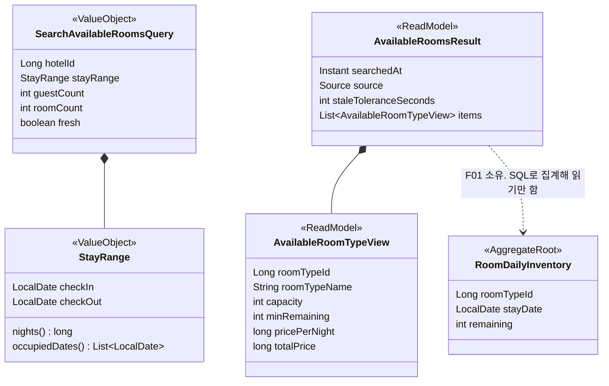
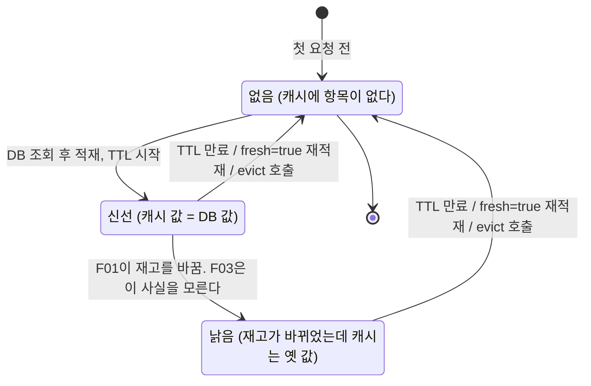
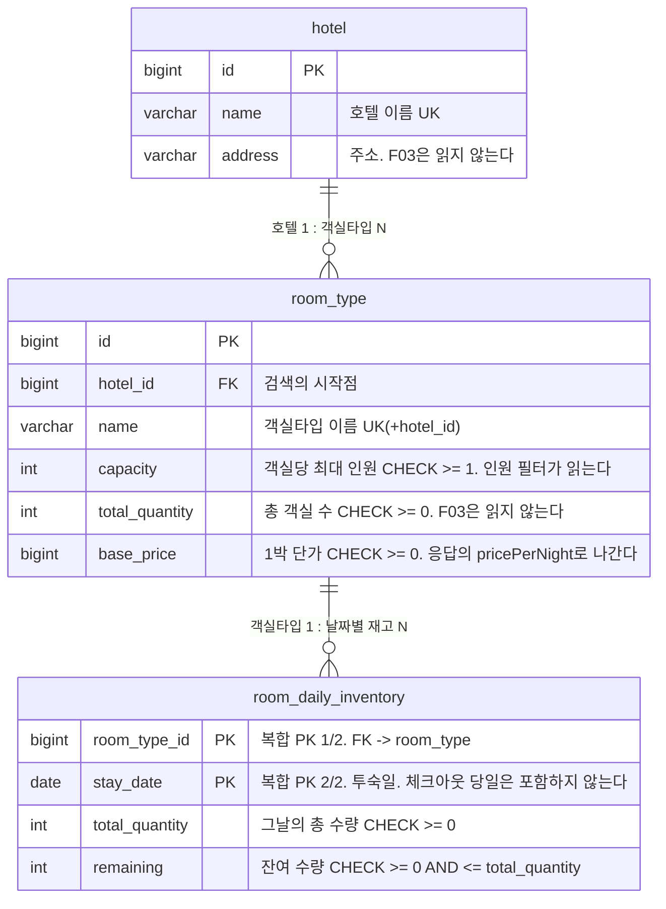
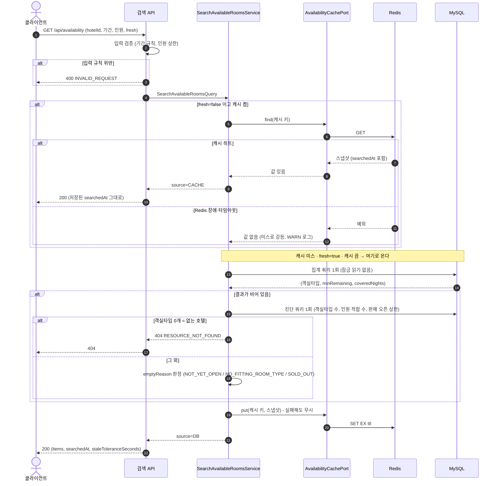
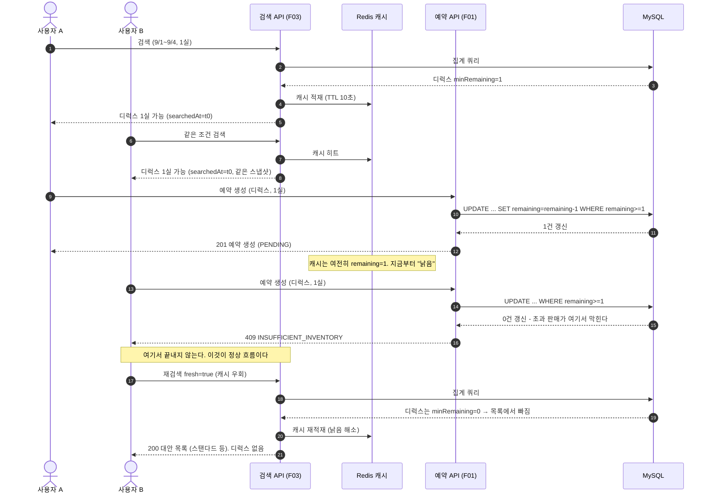
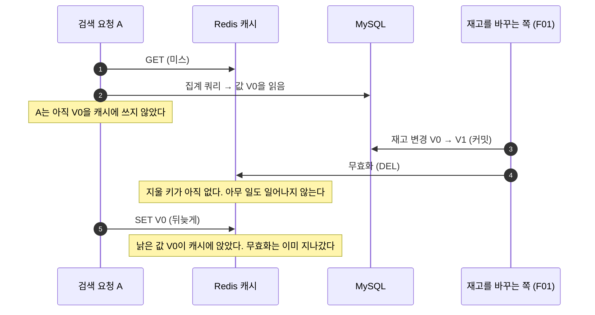

# [F03] 가용 객실 검색

- 상태: 승인 대기
- 작성일: 2026-08-15
- 승인일:

## 1. 무엇을 왜 만드는가

고객은 예약을 누르기 전에 **"내가 원하는 호텔·날짜·인원으로 지금 잡을 수 있는 방이 있는가"**를 먼저 본다. 이 화면이 없으면 고객은 예약 API를 찍어보는 것 말고 방을 찾을 방법이 없다.

이 feature가 어려운 이유는 방을 찾는 SQL이 어려워서가 아니다. **검색이 보여주는 재고와 실제 재고가 같은 순간을 가리키지 않기 때문**이다. 검색 결과를 화면에 그리는 사이에도 다른 사람이 그 방을 예약한다. 캐시를 붙이면 이 간격이 더 벌어진다. 그래서 이 스펙이 진짜로 답해야 하는 질문은 두 개다.

1. 재고가 바뀌었을 때 캐시를 언제 어떻게 걷어내는가.
2. 캐시가 낡았을 때 사용자에게 무엇을 약속하고 무엇을 약속하지 않는가.

그리고 결론을 미리 말한다. **검색 결과가 낡아서 예약이 실패하는 것은 버그가 아니라 설계된 정상 흐름이다.** 검색은 후보를 제시할 뿐이고, 재고의 진실은 예약 시점의 조건부 UPDATE(F01)가 정한다. 이 문서는 그 실패가 어떤 경로로 흐르고, 그 경로에서 초과 판매가 왜 일어날 수 없는지를 보인다.

## 2. 범위

**포함하는 것**

- UC-1 가용 객실 검색. 호텔·날짜 범위·인원·잔여 수량 기준으로 예약 가능한 객실타입 목록을 돌려준다
- 조회 성능 설계: 단일 집계 쿼리, 인덱스 근거, Redis 결과 캐시
- 캐시 무효화와 정합성 보장 수준의 정의
- 캐시를 설정 한 줄로 끌 수 있는 구조 (00 D4의 절단 1순위 대비)
- 검색 → 예약 실패(409) → 재검색으로 이어지는 클라이언트 계약

**포함하지 않는 것**

| 뺀 것 | 이유 |
|---|---|
| 재고 차감·복원 | F01의 일이다. F03의 코드 경로에는 재고 테이블에 대한 쓰기가 한 줄도 없다 |
| 가예약·홀드(검색 결과를 일정 시간 잡아두기) | 재고를 선점하는 쓰기 연산이다. F01의 PENDING 예약이 이미 그 역할을 한다. 검색이 홀드를 하면 조회가 쓰기가 되어 이 feature의 성격이 바뀐다 |
| 전 호텔 통합 검색(호텔 미지정) | `hotelId`를 필수로 둔다. 호텔 수가 시드 고정(2곳)이라 통합 검색은 성능 서사를 만들지 못하고, 쿼리만 넓어진다 |
| 정렬 옵션·페이징 | 호텔당 객실타입이 시드 기준 소수다. 페이징은 데이터가 없는데 만드는 기능이다. 정렬은 가격 오름차순 고정 |
| 객실타입 상세·사진·편의시설 | 재고 문제와 무관한 콘텐츠다. 00 D1에서 관리자 CRUD를 뺀 것과 같은 이유 |
| 검색 이력·인기 검색어 | 주제와 무관하다 |
| 캐시 스탬피드 방어 | 캐시 자체가 절단 1순위(00 D4)인데 그 위에 방어 장치를 얹는 것은 순서가 틀렸다. F04 부하테스트로 먼저 측정한다 (D10) |

## 3. 소유 범위

- **소유 패키지:** `com.pms.inventory.query.**` (조회 전용)
- **읽기만 하는 패키지:** `com.pms.inventory.domain` (F01 소유). 수정하지 않는다. 아래 4절의 이유로 F03은 이 패키지의 JPA 엔티티를 거치지 않고 SQL로 직접 읽는다
- **Flyway 번호 대역:** V301 ~ V399. **실제로 한 개도 쓰지 않는다.** F01이 `room_daily_inventory`를 자연키 복합 PK `(room_type_id, stay_date)`로 확정했고, 그 클러스터드 인덱스가 검색 쿼리를 그대로 커버하므로 추가할 인덱스가 없다 (D8)
- **수정이 필요한 공유 파일:** 없음
  - 캐시 on/off 설정 키 `pms.search.cache.enabled`는 **기본값을 코드에 두어**(`@Value("${pms.search.cache.enabled:true}")` 형태) `application.yml` 수정 없이 동작하게 만든다. yml에 문서화 목적으로 노출하는 것은 F01 병합 후 `parallel-work.md`의 공유 파일 절차(작은 커밋을 main에 먼저)로 따로 처리한다
  - `ErrorCode`는 기존 `INVALID_REQUEST`, `RESOURCE_NOT_FOUND`로 충분하다. 추가하지 않는다

### 패키지 구조

```
com.pms.inventory.query
├── application/
│   ├── port/in/SearchAvailableRoomsUseCase        유스케이스 인터페이스
│   ├── port/out/AvailabilityQueryPort             재고 집계 조회 포트
│   ├── port/out/AvailabilityCachePort             캐시 포트 (구현 2개)
│   ├── usecase/SearchAvailableRoomsService        캐시 조회 → DB 조회 → 캐시 적재
│   └── dto/                                       Query(입력), Result·View(출력), StayRange(VO)
└── adapter/
    ├── in/web/AvailabilitySearchController        요청 검증·변환만
    └── out/
        ├── persistence/AvailabilityQueryAdapter   네이티브 집계 쿼리 1발
        └── cache/RedisAvailabilityCacheAdapter    캐시 켬
            NoOpAvailabilityCacheAdapter           캐시 끔
```

`domain/` 디렉터리가 없다. 조회 전용 슬라이스라 애그리거트가 없기 때문이며, 그 판단은 D2에 있다.

## 4. 도메인 모델링

### F03은 애그리거트를 만들지 않는다

이 feature는 **읽기 측(CQRS의 Query 쪽)**이다. 만드는 것은 애그리거트가 아니라 **읽기 모델**이다. 불변식을 지켜야 하는 상태를 가지지 않으므로 애그리거트 경계를 잡을 대상 자체가 없다. 자세한 근거와 트레이드오프는 D2에 있다.

대신 F03이 지켜야 하는 규칙은 **입력 규칙**과 **읽기 규칙** 두 가지다.

- **입력 규칙 (`StayRange` VO가 지킨다):** 체크아웃은 체크인보다 뒤여야 하고, 투숙 일수는 1박 이상 30박 이하이며, 체크인은 오늘보다 앞설 수 없다
- **읽기 규칙 (`AvailabilityQueryPort` 구현이 지킨다):** 어떤 객실타입이 "가용"이려면 **투숙 기간의 모든 날짜에 재고 행이 존재하고, 그 모든 날짜의 잔여가 요청 객실 수 이상**이어야 한다. 하루라도 행이 없으면 가용이 아니다 (D9의 fail-closed)



| 구성 요소 | 무엇인가 | 왜 이렇게 두나 |
|---|---|---|
| `SearchAvailableRoomsQuery` (검색 조건) | 유스케이스 입력. 호텔, 기간, 인원, 객실 수, 캐시 우회 여부 | 캐시 키가 이 값들로만 만들어지므로, 조건 하나가 빠지면 곧바로 다른 조건의 결과를 돌려주는 버그가 된다. 한 객체로 묶어 누락을 막는다 |
| `StayRange` (투숙 기간) | 체크인·체크아웃과 그 사이 날짜 계산 | 기간 규칙("체크아웃 당일은 점유하지 않는다", "30박 상한")을 놓을 자리가 필요하다. F01의 `StayPeriod`와 규칙은 같지만 그건 `reservation` 구역 소유라 참조할 수 없다 (00 D6) |
| `AvailableRoomsResult` (검색 결과) | 응답 전체. 항목 목록에 조회 시각·출처·낡음 허용치가 붙는다 | 낡음을 숨기지 않고 응답에 실어 보낸다. 클라이언트가 재검색 판단을 할 수 있어야 한다 |
| `AvailableRoomTypeView` (객실타입 한 줄) | 객실타입 정보 + 기간 내 최소 잔여 + 금액 | `minRemaining`은 기간 중 가장 빡빡한 날의 잔여다. 이 값이 곧 "이 기간을 통째로 몇 개까지 잡을 수 있는가"다 |
| `RoomDailyInventory` (일별 재고) | F01의 애그리거트 | F03은 이 클래스를 코드로 참조하지 않는다. 같은 테이블을 SQL로 읽을 뿐이다 (D2) |

### 상태와 전이 표

F03에는 상태를 가진 애그리거트가 없으므로 예약 전이 표 같은 것은 없다. 대신 **캐시 항목의 생애**가 상태를 가지며, 이 문서의 정합성 논의가 전부 이 그림 위에서 벌어진다.



| 상태 | 무엇인가 | 사용자가 보는 것 |
|---|---|---|
| 없음 | 캐시에 항목이 없다 | DB를 직접 읽은 결과. `source: DB` |
| 신선 | 캐시 값과 DB 값이 같다 | 정확한 결과. `source: CACHE` |
| 낡음 | 재고가 바뀌었는데 캐시는 옛 값을 들고 있다 | 최대 TTL초 동안 옛 잔여. 여기서 낙관적 낡음이면 예약 단계 409로 이어진다 |

**핵심은 "신선 → 낡음" 전이를 F03이 감지할 수 없다는 것이다.** F01의 재고 차감 코드에 손댈 수 없기 때문이다(3절 소유 범위). 그래서 무효화 설계가 7절의 주제가 된다.

### 애그리거트 간 관계

F03은 어떤 애그리거트도 소유하지 않는다. `room_type`·`room_daily_inventory`를 **ID와 SQL로만** 읽고, `reservation` 구역은 참조하지 않는다 (00 D6).

## 5. DB 설계

### F03이 만드는 테이블은 없다

**F03은 테이블을 하나도 만들지 않는다.** F01이 만든 테이블을 읽을 뿐이다. 아래 ERD는 F03이 읽는 범위이며, 컬럼과 제약의 소유자는 전부 F01이다.



### F01 스키마 의존 계약

F03의 모든 쿼리는 F01이 만든 테이블에 의존한다. **2026-08-15에 PM을 통해 F01로부터 확정 스키마를 전달받았고, 아래 표로 계약을 고정한다.** F01 병합 시점에 이 표를 실제 DDL과 대조하는 것으로 재확인을 끝낸다 (D1).

마지막 칸은 **그 항목이 바뀌면 F03 설계가 실제로 얼마나 바뀌는지**다. 몇 분 안에 재확인을 끝내기 위한 칸이다.

| # | 계약 내용 | 상태 | 바뀌면 → 무엇을 얼마나 고치나 | 영향 |
|---|---|---|---|---|
| A1 | 테이블 이름은 `hotel`, `room_type`, `room_daily_inventory` | **확정** (F01 회신) | 집계 쿼리의 `FROM`·`JOIN` 식별자만 치환 | 낮음 |
| A2 | `room_daily_inventory`의 PK는 자연키 복합 `(room_type_id, stay_date)`. 대리키 없음 | **확정** (F01 회신) | 대리키로 바뀌면 → 커버링 인덱스 `(room_type_id, stay_date, remaining)`를 V301로 추가. 쿼리·코드는 그대로 (D8) | 중간 (마이그레이션만) |
| A3 | PK가 곧 유니크 제약이므로 `(room_type_id, stay_date)` 조합에 중복 행이 없다 | **확정** (A2에서 따라옴) | 중복이 가능해지면 → `HAVING COUNT(*) = :nights` 판정이 무너진다. `COUNT(DISTINCT i.stay_date)`로 바꾸고 중복 행 테스트 추가 | **높음** |
| A4 | `room_type.capacity`는 객실당 최대 인원, `CHECK >= 1` | **확정** (F01 회신) | 총 정원 등 다른 의미면 → `WHERE` 절 인원 필터 한 줄과 단위 테스트 기대값 수정 | 낮음 |
| A5 | 1박 단가는 `room_type.base_price` (`BIGINT`, `CHECK >= 0`) | **확정** (F01 회신) | 컬럼이 사라지면 → 응답에서 `pricePerNight`·`totalPrice` 제거, `ORDER BY`를 `rt.id`로 변경. **F03이 가격 컬럼을 만들지 않는다** | 중간 |
| A6 | `remaining`은 `CHECK >= 0 AND <= total_quantity`이며 예약 시 즉시 감소, 취소·만료 시 복원된다 | **확정** (F01 회신, 00 UC-2·4·5) | 지연 반영이면 → 검색이 보는 잔여의 의미가 달라져 **7절의 정합성 보장 G1~G5를 다시 쓴다** | **높음** |
| A7 | 재고 시드는 V052로 **고정 날짜 2026-08-01 ~ 2026-10-29** 90일치. **그 밖의 날짜는 행 자체가 없다** | **확정** (F01 스펙 5.5) | 범위가 바뀌면 → `salesOpenUntil` 상수와 통합 테스트의 경계 날짜 픽스처를 조정. 판정 로직 자체는 그대로 (D9) | 낮음 |
| A8 | 업무 시간대는 `Asia/Seoul`로 고정되고 현재 시각은 `Clock` 빈으로 주입된다 | **확정 예정.** F01이 D2(반영 후보 2)로 올렸고 승인 직후 공유 파일 선행 커밋으로 main에 반영된다. **관리자 승인 전이다** | 다르면 → "오늘 이전 검색 금지" 판정의 기준 존만 바꾼다 | 낮음 |

**A3·A6이 어긋나면 스펙을 고쳐 재승인을 받는다.** 나머지는 구현 단계에서 흡수한다. A8은 F01 D2의 승인에 딸려 확정되므로 F03 승인을 막지 않는다.

참고로 F01의 Flyway 구성은 V001 공통 스키마 / V002 재고 / V003 예약 / V051 시드(호텔 2·객실타입 5) / V052 시드(90일 재고)다.

### 검색 대상 데이터 (F01 시드 계약)

원본은 F01 스펙 5.5절이고, **어긋나면 F01이 진실이다.** 여기에는 검색 설계가 직접 의존하는 숫자만 옮긴다. 값이 아니라 "이 숫자가 검색의 무엇을 정하는가"가 이 표의 요점이다.

| 시드 사실 | 값 | 검색에서 무엇을 정하나 |
|---|---|---|
| 재고 날짜 범위 | **2026-08-01 ~ 2026-10-29** (90일, 양끝 포함). `CURDATE()` 기반이 아닌 **고정 날짜** | **`salesOpenUntil` = `2026-10-29`.** 이 값이 곧 `NOT_YET_OPEN` 경계다 (D9) |
| 재고 행이 없는 첫 날짜 | **2026-10-30** | 투숙일이 이 날짜 이상을 포함하면 `NOT_YET_OPEN`. 즉 **예약 가능한 마지막 `checkOut`은 2026-10-30**이다(체크아웃 당일은 점유하지 않으므로 마지막 투숙 밤이 10-29) |
| 오늘(2026-08-15)이 범위 안 | 포함됨 | 기본 검색(오늘부터)이 빈 결과를 내지 않는다. `NOT_YET_OPEN`이 대량 나오면 시나리오가 범위 밖을 찍고 있다는 신호다 |
| 호텔 | id 1 = 서울 그랜드, id 2 = 부산 오션뷰 | `hotelId=3` 이상이 404 테스트용이다 |
| 객실타입 `capacity` | 2 / 3 / 4 / 2 / 4 (id 1~5) | 인원 필터 경계. 아래 표 참고 |
| 초기 `remaining` | 전부 `total_quantity`와 같다. 줄여둔 날짜 없음 | 검색은 매번 같은 출발선에서 시작한다. **특정 날짜의 잔여를 줄이려면 시드가 아니라 테스트가 직접 UPDATE한다** |
| 행 수 | 5종 × 90일 = **450행** | 이 규모로는 인덱스 유무 차이가 드러나지 않는다. 성능 측정용 대량 데이터가 따로 필요한 이유다 (D13) |
| 경합 실험 대상 | id 3 스위트(10실), id 5 오션뷰 스위트(20실) | 검색 결과의 `minRemaining`이 눈에 띄게 줄어드는 것을 관찰할 수 있는 객실타입이다 |

**인원 필터 경계** — 필터 식은 `capacity × roomCount >= guestCount`다.

| 요청 | 결과 | 쓰임 |
|---|---|---|
| `hotelId=1, guestCount=2, roomCount=1` | id 1·2·3 (capacity 2·3·4) | 일반 케이스 |
| `hotelId=1, guestCount=4, roomCount=1` | id 3만 (스위트) | 필터가 실제로 거르는지 확인 |
| `hotelId=2, guestCount=4, roomCount=1` | id 5만 | 같음 |
| `guestCount=5, roomCount=1` | **빈 결과 + `NO_FITTING_ROOM_TYPE`** | **어떤 객실타입도 capacity 4를 넘지 않으므로 `roomCount=1`에서는 항상 빈 결과다.** 이 경계로 `NO_FITTING_ROOM_TYPE`을 재현한다 |
| `guestCount=5, roomCount=2` | capacity 3 이상인 타입 (2·3·5) | `roomCount`를 늘리면 다시 잡힌다. 필터가 곱셈인지 확인하는 케이스 |

### 인덱스와 제약

F03은 제약을 추가하지 않는다. **불변식(`remaining >= 0`)을 지키는 최후 방어선은 F01의 CHECK 제약이고, F03은 그 불변식을 건드릴 수 있는 쓰기를 하지 않으므로 새로 세울 방어선이 없다.** 대신 F03이 지키는 것은 "검색이 F01의 쓰기 경로를 느리게 만들지 않는다"이며, 그 수단이 인덱스다.

| 이름 | 대상 컬럼 | 종류 | 근거 |
|---|---|---|---|
| (F01 소유) `room_daily_inventory` PK | `(room_type_id, stay_date)` | 클러스터드 PK | **F03이 필요한 인덱스가 이미 여기 있다.** InnoDB에서 PK는 클러스터드 인덱스이고 행 데이터가 이 순서로 물리 정렬되므로, "객실타입 하나의 날짜 구간을 훑으며 `remaining`을 읽는다"는 F03의 접근 패턴이 **단일 범위 스캔 + 테이블 접근 0회**로 처리된다 |
| (F01 소유) `room_type.hotel_id` | `hotel_id` | INDEX (FK 부수) | 검색의 시작점. FK 선언 시 MySQL이 자동 생성한다. F01 확정본에 `hotel_id FK`가 있으므로 존재한다 |
| **F03이 추가하는 인덱스** | — | — | **없다** |

처음에는 커버링 인덱스 `(room_type_id, stay_date, remaining)`를 V301로 추가할 계획이었다. 그것은 PK가 대리키 `id`일 때만 의미가 있는데, F01이 자연키 복합 PK를 확정하면서 **클러스터드 인덱스가 이미 `remaining`을 포함**하게 됐다. 같은 인덱스를 한 벌 더 만드는 것이 되므로 추가하지 않는다 (D8).

인덱스를 더 달지 않기로 한 것에는 성능상의 이득도 있다. `remaining`은 이 프로젝트에서 가장 뜨거운 쓰기 대상(예약마다 UPDATE)이고, 인덱스가 하나 늘면 그 UPDATE마다 유지 비용이 붙는다. **읽기를 위해 이 프로젝트의 심장인 쓰기를 느리게 만드는 거래를 하지 않아도 된 것이다.**

### 마이그레이션 파일

**없다.** F03은 V301~V399 대역을 배정받았지만 한 개도 쓰지 않는다. 스키마를 만들지도, 바꾸지도, 인덱스를 더하지도 않는다.

F01 병합 후 `EXPLAIN`으로 위 판단을 실제 실행 계획으로 확인한다(9절 성능 테스트). 예상과 달리 인덱스가 필요하다는 결과가 나오면 그때 V301을 만들고 관리자에게 보고한다.

## 6. 유스케이스

### UC-1. 가용 객실 검색

**입력**

| 파라미터 | 타입 | 필수 | 규칙 |
|---|---|---|---|
| `hotelId` | Long | 필수 | 양수 |
| `checkIn` | LocalDate | 필수 | `Clock` 기준 오늘 이상 |
| `checkOut` | LocalDate | 필수 | `checkIn` 초과, `checkIn + 30일` 이하 |
| `guestCount` | int | 필수 | 1 이상 20 이하 |
| `roomCount` | int | 선택(기본 1) | 1 이상 10 이하 |
| `fresh` | boolean | 선택(기본 false) | true면 캐시를 읽지 않고 DB에서 읽은 뒤 캐시를 다시 채운다 |

인증 헤더는 요구하지 않는다 (D11).

**출력**

가용한 객실타입 목록. 각 항목은 객실타입 정보와 **기간 내 최소 잔여**(`minRemaining`), 금액을 담는다. 목록에 더해 **이 결과가 언제 찍힌 스냅샷인지**(`searchedAt`), **어디서 왔는지**(`source`), **얼마나 낡을 수 있는지**(`staleToleranceSeconds`)를 함께 돌려준다.

가용한 것이 없으면 200과 빈 목록이며, 이때 **왜 비었는지**(`emptyReason`)를 함께 돌려준다 (D9).

| `emptyReason` | 뜻 | 사용자에게 할 말 |
|---|---|---|
| `SOLD_OUT` | 판매 중인 기간인데 잔여가 부족하다 | "이 날짜는 매진입니다. 다른 날짜를 보세요" |
| `NOT_YET_OPEN` | 아직 예약을 받지 않는 기간이다. 재고 행 자체가 없다 | "아직 예약을 받지 않는 기간입니다. `salesOpenUntil`까지 예약할 수 있습니다" |
| `NO_FITTING_ROOM_TYPE` | 이 호텔에 요청 인원을 수용할 객실타입이 없다 | "인원을 나눠 여러 객실로 예약해 보세요" |

이 셋을 구분하는 이유는 사용자가 해야 할 행동이 전혀 다르기 때문이다. 매진이면 다른 날짜를 찾고, 판매 전이면 나중에 다시 오며, 인원이 안 맞으면 객실 수를 늘린다. 셋을 뭉쳐 "결과 없음"으로 돌려주면 세 경우 모두에서 사용자가 잘못된 행동을 한다.

**도메인 모델의 변화**

| 순서 | 대상 | 변화 |
|---|---|---|
| 1 | `room_daily_inventory` | **변화 없음.** SELECT만 한다. 잠금 읽기도 하지 않는다 |
| 2 | `room_type`, `hotel` | **변화 없음.** SELECT만 한다 |
| 3 | 예약 애그리거트 | **변화 없음.** 참조조차 하지 않는다 |
| 4 | Redis 캐시 항목 | 캐시 미스이거나 `fresh=true`면 새로 쓰이고 TTL이 시작된다. 캐시 히트면 변화 없다(TTL 연장도 하지 않는다). 캐시가 꺼져 있으면 이 단계 자체가 없다 |

**도메인 상태를 바꾸지 않는 유스케이스**라는 점이 이 feature의 성격을 규정한다. 4번만이 유일한 부수효과이고, 그것도 지워져도 정확성에 영향이 없는 종류다.

**흐름**



트랜잭션 구간을 `rect`로 감싸지 않은 이유가 있다. **이 유스케이스는 트랜잭션을 열지 않는다** (D12). 단일 SELECT이고, 트랜잭션을 열면 Redis 왕복이 트랜잭션 안에 들어가 `coding-rules.md`의 "캐시 갱신은 트랜잭션 밖에서 한다"를 어기게 된다.

**낙관적 낡음이 예약 실패로 이어지는 정상 흐름**

이 그림이 이 스펙의 핵심이다. 두 사용자가 같은 마지막 방을 보고 있다.



여기서 읽어야 할 것은 세 가지다.

1. **B가 본 화면은 틀렸지만, 데이터는 틀리지 않았다.** 재고는 정확히 1개 팔렸다. 캐시의 낡음이 만든 최악은 "B의 헛걸음"이지 "재고 음수"가 아니다.
2. **초과 판매를 막은 것은 검색이 아니라 예약의 조건부 UPDATE다.** 검색을 아무리 정확하게 만들어도 이 지점의 방어는 필요하고, 이 지점의 방어가 있으면 검색은 틀려도 된다.
3. **B의 재검색이 캐시를 우회했기 때문에 같은 실패가 반복되지 않는다.** `fresh=true`가 없으면 B는 낡은 캐시를 다시 읽고 같은 409를 또 받는다. 이 파라미터는 편의 기능이 아니라 정상 흐름의 필수 부품이다.

**클라이언트 계약**

| 단계 | 클라이언트가 하는 일 |
|---|---|
| 1 | `GET /api/availability`로 후보를 받는다 |
| 2 | 사용자가 고른 객실타입으로 `POST /api/reservations` (F01) |
| 3 | 409 `INSUFFICIENT_INVENTORY`를 받으면 **오류 화면을 띄우지 않는다** |
| 4 | `GET /api/availability?...&fresh=true`로 재검색한다 |
| 5 | 같은 객실타입이 여전히 보이면 2로 돌아가되 **재시도는 총 2회까지**. 사라졌으면 대안 목록을 사용자에게 보여준다 |

재시도 상한을 두는 이유는, 인기 날짜에서 이 루프가 상한 없이 돌면 클라이언트가 스스로 부하를 만들기 때문이다.

**실패 시나리오**

| 상황 | 응답 | 부작용 처리 |
|---|---|---|
| `checkOut <= checkIn` | 400 INVALID_REQUEST | 없음. 쿼리를 실행하지 않는다 |
| 투숙 31박 이상 | 400 INVALID_REQUEST | 없음. 기간이 길수록 스캔 행이 늘어 상한이 필요하다 |
| `checkIn`이 과거 | 400 INVALID_REQUEST | 없음 |
| `guestCount` 또는 `roomCount`가 범위 밖 | 400 INVALID_REQUEST | 없음 |
| 호텔이 존재하지 않음 | 404 RESOURCE_NOT_FOUND | 없음. 결과가 비었을 때만 진단 쿼리가 나가므로 정상 경로는 쿼리 1회를 유지한다 |
| 잔여가 부족함(매진) | **200 + 빈 목록 + `emptyReason: SOLD_OUT`** | 없음. 이것은 오류가 아니라 정상 결과다 |
| 요청 인원을 수용할 객실타입이 없음 | **200 + 빈 목록 + `emptyReason: NO_FITTING_ROOM_TYPE`** | 없음 |
| 투숙 기간이 재고 시드 범위(90일) 밖 | **200 + 빈 목록 + `emptyReason: NOT_YET_OPEN` + `salesOpenUntil`** | 없음. 매진과 구분해 응답한다 (D9) |
| Redis 장애·타임아웃 | **200 + `source: DB`** | 캐시를 미스로 강등하고 DB로 간다. 사용자에게 장애를 노출하지 않는다 (D7). WARN 로그를 남긴다 |
| MySQL 장애 | 500 INTERNAL_ERROR | 없음. 캐시로 가릴 수 없는 실패다 |

## 7. 동시성과 멱등성

### 이 feature에서 동시성이란 무엇인가

F03은 쓰기를 하지 않으므로 **경합으로 데이터가 깨질 일이 없다.** 그렇다고 동시성 문제가 없는 것이 아니다. F03의 동시성 문제는 세 가지 형태로 나타난다.

1. **검색이 예약을 방해하는 문제.** 검색이 재고 행에 락을 걸면, 이 프로젝트에서 가장 중요한 쓰기 경로가 조회 때문에 느려진다
2. **검색이 낡은 것을 보여주는 문제.** 캐시가 이 간격을 키운다
3. **낡음이 예약 실패로 이어졌을 때 시스템이 무너지지 않는가.** 실패한 클라이언트들이 동시에 재검색하면 그것이 곧 트래픽이다

### 경합 지점

| # | 지점 | 무슨 일이 벌어지는가 | 방어 |
|---|---|---|---|
| P1 | F03의 집계 SELECT와 F01의 `UPDATE room_daily_inventory SET remaining = remaining - n`이 **같은 행**에 동시 접근 | InnoDB의 일관된 읽기(consistent read)로 F03은 쿼리 시작 시점의 스냅샷을 본다. 갱신 중인 행을 기다리지 않고, 갱신하는 쪽도 F03 때문에 기다리지 않는다 | **아무 락도 걸지 않는 것이 방어다.** `FOR UPDATE`·`LOCK IN SHARE MODE`를 쓰지 않는다 (D3) |
| P2 | 한 번의 집계 쿼리가 **여러 날짜 행**을 훑는 도중 그중 일부가 갱신됨 | 단일 SELECT이므로 한 시점의 일관된 스냅샷을 본다. "1일차는 갱신 전, 3일차는 갱신 후"가 섞인 결과는 나오지 않는다. 이것이 날짜별 조회를 여러 번 하지 않고 **집계 쿼리 한 발**로 끝내는 이유다 | 쿼리 1회 (D4) |
| P3 | 같은 캐시 키의 TTL이 만료되는 순간 다수 요청이 동시에 DB로 몰림 (스탬피드) | 인기 날짜에서 순간적으로 DB 쿼리가 늘어난다. **정확성 문제는 아니고 성능 문제다** | 이번 범위에서 방어하지 않는다. F04 부하테스트로 실제 크기를 먼저 잰다 (D10) |
| P4 | 여러 요청이 동시에 같은 캐시 키에 `put` | 마지막에 쓴 값이 남는다. 값들은 서로 몇 밀리초 차이의 스냅샷이므로 어느 것이 남아도 낡음 허용치 안이다 | 방어하지 않는다. 무해한 경합이다 |
| P5 | 409를 받은 클라이언트들이 동시에 `fresh=true` 재검색 | 캐시를 우회하므로 전부 DB로 간다 | 클라이언트 계약의 **재시도 상한 2회**로 제한한다 (6절) |

### 방어 전략

`coding-rules.md`의 다층 방어를 이 feature에 맞게 읽으면 이렇게 된다.

| 계층 | 수단 | 무엇을 막는가 | 뚫리면? |
|---|---|---|---|
| 1차 | Redis 결과 캐시 | DB 조회 부하 | 2차가 받는다. **정확성에는 아무 영향이 없다** |
| 2차 | 커버링 인덱스 기반 단일 집계 쿼리 (락 없음) | 조회 지연, 예약 경로 간섭 | 3차가 받는다. **정확성에는 아무 영향이 없다** |
| 3차 | 예약 시점의 조건부 UPDATE + `remaining >= 0` CHECK (**F01 소유**) | **초과 판매** | 없음. 최후 방어선 |

**이 표에서 읽어야 할 것은 1·2차가 성능 방어일 뿐이고 정확성 방어는 3차 하나라는 사실이다.** 그래서 캐시가 낡아도, 캐시가 통째로 꺼져도, 인덱스가 없어도 초과 판매는 발생하지 않는다. 반대로 말하면 **검색을 아무리 정확하게 만들어도 3차 방어를 대신할 수는 없다.** 검색이 재고를 홀드하지 않는 이유(2절 제외 항목)가 여기 있다.

**1차를 껐을 때 불변식이 지켜지는지의 증명**은 F03에서는 두 갈래다.

- 캐시를 끈 상태(`pms.search.cache.enabled=false`)에서 검색이 동일한 결과를 돌려주는가 → 테스트 C4
- Redis가 죽은 상태에서 검색이 계속 동작하는가 → 테스트 C5

### 캐시 무효화: 언제, 어떻게

**F03은 F01의 재고 차감 코드에 무효화 훅을 넣을 수 없다.** F01 소유 패키지이고, 넣으려면 관리자 승인이 필요하며, 무엇보다 절단 1순위인 캐시에 F01을 결합시키면 절단할 때 F01까지 손봐야 한다. 그래서 무효화는 **쓰는 쪽이 밀어내는(push) 방식이 아니라 읽는 쪽이 스스로 걷어내는(pull) 방식**으로 설계한다.

| 수단 | 언제 작동하나 | 낡음의 상한 | 이번 범위 |
|---|---|---|---|
| **TTL 만료** | 항상. 기본 수단 | TTL (기본 10초, 설정값) | **구현한다** |
| **`fresh=true` 재적재** | 예약이 409로 실패한 직후, 클라이언트가 재검색할 때 | 즉시 (해당 키 한정) | **구현한다.** 정상 흐름의 필수 부품 |
| **`evictHotel(hotelId)` 포트 메서드** | 호출자가 있을 때 | 즉시 (호텔 단위) | **자리만 만든다.** F03 코드에서는 테스트와 운영 조작 외에 호출하지 않는다 |
| 재고 변경 이벤트 구독 | F01이 커밋 후 이벤트를 발행할 때 | 전파 지연 | **연결하지 않는다** (D6) |

**이벤트 기반 무효화를 붙여도 정합성 보장 수준은 달라지지 않는다.** 무효화가 전파되는 동안에도, 그리고 무효화된 직후 사용자가 화면을 보고 예약을 누르는 몇 초 동안에도 재고는 계속 바뀐다. 이벤트를 붙여서 개선되는 것은 **낡음의 평균 지속 시간**이지 "낡을 수 있다"는 사실 자체가 아니다. 그래서 이벤트 연동은 성능·UX 개선 항목이지 정합성 항목이 아니며, 절단 1순위 위에 얹지 않는다 (D6).

같은 이유로 **TTL 값을 줄이는 것도 정합성 대책이 아니다.** TTL이 10초든 1초든, 사용자가 화면을 보고 예약을 누르기까지 걸리는 시간이 이미 그보다 길다. TTL은 **DB 부하를 얼마나 흡수할지**를 정하는 값이며 정확성과는 다른 축이다 (D5).

### 캐시가 낡았을 때 무엇을 보장하는가

낡음에는 방향이 둘 있고, 각각의 최악이 다르다.

| 방향 | 어떤 상황 | 사용자가 보는 것 | 최악의 결과 | 판정 |
|---|---|---|---|---|
| **낙관적 낡음** | 예약으로 재고가 줄었는데 캐시는 옛 값 | 이미 팔린 방이 목록에 남아 있다 | 예약 시도가 409로 실패한다. **초과 판매는 없다** | 허용. 정상 흐름으로 설계한다 (6절 시퀀스) |
| **비관적 낡음** | 취소·만료로 재고가 늘었는데 캐시는 옛 값 | 예약 가능한 방이 목록에 없다 | 최대 TTL초 동안 판매 기회를 놓친다 | 허용. `fresh=true`와 TTL 만료로 해소된다 |

**보장하는 것 (G)**

| # | 보장 |
|---|---|
| G1 | 검색 결과의 모든 항목은 응답의 `searchedAt` 시각에 찍힌 **하나의 일관된 스냅샷**이다. 항목별로 다른 시점이 섞이지 않는다 |
| G2 | 그 스냅샷은 응답 시각 기준 최대 `staleToleranceSeconds`초(캐시 TTL)만큼 낡을 수 있다. **얼마나 낡을 수 있는지를 응답에 함께 실어 보낸다** |
| G3 | `fresh=true`로 요청하면 캐시를 우회해 **DB 커밋 기준 최신 스냅샷**을 돌려준다 |
| G4 | 캐시가 얼마나 낡았든, 캐시가 꺼져 있든, Redis가 죽었든 **초과 판매는 발생하지 않는다.** 검색은 재고를 쓰지 않고, 차감은 조건부 UPDATE가 원자적으로 한다 |
| G5 | 캐시를 켜고 끈 결과가 다르지 않다. 다른 것은 낡음의 창(window)뿐이다 (테스트 C4) |

**보장하지 않는 것**

- 검색 시점의 잔여가 예약 시점까지 유지된다는 것. 홀드·가예약은 범위 밖이다(2절)
- `fresh=true`의 결과조차 예약 성공을 약속하지 않는다. 응답을 만든 직후에 팔릴 수 있다
- 검색 결과의 순서나 항목 수가 요청 간에 안정적이라는 것

### 무효화가 실패하면 무슨 일이 벌어지는가

무효화 설계를 적는 것만으로는 부족하다. **그 설계가 실패했을 때 사용자에게 무엇이 보이는지**까지 적어야 설계를 믿을 수 있다. 아래가 전부이며, 어느 칸에도 "초과 판매"가 없다는 것이 핵심이다.

| # | 실패 | 원인 | 사용자에게 보이는 것 | 시스템에 남는 것 | 스스로 회복되나 | 최악의 결과 |
|---|---|---|---|---|---|---|
| I1 | **무효화 누락** — 재고가 바뀌었는데 캐시가 그대로 | 이번 설계에는 재고 변경을 감지하는 수단이 없다. 즉 **이것은 사고가 아니라 기본 동작이다** (D6) | 최대 TTL초 동안 옛 잔여. 낙관적 낡음이면 예약이 409로 실패한다 | 없음. 캐시 값 하나가 옛것일 뿐 | 예. TTL 만료로 최대 10초 | 사용자가 한 번 헛걸음하고 `fresh=true` 재검색으로 정정된다 |
| I2 | **무효화 지연** — `evictHotel`을 호출했는데 Redis가 느려 반영이 늦음 | Redis 지연·네트워크 | I1과 같다. 낡음이 조금 더 간다 | 없음 | 예. TTL 만료가 상한을 보장한다 | I1과 같다 |
| I3 | **무효화 호출 실패** — `evictHotel`이 예외로 끝남 | Redis 다운, 타임아웃 | 아무것도 달라지지 않는다. Redis가 죽었으면 캐시 조회도 실패해 전부 DB로 간다 | WARN 로그 | 예 | 없음. Redis 다운이 오히려 낡음을 0으로 만든다 |
| I4 | **Redis 다운** | 인프라 장애 | 200 + `source: DB`. 사용자는 장애를 모른다. **결과는 오히려 가장 정확하다** | WARN 로그, DB 부하 상승 | 예. Redis 복구 시 자동 재적재 | 조용한 장애. DB 부하만 올라가고 아무도 모를 수 있어 `source` 필드와 WARN 로그를 관측 수단으로 남긴다 (D7) |
| I5 | **TTL이 걸리지 않음** — `SET`은 됐는데 만료가 안 붙음 | 구현 실수 | 낡음의 상한이 사라진다. 재고가 바뀌어도 검색이 영원히 옛 값을 보여준다 | 캐시에 영구 키가 쌓인다 | **아니오.** 이것만은 스스로 회복되지 않는다 | **가장 위험한 실패다.** G2가 무너지고 사용자는 계속 409를 받는다. 그래서 TTL이 실제로 걸렸는지를 Redis `TTL` 명령으로 확인하는 테스트를 둔다 (테스트 C3) |
| I6 | **캐시 키 충돌** — 다른 조건의 결과가 반환됨 | 캐시 키에서 검색 조건 누락 | 요청과 무관한 객실타입·잔여가 보인다. 인원이 안 맞는 방을 예약하려다 실패한다 | 없음 | 아니오 | 조용한 오답. 재현이 어렵다. 키 생성 테스트로 방어한다 (10절) |
| I7 | **캐시 값이 낡은 `searchedAt`을 잃음** — 응답 시각으로 덮어씀 | 구현 실수 | 낡은 결과가 방금 조회한 것처럼 보인다. 사용자와 클라이언트가 낡음을 판단할 근거를 잃는다 | 없음 | 아니오 | G2가 무너진다. 유스케이스 테스트로 방어한다 (9절) |

| I8 | **무효화를 스쳐 지나간 늦은 쓰기** — 무효화가 이미 지나간 뒤에 낡은 값이 캐시에 앉는다 | 아래 순서 참고 | 무효화를 했는데도 옛 값이 보인다. **무효화가 작동하지 않은 것처럼 보인다** | 낡은 값 하나 | **예. 단 TTL이 있을 때만이다** | TTL이 없으면 **낡은 값이 영구히 박힌다.** TTL이 있으면 I1과 같은 급이 된다 |

I8은 순서를 봐야 이해된다.



**이것이 "이벤트 무효화만으로는 갈 수 없는" 이유다.** 무효화 신호는 한 번 지나가면 다시 오지 않는데, 그 신호보다 늦게 도착한 읽기 결과가 캐시를 덮어쓰기 때문이다. 밀어내는(push) 방식만으로 정합성을 지키려면 세대 번호 비교나 지연 이중 삭제 같은 장치가 더 필요하다.

**이번 설계에서는 TTL이 이 문제를 덮는다.** 낡음이 TTL(10초)을 넘지 못하므로 I8은 I1과 같은 급의 실패로 내려앉는다. 그래서 F03에서 TTL은 "이벤트 무효화가 없을 때 쓰는 대체 수단"이 아니라 **최종 안전망**이며, 나중에 이벤트 무효화를 붙이더라도 TTL을 걷어내서는 안 된다 (D6).

I1~I4와 I8은 **설계상 허용된 실패**이며 전부 TTL이 상한을 보장한다. I5~I7은 **구현 실수로만 생기는 실패**이고 스스로 회복되지 않으므로 각각 전용 테스트로 막는다. 이 구분이 이 표의 요지다.

### 락 순서

**F03은 어떤 락도 걸지 않는다.** 분산락도, DB 잠금 읽기도 쓰지 않는다. 따라서 락 순서를 정할 대상이 없고 데드락도 발생하지 않는다. 이것은 누락이 아니라 결정이다 (D3).

### 멱등성

조회는 본래 멱등하다. F03에는 **상태를 바꾸는 연산이 없으므로 멱등성 키가 필요 없다.**

- 멱등성 키 형식: 없음 (해당 없음)
- 유효 기간: 없음 (해당 없음)
- 재요청 시 응답: 같은 조건의 재요청은 같은 형태의 결과를 돌려준다. 단, 재고가 그 사이에 바뀌었으면 값은 다를 수 있다. 이것은 멱등성 위반이 아니라 조회 대상이 바뀐 것이다
- 처리 중 재요청 시 응답: 해당 없음. 동시 요청 간 간섭이 없다

**Redis가 죽었을 때 중복이 막히는가**라는 질문은 F03에 해당하지 않는다. 막아야 할 중복 쓰기가 없기 때문이다. Redis가 죽었을 때 F03이 답해야 하는 질문은 "검색이 계속 동작하는가"이고, 답은 D7과 테스트 C5에 있다.

캐시 키 형식은 이렇게 둔다.

```
avail:{hotelId}:{checkIn}:{checkOut}:{guestCount}:{roomCount}
```

`fresh`는 키에 넣지 않는다. 캐시를 읽을지 말지를 정하는 값이지 결과를 바꾸는 값이 아니기 때문이다. **나머지 검색 조건은 하나도 빼지 않는다.** `roomCount`나 `guestCount`를 빠뜨리면 다른 조건의 결과를 그대로 돌려주는 조용한 버그가 된다 (10절).

## 8. API

| 메서드 | 경로 | 설명 |
|---|---|---|
| GET | `/api/availability` | 가용 객실타입 검색 |

**요청**

```
GET /api/availability?hotelId=1&checkIn=2026-09-01&checkOut=2026-09-04&guestCount=2&roomCount=1&fresh=false
```

**응답 200**

```json
{
  "hotelId": 1,
  "checkIn": "2026-09-01",
  "checkOut": "2026-09-04",
  "nights": 3,
  "guestCount": 2,
  "roomCount": 1,
  "searchedAt": "2026-09-01T14:03:22+09:00",
  "source": "CACHE",
  "staleToleranceSeconds": 10,
  "items": [
    {
      "roomTypeId": 11,
      "roomTypeName": "스탠다드",
      "capacity": 2,
      "minRemaining": 5,
      "pricePerNight": 90000,
      "totalPrice": 270000
    },
    {
      "roomTypeId": 12,
      "roomTypeName": "디럭스",
      "capacity": 3,
      "minRemaining": 1,
      "pricePerNight": 120000,
      "totalPrice": 360000
    }
  ]
}
```

| 필드 | 의미 |
|---|---|
| `searchedAt` | 이 결과가 찍힌 시각. **캐시 히트면 캐시에 저장된 시각을 그대로 돌려준다.** 응답 시각을 쓰면 방금 조회한 것처럼 보여 낡음이 숨겨진다 |
| `source` | `CACHE` 또는 `DB`. 관측·디버깅용이며, 캐시 on/off 동등성 테스트의 비교 대상에서 제외한다 |
| `staleToleranceSeconds` | 이 결과가 낡을 수 있는 상한(초). 캐시가 꺼져 있으면 `0` |
| `minRemaining` | 투숙 기간 중 **가장 잔여가 적은 날**의 잔여 수량. 이 기간을 통째로 몇 개까지 잡을 수 있는지를 뜻한다 |
| `totalPrice` | `pricePerNight × nights × roomCount` |
| `emptyReason` | `items`가 비었을 때만 나온다. `SOLD_OUT` / `NOT_YET_OPEN` / `NO_FITTING_ROOM_TYPE` |
| `salesOpenUntil` | `emptyReason`이 `NOT_YET_OPEN`일 때만 나온다. 재고 행이 존재하는 마지막 날짜 |

`pricePerNight`는 DB의 `room_type.base_price`를 그대로 매핑한 값이다. 컬럼 이름과 API 필드 이름이 다르므로 구현 시 주의한다(10절).

**응답 200 (가용 없음 — 매진)**

```json
{
  "hotelId": 1,
  "checkIn": "2026-09-20",
  "checkOut": "2026-09-22",
  "nights": 2,
  "guestCount": 2,
  "roomCount": 1,
  "searchedAt": "2026-09-01T14:03:22+09:00",
  "source": "DB",
  "staleToleranceSeconds": 10,
  "items": [],
  "emptyReason": "SOLD_OUT"
}
```

**응답 200 (가용 없음 — 아직 판매 전)**

```json
{
  "hotelId": 1,
  "checkIn": "2026-12-01",
  "checkOut": "2026-12-03",
  "nights": 2,
  "guestCount": 2,
  "roomCount": 1,
  "searchedAt": "2026-09-01T14:03:22+09:00",
  "source": "DB",
  "staleToleranceSeconds": 10,
  "items": [],
  "emptyReason": "NOT_YET_OPEN",
  "salesOpenUntil": "2026-11-30"
}
```

**응답 400**

```json
{
  "code": "INVALID_REQUEST",
  "message": "체크아웃은 체크인보다 뒤여야 합니다",
  "traceId": "..."
}
```

**응답 404**

```json
{
  "code": "RESOURCE_NOT_FOUND",
  "message": "존재하지 않는 호텔입니다",
  "traceId": "..."
}
```

### 집계 쿼리

```sql
SELECT rt.id            AS room_type_id,
       rt.name          AS room_type_name,
       rt.capacity      AS capacity,
       rt.base_price    AS price_per_night,
       MIN(i.remaining) AS min_remaining
  FROM room_daily_inventory i
  JOIN room_type rt ON rt.id = i.room_type_id
 WHERE rt.hotel_id  = :hotelId
   AND i.stay_date >= :checkIn
   AND i.stay_date <  :checkOut
   AND rt.capacity * :roomCount >= :guestCount
 GROUP BY rt.id, rt.name, rt.capacity, rt.base_price
HAVING COUNT(*)        = :nights
   AND MIN(i.remaining) >= :roomCount
 ORDER BY rt.base_price ASC, rt.id ASC
```

| 절 | 왜 이렇게 쓰나 |
|---|---|
| `i.stay_date < :checkOut` | **체크아웃 당일은 점유하지 않는다.** `BETWEEN`을 쓰면 하루를 더 세어 마지막 날 재고가 없으면 잘못 걸러진다 |
| `HAVING COUNT(*) = :nights` | 투숙 기간의 **모든 날짜에 재고 행이 있어야** 가용이다. 이 조건이 없으면 재고 행이 없는 날짜(시드 90일 밖)를 "제약 없음"으로 오판해 매진된 기간을 가용으로 표시한다. **가장 밟기 쉬운 함정이다** (D9) |
| `MIN(i.remaining) >= :roomCount` | 기간 중 가장 빡빡한 날이 요청 객실 수를 감당해야 한다 |
| `rt.capacity * :roomCount >= :guestCount` | 인원 필터. 객실 수만큼의 정원 합이 투숙 인원 이상이어야 한다 |
| **잠금 절이 없다** | **왜 `FOR UPDATE`를 쓰지 않았는가에 대한 답이다.** 검색이 재고 행에 락을 걸면 이 프로젝트에서 가장 중요한 쓰기 경로(재고 차감)가 압도적으로 많은 조회 트래픽 때문에 느려진다. 게다가 락을 걸어도 얻는 것이 없다 — 응답을 만든 다음 순간 재고는 또 바뀌므로, 정확한 것은 "읽는 그 순간"뿐이고 사용자가 보는 화면은 여전히 낡는다. 정확성은 예약 시점의 조건부 UPDATE가 책임진다 (D3) |

### 진단 쿼리 (결과가 비었을 때만)

위 쿼리의 결과가 비었을 때만 한 번 더 나간다. **정상 경로는 쿼리 1회를 유지한다.**

```sql
SELECT COUNT(DISTINCT rt.id)                                  AS room_type_count,
       COUNT(DISTINCT CASE WHEN rt.capacity * :roomCount >= :guestCount
                           THEN rt.id END)                    AS fitting_room_type_count,
       MAX(i.stay_date)                                       AS sales_open_until
  FROM room_type rt
  LEFT JOIN room_daily_inventory i ON i.room_type_id = rt.id
 WHERE rt.hotel_id = :hotelId
```

판정 순서는 아래와 같고, 위에서부터 먼저 걸리는 것을 쓴다.

| 순서 | 조건 | 결과 |
|---|---|---|
| 1 | `room_type_count = 0` | 404 `RESOURCE_NOT_FOUND` (없는 호텔) |
| 2 | `fitting_room_type_count = 0` | `NO_FITTING_ROOM_TYPE` |
| 3 | `sales_open_until IS NULL` 또는 `sales_open_until < checkOut - 1일` | `NOT_YET_OPEN` + `salesOpenUntil` |
| 4 | 그 외 | `SOLD_OUT` |

3번의 `sales_open_until`은 **재고 행이 존재하는 마지막 날짜**다. 이것을 "판매 오픈 상한"으로 해석하는 것이며, 그 해석의 한계는 D9에 적었다.

현재 시드 기준으로 이 값은 **`2026-10-29`로 고정**이다. 따라서 `checkOut`이 `2026-10-30`을 넘어가는 검색은 전부 `NOT_YET_OPEN`이 된다. 통합 테스트의 경계값도 이 날짜를 쓴다.

## 9. 테스트 계획

| 계층 | 무엇을 검증하는가 |
|---|---|
| 도메인 단위 | `StayRange` 규칙: 체크아웃 역전, 0박, 31박, 과거 체크인, `occupiedDates()`가 체크아웃 당일을 빼는지, `nights()` 계산 |
| 유스케이스 | 캐시 히트·미스·`fresh=true` 분기, 캐시 장애 시 폴백, 캐시 히트일 때 `searchedAt`이 저장 시각으로 나오는지. 포트를 가짜 구현으로 바꿔 **DB 없이** 돌린다 |
| 영속성 통합 | Testcontainers MySQL. 집계 쿼리의 정확성: 기간 전체 커버 판정, 중간 날짜 행 누락 시 제외, 인원 필터, `minRemaining` 값, 체크아웃 당일 미포함, 정렬 순서. 진단 쿼리의 `emptyReason` 판정 4가지(없는 호텔 / 인원 부적합 / 판매 전 / 매진) 전수 |
| 캐시 통합 | Testcontainers Redis. 적재 후 히트, `evictHotel` 후 미스, **TTL이 실제로 걸렸는지 Redis `TTL` 명령으로 확인**(7절 I5), 빈 결과도 캐시되는지, 캐시 키에 검색 조건이 전부 반영되는지(7절 I6) |
| 성능 | `EXPLAIN`으로 실행 계획 확인. **클러스터드 PK 범위 스캔이 실제로 쓰이고 테이블 접근이 추가로 없는지**를 확인한다. 예상과 다르면 인덱스 추가를 재검토하고 관리자에게 보고한다 (D8) |
| 동시성 | 아래 표 |

### 동시성 테스트 시나리오

데이터셋은 호텔 1곳, 객실타입 5종, 기간 30박을 기본으로 한다.

| # | 시나리오 | 조건 | 기대 결과 |
|---|---|---|---|
| C1 | 조회 폭주 | 캐시 on/off 각각, **100 스레드**가 같은 조건으로 동시 검색 | 예외 0건. 100개 응답의 `items`가 전부 동일. 응답 누락 0건 |
| C2 | 읽기-쓰기 경합 | 어떤 날짜의 `remaining=1`. **50 스레드가 검색**하는 동안 **1 스레드가 그 행을 0으로** 갱신. 캐시 off | 예외 0건. 각 응답의 `minRemaining`은 **1 또는 0이며 그 사이 값이나 부분 결과는 없다**. 갱신 이후 시작된 요청은 전부 0 |
| C3 | 낡음의 상한 증명 | 캐시 on. 검색으로 `minRemaining=1` 확인 → 재고를 0으로 갱신 → 즉시 재검색 → `evictHotel` 호출 → 재검색 | 갱신 직후 재검색은 **1을 돌려줄 수 있다(허용된 결과로 단언한다)**. `evict` 후 재검색은 반드시 0. TTL 값 자체는 Redis `TTL` 명령으로 검증한다. **`Thread.sleep`으로 TTL 만료를 기다리지 않는다** |
| C4 | 캐시 on/off 동등성 | 같은 데이터셋에 **20가지 검색 조건**을 캐시 on(빈 캐시에서 시작)과 off 두 모드로 실행 | 두 모드의 `items`가 완전히 동일. `source` 필드만 다르다 |
| C5 | Redis 장애 폴백 | Redis 컨테이너를 정지시킨 뒤 **50회 검색** | 50회 모두 200, `source: DB`, 예외 0건. WARN 로그가 남는다 |
| C6 | 검색 → 409 → 재검색 (**F01 병합 후**) | 재고 1인 객실타입. 2 스레드가 같은 캐시 결과를 받고 각각 예약 생성 | 1건 201, 1건 409 `INSUFFICIENT_INVENTORY`. **재고 음수 0건.** 409를 받은 쪽이 `fresh=true`로 재검색하면 그 객실타입이 목록에서 사라진다 |

C6이 이 스펙의 핵심 서사를 증명하는 테스트다. F01에 의존하므로 F01 병합 후에 작성한다.

전 시나리오 공통으로 `tdd.md`의 규칙을 지킨다. `CountDownLatch`로 모든 스레드를 모아뒀다 한 번에 출발시키고, 예외를 종류별로 세어 예상 못 한 예외가 하나라도 있으면 실패시키며, `@Tag("concurrency")`를 붙인다. **`Thread.sleep`으로 TTL 만료를 기다리지 않는다** — C3에서 `evict` 호출과 Redis `TTL` 명령으로 대체한다.

### TDD 착수 순서 (실패 테스트 목록)

승인 후 F01이 병합되면 이 순서로 **빨간 테스트부터** 쓴다. 위에서부터 인프라 의존이 적고, 앞 단계가 뒤 단계의 전제가 된다.

| # | 먼저 쓸 실패 테스트 | 계층 | 이 테스트가 강제하는 것 |
|---|---|---|---|
| 1 | 체크아웃이 체크인보다 앞서면 거부한다 | 도메인 단위 | `StayRange` VO의 존재. 여기서 막지 못하면 규칙이 컨트롤러로 샌다 |
| 2 | 투숙 기간의 점유 날짜에 체크아웃 당일이 없다 | 도메인 단위 | `occupiedDates()`. **`nights` 계산과 `HAVING COUNT(*)` 판정의 근거** |
| 3 | 31박 이상과 과거 체크인을 거부한다 | 도메인 단위 | 상한 규칙과 `Clock` 주입 (D14) |
| 4 | 기간의 모든 날짜에 재고가 있어야 결과에 나온다 | 영속성 통합 | 집계 쿼리와 `HAVING COUNT(*) = :nights`. **가운데 날짜 행 하나를 지워 제외되는지 본다** |
| 5 | 기간 중 최소 잔여가 `minRemaining`으로 나온다 | 영속성 통합 | `MIN(remaining)` 집계 |
| 6 | `guestCount=5, roomCount=1`이면 아무것도 나오지 않는다 | 영속성 통합 | 인원 필터. 시드 capacity 최대가 4라 항상 빈 결과 |
| 7 | `checkOut`이 2026-10-30을 넘으면 `NOT_YET_OPEN`이다 | 영속성 통합 | 진단 쿼리와 `salesOpenUntil` 판정 (D9) |
| 8 | 없는 호텔은 404다 | 영속성 통합 | 진단 쿼리의 첫 번째 분기 |
| 9 | 캐시가 비어 있으면 DB에서 읽고 `source`가 `DB`다 | 유스케이스 | 포트 분리. **DB 없이 도는지가 여기서 드러난다** |
| 10 | 캐시가 있으면 DB를 부르지 않고 `searchedAt`이 저장 시각 그대로다 | 유스케이스 | I7 방어. 응답 시각으로 덮어쓰면 실패한다 |
| 11 | `fresh=true`면 캐시가 있어도 DB를 부르고 캐시를 다시 채운다 | 유스케이스 | 409 재검색 경로의 부품 |
| 12 | 캐시 포트가 예외를 던져도 200과 `source: DB`가 나온다 | 유스케이스 | fail-open (D7) |
| 13 | 캐시를 끄면(`enabled=false`) 항상 DB에서 읽는다 | 유스케이스 | No-op 구현과 `@ConditionalOnProperty`. **절단 대비의 핵심** |
| 14 | 캐시 키에 `guestCount`·`roomCount`가 반영된다 | 유스케이스 | I6 방어. 조건만 바꿔 두 번 호출하면 서로 다른 키여야 한다 |
| 15 | 적재한 캐시 항목에 TTL이 설정값으로 걸려 있다 | 캐시 통합 | **I5 방어. 회복 불가 실패라 반드시 앞쪽에 둔다.** Redis `TTL` 명령으로 확인 |
| 16 | 빈 결과도 캐시된다 (`emptyReason` 포함) | 캐시 통합 | 매진 인기 날짜가 캐시를 우회하지 않게 |
| 17 | **무효화가 지나간 뒤 늦게 도착한 쓰기가 캐시에 낡은 값을 남긴다** | 캐시 통합 | **I8 재현.** 무효화 후 낡은 값이 실제로 앉는 것을 확인하고, **TTL이 그것을 걷어가는지**까지 본다. TTL을 지우면 이 테스트가 깨져야 한다 |
| 18 | C1 · C2 · C4 · C5 (9절 동시성 표) | 동시성 | 조회 폭주, 읽기-쓰기 경합, 캐시 on/off 동등성, Redis 다운 |
| 19 | C3 낡음의 상한 | 동시성 | `evict` 후 반드시 새 값. 그 전에는 옛 값이 허용된다는 것을 단언 |
| 20 | 컨트롤러부터 DB까지 200·400·404 매핑 | API | 응답 형태 확정 |
| 21 | C6 검색 → 예약 409 → `fresh` 재검색 | 동시성 | **핵심 서사 증명. F01 병합 후에만 가능하다** |

17번이 이번 설계에서 가장 값진 테스트다. **무효화가 실패하는 순서를 재현해 놓고, TTL이 없으면 낡은 값이 영구히 남는다는 것을 코드로 고정한다.** 나중에 누가 "이벤트 무효화를 붙였으니 TTL은 빼도 되겠다"고 판단하면 이 테스트가 먼저 깨진다. 그것이 이 테스트의 목적이다.

## 10. 구현 시 주의사항

- **`HAVING COUNT(*) = :nights`를 빼먹지 않는다.** 재고 행이 없는 날짜를 "제약 없음"으로 오판해 매진 기간을 가용으로 표시한다. 이 feature에서 가장 비싼 실수다
- **체크아웃 당일을 세지 않는다.** `stay_date < :checkOut`이지 `BETWEEN checkIn AND checkOut`이 아니다
- **캐시 키에 검색 조건을 하나도 빠뜨리지 않는다.** `roomCount`·`guestCount` 누락이 전형적이고, 증상이 "가끔 다른 결과가 나온다"라 재현이 어렵다
- **캐시에 저장할 때 `searchedAt`을 값 안에 함께 넣는다.** 응답을 만들 때 현재 시각을 쓰면 캐시 히트인데도 방금 조회한 것처럼 보여 낡음이 숨겨진다. G2가 무너진다
- **캐시 히트 시 TTL을 연장하지 않는다.** 연장하면 인기 검색어일수록 더 오래 낡게 되어 낡음의 상한이 사라진다
- **`SET`에 만료를 반드시 함께 건다.** TTL이 빠지면 낡음의 상한이 사라지고 스스로 회복되지 않는다. 7절 I5가 유일하게 회복 불가인 실패다
- **컬럼 이름과 API 필드 이름이 다른 곳이 하나 있다.** DB는 `room_type.base_price`, 응답은 `pricePerNight`다. 매핑을 헷갈리면 값이 조용히 비어 나간다
- **빈 결과도 캐시에 넣는다.** `emptyReason`을 포함한 응답 전체를 캐시한다. 빈 결과를 캐시하지 않으면 매진된 인기 날짜가 캐시를 완전히 우회해 오히려 부하가 몰린다
- **진단 쿼리는 결과가 비었을 때만 실행한다.** 정상 경로에 넣으면 모든 검색이 쿼리 2회가 된다
- **Redis 왕복을 트랜잭션 안에 넣지 않는다.** 이 유스케이스는 트랜잭션을 열지 않는 것으로 이 문제를 원천 차단한다 (D12)
- **`LocalDate.now()`를 직접 호출하지 않는다.** "오늘 이전 검색 금지" 판정은 주입된 `Clock`에서 받는다 (`coding-rules.md` 금지 목록)
- **`com.pms.inventory.domain`의 JPA 엔티티를 import하지 않는다.** 조회는 네이티브 쿼리 + 전용 projection으로 한다 (D2)
- **재고 테이블에 `INSERT`/`UPDATE`/`DELETE`를 쓰지 않는다.** 테스트 픽스처에서 재고를 조작할 때도 F03의 프로덕션 코드 경로가 아니라 테스트 전용 SQL로 한다
- **잠금 읽기를 쓰지 않는다.** JPA `LockModeType`이나 `FOR UPDATE`가 F03 코드에 등장하면 규칙 위반이다 (D3)
- **마이그레이션 파일을 만들지 않는다.** V301~V399 대역은 배정만 받고 비워 둔다 (D8). 인덱스가 필요해 보이면 EXPLAIN 결과를 근거로 관리자에게 먼저 보고한다
- 성능 검증용 대량 데이터를 Flyway 마이그레이션에 넣지 않는다 (D13). 넣으면 모든 세션의 테스트가 그 데이터를 짊어진다

## 11. 결정 검토란

이 문서를 쓰면서 작성자가 내린 결정입니다. 항목 번호로 동의 여부를 알려주세요. 전부 동의해야 승인입니다.

등급은 **"뒤집히면 스펙을 다시 써야 하는가"**로 나눴습니다.

| 등급 | 항목 | 뜻 |
|---|---|---|
| **[필수]** | D2, D3, D5, D6, D9 | 뒤집히면 설계 전제가 무너져 스펙을 다시 씁니다. **반드시 판단해 주세요** |
| [확인] | D1, D7, D8, D10, D12, D13, D14 | 뒤집혀도 구현·문서 수정으로 흡수됩니다 |
| [참고] | D4, D11 | 뒤집힐 여지가 거의 없습니다. 이견 있으면 알려주세요 |

### D1. [확인] F01 스키마 의존을 표 하나로 모으고 병합 시점에 대조한다

- **결정:** F03이 F01 스키마에 의존하는 지점을 5절의 표(A1~A8) 한 곳에 모으고, 항목마다 "바뀌면 무엇을 얼마나 고치는가"를 함께 적는다. F01 병합 시점에 이 표만 실제 DDL과 대조하는 것으로 재확인을 끝낸다. 어긋나면 F03이 임의로 맞추지 않고 관리자에게 보고한다.
- **이유:** 스펙 작성 시점에는 F01 스펙이 승인 전이었고, 의존을 본문 여기저기에 묻어두면 병합 시점에 무엇을 대조해야 하는지 아무도 모른다. 표로 모으면 대조가 체크리스트 작업이 된다. 실제로 작성 중 F01 확정본을 받아 A1~A7을 확정으로 닫았고, 그 과정이 몇 분에 끝난 것이 이 방식의 효과다.
- **트레이드오프:** 같은 정보가 표와 본문 두 곳에 있어 한쪽만 고치면 어긋난다. 그리고 A8(타임존·`Clock`)이 아직 미확정이라 이 스펙은 "완전히 확정된 설계"는 아닌 상태로 승인을 받는다.
- **대안이었던 것:** F01 스펙 승인까지 F03 스펙 작성을 미루기(일정상 F03이 통째로 밀린다). F03이 자체 재고 조회용 뷰나 테이블을 만들기(F01 소유 침범이고 정합성 문제를 새로 만든다).
- **확인 질문:** A8 한 항목이 미확정인 상태로 승인하고, F01 병합 시점에 표 대조로 마무리해도 괜찮습니까?

### D2. [필수] F03은 도메인 애그리거트를 만들지 않고 읽기 모델만 만든다

- **결정:** `com.pms.inventory.query` 아래에 `domain` 패키지를 두지 않는다. 조회는 네이티브 집계 쿼리와 전용 projection으로 하고, F01의 JPA 엔티티를 import하지 않는다.
- **이유:** 애그리거트는 함께 지켜져야 하는 불변식의 범위인데(`ddd.md`), F03에는 지킬 상태가 없다. 억지로 도메인 객체를 만들면 데이터 덩어리가 하나 늘 뿐이다. 그리고 F01 엔티티를 로딩하면 필요 없는 컬럼까지 읽고, F01의 필드 변경이 F03의 컴파일을 깬다.
- **트레이드오프:** SQL이 코드에 문자열로 노출된다. 컬럼 이름이 바뀌어도 컴파일 타임에 잡히지 않고 통합 테스트에서야 드러난다. 또 `StayRange`가 F01의 `StayPeriod`와 규칙이 거의 같아 **의도적인 중복**이 하나 생긴다.
- **대안이었던 것:** F01 엔티티를 JPQL로 조회(F01에 결합되고 성능이 나쁘다). F03 전용 도메인 모델을 만들고 매핑(불변식 없는 애그리거트를 만드는 것이라 `ddd.md` 위반).
- **확인 질문:** 조회 전용 슬라이스에 도메인 모델을 두지 않고 읽기 모델만 두는 것에 동의합니까? `StayPeriod`/`StayRange` 중복을 감수해도 괜찮습니까?

### D3. [필수] 검색은 어떤 잠금 읽기도 하지 않는다

- **결정:** `FOR UPDATE`, `LOCK IN SHARE MODE`, JPA `LockModeType`을 쓰지 않는다. 분산락도 잡지 않는다. InnoDB의 일관된 읽기가 주는 스냅샷을 그대로 쓴다.
- **이유:** 검색이 재고 행에 락을 걸면 이 프로젝트에서 가장 중요한 쓰기 경로(재고 차감)가 조회 트래픽 때문에 느려진다. 검색은 트래픽이 압도적으로 많은 쪽이라 그 영향이 크다. 그리고 락을 걸어 얻는 것도 없다 — 응답을 만든 다음 순간 재고는 또 바뀐다.
- **트레이드오프:** 검색 결과가 이미 팔린 방을 보여줄 수 있다. 이 낡음을 없앨 수단을 스스로 포기하는 결정이다. 그 대가를 예약 단계의 409로 받는다.
- **대안이었던 것:** 공유락으로 읽어 "읽는 순간만큼은 정확"하게 만들기(예약 처리량을 직접 깎고, 그래도 응답 이후의 변화는 못 막는다). 검색이 재고를 짧게 홀드하기(조회가 쓰기가 되어 feature 성격이 바뀐다).
- **확인 질문:** 검색의 정확도를 포기하는 대신 예약 경로에 간섭하지 않는 쪽을 택해도 괜찮습니까?

### D4. [참고] 날짜별 조회를 반복하지 않고 집계 쿼리 한 발로 끝낸다

- **결정:** 투숙 기간의 날짜마다 조회하지 않고, `GROUP BY room_type` + `MIN(remaining)` + `COUNT(*)`로 한 번에 판정한다.
- **이유:** 쿼리를 나누면 1일차와 3일차가 서로 다른 시점의 재고를 보게 되어 "부분적으로 낡은 결과"가 나온다(경합 지점 P2). 한 발이면 한 시점의 일관된 스냅샷이 보장된다(G1). 왕복 횟수도 30분의 1이 된다.
- **트레이드오프:** SQL이 길어지고 `HAVING` 판정 로직이 SQL 안에 들어간다. 판정 규칙이 자바 코드가 아니라 쿼리에 있어 단위 테스트로 검증할 수 없고 통합 테스트가 필요하다.
- **대안이었던 것:** 날짜별 재고를 전부 읽어 애플리케이션에서 집계(왕복과 전송량이 늘고, 부분 낡음 문제가 생긴다).
- **확인 질문:** 판정 로직 일부가 SQL에 들어가는 것을 감수하고 집계 쿼리 한 발로 가도 괜찮습니까?

### D5. [필수] 캐시 단위를 "검색 결과 전체"로 잡고 TTL 기본 10초로 둔다

- **결정:** 캐시 키를 `avail:{hotelId}:{checkIn}:{checkOut}:{guestCount}:{roomCount}`로 잡아 **검색 결과 통째로** 저장한다. 재고 행 단위 캐시를 쓰지 않는다. TTL 기본값은 10초이며 설정으로 바꾼다.
- **이유:** 결과 캐시는 히트 시 DB 쿼리가 0이라 "캐시 유무" 비교가 부하테스트에서 가장 선명하게 드러난다. 구조도 단순해서 캐시 on/off 동등성(G5)을 증명하기 쉽다. TTL은 정합성 장치가 아니라 부하 흡수 장치이므로(7절) 값의 정밀함보다 조절 가능성이 중요하다.
- **트레이드오프:** 날짜 조합이 많아 키가 흩어지고 히트율이 낮다. 재고 행 단위 캐시라면 훨씬 높은 히트율을 얻었을 것이다. 또 재고 한 행이 바뀌면 그 행을 포함한 수많은 기간 조합이 전부 낡는데, 결과 캐시는 그것을 정밀하게 걷어낼 방법이 없다.
- **대안이었던 것:** 재고 행 단위 캐시(`inv:{roomTypeId}:{date}`)를 MGET으로 읽기 — 히트율과 무효화 정밀도는 낫지만, 부분 미스를 DB 결과와 병합하는 로직이 붙어 캐시 on/off 동등성 증명이 어려워진다. 절단 1순위 항목에 그 복잡도를 넣지 않았다.
- **확인 질문:** 히트율을 포기하고 단순한 결과 캐시로 가도 괜찮습니까? TTL 기본 10초에 동의합니까?

### D6. [필수] 이벤트 기반 무효화는 자리만 남기고 연결하지 않는다

- **결정:** `AvailabilityCachePort`에 `evictHotel(hotelId)`을 두어 무효화 진입점을 만들되, F01의 재고 변경 경로와 연결하지 않는다. 기본 무효화 수단은 TTL 만료와 `fresh=true` 재적재다.
- **이유:** 네 가지다. (1) F01 소유 패키지에 훅을 넣을 수 없다. (2) 절단 1순위인 캐시에 F01을 결합시키면 절단할 때 F01까지 손봐야 한다. (3) **이벤트를 붙여도 정합성 보장 수준은 그대로다.** 무효화 전파 중에도, 사용자가 화면을 보는 몇 초 동안에도 재고는 바뀐다. 개선되는 것은 낡음의 평균 지속 시간이지 "낡을 수 있다"는 사실이 아니다. (4) **이벤트 무효화 단독으로는 오히려 위험하다.** 캐시 미스로 DB를 읽은 요청이 무효화가 지나간 뒤에 자기 값을 쓰면, 지울 키가 없어 무효화가 헛돌고 낡은 값이 **영구히** 박힌다(7절 I8). TTL이 없으면 이 상태가 스스로 풀리지 않는다. 즉 TTL은 이벤트 무효화의 대체재가 아니라 그것이 있어도 걷어낼 수 없는 최종 안전망이다.
- **트레이드오프:** 낡음이 최대 TTL초 지속되어, 이벤트 연동이 있었다면 피했을 409가 실제로 발생한다. 사용자 경험이 그만큼 나빠진다. 그리고 "무효화를 설계했다"고 말할 때의 인상이 약해진다.
- **대안이었던 것:** F01 예약 유스케이스가 커밋 후 `evictHotel`을 부르도록 연결(F01 수정이 필요해 관리자 승인 사안이고, 절단 결합 문제가 생긴다). Redis pub/sub 구독(같은 문제에 인프라가 하나 더 는다).
- **확인 질문:** 이벤트 기반 무효화를 자리만 남기고 이번 범위에서 빼도 괜찮습니까? 나중에 붙일 가치가 있다고 보시면 F01 병합 후 별도 승인 사안으로 올리겠습니다.

### D7. [확인] Redis 장애 시 캐시를 미스로 강등하고 검색을 계속한다 (fail-open)

- **결정:** 캐시 어댑터가 Redis 연결 실패·타임아웃을 잡아 "값 없음"으로 처리하고 DB로 간다. 사용자에게는 200 + `source: DB`가 나간다. WARN 로그를 남긴다.
- **이유:** 캐시는 성능 장치이지 기능의 일부가 아니다(00 D4의 절단 1순위라는 사실 자체가 이를 말한다). Redis가 죽었다고 검색이 죽으면 캐시를 붙여서 가용성이 나빠진 것이다. `coding-rules.md`의 "예외를 삼키지 않는다"에 어긋나 보이지만, 이것은 삼키는 것이 아니라 **처리하는 것**이다 — 대체 경로가 있고 결과가 정확하다.
- **트레이드오프:** Redis가 조용히 죽어 있어도 서비스가 겉보기에 정상이라 장애를 늦게 발견한다. DB 부하만 조용히 올라간다. 그래서 WARN 로그와 `source` 필드를 관측 수단으로 남긴다.
- **대안이었던 것:** Redis 장애 시 503 반환(가용성을 캐시에 종속시킨다). 예외를 그대로 던지기(같은 결과).
- **확인 질문:** 캐시 장애를 사용자에게 노출하지 않고 DB 직행으로 넘기는 fail-open에 동의합니까?

### D8. [확인] F03은 인덱스를 하나도 추가하지 않는다 (Flyway 대역 미사용)

- **결정:** 계획했던 V301 커버링 인덱스 `(room_type_id, stay_date, remaining)`를 **추가하지 않는다.** F01이 `room_daily_inventory`를 자연키 복합 PK `(room_type_id, stay_date)`로 확정했고, 그 클러스터드 인덱스가 F03의 접근 패턴을 그대로 커버하기 때문이다. 배정받은 V301~V399를 한 개도 쓰지 않는다. F01 병합 후 `EXPLAIN`으로 이 판단을 실행 계획으로 확인만 한다.
- **이유:** InnoDB에서 PK는 클러스터드 인덱스이고 행 데이터가 그 순서로 물리 정렬된다. "객실타입 하나의 날짜 구간을 훑으며 `remaining`을 읽는다"는 F03의 유일한 접근 패턴이 단일 범위 스캔으로 처리되고 테이블 접근이 0회다. 같은 컬럼 조합의 인덱스를 한 벌 더 만드는 것은 중복이며, 인덱스가 하나 늘면 이 프로젝트에서 가장 뜨거운 쓰기(예약마다 나가는 재고 UPDATE)에 유지 비용이 붙는다.
- **트레이드오프:** F03이 "조회 성능을 위해 인덱스를 설계했다"고 보여줄 산출물이 없어진다. 성능 서사가 인덱스 튜닝이 아니라 캐시와 쿼리 구조 쪽으로만 남는다. 그리고 EXPLAIN 확인이 F01 병합 이후로 미뤄져, 예상이 틀렸을 경우 대응이 일정 후반에 몰린다.
- **대안이었던 것:** 일단 걸어두고 나중에 빼기(중복 인덱스로 F01의 쓰기 성능을 근거 없이 깎는다). F01에게 PK를 대리키로 바꿔달라고 요청하기(F01의 락 범위가 넓어져 이 프로젝트의 핵심을 나쁘게 만든다. 논외).
- **확인 질문:** F03이 Flyway 대역을 전혀 쓰지 않고, 인덱스 판단을 F01 병합 후 EXPLAIN 확인으로만 마무리해도 괜찮습니까?

### D9. [필수] 재고 행이 없는 날짜는 판정에서 fail-closed로 제외하되, 사용자에게는 "매진"과 "판매 전"을 구분해 알려준다

- **결정:** 두 층으로 나눠 답한다. **판정 층에서는** 투숙 기간 중 하루라도 재고 행이 없으면 그 객실타입을 결과에서 제외한다(fail-closed). **응답 층에서는** 결과가 비었을 때 진단 쿼리 1회로 `SOLD_OUT` / `NOT_YET_OPEN` / `NO_FITTING_ROOM_TYPE`을 구분해 `emptyReason`으로 돌려준다. `NOT_YET_OPEN`이면 `salesOpenUntil`(재고 행이 존재하는 마지막 날짜)을 함께 준다.
- **이유:** 두 층의 요구가 다르다. 판정은 안전한 방향으로 틀려야 한다 — 행이 없는 날짜를 "제약 없음"으로 보면 매진 기간을 가용으로 표시하고 그 예약은 반드시 실패한다. 반면 안내는 정직해야 한다 — 매진과 판매 전은 사용자가 해야 할 행동이 정반대다(다른 날짜를 찾는다 vs 나중에 다시 온다). 비용은 **결과가 비었을 때만 나가는 쿼리 1회**이고 정상 경로는 그대로 1회다.
- **트레이드오프:** 응답 스키마에 필드 두 개(`emptyReason`, `salesOpenUntil`)가 늘고, 빈 결과 경로의 분기와 테스트가 늘어난다. 더 중요한 약점은 **`salesOpenUntil`이 진짜 판매 정책이 아니라 시드 데이터의 부산물이라는 것**이다. 00 D1로 관리자 기능을 뺐기 때문에 "판매 기간"이라는 개념이 도메인에 없고, F03은 "재고 행이 있는 마지막 날짜"를 판매 상한이라고 **해석**할 뿐이다. 실제 서비스라면 객실타입에 판매 시작·종료일 컬럼이 있어야 하고, 그때는 이 추론을 버리고 그 컬럼을 읽어야 한다.
- **대안이었던 것:** 셋을 뭉쳐 빈 목록만 돌려주기(구현이 가장 싸지만 세 경우 모두에서 사용자가 잘못된 행동을 한다). `room_type`에 판매 기간 컬럼을 추가하기(F01 소유 스키마 침범이라 불가). 판정 자체를 fail-open으로 바꾸기(매진 기간을 가용으로 표시하게 되어 논외).
- **확인 질문:** 빈 결과의 이유를 세 가지로 구분해 응답하는 데 동의합니까? `salesOpenUntil`이 시드 데이터에서 추론한 값이라는 한계를 문서에 남기는 것으로 충분합니까?

### D10. [확인] 캐시 스탬피드 방어를 이번 범위에서 뺀다

- **결정:** 인기 캐시 키의 TTL 만료 순간 다수 요청이 동시에 DB로 몰리는 문제를 이번에 방어하지 않는다. F04 부하테스트에서 실제 크기를 먼저 측정한다.
- **이유:** 캐시 자체가 절단 1순위(00 D4)인데 그 위에 방어 장치를 얹는 것은 순서가 틀렸다. 그리고 이 문제는 정확성이 아니라 성능 문제라 측정 없이 최적화할 근거가 없다. 재계산 락을 넣으면 대기하는 스레드가 생겨 새로운 병목을 만들 수도 있다.
- **트레이드오프:** 프로모션 오픈 같은 스파이크에서 캐시가 오히려 부하를 몰아주는 구간이 생길 수 있다. 부하테스트에서 이 현상이 나오면 그때 대응해야 하고, 일정 후반이라 대응 여유가 적다.
- **대안이었던 것:** `SET NX`로 재계산 권한을 한 요청에만 주기(대기 로직이 붙고, 대기하지 않으면 방어 효과가 없다). stale-while-revalidate(만료된 값을 계속 쓰는 것이라 낡음의 상한 G2가 무너진다).
- **확인 질문:** 스탬피드 방어를 F04 측정 이후로 미뤄도 괜찮습니까?

### D11. [참고] 검색 API는 인증 헤더를 요구하지 않는다

- **결정:** `GET /api/availability`는 `X-User-Id` 없이 호출할 수 있다.
- **이유:** 검색 결과가 사용자에 따라 달라지지 않는다. 헤더를 요구하면 캐시 키에 사용자 개념을 넣을지 고민이 생기고, 실제 OTA도 로그인 전에 검색이 된다.
- **트레이드오프:** 사용자별 요청량 제한이나 검색 이력 같은 것을 붙일 근거가 없어진다. 익명 트래픽이라 남용 방어 수단도 없다(범위 밖이지만 사실이다).
- **대안이었던 것:** 다른 API와 일관되게 `X-User-Id`를 요구(의미 없는 헤더를 강제하고, 부하테스트 스크립트만 복잡해진다).
- **확인 질문:** 검색만 인증 헤더 없이 열어두는 비일관을 감수해도 괜찮습니까?

### D12. [확인] 검색 유스케이스는 트랜잭션을 열지 않는다

- **결정:** `SearchAvailableRoomsService`에 `@Transactional`을 붙이지 않는다. 어댑터에도 붙이지 않는다.
- **이유:** 단일 SELECT라 원자성을 확보할 대상이 없고, 트랜잭션을 열면 그 안에서 Redis 왕복이 일어나 `coding-rules.md`의 "Redis 접근을 포함한 원격 호출은 트랜잭션 밖에서 한다"를 어긴다. 트랜잭션 경계를 좁히려고 캐시 접근을 별도 빈으로 빼면 클래스가 늘고 흐름이 흩어진다.
- **트레이드오프:** "트랜잭션 경계는 유스케이스에만 있다"는 규칙과 형식적으로 어긋나 보인다. 그리고 실제로 쿼리가 두 개가 됐다(집계 쿼리 + 진단 쿼리). 둘은 서로 다른 시점의 스냅샷을 볼 수 있다. 다만 진단 쿼리는 **결과가 비었을 때만** 나가고 "왜 비었는지"를 판단하는 데만 쓰이므로, 그 사이에 재고가 늘어 최악의 경우 `SOLD_OUT`이라고 답했는데 실은 방이 생긴 상황이 되는 정도다. 이는 비관적 낡음과 같은 종류의 오차이고 G2의 허용 범위 안이다.
- **대안이었던 것:** 유스케이스 전체에 `@Transactional(readOnly = true)`(캐시 접근이 트랜잭션 안에 들어간다). 조회 부분만 별도 빈으로 분리해 트랜잭션을 걸기(단일 쿼리를 위해 클래스를 하나 더 만드는 것).
- **확인 질문:** 조회 전용 유스케이스에 한해 트랜잭션을 열지 않는 것에 동의합니까?

### D13. [확인] 성능 검증용 대량 데이터는 Flyway가 아니라 테스트·부하테스트 전용 스크립트로 만든다

- **결정:** 검색 성능을 재려면 시드 규모(호텔 2곳, 객실타입 5종, 90일 ≈ 450행)로는 부족하므로 호텔 50곳 × 객실타입 5종 × 365일 ≈ 91,250행 규모의 데이터가 필요하다. 이것을 V3xx 마이그레이션이 아니라 **테스트 픽스처와 F04용 별도 SQL 스크립트**로 만든다.
- **이유:** 마이그레이션에 넣으면 모든 세션의 모든 테스트가 이 데이터를 짊어진다. F01의 동시성 테스트 실행 시간이 F03 때문에 늘어나는 것은 병렬 작업 규칙의 취지에 어긋난다. 그리고 이 데이터는 제품 데이터가 아니라 측정 도구다.
- **트레이드오프:** 부하테스트 환경을 만들 때 마이그레이션과 별개의 준비 단계가 하나 늘고, F04 세션과 데이터 규모·생성 방법을 맞춰야 한다.
- **대안이었던 것:** V3xx 시드 마이그레이션(위 이유로 기각). 부하테스트에서 시드 규모 그대로 재기(450행이면 인덱스 유무 차이가 드러나지 않아 측정 자체가 무의미하다).
- **확인 질문:** 성능용 대량 데이터를 마이그레이션 밖에 두고 F04 세션과 규모를 조율하는 방식에 동의합니까?

### D14. [확인] 검색은 과거 날짜를 400으로 막는다 (예약은 막지 않는데도)

- **결정:** `checkIn`이 `Clock` 기준 오늘보다 앞서면 400 `INVALID_REQUEST`로 거절한다. **F01은 예약에 `checkIn >= today` 검증을 두지 않기로 했으므로(F01 스펙 5.5), 두 API의 날짜 규칙이 갈린다.**
- **이유:** 지나간 날짜의 방을 검색해 보여줄 의미가 없다. 그리고 시드가 2026-08-01부터라 과거 날짜 검색은 조용히 `SOLD_OUT`으로 떨어지는데, 그건 "매진"이라는 틀린 안내다. F01이 과거를 허용한 이유는 부하테스트 편의인데, 그 경로는 예약 API를 직접 때리므로 검색을 거치지 않는다.
- **트레이드오프:** 두 API의 규칙이 달라 일관성이 깨진다. 그리고 **부하 스크립트가 검색에 과거 날짜를 쓰면 400이 대량 발생해 측정이 오염된다.** 시드 범위 중 2026-08-01~08-14 구간은 검색으로 도달할 수 없게 된다(F01의 노쇼 시연 날짜가 여기 있으나, 그 시연은 예약 API 직접 호출이라 영향받지 않는다).
- **대안이었던 것:** F01에 맞춰 과거를 허용(과거 검색이 `SOLD_OUT`으로 떨어져 틀린 안내를 한다. 네 번째 `emptyReason`을 추가하면 풀리지만 범위가 는다). 과거를 허용하되 빈 결과만 주기(같은 문제).
- **확인 질문:** 검색만 과거 날짜를 막아 예약 API와 규칙이 갈리는 것을 감수해도 괜찮습니까?

## 12. 열린 질문

없음.

5절 계약표의 A1~A7은 2026-08-15에 F01로부터 확정본을 받아 닫혔다. 남은 A8(업무 시간대와 `Clock` 주입)은 영향이 낮고(판정 기준 존 한 줄) F01 병합 시점에 확인하는 것으로 절차가 정해져 있으므로, 승인을 막는 열린 질문이 아니다.

## 13. 학습 노트 후보

`docs/learning/INDEX.md`는 PM 소유이므로 직접 넣지 않는다. 아래는 이 스펙을 쓰면서 나온 개념들이며, 관리자가 채택하면 `learning-note` 스킬로 제목을 등록한다.

- InnoDB 일관된 읽기(consistent read)와 잠금 읽기의 차이 — 조회가 쓰기 경로에 간섭하지 않는 이유
- 커버링 인덱스와 클러스터드 인덱스 — 대리키 PK와 자연키 PK가 조회 비용에 미치는 차이
- 캐시 무효화 전략: TTL 만료(pull) vs 이벤트 전파(push) — 정확성과 지연의 축이 다르다는 것
- CQRS 읽기 측에 도메인 모델을 두지 않는 판단 기준
- fail-open(캐시)과 fail-closed(재고 판정)를 한 feature 안에서 방향을 나눠 적용하는 기준
- 캐시 스탬피드와 stale-while-revalidate
- 낙관적 낡음을 정상 흐름으로 설계하기 — 검색과 예약의 책임 분리
