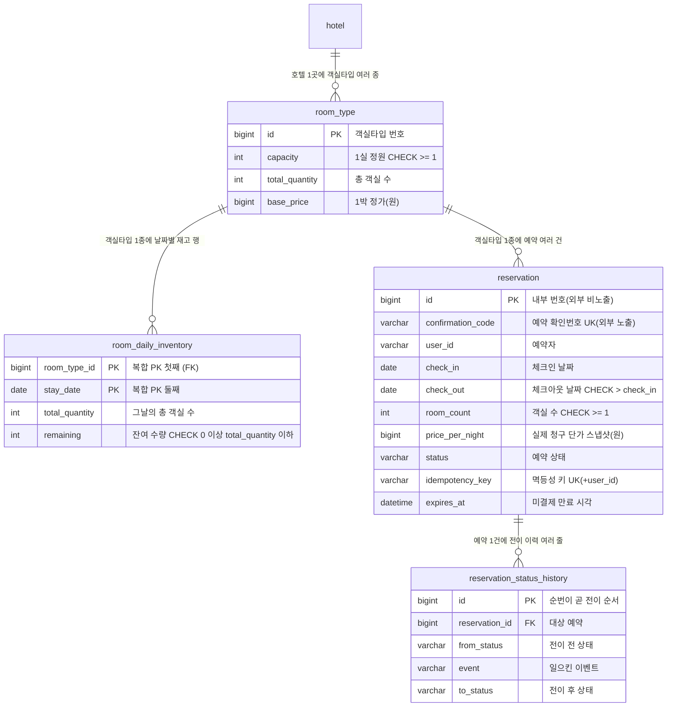
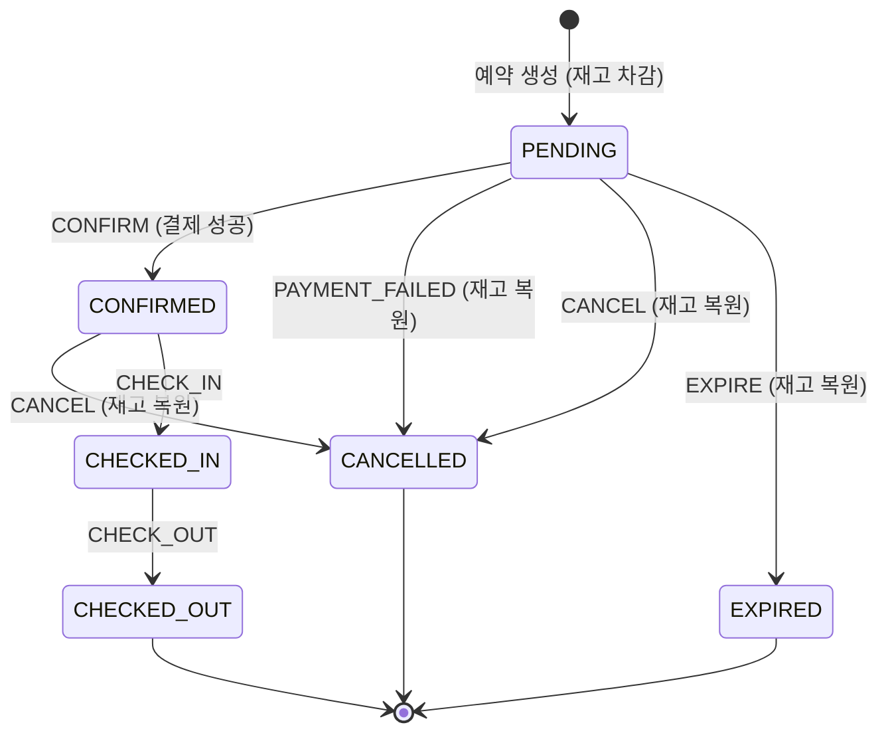
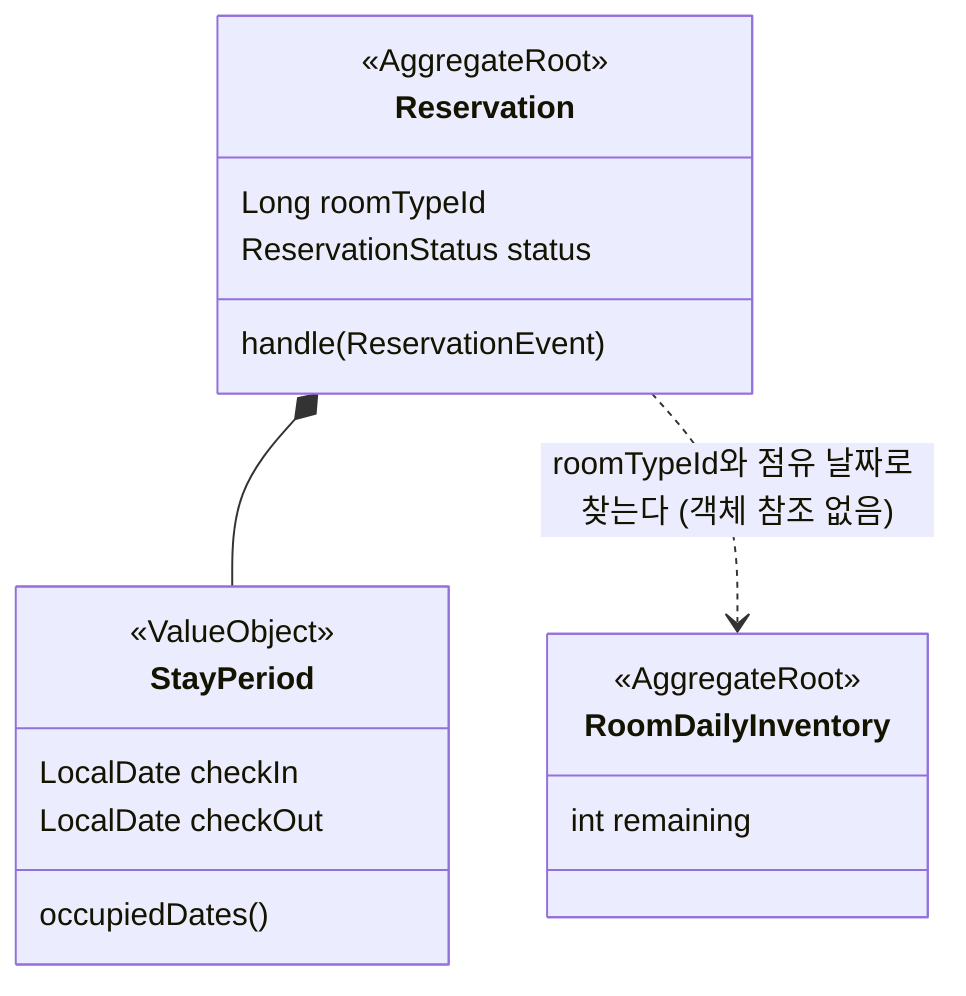
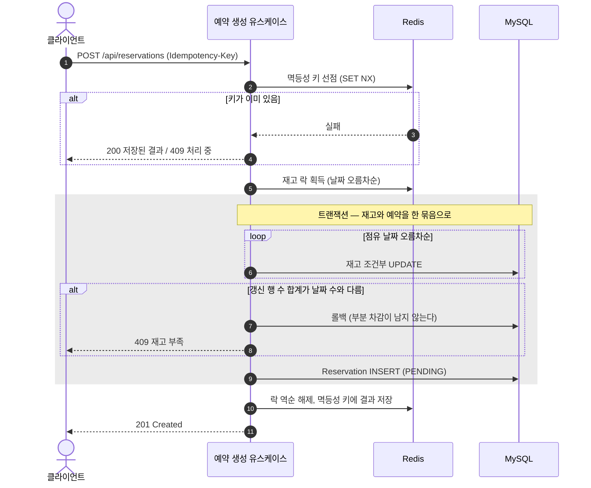

# 설계

- 상태: **구현 완료 반영** (2026-08-16). 수치는 실측이다
- 범위: 예약 코어 + 객실 검색. 선착순 특가는 범위에서 뺐다([ADR-0058](../decisions/ADR-0058-선착순-특가-폐기.md))

이 문서는 **무엇을 왜 그렇게 설계했는지**를 설명한다. 결정의 목록이 아니라 하나의 논증으로 썼다. 과정 기록과 대안 검토는 `docs/spec/`과 `docs/decisions/`에 있다.

---

## 1. 푸는 문제

숙박 예약 시스템의 어려움은 CRUD가 아니다. **잔여 1실을 두 사람이 같은 순간에 예약할 때** 드러난다.

순진한 구현은 이렇게 생겼다.

```
1. 잔여 재고를 읽는다        → 1실 남음
2. 충분한지 판단한다          → 충분하다
3. 차감하고 예약을 만든다      → 0실
```

두 요청이 1번을 동시에 실행하면 **둘 다 "1실 남음"을 읽고 둘 다 성공한다.** 없는 방이 팔린다. 인기 날짜나 프로모션 오픈 순간에는 수백 요청이 같은 재고를 두드리므로 이건 예외 상황이 아니라 기본 상황이다.

같은 성질의 문제가 셋 더 있다.

| 문제 | 언제 생기는가 | 방치하면 |
|---|---|---|
| **중복 요청** | 사용자 더블클릭, 타임아웃 후 클라이언트 재시도 | 한 사람이 예약 두 건을 갖는다 |
| **이중 복원** | 취소와 만료가 같은 예약에 동시에 도달 | 재고를 두 번 되돌려 **팔 수 있는 방보다 많은 방**이 생긴다 |
| **상태 전이 누수** | 사용자가 결제하는 순간 만료 스케줄러가 돈다 | 확정된 예약의 재고가 복원되어 **판 방이 다시 팔린다** |

이 넷을 **말이 아니라 수치로 막는 것**이 이 설계의 목표다.

## 2. 재고를 어떻게 모델링했는가

동시성 제어를 하려면 **경합의 대상이 되는 행이 무엇인지가 먼저 정해져야 한다.**

재고를 "9월 1일~4일 3박에 몇 실 남음"처럼 기간 단위로 다루면 겹치는 기간마다 판정이 달라져 어떤 행을 잠글지 정할 수 없다. 그래서 **`(객실타입, 날짜)` 한 줄에 잔여 수량 하나**를 둔다. 3박 예약은 세 줄을 각각 1씩 깎는다. 실제 OTA들이 쓰는 모델과 같다.

개별 객실 호수는 다루지 않는다. 판매는 타입별 수량으로 하고 호수 배정은 체크인 때 프런트가 한다 — 이것도 업계 표준의 분리다.



세 가지가 이 그림에서 의도적이다.

| 선택 | 왜 |
|---|---|
| `room_daily_inventory`만 **자연키 복합 PK** | 접근 경로가 오직 `(객실타입, 날짜)` 하나다. 대리키를 두면 차감 UPDATE 한 번이 세컨더리 인덱스와 클러스터드 레코드 **두 곳을 잠근다.** 자연키면 한 곳만 잠그고 탐색도 한 번이다. 경합이 전제인 행에서 이건 그냥 이득이다 |
| `total_quantity`를 재고 행에 **복사** | `remaining <= total_quantity` CHECK 제약은 같은 행 안에서만 표현할 수 있다. 이 제약이 이중 복원의 최후 방어선이다 |
| 예약이 재고를 **객체로 참조하지 않음** | `roomTypeId`만 든다. JPA 연관을 타고 의도치 않은 락과 쿼리가 나가면 동시성 실험 자체가 오염된다 |

`check_out`은 점유하지 않는다. 9/1 체크인, 9/4 체크아웃이면 재고를 깎는 날짜는 9/1·9/2·9/3 셋이다. 여기서 하루를 더하면 앞 손님의 체크아웃일에 뒷 손님이 체크인하는 **백투백 예약**이 서로를 밀어낸다.

## 3. 답: 조건부 UPDATE 세 줄

1절의 순진한 구현이 깨진 이유는 **읽기·판단·쓰기가 세 단계로 나뉘어 그 사이에 끼어들 틈이 있었기 때문이다.** 그러면 세 단계를 한 단계로 줄이면 된다. 판단 조건을 SQL의 `WHERE`에 넣는다.

```sql
-- (1) 재고 차감. 갱신 행 수가 0이면 그 날짜가 부족했던 것이다
UPDATE room_daily_inventory
   SET remaining = remaining - :count
 WHERE room_type_id = :roomTypeId AND stay_date = :date
   AND remaining >= :count;

-- (2) 상태 전이. 갱신 행 수가 0이면 경합에서 진 것이다
UPDATE reservation
   SET status = :next
 WHERE id = :id AND status = :expected;

-- (3) 재고 복원. (2)가 1을 반환했을 때만 실행한다
UPDATE room_daily_inventory
   SET remaining = remaining + :count
 WHERE room_type_id = :roomTypeId AND stay_date = :date
   AND remaining + :count <= total_quantity;
```

이 셋이 F01 동시성 제어의 전부다. 락도 재시도도 없이 **승패가 한 번에 갈린다.** 두 요청이 동시에 도착해도 DB가 행 단위로 직렬화하므로 하나만 1을 받고 다른 하나는 0을 받는다.

**갱신 행 수를 확인하는 것이 이 설계의 전부다.** `@Modifying` 메서드의 반환값을 버리는 순간 모든 방어가 무너진다. 3박 예약이면 반환값 합계가 3이어야 하고, 아니면 트랜잭션을 롤백한다. 그래서 **어느 하루라도 부족하면 앞 날짜의 차감분도 함께 되돌아가고 부분 차감이 남지 않는다.**

낙관락(`@Version`)은 쓰지 않았다. 낙관락은 충돌 시 예외를 던지고 재시도하는 방식이라 **경합이 드물 때** 유리한데, 이 시스템의 전제는 정확히 반대다. 인기 객실 하나에 수백 요청이 몰리는 상황에서 낙관락을 쓰면 대부분이 충돌 예외를 맞고 재시도 폭풍이 인다. 게다가 재고 차감은 "현재 값이 무엇이든 충분하기만 하면 깎는다"라서 버전 비교 자체가 불필요한 제약이다.

## 4. 3층 방어, 그리고 그것을 증명하는 방법

조건부 UPDATE만으로도 정합성은 지켜진다. 그래도 층을 셋으로 둔다.

| 층 | 수단 | 무엇을 하는가 | 뚫리면 |
|---|---|---|---|
| 1차 | Redis 분산락 | 경합을 **DB 앞에서** 줄여 롤백과 재시도를 아낀다 | 2차가 막는다 |
| 2차 | 조건부 UPDATE | 원자성을 보장한다. **정합성의 실제 주인** | 3차가 막는다 |
| 3차 | DB 제약 (CHECK·UNIQUE) | 잘못된 데이터의 저장 자체를 거부한다 | 없다. 최후 방어선 |

**여기서 중요한 건 층을 셋 뒀다는 사실이 아니라, 위 층이 뚫렸을 때 아래 층이 실제로 잡는다는 것을 증명했다는 점이다.** 증명하지 않은 다층 방어는 층이 하나인 것과 같다. 실제로 그렇게 동작하는지 아무도 모르기 때문이다.

그래서 **각 층을 개별로 끌 수 있게 만들었다.**

| 실험 | 끄는 것 | 조건 | 기대 | 결과 |
|---|---|---|---|---|
| **K2** | Redis 분산락 (`PMS_LOCK_ENABLED=false`) | 잔여 10, 100스레드 | 성공 정확히 10, 잔여 0 | **통과 — 성공 10, 잔여 0** |
| **K4** | Redis 멱등 저장소 | 같은 키로 50 동시 요청 | 예약 정확히 1건 | **통과 — 예약 1건** |

K2가 통과하면 **Redis가 죽어도 초과 판매가 나지 않는다**는 뜻이고, K4가 통과하면 **Redis가 죽어도 중복 예약이 생기지 않는다**는 뜻이다. 이 두 실험이 통과하지 못하면 3층 방어라는 표현은 거짓이다.

**둘 다 통과했다.** 그래서 이 문서는 "Redis로 동시성을 제어했다"고 쓰지 않는다. **Redis는 비용을 줄이고, 정합성은 DB가 지킨다.** 부하테스트에서 관측된 거절 190건 중 148건이 락 대기 초과였는데, 그 148건은 **락이 없었다면 DB까지 갔다가 재고 부족으로 돌아갔을 요청**이다. 락이 하는 일이 그것이다.

3차 방어선은 CHECK 제약이다. 도메인 객체를 우회해 네이티브 SQL로 직접 위반을 시도해서 실제로 거부되는지 확인한다. 값 객체 생성자에서 먼저 막히면 CHECK가 살아 있는지 알 수 없기 때문이다.

| 제약 | 막는 것 |
|---|---|
| `remaining >= 0` | 초과 판매 |
| `remaining <= total_quantity` | **이중 복원** (5절) |
| `room_count >= 1` | `room_count = -5`면 차감 UPDATE의 `remaining >= :count`를 **통과하면서 재고를 늘린다** |
| `check_out > check_in` | 점유 날짜가 빈 목록이 되어 재고를 하나도 안 깎고 예약이 생긴다 |
| `UNIQUE (user_id, idempotency_key)` | Redis 장애 시의 중복 예약 |
| `PRIMARY KEY (room_type_id, stay_date)` | 재고 행 분열 |

같은 규칙을 값 객체와 CHECK 두 곳에서 검증한다. 이건 중복이 아니라 층이다. 값 객체는 정상 경로를 빠르게 막고, CHECK는 SQL이 직접 실행되는 경로(마이그레이션, 수동 조작, 벌크 UPDATE)를 막는다.

## 5. 재고 복원은 상태 전이의 *결과*다

이 설계에서 가장 중요한 판단이다.

재고를 되돌려야 하는 상황은 셋이다. **사용자 취소**, **결제 실패**, **미결제 만료**. 그런데 되돌릴 기회는 예약 하나당 **한 번뿐이다.** 셋이 동시에 도착하면 어떻게 되는가.

순진하게 짜면 각자 "이 예약 취소됐네" 하고 각자 재고를 +1 한다. 잔여가 총 객실 수를 넘고, **팔 수 있는 방보다 많은 방이 생긴다.** 최악인 점은 이게 **아무 신호도 내지 않는다는 것**이다. 예외도 없고 로그도 없다. 초과 판매는 손님이 항의해서 발견되지만 이건 아무도 발견하지 못한다.

해법은 새 장치를 만드는 것이 아니라 **이미 있는 것에 기대는 것**이다.

> **재고 복원을 상태 전이의 병렬 동작이 아니라 *결과*로 만든다.**

셋 중 누가 먼저 오든 먼저 `reservation` 행의 상태를 바꾸려 시도한다. 그건 조건부 UPDATE이고, **정확히 하나만 갱신 행 수 1을 받는다.** 나머지는 0을 받는다. 그리고 복원 코드는 **1을 받은 경로에만** 있다.

```
취소 요청 ─┐
결제 실패 ─┼─→ UPDATE reservation SET status=... WHERE id=? AND status=?
만료 처리 ─┘         │
                     ├─ 1건 반환 → 재고 복원 + 이력 기록   ← 오직 하나만 여기 온다
                     └─ 0건 반환 → 아무것도 하지 않는다
```

"정확히 한 번"을 보장하는 별도 장치가 필요 없다. **동시성 제어가 이미 하고 있는 일에 복원을 얹었을 뿐이다.** 멱등 재요청(이미 취소된 예약을 또 취소)도 같은 문에 걸린다 — 갱신 행 수가 0이므로 성공 응답은 돌려주되 재고는 건드리지 않는다.

복원 UPDATE에 `remaining + :count <= total_quantity` 조건을 **한 번 더** 거는 것은 위 논리가 어딘가에서 깨졌을 때를 위한 감지 장치다. 복원 갱신 행 수가 점유 날짜 수와 다르면 트랜잭션을 롤백하고 로그를 남긴다. **조용히 넘기지 않는다.** 조용히 넘기면 잘못된 재고가 그대로 팔린다.

이 보장은 **확장 지점에 붙는 쪽에도 그대로 상속된다.** 반납 훅이 같은 자리에서 호출되므로, 붙는 쪽은 "내 반납이 두 번 불릴까"를 스스로 풀지 않아도 된다 (8절).

검증은 잔여 수량이 아니라 **이력 줄 수**로 한다. 잔여만 보면 "두 번 깎고 두 번 되돌린" 경우를 놓치기 때문이다.

```sql
-- 예약당 복원 이벤트가 두 줄 이상이면 이중 복원이다. 결과가 비어야 통과
SELECT reservation_id, COUNT(*)
  FROM reservation_status_history
 WHERE event IN ('CANCEL', 'PAYMENT_FAILED', 'EXPIRE')
 GROUP BY reservation_id HAVING COUNT(*) > 1;
```

## 6. 상태 전이: 표 하나가 규칙 전부

예약은 확정·취소·만료·체크인·체크아웃으로 갈라진다. 이 규칙이 `if-else`로 코드 여기저기에 흩어져 있으면 상태를 하나 추가할 때마다 버그가 생기고, 무엇보다 **규칙을 문서로 증명할 수 없다.**

그래서 `(현재 상태, 이벤트) → 다음 상태` 맵을 두고 **그 표만 판단한다.** `setStatus` 같은 세터는 만들지 않는다. 외부는 이벤트만 던진다.



상태 6개 × 이벤트 6개 = **36칸을 전부 채웠다.** 빈칸을 남기면 "금지인지 미정인지"를 구현자가 그때그때 판단하게 되고, 그게 버그가 된다.

| 구분 | 칸 수 | 동작 |
|---|---|---|
| 허용 전이 | 7 | 다음 상태로 이동 |
| 멱등 성공 | 6 | 상태를 바꾸지 않고 200. **재고도 건드리지 않는다** |
| 거부 | 23 | 409 `INVALID_STATE_TRANSITION` |

**멱등 성공과 거부를 나누는 기준**이 설계 판단이다. 같은 이벤트가 두 번 오는 것은 재시도라서 정상 상황이므로 조용히 성공시킨다. 하지만 전부 조용히 넘기면 진짜 오류를 놓친다. 예를 들어 이렇게 갈랐다.

- `EXPIRED` 상태에서 `CANCEL` → **거부.** "이미 취소됨"이 아니라 "만료됨"이라고 답해야 한다. 조용히 성공시키면 사용자는 자기 예약이 살아 있었다고 오해한다.
- `CANCELLED` 상태에서 `EXPIRE` → **거부.** 이미 재고를 되돌린 예약이다. 여기서 멱등 성공을 주면 "또 되돌려도 되는 것처럼" 보이는 코드가 생긴다.

이 표는 `@pytest.mark.parametrize`로 **36칸을 전수 검증한다**(`tests/test_transitions.py`). 표를 고치면 이 테스트가 먼저 깨지며, 그게 이 테스트의 목적이다. 그리고 전이 표 등록 개수를 상수로 박은 테스트를 따로 둔다 — 전수 테스트가 표를 *읽어서* 검증하면 표 자체가 잘못돼도 같이 잘못되기 때문이다.

**이 표에는 알고 남긴 구멍이 하나 있다.** `CONFIRMED`에서 나가는 출구가 취소와 체크인뿐이라, 손님이 오지 않으면 그 예약은 기간이 지나도 `CONFIRMED`로 남는다. `NO_SHOW` 상태를 추가하면 닫히는 구멍이지만 일정 판단으로 잘랐다. 자세한 것은 9.5절에 적었다.

## 7. 멱등성: 빠른 길과 정답

결제 버튼을 두 번 누르거나 타임아웃 후 클라이언트가 재시도하면 같은 요청이 두 번 온다. "안 일어나겠지"가 아니라 **정상 상황으로 설계한다.**

멱등성 키가 필요한 연산은 **예약 생성 하나뿐이다.** 확정·취소·만료·체크인은 상태 전이 자체가 멱등하다(6절). 이미 목표 상태면 갱신 행 수가 0이고 그때 재고를 건드리지 않으므로 별도 키가 필요 없다.

```
1. Redis에 SET idem:{userId}:{key} = PROCESSING NX EX 600
2. 성공 = 최초 요청 → 처리 후 결과를 저장
3. 실패 = 저장된 결과가 있으면 200 + 그 결과 / 아직 처리 중이면 409
```

**두 층이다.** Redis는 빠른 길이고 **DB의 `UNIQUE (user_id, idempotency_key)`가 정답이다.** Redis가 죽으면 같은 요청이 두 번 처리되는데, 두 번째 INSERT가 이 유니크 제약에 걸린다. 유스케이스는 그 위반을 잡아 **기존 예약을 조회해 200으로 돌려준다.** 500으로 던지지 않는다. K4가 이걸 검증한다.

**재요청에 409가 아니라 200을 주는 이유.** 멱등성의 정의는 "같은 요청이 두 번 와도 결과가 한 번과 같다"인데, 여기서 결과란 서버 상태만이 아니라 **클라이언트가 받는 응답까지**다. 재요청에 409를 주면 클라이언트는 실패로 읽고 **또 재시도한다.** 재시도가 재시도를 부르는 구조가 되고, 그건 정확히 멱등성이 막으려던 상황이다. 사용자 화면에는 예약이 성공했는데 에러가 뜬다.

최초는 201, 재요청은 200으로 나눈다. 클라이언트는 둘 다 성공으로 처리하면 되고, 관측과 부하테스트에서는 **실제 생성 건수와 재시도 건수를 나눠 셀 수 있다.**

실패 처리도 갈랐다. **입력 오류(400)면 키를 지우고, 재고 부족(409)이면 키를 남긴다.** 잘못된 요청은 고쳐서 다시 보내는 것이 정상이고, 재고 부족은 같은 키로 다시 보내도 결과가 같기 때문이다.

## 8. 경계 설계와 의존 방향

코드를 **재고 구역**과 **예약 구역**으로 나눈다. 각 구역은 자기 규칙만 책임진다.



| 구역 | 지키는 규칙 |
|---|---|
| 재고 | 잔여 수량이 0 밑으로도, 총 객실 수 위로도 가지 않는다 |
| 예약 | 상태는 전이 표대로만 바뀐다. 종료 상태에서 나가지 않는다 |

**한 트랜잭션에서는 애그리거트 하나만 고친다**는 원칙에 예외를 하나 둔다. **예약 생성**이다. "재고 하나 줄이기"와 "예약서 한 장 만들기"는 반드시 같이 성공하거나 같이 실패해야 한다. 하나만 성공하면 방은 줄었는데 예약이 없거나, 예약은 있는데 방이 안 줄어든 상태가 된다. 그래서 이 경우에만 두 구역을 한 트랜잭션으로 묶는다. **예외를 둔다는 사실과 그 근거를 문서에 남기는 것**이 원칙을 지키는 방식이다.

### 확장 지점이 의존을 뒤집는다

예약에 무언가를 묶어야 하는 기능이 있다고 하자. 선착순 특가가 그런 예다 — 특가 사용권을 예약에 붙여야 하고, 예약이 언제 생기고 언제 반납되는지를 알아야 한다.

> **특가 자체는 범위에서 뺐다**([ADR-0058](../decisions/ADR-0058-선착순-특가-폐기.md)). 막는 방법이 예약 재고와 같은 조건부 UPDATE라 증명이 겹쳤기 때문이다. **다만 확장 지점은 남겨뒀다** — 구현체가 없다고 자리를 지우면, 이 설계가 확장에 열려 있다는 것을 보일 수 없다.

여기서 예약 코드가 특가 코드를 직접 부르면 **의존이 `예약 → 특가`로 생긴다.** 예약이라는 핵심이 부가 기능을 알게 되고, 특가를 떼면 예약이 컴파일조차 되지 않는다. 그래서 반대로 한다.

> **인터페이스는 예약 쪽이 정의하고, 특가 쪽이 구현한다.**

```java
/** 값비싼 작업 전에 요청을 거를 기회. 분산락을 잡기 전에 호출된다. */
public interface ReservationPreCheckHook {
    void check(CreateReservationCommand command);
}

/** 예약이 만들어진 직후, 같은 트랜잭션에서 호출된다. */
public interface ReservationCreationHook {
    void onCreated(Long reservationId, CreateReservationCommand command);
}

/** 상태 전이가 성공했을 때만, 같은 트랜잭션에서 정확히 한 번 호출된다. */
public interface ReservationReleaseHook {
    void onReleased(Long reservationId, ReservationStatus from, ReservationEvent event);
}

/** 할인 참조를 실제 적용 단가로 해석한다. 해석할 수 없으면 빈 값. */
public interface DiscountResolver {
    Optional<AppliedDiscount> resolve(DiscountRef ref, Long roomTypeId, StayPeriod period);
}
```

유스케이스는 이들을 `List<...>`로 주입받아 호출한다. **구현이 하나도 없으면 빈 리스트라 아무 일도 일어나지 않는다.** 조건부 빈 같은 장치 없이 특가 기능의 유무와 무관하게 예약이 동작한다.

세 가지가 이 구조에서 중요하다.

**확장 기능도 3층 방어를 그대로 쓴다.** 사전 검사 훅이 **분산락보다 앞에** 놓이는 것이 그래서다. 부가 기능이 자기 1차 방어선을 놓을 자리가 없으면 매진 요청이 락과 트랜잭션을 다 열고 나서야 거부되고, 그 기능만 2층 방어가 된다. 확장 지점의 위치는 편의가 아니라 **방어선의 배치**다.

**반납 훅은 5절의 보장을 그대로 상속한다.** 상태 전이 UPDATE가 1건 성공한 바로 그 자리에서 불리므로, 구현자는 "내 훅이 두 번 불릴까"를 스스로 풀 필요가 없다. 동시성 제어가 이미 한 일을 물려받는다.

**해석(`DiscountResolver`)은 질의이고 훅은 명령이다.** 순서는 `해석 → 가격 확정 → 예약 INSERT → 훅`이다. 가격이 INSERT 전에 확정돼야 하기 때문이다. 둘 사이에 특가가 매진되면 훅의 조건부 UPDATE가 0건을 반환하고 트랜잭션 전체가 롤백된다 — 가격만 할인가로 잡히고 재고는 안 깎이는 상태가 생길 수 없다.

`price_per_night`에는 **실제로 청구한 단가**를 저장한다. 특가면 특가다. 정가를 넣으면 예약서와 사용권의 금액이 달라지고, 가격 스냅샷을 저장한 이유(당시 가격은 사후에 복원할 수 없다) 자체가 무너진다.

### 예약 생성의 전체 흐름



락 순서가 두 곳에서 중요하다. **락은 트랜잭션 밖에서 잡고 커밋한 뒤에 푼다.** 반대로 하면 커밋 전에 락이 풀려 다른 요청이 아직 반영되지 않은 재고를 읽는다. 그리고 **여러 날짜의 락과 DB 행 락 모두 날짜 오름차순으로 잡는다.** 모든 요청이 같은 순서로만 잠그면 순환 대기가 생길 수 없다.

## 8-B. 밖으로 낸 API 전부

만든 것이 이게 전부입니다. 앱을 띄우면 http://localhost:8000/docs 에서 같은 목록을 볼 수 있습니다.

| 메서드 · 경로 | 하는 일 | 필요한 헤더 |
|---|---|---|
| `GET /api/hotels` | 호텔과 객실타입 목록 (100곳) | 없음 |
| `GET /api/availability` | 기간 내내 비어 있는 객실타입과 최소 잔여 | 없음 |
| `POST /api/reservations` | 예약 생성 — **재고를 깎는 유일한 입구** | `X-User-Id` + **`Idempotency-Key`** |
| `GET /api/reservations` | 내 예약 목록 | `X-User-Id` |
| `GET /api/reservations/{코드}` | 예약 하나 조회 | `X-User-Id` |
| `POST /api/reservations/{코드}/confirm` | 모의 결제 후 확정 | `X-User-Id` |
| `POST /api/reservations/{코드}/cancel` | 취소 — **재고를 되돌린다** | `X-User-Id` |
| `POST /api/reservations/{코드}/check-in` | 투숙 시작 | `X-User-Id` |
| `POST /api/reservations/{코드}/check-out` | 투숙 종료 | `X-User-Id` |
| `POST /api/internal/reservations/expire` | 미결제 만료 처리 (스케줄러 대신 호출로 돌린다) | 없음 |
| `GET /api/internal/config` | 지금 걸려 있는 설정 값 확인 (부하테스트가 스위치를 실물로 검증하는 데 쓴다) | 없음 |
| `GET /health` | 살아 있는지 | 없음 |

이 표에서 읽을 것이 셋입니다.

**재고를 바꾸는 경로는 셋뿐입니다** — 생성이 깎고, 취소와 만료가 되돌립니다. 조회는 어느 것도 재고를 건드리지 않습니다.

**멱등성 키를 요구하는 곳은 예약 생성 하나뿐입니다.** 나머지가 안 받는 것은 빠뜨린 게 아닙니다. **상태 전이는 표가 재실행을 흡수합니다** — 취소된 예약에 취소를 또 던지면 성공으로 답하되 상태도 재고도 건드리지 않습니다(6장의 멱등 6칸). 그래서 같은 취소가 몇 번 도착해도 재고는 한 번만 돌아옵니다.

예약 생성만 다릅니다. 아직 아무 상태도 없는 데서 새 행을 만드는 일이라 **표가 막아줄 것이 없습니다.** 그래서 거기만 별도 장치를 씁니다. **막을 수단이 이미 있는 곳에 장치를 하나 더 얹지 않았다**는 것이 이 차이의 뜻입니다.

**사용자 식별은 `X-User-Id` 헤더입니다. 검증하지 않으므로 인증이 아닙니다** — 이 과제의 관심사가 아니라고 판단해 뺐고, 그 판단을 별도 기록으로 남겼습니다(ADR-0006).

## 9. 알고 있는 한계

**"완벽하다"고 쓰는 대신 어디가 약한지 적는다.** 아래는 전부 설계 단계에서 발견해 의도적으로 남긴 것이며, 몰라서 빠진 것이 아니다.

### 9.1 예약 확정 중 크래시는 보상되지 않는다

결제를 호출하는 것은 외부 호출이라 **트랜잭션 밖에서** 한다. 트랜잭션 안에서 외부를 부르면 상대가 느릴 때 커넥션과 락을 잡은 채 대기하기 때문이다. 그런데 이 선택에는 틈이 있다.

```
결제 요청 → 승인됨 → [여기서 프로세스가 죽으면] → 상태 전이 UPDATE
```

**결제는 성공했는데 예약은 `PENDING`으로 남는다.** 그 예약은 만료 스케줄러가 `EXPIRED`로 옮기고 재고를 되돌리지만, **결제된 돈은 아무도 되돌리지 않는다.** 우리 쪽에 결제 기록이 없기 때문이다.

이 틈을 이번에 닫지 않았다. 닫으려면 결제 요청 **전에** 시도를 원장에 기록하고(트랜잭션 1), 결제 후 결과를 기록하고(트랜잭션 2), 원장과 PG를 대조하는 정산 배치가 필요하다. 모의 결제라 실제로 잃는 돈이 없고, 이 구조를 만드는 비용이 이 과제의 증명 대상을 넘어선다. **실 PG를 붙인다면 반드시 필요하다.**

### 9.2 `checkOut > today`만 DB 최후 방어선이 없다

예약 생성은 `checkOut > today`를 요구한다. 이미 끝난 숙박은 예약할 수 없되, **체크인일이 지났고 체크아웃일이 남은 "진행 중인 투숙"은 허용한다.** 체크인이 바로 그 구간의 사건이기 때문이다.

다른 규칙은 전부 CHECK 제약이 받쳐주는데(4절) **이 규칙만 애플리케이션 검증 한 겹이다.** MySQL의 CHECK 제약에는 `CURDATE()` 같은 비결정적 함수를 쓸 수 없어 원리적으로 불가능하다. 트리거로는 가능하지만 디버깅이 어렵고 마이그레이션에서 관리하기 나빠 더 나쁜 선택이다.

그래서 **이 규칙은 테스트가 유일한 방어선이다.** "3층 방어"라는 표현에 예외가 하나 있다는 뜻이며, 감추지 않고 적어둔다.

이 규칙은 불변식이 아니라 **생성 시점 선행 조건**으로 두었다. 시간이 흐르면 정상 예약도 `checkOut <= today`가 되기 때문이다. 불변식에 넣으면 어제 만든 멀쩡한 예약이 오늘 위반이 된다.

### 9.3 날짜 단위 다중 락은 정렬 하나에 의존한다

분산락을 `(객실타입, 날짜)` 단위로 잡으므로 3박 예약이면 락 3개를 잡는다. 객실타입 단위 락 하나가 훨씬 단순하지만, 그러면 **겹치지 않는 날짜의 예약까지 전부 직렬화되어** 인기 객실에서 처리량이 락 하나의 속도로 수렴한다.

대신 위험이 생긴다. **정렬을 한 곳이라도 빠뜨리면 데드락이고, 이건 재현이 어려운 종류의 버그다.** 순서가 뒤섞인 두 요청이 서로를 물어야만 나타난다.

그래서 구조로 막았다. **락 키 목록을 만드는 코드를 한 곳으로 모으고, 재고 차감 UPDATE의 실행 순서도 같은 목록을 쓴다.** 두 곳이 다른 목록에서 순서를 얻으면 그 자체가 데드락 원인이 된다. 정렬은 코드에 명시적으로 남기고, 정렬을 지우면 깨지는 테스트를 둔다. K8이 겹치는 기간을 반대 순서로 요청해 데드락 0건을 확인한다.

락 포트는 `acquireAll(List<String> keys, ...)` 형태라, 위험이 실측으로 드러나면 **키 목록을 만드는 한 곳만 바꿔** 객실타입 단위 단일 락으로 되돌릴 수 있다.

### 9.4 그 밖에 의도적으로 남긴 것

| 한계 | 어떻게 다뤘는가 |
|---|---|
| 시드 범위 밖 날짜는 "판매 전"과 "매진"이 구분되지 않는다 | 둘 다 재고 부족으로 응답한다. 잘못 파는 것보다 안 파는 쪽이 안전하다 (fail-closed) |
| 같은 멱등성 키에 다른 내용이 오면 검사하지 않는다 | 저장된 결과를 그대로 돌려준다. 정석은 페이로드 해시 비교 후 422다 |
| 금지된 전이 **시도**는 DB에 남지 않는다 | 거부는 롤백과 함께 사라진다. 다만 이력의 `DISTINCT (from, event, to)`가 허용 7행의 부분집합이라는 것, 즉 **표 밖 전이가 실제로 일어나지 않았다**는 운영 데이터로 증명된다 |
| 취소 수수료·취소 마감이 없다 | 요금·환불·정산이 딸려 오며 동시성과 무관하다. 체크인 전이면 전액 취소 가능으로 단순화했다 |

### 9.5 `CONFIRMED`에서 자동으로 나가는 출구가 없다

상태 표(6절)에서 `CONFIRMED`를 벗어나는 길은 **취소와 체크인 둘뿐이다.** 손님이 오지 않으면 그 예약은 숙박 기간이 다 지나도 `CONFIRMED`로 남는다. 종료 상태에 도달하지 않는 경로가 있는 상태머신은 완결되지 않은 상태머신이고, 이것을 알고 남겼다.

닫는 방법은 알려져 있다. `CONFIRMED --NO_SHOW--> NO_SHOW` 전이와 하루 주기 스케줄러를 두면 된다. **일정 판단으로 잘랐다.** 상태 1개·이벤트 1개·전이 1개·스케줄러 1개가 늘고 전수 표가 36칸에서 49칸이 되는데, 남은 시간에서 이건 순수한 추가 작업이었다. 잘린 자리는 "손님이 오지 않으면 운영자가 취소로 처리한다"는 가정으로 메운다.

**자동 취소 스케줄러로 대신하지 않은 이유를 밝혀둔다.** 쉬워 보이는 우회로지만 틀린 선택이다. 취소는 재고를 복원하므로, 노쇼를 자동으로 취소 처리하면 **노쇼 객실이 자동으로 다시 팔린다.** 요금은 받고 방도 되파는 셈이라 "노쇼 객실을 재판매하지 않는다"는 원칙과 정면으로 어긋난다. 자동 전이를 아예 만들지 않으면 자동 복원도 없어 그 원칙이 그대로 지켜진다. 운영자가 명시적으로 취소하면 재고가 돌아오는데, 그건 사람이 "다시 팔겠다"고 판단한 것이라 모순이 아니다.

**대신 살려둔 것이 있다.** 체크인 조건의 상한 `today < checkOut`은 `NO_SHOW`와 함께 잘리지 않았다. 이건 별개의 구멍이라 — 상한이 없으면 **체크아웃 날짜가 한참 지난 예약도 체크인된다.** 원래 이 상한을 둔 이유 중 하나가 "노쇼 스케줄러가 멈춘 사이의 방어선"이었는데, 스케줄러가 아예 없어지면서 **이 상한이 유일한 방어선이 되어 오히려 더 중요해졌다.**

---

## 부록: 검증 요약

**전체 308개 통과.** 실제 MySQL 8.4·Redis 7.4를 Testcontainers로 띄워 돌렸다. 그중 **22개가 동시성 테스트**다(`pytest -m concurrency`로 그 22개만 따로 돌릴 수 있다).

| 무엇을 증명하는가 | 방법 | 결과 |
|---|---|---|
| 초과 판매가 없다 | K1: 잔여 10 / 100스레드 | **성공 정확히 10** |
| **분산락 없이도** 초과 판매가 없다 | K2: 락을 끄고 K1과 동일 | **성공 정확히 10** — 정합성이 락에 서 있지 않다 |
| 중복 요청이 예약 1건이 된다 | K3: 같은 키 50 동시 | **예약 1건** |
| **Redis 없이도** 중복이 막힌다 | K4: 멱등 저장소를 끄고 K3와 동일 | **예약 1건** — DB 유니크 제약이 사수 |
| 확정·취소 경합에서 하나만 이긴다 | K5: 확정 25 + 취소 25 동시 | **승자 정확히 1** |
| 재고 복원이 정확히 한 번이다 | K6·K10: 이력 줄 수로 검증 | **복원 1회, 이력 1줄** |
| 부분 차감이 남지 않는다 | K7: 가운데 날짜만 잔여 1 | **성공 1건, 앞뒤 날짜 잔여 그대로** |
| 데드락이 없다 | K8: 겹치는 기간을 반대 순서로 | **데드락 0건** |
| 부분 소진 경합이 정확하다 | K9: 잔여 10에 3실씩 → 성공 3, 잔여 1 | **성공 3, 잔여 1** |
| 전이 표 밖 전이가 없다 | 36칸 전수 테스트 + 이력 `DISTINCT` 조회 | **표 밖 전이 0** |

**K2와 K4가 이 설계의 핵심 증거다.** 1차 방어선을 완전히 꺼도 결과가 같다는 것은, **정합성을 지키는 것이 Redis가 아니라 DB의 조건부 UPDATE와 유니크 제약**이라는 뜻이다. Redis가 통째로 죽어도 데이터는 깨지지 않는다. 락과 멱등 저장소는 **비용을 줄이는 장치**이지 정확성의 근거가 아니다.

**K8의 검증 방식도 적어둔다.** 데드락이 0건이라는 것만으로는 방어가 작동한 건지 경합이 없었던 건지 알 수 없다. **날짜 정렬 코드를 지우고 같은 테스트를 돌려 실제로 데드락(MySQL 1213)이 나는 것을 확인한 뒤 되돌렸다.** 방어선이 있다는 것과 그게 실제로 막고 있다는 것은 다른 말이다.

### 부하 규모에서 다시 확인한 것

단위 테스트는 스레드 수십~수백 규모다. 그보다 큰 규모에서도 같은지를 k6로 확인했다. 상세는 `04-부하테스트.md`에 있다.

| | 규모 | 결과 |
|---|---|---|
| 초과 판매 0 | 잔여 10에 200 동시 | 성공 정확히 10, 보존식 차이 0 |
| 중복 예약 0 | 같은 키 1,000회 | 예약 정확히 20 |
| 금지 전이 0 | 취소×확정 300쌍 | 표 밖 전이 0, 이력 405행 전부 허용 표 안 |

**락을 끄고 도는 부하 비교는 실행하지 못했다.** 세션이 중단됐다. K2가 같은 명제를 단위 규모에서 증명하므로 **"락 없이도 안전하다"는 확인됐지만, "락이 처리량에 얼마나 값을 하는가"는 수치가 없다.**
